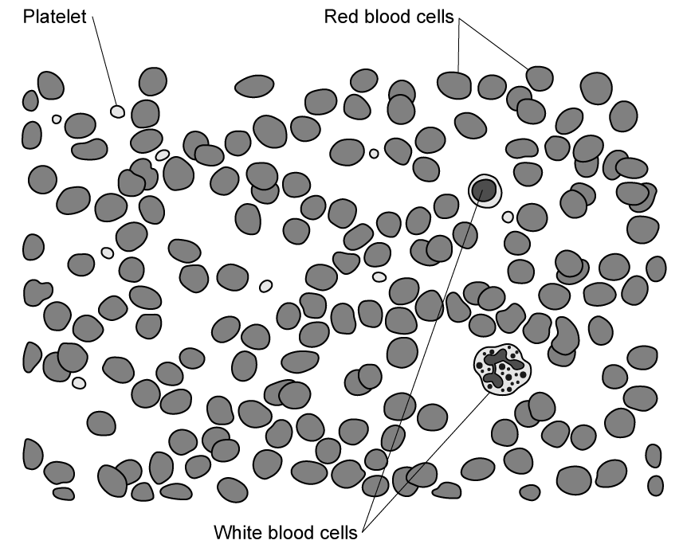
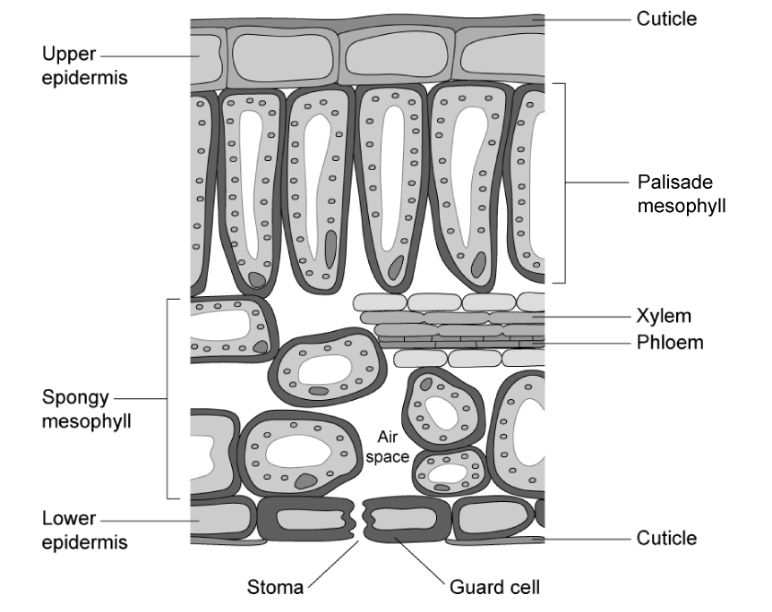
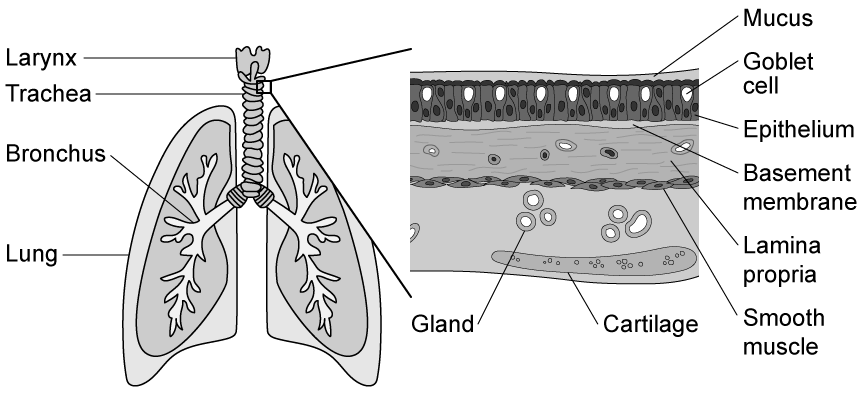
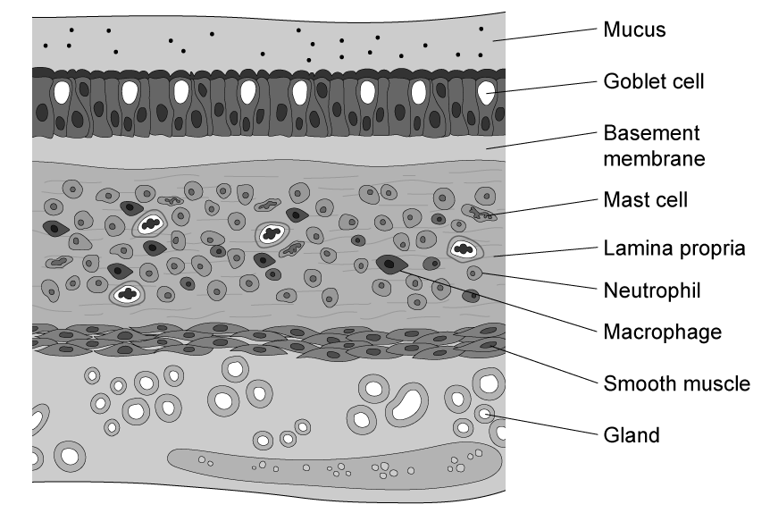
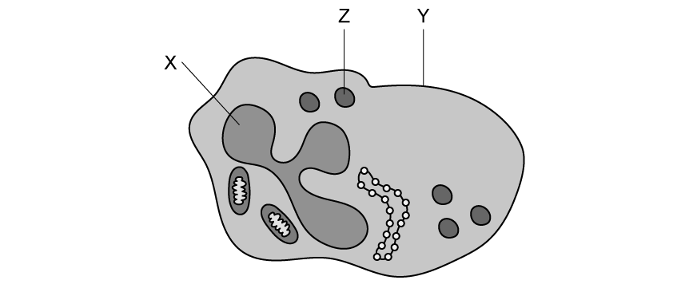
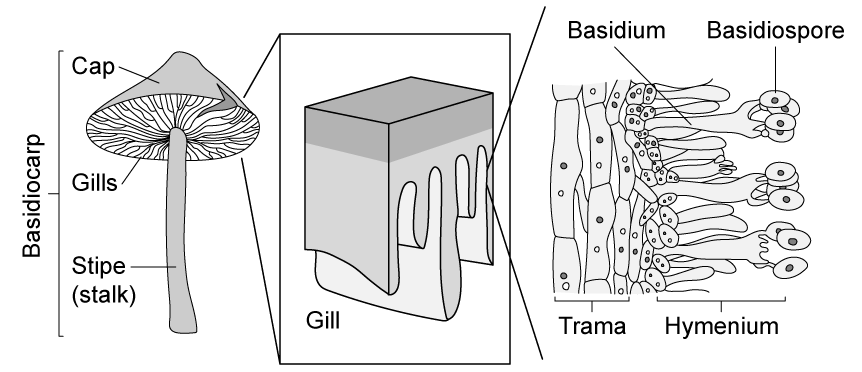
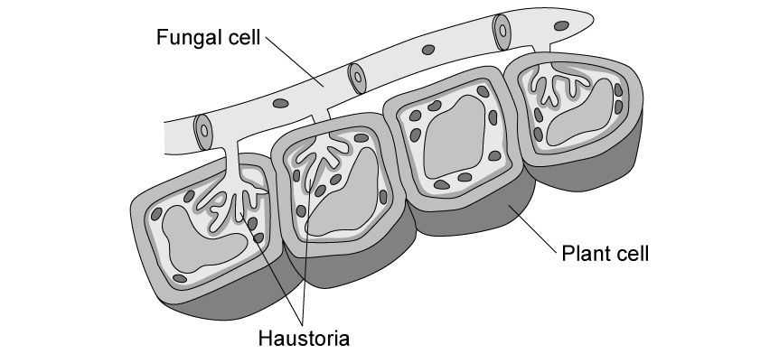
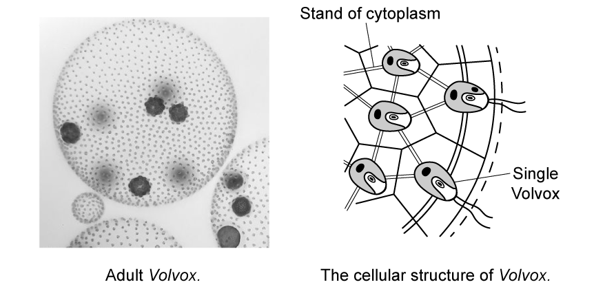
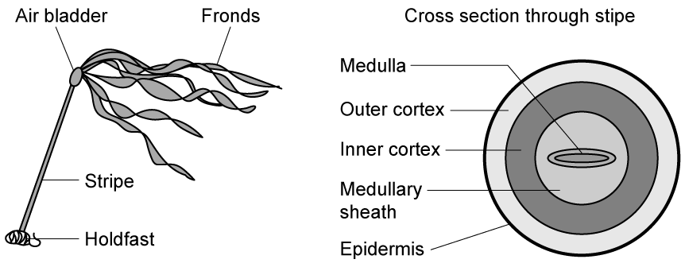
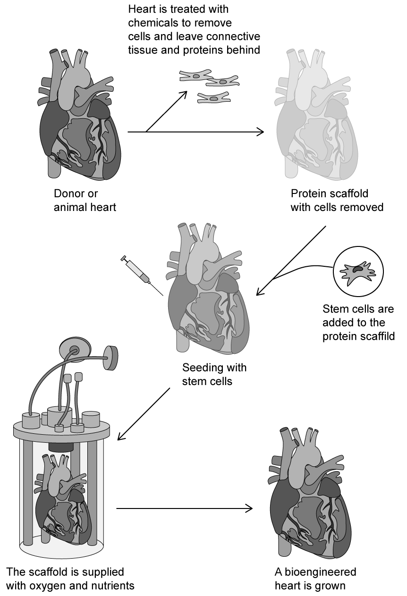

# Exam Questions — Levels of Organisation
**2. Structure & Functions in Living Organisms: Part 1** · Edexcel IGCSE Biology (Modular) (4XBI1) — 24/Unit 1
> Source: [https://www.savemyexams.com/igcse/biology/edexcel/modular/24/unit-1/topic-questions/structure-and-functions-in-living-organisms-part-1/levels-of-organisation/exam-questions/](https://www.savemyexams.com/igcse/biology/edexcel/modular/24/unit-1/topic-questions/structure-and-functions-in-living-organisms-part-1/levels-of-organisation/exam-questions/) · 10 questions · total 105 marks

## Q1 — easy — 7 marks · exam-questions

### 1() — 1 mark — command: which — structured
Which of the following correctly shows the levels of organisation in an organism in order of size from the smallest to the largest?

| **A** | Organelle, cell, organ, tissue, organ system |
|---|---|
| **B** | Organelle, cell, tissue, organ, organ system |
| **C** | Cell, organelle, tissue, organ, organ system |
| **D** | Cell, tissue, organelle, organ, organ system |

### 2() — 2 marks — command: state — structured
State the meaning of the term **organ**.

### 3() — 2 marks — command: name — structured
Name an example of an organ found in the following groups of organisms:

(i) Plants

**(1)**

(ii) Animals

**(1)**

### 4() — 2 marks — command: give — structured
Give two differences between organisms in the plant group and organisms in the animal group.

## Q2 — easy — 7 marks · exam-questions

### 1() — 2 marks — command: state — structured
State the meaning of the term **tissue**.

### 2() — 2 marks — command: name — structured
The diagram below shows an example of an animal tissue.

(i) Name the tissue shown in the image.

**(1)**

(ii) Name the organ system associated with this tissue.

**(1)**

### 3() — 2 marks — command: name — structured
Other than the tissue given in part (b), name two examples of tissues found in an animal.

### 4() — 1 mark — command: state — structured
State why it is not possible for prokaryotic organisms to have tissues.

## Q3 — easy — 10 marks · exam-questions

### 1() — 4 marks — command: identify — structured
The table below contains several structures found in plants.

Complete the table by identifying the level of organisation for each of the structures. One has been done for you.

| **Structure** | **Level of organisation** |
|---|---|
| Shoots | Organ system |
| Leaf |   |
| Chloroplast |   |
| Palisade mesophyll |   |
| Flower |   |

### 2() — 2 marks — command: name — structured
The shoots of a plant are identified in part (a) as an organ system.

Name two examples of organ systems found in animals.

### 3() — 1 mark — command: explain — structured
A plant root is an example of an organ. Plant roots are able to respond to water in the soil by growing towards a water source.

Explain how this demonstrates that plants are living organisms.

### 4() — 3 marks — command: give — structured
Other than any feature given in part (c), give three other characteristics of living organisms.

## Q4 — easy — 6 marks · exam-questions

### 1() — 2 marks — command: draw — structured
The diagram below shows four different levels of organisation and a number of descriptions.

Draw **one** line from each organisation level to the correct description.

### 2() — 1 mark — command: identify — structured
Below are some statements about organelles.

Identify the **incorrect **statement.

| **A** | Organelles are found within cells. |
|---|---|
| **B** | Bacteria contain fewer different organelles than plant cells. |
| **C** | The nucleus is an organelle. |
| **D** | Organelles are small organs. |

### 3() — 3 marks — command: complete — structured
The table below lists some organ systems found in the human body.

Complete the table by naming an organ from each organ system.

| **Organ System** | **Organ** |
|---|---|
| Digestive system |   |
| Circulatory system |   |
| Respiratory system |   |

## Q5 — medium — 9 marks · exam-questions

### 1() — 5 marks — command: name — structured
The image below shows the structure of a leaf in a green plant magnified 220 times.

For the image above:

(i) Name **one **type of organelle visible.

**(1)**

(ii) Name** two** types of cell visible.

**(2)**

(iii) Name** two **types of tissue present.

**(2)**

### 2() — 2 marks — command: explain — structured
Explain why the leaf shown in part (a) is an example of an organ.

### 3() — 2 marks — command: calculate — structured
The leaf image in part (a) measures 6 cm from top to bottom.

Use the formula below to calculate the actual thickness of the leaf. Give your answer in mm.

$\mathrm{Actual} \mathrm{thickness}=\frac{\mathrm{Image} \mathrm{thickness}}{\mathrm{Magnification}}$

## Q6 — medium — 13 marks · exam-questions

### 1() — 4 marks — command: multiple — structured
The diagram below shows the structure of a ciliated epithelial cell from the airways of a mammal.

(i) Name structures **P**, **Q** and **R**.

**(3)**

(ii) State the function of **one other** cellular structure that is visible in the diagram.

**(1)**

### 2() — 4 marks — command: complete — structured
The ciliated epithelial cell in part (a) can be found in the lining of the trachea, also known as the windpipe.

Some of the structures associated with the trachea of a mammal are shown in the diagram below.

Note that you are not expected to be familiar with all of these structures.

Use information in the diagram to complete the table below.

| **Level of organisation** | **Example from diagram** |
|---|---|
| Cell | Ciliated epithelial cell (found in the epithelium) |
| Cell |   |
| Tissue |   |
| Organ |   |
|   | Respiratory system |

### 3() — 3 marks — command: describe — structured
The diagram below shows the appearance of the lining of the trachea during an asthma attack.

An asthma attack is inflammation of the airways that occurs in response to an environmental trigger, e.g. smoke or pollen particles in the air.

Use information from part (b) and the diagram above to describe how the cells and tissues of the trachea are changed during an asthma attack.

### 4() — 2 marks — command: suggest — structured
Suggest how the changes described in part (c) would affect the function of the respiratory system.

## Q7 — medium — 13 marks · exam-questions

### 1() — 6 marks — command: complete — structured
The table below contains information about several different organ systems.

Use your knowledge of levels of organisation to complete the table.

| **Organ system** | **Function** | **Example of organ** | **Example of cell** |
|---|---|---|---|
| Circulatory |   |   | Red blood cell |
| Reproductive | Enabling the production of offspring | Uterus |   |
| Nervous |   |   | Neurone |
| Digestive | The breakdown of food and absorption of nutrients |   | Epithelial cell |

### 2() — 2 marks — command: multiple — structured
(i) Identify the multicellular level of organisation that is missing from the table in part (a).

**(1)**

(ii) Name one example of the level of organisation identified in part (i) found in animals.

**(1)**

### 3() — 3 marks — command: multiple — structured
Another example of an organ system is the immune system.

The diagram below shows one of the cells of the immune system, known as a phagocyte. The role of a phagocyte is to engulf and digest pathogens.

(i) Name structures **X **and** Y** labelled on the phagocyte.

**(2)**

(ii) Organelle **Z** is a lysosome, a granule that contains digestive enzymes.

Suggest why phagocytes contain many lysosomes.

**(1)**

### 4() — 2 marks — command: describe — structured
The phagocyte shown in (c) works together with other cells and organs in the immune system to carry out its particular function.

Describe the function of the immune system.

## Q8 — hard — 11 marks · exam-questions

### 1() — 2 marks — command: explain — structured
The image below shows the structure of a basidiocarp, the spore-producing part of a fungus.

The basidiocarp is a fungal organ.

Explain why the basidiocarp can be described as an organ.

### 2() — 3 marks — command: identify — structured
From the diagram in part (a), identify:

(i) A tissue.

**(1)**

(ii) A cell.

**(1)**

(iii) An organelle.

**(1)**

### 3() — 3 marks — command: describe — structured
The trama in part (a) is made up of thread-like structures.

Describe the thread-like structures visible in the trama.

### 4() — 3 marks — command: suggest — structured
Another fungal structure, known as a haustorium (plural haustoria) is shown in the image below.

Haustoria are feeding structures, enabling fungi to take nutrients from their surroundings.

Use the image above and your own knowledge to suggest how haustoria function.

## Q9 — hard — 15 marks · exam-questions

### 1() — 3 marks — command: multiple — structured
The image below shows a single-celled organism known as *Chlamydomonas*.

(i) Suggest the group of organisms to which *Chlamydomonas* belongs.

**(1)**

(ii) Explain your answer to part (i).

**(2)**

### 2() — 4 marks — command: suggest — structured
A group of organisms closely related to *Chlamydomonas*, known as *Volvox*, forms multicellular structures. *Volvox* consists of a hollow ball surrounded by an outer layer of cells.

*Volvox* contains two types of cell:

- Somatic cells which surround the hollow ball to form an outer layer. These cells are unable to divide to produce more cells, but they have flagella which they can use for movement. Somatic cells are similar in structure to* Chlamydomonas* in part (a).
- Gonidia cells are large cells which are visible as denser regions within the hollow ball. These cells can divide and give rise to new *Volvox*.

The structure of *Volvox* is shown in the images below.

| Frank Fox, CC BY-SA 3.0 DE <https://creativecommons.org/licenses/by-sa/3.0/de/deed.en>, via Wikimedia Commons |   |
|---|---|

(i) Use the information provided to suggest why *Volvox* is not considered to have tissues or organs.

**(2)**

(ii) *Volvox* is thought to be a useful model for studying the evolutionary transition between single-celled and multi-cellular organisms.

Suggest why this is the case.

**(2)**

### 3() — 3 marks — command: describe — structured
The group of organisms to which *Chlamydomonas* and* Volvox *belong also includes seaweeds such as kelp.

Some of the structures in kelp can be seen in the diagram below.

Describe the differences in structural organisation of kelp with that of Volvox in part (b).

### 4() — 5 marks — command: multiple — structured
Kelp is a type of seaweed, a plant-like organism that gains its food by photosynthesising. Kelp grows by attaching itself to the sea bed with a structure known as a holdfast, allowing the fronds to extend towards the water's surface.

The medulla within the stipe of kelp, shown in part (c), contains cells known as hyphae which transport substances from one part of the kelp to another.

(i) Suggest why the hyphae in the medulla are crucial to the growth of the kelp.

**(4)**

(ii) Name one other group of organisms in which hyphae can be found.

**(1)**

## Q10 — hard — 14 marks · exam-questions

### 1() — 7 marks — command: multiple — structured
#### Separate: Biology Only

Patients with organ failure currently rely on temporary treatments and the use of donor organs for transplant, but scientists believe that it could be possible to improve the treatment for organ failure by growing entire new organs in the lab.

Scientists researching methods that could be used to grow a new heart have been investigating the use of a scaffold developed from the heart of a human or animal donor. A proposed method for this is shown in the image below.

(i) Explain why stem cells are used in this process.

**(2)**

(ii)Suggest why a scaffold is needed for the growth of a new organ in the lab.

**(2)**

(iii) Suggest the practical and ethical considerations that should be taken into account when developing scaffolds from human or animal donors.

**(3)**

### 2() — 4 marks — command: multiple — structured
#### Separate: Biology Only

While growing new hearts for transplant is still some years away, growing skin for transplant from stem cells is currently possible.

A study investigated the effect of stem cells on the rate of healing of skin wounds. Stem cells taken from human skin, known as mesenchymal stem cells (MSC), were administered to skin wounds in immune-deficient mice, and the wounds of the MSC-treated mice were monitored alongside identical wounds in a group of control mice.

The results after 12 days of monitoring are shown below.

(i) Suggest why immune-deficient mice were used in the study.

**(1)**

(ii) Explain the purpose of the control group of mice.

**(1)**

(iii) Calculate the percentage difference in wound healing time between the control group of mice and the MSC-treated mice.

**(2)**

### 3() — 3 marks — command: evaluate — structured
A student read the results of the study described in part (b) and concluded that MSCs could be used to grow new skin to treat burn patients.

Evaluate the student's conclusion.
