# Exam Questions — Nutrition
**2. Structure & Functions in Living Organisms: Part 1** · Edexcel IGCSE Biology (Modular) (4XBI1) — 24/Unit 1
> Source: [https://www.savemyexams.com/igcse/biology/edexcel/modular/24/unit-1/topic-questions/structure-and-functions-in-living-organisms-part-1/nutrition/exam-questions/](https://www.savemyexams.com/igcse/biology/edexcel/modular/24/unit-1/topic-questions/structure-and-functions-in-living-organisms-part-1/nutrition/exam-questions/) · 20 questions · total 203 marks

## Q1 — easy — 4 marks · exam-questions

### 3((a)) — 2 marks — command: name — structured — from paper Nov 2021 · 4BI1/1B
The diagram shows part of the digestive system of a cow.

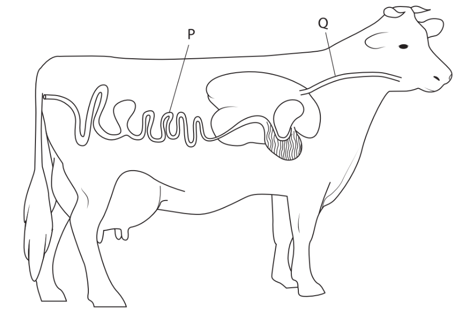

Name the parts labelled **P** and **Q**.

### 3((b)) — 2 marks — command: suggest — structured — from paper Nov 2021 · 4BI1/1B
The cow’s stomach contains microorganisms that digest plant cell walls.

Suggest why these microorganisms are useful to a cow.

## Q2 — easy — 4 marks · exam-questions

### 1((a)) — 4 marks — command: multiple — structured — from paper Jan 2021 · 4BI1/1BR
The diagram shows a plant cell.

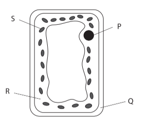

(i) Which part of this cell contains chlorophyll?

**(1)**

| **A** | P |
|---|---|
| **B** | Q |
| **C** | R |
| **D** | S |

(ii) Which of these is found in chlorophyll?

**(1)**

| **A** | Calcium |
|---|---|
| **B** | Iron |
| **C** | Magnesium |
| **D** | Water |

(iii) Describe the role of chlorophyll.

**(2)**

## Q3 — easy — 8 marks · exam-questions

### 1() — 2 marks — command: explain — structured
The pancreas produces a range of enzymes involved in the digestion of food.

Explain the meaning of the term **enzyme**.

### 2() — 1 mark — command: which — structured
In which of the following locations does digestion by the enzyme amylase take place?

| **A** | Mouth and pancreas |
|---|---|
| **B** | Mouth and stomach |
| **C** | Small intestine and pancreas |
| **D** | Mouth and small intestine |

### 3() — 2 marks — command: name — structured
The diagram below shows an enzyme and an associated molecule labelled **X **that can bind with the enzyme at location **Y.**

Name molecule **X** and location **Y**.

### 4() — 3 marks — command: explain — structured
The 'lock and key hypothesis' is often used as a model to describe the action of enzymes.

Use your knowledge of the lock and key hypothesis and the diagram in part (c) to explain how enzymes function in digestion.

## Q4 — easy — 7 marks · exam-questions

### 1() — 2 marks — command: explain — structured
The graph below shows the effect of temperature on the rate of an enzyme-catalysed reaction.

Explain why the rate of an enzyme-catalysed reaction decreases after point **B**.

### 2() — 2 marks — command: calculate — structured
A scientist investigated how the digestive enzyme amylase breaks down starch into sugar maltose.

He added the enzyme to a solution of starch and measured the concentration of starch every 10 minutes.

The results are shown in the table below.

| **Time / min** | **Concentration of starch / mg cm ****-3 ** |
|---|---|
| 0 | 17.2 |
| 10 | 11.1 |
| 20 | 7.2 |
| 30 | 5.3 |
| 40 | 4.2 |

Rate of reaction can be calculated using the following equation:

$\mathrm{Rate} \mathrm{of} \mathrm{reaction}=\frac{\mathrm{mass} \mathrm{of} \mathrm{starch} \mathrm{broken} \mathrm{down}}{\mathrm{time} \mathrm{taken}}$

Calculate the average rate of the reaction between 0 and 20 minutes.

### 3() — 1 mark — command: state — structured
Bile is a secretion that helps with digestion.

State one way in which bile aids digestion.

### 4() — 2 marks — command: multiple — structured
The diagram below shows the organs of the human digestive system.

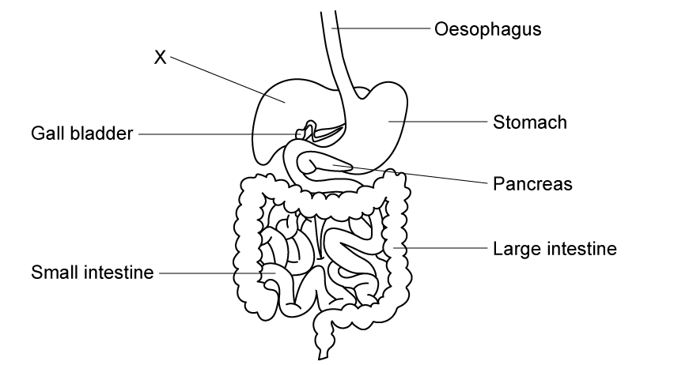

(i) Bile is produced by organ **X**

Name organ **X**.

**(1)**

(ii) Identify the organ in which bile is stored after it is produced.

**(1)**

## Q5 — easy — 13 marks · exam-questions

### 1() — 4 marks — command: draw — structured
A leaf contains various structures that enable it to carry out photosynthesis.

Draw lines to connect each listed structure with the corresponding adaptation.

| **Structure** | **Adaptation** |
|---|---|
| Waxy cuticle | Allows gas exchange to occur |
| Stomata | Tightly packed with chloroplasts for maximum absorption of light |
| Palisade mesophyll | Protect the leaf from water loss |
| Spongy mesophyll | Increases the surface area to volume ratio for the diffusion of gases |

### 2() — 4 marks — command: multiple — structured
The diagram below shows a cross section through a leaf.

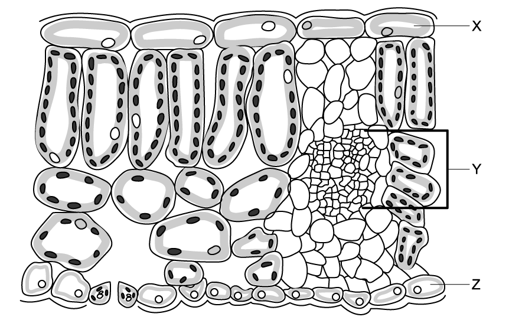

Structure **Y** represents a vascular bundle.

(i) Identify two types of tissue found in structure **Y**.

**(2)**

(ii) Describe the function of each type of tissue identified in part (i).

**(2)**

### 3() — 3 marks — command: multiple — structured
Layers **X** and **Z** in the diagram in part (b) form the outer boundaries of the leaf.

(i) Identify **one visible** difference between layer **X** and layer **Z**.

**(1)**

(ii) The cells in layer **X** are transparent.

Explain the importance of this to the plant.

**(2)**

### 4() — 2 marks — command: sketch — structured
Carbon dioxide concentration is one of several factors that can limit the rate at which photosynthesis occurs.

Sketch a graph that shows how carbon dioxide concentration affects the rate of photosynthesis. You should label your axes with carbon dioxide concentration on the X axis and the rate of photosynthesis on the Y axis.

## Q6 — easy — 12 marks · exam-questions

### 4((a)) — 2 marks — command: explain — structured — from paper Jan 2021 · 4BI1/2B
The diagram shows a transverse section through a leaf.

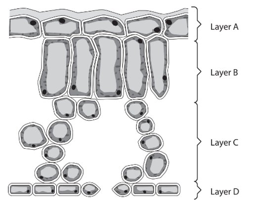

Explain how **layer A** is adapted for its role.

### 4((b)) — 4 marks — command: explain — structured — from paper Jan 2021 · 4BI1/2B
Explain how **layers B** and **C** are adapted for photosynthesis and gas exchange.

### 4((c)) — 2 marks — command: explain — structured — from paper Jan 2021 · 4BI1/2B
Explain how **layer D **is able to regulate gas exchange.

### 4((d)) — 4 marks — command: discuss — structured — from paper Jan 2021 · 4BI1/2B
#### Separate: Biology Only

Gardeners sometimes apply a spray called an anti-transpirant to plant leaves.

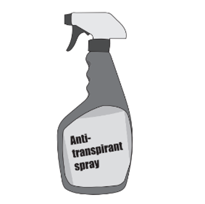

The spray is impermeable to water vapour but allows other gases to pass through.

Discuss whether an anti-transpirant spray will promote plant growth.

## Q7 — medium — 11 marks · exam-questions

### 8((a)) — 2 marks — command: give — structured — from paper Jan 2022 · 4BI1/1BR
A student investigates the effect of light intensity on photosynthesis in leaf discs.

This is the student’s method.

- Cut equal sized discs from a leaf
- Remove the plunger from a 20 cm3 syringe and place a disc into the syringe
- Replace the plunger in the syringe and fill the syringe with 2 % sodium hydrogen carbonate solution, which provides carbon dioxide
- Place your thumb over the end of the syringe and pull the plunger back until the disc sinks
- Position the syringe vertically
- Place a lamp five centimetres from the syringe
- Record the time taken for the leaf disc to rise to the top of the syringe
- Repeat the experiment with the lamp at increasing distances from the syringe

The leaf discs rise in the solution due to the production of gas during photosynthesis.

The diagram shows some of the apparatus used.

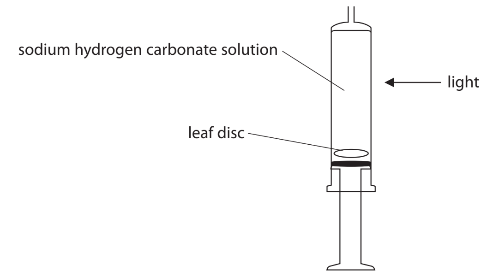

Give the balanced chemical symbol equation for photosynthesis.

### 8((b)) — 2 marks — command: multiple — structured — from paper Jan 2022 · 4BI1/1BR
(i) State how the student could improve the reliability of their results.

**(1)**

(ii) Give the dependent variable in the investigation.

**(1)**

### 8((c)) — 4 marks — command: explain — structured — from paper Jan 2022 · 4BI1/1BR
The graph shows the results of the investigation.

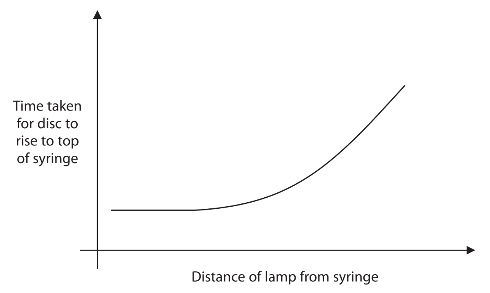

Explain the effect of increasing the distance of the lamp on the time taken for the leaf disc to rise to the top of the syringe.

### 8((d)) — 3 marks — command: describe — structured — from paper Jan 2022 · 4BI1/1BR
Describe how the student could test the leaf discs for the presence of starch.

## Q8 — medium — 11 marks · exam-questions

### 3((a)) — 4 marks — command: describe — structured — from paper June 2021 · 4BI1/1B
A student investigates factors that affect photosynthesis.

In his first experiment, the student uses this method to investigate the effect of light on photosynthesis.

- Place a plant in the dark for 24 hours
- Cover part of leaf X with black paper
- Place the plant in the light for 24 hours

The diagram shows the plant in the light.

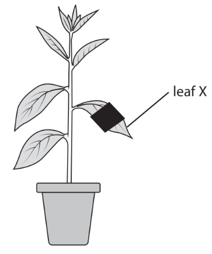

Describe how the student tests** leaf X** to show the effect of light on photosynthesis.

### 3((b)) — 7 marks — command: multiple — structured — from paper June 2021 · 4BI1/1B
In his second experiment, the student uses a water plant to investigate the effect of carbon dioxide concentration on the rate of photosynthesis.

He does the experiment at two different light intensities.

The table shows the student’s results.

| **Carbon dioxide concentration in arbitrary units** | **Rate of photosynthesis in bubbles per minute** |   |
|---|---|---|
| **low light intensity** | **high light intensity** |   |
| 0.00 | 0 | 0 |
| 0.02 | 20 | 20 |
| 0.04 | 29 | 35 |
| 0.06 | 35 | 47 |
| 0.08 | 39 | 68 |
| 0.10 | 42 | 84 |
| 0.12 | 45 | 89 |
| 0.14 | 46 | 90 |
| 0.16 | 46 | 90 |
| 0.18 | 46 | 90 |

(i) Explain the student’s results.

**(4)**

(ii) Describe how the student could change the light intensity in this investigation.

**(1)**

(iii) Give the dependent variable in this investigation.

**(1)**

(iv) Give one way in which the student could control the biotic variable in this investigation.

**(1)**

## Q9 — medium — 10 marks · exam-questions

### 8((a)) — 6 marks — command: discuss — structured — from paper June 2021 · 4BI1/1B
The table gives the percentage composition by mass of human breast milk, and of cow’s milk.

| **Substance** | **Percentage by mass (%)** |   |
|---|---|---|
| **Breast milk** | **Cow's milk** |   |
| Water | 87.0 | 88.0 |
| Vitamins | Trace | Trace |
| Fat | 3.8 | 5.0 |
| Carbohydrate | 7.9 | 3.0 |
| Minerals | 0.2 | 0.7 |
| Protein | 1.0 | 3.3 |

Discuss whether cow’s milk is a suitable alternative to breast milk for young babies.

Use data from the table and your own knowledge to support your answer.

### 8((b)) — 2 marks — command: give — structured — from paper June 2021 · 4BI1/1B
Human breast milk may contain insufficient vitamin D for a growing child.

Give two ways that additional vitamin D could be provided for the child.

### 8((c)) — 2 marks — command: describe — structured — from paper June 2021 · 4BI1/1B
Describe how a sample of cow’s milk could be tested for protein.

## Q10 — medium — 13 marks · exam-questions

### 3((a)) — 2 marks — command: which — structured — from paper Jan 2021 · 4BI1/1BR
The diagram shows part of the human digestive system.

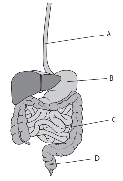

(i) In which of these parts is hydrochloric acid produced?

**(1)**

| **A** |
|---|
| **B** |
| **C** |
| **D** |

(ii) In which of these parts are faeces stored?

**(1)**

| **A** |
|---|
| **B** |
| **C** |
| **D** |

### 3((b)) — 3 marks — command: explain — structured — from paper Jan 2021 · 4BI1/1BR
The liver produces bile.

Explain the role of bile in digestion.

### 3((c)) — 8 marks — command: explain — structured — from paper Jan 2021 · 4BI1/1BR
Some people have a condition called coeliac disease.

In this condition the body reacts to eating gluten, a protein found in wheat.

This reaction damages the villi in the small intestine.

The diagram shows how the villi in the small intestine are damaged.

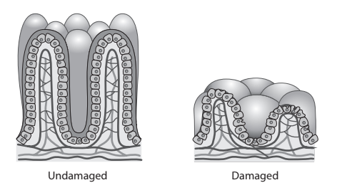

(i) Explain how the undamaged villi are adapted for their function.

**(4)**

(ii) Explain why children with untreated coeliac disease may grow more slowly and become tired more easily than children without coeliac disease.

Use the information from the diagram and your own knowledge to support your answer.

**(4)**

## Q11 — medium — 13 marks · exam-questions

### 4((a)) — 8 marks — command: multiple — structured — from paper Jan 2021 · 4BI1/1BR
A teacher does an investigation to show that plants require carbon dioxide and light for photosynthesis.

This is the teacher’s method.

- Place a potted plant in the dark for 24 hours
- Place a strip of black paper over two of the plant’s leaves
- Pour some sodium hydroxide solution into a flask
- Insert one of the leaves into the flask
- Seal the flask with a cotton wool plug
- Place the plant in bright light for 12 hours
- Remove the two leaves and safely test them for starch

This diagram shows the teacher’s apparatus.

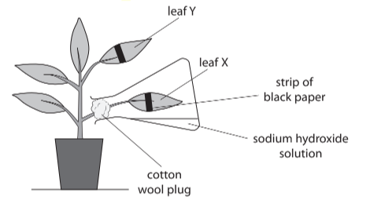

(i) Explain why the potted plant is placed in the dark for 24 hours.

**(2)**

(ii) Explain one role of leaf Y in the investigation.

**(2)**

(iii) Describe how to test the leaves for starch safely.

**(4)**

### 4((b)) — 3 marks — command: explain — structured — from paper Jan 2021 · 4BI1/1BR
Explain how the results of this investigation would show that light is required for photosynthesis.

### 4((c)) — 2 marks — command: explain — structured — from paper Jan 2021 · 4BI1/1BR
Plants convert the glucose they produce into starch.

Explain why plants store carbohydrate as starch rather than as glucose.

## Q12 — medium — 14 marks · exam-questions

### 4((a)) — 2 marks — command: write — structured — from paper Nov 2020 · 4BI1/2B
A student investigated the effect of different colours of light on the rate of photosynthesis in a water plant.

This is the student’s method.

- Place a 1 % sodium hydrogen carbonate solution in a boiling tube
- Cut a 5 cm length of pondweed and place it in the tube
- Place a lamp 10 cm from the tube containing the pondweed
- Leave the pondweed for 10 minutes until it starts to produce bubbles from the cut end
- Count the bubbles produced in one minute
- Count the bubbles for two more one minute periods

The student repeated the experiment three more times using filters in front of the lamp that let through either red light, blue light or green light.

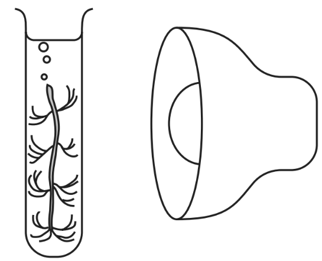

These are the student’s results.

| **Colour of filter** | **Number of bubbles per minute** |   |   |   |
|---|---|---|---|---|
| **Test 1** | **Test 2** | **Test 3** | **Mean** |   |
| No filter | 47 | 84 | 80 |   |
| Red | 48 | 48 | 42 | 46 |
| Blue | 55 | 56 | 50 | 54 |
| Green | 9 | 8 | 10 | 9 |

Write the balanced symbol equation for photosynthesis.

### 4((b)) — 8 marks — command: multiple — structured — from paper Nov 2020 · 4BI1/2B
(i) Anomalous results are not included in the calculation of the mean.

Calculate the mean number of bubbles per minute for the lamp with no filter.

**(2)**

(ii) Explain the student’s results.

**(4)**

(iii) Give two abiotic variables that the student should control in her experiment.

**(2)**

### 4((c)) — 4 marks — command: multiple — structured — from paper Nov 2020 · 4BI1/2B
(i) Explain why measuring the rate of photosynthesis by counting bubbles may not be an accurate method to use.

**(2)**

(ii) Suggest an alternative method that the student could use to measure the rate of photosynthesis in her experiment.

**(2)**

## Q13 — medium — 6 marks · exam-questions

### 5() — 6 marks — command: determine — structured — from paper Nov 2021 · 4BI1/2B
#### Separate: Biology Only

Obesity is caused when energy input is greater than energy output.

A student likes to eat potato crisps but is concerned about obesity.

The student has a choice of two different types of crisp to eat.

Describe an experiment the student could use to determine which type of crisp contains the least energy.

## Q14 — medium — 8 marks · exam-questions

### 7((a)) — 5 marks — command: complete — structured — from paper Nov 2020 · 4BI1/2BR
#### Separate: Biology Only

Gas exchange in a flowering plant changes depending on conditions.

Complete the passage by writing a suitable word or words in each blank space.

Plants carry out photosynthesis to produce .............................................................. . To enable this process to occur the leaf cells absorb carbon dioxide and release oxygen.

At the same time, the cells in the leaves are respiring. This means that they are using .............................................................. and producing carbon dioxide. If the leaves are in bright sunlight, then the rate of photosynthesis will be .............................................................. than the rate of respiration. If the leaves are in dim light, then the rate of respiration will be greater than the rate of photosynthesis and there will be a net production of .............................................................. .

In conditions when there is no net absorption or release of carbon dioxide the rate of photosynthesis and respiration are .............................................................. and the plant is at its compensation point.

### 7((b)) — 3 marks — command: describe — structured — from paper Nov 2020 · 4BI1/2BR
Describe how you could use hydrogen-carbonate indicator to investigate the effect of light intensity on net gas exchange in a leaf.

## Q15 — medium — 10 marks · exam-questions

### 10((a)) — 3 marks — command: multiple — structured — from paper Nov 2021 · 4BI1/1B
A student does an experiment to show that a leaf is only able to produce starch if it receives enough light.

The student removes all the starch from the leaf before starting the experiment.

(i) Describe how the student could remove all the starch from the leaf.

**(2)**

(ii) State why the student removes all the starch from the leaf before starting the experiment.

**(1)**

### 10((b)) — 1 mark — command: give — structured — from paper Nov 2021 · 4BI1/1B
Before testing a leaf for starch, chlorophyll needs to be removed.

Give a safety precaution the student needs to take when removing chlorophyll.

### 10((c)) — 1 mark — command: give — structured — from paper Nov 2021 · 4BI1/1B
Give a suitable control the student should use in this experiment.

### 10((d)) — 5 marks — command: describe — structured — from paper Nov 2021 · 4BI1/1B
Describe how the structure of the leaf is adapted for photosynthesis.

## Q16 — hard — 15 marks · exam-questions

### 4((a)) — 6 marks — command: multiple — structured — from paper Jan 2022 · 4BI1/1BR
The diagram shows the human alimentary canal.

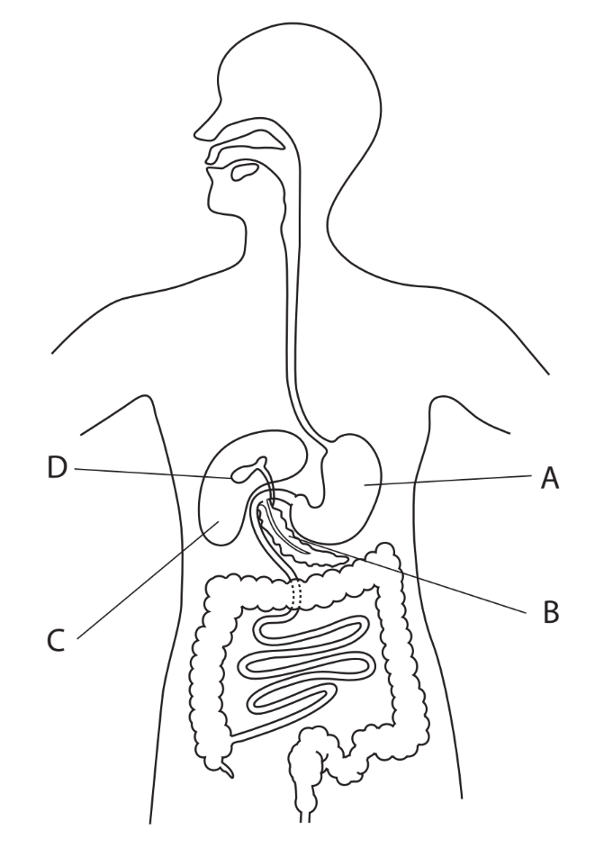

(i) Explain how food passes down the oesophagus.

**(2)**

(ii) Which labelled structure produces bile?

**(1)**

| **A** |
|---|
| **B** |
| **C** |
| **D** |

(iii) Describe the role of bile in digestion.

**(3)**

### 4((b)) — 9 marks — command: multiple — structured — from paper Jan 2022 · 4BI1/1BR
Lipase inhibitors are chemicals that bind to lipase enzymes.

To test the effect of a lipase inhibitor, equal masses of full fat milk are placed into two test tubes.

Lipase inhibitor is added to one test tube.

Lipase is added to both test tubes and the pH of each solution is measured every five minutes.

The results are shown in the table.

| **Time in minutes** | **pH of solution** |   |
|---|---|---|
| **Without lipase inhibitor** | **With lipase inhibitor** |   |
| 0 | 8.0 | 8.0 |
| 5 | 7.6 | 7.8 |
| 10 | 7.2 | 7.8 |
| 15 | 6.3 | 7.7 |
| 20 | 5.8 | 7.5 |

(i) Calculate the mean rate of pH change per minute of the solution without lipase inhibitor.

**(2)**

(ii) Explain the difference in the changes of pH of the solutions in the two test tubes during the 20-minute period.

**(2)**

(iii) Doctors use this method to investigate the use of lipase inhibitor as a treatment for obesity.

- Give three volunteers a tablet containing the lipase inhibitor

  - Give another three volunteers a tablet with no lipase inhibitor
  - Give all the volunteers 100 cm3 of olive oil to drink
  - Measure the lipid concentrations in the blood of the volunteers after three hours

Some of the volunteers reported abdominal pains three hours after drinking the olive oil.

The table shows the doctors’ results.

| **Tablet contents** | **Blood lipid concentration in mg per dm****3** | **Abdominal pains** |   |
|---|---|---|---|
| **At start** | **After 3 hours** |   |   |
| Inhibitor | 35 | 38 | Yes |
| Inhibitor | 37 | 42 | No |
| Inhibitor | 37 | 43 | Yes |
| No inhibitor | 35 | 62 | No |
| No inhibitor | 37 | 64 | No |
| No inhibitor | 35 | 45 | Yes |

Discuss the use of the lipase inhibitor as a treatment for obesity.

Use the data from the table to support your answer.

**(5)**

## Q17 — hard — 10 marks · exam-questions

### 6((a)) — 4 marks — command: name — structured — from paper Jan 2022 · 4BI1/1B
The diagram shows part of the gut of a rabbit.

The rabbit is a primary consumer and eats mainly grass and other vegetable material.

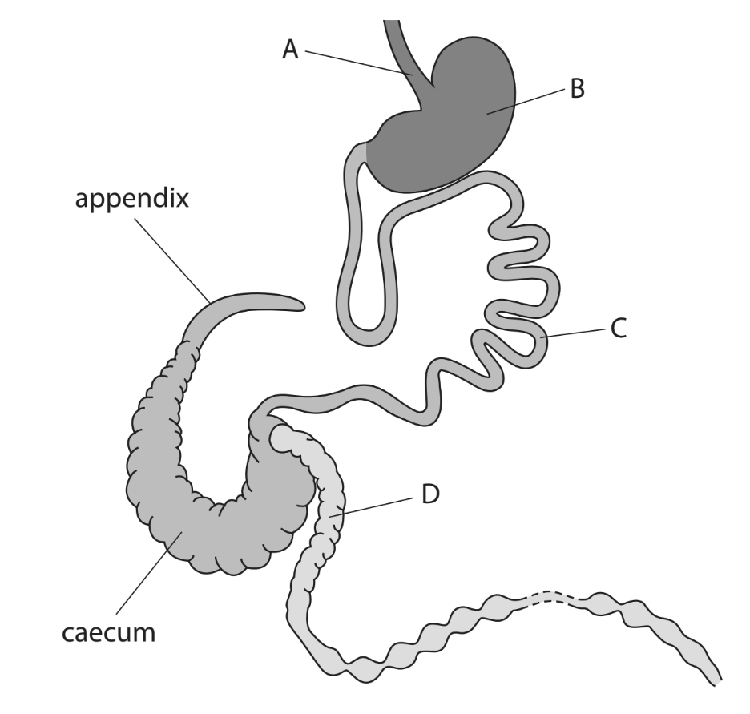

Name the parts labelled **A**, **B**, **C** and **D**.

### 6((b)) — 3 marks — command: explain — structured — from paper Jan 2022 · 4BI1/1B
The gut of a rabbit has a large caecum and appendix. These contain bacteria that are able to produce the enzyme cellulase.

Explain how these bacteria help the rabbits with their diet of plant material.

### 6((c)) — 3 marks — command: multiple — structured — from paper Jan 2022 · 4BI1/1B
The human gut has a caecum and appendix but they are much smaller than those in the rabbit.

(i) Suggest why the human gut only has a small caecum and appendix.

**(1)**

(ii) In humans, the appendix also acts as a store of useful bacteria. Scientists have discovered that patients who have had their appendix removed are more likely to develop infections of the colon.

Explain how having no appendix may increase the likelihood of bacterial infections of the colon.

**(2)**

## Q18 — hard — 10 marks · exam-questions

### 7((a)) — 2 marks — command: explain — structured — from paper Nov 2020 · 4BI1/1BR
Bread contains starch.

A student investigates how temperature affects the digestion of bread.

This is the apparatus he uses in his method.

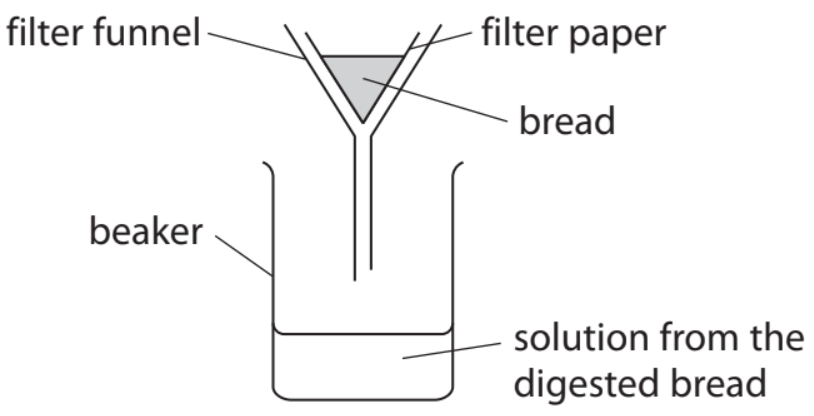

This is the student’s method.

- Add amylase to a sample of bread
- Put this bread in the filter funnel
- Pour water onto the bread
- Do a Benedict’s test on the solution from the digested bread that collects in the beaker
- Repeat the method at different temperatures

Explain the result of the Benedict’s test if the amylase digests the starch.

### 7((b)) — 4 marks — command: rewrite — structured — from paper Nov 2020 · 4BI1/1BR
The student’s method lacks detail.

Rewrite the method so that the student could make a valid conclusion about the effect of temperature on amylase.

### 7((c)) — 4 marks — command: comment — structured — from paper Nov 2020 · 4BI1/1BR
The student predicted that the rate of digestion of starch would keep increasing as temperature increased.

Comment on this prediction.

## Q19 — hard — 11 marks · exam-questions

### 1() — 4 marks — command: plot — structured
Salivary amylase is produced and secreted by salivary glands in the mouth.

Carbohydrate digestion begins in the mouth where starch is broken down into maltose by salivary amylase.

The effect of changing pH on the digestion of starch was investigated by a group of students.

The results are shown in the table below.

| **pH** | **Time taken to digest starch in minutes** |
|---|---|
| 3.0 | 38 |
| 4.0 | 26 |
| 5.0 | 17 |
| 6.0 | 13 |
| 7.0 | 7 |
| 8.0 | 8 |

Plot a line graph to show the effect of pH on the time taken to digest starch.

Use a ruler to join your points with straight lines.

### 2() — 3 marks — command: explain — structured
A student reads the following statement on the internet:

*‘The main site for carbohydrate digestion is the small intestine.’*

Another student states that salivary amylase must be responsible for digesting starch in the small intestine. The student is incorrect.

Use the results from the table and/or your graph in part (a) to explain why.

### 3() — 2 marks — command: explain — structured
During digestion partially digested food moves from the stomach to the small intestine where several additional substances are secreted and digestion of carbohydrates continues.

These secretions include the following:

- A substance known as bile
- Pancreatic fluid containing pancreatic amylase, protease and lipase..

Explain why the rate of digestion by enzymes in the small intestine is not reduced by stomach acid.

### 4() — 2 marks — command: explain — structured
Explain why pancreatic amylase, protease and lipase are all required in the digestion of food in the small intestine.

## Q20 — hard — 13 marks · exam-questions

### 8((a)) — 2 marks — command: calculate — structured — from paper Jan 2022 · 4BI1/1B
The rate of photosynthesis is affected by different factors. One factor is the concentration of carbon dioxide in the air.

The percentage of oxygen in the air is 21 %. This is equivalent to a concentration of 210 000 parts per million.

The percentage of carbon dioxide in the air is 0.04 %.

Calculate this concentration in parts per million.

### 8((b)) — 7 marks — command: multiple — structured — from paper Jan 2022 · 4BI1/1B
The graph shows the effect of increasing the concentration of carbon dioxide in the air on the relative rate of photosynthesis at different temperatures.

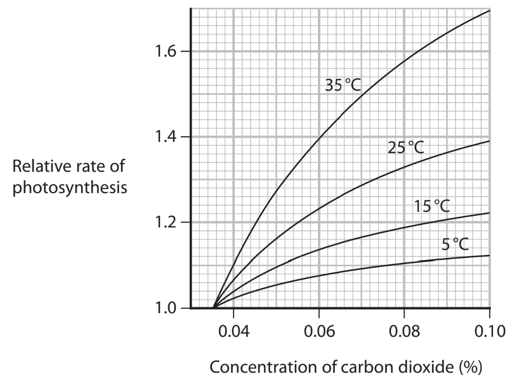

(i) Describe the effect of increasing the concentration of carbon dioxide on the relative rate of photosynthesis at 5 °C.

**(2)**

(ii) Describe how the effect of increasing the concentration of carbon dioxide on the relative rate of photosynthesis changes when the temperature is increased.

**(2)**

(iii) Explain the effect of increasing the temperature from 5 °C to 35 °C on the relative rate of photosynthesis.

**(3)**

### 8((c)) — 4 marks — command: explain — structured — from paper Jan 2022 · 4BI1/1B
The scientists who carried out this study concluded that the effect of increasing the concentration of carbon dioxide on the rate of growth of a plant is dependent on temperature and also on the minerals that the plants can absorb.

(i) Explain how lacking a named mineral might affect plant growth.

**(2)**

(ii) Explain how a named factor can affect the rate of photosynthesis, other than carbon dioxide concentration, temperature and minerals absorbed.

**(2)**
