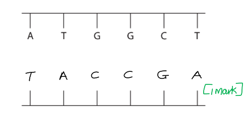
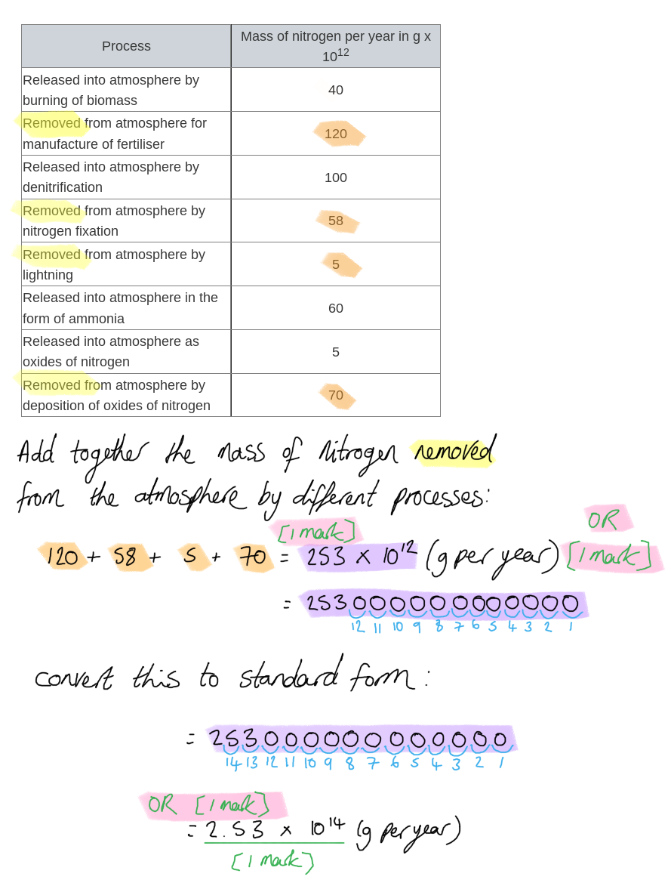
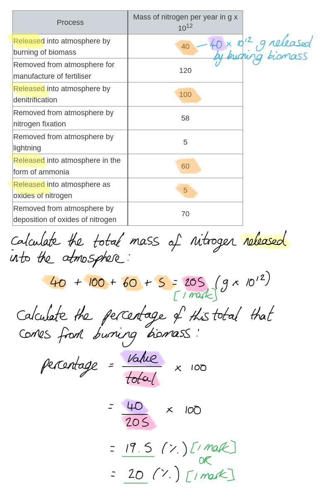

# Mark Schemes — Cycles within Ecosystems
**5. Ecology & the Environment** · Edexcel IGCSE Biology (Modular) (4XBI1) — 24/Unit 2

## Q1 — easy — 7 marks · exam-questions

### 1() — 1 marks
**Final answer:** **The correct answer is ****B**** because...**

Photosynthesis converts CO2 from the air into glucose. The carbon atoms are incorporated into plant biomass, for example as cellulose in plants.

**A **is incorrect because decomposition releases carbon from biomass back into the atmosphere as a result of the respiration of decomposers such as bacteria. This also explains why **C** is incorrect.

**D** is a nonsense answer because carbon does not evaporate during the carbon cycle.

**[Total: 1 mark]**

### 2() — 2 marks
Processes **X** and **Y** are...

- X = combustion/burning;** [1 mark]**
- Y = decomposition/decay;** [1 mark]**

*Accept respiration for Y.*

**[Total: 2 marks]**

> *Respiration is an acceptable answer for Y as it is the respiration of decomposers that releases carbon dioxide during decomposition.*

### 3() — 2 marks
Carbon is released during process Y as follows...

Any **two** of the following:

- Decomposers/bacteria/fungi release enzymes; **[1 mark]**
- Decomposers/bacteria/fungi break down the molecules in dead tissue; **[1 mark]**
- Carbon is released in the form of carbon dioxide; **[1 mark]**
- Carbon dioxide is the product of respiration (in decomposers); **[1 mark]**

**[Total: 2 marks]**

> *Decomposers such as fungi gain their nutrition by secreting enzymes onto their food. These enzymes break down the molecules in their food which can then be absorbed and used by the decomposers in respiration. Carbon dioxide is a product of respiration and it is released into the atmosphere.*

### 4() — 2 marks
Elements other than carbon that are present in protein molecules are...

Any **two** of the following:

- Hydrogen/H; **[1 mark]**
- Oxygen/O; **[1 mark]**
- Nitrogen/N; **[1 mark]**

**[Total: 2 marks]**

## Q2 — easy — 7 marks · exam-questions

### 1() — 1 marks
A role of nitrogen in living organisms is...

Any **one** of the following:

- Building amino acids/proteins; **[1 mark]**
- Building DNA; **[1 mark]**

**[Total: 1 mark]**

### 2() — 3 marks
A-C can be identified as follows...

- A = nitrogen fixation / nitrogen fixing bacteria; **[1 mark]**
- B = nitrites; **[1 mark]**
- C = nitrification / nitrifying bacteria; **[1 mark]**

**[Total: 3 marks]**

### 3() — 2 marks
The process of denitrification shown in part (b) can be described as follows...

Any **two** of the following:

- Nitrates are converted (back) into nitrogen (gas); **[1 mark]**
- Nitrogen gas is released into the atmosphere; **[1 mark]**
- Carried out by denitrifying bacteria; **[1 mark]**

**[Total: 2 marks]**

### 4() — 1 marks
Plants growing in waterlogged soil might be affected as follows...

- Reduced growth / plants will be smaller/shorter; **[1 mark]**
- Plants will have yellow leaves; **[1 mark]**

*Accept references to purple leaves/stems.*

**[Total: 1 mark]**

> *You should be aware that plants need nitrogen in the form of nitrates in order to build proteins and grow. Plants that don't have access to enough nitrates will grow more slowly and will have yellowing leaves. Smaller leaves and leaf stems may turn purple.*

## Q3 — easy — 8 marks · exam-questions

### 1() — 2 marks
Carbon is returned to the atmosphere at Y as follows...

Any **two** of the following:

- (Carbon-containing) molecules in dead tissue/plants are broken down; **[1 mark]**
- (By the action of) decomposers/bacteria/fungi; **[1 mark]**
- Release of carbon dioxide; **[1 mark]**
- During respiration; **[1 mark]**

**[Total: 2 marks]**

### 2() — 3 marks
(i) Respiration can be labelled as follows...

- Anywhere on the arrow between 'animals' and 'carbon dioxide in the atmosphere'; **[1 mark]**
- Anywhere on the arrow between 'plants' and 'carbon dioxide in the atmosphere'; **[1 mark]**

*Accept a label between 'decomposition and 'carbon dioxide in the atmosphere'.*

(ii) Photosynthesis can be labelled as follows...

- Anywhere on the arrow between 'carbon dioxide in the atmosphere' and 'green plants'; **[1 mark]**

(iii) Feeding can be labelled as follows...

- Anywhere on the arrow between 'green plants' and 'animals'; **[1 mark]**

**[Total: 3 marks]**

### 3() — 3 marks
(i) Fossil fuel combustion contributes to rising average global temperatures because...

Any **two** of the following:

- Carbon dioxide is released;** [1 mark]**
- Carbon dioxide is a greenhouse gas; **[1 mark]**
- Greenhouse gases trap heat energy inside the earth's atmosphere; **[1 mark]**

(ii) Deforestation increases the problem of global warming because...

- Less carbon dioxide will be removed if there are fewer trees / if trees are cut down / if trees are carrying out less photosynthesis; **[1 mark]**

**[Total: 3 marks]**

> *This content is not covered until the next topic in the specification, but it is essential that you are able to make the connection between the carbon cycle and the impact of human activities on global warming. The combined impact of burning fossil fuels and cutting down trees is an increase in atmospheric carbon dioxide concentration, which has been linked by scientific research to rising global temperatures.*

## Q4 — medium — 10 marks · exam-questions

### 3((a)) — 1 marks
The cycle is...

- The carbon cycle; **[1 mark]**

**[Total: 1 mark]**

### 3((b)) — 2 marks
(i) **The correct answer is ****A ****because...**

Combustion is the scientific word for burning and the factory is burning fuel.

**B** is incorrect because decomposition occurs in dead organisms and organic waste materials.

**C** is incorrect because feeding allows organisms to pass carbon along a food chain and does not occur in factories.

**D** is incorrect because respiration is how animals and plants return carbon to the atmosphere.

(ii)** The correct answer is ****D ****because...**

Respiration is how animals and plants return carbon to the atmosphere in the form of carbon dioxide.

**A** is incorrect because combustion happens when fossil fuels are burnt causing the release of carbon dioxide.

**B** is incorrect because decomposition occurs in dead organisms and organic waste materials.

**C** is incorrect because feeding allows organisms to pass carbon along a food chain and does not occur in factories.

**[Total: 2 marks]**

### 3((c)) — 1 marks
A group of organisms responsible for decomposition are...

- Bacteria / fungi; **[1 mark]**

*Accept names of specific examples of bacteria or fungi.*

**[Total: 1 mark]**

### 3((d)) — 6 marks
An investigation to find out if changing the pH of organic material affects the rate of decomposition would be...

Any **six **of the following:

- C = different pH of organic material / add acid / alkali / add buffers; **[1 mark]**
- O = <u>same</u> organic material / plant / age / species / type / mass / volume / state of decay of organic material; **[1 mark]**
- R = repeat (at each different pH); **[1 mark]**
- M1 = measure <u>change</u> / <u>loss</u> in mass of organic material / initial mass – final mass / volume of carbon dioxide released / change in hydrogen-carbonate indicator / change in limewater; **[1 mark]**
- M2 = after stated time period / 1 hour +; **[1 mark]**
- S1 = same temperature / oxygen; **[1 mark]**
- S2 = same water / same mineral ions / same humidity / same volume of each acid /alkali/ buffer / same (number of) bacteria / fungi / decomposer added; **[1 mark]**

**[Total: 6 marks]**

> *Remember that with **CORMS** questions you will not be expected to know anything about the experiment you're presented with. You just have to apply your knowledge of experimental design to a new scenario. *

> *Remember that **CORMS** stands for: **C**hange, **O**rganism, **R**epeat, **M**easure, **S**ame. There are always two marks available for **M**easure and two for **S**ame. *

> *The most difficult mark to get is the **O**rganism because you need to remember to include the word **same** in your answer, e.g. "same species". The point for **O**rganism needs to be **different** to the two points in **S**ame. *

> *Remember to write your answers in full sentences, as stated in the question stem, but you are welcome to make a quick bullet point plan in a blank space somewhere else on your page. Use your plan to tick off and make sure you've hit all the marking points.*

## Q5 — medium — 9 marks · exam-questions

### 5((a)) — 1 marks
The missing bases on the other strand of DNA would be...

- TACCGA; **[1 mark]**

**[Total: 1 mark]**

> *Remember that complementary base pairing in DNA means that an A on one strand will always bind to a T on the other strand (and vice versa) while a C on one strand will always bind to a G on the other strand (and vice versa). So if you are given the base sequence of one strand, then you can determine the sequence of the other one. *

### 5((b)) — 3 marks
(i)** ****The correct answer is ****C ****because...**

The urease activity is the highest at a pH of 7.5, meaning that this is the enzymes' optimum pH.

**A** and **B** are incorrect as urease is not active at a pH of 2.5 or 4.5.

**D** is incorrect as the urease activity has decreased at a pH of 8.5, so that would not be its optimum pH.

(ii) The activity of urease at pH 8.5 can be explained as follows...

Any **two** of the following:

- (The activity of urease is) lower (at pH 8.5); **[1 mark]**
- (This is because the enzyme has) denatured / (there has been a) change in the shape of the active site (of urease); **[1 mark]**
- Urea does not bind (into enzyme active site) / fewer enzyme-substrate complexes form; **[1 mark]**

> *It is clear from the graph that urease activity has decreased at pH 8.5. This indicates that the substrate (urea) does not bind as easily to the active site of the enzyme as before, which is due to the fact that the shape of the active site has changed. The enzyme is said to be denatured when this happens and as more urease denatures, the enzyme activity will continue to decrease until no more enzyme-substrate complexes can form.*

**[Total: 3 marks]**

### 5((c)) — 5 marks
The role of the other bacteria in the nitrogen cycle includes...

Any **five** of the following:

- (Some are called) nitrogen fixing (bacteria) / (which are responsible for) nitrogen fixation; **[1 mark]**
- (During nitrogen fixation) nitrogen gas (in the atmosphere is converted) to ammonia / nitrates / amino acids; **[1 mark]**
- (Some are called) nitrifying (bacteria) / (which are responsible for) nitrification; **[1 mark]**
- (During nitrification) ammonia (is converted) to nitrite / nitrite (is converted) to nitrate / ammonia (is converted) to nitrate; **[1 mark]**
- (Some are called) denitrifying (bacteria) / (which are responsible for) denitrification; **[1 mark]**
- (During denitrification) nitrate (is converted) to nitrogen gas / (denitrification) reduces (the amount of) nitrogen available to plants; **[1 mark]**

*Mention of 'nitrifying bacteria converts nitrate to nitrogen gas' will score ***[1 mark]*** for marking point 3, but not for marking point 4.*

**[Total: 5 marks]**

> *Make sure that you are able to clearly distinguish the roles of the three different types of bacteria involved in the nitrogen cycle, as they are easily confused with each other.*

## Q6 — medium — 11 marks · exam-questions

### 4((a)) — 4 marks
(i) **The correct answer is ****A ****because...**

Nitrogen fixation refers to the process of removing nitrogen from the air and converting it into a compound that is easier for plants to absorb. This can be done by either lightning or nitrogen fixing bacteria found in soil.

**B** is incorrect as this shows nitrates being converted back into atmospheric nitrogen during denitrification.

**C** and **D** are incorrect as neither of these processes shows the removal of nitrogen from the atmosphere.

(ii) **The correct answer is ****D ****because...**

This process shows that the remains of the animal are converted into soil ammonium which can then be absorbed by producers, which is what happens during decomposition.

**A** is incorrect as this shows the process of nitrogen fixation.

**B** is incorrect as this shows the process of returning nitrogen back into the atmosphere during denitrification.

**C** is incorrect as this shows the conversion of soil ammonium to nitrates which does not involve decomposition.

(iii) **The correct answer is ****C ****because...**

Nitrification refers to the process in which soil ammonium is converted into nitrate ions which can then be absorbed by producers.

**A** is incorrect as this shows the process of nitrogen fixation.

**B** is incorrect as this shows the process of returning nitrogen back into the atmosphere during denitrification.

**D** is incorrect as this shows the process of decomposition.

(iv) A type of organism that carries out process C is...

- (nitrifying) bacteria / fungi / correctly named genus/species; **[1 mark]**

*Ignore reference to denitrifying or nitrogen fixing bacteria/microorganisms.*

> *It will be worth your while to familiarise yourself with the processes involved in the nitrogen cycle. Make sure that you are clear on the role of the three types of bacteria involved (nitrogen fixing, nitrifying and denitrifying) so that you do not get them confused with each other. *

**[Total: 4 marks]**

### 4((b)) — 7 marks
(i) The reason why the control solution contains all the mineral ions the plant requires while the test solution lacks nitrate is because...

Any **two** of the following:

- (To) compare / (look at growth in the) test solution / without nitrate; **[1 mark]**
- (To) compare (growth in the test solution) with (growth of the) control / (plants that) shows normal growth; **[1 mark]**
- If the control had no minerals / other minerals absent, (then the plants) would not show normal growth;** [1 mark]**

(ii) The purpose of step 5 is...

- (To) remove nitrates / all minerals; **[1 mark]**

(iii) The purpose of step 7 is...

Any **two** of the following:

- (To) block out light (from the roots); **[1 mark]**
- (To) prevent photosynthesis; **[1 mark]**
- (This will) prevent algal growth; **[1 mark]**

> *It is important to prevent algal growth, as they will compete with the plants for mineral ions and therefore negatively affect the growth of the plants. This will make any results obtained unreliable.*

(iv) The measurements that could be made to determine if nitrate ions are required for plant growth would include...

Any **two** of the following:

- Measure the height / length / leaf area / mass of the plants; **[1 mark]**
- (The measurements can be made) using a ruler / balance / scales;** [1 mark]**
- (Measurements of seedling growth) in both solutions (should be made) **OR** (measurements of the) seedlings (growing in the) complete (solution) should be taken along with (those growing in the test solution) lacking nitrates; **[1 mark]**

**[Total: 7 marks]**

## Q7 — medium — 3 marks · exam-questions

### 1() — 2 marks
The percentage increase in carbon dioxide levels can be calculated as follows...

- (71 ÷ 316) x 100; **[1 mark]**
- 22.5; **[1 mark]**

*Full marks can be awarded for the correct answer in the absence of other calculations.*

**[Total: 2 marks]**

### 2() — 1 marks
Marks can be awarded for a graph drawn as follows...

- Scale is linear **AND** fills at least half of the area provided; **[1 mark]**
- Line is straight **AND** neat **AND** joins the points; **[1 mark]**
- Axes are labelled correctly **AND** relevant units are given; X axis = year and Y axis = carbon dioxide concentration / ppm; **[1 mark]**
- Points are plotted correctly to within 1 small square; **[1 mark]**

*Accept a Y axis scale that starts at 0 or that starts closer to 300 (as shown below).*

**[Total: 4 marks]**

> *Edexcel iGCSE follows the same marking requirements for all questions relating to drawing graphs. There are usually 5 points and 5 marks available, unless one of the criteria is not relevant, e.g. if a key is not required the graph may be worth a maximum of 4 marks. The 5 possible mark points are as follows: *

> *S - Scale **should be **linear**, increasing in **regular increments**. It should take up more than half the grid (and not be squashed into one corner of the graph paper)*

> *L - The line** should **join the points**. It is important that you use a ruler to join your points together. Don't extrapolate (join your line) to the origin (0,0) unless your data includes this point. *

> *A - Axes** should be **labelled correctly** and include **units.** These can usually be taken directly from the table. It is also worth remembering that the Y axis is usually used for the dependent variable which is found on the right hand side of a table and the X axis is used to represent the independent variable which is found in the left column of the table.*

> *P - Points** should be plotted carefully and accurately as you will only be awarded the mark if all points are** within 1 small square** of where they are supposed to be.*

> *K - Keys** are sometimes necessary but** not always**. If there are multiple lines on a line graph or sets of bars on your bar chart then you might like to distinguish the different data sets using a **key or a label on the lines.*

## Q8 — hard — 11 marks · exam-questions

### 4((a)) — 3 marks
The processes labelled A, B and C are...

- A = denitrification/denitrifying (bacteria); **[1 mark]**
- B = nitrification/nitrifying (bacteria); **[1 mark]**
- C = nitrogen fixation/fixing (bacteria); **[1 mark]**

**[Total: 3 marks]**

### 4((b)) — 6 marks
(i) The total mass of nitrogen removed from the atmosphere by these processes is...

- 2.53/253 **OR** 253 x 1012; **[1 mark]**
- 2.53 x 1014;** [1 mark]**

*Full marks can be awarded for the correct answer of 2.53 x 10**14 **in the absence of other calculations.*

(ii) The percentage of the nitrogen released into the atmosphere that comes from burning of biomass is...

- 205; **[1 mark]**
- 20 (%); **[1 mark]**

***Accept**** 19.5/19.51/19.512 etc. for 20.*

*Full marks can be awarded for the correct answer of 20 in the absence of other calculations.*

(iii) Burning biomass returns nitrogen to the atmosphere as follows...

Any **two** of the following:

- (Biomass) contains proteins/amino acids/DNA/RNA/nucleic acids; **[1 mark]**
- (These are) nitrogen-containing <u>compounds</u>; **[1 mark]**
- When burned (these compounds) release/produce nitrous oxides / oxides of nitrogen; **[1 mark]**

**[Total: 6 marks]**

### 4((c)) — 2 marks
The effect of nitrous oxide on global warming is...

Any **two** of the following:

- It is a greenhouse gas; **[1 mark]**
- It traps heat in the atmosphere / absorbs IR/infrared radiation / prevents the escape of IR/infrared radiation; **[1 mark]**
- It increases global warming;** [1 mark]**

***Ignore**** references to 'heating up the atmosphere' for marking point 2.*

***Ignore**** references to increasing temperatures for marking point 3.*

**[Total: 2 marks]**

> *Make sure that you give full explanations and that you are careful with scientific language here. It is not enough to say that greenhouse gases 'heat up the atmosphere'; you must include the idea that they **trap heat/IR radiation** within the atmosphere. This increases global temperatures in a process that you should know as **global warming**.*

> *Be careful here not to confuse global warming with other environmental problems caused by nitrous oxides. Nitrous oxides are not a major greenhouse gas, and are well known as a cause of acid rain, but the question specifically refers to global warming so you must limit your responses to this effect.*

## Q9 — hard — 17 marks · exam-questions

### 1() — 6 marks
(i) Nitrates help plants to grow as follows...

Any **two **of the following:

- (They allow plants to) build amino acids; **[1 mark]**
- Amino acids (containing nitrates) are used to build proteins;** [1 mark]**
- Proteins are used to build plant cells/tissues; **[1 mark]**

*Accept for building DNA / RNA / nucleic acids for 1 mark.*

(ii) Nitrogen in the air can be converted into nitrates as follows...

- By nitrogen fixing bacteria; **[1 mark]**
- Lightning can fix nitrogen / combines oxygen and nitrogen in the atmosphere / converts nitrogen into nitrous oxides (which dissolve and enter the soil in rainwater); **[1 mark]**

(iii) The relationship between the plant and the bacteria is mutualistic because...

- The plant gains nitrates that it would <u>otherwise be unable to gain</u> / that it would be unable to gain from the soil <u>on its own</u> / <u>without the bacteria</u>;** [1 mark]**
- The bacteria have an immediate / constant source of carbohydrates/glucose <u>for respiration</u>; **[1 mark]**

> *This subpart contains an unfamiliar idea, but the answer is in fact very clearly visible in the diagram. You simply need to work out how **both** organisms benefit from the partnership. Note that the question asks you to **explain** how the organisms benefit, so simply restating exactly what the diagram shows will not be quite enough for the marks here.*

> *The idea that the bacteria gain nitrates has been covered already, though here you need to make it clear that **the plant would be short of nitrates** were it not for the action of the bacteria.*

> *The bacteria are shown in the diagram to gain glucose from the plant; this means that they have a **constant and immediate source** of carbohydrate to **fuel their respiration**.*

**[Total: 6 marks]**

### 2() — 7 marks
(i) The stages in the nitrogen cycle that correspond to each number from the diagram are...

| **Stage** | **Number** |
|---|---|
| Nitrogen fixation; **[1 mark]** | 1 |
| Decomposition/decay;** [1 mark]** | 2 |
| Nitrification;** [1 mark]** | 4 |
| Denitrification; **[1 mark]** | 7 |
| Absorption | 8 |

(ii) The nitrates are absorbed in stage 8 as follows...

Any **three **of the following:

- Using <u>active transport;</u> **[1 mark]**
- From a low concentration to a high concentration (of nitrates) / against a concentration gradient; **[1 mark]**
- Using energy / ATP; **[1 mark]**
- (Absorption into) the root hair cell; **[1 mark]**

**[Total: 7 marks]**

### 3() — 4 marks
The movement of earthworms in the soil increases the availability of nutrients because...

Any **four** of the following:

- There is more oxygen available (due to air pockets); **[1 mark]**
- Aerobic respiration of bacteria/fungi/decomposers/microorganisms increases; **[1 mark]**
- (Therefore) there is an increased rate of decay/decomposition of dead/organic material **OR** more nutrients are released from dead/organic material through decay/decomposition; **[1 mark]**
- There is an increased activity of nitrifying bacteria **SO **the rate of nitrification / conversion of ammonium compounds/nitrites to nitrates increases; **[1 mark]**
- There is decreased activity of denitrifying bacteria **SO** more nitrates are left in the soil / fewer nitrates are converted back into nitrogen gas; **[1 mark]**

**[Total: 4 marks]**

> *There are several connections that you need to make in your reasoning in order to gain full marks in this question. First of all you need to realise that **air pockets contain oxygen**, and then you need to connect the availability of oxygen to **increased aerobic respiration** in soil microorganisms. This increased rate of respiration will release the energy that these organisms need to carry out processes such as **breaking down nutrients** from dead matter and **converting ammonium compounds **into useful nitrates. *

> *You may also be aware that the activity of denitrifying bacteria increases in anaerobic conditions, so supplying more oxygen will have the opposite effect, decreasing the rate of denitrification and leaving more nitrates in the soil.*

## Q10 — hard — 11 marks · exam-questions

### 1() — 5 marks
(i) The difference between the amount of carbon entering the atmosphere and the amount of carbon leaving the atmosphere can be calculated as follows...

- Carbon leaving the atmosphere = 273 (GT yr-1); **[1 mark]**
- Carbon entering the atmosphere = 222.9 (GT yr-1); **[1 mark]**
- (273 - 222.9 =) 50.1 (GT yr-1); **[1 mark]**

*Full marks can be awarded for the correct answer in the absence of other calculations.*

> *Here you need to apply your knowledge of the carbon cycle to the data provided to allow you to calculate the total carbon absorbed and released. Sometimes it will be obvious whether a process releases or absorbs carbon, e.g. 'release from the oceans' refers to carbon being released into the atmosphere, while sometimes you will require background knowledge, e.g. 'respiration'.*

(ii) The net flux of carbon is important at a global level because...

Any **two** of the following:

- Increased carbon dioxide in the atmosphere increases the greenhouse effect / increases absorption of heat energy in the atmosphere; **[1 mark]**
- An overall increase in atmospheric carbon increases global warming; **[1 mark]**
- (To reduce global warming) carbon needs to be removed from the atmosphere faster than it enters the atmosphere; **[1 mark]**

> *This question draws on your knowledge of the impact of carbon dioxide on the environment. If carbon enters the atmosphere faster than it is absorbed then atmospheric carbon will increase, enhancing the greenhouse effect and leading to global warming.*

**[Total: 5 marks]**

### 2() — 2 marks
The combustion of fossil fuels has a large impact on the carbon balance in the atmosphere because...

Any **two** of the following:

- The combustion of fossil fuels releases carbon dioxide into the atmosphere; **[1 mark]**
- This carbon was removed from the atmosphere by photosynthesis a very long time ago / over a long time period;** [1 mark]**
- The methods by which carbon is removed from the atmosphere are much slower / cannot compensate; **[1 mark]**

**[Total: 2 marks]**

> *Fossil fuel reserves have developed over millions of years, and have been sitting under the ground for millions more, so burning them releases carbon that was converted into plant tissue over many years in a very short space of time. This disrupts the carbon cycle, releasing carbon into the atmosphere significantly faster than it can be removed.*

### 3() — 4 marks
(i) It is difficult to make accurate measurements when studying carbon fluxes because...

Any **two** of the following:

- Carbon can be transferred in both directions at the same time / can be released by respiration and taken in by photosynthesis at the same time; **[1 mark]**
- The rate of carbon transfer is affected by changes in the environment / example of carbon transfer affected by the environment, e.g. the rate of photosynthesis is affected by light intensity / some processes may be taking place at a faster/slower rate than scientists expect; **[1 mark]**
- Some deforestation / burning of fossil fuels / other named human activity that releases carbon may be illegal/unmonitored/not measured; **[1 mark]**
- Equipment may only be able to measure carbon fluxes at a local level / in one place which may not be representative of global fluxes; **[1 mark]**
- Natural disasters/large events (e.g. volcanic eruptions) may have a sudden impact on global carbon transfer **OR** it may take time to work out the impact of natural disasters/large events; **[1 mark]**

> *This question requires you to use your** reasoning skills** to consider why it might be difficult to measure something like global carbon fluxes. There are several marking points to choose from here, none of which require any prior knowledge of the methods involved in measuring carbon transfer.*

(ii) It is important to estimate carbon fluxes because....

Any **two** of the following:

- It enables scientists to calculate/estimate atmospheric carbon increases / the rate at which atmospheric carbon is increasing; **[1 mark]**
- It allows for the prediction of global warming / climate change effects in the future; **[1 mark]**
- It provides data to back up the science around global warming / to persuade people to change/decrease their use of fossil fuels; **[1 mark]**
- It shows whether measures taken to reduce global warming/climate change are working **OR** it allows scientists to demonstrate the impact of human activities on global carbon dioxide levels; **[1 mark]**

> *It is important for scientists to have an indication of carbon fluxes that add and remove carbon from the atmosphere in order to make future predictions about global warming and the effects this may have on the global climate. Climate change will affect ecosystems in different ways and predictions made by scientists can be useful to make changes to our carbon footprint today in order to limit the negative impact in the future.*

**[Total: 4 marks]**
