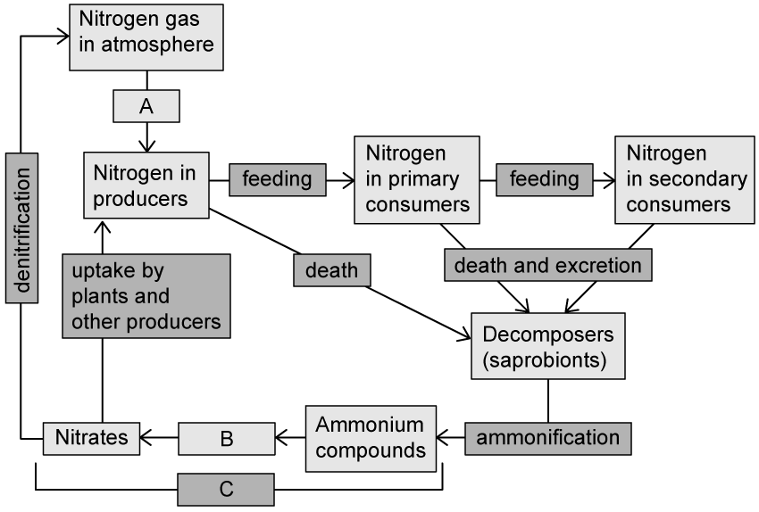
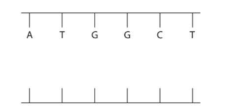
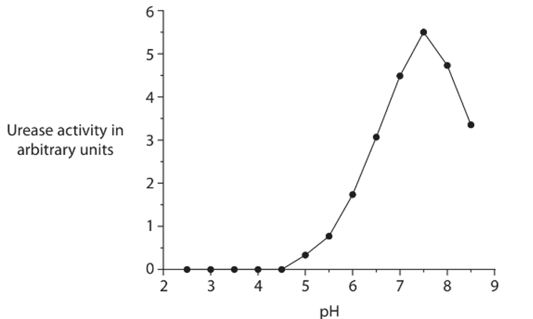
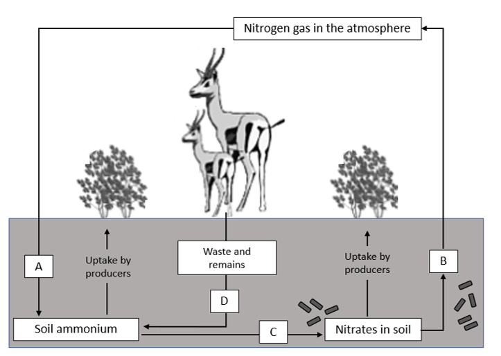
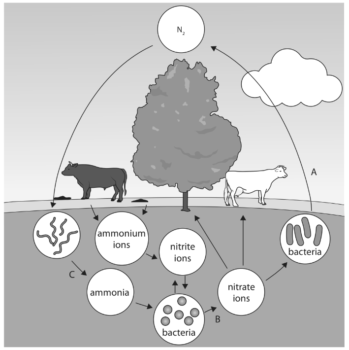
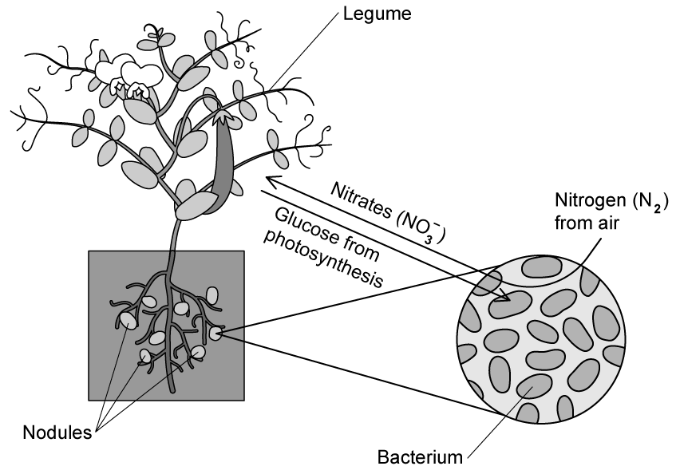
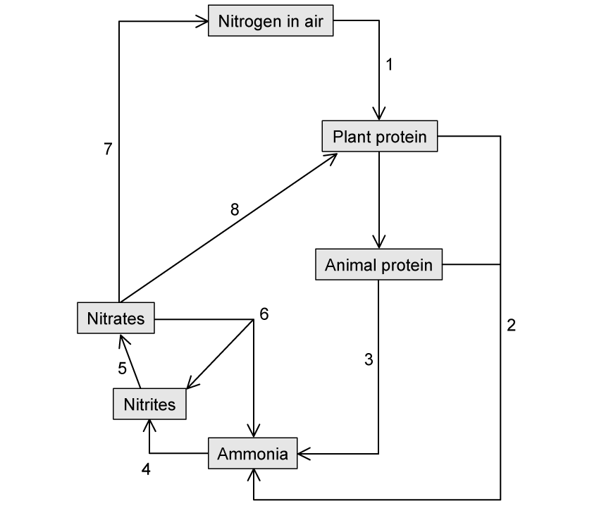

# Exam Questions — Cycles within Ecosystems
**5. Ecology & the Environment** · Edexcel IGCSE Biology (Modular) (4XBI1) — 24/Unit 2
> Source: [https://www.savemyexams.com/igcse/biology/edexcel/modular/24/unit-2/topic-questions/ecology-and-the-environment/cycles-within-ecosystems/exam-questions/](https://www.savemyexams.com/igcse/biology/edexcel/modular/24/unit-2/topic-questions/ecology-and-the-environment/cycles-within-ecosystems/exam-questions/) · 10 questions · total 94 marks

## Q1 — easy — 7 marks · exam-questions

### 1() — 1 mark — command: which — structured
Which of **A - D** is the carbon cycle process by which carbon enters the tissues of living organisms from the atmosphere?

| **A** | Decomposition |
|---|---|
| **B** | Photosynthesis |
| **C** | Aerobic respiration |
| **D** | Evaporation |

### 2() — 2 marks — command: name — structured
Part of the carbon cycle is shown in the diagram below.

Name processes **X** and **Y** in the diagram.

### 3() — 2 marks — command: describe — structured
Describe how carbon is released during process **Y** in part (b).

### 4() — 2 marks — command: name — structured
Carbon is an element that is present in biological molecules such as proteins.

Name two other elements that are present in all protein molecules.

## Q2 — easy — 7 marks · exam-questions

### 1() — 1 mark — command: state — structured
State **one** role of nitrogen in living organisms.

### 2() — 3 marks — command: identify — structured
#### Separate: Biology Only

The diagram below shows a representation of the nitrogen cycle.

Identify the processes or molecules marked **A**-**C** in the diagram.

### 3() — 2 marks — command: describe — structured
#### Separate: Biology Only

Describe the process of denitrification shown in part (b).

### 4() — 1 mark — command: suggest — structured
The process of denitrification occurs faster in soil that is flooded with water, reducing the availability of nitrates in the soil.

Suggest how this might affect the appearance of any plants growing in flooded soil.

## Q3 — easy — 8 marks · exam-questions

### 1() — 2 marks — command: explain — structured
The diagram below shows a representation of the carbon cycle.

Explain how carbon is returned to the atmosphere at the stage labelled **Y**.

### 2() — 3 marks — command: show — structured
The diagram in part (a) is missing many details of the carbon cycle.

Label the diagram as follows to show where each of the processes occurs within the carbon cycle.

(i) Use a letter **R** to show where respiration occurs.

**(1)**

(ii) Use a letter **P** to show where photosynthesis occurs.

**(1)**

(iii) Use a letter **F** to show where feeding occurs.

**(1)**

### 3() — 3 marks — command: explain — structured
Carbon from fossil fuels enters the atmosphere during combustion.

(i) Explain how this process contributes to rising average global temperatures.

**(2)**

(ii) Explain how cutting down trees during deforestation increases the problem described in part (i).

**(1)**

## Q4 — medium — 10 marks · exam-questions

### 3((a)) — 1 mark — command: give — structured — from paper Jan 2022 · 4BI1/1B
The diagram shows a cycle found in ecosystems.

Give the name of the cycle.

### 3((b)) — 2 marks — command: choose — structured — from paper Jan 2022 · 4BI1/1B
(i) In the image in part (a), which process is represented by the letter W?

**(1)**

| **A** | Combustion |
|---|---|
| **B** | Decomposition |
| **C** | Feeding |
| **D** | Respiration |

(ii) In the image in part (a), which process is represented by the letter X?

**(1)**

| **A** | Combustion |
|---|---|
| **B** | Decomposition |
| **C** | Feeding |
| **D** | Respiration |

### 3((c)) — 1 mark — command: name — structured — from paper Jan 2022 · 4BI1/1B
Name a group of organisms that is responsible for decomposition.

### 3((d)) — 6 marks — command: design — structured — from paper Jan 2022 · 4BI1/1B
Carbon dioxide is released into the atmosphere by the decomposition of organic material.

The rate of this decomposition depends on a number of factors.

Design an investigation to find out if changing the pH of organic material affects the rate of decomposition.

Include experimental details in your answer and write in full sentences.

## Q5 — medium — 9 marks · exam-questions

### 5((a)) — 1 mark — command: complete — structured — from paper June 2021 · 4BI1/2B
#### Separate: Biology Only

Decomposer bacteria are involved in the nitrogen cycle.

The bacteria release an enzyme called urease.

The diagram shows part of one strand of DNA used to make urease.

Complete the diagram by giving the missing bases on the other strand of DNA.

### 5((b)) — 3 marks — command: multiple — structured — from paper June 2021 · 4BI1/2B
#### Separate: Biology Only

Urease acts on urine to produce ammonia.

The graph shows how pH affects the activity of urease.

(i) Which of these is the optimum pH for urease?

**(1)**

| **A** | 2.5 |
|---|---|
| **B** | 4.5 |
| **C** | 7.5 |
| **D** | 8.5 |

(ii) Explain the activity of urease at pH 8.5.

**(2)**

### 5((c)) — 5 marks — command: describe — structured — from paper June 2021 · 4BI1/2B
#### Separate: Biology Only

Describe the role of the other bacteria involved in the nitrogen cycle.

## Q6 — medium — 11 marks · exam-questions

### 4((a)) — 4 marks — command: multiple — structured — from paper Jan 2021 · 4BI1/2BR
#### Separate: Biology Only

The diagram shows the nitrogen cycle with four processes labelled A, B, C and D.

(i) Which process is nitrogen fixation?

**(1)**

| **A** |
|---|
| **B** |
| **C** |
| **D** |

(ii) Which process is decomposition?

**(1)**

| **A** |
|---|
| **B** |
| **C** |
| **D** |

(iii) Which process is nitrification?

**(1)**

| **A** |
|---|
| **B** |
| **C** |
| **D** |

(iv) Name a type of organism that carries out process C.

**(1)**

### 4((b)) — 7 marks — command: multiple — structured — from paper Jan 2021 · 4BI1/2BR
A student does an investigation to determine if nitrate ions are required for plant growth.

He uses this method.

| Step 1 | Use a measuring cylinder to add 10 cm3 of the control solution containing all the minerals a plant requires to a test tube |
|---|---|
| Step 2 | Cover the top of the tube with foil |
| Step 3 | Make a small hole in the foil |
| Step 4 | Push the root of a germinated bean seedling through the hole so it is in the solution |
| Step 5 | Rinse the measuring cylinder with distilled water |
| Step 6 | Repeat Steps 1 to 4 using a test solution containing all the minerals a plant requires apart from nitrate ions |
| Step 7 | Wrap both tubes in black paper |
| Step 8 | Place both tubes in a test tube rack in bright sunlight |

(i) Explain why the control solution contains all the mineral ions the plant requires but the test solution contains all the mineral ions the plant requires except nitrate.

**(2)**

(ii) State the purpose of Step 5.

**(1)**

(iii) Explain the purpose of Step 7.

**(2)**

(iv) Explain the measurements that the student could make to determine if nitrate ions are required for plant growth.

**(2)**

## Q7 — medium — 3 marks · exam-questions

### 1() — 2 marks — command: calculate — structured
The following table shows changes in atmospheric carbon dioxide levels over time.

| **Year** | **Carbon dioxide concentration / ppm** |
|---|---|
| 1960 | 316 |
| 1970 | 325 |
| 1980 | 338 |
| 1990 | 354 |
| 2000 | 369 |
| 2010 | 387 |

Calculate the percentage increase in carbon dioxide concentration between 1960 and 2010. Give your answer to one decimal place.

### 2() — 1 mark — command: plot — structured
Use the data provided in part (a) to plot a graph that shows the change in atmospheric carbon dioxide levels over time.

Use a ruler to join the points with straight lines.

## Q8 — hard — 11 marks · exam-questions

### 4((a)) — 3 marks — command: name — structured — from paper Jan 2022 · 4BI1/2BR
#### Separate: Biology Only

The diagram shows some parts of the nitrogen cycle.

Name the processes labelled A, B and C.

### 4((b)) — 6 marks — command: multiple — structured — from paper Jan 2022 · 4BI1/2BR
#### Separate: Biology Only

The mass of nitrogen that moves within the nitrogen cycle has been estimated and some of the masses are given in the table.

| **Process** | **Mass of nitrogen per year in g × 10****12** |
|---|---|
| Released into atmosphere by burning of biomass | 40 |
| Removed from atmosphere for manufacture of fertiliser | 120 |
| Released into atmosphere by denitrification | 100 |
| Removed from atmosphere by nitrogen fixation | 58 |
| Removed from atmosphere by lightning | 5 |
| Released into atmosphere in the form of ammonia | 60 |
| Released into atmosphere as oxides of nitrogen | 5 |
| Removed from atmosphere by deposition of oxides of nitrogen | 70 |

(i) Some of these processes remove nitrogen from the atmosphere.

Calculate the total mass of nitrogen removed from the atmosphere by these processes.

Give your answer in g and in standard form.

**(2)**

(ii) Calculate the percentage of the nitrogen released into the atmosphere that comes from burning of biomass.

**(2)**

(iii) Explain how burning biomass returns nitrogen to the atmosphere.

**(2)**

### 4((c)) — 2 marks — command: explain — structured — from paper Jan 2022 · 4BI1/2BR
Explain the effect of nitrous oxide on global warming.

## Q9 — hard — 17 marks · exam-questions

### 1() — 6 marks — command: multiple — structured
#### Separate: Biology Only

Nitrogen is an essential element for plant growth. Most plants can only use nitrogen in the form of nitrate ions from the soil. Only legumes that have bacteria living in root nodules, as shown in the diagram below, can use nitrogen from the air.

(i) Explain how nitrate ions help plants to grow.

**(2)**

(ii) Describe how nitrogen in the air is converted into nitrates which can be used by the plants.

**(2)**

(iii) The relationship between the plant and the root-nodule bacteria in the diagram above is described as 'mutualistic', meaning that both organisms in the relationship benefit from living together.

Use the information in the diagram to explain how the relationship between the plant and the bacteria is mutualistic.

**(2)**

### 2() — 7 marks — command: multiple — structured
#### Separate: Biology Only

The diagram below shows the nitrogen cycle. Different stages have been numbered **1** to **8**.

(i) Complete the table to identify the stages in the nitrogen cycle that correspond to each number from the diagram.

One stage has been filled in for you.

**(4)**

| **Stage** | **Number** |
|---|---|
|   | 1 |
|   | 2 |
|   | 4 |
|   | 7 |
| Absorption | 8 |

(ii) Explain how nitrates are absorbed into plants at stage 8.

**(3)**

### 3() — 4 marks — command: suggest — structured
#### Separate: Biology Only

Earthworms are invertebrates that live in the soil. As they move through the soil they create air pockets between the soil particles.

Suggest why this may lead to an increase in nutrients, such as nitrates, in the soil.

## Q10 — hard — 11 marks · exam-questions

### 1() — 5 marks — command: multiple — structured
'Carbon flux' is a term used to describe the transfer of carbon from one store to another in the carbon cycle.

The following data show fluxes in carbon between different storage reserves in an ecosystem, measured in gigatonnes per year (GT yr-1). A gigatonne equals 1 billion tonnes.

| **Process of carbon transfer** | **Flux / GT yr****-1** |
|---|---|
| Release from the oceans | 101 |
| Dissolving in the ocean | 104 |
| Release from soil | 62 |
| Fossil fuel formation during incomplete decomposition | 52 |
| Respiration of terrestrial organisms | 53 |
| Photosynthesis | 117 |
| Deforestation and burning of plant matter | 2.0 |
| Combustion of fossil fuels | 4.9 |

(i) Calculate the difference between the amount of carbon entering the atmosphere and the amount of carbon leaving the atmosphere over the course of a year in this ecosystem.

**(3)**

(ii) The figure calculated in part (i) is known as the 'net flux' of carbon in the ecosystem; this refers to the overall direction of carbon transfer.

Explain why the net flux of carbon is important at a global level.

**(2)**

### 2() — 2 marks — command: explain — structured
Explain why the combustion of fossil fuels can have a large impact on the carbon balance in the atmosphere.

### 3() — 4 marks — command: suggest — structured
Estimating global carbon fluxes is of great interest to scientists, even though it may be challenging to make accurate measurements.

(i) Suggest why it is difficult to make accurate measurements when studying the transfer of carbon.

**(2)**

(ii) Suggest why estimating carbon fluxes is of such interest to scientists.

**(2)**
