# Exam Questions — Feeding Relationships
**5. Ecology & the Environment** · Edexcel IGCSE Biology (Modular) (4XBI1) — 24/Unit 2
> Source: [https://www.savemyexams.com/igcse/biology/edexcel/modular/24/unit-2/topic-questions/ecology-and-the-environment/feeding-relationships/exam-questions/](https://www.savemyexams.com/igcse/biology/edexcel/modular/24/unit-2/topic-questions/ecology-and-the-environment/feeding-relationships/exam-questions/) · 10 questions · total 107 marks

## Q1 — easy — 8 marks · exam-questions

### 2((a)) — 1 mark — command: name — structured — from paper Jan 2021 · 4BI1/1B
The diagram shows a food chain from a lake.

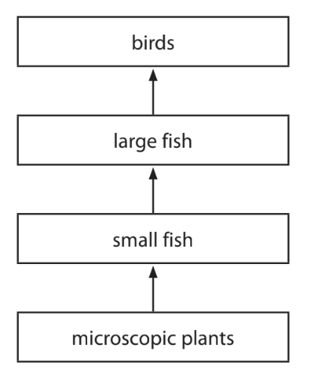

Name the primary consumer in this food chain.

### 2((b)) — 5 marks — command: multiple — structured — from paper Jan 2021 · 4BI1/1B
The microscopic plants convert light energy into chemical energy.

(i) Describe the process that converts light energy into chemical energy.

**(3)**

(ii) Give two reasons why some of the energy in the microscopic plants is not transferred to the small fish.

**(2)**

### 2((c)) — 2 marks — command: suggest — structured — from paper Jan 2021 · 4BI1/1B
The birds do not have teeth.

The fish they eat is initially crushed in part of their digestive system called a gizzard.

Suggest why crushing the fish in the gizzard helps the birds to digest the fish.

## Q2 — easy — 11 marks · exam-questions

### 9((a)) — 6 marks — command: multiple — structured — from paper Nov 2021 · 4BI1/1B
The diagram shows an ocean food web.

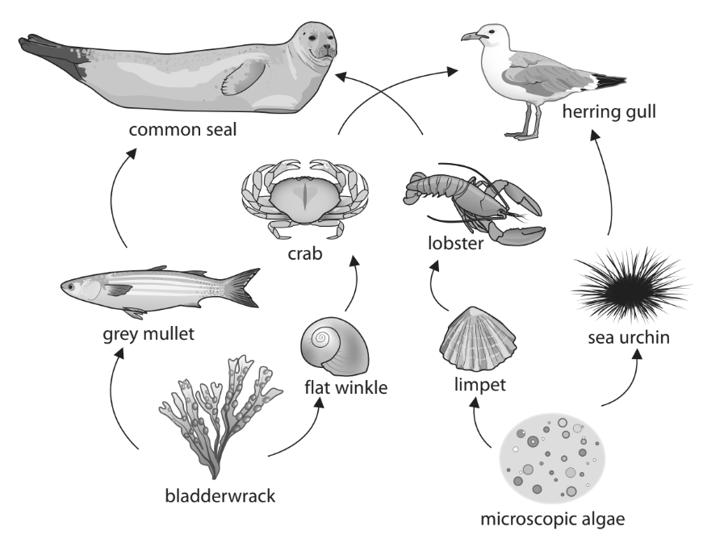

(i) Name the producers in this food web.

**(2)**

(ii) Name two secondary consumers in this food web.

**(2)**

(iii) Draw a food chain from this food web that contains four organisms and includes the herring gull.

**(2)**

### 9((b)) — 5 marks — command: multiple — structured — from paper Nov 2021 · 4BI1/1B
This food chain is found in the food web.

**microscopic algae → limpet → lobster → common seal**

(i) Sketch and label the pyramid of energy for this food chain.

**(2)**

(ii) Explain why the amount of energy available to the organisms changes along this food chain.

**(3)**

## Q3 — easy — 8 marks · exam-questions

### 1() — 2 marks — command: identify — structured
The image below shows a simple food web.

(i) Identify which of the following statements best describes secondary consumers in this food web.

**(1)**

| **A** | Carnivores that eat herbivores. |
|---|---|
| **B** | Herbivores that eats producers. |
| **C** | Carnivores that also eat producers. |
| **D** | Apex predators. |

(ii) Identify which of the following pyramids correctly shows the pyramid of biomass for one of the food chains in the image above

**(1)**

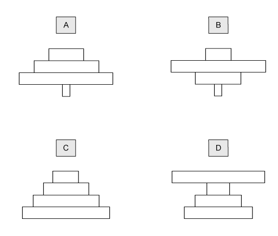

### 2() — 2 marks — command: explain — structured
Explain why a food chain rarely has more than five trophic levels.

### 3() — 2 marks — command: calculate — structured
In the food web in part (a) the biomass of the producer (plankton) is 10 000 kg. Only 8 % of this biomass is passed to the shrimp and, of that, only 7 % is passed onto the penguin.

Calculate the biomass that is gained by the penguin in this food web.

### 4() — 2 marks — command: explain — structured
The population of penguins in the food web shown in part (a) decreases after a harsh winter.

Explain the effect this might have on the shrimp and seal populations.

## Q4 — medium — 9 marks · exam-questions

### 1((a)) — 5 marks — command: multiple — structured — from paper Jan 2022 · 4BI1/1BR
The diagram shows part of a food web for a desert community.

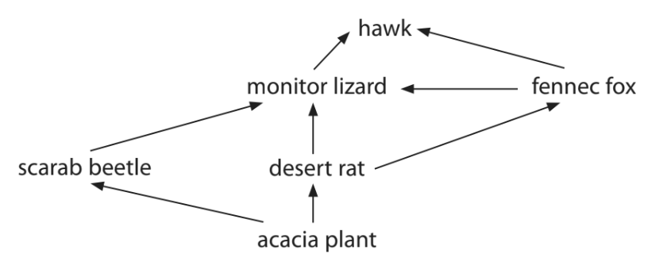

(i) Identify how many organisms in this food web are secondary consumers.

**(1)**

| **A** | 2 |
|---|---|
| **B** | 3 |
| **C** | 4 |
| **D** | 5 |

(ii) Draw the longest food chain in this food web.

**(1)**

(iii) Explain why most of the energy in the producers is **not** transferred to the hawk.

**(3)**

### 1((b)) — 4 marks — command: explain — structured — from paper Jan 2022 · 4BI1/1BR
The photograph shows a fennec fox.

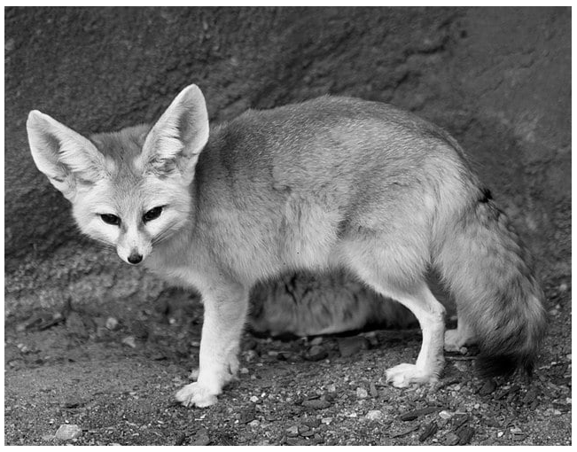

Drew Avery, CC BY 2.0 <https://creativecommons.org/licenses/by/2.0>, via Wikimedia Commons

Fennec foxes live in the Sahara Desert, which is very hot. They have very large ears and a thin body.

Explain how the body shape of the fennec fox has evolved by natural selection.

## Q5 — medium — 13 marks · exam-questions

### 4((a)) — 2 marks — command: draw — structured — from paper Nov 2020 · 4BI1/1BR
The plants in a woodland are eaten by mice and caterpillars.

The mice also eat the caterpillars.

The mice are eaten by birds called owls.

Draw a food web showing these feeding relationships.

### 4((b)) — 1 mark — command: give — structured — from paper Nov 2020 · 4BI1/1BR
Give the term that describes the trophic level of a caterpillar.

### 4((c)) — 10 marks — command: multiple — structured — from paper Nov 2020 · 4BI1/1BR
The woodland covered a total area of 5 km2.

A scientist investigates the number of mice and owls in the woodland.

He counts the number of mice and owls on the same summer day each year for five years.

The table shows the scientist’s results.

| **Year** | **Number of mice per km****2** | **Number of owls in the entire woodland** |
|---|---|---|
| 1 | 2 × 103 | 10 |
| 2 | 2 × 103 | 12 |
| 3 | 3 × 103 | 12 |
| 4 | 5 × 103 | 16 |
| 5 | 1 × 103 | 14 |

(i) Calculate the number of mice in the total area of woodland in year 3.

**(2)**

(ii) Suggest why there were more mice in year 4 than in the other years.

**(3)**

(iii) Suggest why the number of owls was fairly constant each year.

**(2)**

(iv) Suggest a method you would use to estimate the number of mice in the woodland.

**(3)**

## Q6 — medium — 10 marks · exam-questions

### 6((a)) — 1 mark — command: identify — structured — from paper June 2021 · 4BI1/1B
A student studies the organisms in a pond community.

Identify which of these is the correct description of a community.

| **A** | The living organisms together with their non-living environment |
|---|---|
| **B** | The area where organisms live |
| **C** | The organisms of all species in a habitat |
| **D** | The organisms of one species in a habitat |

### 6((b)) — 5 marks — command: multiple — structured — from paper June 2021 · 4BI1/1B
The table shows the number of organisms per m2 at different trophic levels in a pond community.

It also shows the total biomass of these organisms per m2.

| **Trophic level** | **Number of individuals per m****2** | **Total biomass in g per m****2** |
|---|---|---|
| secondary consumers | 100 | 1.0 |
| primary consumers | 1.5 x 104 | 2.5 |
| producers | 7.2 x 1010 | 17.5 |

(i) Calculate the mean mass in g of a single primary consumer.

Give your answer in standard form.

**(3)**

(ii) Use the grid to draw a pyramid of biomass for the pond community.

**(2)**

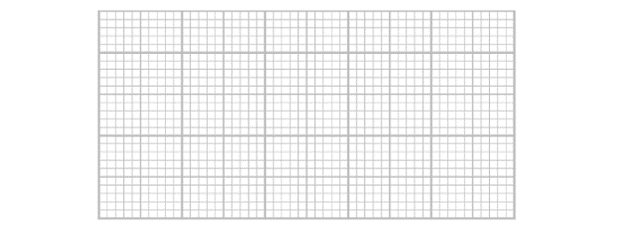

### 6((c)) — 4 marks — command: multiple — structured — from paper June 2021 · 4BI1/1B
The number of secondary consumers is low because energy transfer is not 100 % efficient.

(i) Explain why egestion is one reason why energy transfer is not 100 % efficient.

**(2)**

(ii) Give two other reasons why energy transfer is not 100 % efficient.

**(2)**

## Q7 — hard — 7 marks · exam-questions

### 6((a)) — 3 marks — command: multiple — structured — from paper Jan 2021 · 4BI1/2BR
Pyramids of biomass and energy transfer are ways of representing what happens in an ecosystem.

Diagram 1 shows pyramids of biomass for a crop field ecosystem and for a coral reef ecosystem.

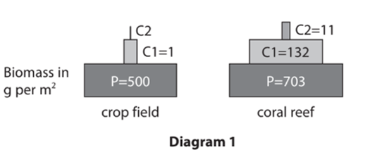

(i) Use data from Diagram 1 to calculate the efficiency of the transfer of biomass from producers (P) to primary consumers (C1) in the coral reef.

**(1)**

(ii) The efficiency of the transfer of biomass from primary consumers (C1) to secondary consumers (C2) in the crop field is 1%.

Calculate the biomass of the secondary consumers in the crop field in g per m2.

**(1)**

(iii) Suggest why the biomass transfer is different in the coral reef compared to the crop field.

**(1)**

### 6((b)) — 2 marks — command: explain — structured — from paper Jan 2021 · 4BI1/2BR
Diagram 2 shows pyramids of biomass for an ocean and a lake.

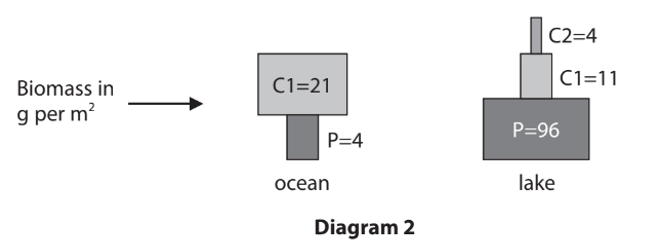

Explain the shape of the pyramid of biomass for the ocean.

### 6((c)) — 2 marks — command: suggest — structured — from paper Jan 2021 · 4BI1/2BR
Suggest how scientists could estimate the energy of the producers in 1 m2 of the crop field.

## Q8 — hard — 16 marks · exam-questions

### 1((a)) — 2 marks — command: identify — structured — from paper Jan 2021 · 4BI1/2B
#### Separate: Biology Only

Read the passage below. Use the information in the passage and your own knowledge to answer the questions that follow.

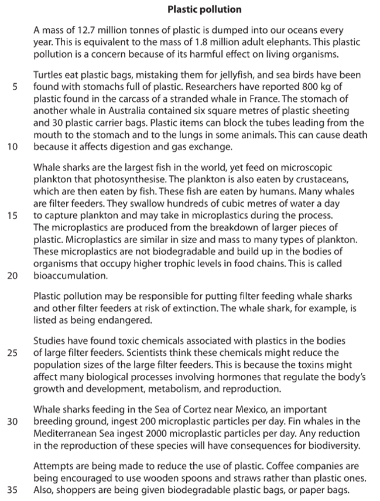

(i) Identify which organism named in the passage is a producer?

**(1)**

| **A** | Crustaceans |
|---|---|
| **B** | Microscopic plankton |
| **C** | Sea birds |
| **D** | Turtles |

(ii) Identify which organism named in the passage is a tertiary consumer?

**(1)**

| **A** | Crustaceans |
|---|---|
| **B** | Fin whale |
| **C** | Human |
| **D** | Whale shark |

### 1((b)) — 5 marks — command: explain — structured — from paper Jan 2021 · 4BI1/2B
#### Separate: Biology Only

Explain how blocked tubes leading from the mouth can lead to death in some animals. (lines 8 to 10)

### 1((c)) — 2 marks — command: suggest — structured — from paper Jan 2021 · 4BI1/2B
#### Separate: Biology Only

Suggest why bioaccumulation of microplastics is a problem for humans. (lines 17–20)

### 1((d)) — 3 marks — command: calculate — structured — from paper Jan 2021 · 4BI1/2B
#### Separate: Biology Only

Calculate the difference between the number of plastic particles ingested in a year by a fin whale and a whale shark. (lines 29–31)

Give your answer in standard form.

### 1((e)) — 2 marks — command: explain — structured — from paper Jan 2021 · 4BI1/2B
#### Separate: Biology Only

Explain the effects of reduced reproduction on biodiversity. (lines 31–32)

### 1((f)) — 2 marks — command: suggest — structured — from paper Jan 2021 · 4BI1/2B
#### Separate: Biology Only

Suggest a benefit of using biodegradable plastic bags. (line 35)

## Q9 — hard — 12 marks · exam-questions

### 7((a)) — 2 marks — command: identify — structured — from paper Jan 2022 · 4BI1/1B
The diagram shows a food web from a woodland ecosystem.

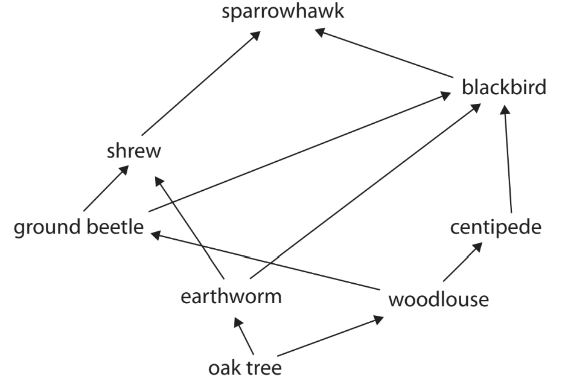

(i) Identify which organism in the food web is the producer?

**(1)**

| **A** | Blackbird |
|---|---|
| **B** | Centipede |
| **C** | Earthworm |
| **D** | Oak tree |

(ii) Identify which organism acts as both a secondary consumer and a tertiary consumer in the food web?

**(1)**

| **A** | Blackbird |
|---|---|
| **B** | Earthworm |
| **C** | Ground beetle |
| **D** | Sparrowhawk |

### 7((b)) — 4 marks — command: multiple — structured — from paper Jan 2022 · 4BI1/1B
The amount of energy transferred changes as you move along a food chain.

The data comes from an ecosystem containing producers, primary consumers and secondary consumers.

| **Level** | **Energy in each level in kJ per m****2**** per year** |
|---|---|
| Producers | 8.7 x 105 |
| Primary consumers | 1.4 x 104 |
| Secondary consumers | 1.6 x 103 |

(i) The light energy reaching the producers is 7.1 × 106 kJ per m2 per year.

Explain why the plants cannot absorb all of this energy.

**(2)**

(ii) The table shows that energy is transferred between producer and primary consumer and between primary consumer and secondary consumer.

A student states that the energy transfer between producer and primary consumer is the most efficient.

Determine whether the student’s statement is correct.

**(2)**

### 7((c)) — 6 marks — command: multiple — structured — from paper Jan 2022 · 4BI1/1B
Woodlice feed on dead and decaying plant material in the soil. The photographs show how a woodlouse can curl up into a ball.

This behaviour is an example of a reflex response.

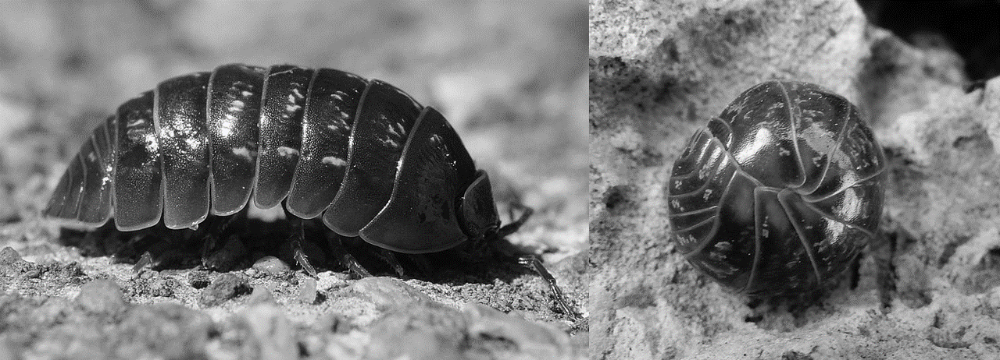

Franco Folini, CC BY-SA 3.0 <http://creativecommons.org/licenses/by-sa/3.0/>, via Wikimedia Commons

DinaKuzia, CC BY-SA 4.0 <https://creativecommons.org/licenses/by-sa/4.0>, via Wikimedia Commons

(i) State what is meant by a reflex response.

**(1)**

(ii) Give a reason why this reflex response benefits the woodlouse.

**(1)**

(iii) Describe how this reflex response could have evolved by natural selection.

**(4)**

## Q10 — hard — 13 marks · exam-questions

### 4() — 3 marks — command: multiple — structured — from paper Nov 2020 · 4BI1/1B
The diagram shows a food chain in the Antarctic ocean.

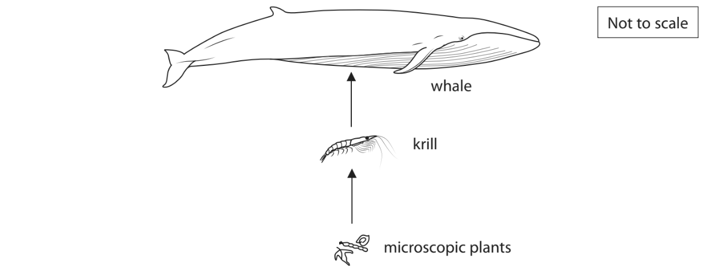

(i) Identify which term describes the trophic level of the krill.

**(1)**

| **A** | Predator |
|---|---|
| **B** | Prey |
| **C** | Primary consumer |
| **D** | Secondary consumer |

(ii) Draw a labelled pyramid of biomass to represent this food chain.

**(2)**

### 4((b)) — 2 marks — command: calculate — structured — from paper Nov 2020 · 4BI1/1B
The microscopic plants float in seawater, but also grow on the lower surface of ice.

The krill feed on the microscopic plants.

They remove microscopic plants from the lower surface of the ice at a rate of 1.6 cm2 per second.

Calculate the time taken for the krill to remove microscopic plants from one square metre of ice.

Give your answer in minutes.

### 4((c)) — 4 marks — command: suggest — structured — from paper Nov 2020 · 4BI1/1B
A student investigates the rate that krill feeding removes microscopic plants floating in seawater.

Suggest how the student could do this investigation in a laboratory.

### 4((d)) — 4 marks — command: explain — structured — from paper Nov 2020 · 4BI1/1B
Krill obtain most of their food from microscopic plants growing on the lower surface of ice.

Explain how global warming could affect the whale population in the Antarctic ocean.
