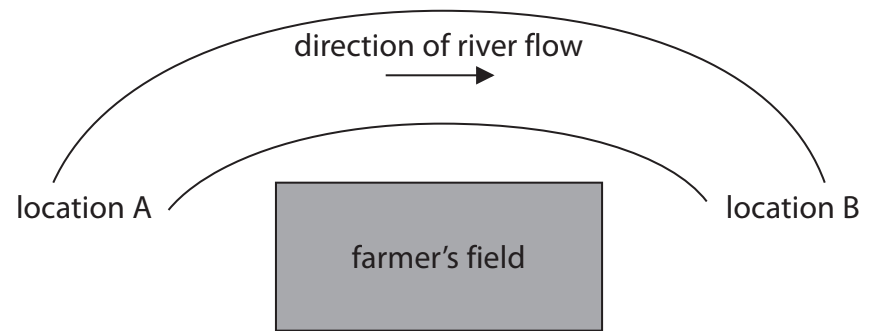
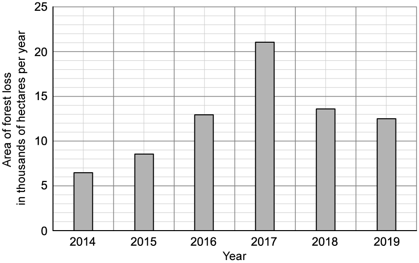

# Exam Questions — Human Influences on the Environment
**5. Ecology & the Environment** · Edexcel IGCSE Biology (Modular) (4XBI1) — 24/Unit 2
> Source: [https://www.savemyexams.com/igcse/biology/edexcel/modular/24/unit-2/topic-questions/ecology-and-the-environment/human-influences-on-the-environment/exam-questions/](https://www.savemyexams.com/igcse/biology/edexcel/modular/24/unit-2/topic-questions/ecology-and-the-environment/human-influences-on-the-environment/exam-questions/) · 13 questions · total 112 marks

## Q1 — easy — 8 marks · exam-questions

### 1() — 1 mark — command: which — structured
Which row of the table gives the combination of factors that would lead to an increased amount of human waste being produced?

**+ means increasing       - means decreasing**

|   | **Standard of Living** | **Population ** | **Life expectancy** |
|---|---|---|---|
| **A** | + | + | + |
| **B** | - | + | + |
| **C** | - | - | + |
| **D** | - | - | - |

### 2() — 2 marks — command: state — structured
State **two** ways in which pollution can reduce biodiversity.

### 3() — 2 marks — command: draw — structured
The boxes below** **show a number of pollutants and the ways that they affect ecosystems.

Draw a line between each pollutant and the effect that it creates.

### 4() — 2 marks — command: calculate — structured
Pesticide levels in the water of a lake were measured at a level of 877 parts per billion.

The same pesticide was measured in the gills of a fish living in that lake and showed biomagnification by a factor of 9.75 million (9 750 000) times.

Calculate the concentration of the pesticide in the fish's gills. Give your answer in standard form.

### 5() — 1 mark — command: explain — structured
Part (d) gives an example of biomagnification, in which the level of a dangerous compound gets higher at successive trophic levels.

Explain how biomagnification differs from bioaccumulation.

## Q2 — easy — 6 marks · exam-questions

### 1() — 2 marks — command: state — structured
#### Separate: Biology Only

State **two **reasons why deforestation is contributing to an increase in atmospheric CO2 levels.

### 2() — 1 mark — command: which — structured
Which of **A - D** is not a possible consequence of global warming?

| **A** | Changes in migration patterns of birds |
|---|---|
| **B** | Sea level rise |
| **C** | Increase in fossil fuel regeneration |
| **D** | Habitat loss for certain animals |

### 3() — 2 marks — command: explain — structured
State and explain the action that carbon dioxide (CO2) and methane (CH4) both have on the atmosphere that causes them to be greenhouses gases.

### 4() — 1 mark — command: name — structured
Other than CO2 and CH4, name **one **other greenhouse gas.

## Q3 — easy — 8 marks · exam-questions

### 1() — 3 marks — command: reorder — structured
When raw sewage is released into a waterway it can lead to eutrophication.

The statements below list some of the stages of the process of eutrophication.

Complete the table by numbering the statements to put the stages into the correct order.

| **Stage of Eutrophication** | **Order** |
|---|---|
| Algal bloom prevents sunlight from reaching aquatic plants. Water oxygen levels fall |   |
| Excessive nutrients from fertilisers run-off from the land into the water |   |
| Algae also show rapid growth |   |
| Death of organisms requiring dissolved oxygen in water |   |
| Decomposition rate increases. Aerobic respiration of decomposers reduces dissolved oxygen further |   |
| Aquatic plants flourish, growing rapidly |   |

### 2() — 2 marks — command: explain — structured
Explain one other potential consequence of the release of raw sewage into a water system.

### 3() — 3 marks — command: multiple — structured
One of the steps of eutrophication involves the decomposing microorganisms carrying out aerobic respiration and depleting the quantity of dissolved oxygen in the water.

(i) Add the correct words in the gaps in the space below to complete the word equation of aerobic respiration.

............................ + oxygen → ............................ +  ............................

**(2)**

(ii) Respiration provides energy for the cell processes carried out by these decomposers.

Name **one** of these processes that is directly linked to how the decomposers get their nutrition.

**(1)**

## Q4 — easy — 8 marks · exam-questions

### 1() — 3 marks — command: explain — structured
The air around us can contain a lot of chemicals that can be harmful to human health.

Explain the biological consequences of air pollution by sulfur dioxide.

### 2() — 1 mark — command: state — structured
State how sulfur dioxide pollution can be reduced.

### 3() — 4 marks — command: explain — structured
Another chemical that contributes to air pollution is carbon monoxide.

(i) State whether carbon monoxide is a greenhouse gas. Explain your answer.

**(2)**

(ii) Explain why carbon monoxide is a harmful air pollutant.

**(2)**

## Q5 — medium — 7 marks · exam-questions

### 9((a)) — 2 marks — command: calculate — structured — from paper Jan 2022 · 4BI1/1BR
Large quantities of food are wasted every year. Waste food needs to be disposed of using methods that do not harm the environment.

The table shows the mass of each gas released into the air from three different methods of waste disposal.

| **Method of waste disposal** | **Mass of each gas released into the air from 1000 kg of waste food in kg** |   |   |   |
|---|---|---|---|---|
| **Carbon dioxide** | **Carbon monoxide** | **Methane** | **Sulfur dioxide** |   |
| Anaerobic digester | 37 | 0.012 | 3.05 | 0.23 |
| Burying in landfill | 220 | 0.680 | 14.70 | 3.12 |
| Burning | 680 | 0.059 | 3.12 | 0.08 |

Calculate how much carbon dioxide would be released from 125 kg of waste food when using an anaerobic digester.

Give your answer to two significant figures and in kilograms.

### 9((b)) — 5 marks — command: evaluate — structured — from paper Jan 2022 · 4BI1/1BR
Some scientists have claimed that anaerobic digesters are the most environmentally friendly method of waste disposal.

Evaluate this claim using data from the table and your own knowledge.

## Q6 — medium — 9 marks · exam-questions

### 10((a)) — 4 marks — command: explain — structured — from paper Nov 2020 · 4BI1/1BR
Farmers may add chemical fertilisers to their soil.

Explain how chemical fertilisers can increase crop yield.

### 10((b)) — 4 marks — command: discuss — structured — from paper Nov 2020 · 4BI1/1BR
These fertilisers may leak into rivers.

A scientist measures the oxygen content of water in two different locations of the same river during the month of April.

In location A he finds that the mean dissolved oxygen was 6 mg per litre and at location B he finds that the mean dissolved oxygen was 3 mg per litre.

He concludes that the use of fertiliser in the field has affected the oxygen content of the river.

Discuss his conclusion.

### 10((c)) — 1 mark — command: suggest — structured — from paper Nov 2020 · 4BI1/1BR
Some farmers use alternative substances to chemical fertilisers.

Suggest one alternative substance that a farmer may use.

## Q7 — medium — 9 marks · exam-questions

### 1() — 2 marks — command: suggest — structured
#### Separate: Biology Only

Deforestation is a major contributor to the general decline of biodiversity worldwide.

Suggest **two** ways in which deforestation impact biodiversity negatively.

### 2() — 3 marks — command: calculate — structured
#### Separate: Biology Only

Data from the United Nations suggests that globally, we are losing 88 000 km2 of natural forest every year to timber and paper production, and to clearance of land for crops and livestock grazing.

A football pitch has an area of 7 140 m2.

Calculate the time taken, at the current rate of deforestation, for a football pitch-sized piece of land to be deforested. Give your answer to the nearest whole second.

### 3() — 4 marks — command: explain — structured
#### Separate: Biology Only

Deforestation can lead to soil erosion.

Describe how soil erosion occurs and explain the effect of soil erosion on the environment.

## Q8 — medium — 10 marks · exam-questions

### 1() — 3 marks — command: explain — structured
There is a general consensus amongst the scientific community that increased levels of carbon dioxide emissions, as a result of human activity, are causing global warming due to an enhanced greenhouse effect.

Explain how increases in the proportions of greenhouse gases in the atmosphere have led to global warming.

### 2() — 2 marks — command: suggest — structured
Global warming, and the climate change that it brings, have an overall detrimental effect on biodiversity and ecology in general.

Suggest and explain one effect of global warming that may be **beneficial **to an individual species.

### 3() — 5 marks — command: multiple — structured
The graph below shows the total greenhouse gas emissions from Europe and China from the years 1990 to 2019.

The emission data is given using the unit billion tonnes.

(i) Describe the data in the graph.

**(3)**

(ii)Give **two** reasons that could explain the trends shown in the graph.

**(2)**

## Q9 — medium — 10 marks · exam-questions

### 1() — 2 marks — command: calculate — structured
The diagram shows a river and the location of a fertiliser factory. The arrows indicate the direction of the flow of the river.

A scientist recorded the nitrate concentrations of the water at site A and site B. Her results are shown in the table.

| **Site** | **Nitrate concentration / mg per dm****3** |   |   |   |
|---|---|---|---|---|
| **Sample 1** | **Sample 2** | **Sample 3** | **Mean** |   |
| **A** | 17 | 25 | 18 | 20 |
| **B** | 49 | 64 | 58 |   |

Calculate the mean nitrate concentration found at site **B.**

### 2() — 4 marks — command: explain — structured
The scientist observed algae and some dead fish in the river at site **B**. These were not present at site **A**.

Give an explanation for these observations.

### 3() — 4 marks — command: explain — structured
Scientists carried out another test and found higher than normal levels of sulfuric acid dissolved in the water in the stream at both sites.

Explain a series of events that could have led to sulfuric acid washing into the river.

## Q10 — hard — 7 marks · exam-questions

### 1() — 1 mark — command: calculate — structured
#### Separate: Biology Only

The graph below shows the area of forest land lost in Ecuador in the years 2014 - 2019 inclusive.

Determine the total area of land lost to deforestation in Ecuador from the beginning of 2014 to the end of 2019.

### 2() — 2 marks — command: identify — structured
#### Separate: Biology Only

Complete the table by placing a tick (✓) in the relevant boxes below to identify possible reasons for the change in the area of forest lost per year between 2014 and 2017.

| The local people stop growing maize |   |
|---|---|
| Less new house-building is needed for the population |   |
| The local people decided to farm sheep and goats |   |
| More trees have been planted |   |
| A company starts growing sugar cane for the production of biofuel |   |

### 3() — 2 marks — command: suggest — structured
#### Separate: Biology Only

Suggest **two** explanations for the reduction in loss of forest land in Ecuador in the years 2018 and 2019.

### 4() — 2 marks — command: explain — structured
#### Separate: Biology Only

Some government officials looked at the graph in part (a) in late 2019 and concluded that the forest was starting to recover.

Explain why this conclusion may be incorrect.

## Q11 — hard — 11 marks · exam-questions

### 1() — 2 marks — command: give — structured
Cutting down trees, known as deforestation, causes an increase in the level of carbon dioxide (CO2) in the atmosphere.

Give **two **reasons why deforestation causes an increase in atmospheric CO2.

### 2() — 5 marks — command: explain — structured
A dairy farmer hoses down the floors of his milking shed at the end of each day's milking. The waste water flows from the shed floor and is pumped into a storage tank. This waste water contains urine and faeces from the cattle.

On one occasion the waste water storage tank overflowed and entered a nearby stream.

Explain the effect that this event will have on the plants and animals living in the stream.

### 3((c)) — 4 marks — command: comment — structured — from paper Nov 2021 · 4BI1/1B
Farmers keep cows to produce milk.

Injecting cows with growth hormone (GH) will increase milk production.

This allows farmers to obtain the same volume of milk from fewer cows.

Digestion in cows releases methane gas into the atmosphere.

A scientist claims that injecting GH into cows would reduce climate change.

Comment on this claim.

## Q12 — hard — 9 marks · exam-questions

### 1() — 4 marks — command: plot — structured
The table below gives data about how the carbon dioxide (CO2) concentration of the earth's atmosphere has changed over time.

| **Year** | **CO****2**** concentration in parts per million** |
|---|---|
| 1800 | 282 |
| 1900 | 295 |
| 1950 | 310 |
| 2000 | 370 |
| 2020 | 410 |
| 2022 | 420 |

Plot the data from the table on the graph paper provided below.

### 2() — 3 marks — command: explain — structured
Explain why carbon dioxide concentrations in the atmosphere are changing.

### 3() — 2 marks — command: calculate — structured
In 2022 a climate activist claimed that, to arrest global warming, the atmospheric CO2 level should be brought back to the level of the year 1900.

Using the data from the table in part (a), calculate the percentage decrease that the climate activist claims would be needed to return the atmospheric CO2 level to its 1900 level.

## Q13 — hard — 10 marks · exam-questions

### 1() — 2 marks — command: explain — structured
When fossil fuels are burned sulfur dioxide gas (SO2) can also be released into the atmosphere.

Flue gases from the burning process can be captured and desulfurised, a process which traps the flue gases and reacts with the sulfur dioxide with calcium hydroxide.

A further step results in the formation of calcium sulfate which is a major component of plasterboard used in the building industry.

Ca(OH)2(s) + SO2(g) → CaSO3(s) + H2O(l)

Apart from supplying the building industry, explain one benefit of the process of flue gas desulfurisation.

### 2() — 3 marks — command: describe — structured
Describe the potential consequences for living organisms of failing to carry out flue gas desulfurisation.

### 3() — 5 marks — command: evaluate — structured
There are currently two main ways in which household rubbish is disposed of by local authorities in the UK.

These are:

- Landfill: rubbish is buried underground
- Incineration: rubbish is burned at 1000 °C

The table below outlines some of the features of both methods.

| **Landfill** | **Incineration** |
|---|---|
| Traditional, trusted | A newer method |
| Needs a large hole in the ground, e.g. a disused quarry | Involves a high-tech incineration plant |
| Generates CO2 and methane as organic waste decays | Generates a lot of CO2 |
| Causes odours and insect/rat infestations | Clean-burning can mean that few pollutants are emitted to the atmosphere/rivers |
| Requires waste to be transported a long way, even exported | Generates heat and electricity for the local grid |
| Suitable sites are running out | Unpopular with local people |
| Toxins can be leached from landfill sites when water runs through a site | Can be set up in all localities |

Use the data in** **the table and your knowledge of waste treatment to evaluate both methods of waste disposal.
