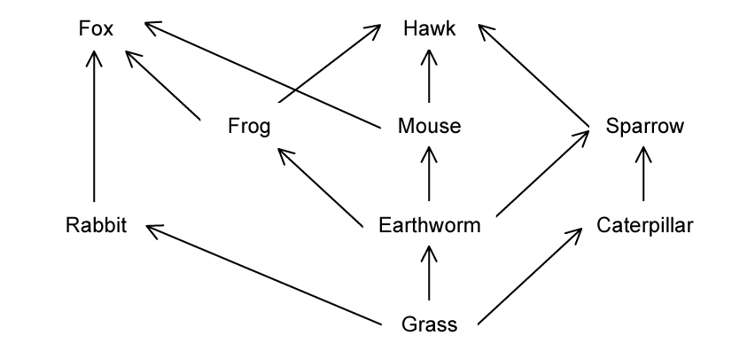
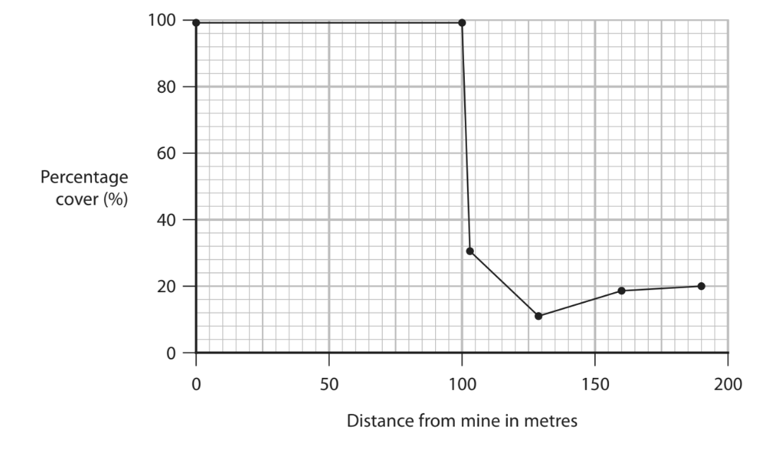
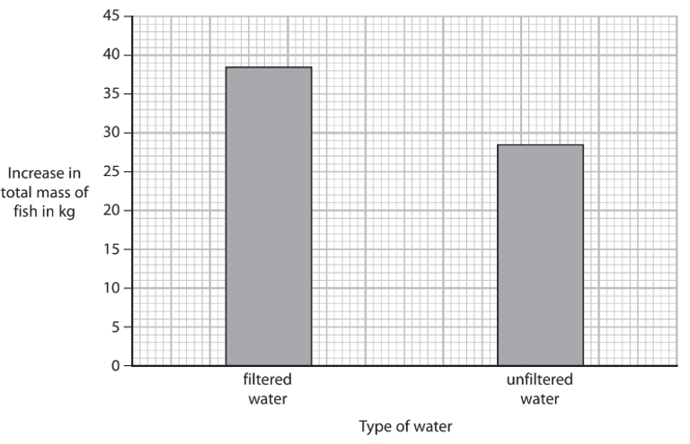
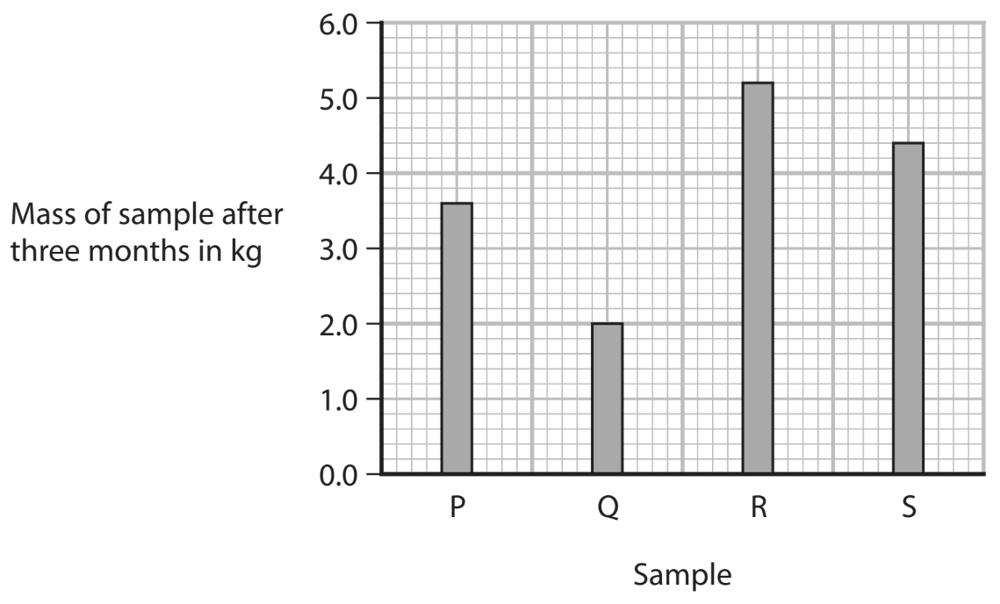

# Exam Questions — The Organism in the Environment
**5. Ecology & the Environment** · Edexcel IGCSE Biology (Modular) (4XBI1) — 24/Unit 2
> Source: [https://www.savemyexams.com/igcse/biology/edexcel/modular/24/unit-2/topic-questions/ecology-and-the-environment/the-organism-in-the-environment/exam-questions/](https://www.savemyexams.com/igcse/biology/edexcel/modular/24/unit-2/topic-questions/ecology-and-the-environment/the-organism-in-the-environment/exam-questions/) · 11 questions · total 93 marks

## Q1 — easy — 8 marks · exam-questions

### 1() — 2 marks — command: describe — structured
Describe the meaning of the term 'community'.

### 2() — 2 marks — command: explain — structured
This image shows a food web.

The organisms in this food web are said to be interdependent.

Explain what is meant by this.

### 3() — 2 marks — command: explain — structured
The information in part (b) shows some interactions and feeding relationships between different species. However, the image does not represent an entire ecosystem.

Explain why.

### 4() — 2 marks — command: explain — structured
After a period of drought, there was a reduction in the growth of grass.

With reference to the image in part (b), explain how this would affect the population of caterpillars.

## Q2 — easy — 6 marks · exam-questions

### 1() — 1 mark — command: suggest — structured
Some students collected some data about the size of the population of lichens on four trees within their school grounds.

They used the following method:

- choose four trees in the area
- hold a quadrat on the north side of the trunk of one tree
- count the total number of all the lichens in the quadrat
- then do this on the east, south and west side of the tree
- repeat this for each tree.

Suggest how the students could choose four trees.

### 2() — 2 marks — command: calculate — structured
The students put their results into a table.

|   | **Number of individual lichens found in each quadrat** |   |   |   |
|---|---|---|---|---|
| **Tree number** | **North** | **East** | **South** | **West** |
| 1 | 4 | 11 | 15 | 7 |
| 2 | 3 | 10 | 18 | 9 |
| 3 | 4 | 12 | 17 | 12 |
| 4 | 5 | 15 | 12 | 8 |
| mean | 4.0 | 12.0 | 15.5 |   |

Calculate the mean number of lichens found in the quadrats from the west side of the tree.

### 3() — 1 mark — command: give — structured
The students measured the abundance of the lichen by counting the number of individual lichen in each quadrat.

Give another method that the students could have used to measure the abundance of the lichen.

### 4() — 2 marks — command: give — structured
Some species of lichen are formed from a mutualistic relationship between fungi and photosynthetic algae.

Give **two **abiotic factors which would impact the growth of these lichens.

## Q3 — easy — 7 marks · exam-questions

### 1() — 2 marks — command: state — structured
#### Separate: Biology Only

Some students were investigating the biodiversity of plants in a salt marsh.

State the meaning of the term 'biodiversity'.

### 2() — 1 mark — command: suggest — structured
#### Separate: Biology Only

The students used two tape measures to set up a study area in two different locations in the salt marsh.

They then used a random number generator to select three sample sites within the marked out study areas.

At each sample site, the students counted how many different species of plant were present.

Suggest **one** adjustment to the method which would help to ensure that the student collected a representative sample.

### 3() — 1 mark — command: identify — structured
#### Separate: Biology Only

The data collected from sample site **A** and sample site** B **can be seen below:

| **Sample number** | **Number of species at site A** | **Number of species at site B** |
|---|---|---|
| 1 | 4 | 3 |
| 2 | 5 | 2 |
| 3 | 4 | 6 |
| Average number of species |   |   |

Identify which site has the highest biodiversity.

### 4() — 1 mark — command: suggest — structured
#### Separate: Biology Only

The marsh is also home to several species of birds.

Suggest why data could not be collected about these birds using the method from part **(b)**.

### 5() — 2 marks — command: explain — structured
#### Separate: Biology Only

Several large heather plants were found in location B.

Explain how their presence may have led to the biodiversity seen in the data collected.

## Q4 — medium — 11 marks · exam-questions

### 6((a)) — 2 marks — command: explain — structured — from paper Nov 2020 · 4BI1/1BR
Lichens are organisms that grow well on stone walls in unpolluted air.

Lichens grow less well in polluted air.

Car exhaust fumes contain sulfur dioxide that pollutes air.

A scientist investigates the effect of pollution by cars in a city.

This is her method.

- Measure the percentage area of a stone wall in the city centre covered by lichen
- Repeat this measurement at different distances from the city centre

The table shows her results.

| **Distance from city centre in km** | **Percentage area covered by lichen (%)** |
|---|---|
| 0 | 0 |
| 2 | 6 |
| 4 | 20 |
| 6 | 30 |
| 8 | 50 |
| 10 | 64 |
| 12 | 70 |

Explain the results shown in the table.

### 6((b)) — 3 marks — command: describe — structured — from paper Nov 2020 · 4BI1/1BR
Describe a method to measure the percentage of a stone wall covered by lichen.

### 6((c)) — 6 marks — command: design — structured — from paper Nov 2020 · 4BI1/1BR
Adding water to a powder called sodium metabisulphite will release sulfur dioxide gas.

Design a laboratory investigation to find out the effect of sulfur dioxide gas on the heat released by germinating seeds.

Include experimental details in your answer and write in full sentences.

## Q5 — medium — 9 marks · exam-questions

### 5((a)) — 2 marks — command: describe — structured — from paper Nov 2021 · 4BI1/1B
Genetic modification is a process used to improve crop yield.

Describe the role of a named vector in the process of genetic modification.

### 5((b)) — 7 marks — command: multiple — structured — from paper Nov 2021 · 4BI1/1B
Weeds are plants that grow where they are not wanted.

Removing weeds reduces competition for mineral ions and improves crop yield.

(i) Name the mineral ion used to make chlorophyll.

**(1)**

(ii) Two different methods can be used to remove weeds to improve crop yield.

- Method A: pull weeds out of the ground by hand
- Method B: spray weeds with a chemical that kills them

Design an investigation to find out which method produces the highest crop yield.

Include experimental details in your answer and write in full sentences.

**(6)**

## Q6 — medium — 11 marks · exam-questions

### 4((a)) — 3 marks — command: complete — structured — from paper Jan 2021 · 4BI1/1B
The table gives some examples of biological processes.

Complete the table by giving the name of each process.

The first one has been done for you.

| **Examples of process** | **Name of process** |
|---|---|
| Plants with a short growing season survive drought | Natural selection |
| Growth of algae in rivers polluted by fertiliser |   |
| Pollen transferred from one plant to another by an insect |   |
| Absorption of nitrate ions from soil using ATP |   |

### 4((b)) — 8 marks — command: multiple — structured — from paper Jan 2021 · 4BI1/1B
Zinc is poisonous to many plants and can affect natural selection.

A scientist investigates the ability of one grass species to survive at different distances from a zinc mine.

The scientist uses a sampling method to measure the percentage cover of this grass species at different distances from the zinc mine.

The graph shows the scientist’s results.

(i) The zinc concentration in soil is higher near the zinc mine than it is further from the zinc mine.

Explain how natural selection could be responsible for the results shown in the graph between 0 and 100 metres.

**(4)**

(ii) Describe a method the scientist could use to compare the population size of the grass species at 50 metres and 100 metres from the mine.

**(4)**

## Q7 — medium — 9 marks · exam-questions

### 6((a)) — 2 marks — command: describe — structured — from paper Nov 2021 · 4BI1/2B
#### Separate: Biology Only

A group of students compares the distribution of plant species in two fields using this method.

- Use random sampling
- Use a 0.5m × 0.5m quadrat
- Count the number of each species in a quadrat

Repeat this method for five quadrats in each field.

The tables show the students’ results

| **Species** | **Field A** |   |   |   |   |   |   |
|---|---|---|---|---|---|---|---|
| **Number of plants in each quadrat** | **Number of plants per m****2** |   |   |   |   |   |   |
| **First** | **Second** | **Third** | **Forth** | **Fifth** | **Mean** |   |   |
| Dandelion | 7 | 0 | 6 | 3 | 4 | 4 | 16 |
| Buttercup | 2 | 1 | 0 | 3 | 2 | 2 | 6 |
| Violet | 1 | 0 | 2 | 1 | 2 | 1 | 5 |
| Heather | 2 | 3 | 1 | 2 | 1 | 2 | 7 |

| **Species** | **Field B** |   |   |   |   |   |   |
|---|---|---|---|---|---|---|---|
| **Number of plants in each quadrat** | **Number of plants per m****2** |   |   |   |   |   |   |
| **First** | **Second** | **Third** | **Forth** | **Fifth** | **Mean** |   |   |
| Dandelion | 7 | 3 | 2 | 1 | 2 |   |   |
| Buttercup | 0 | 0 | 0 | 0 | 0 | 0 | 0 |
| Violet | 0 | 0 | 0 | 1 | 0 | 0 | 0 |
| Heather | 0 | 0 | 0 | 0 | 0 | 0 | 0 |

Describe how the students would obtain random samples from each field.

### 6((b)) — 2 marks — command: calculate — structured — from paper Nov 2021 · 4BI1/2B
#### Separate: Biology Only

(i) Calculate the mean number of dandelions per quadrat in field B.

**(1)**

(ii) Calculate the number of dandelions per m2 in field B

**(1)**

### 6((c)) — 2 marks — command: describe — structured — from paper Nov 2021 · 4BI1/2B
#### Separate: Biology Only

Describe the differences in species distribution in field A and field B.

### 6((d)) — 3 marks — command: describe — structured — from paper Nov 2021 · 4BI1/2B
#### Separate: Biology Only

A teacher suggests that there are no buttercups in field B because of poor water drainage from the field.

Describe what further experiment the students could do to investigate this suggestion.

## Q8 — hard — 8 marks · exam-questions

### 5((a)) — 3 marks — command: describe — structured — from paper June 2021 · 4BI1/1B
Weeds are plants that compete with crop plants.

A scientist investigates the use of two different ways of reducing the population of weeds.

This is her method.

- Use chemical control in one field by spraying herbicides, a type of pesticide, that kill the weeds
- Use biological control in another field by releasing insects that eat the weeds
- Measure the mean (average) number of weeds in each field once a month from February to August

The table shows the scientist’s results.

| **Month** | **Mean number of weeds per m****2** |   |
|---|---|---|
| **chemical control** | **biological control** |   |
| February | 2 | 12 |
| March | 16 | 8 |
| April | 3 | 4 |
| May | 20 | 3 |
| June | 3 | 4 |
| July | 18 | 3 |
| August | 2 | 3 |

Describe a method to measure the mean number of weeds per m2 in each field.

### 5((b)) — 5 marks — command: discuss — structured — from paper June 2021 · 4BI1/1B
The scientist concludes that biological control is a better way of controlling weeds than chemical control.

Discuss this conclusion.

Use data from the table and your own knowledge to support your answer.

## Q9 — hard — 8 marks · exam-questions

### 4((a)) — 3 marks — command: calculate — structured — from paper June 2021 · 4BI1/2B
A scientist uses this method to investigate the effect of water quality on the growth of fish.

- fill a pond with filtered water
- fill another pond with unfiltered water
- place the same mass of fish of the same species in each pond
- determine the increase in total mass of fish in each pond after 180 days

The graph shows the scientist’s results.

The mean rate of increase in total mass of the fish in the filtered water is 0.214kg per day.

Calculate the difference between the mean rate of increase in the total mass of the fish in filtered and unfiltered water.

### 4((b)) — 3 marks — command: explain — structured — from paper June 2021 · 4BI1/2B
Unfiltered water contains more bacteria.

Explain why unfiltered water containing more bacteria affects the growth of fish.

### 4((c)) — 1 mark — command: give — structured — from paper June 2021 · 4BI1/2B
Give one biotic variable the scientist controlled in the investigation.

### 4((d)) — 1 mark — command: give — structured — from paper June 2021 · 4BI1/2B
Give a method the scientist could use to control interspecific predation in the ponds.

## Q10 — hard — 7 marks · exam-questions

### 7((a)) — 1 mark — command: give — structured — from paper June 2021 · 4BI1/2B
#### Separate: Biology Only

The biodiversity in an ecosystem can be determined by counting the number of different species present and the number of individuals of each species present.

Give the term that describes the number of individuals of one species present in a habitat at one time.

### 7((b)) — 4 marks — command: multiple — structured — from paper June 2021 · 4BI1/2B
#### Separate: Biology Only

Students compared the biodiversity of two fields, A and B.

They determined the number of individual plants of three species in each field.

They also calculated the percentage of each species of plant compared to the total number of plants of all three species for each field.

The table shows the results.

| **Species** | **Field A** | **Field B** |   |   |
|---|---|---|---|---|
| **Number of each plant** | **Percentage (%) of each species** | **Number of each plant** | **Percentage (%) of each species** |   |
| daisy | 19 | 76 | 15 |   |
| dandelion |   | 16 | 18 | 38 |
| buttercup |   | 8 | 14 | 30 |
| total | 25 | 100 | 47 | 100 |

(i) Complete the table by calculating the missing values.

**(2)**

(ii) Explain which field has the greater biodiversity.

**(2)**

### 7((c)) — 2 marks — command: explain — structured — from paper June 2021 · 4BI1/2B
Explain how a shortage of one named mineral could affect the size of plants in the fields.

## Q11 — hard — 9 marks · exam-questions

### 2((a)) — 4 marks — command: explain — structured — from paper Nov 2020 · 4BI1/2BR
Deforestation is the cutting down of trees.

After deforestation, many dead leaves are left on the forest floor.

A student investigates the decomposition of these leaves.

This is her method.

- Collect four samples of dead leaves each with a mass of 6.0kg
- Label the samples P, Q, R and S
- Cut sample P into small pieces and keep at 10°C
- Cut sample Q into small pieces and keep at 20°C
- Do not cut sample R and keep it at 10°C
- Do not cut sample S and keep it at 20°C
- Measure the mass of each sample after three months

The graph shows her results.

Explain the results obtained by the student.

### 2((b)) — 3 marks — command: calculate — structured — from paper Nov 2020 · 4BI1/2BR
Calculate the difference between the rate of decomposition in sample P and the rate of decomposition in sample Q.

Give your answer in kg per month.

### 2((c)) — 2 marks — command: give — structured — from paper Nov 2020 · 4BI1/2BR
The student needs to control biotic variables in her investigation.

Give two biotic variables she should control.
