# Exam Questions — Inheritance
**4. Reproduction & Inheritance** · Edexcel IGCSE Biology (Modular) (4XBI1) — 24/Unit 2
> Source: [https://www.savemyexams.com/igcse/biology/edexcel/modular/24/unit-2/topic-questions/reproduction-and-inheritance/inheritance/exam-questions/](https://www.savemyexams.com/igcse/biology/edexcel/modular/24/unit-2/topic-questions/reproduction-and-inheritance/inheritance/exam-questions/) · 18 questions · total 184 marks

## Q1 — easy — 4 marks · exam-questions

### 10((d)) — 4 marks — command: explain — structured — from paper June 2021 · 4BI1/1B
Modern humans have less body hair than their ancestors.

Explain how this evolutionary change was brought about by natural selection.

## Q2 — easy — 6 marks · exam-questions

### 1() — 1 mark — command: define — structured
Gregor Mendel was an Austrian monk who studied inheritance. In one of his investigations, Mendel looked at inheritance of seed colour in sweet peas.

The pea pod colours are controlled by a single gene with two alleles. The resulting phenotypes were either pea plants with yellow seeds or pea plants with green seeds.

Give a definition of the term *allele*.

### 2() — 1 mark — command: state — structured
The image below shows one of the crosses carried out by Gregor Mendel in which a homozygous plant with yellow seeds was crossed with a homozygous plant with green seeds. All of the offspring had yellow seeds.

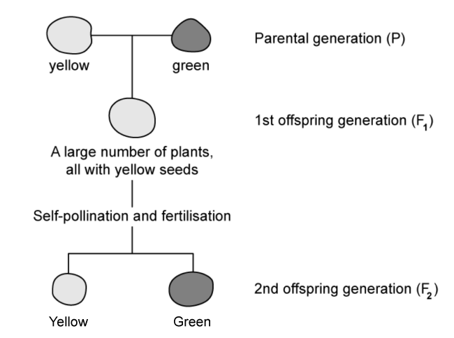

Using the information in the diagram, state which allele of the seed colour gene is dominant.

### 3() — 3 marks — command: multiple — structured
Two heterozygous pea plants with yellow seeds were crossed as shown in the diagram above to produce the F2 generation.

(i) Complete the Punnet square to show the genotypes that are produced in this cross.

|   | Yy |   |   |
|---|---|---|---|
| ............ | ............ |   |   |
| Yy | Y | ............ | ............ |
| y | ............ | ............ |   |

**(2)**

(ii) State the phenotypic ratio produced in this cross.

**(1)**

### 4() — 1 mark — command: give — structured
Seed colour in sweet peas is a trait determined by a single gene.

Give the term used to describe a trait which is determined by multiple genes.

## Q3 — easy — 13 marks · exam-questions

### 1() — 2 marks — command: multiple — structured
The graph shows the different blood groups of patients recorded in a hospital.

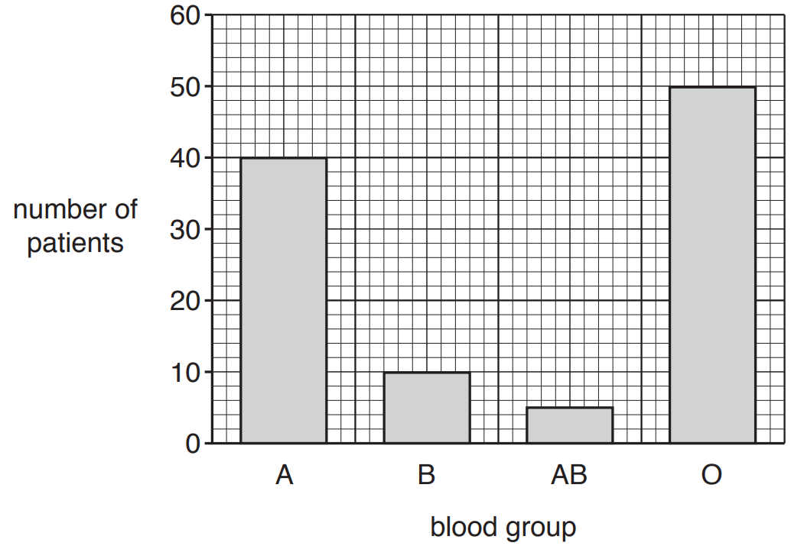

(i) State the type of variation shown in the graph.

**(1)**

(ii) Explain your answer to part (ii).

**(1)**

### 2() — 4 marks — command: complete — structured
The table shows different examples of variation.

Complete the table by ticking all the boxes that show examples of continuous variation.

| Arm length |   |
|---|---|
| Skin colour |   |
| Eye colour |   |
| Height |   |
| Tongue rolling |   |
| Weight |   |

### 3() — 3 marks — command: multiple — structured
Variation can be caused by mutation.

(i) What is a mutation?

**(1)**

| **A** | The process of taking genes from the DNA of one organism and inserting them into the DNA of another |
|---|---|
| **B** | The cause of continuous phenotypic variation in organisms |
| **C** | Incorrectly formed proteins which are non-functional |
| **D** | A random change in the nucleotide base sequence of DNA |

(ii) Random mutations in the DNA of pathogenic bacteria is a global concern due to the risks for patients having treatment in hospital.

Give the reason that mutations in bacterial DNA is of particular concern.

**(2)**

### 4() — 4 marks — command: complete — structured
The following is a passage relating to variation with some missing words.

In addition to new alleles which form as a result of mutation, variation is introduced into populations through other mechanisms.

The process of ___________  creates genetic variation between gametes of an individual.

Random fusion of gametes at _____________ leads to genetic variation between _______.

Phenotype is also influenced by _____________ factors such as climate, diet or lifestyle.

Complete the above sentences, using the words from the box below. You can use each word once, more than once or not at all.

| zygotes | fertilisation | genetic | meiosis |
|---|---|---|---|
| environmental | mitosis | gametes | embryos |

## Q4 — easy — 6 marks · exam-questions

### 1() — 1 mark — command: why — structured
State why mitosis is important in multicellular organisms.

### 2() — 1 mark — command: state — structured
The image shows the nucleus of a male gamete from a frog.

State the diploid number of chromosomes for a body cell in a frog.

### 3() — 4 marks — command: identify — structured
Complete the table to identify which statements about mitosis are true and which are false.

| **Statement** | **True** | **False** |
|---|---|---|
| Mitosis produces genetically identical cells |   |   |
| A cell divides twice in the process of mitosis |   |   |
| Daughter cells from mitosis are haploid |   |   |
| DNA is replicated before a cell can divide |   |   |

## Q5 — medium — 8 marks · exam-questions

### 1() — 6 marks — command: multiple — structured — from paper Nov 2020 · 4BI1/1B
The bacterium *H. pylori* causes stomach ulcers.

The diagram shows this bacterium.

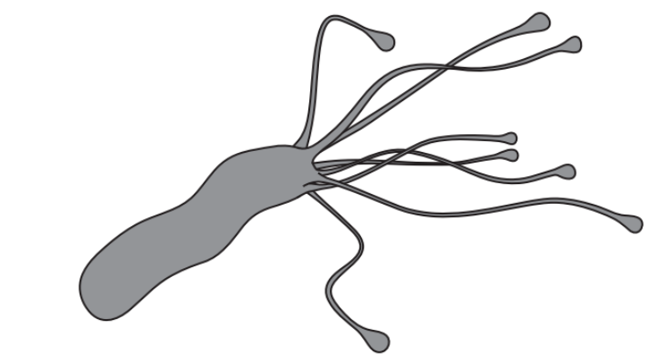

(i) Which of these is found in this bacterium?

**(1)**

| **A** | Cellulose |
|---|---|
| **B** | Chitin |
| **C** | Cytoplasm |
| **D** | Nucleus |

(ii)

The bacterium has evolved to release an enzyme called urease.

The action of the bacterium neutralises the acid in the stomach.

What is the pH changed to?

**(1)**

| **A** | 1 |
|---|---|
| **B** | 2 |
| **C** | 7 |
| **D** | 12 |

(iii) Use the theory of evolution by natural selection to explain how *H. pylori* bacteria could have evolved to produce urease.

**(4)**

### 1((b)) — 2 marks — command: give — structured — from paper Nov 2020 · 4BI1/1B
Probiotics are live microorganisms that can have health benefits when consumed.

Scientists investigate the ability of probiotics and cranberry juice to reduce the growth of *H. pylori*.

The scientists give various treatments to a group of people who have *H. pylori*.

The treatments are given daily for three weeks.

The scientists measure the mean percentage reduction of *H. pylori* for each treatment.

The table shows the scientists' results.

| **Treatment** | **Mean percentage (%) reduction in *****H. pylori*** |
|---|---|
| Probiotics | 14.9 |
| Cranberry juice | 16.9 |
| Probiotics and cranberry juice | 22.9 |
| Control | 1.5 |

Give two conclusions from these results.

## Q6 — medium — 14 marks · exam-questions

### 5((a)) — 5 marks — command: explain — structured — from paper Nov 2020 · 4BI1/1BR
The diagram shows a fetus in the uterus of a woman.

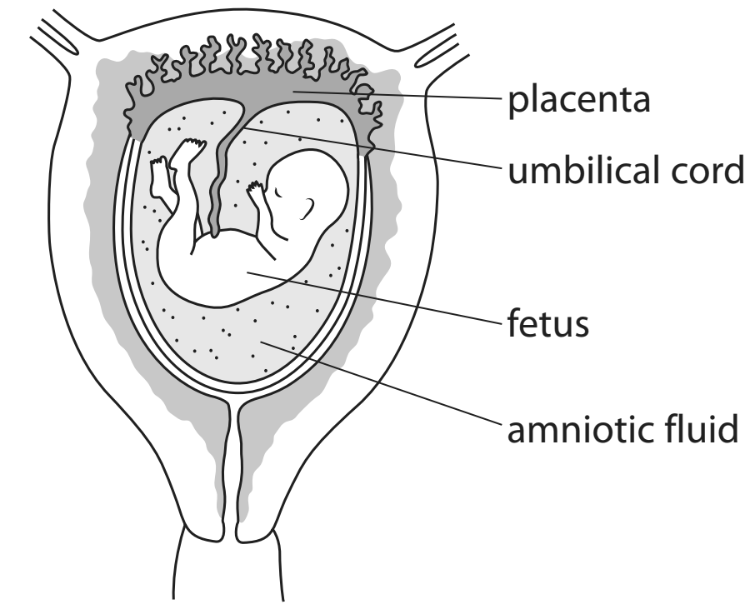

The umbilical cord transports blood from the placenta to the fetus.

This blood contains molecules from the mother that are needed by the developing fetus.

(i) Explain how some of these molecules allow active transport to occur in cells of the fetus.

**(3)**

(ii) Explain how one type of molecule from the mother helps to protect the fetus from infection.

**(2)**

### 5((b)) — 2 marks — command: give — structured — from paper Nov 2020 · 4BI1/1BR
The amniotic fluid contains cells from the fetus.

It is possible to look at chromosomes in these cells.

A diagram of the chromosomes is called a karyotype.

The diagram shows the karyotype of a fetus cell.

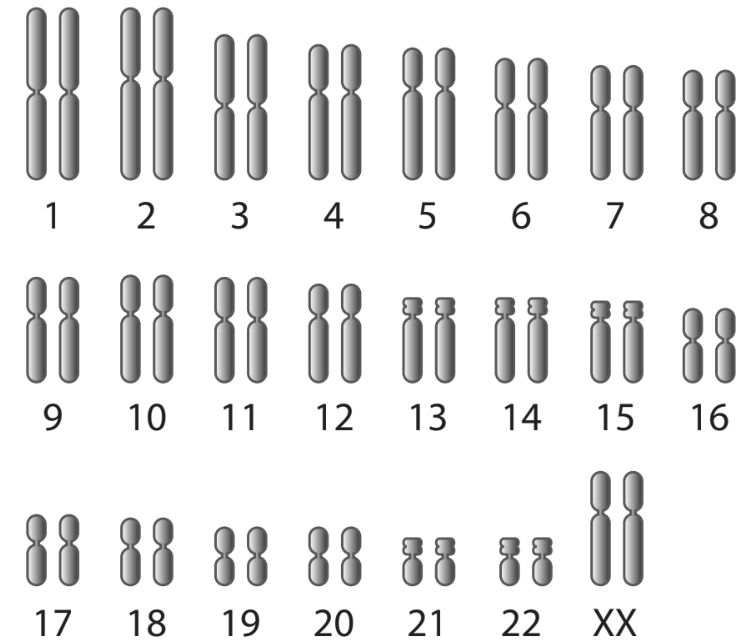

Give two conclusions you can make from this karyotype.

### 5((c)) — 7 marks — command: multiple — structured — from paper Nov 2020 · 4BI1/1BR
Doctors recommend that pregnant women obtain more of some dietary components than women who are not pregnant.

The table shows the recommended percentage increase of some dietary components in the diet of a woman who is pregnant compared to a woman who is not pregnant.

| **Component** | **Percentage increase of some dietary components in the diet of a woman who is pregnant compared to a woman who is not pregnant (%)** |
|---|---|
| Energy in kJ | 10 |
| Calcium in g | 71 |
| Iron in mg | 50 |
| Protein in g | 14 |
| Vitamin D in µg | 300 |

(i) Explain why a woman who is pregnant requires more of each of the dietary components listed in the table.

**(4)**

(ii) The actual mass of additional iron needed by the pregnant woman was 9.0 mg per day. Calculate the actual total mass of iron needed by the pregnant woman.

**(3)**

## Q7 — medium — 13 marks · exam-questions

### 9((a)) — 3 marks — command: state — structured — from paper Nov 2020 · 4BI1/1BR
Cleft chin is a phenotype believed to be controlled by a single gene that has two alleles.

The dominant allele, N, codes for cleft chin and the recessive, n, allele codes for the absence of the cleft chin.

With reference to the example of cleft chin, state what is meant by the following terms

(i) Phenotype

**(1)**

(ii) Gene

**(1)**

(iii) Allele

**(1)**

### 9((b)) — 7 marks — command: multiple — structured — from paper Nov 2020 · 4BI1/1BR
A woman with a cleft chin has a child with a man who also has a cleft chin. The child does not have a cleft chin.

(i) Use a genetic diagram to show the genotypes of the parents, the gametes they can produce and all the possible genotypes and phenotypes of their children.

**(4)**

(ii) The parents then have a second child.

Calculate the probability that this child will be female and not have a cleft chin.

**(2)**

(iii) Sometimes a cleft chin does not develop even if the individual inherits the dominant allele.

Suggest what might cause this.

**(1)**

### 9((c)) — 3 marks — command: describe — structured — from paper Nov 2020 · 4BI1/1BR
Most inherited conditions are not controlled by a single gene, but by many genes.

Describe how a scientist could distinguish between a genetic condition in rats controlled by a single gene and one controlled by many genes.

## Q8 — medium — 11 marks · exam-questions

### 7((a)) — 2 marks — command: state — structured — from paper Nov 2021 · 4BI1/1B
A scientist studies hair colour in mice.

Mice can have grey hair or white hair.

The hair colour is determined by a gene with two alleles.

In the first cross, a male mouse with white hair is mated with a female mouse with grey hair.

All the offspring have grey hair.

(i) State what is meant by the term **gene**.

**(1)**

(ii) State the phenotype coded for by the dominant allele.

**(1)**

### 7((b)) — 4 marks — command: show — structured — from paper Nov 2021 · 4BI1/1B
A male mouse and a female mouse with grey hair were chosen from the offspring of the first cross. These mice are mated in a second cross.

Some of the offspring of this second cross has grey hair and some have white hair.

Use a genetic diagram to show the second cross.

You should give the genotypes of the parents and the gametes formed. You should also give the genotypes and ratio of phenotypes of the offspring.

### 7((c)) — 2 marks — command: explain — structured — from paper Nov 2021 · 4BI1/1B
The scientist concludes that a mouse with grey hair could have two possible genotypes.

Explain how the scientist could use a cross to determine the genotype of a mouse with grey hair.

### 7((d)) — 3 marks — command: describe — structured — from paper Nov 2021 · 4BI1/1B
Albino mice have white hair. These mice also have pink eyes as they do not have pigment in their irises.

They are also less likely to explore a new area when compared to mice with grey hair.

This is an example of one gene having many effects.

Describe how the genetic control of most phenotypic features differs from this example.

## Q9 — medium — 11 marks · exam-questions

### 5((a)) — 4 marks — command: explain — structured — from paper Jan 2021 · 4BI1/1BR
The chromosomes found in human cells can be photographed and arranged in order to produce a karyotype.

The karyotype shown in Diagram 1 is from a normal human body cell.

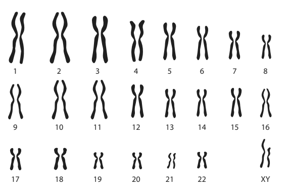

**Diagram 1**

(i) Explain how you can identify the sex of the person from the karyotype shown in Diagram 1.

**(2)**

(ii) Cells can be described using the terms diploid or haploid.

Explain the difference between these two terms using the information in Diagram 1.

**(2)**

### 5((b)) — 7 marks — command: multiple — structured — from paper Jan 2021 · 4BI1/1BR
The karyotype shown in Diagram 2 is from a body cell of a person with a condition called Klinefelter syndrome.

This condition only affects males.

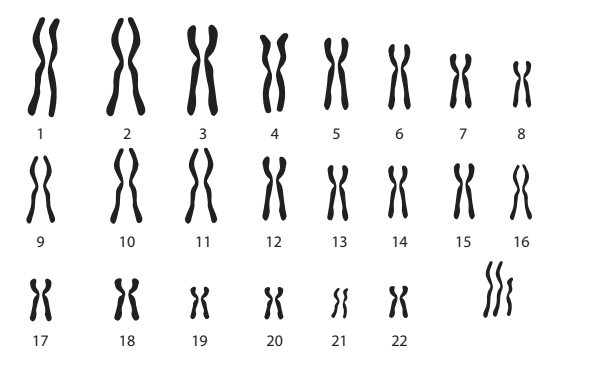

**Diagram 2**

(i) Describe the differences between the karyotype in Diagram 1 and the karyotype in Diagram 2.

**(2)**

(ii) Suggest how the karyotype in Diagram 2 may have been caused.

**(2)**

(iii) The frequency of Klinefelter syndrome in the United Kingdom is 1 in every 660 males.

The population of the United Kingdom is 66 million, of which 49% are male.

Calculate the total number of males in the United Kingdom with Klinefelter syndrome.

**(2)**

(iv) Suggest why females who are aged over 35 are more likely to give birth to a baby with the Klinefelter karyotype.

**(1)**

## Q10 — medium — 10 marks · exam-questions

### 5((a)) — 5 marks — command: multiple — structured — from paper Jan 2021 · 4BI1/2B
#### Separate: Biology Only

A DNA strand has this sequence of bases.

C A T T C A A T T C A T T T C

(i) How many amino acids does this sequence of bases code for?

**(1)**

| **A** | 1 |
|---|---|
| **B** | 3 |
| **C** | 5 |
| **D** | 15 |

(ii) Write down the complementary mRNA code for this sequence of bases.

**(2)**

(iii) A student reads that DNA codons are non-overlapping.

Suggest what is meant by the term non-overlapping.

You should refer to the sequence of bases in your answer.

**(2)**

### 5((b)) — 4 marks — command: describe — structured — from paper Jan 2021 · 4BI1/2B
#### Separate: Biology Only

Describe what happens in the translation stage of protein synthesis.

### 5((c)) — 1 mark — command: state — structured — from paper Jan 2021 · 4BI1/2B
State what is meant by the genome of an organism.

## Q11 — medium — 16 marks · exam-questions

### 1((a)) — 2 marks — command: explain — structured — from paper Jan 2021 · 4BI1/2BR
#### Separate: Biology Only

Read the passage below. Use the information in the passage and your own knowledge to answer the questions that follow.

**Haemolytic disease**

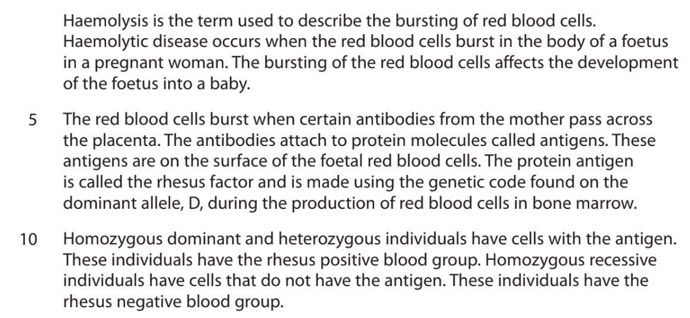

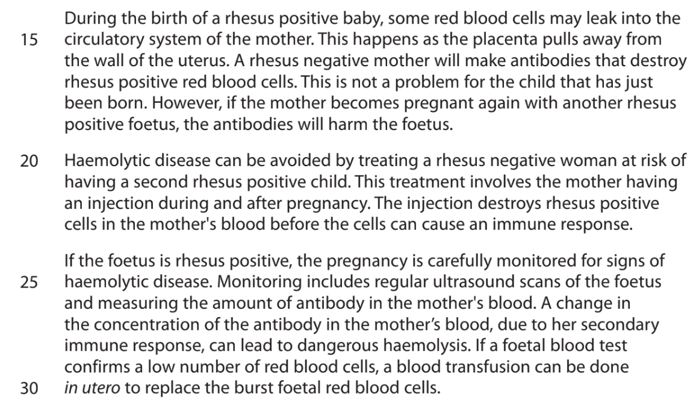

Explain why bursting of red blood cells affects the development of a foetus (lines 3 and 4).

### 1((b)) — 3 marks — command: describe — structured — from paper Jan 2021 · 4BI1/2BR
#### Separate: Biology Only

The dominant allele codes for the production of the protein that will act as an antigen.

Describe how the dominant allele leads to the production of RNA during protein synthesis (lines 7 to 9).

### 1((c)) — 1 mark — command: why — structured — from paper Jan 2021 · 4BI1/2BR
#### Separate: Biology Only

Give the reason why proteins cannot be made by red blood cells (lines 7 to 9).

### 1((d)) — 1 mark — command: give — structured — from paper Jan 2021 · 4BI1/2BR
#### Separate: Biology Only

Give one piece of evidence from the passage that shows that antibodies are smaller than red blood cells.

### 1((a)) — 4 marks — command: give — structured — from paper Jan 2021 · 4BI1/2BR
#### Separate: Biology Only

A mother who is homozygous recessive for the rhesus factor has a child with a father who is heterozygous.

(i) Give the genotypes of the mother, the father, their gametes and the possible genotypes of the child.

**(3)**

(ii) Give the probability that the child will be rhesus positive.

**(1)**

### 1((f)) — 3 marks — command: explain — structured — from paper Jan 2021 · 4BI1/2BR
#### Separate: Biology Only

Explain why the concentration of the rhesus antibody in the mother's blood rises quickly to harmful levels if she has a second child who is Rhesus positive (lines 16 to 19).

### 1((g)) — 1 mark — command: suggest — structured — from paper Jan 2021 · 4BI1/2BR
#### Separate: Biology Only

Suggest what is meant by the term *in utero* (line 30).

### 1((h)) — 1 mark — command: suggest — structured — from paper Jan 2021 · 4BI1/2BR
#### Separate: Biology Only

A foetus with haemolytic disease can be given a blood transfusion.

Suggest the blood group of the source of the cells used for this transfusion (lines 29 and 30).

## Q12 — medium — 10 marks · exam-questions

### 4((a)) — 1 mark — command: suggest — structured — from paper Nov 2020 · 4BI1/2BR
A scientist investigates the effect of growth hormone (GH) on the body mass of rats.

This is his method.

- Give one rat a GH solution every day for 500 days
- Give another rat a control solution every day for 500 days
- Measure the mass of each rat each week for 500 days

The graph shows his results.

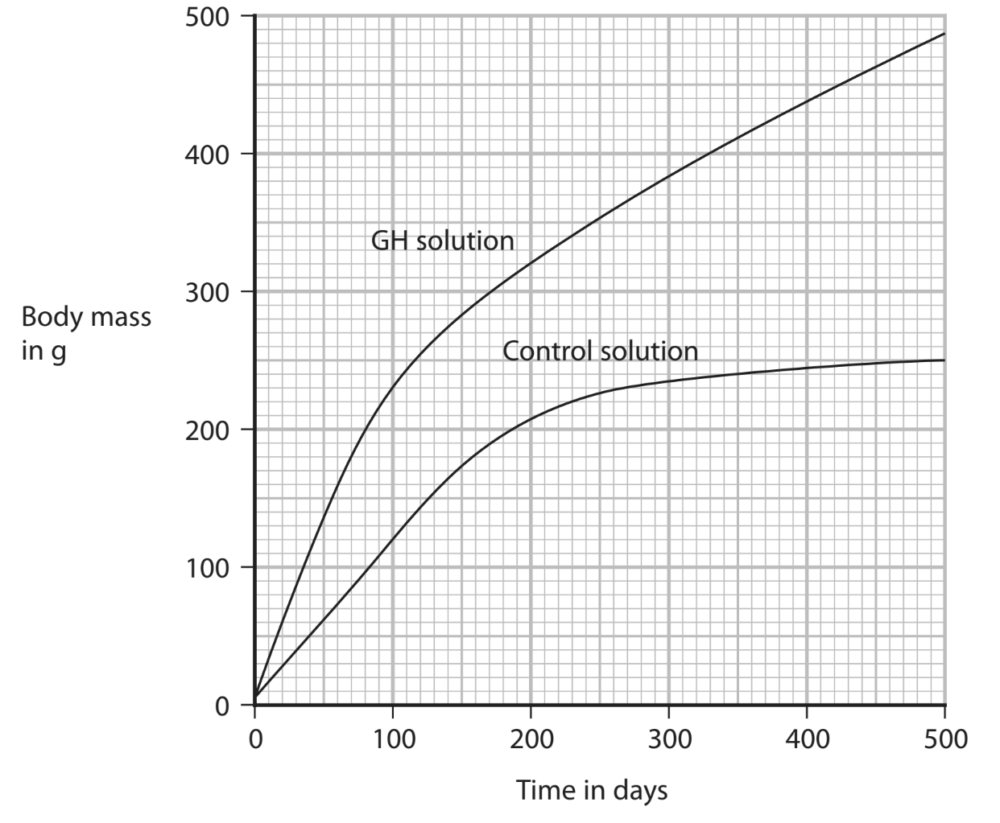

Suggest how the control solution differs from the GH solution.

### 4((b)) — 2 marks — command: calculate — structured — from paper Nov 2020 · 4BI1/2BR
Calculate the average rate of growth of the rat given GH solution from 100 days to 500 days.

Give your answer in g per day.

### 4((c)) — 2 marks — command: suggest — structured — from paper Nov 2020 · 4BI1/2BR
The scientist controlled all the variables in his investigation.

Suggest two abiotic variables he controls.

### 4((d)) — 2 marks — command: explain — structured — from paper Nov 2020 · 4BI1/2BR
The scientist repeats his investigation using more rats.

Explain why using more rats improves his investigation.

### 4((e)) — 3 marks — command: explain — structured — from paper Nov 2020 · 4BI1/2BR
#### Separate: Biology Only

GH increases transcription in cells.

Explain why this affects the growth of rats.

## Q13 — medium — 10 marks · exam-questions

### 6((a)) — 1 mark — command: which — structured — from paper Nov 2020 · 4BI1/2BR
Variation in a population can have different causes.

Which of these will **not** lead to an increase in genetic variation in a population of plants?

| **A** | Asexual reproduction |
|---|---|
| **B** | Insect pollination |
| **C** | Mutation |
| **D** | Wind pollination |

### 6((b)) — 5 marks — command: explain — structured — from paper Nov 2020 · 4BI1/2BR
#### Separate: Biology Only

Explain how a change in the DNA of a microorganism can reduce its ability to digest a substance.

### 6((c)) — 4 marks — command: explain — structured — from paper Nov 2020 · 4BI1/2BR
#### Separate: Biology Only

Explain why a change in DNA may not affect the phenotype of an organism.

## Q14 — hard — 10 marks · exam-questions

### 7((a)) — 8 marks — command: multiple — structured — from paper Jan 2022 · 4BI1/1BR
Hypertrophic myopathy is a heart condition that can affect some cats. It is caused by a dominant allele.

Hypertrophic myopathy causes the left ventricle wall of the heart to be less elastic.

(i)Explain why cats with hypertrophic myopathy are unable to run quickly.

**(2)**

(ii) State what is meant by a dominant allele.

**(1)**

(iii) The diagram shows a family pedigree for cats with and without hypertrophic myopathy.

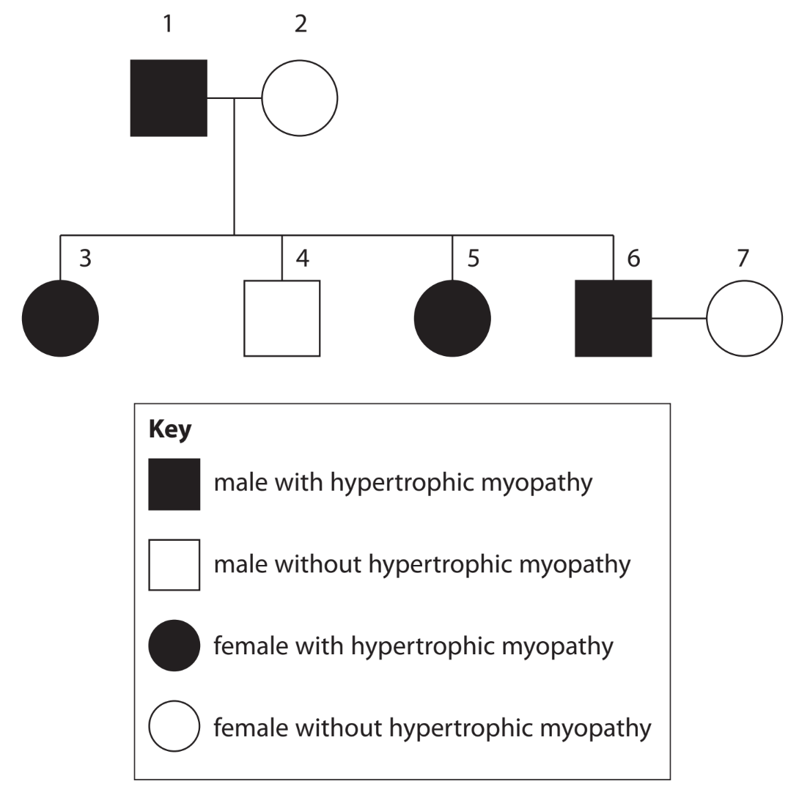

Draw a genetic diagram to show the possible genotypes and phenotypes of the offspring produced by individuals 6 and 7.

Use **H** as the allele for hypertrophic myopathy and **h** as the allele for normal heart development.

**(4)**

(iv) Calculate the probability that the next offspring produced by individuals 6 and 7 is male and has hypertrophic myopathy.

**(1)**

### 7((b)) — 2 marks — command: suggest — structured — from paper Jan 2022 · 4BI1/1BR
Cat breeders often try to remove harmful alleles from populations by selective breeding.

Suggest why it is more difficult to remove harmful recessive alleles from populations than harmful dominant alleles from populations.

## Q15 — hard — 14 marks · exam-questions

### 9((a)) — 1 mark — command: state — structured — from paper Jan 2022 · 4BI1/1B
Alkaptonuria is an inherited condition caused by the presence of recessive alleles.

State what is meant by a recessive allele.

### 9((b)) — 5 marks — command: multiple — structured — from paper Jan 2022 · 4BI1/1B
Alkaptonuria is first diagnosed in children when it is noticed that they produce very dark urine that turns black when exposed to air.

A woman and a man do not have alkaptonuria. They have a child who has the condition.

The woman and the man are expecting a second child.

(i) Draw a genetic diagram to show the genotypes of the woman and the man, the gametes they produce and the possible phenotypes and genotypes of the second child.

**(4)**

(ii) Calculate the probability that the second child is male and does not have the condition.

**(1)**

### 9((c)) — 6 marks — command: multiple — structured — from paper Jan 2022 · 4BI1/1B
Alkaptonuria is caused by the body being unable to break down the amino acids tyrosine and phenylalanine.

This leads to a build-up of a toxin that causes damage to joints and tendons and can also lead to heart valve damage in later life.

A new drug treatment is being tested that can slow the damage to the joints and tendons.

Scientists selected 40 adults who all had alkaptonuria. They placed each patient into one of two groups. One group was given the drug treatment and the other group acted as a control.

The scientists then compared the symptoms of the patients in each group after three years.

(i) Describe what is meant by the control group.

**(1)**

(ii) The table compares the control group with the drug treatment group.

It shows the numbers starting and completing the trial and those showing harmful effects.

It also compares improvements in two symptoms of alkaptonuria.

| ** ** | **Control group** | **Drug group** |
|---|---|---|
| Number of patients starting trial | 20 | 20 |
| Number of patients completing trial | 17 | 16 |
| Number of patients showing adverse effects | 0 | 2 |
| Number of patients that died | 0 | 1 |
| Decrease in time taken to stand up and walk 3 m in seconds | 0.54 | 1.33 |
| Increase in distance in metres walked in 6 minutes | 6.7 | 51.5 |

Evaluate whether the new drug should be recommended as an effective treatment for alkaptonuria.

**(5)**

### 9((d)) — 2 marks — command: suggest — structured — from paper Jan 2022 · 4BI1/1B
Other scientists have suggested that eating fewer proteins that contain tyrosine and phenylalanine would reduce the symptoms of alkaptonuria.

Suggest why eating fewer of these proteins may be difficult.

## Q16 — hard — 8 marks · exam-questions

### 7((a)) — 3 marks — command: complete — structured — from paper June 2021 · 4BI1/1B
Inherited conditions may be caused by a dominant allele (D) or by a recessive allele (d).

The diagram shows a family pedigree for an inherited condition.

The shaded circle shows a female with the condition.

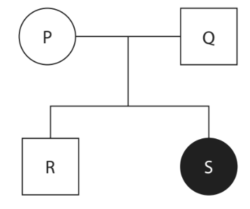

Complete the table by giving the genotype of each individual.

One has been done for you.

| **Individual** | **Genotype** |
|---|---|
| P |   |
| Q |   |
| R | Dd |
| S |   |

### 7((b)) — 1 mark — command: calculate — structured — from paper June 2021 · 4BI1/1B
The parents have a third child.

Calculate the probability that this third child is female and has the condition.

### 7((c)) — 4 marks — command: explain — structured — from paper June 2021 · 4BI1/1B
The graphs show changes in the concentrations of the hormones testosterone and oestrogen in child R and in child S between the ages of 11 to 15.

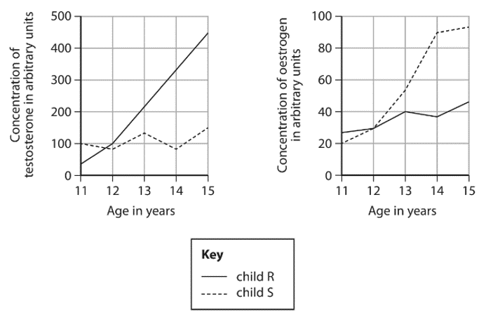

Explain how the changes in hormone concentrations affect the development of each child.

## Q17 — hard — 13 marks · exam-questions

### 6((a)) — 1 mark — command: what — structured — from paper Jan 2022 · 4BI1/2B
#### Separate: Biology Only

The diagram shows one strand of DNA from a section of a gene.

#### A T T C C G A G T

What would be the complementary sequence of bases on the messenger RNA produced from this strand of DNA?

| **A** | TAAGGCTCA |
|---|---|
| **B** | ATTCCGAGT |
| **C** | UAAGGCUCA |
| **D** | AUUCCGAGU |

### 6((b)) — 1 mark — command: which — structured — from paper 2022 · 4BI1/2B
#### Separate: Biology Only

The diagram shows a stage during protein synthesis.

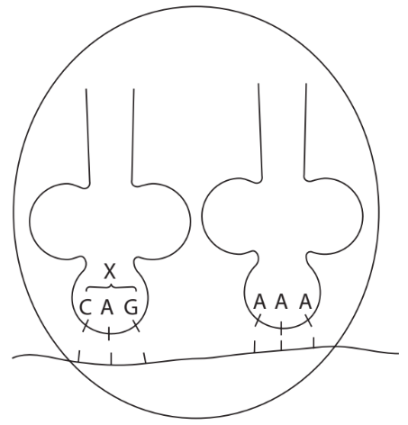

Which row gives the correct names for the stage of protein synthesis shown and the sequence of bases labelled X?

|   | **Stage of protein synthesis** | **X** |
|---|---|---|
| **A** | Transcription | Anticodon |
| **B** | Transcription | Codon |
| **C** | Translation | Anticodon |
| **D** | Translation | Codon |

### 6((c)) — 3 marks — command: explain — structured — from paper Jan 2022 · 4BI1/2B
#### Separate: Biology Only

Explain how a mutation in a gene can affect the phenotype of an organism.

### 6((d)) — 8 marks — command: multiple — structured — from paper Jan 2022 · 4BI1/2B
In an accident at a nuclear power station, radioactive material was released into the surrounding areas of land.

Scientists investigated the impact of this on a species of butterfly.

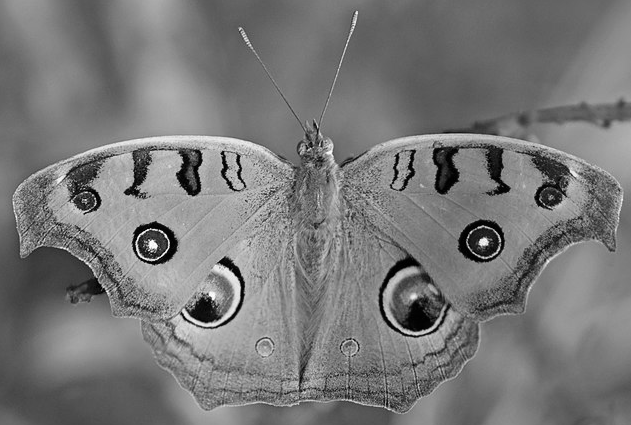

Charles J. Sharp, CC BY-SA 4.0 <https://creativecommons.org/licenses/by-sa/4.0/deed.en>, via Wikimedia Commons. Image cropped and colour removed.

Samples of adult butterflies were collected from an area near the power station two months after the release of the radioactive material.

The percentages of butterflies with abnormalities were calculated.

The butterflies were then mated in the laboratory and the percentage of offspring with abnormalities calculated.

The experiment was repeated with butterflies collected from the same area, 10 months after the release of the radioactive material.

(i) Describe how the scientists could have sampled the population of butterflies in the area.

**(3)**

(ii) The results of the investigation are shown in the table.

| **Butterfly generation** | **Percentage of butterflies with abnormalities** |   |
|---|---|---|
| **Two months after the accident** | **Ten months after the accident** |   |
| Adult | 12.4 | 28.1 |
| Offspring | 18.3 | 60.2 |

The scientists concluded that the increased level of radioactivity has led to an increased rate of mutation of DNA.

Discuss the scientists’ conclusion referring to data from the table to support your answer.

**(5)**

## Q18 — hard — 7 marks · exam-questions

### 3((a)) — 1 mark — command: name — structured — from paper Nov 2020 · 4BI1/2B
The brain is part of the central nervous system.

Name the other part of the central nervous system.

### 3((b)) — 3 marks — command: multiple — structured — from paper Nov 2020 · 4BI1/2B
Huntington’s disease (HD) is caused by a mutation in the gene for making a protein called huntingtin.

This protein damages nerve cells in the brain.

HD is caused by a dominant allele.

A heterozygous parent and a homozygous recessive parent have a child.

(i) What is the probability of this child having HD?

**(1)**

| **A** | 0.0 |
|---|---|
| **B** | 0.25 |
| **C** | 0.5 |
| **D** | 1.0 |

(ii) These parents have three more children.

The key shows the possible sex and phenotype of the individuals with or without HD.

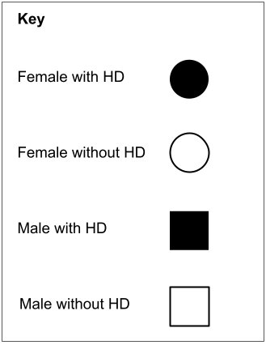

The family pedigree gives the predicted sex ratio and the predicted phenotype ratio for two of the children. Complete the family pedigree by giving the predicted sex ratio and predicted phenotype ratio for the other two children.

**(2)**

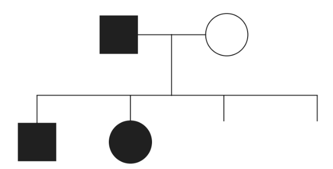

### 3((c)) — 3 marks — command: suggest — structured — from paper Nov 2020 · 4BI1/2B
#### Separate: Biology Only

A drug can reduce the damage to nerve cells in the brains of people with HD.

The drug binds to messenger RNA produced by the mutated gene for huntingtin protein.

Suggest ways that this drug reduces damage to nerve cells in people with HD.
