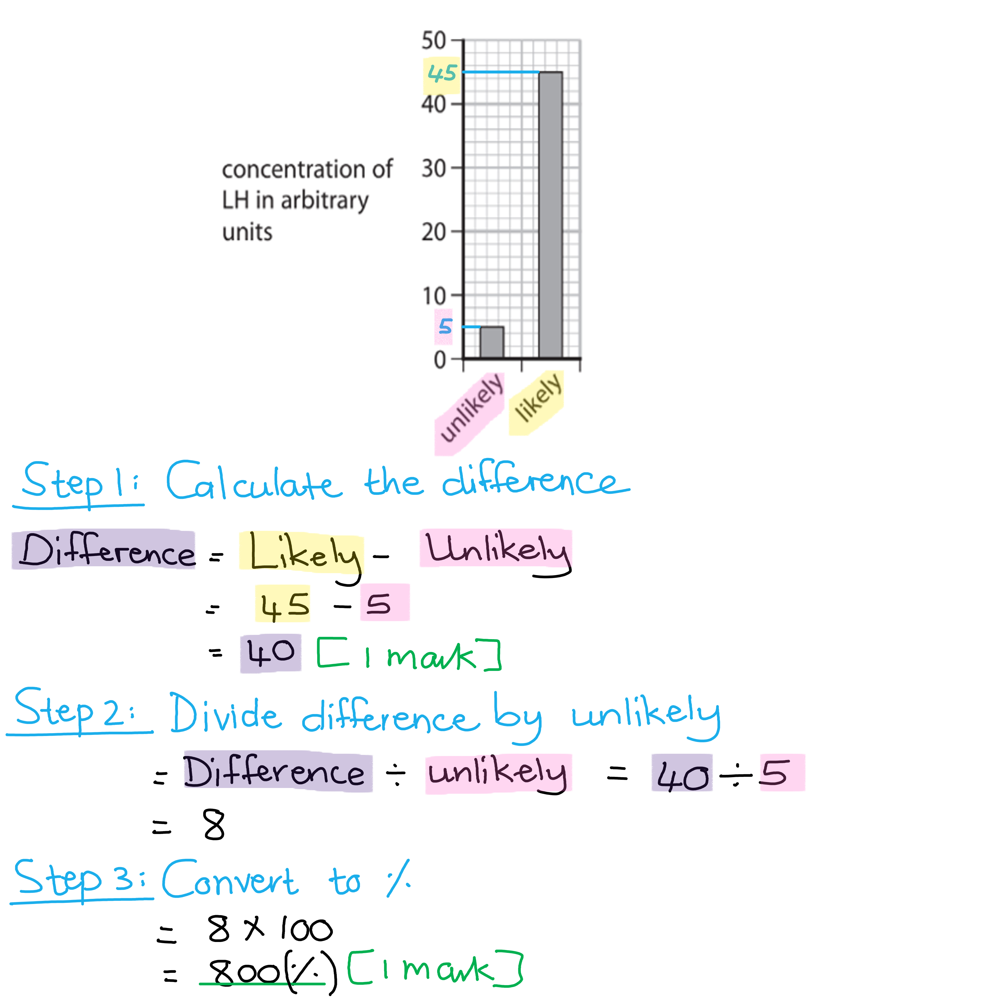
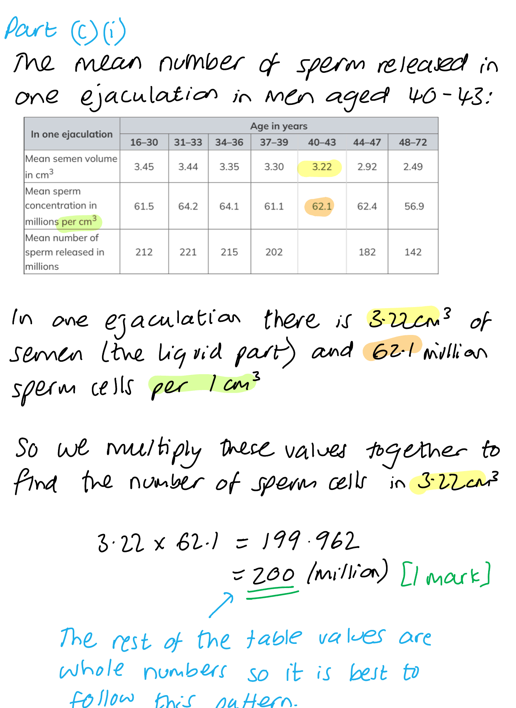
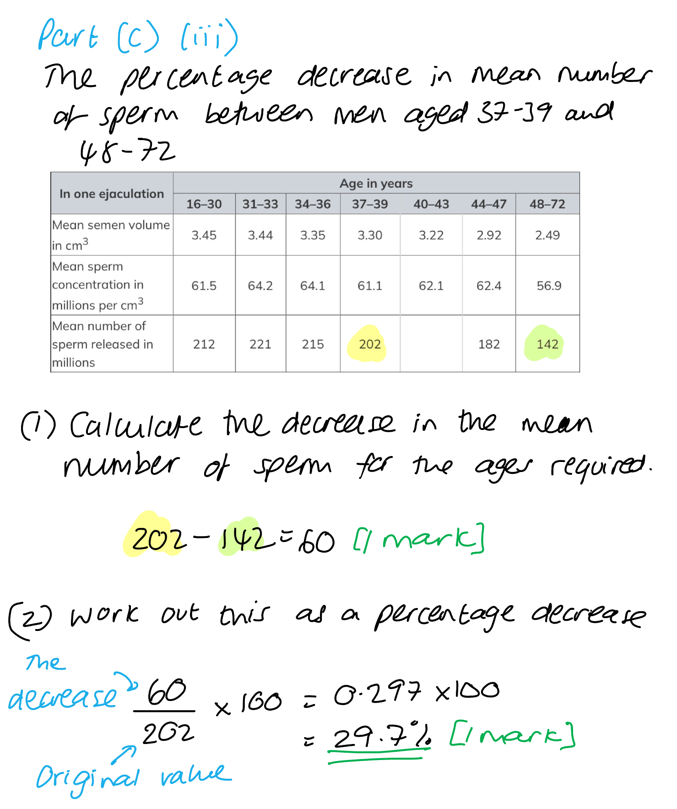
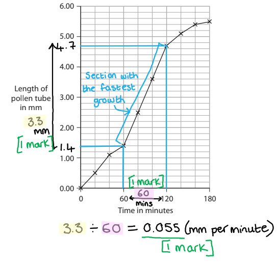
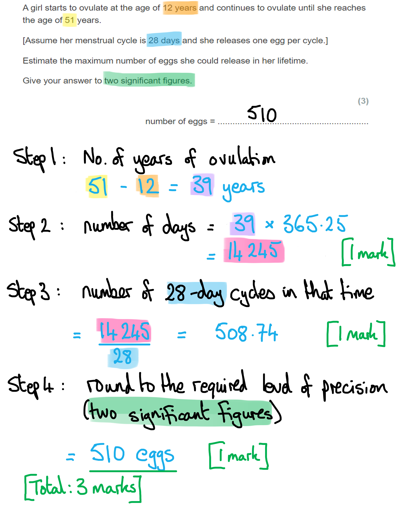
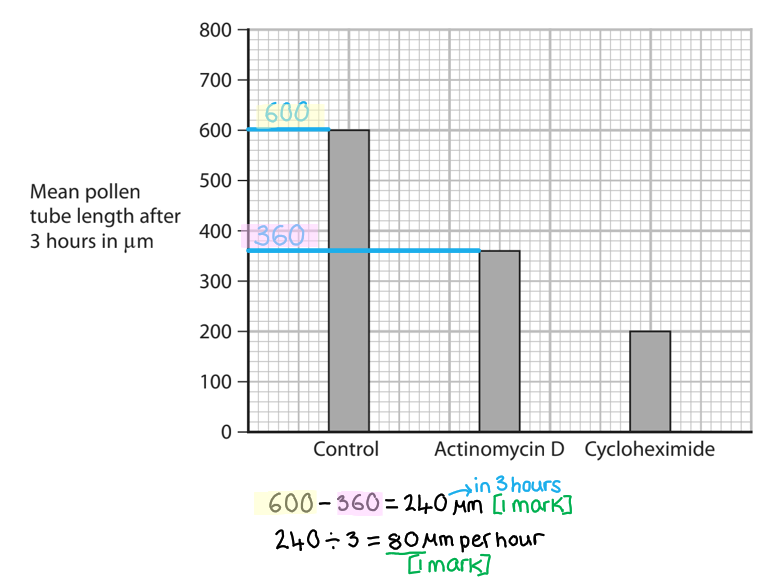
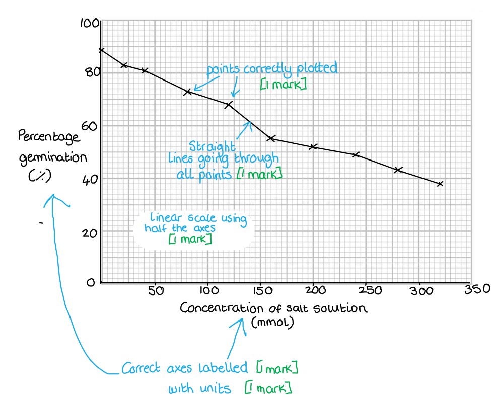
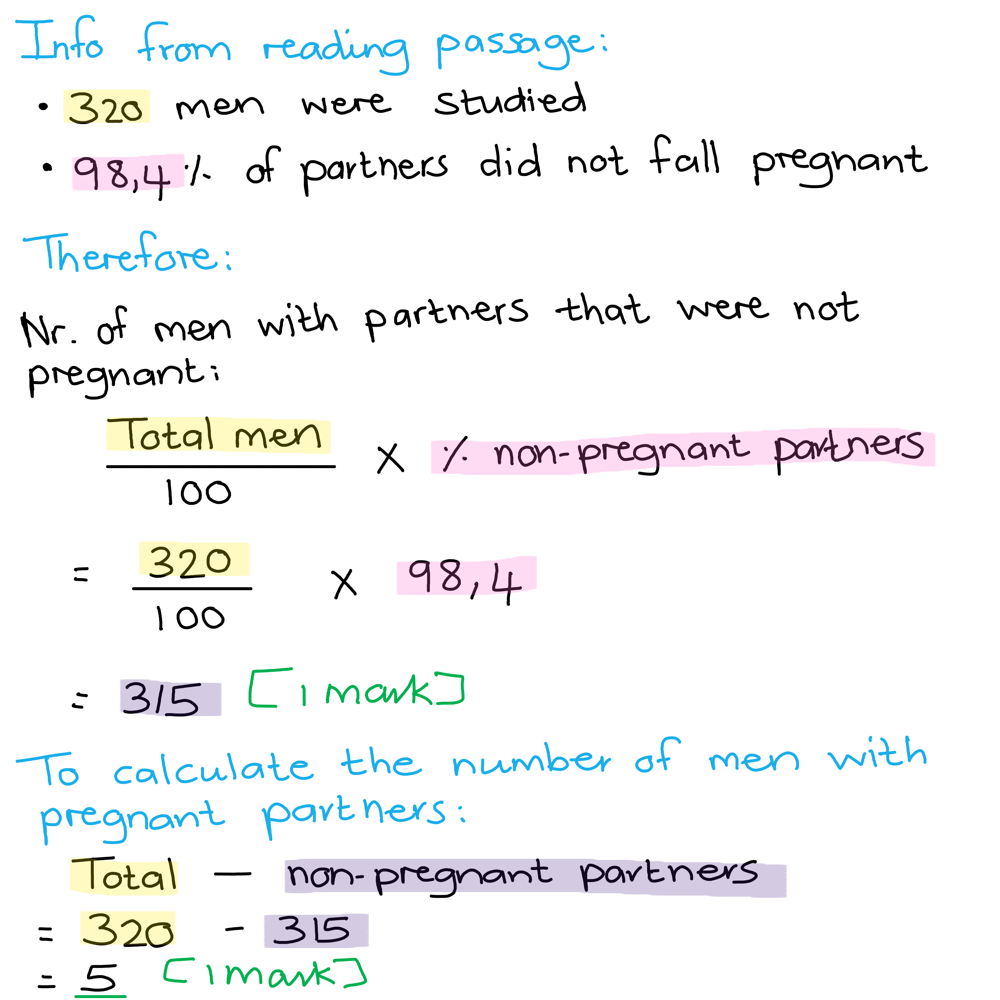
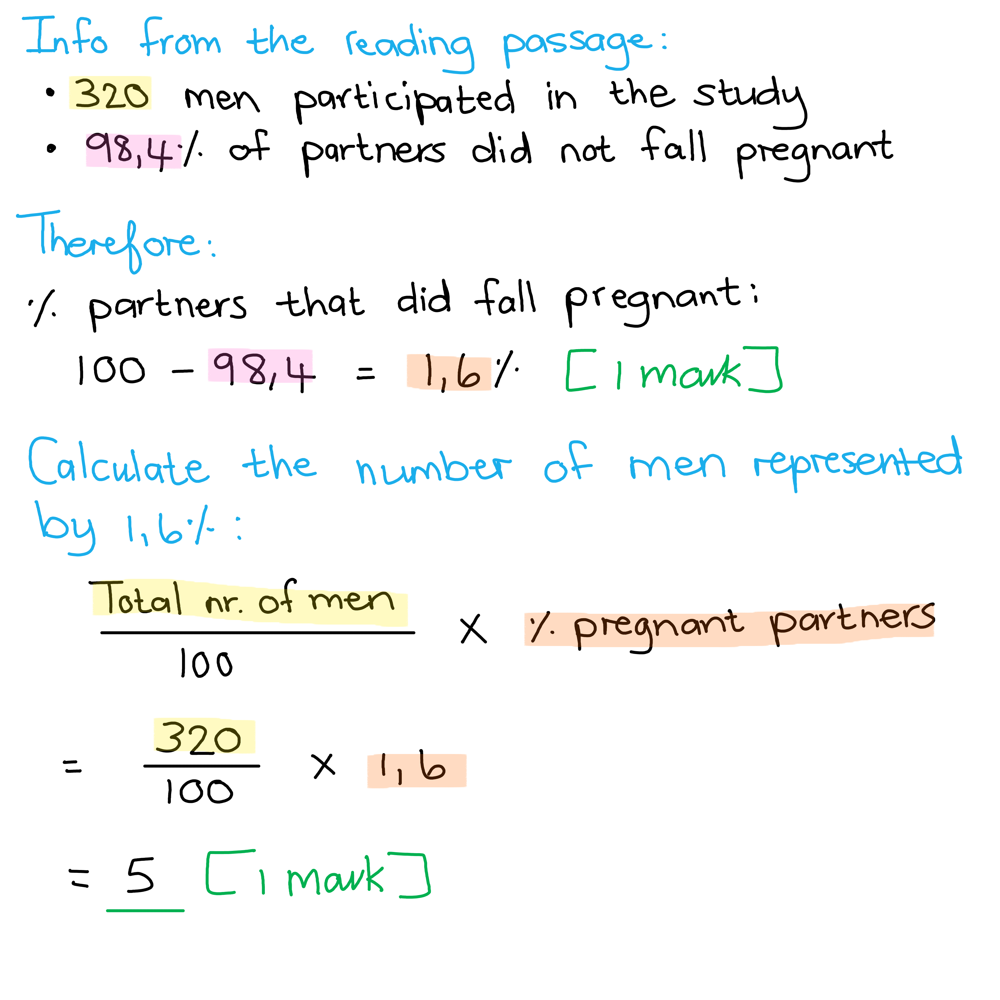

# Mark Schemes — Reproduction
**4. Reproduction & Inheritance** · Edexcel IGCSE Biology (Modular) (4XBI1) — 24/Unit 2

## Q1 — easy — 10 marks · exam-questions

### 2((a)) — 3 marks
(i) **The correct answer is ****A ****because...**

**P** shows the anther.

**B** is incorrect because the filament is the structure below the anther that holds the anther up so it is able to rub against pollinators.

**C** is incorrect because the stigma is shown by letter **S** in the diagram.

**D** is incorrect because the style is the structure below the stigma that holds the stigma up so it is able to rub against pollinators.

(ii) **The correct answer is ****B ****because...**

**Q** is the petal.

**A** is incorrect because the leaf is not part of the flower and is not used for reproduction but instead is used to provide nutrition for the plant by carrying out photosynthesis and gas exchange.

**C** is incorrect because is represented by the letter **R** in the diagram.

**D** is incorrect because the style is the structure below the stigma that holds the stigma up so it is able to rub against pollinators.

(iii) **The correct answer is ****D ****because...**

**S **is the stigma which the pollen grains bind to and germinate during the formation of the pollen tube.

**A** is incorrect because **P** is the anther where the pollen is made.

**B** is incorrect because **Q** is the petal, which attracts pollinators.

**C** is incorrect because **R** is the stem, which supports the flower and delivers nutrients.

**[Total: 3 marks]**

### 2((b)) — 3 marks
The structures would differ in a wind-pollinated plant by...

- P / anthers (would be) exposed / hanging out/outside; **[1 mark]**
- S / stigma (would be) feathery / exposed / hanging out/longer/outside;** [1 mark]**
- Q / petals (would be) smaller/ absent / green / not coloured / not scented;** [1 mark]**

*Allow a description of the stigma (S) as hairy.*

**[Total: 3 marks]**

> *This question is asking about the structure of the parts so any mention of the nature of the pollen and its transfer are not necessary here. Remember that both wind and insect pollinated plants have sticky stigmas. *

### 2((c)) — 4 marks
(i) One natural method that plants use to reproduce asexually is...

Any **one **of the following:

- Runners; **[1 mark]**
- Corms / bulbs / rhizomes / tubers;** [1 mark]**

(ii) One artificial method that a plant grower may use to reproduce a plant asexually is...

Any **one **of the following:

- Cuttings; **[1 mark]**
- Grafting / layering / micropropagation / tissue culture; **[1 mark]**

(iii) A plant grower may choose to reproduce a plant asexually rather than allowing the plant to reproduce sexually because...

Any **two **of the following:

- No/less <u>genetic</u> variation / a clone **OR** there will be <u>genetic</u> variation (when plants reproduce sexually);** [1 mark]**
- (Asexual reproduction will) maintain the phenotype / colour / flavour / desired characteristic / same characteristics; **[1 mark]**
- (Asexual reproduction will produce plants) faster; **[1 mark]**
- Seeds (are) not (always) viable / produce rare plants;** [1 mark]**

*Ignore mention of "grower will get a copy of the plant" at marking point 2. Ignore mention of "more plants" being produced by asexual reproduction at marking point 3.*

**[Total: 4 marks]**

## Q2 — easy — 14 marks · exam-questions

### 2() — 8 marks
The correct words to fill the blank spaces are as follows...

Award **one** mark for each correct answer:

Flowers are organs that allow plants to carry out **sexual**** **reproduction. The male gamete is contained within the** ****pollen**** **grains. These grains are released from the** ****anther****,** which is found on top of the filament. These grains need to land on the **stigma**, the female part of the flower. Grains can be transferred by wind or by animals. These animals are often insects such as **bees / moths / flies** or butterflies. The petals of insect-pollinated plants are often** ****large / big / scented / (sweet) smelling**** **and brightly coloured. After pollination, the grains germinate and a tube grows down the **style** to reach the ovary. In the ovary, the gametes fuse. This process is known as **fertilisation****.**

**[Total: 8 marks]**

### 2() — 2 marks
Two other factors that affect the rate of germination are...

- Water availability;** [1 mark]**
- Oxygen concentration; **[1 mark]**

**[Total: 2 marks]**

### 3() — 2 marks
An explanation of the results is...

Any **two **of the following:

- Temperature affects the action of the <u>enzymes</u> inside the seed; **[1 mark]**
- At low temperature / 10 °C there were fewer reactions / fewer collisions between enzyme/active site and substrate (due to lower kinetic energy); **[1 mark]**
- 30 °C (is closer to the optimum so) there are more/faster reactions / more collisions between enzyme/active site and substrate (due to higher kinetic energy); **[1 mark]**
- 50 °C enzyme <u>denatured</u> and so reaction stopped/slowed; **[1 mark]**

**[Total: 2 marks]**

> *Here you need to apply your knowledge of enzyme action to this question about germination. *

### 4() — 2 marks
The parts of the germinating seed are...

- Part X = plumule; **[1 mark]**
- Part Y = radicle; **[1 mark]**

**[Total: 2 marks]**

> *Make sure you know how to label a germinating seed, as well as how to draw one. You don't want to miss out of any basic questions like this in an exam.  *

## Q3 — easy — 7 marks · exam-questions

### 1((a)) — 1 marks
**Final answer:** **The correct answer is ****B ****because...**

There is only one sex chromosome in each (haploid) gamete. Eggs always provide an 'X' whilst sperm can provide either an 'X' or a 'Y'.

**A** is incorrect as female offspring inherit an 'X' from the egg and an 'X' from the sperm in order to produce the XX genotype required to produce a female.

**C** is incorrect as a gamete only contains one sex chromosome due to its haploid nature.

**D** is incorrect as this refers to the total number of chromosomes found in a gamete.

### 1((b)) — 2 marks
The function of the mitochondria is...

- To provide energy/ATP **OR **to carry out respiration;** [1 mark]**
- To allow movement/swimming/tail movement;** [1 mark]**

**[Total: 2 marks]**

### 1((c)) — 2 marks
The function of the acrosome is...

Any **two** from the following:

- To digest / break down egg membrane; **[1 mark]**
- (This then) allows (the nucleus) to enter / penetrate egg;** [1 mark]**
- (Leading to) fertilisation / fusion (of the nuclei);** [1 mark]**

**[Total: 2 marks]**

> *Here you are given some information in the question thread about what the acrosome contains. If you missed the marks here, it might be worth considering how you could use the information provided to help you reach the right answer in future.*

### 1((d)) — 2 marks
The route taken by the sperm is as follows...

- (Through/into) the vagina
- (Then through the) uterus
- (Into the) oviduct/fallopian tube

*Award*** [2 marks]*** for 3 structures in the correct order*

*Award ***[1 mark] ***for 3 structures in the incorrect order*

*Award*** [1 mark]*** for 2 structures in the correct order*

## Q4 — easy — 9 marks · exam-questions

### 6((a)) — 2 marks
(i)** The correct answer is ****B ****because...**

The ovary is where ovulation happens and where the egg cell is released.

**A** is incorrect because the oviduct is where the egg travels to after ovulation.

**C** is incorrect because the uterus is where the embryo implants if fertilisation takes place.

**D** is incorrect because the vagina is not where the ovulation occurs, instead this is where the baby leaves the body during the process of childbirth.

(ii) **The correct answer is ****A ****because...**

Fertilisation takes place in the oviduct.

**B** is incorrect because fertilisation does not take place in the ovary.

**C** is incorrect because fertilisation does not take place in the uterus.

**D** is incorrect because fertilisation does not take place in the vagina.

### 6((b)) — 4 marks
(i) Hormones X and Y are...

- X = oestrogen; **[1 mark]**
- Y = progesterone; **[1 mark]**

(ii) The function of hormone X during the menstrual cycle is...

- Repairs/thickens the uterus lining; **[1 mark]**
- For implantation (of the embryo); **[1 mark]**

***Accept**** references to oestrogen reducing FSH levels ****AND**** stimulating release of LH.*

**[Total: 4 marks]**

> *It is important to read the question carefully here. For example part (ii) asks for an explanation of the role of oestrogen in the **menstrual cycle**. Oestrogen does also play an important role in the development of female secondary sexual characteristics but as the question refers only to the menstrual cycle, answers relating to secondary sexual characteristics will not be credited.*

### 6((c)) — 3 marks
The structure of the placenta enables the efficient exchange of substances between the fetus and the mother by...

Any **three **of the following:

- Villi provide a large surface area; **[1 mark]**
- For diffusion/active transport; **[1 mark]**
- Capillaries / blood supply brings nutrients / remove(s) waste products; **[1 mark]**
- Blood supply / capillaries / blood vessels (carry blood to/from placenta so) maintain a diffusion gradient; **[1 mark]**
- Close/short distance between mother’s and fetal blood for short diffusion pathway; **[1 mark]**

**[Total: 3 marks]**

> *This is an **explain** question, meaning that you not only have to state what structures are present here, but also state why they are important for exchange of substances using your scientific knowledge. *

## Q5 — easy — 6 marks · exam-questions

### 2((b)) — 2 marks
The percentage increase in LH concentration in the blood from when the woman is unlikely to get pregnant to when she is likely to get pregnant can be calculated as follows...

- (45 - 5) = 40; **[1 mark]**
- (40 ÷ 5 x 100) = 800(%); **[1 mark]**

*Full marks awarded for the correct answer in the absence of calculations.*

**[Total: 2 marks]**

### 2((c)) — 4 marks
The roles of FSH and LH include...

***FSH: ***

- FSH stimulates development/growth/maturation of follicle/egg / sperm production; **[1 mark]**
- FSH stimulates oestrogen release (from the ovaries); **[1 mark]**

***LH: ***

Any **two** of the following:

- LH stimulates the release of progesterone / testosterone; **[1 mark]**
- LH stimulates ovulation / egg release (from the ovaries); **[1 mark]**
- LH stimulates the development of the corpus luteum; **[1 mark]**
- LH inhibits the release of oestrogen; **[1 mark]**

**[Total: 4 marks]**

> *Make sure that you are familiar with the roles of the different hormones that are involved in human reproduction as this would provide an opportunity to gain full marks for questions like this one.*

## Q6 — medium — 13 marks · exam-questions

### 8() — 2 marks
(i) **The correct answer is ****D****, testis, because...**

The reason for this is that the testis is an organ designed to produce and store male sex cells (sperm). Meiosis is the process by which sex cells are produced in readiness for sexual reproduction.

Answers **A**, **B** and **C** are incorrect because those organs all perform different functions and do not produce sex cells.

(ii) **The correct answer is ****C****, root tip, because...**

The root tip is a fast-growing part of the plant, so it is more likely to contain cells that are undergoing mitosis that can be viewed under the microscope.

**A **is incorrect because the anther undergoes meiosis to produce pollen.

**B **and **D **are incorrect because, whilst they do undergo mitosis in order to grow, they grow at a slower rate than a root tip so there would not be many cells visible undergoing the stages of mitosis.

**[Total: 2 marks]**

### 8((b)) — 6 marks
The completed table would be as follows...

| **Feature** | **Meiosis** | **Mitosis** |
|---|---|---|
| Number of chromosomes in each original cell | 46 | **Final answer:** **46** |
| Number of daughter cells produced from each original cell | **Final answer:** **4** | 2 |
| Number of chromosomes in each daughter cell | **Final answer:** **23** | **Final answer:** **46** |
| Ploidy level of daughter cells produced | **Final answer:** **haploid** | diploid |
| Genetic differences in daughter cells | present | **Final answer:** **absent / none / zero / identical** |
| Type of cell produced | **Final answer:** **gamete / sperm / egg / sex cell** | body cell |

**[1 mark] **for each correct row

**[Total: 6 marks]**

### 8((c)) — 5 marks
(i) Other causes of variation in offspring are...

Any **three **of the following:

- Random mating / any male and female can mate together; **[1 mark]**
- Random fertilisation / gametes received / any sperm and egg can combine to form a new offspring; **[1 mark]**
- The environment eg. levels of sunlight affecting skin colour;** [1 mark]**
- Mutation to generate new alleles / phenotypes;** [1 mark]**

(ii) Advantages of using rats that are homozygous for many genes are...

- Homozygous rats have little / no genetic variation / have same genotype / alleles;** [1 mark]**
- They have no genotype-environment interaction / they all will respond to drugs in the same way; **[1 mark]**

**[Total: 5 marks]**

## Q7 — medium — 14 marks · exam-questions

### 8((a)) — 3 marks
Asexual reproduction differs from sexual reproduction by...

Any **three** of the following:

- No gametes/sperm/egg/reproductive cells are formed / no meiosis;** [1 mark]**
- No <u>fertilisation</u> / <u>fusion</u> of gametes / zygote formed; **[1 mark]**
- No <u>genetic</u> variation/offspring are clones / have the same alleles/genes as parents / have the same alleles/genes (as each other);** [1 mark]**
- only one parent <u>cell</u> is required; **[1 mark]**

***Allow**** converse statements for sexual reproduction, e.g. for marking point 1 "sexual reproduction involves gametes".*

**[Total: 3 marks]**

### 8((b)) — 6 marks
(i) **The correct answer is ****A**** because...**

This is the oviduct (also known as the fallopian tube) where fertilisation occurs.

**B** is incorrect because this is the ovary from which eggs are released.

**C** is incorrect because this is the uterus lining.

**D **is incorrect because this is the vagina.

(ii) **The correct answer is ****C**** because...**

This is the uterus where the foetus develops.

**A** is incorrect because this is the oviduct.

**B** is incorrect because this is the ovary.

**D **is incorrect because this is the vagina.

(iii) The role of the hormones produced by structure B / the ovary is..

Any **four** of the following:

- (The ovary releases the hormone) oestrogen;** [1 mark]**
- This thickens the uterus lining **OR** stimulates the release of LH **OR** inhibits the production of FSH; **[1 mark]**
- (Oestrogen also leads to the) development of secondary sexual characteristics / a named example of a secondary sexual characteristic, e.g. breast development; **[1 mark]**
- (The ovary releases the hormone) progesterone; **[1 mark]**
- This maintains the uterus lining; **[1 mark]**

*A maximum of one mark can be awarded for descriptions of effects that have not been directly linked to a particular hormone. E.g. an answer that just says "thickening the uterus lining and the development of secondary sexual characteristics" without naming oestrogen will be awarded 1 mark.*

**[Total: 6 marks]**

> *Part (iii) needs to be read carefully; it asks you to discuss only the hormones produced by the **ovary** (structure B). No credit will be given for discussing the roles of menstrual cycle hormones that are not produced by the ovaries.*

### 8((c)) — 5 marks
(i) The mean number of sperm released in one ejaculation from men aged 40–43...

- 200 (million)*;* **[1 mark] **

***Accept ****199 / 199.96 / 199.962*

***No**** marks are available here for calculations in the absence of the correct answer.*

(ii) The mean number of sperm released is a better measure of fertility than either mean semen volume or mean sperm concentration because...

Any **two** of the following:

- The number/amount of sperm depends upon both factors*;* **[1 mark]**
- (It is possible to have) a high concentration but low volume / concentration (alone) does not determine the number of sperm present;** [1 mark]**
- (It is possible to have) a high volume but low concentration / volume (alone) does not determine the number of sperm present;** [1 mark]**

(iii) The percentage decrease in mean number of sperm between men aged 37–39 and men aged 48–72...

- 202 - 142  **OR **60 **OR** 0.297; **[1 mark]**
- 29.7 (%); **[1 mark]**

*Full marks can be awarded for the correct answer in the absence of other calculations.*

***Allow**** 29.703/29.70297 etc. *

**[Total: 5 marks]**

## Q8 — medium — 12 marks · exam-questions

### 8((a)) — 1 marks
**Final answer:** **The correct answer is ****A**** because..**

The anther is where the pollen grains are found in the flower

The other three options refer to other components of the flower which do not contain the pollen.

### 8((b)) — 5 marks
(i) The style tissue helps the tube to grow by...

Any **two** from the following:

- supplies glucose / sucrose / sugar / carbohydrate / nutrients (1); **[1 mark]**
- respiration / energy / ATP; **[1 mark]**
- supplies amino acids; **[1 mark]**
- make protein; **[1 mark]**
- supplies water cell elongation; **[1 mark]**

(ii) The fastest rate of pollen tube growth can be calculated as follows...

- 120 – 60 = 60 minutes; **[1 mark]**
- 4.7 – 1.4 = 3.3 in one hour; **[1 mark]**
- 3.3 ÷ 60 = 0.055; **[1 mark]**

*Full marks can be awarded for the correct answer without calculations*

*Award ***[1 mark]*** for the following seen in the calculations 1.4 ****AND**** 4.7 ****OR**** 3.3 ****OR**** ÷ 60*

**[Total: 5 marks]**

> *The fastest period of growth in a graph plotted against time will be the part of the graph where the gradient is steepest, as below:*

### 8((c)) — 6 marks
The investigation design should include the following things...

Any **six** from the following:

- C - plus and minus pesticide / range of concentrations of pesticides; **[1 mark]**
- O - Use the same / variety / age / mass / size, of apple tree type; **[1 mark]**
- R - Repeats / use many trees / orchard; **[1mark]**
- M1 - Count the number of apples / weigh the mass of apples ; **[1 mark]**
- M2 - (measure at the) same time / stated period of time; **[1 mark]**
- S1 - (For each repeat use) same soil / fertiliser / compost / water; **[1 mark]**
- S2  - (Also control) light/ temp/ CO2/ bees / pollinators; **[1 mark]**

**[Total: 6 marks]**

> *In CORMS questions you will not be expected to know anything about the experiment you're presented with. You just have to apply your knowledge of experimental design to a new scenario.*

> *CORMS stands for: Change, Organism, Repeat, Measure, Same. There are always two marks available for Measure and two for Same. The most difficult mark to get is the Organism because you need to remember to include the word same in your answer, eg. "same species". The point for Organism needs to be different to the two points in Same.*

> *Remember to write your answers in full sentences, as stated in the question stem, but you are welcome to make a quick bullet point plan in a blank space somewhere else on your page. Use your plan to tick off and make sure you've hit all the marking points*

## Q9 — medium — 11 marks · exam-questions

### 5((a)) — 6 marks
The completed table is as follows...

| **Hormone** | **Name of structure that secretes hormone** | **Functions of hormone** |
|---|---|---|
| FSH | **Final answer:** **Pituitary** | 1. **Stimulates follicle growth / matures the eggs / develops the eggs**  2. Stimulates oestrogen secretion |
| **Final answer:** **LH / luteinising hormone** | Pituitary | 1. **Causes ovulation / release of egg/ovum / stimulates release of progesterone**  2. Stimulates development of corpus luteum |
| **Final answer:** **Oestrogen / estrogen** | Ovaries | 1. Repairs lining of the uterus  2. Stimulates LH secretion |
| Progesterone | **Final answer:** **Ovaries / corpus luteum / placenta** | 1. Maintains lining of the uterus  2. Inhibits LH |

**[1 mark]** for each correctly-filled in blank

**[Total: 6 marks]**

### 5((b)) — 1 marks
Menstruation means...

Any **one **of the following:

- Blood loss once a month / monthly period; **[1 mark]**
- Breakdown of uterus lining / breakdown of endometrium; **[1 mark]**
- Passing out/shedding/loss of uterus lining / endometrium; **[1 mark]**

**[Total: 1 mark]**

> *Avoid confusion between the release of an egg and the period of blood loss that a woman experiences. Egg release / ovulation is usually around 14 days after the start of menstruation. *

### 5((c)) — 3 marks
The maximum number of eggs she could release in her lifetime is calculated as follows...

- 51 - 12 = 39 years
- 39 x 52 x 7 = 14 196 days; **[1 mark]**

**OR**

- 39 x 365 = 14 235 days; **[1 mark]**

**OR**

- 39 x 365.25 = 14 244.75 / 14 245 days; **[1 mark]**

**PLUS**

- 14 245 ÷ 28 = 508.75 / 509 eggs; **[1 mark]**
- To 2sf - 510 eggs; **[1 mark]**

**[Total: 3 marks]**

> *Remember to look back to the question to check if there is an instruction about the level of precision / no. of significant figures needed in your answer. Many students will drop this mark just because of poor / not reading of the question.*

### 5((d)) — 1 marks
A female does not produce as many offspring as the number of eggs she releases because...

Any **one** of the following:

- Not all the woman's eggs get fertilised; **[1 mark]**
- She may not have sexual intercourse in a given cycle; **[1 mark]**
- She may use contraception; **[1 mark]**
- There may be an embryo but no implantation / embryo dies; **[1 mark]**
- She may suffer a miscarriage / miscarriages; **[1 mark]**
- Some eggs may not be fertile; **[1 mark]**
- She doesn't ovulate/release eggs during pregnancy/for some time after giving birth; **[1 mark]**

**[Total: 1 mark]**

## Q10 — medium — 14 marks · exam-questions

### 2((a)) — 2 marks
(i) **The correct answer is ****C ****because...**

**C** labels the anther where the pollen is made.

The other answers are incorrect because they do not label the anther.

(ii) **The correct answer is ****B**** because...**

**B** labels the stigma.

The other answers are incorrect because they do not label the stigma.

**[Total: 2 marks]**

### 2((b)) — 3 marks
The role of the pollen tube is as follows...

Any **three** from the following:

- The (pollen) tube grows down style; **[1 mark]**
- The tube enters the ovary / ovule; **[1 mark]**
- The tube enters via micropyle; **[1 mark]**
- This transports nucleus / male gamete to ovary / ovule / down style; **[1 mark]**
- (Resulting in) fertilisation / fusion of the male and female gametes; **[1 mark]**

**[Total: 3 marks]**

> *There are lots of important key terms to refer to in this answer, you should ensure that you are clear about the correct order of events and structures that are involved. Remember, it is the nucleus which moves down the pollen tube to the ovary whilst the pollen grain remains at the top of the stigma.*

### 2((c)) — 6 marks
(i) The difference in pollen tube growth can be calculated as follows...

- 200 -120 **OR **240 ÷ 3; **[1 mark]**
- = 80; **[1 mark]**

(ii) The results can be explained as follows...

Any **four** from the following:

- With both (chemicals / actinomycin D and Cyclohexamide) there is less growth; **[1 mark]**
- (This is because) fewer proteins made / less protein synthesis; **[1 mark]**
- With actinomycin, no mRNA is made / DNA not transcribed; **[1 mark]**
- With cycloheximide, amino acids cannot be joined together; **[1 mark]**
- (Pollen tube) growth with actinomycin is higher than cycloheximide, as some mRNA is present / is then translated; **[1 mark]**

**[Total: 6 marks]**

> *The information in the question thread tells you that actinomycin D prevents transcription, this helps to explain the results as without transcription, there will be no new mRNA being produced from the DNA within the cells of the pollen tube. However, the old mRNA that is already present will be translated into proteins allowing a small amount of growth.*

> *Cyclohexamide, however, inhibits translation, so no new proteins can be made from any of the mRNA present. This results in less growth than for the actinomycin D.*

### 2((d)) — 3 marks
The following method could be used...

Any **three** from the following:

- Using a microscope / lens / magnifying glass; **[1 mark] **
- (Place the pollen grain(s) on a) slide / tile; **[1 mark]**
- (Cover with a) cover slip;** [1 mark]**
- Apply a stain / dye ; **[1 mark]**

**[Total: 3 marks]**

## Q11 — medium — 6 marks · exam-questions

### 11((b)) — 6 marks
An investigation to discover the effect of adding hydrogencarbonate solution on the growth of seedlings would include the following...

Any **six** of the following:

- ***C****hange:* (having an experimental set-up) with and without HCO3 / change concentration of HCO3;** [1 mark]**
- ***O****rganism: *use the same species / age / size / strain/type of seedling;** [1 mark]**
- ***R****epeat: *repeat the experiment (for each concentration of HCO3); **[1 mark]**
- ***M****easurement 1: *measure the yield/height/mass (of the seedlings) **OR** count the number of leaves (on the seedlings) **OR** count the number of plants that germinate; **[1 mark]**
- ***M****easurement 2: *(measurements to be taken) after <u>stated</u> time (at least 48 hours); **[1 mark]**
- ***S****ame 1: *control the amount of light / CO2 / the temperature; **[1 mark]**
- ***S****ame 2: *control the amount of compost / water/humidity/moisture / minerals/fertiliser **OR** the volume of solution;** [1 mark]**

***Ignore**** references to the 'same time' for measurement 2. *

**[Total: 6 marks]**

> *Remember that with **CORMS** questions you will not be expected to know anything about the experiment you're presented with. You just have to apply your knowledge of experimental design to a new scenario.*

> *Remember that **CORMS** stands for: **C**hange, **O**rganism, **R**epeat, **M**easure, **S**ame. There are always two marks available for "Measure" and two for "Same".*

> *The most difficult mark to get is the "Organism" because you need to remember to include the word "**same"** in your answer, e.g. "same species". The point for "Organism" needs to be different to the two points in "Same".*

> *Remember to write your answers in full sentences, as stated in the question stem, but you are welcome to make a quick bullet point plan in a blank space somewhere else on your page. Use your plan to tick off and make sure you've hit all the marking points.*

## Q12 — hard — 16 marks · exam-questions

### 7((a)) — 3 marks
(i) They could tell that the seed had germinated because...

- (Growth of the) radicle/ root / plumule / shoot **OR** seed split/ sprouts; **[1 mark]**

(ii) Two other abiotic variables that the scientists need to control, include...

Any **two** of the following:

- Temperature; **[1 mark]**
- Volume of solution; **[1 mark]**
- Humidity; **[1 mark]**
- Oxygen; **[1 mark]**
- Light; **[1 mark]**
- pH; **[1 mark]**
- Carbon dioxide; **[1 mark]**

**[Total: 3 marks]**

### 7((b)) — 9 marks
(i) The graph should be drawn as follows...

Any **two** of the following:

- S (Scale): Should be linear and take up at least half of the axis; **[1 mark]**
- L (Line): The line should be drawn straight using a ruler and passing through all the points; **[1 mark]**
- A (Axis): The X axis should be the NaCl concentration / Y axis should be the % germination;** [1 mark]**
- U (Units): Each axis should have the correct units (NaCl concentration in **mmol** and** **germination in **%/percentage**); **[1 mark]**
- P (Points): Correctly plotted points to within one small square on the graph paper; **[1 mark]**

*A bar chart instead of a line graph loses the mark point for L*

(ii) Increasing the concentration of salt solution has the following effect on germination...

Any **four** of the following from:

- (Increasing (salt)concentration) decreases germination; **[1 mark]**
- (As the concentration of solution increases) there will be a lower water potential/concentration/osmotic <u>gradient;</u> **[1 mark]**
- (A lower concentration gradient means) less water absorbed / water exits the seed;** [1 mark]**
- By osmosis; **[1 mark]**
- (Water is needed) to activate enzymes / (enzymes) digest starch; **[1 mark]**

**[Total: 9 marks]**

### 7((c)) — 4 marks
(i) The response of roots and stems to gravity can be compared as follows...

- Roots grow towards gravity; **[1 mark]**
- Positively gravitropic / geotropic; **[1 mark]**

*Accept converse statements about the stem*

(ii) The response of roots and stems to light can be compared as follows...

- Roots grow away from light;** [1 mark]**
- Negatively phototropic; **[1 mark]**

*Accept converse statements about the stem*

**[Total: 4 marks]**

## Q13 — hard — 16 marks · exam-questions

### 1((a)) — 2 marks
The men in the study had to be able to produce sperm with no abnormalities in shape or movement because...

Any **two** of the following:

- So that sperm can swim / reach the egg **OR** otherwise they cannot swim / cannot reach the egg; **[1 mark]**
- (So that sperm) can fertilise the egg / fertilisation can occur **OR** (if sperm is abnormal it) will not fertilise the egg; **[1 mark]**
- So that (initial) fertility is not reduced **OR** (if sperm is abnormal the) fertility of these men will (already) be reduced; **[1 mark]**

**[Total: 2 marks]**

> *It is important to use male participants in this study that have no prior fertility issues in order to determine whether the chemicals used as male contraceptives are effective. If males with abnormal sperm were used, it would be difficult to determine whether the contraceptives made any difference to preventing pregnancy or whether it was because of issues with the sperm produced.*

### 1((b)) — 4 marks
(i) The role of progesterone in the female body includes...

Any **two** of the following:

- (It) thickens/maintains the uterine wall/lining/endometrium / it maintains pregnancy; **[1 mark]**
- (It) inhibits FSH production (by the pituitary gland) / prevents more eggs from maturing (in the ovaries); **[1 mark]**
- (It) inhibits LH production (by the pituitary gland) / prevents ovulation; **[1 mark]**

(ii) The injections would also contain testosterone because...

Any **one** of the following:

- (Testosterone is the) male sex hormone / (the injection will) increase the male hormone level; **[1 mark]**
- (This is) because progestin reduces testosterone levels; **[1 mark]**

(iii) Testosterone is produced in the...

- Testes / testicles; **[1 mark]**

**[Total: 4 marks]**

> *Progesterone (along with oestrogen) is responsible for creating and maintaining a favourable environment to support the growth and development of a potential embryo. It will inhibit the production of FSH and LH by the pituitary in order to prevent the start of another menstrual cycle. If fertilisation does not occur, progesterone levels will decrease and the pituitary will release FSH to trigger the development of another follicle which signals the start of a new cycle.*

### 1((c)) — 3 marks
(i) The purpose of the initial suppression phase of the study was...

- To reduce sperm production (in the testes); **[1 mark]**

(ii) The sperm count is monitored during the suppression phase because...

- To measure if the sperm count fell/decreased below 1 million per cm3 **OR** (to measure whether) fertility dropped/decreased; **[1 mark]**

(iii) Alternative contraception was used during the suppression phase because...

- (To) prevent fertilisation / as sperm production may be above 1 million per cm3 / still high;** [1 mark]**

**[Total: 3 marks]**

### 1((d)) — 1 marks
Sperm count is monitored during the testing phase because...

Any **one** of the following:

- To ensure sperm production stays below 1 million per cm3 / stays low; **[1 mark]**
- To see if the treatment/progestin works / lowers sperm production; **[1 mark]**

**[Total: 1 mark]**

### 1((e)) — 2 marks
The number of men whose partners became pregnant can be calculated as follows...

- (98.4 x (320 ÷ 100)) = 315; **[1 mark]**
- (320 - 315) = 5; **[1 mark]**

**OR**

- (100 - 98.4) = 1.6%;** [1 mark]**
- (1.6 x (320 ÷ 100) = 5; **[1 mark]**

*Award full marks for the correct answer of 5 , 5.1 or 5.12 in the absence of calculations.*

**[Total: 2 marks]**

> *There are two possible ways to do this calculation.*

> *Method 1:*

> *Method 2:*

### 1((f)) — 4 marks
An evaluation of the use of progestin and testosterone injections as a method of contraception would include...

Any **four** of the following:

*Arguments for / positive points about the method: *

- (It) reduces (the incidence of) pregnancy / (has a success rate of) 98.4 % to prevent pregnancy / (very) effective (at preventing pregnancy); **[1 mark]**
- 75% / most men/partners/couples are happy to continue (using this form of contraception); **[1 mark]**
- (Men/partners/couples) do not need to remember to take (the method daily); **[1 mark]**
- (This method) does not require surgery / (the effects of the method are) reversible; **[1 mark]**
- (There is) no need for women to take hormones/the pill/injections; **[1 mark]**

*Arguments against / negative points about the method:*

- (Some men experienced) side effects / acne / mood disorder / skin infections / skin irritation; **[1 mark]**
- (The method) does not protect against STI / named disease e.g. HIV; **[1 mark]**
- (The) suppression phase (of this method) takes a long time / 26 weeks; **[1 mark]**
- (The effects of this method) may not be reversible / reduce long term male fertility / may take time to reverse; **[1 mark]**

**[Total: 4 marks]**

> *For questions where you have to evaluate, you are expected to review the information provided (in this case, the male contraceptive method) and then bring it together to form a conclusion. It is important to consider both the positive and negative aspects of the method in order to construct a sensible answer.*

## Q14 — hard — 16 marks · exam-questions

### 1((a)) — 2 marks
Cross-pollination can lead to an increase in genetic variation as follows...

Any **two** of the following:

- (Two) different parent plants/flowers / crossing with another plant/flower; **[1 mark]**
- (Producing different) gametes; **[1 mark]**
- Parent plants / gametes have different genotypes/alleles/genes/genetic material/DNA; **[1 mark]**
- (Gametes) fuse/combine / carry out fertilisation; **[1 mark]**

**[Total: 2 marks]**

> *When cross pollination occurs the gametes of two genetically different parent plants fuse with each other in fertilisation. This produces a new combination of alleles in the offspring.*

### 1((b)) — 4 marks
(i) The advantages of the seeds germinating away from the parent plant include...

- Less competition for light / (plants) get enough/sufficient/more light; **[1 mark]**
- Less competition for water / (plants) get enough/sufficient/more water; **[1 mark]**
- Less competition for minerals/named mineral, e.g. phosphates/nitrates / (plants) get enough/sufficient/more minerals; **[1 mark]**

*In the absence of any of the marking points above one mark can be awarded for references to reduced competition without an example.*

***Ignore**** references to space or carbon dioxide.*

(ii) Advantages of a seed germinating close to the parent plant include...

- (Offsring) can grow in suitable/same conditions/habitat as parent (which was able to grow successfully in this location) **OR** there is (at least) one other plant present to <u>cross-pollinate</u> with; **[1 mark]**

**[Total: 4 marks]**

> *Growing away from the parent plant means that the new young plants will not need to compete with the parent (which will be larger and therefore a better competitor) for resources. To gain more than one mark here you need to be specific about which resources the plant will not need to compete for, e.g. light, water, and minerals.*

> *While growing at a distance enables offspring to avoid competition, growing near to the parent would allow the young plant to share in all of the favourable conditions that allowed the parent to successfully reproduce in the first place.*

### 1((c)) — 3 marks
The conditions needed for seed germination can be explained as follows...

Any **three** of the following:

- Warmth / increased/optimum temperature **AND** allows enzyme activity / chemical reactions; **[1 mark]**
- Water **AND **mobilises enzymes / allows the enzymes/chemical reactions to start working / provides a medium for enzyme activity/chemical reactions; **[1 mark]**
- Oxygen **AND** allows respiration to occur; **[1 mark]**
- Light **AND** stimulates growth / breaks dormancy; **[1 mark]**

***Ignore**** references to photosynthesis for marking point 4 as the germinating seed will not be photosynthesising.*

*Both a factor and an explanation are required for each mark.*

**[Total: 3 marks]**

> *This question asks you to **explain** the conditions needed for germination, so no marks will be awarded for a description or a list of environmental factors. You need to explain **why** each condition is needed in order to gain marks.*

### 1((d)) — 2 marks
Some seeds are surrounded by a brightly-coloured and sweet-tasting fruit because...

Any **two** of the following:

- (Bright colours) attract animals/humans / allow the fruits to be easily seen; **[1 mark]**
- Fruits are (therefore more likely to be) eaten/consumed; **[1 mark]**
- Fruits contain glucose/sugars; **[1 mark]**

***Ignore ****references to attracting insects; insects have a role in pollination but not in seed dispersal.*

**[Total: 2 marks]**

> *Be careful not to confuse seed dispersal and pollination here. Pollination is the transfer of pollen from flower to flower, and can be carried out by insects (among other methods). Once pollination has occurred then seeds form and fruits can develop, the role of which is to aid seed dispersal.*

### 1((e)) — 1 marks
Large numbers of tomato plants are often found growing along the sides of drains and settling beds on sewage farms because...

- (Tomato) fruits are eaten and egested / pass through (the digestive systems of) humans / are found in faeces **OR** the seeds (of tomatoes) are not digested /  broken down during digestion; **[1 mark]**

*Ignore references to increase the availability of nitrates/minerals; the question refers specifically to tomato plants, not to plant growth in general.*

**[Total: 1 mark]**

### 1((f)) — 1 marks
Sunlight is required for lupin seeds to be dispersed because...

- Heat/warmth/increased temperature (for evaporation) **OR** (plant tissue) is dried out;** [1 mark]**

***Ignore**** references to evaporation on its own, as this term is used in the paragraph provided..*

**[Total: 1 mark]**

### 1((g)) — 3 marks
An experiment that could be carried out to investigate how the presence of fluff on dandelion seeds affects how fast they fall could involve...

Any **three** of the following:

- Use of a watch/clock/stopwatch to measure the time it takes for seeds to fall; **[1 mark]**
- Seeds must always fall from the same height; **[1 mark]**
- Repeats should be carried out / a mean time should be calculated;** [1 mark]**
- Seeds should have the same mass / should be the same type / should come from the same species; **[1 mark]**
- Seeds (within the same type/species) should be with and without fluff / have different amounts of fluff;** [1 mark]**

**[Total: 3 marks]**

> *As ever when describing a plan for an investigation you should always consider the independent variable (amount of fluff), dependent variable (time taken to fall a specified distance), and control variables (specified height, type of seed etc.).*
