# Exam Questions — Reproduction
**4. Reproduction & Inheritance** · Edexcel IGCSE Biology (Modular) (4XBI1) — 24/Unit 2
> Source: [https://www.savemyexams.com/igcse/biology/edexcel/modular/24/unit-2/topic-questions/reproduction-and-inheritance/reproduction/exam-questions/](https://www.savemyexams.com/igcse/biology/edexcel/modular/24/unit-2/topic-questions/reproduction-and-inheritance/reproduction/exam-questions/) · 14 questions · total 164 marks

## Q1 — easy — 10 marks · exam-questions

### 2((a)) — 3 marks — command: which — structured — from paper Jan 2022 · 4BI1/1B
The diagram shows an insect-pollinated flower called a lily.

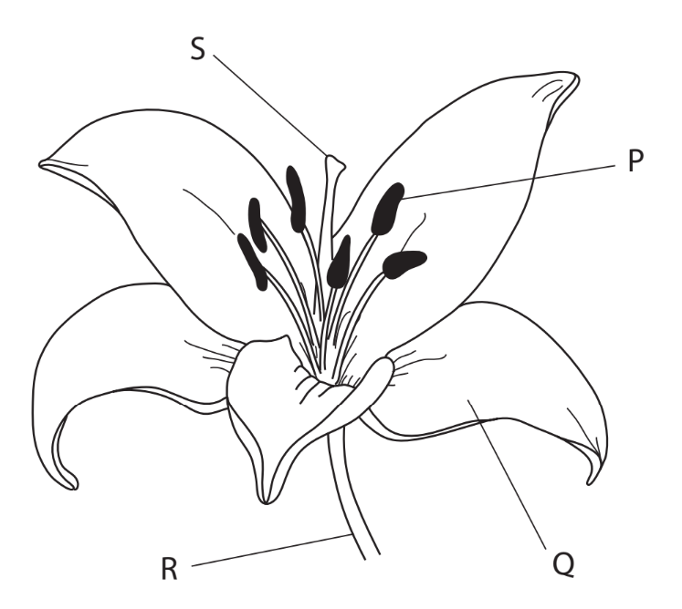

(i) Which of these is the name of structure P?

**(1)**

| **A** | Anther |
|---|---|
| **B** | Filament |
| **C** | Stigma |
| **D** | Style |

(ii) Which of these is the name of structure Q?

**(1)**

| **A** | Leaf |
|---|---|
| **B** | Petal |
| **C** | Stem |
| **D** | Style |

(iii) On which structure do pollen grains germinate?

**(1)**

| **A** | P |
|---|---|
| **B** | Q |
| **C** | R |
| **D** | S |

### 2((b)) — 3 marks — command: describe — structured — from paper Jan 2022 · 4BI1/1B
Describe how the structures of P, Q and S would differ in a wind-pollinated flower.

### 2((c)) — 4 marks — command: multiple — structured — from paper Jan 2022 · 4BI1/1B
Plants can also reproduce by asexual reproduction.

(i) Give one natural method that plants use to reproduce asexually.

**(1)**

(ii) Give one artificial method that a plant grower may use to reproduce a plant asexually.

**(1)**

(iii) Suggest why a plant grower may choose to reproduce a plant asexually rather than allowing the plant to reproduce sexually.

**(2)**

## Q2 — easy — 14 marks · exam-questions

### 2() — 8 marks — command: complete — structured — from paper Nov 2020 · 4BI1/1B
The passage describes reproduction in flowering plants.

Complete the passage by writing a suitable word in each blank space.

Flowers are organs that allow plants to carry out .............................. reproduction. The male gamete is contained within the .............................. grains. These grains are released from the .............................. , which is found on top of the filament. These grains need to land on the .............................. , the female part of the flower. Grains can be transferred by wind or by animals. These animals are often insects such as .............................. or butterflies. The petals of insect-pollinated plants are often .............................. and brightly coloured. After pollination, the grains germinate and a tube grows down the ..............................to reach the ovary. In the ovary, the gametes fuse. This process is known as.............................. .

### 2() — 2 marks — command: name — structured
Once the seed has been produced it can then germinate, but only in the correct conditions.

Temperature is one factor that affects the rate of germination.

Name **two **other factors.

### 3() — 2 marks — command: explain — structured
A student investigated the speed of seed germination at different temperatures.

To do this they placed 20 cress seeds on a layer of moist cotton wool in a petri dish.

They set up three of these plates and placed them in different temperature conditions: one at 10 °C, one at 30 °C, and one at 50 °C.

They recorded how long it took for 15 of those seeds to germinate.

The results were as follows:

| **Temperature (°C)** | **Time taken for 15 seeds to germinate (hours)** |
|---|---|
| 10 | 26 |
| 30 | 13 |
| 50 | 15 seeds did not germinate after 5 days |

Explain the results shown in the table.

### 4() — 2 marks — command: name — structured
The diagram below shows the seeds shortly after germination.

Name part **X** and part **Y** of the germinating seed.

## Q3 — easy — 7 marks · exam-questions

### 1((a)) — 1 mark — command: what — structured — from paper Jan 2021 · 4BI1/1B
The diagram shows a human sperm cell.

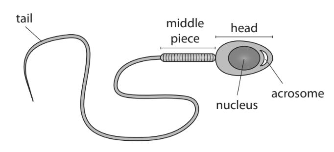

What is the maximum number of X chromosomes found in the nucleus of a sperm cell?

| **A** | 0 |
|---|---|
| **B** | 1 |
| **C** | 2 |
| **D** | 23 |

### 1((b)) — 2 marks — command: explain — structured — from paper Jan 2021 · 4BI1/1B
The middle piece of the sperm cell contains mitochondria.

Explain the function of these mitochondria.

### 1((c)) — 2 marks — command: suggest — structured — from paper Jan 2021 · 4BI1/1B
The acrosome contains digestive enzymes.

Suggest the function of the acrosome.

### 1((d)) — 2 marks — command: describe — structured — from paper Jan 2021 · 4BI1/1B
Describe the route taken by a sperm cell from when it enters the woman’s body to the site of fertilisation of the egg.

## Q4 — easy — 9 marks · exam-questions

### 6((a)) — 2 marks — command: which — structured — from paper Jan 2022 · 4BI1/1BR
The diagram shows the human female reproductive system.

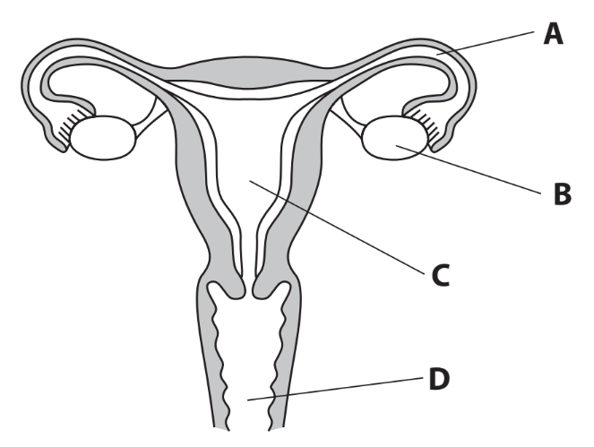

(i) Which label shows where ovulation occurs?

**(1)**

| **A** |
|---|
| **B** |
| **C** |
| **D** |

(ii) Which label shows where fertilisation usually occurs?

**(1)**

| **A** |
|---|
| **B** |
| **C** |
| **D** |

### 6((b)) — 4 marks — command: multiple — structured — from paper Jan 2022 · 4BI1/1BR
The diagram shows the changes in thickness of the uterus lining and levels of two hormones produced by the ovary during a menstrual cycle.

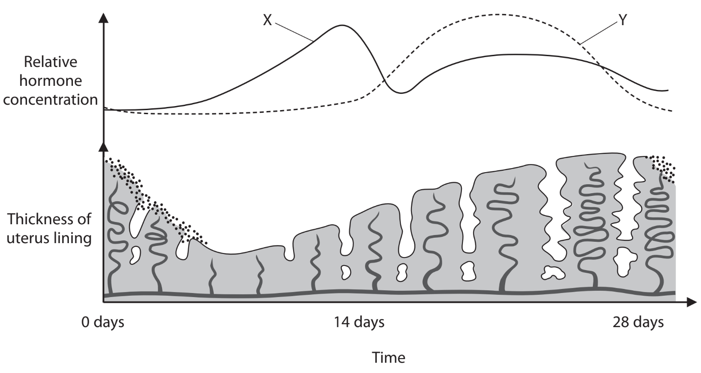

(i) Hormones X and Y are produced by the ovaries.

Name X and Y.

**(2)**

(ii) Explain the function of hormone X during the menstrual cycle.

**(2)**

### 6((c)) — 3 marks — command: explain — structured — from paper Jan 2022 · 4BI1/1BR
The diagram shows a human fetus developing in the uterus.

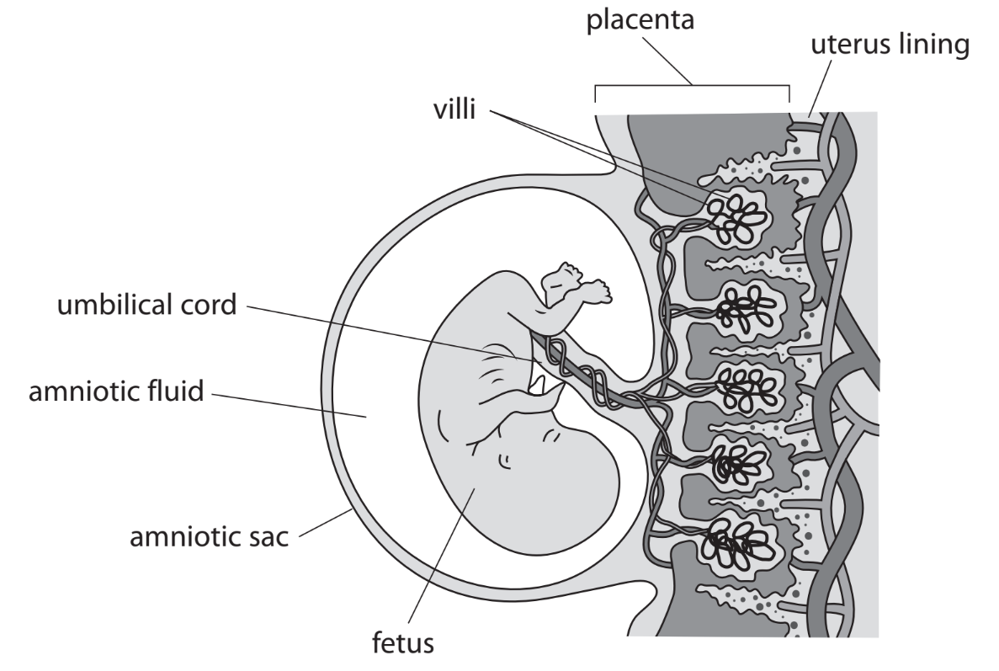

Explain how the structure of the placenta enables the efficient exchange of substances between the fetus and the mother.

## Q5 — easy — 6 marks · exam-questions

### 2((b)) — 2 marks — command: calculate — structured — from paper Jan 2021 · 4BI1/2BR
#### Separate: Biology Only

The graph shows the concentration of LH in the blood of a woman when she is unlikely to become pregnant and when she is likely to become pregnant.

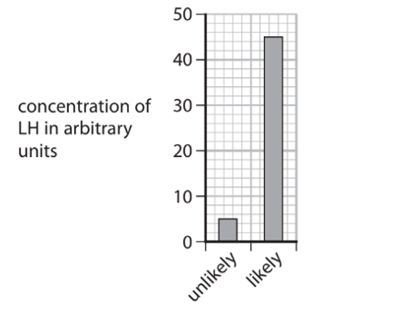

Calculate the percentage increase in the concentration of LH in the blood from when the woman is unlikely to become pregnant to when the woman is likely to become pregnant.

### 2((c)) — 4 marks — command: describe — structured — from paper Jan 2021 · 4BI1/2BR
#### Separate: Biology Only

Describe the roles of the hormones FSH and LH.

## Q6 — medium — 13 marks · exam-questions

### 8() — 2 marks — command: multiple — structured — from paper Nov 2020 · 4BI1/1B
Cell division can be by meiosis or by mitosis.

(i) Where are cells dividing by meiosis found in a human?

**(1)**

| **A** | kidney |
|---|---|
| **B** | penis |
| **C** | skin |
| **D** | testis |

(ii) Which part of a flowering plant is usually used to demonstrate cells dividing by mitosis?

**(1)**

| **A** | anther |
|---|---|
| **B** | cotyledon |
| **C** | root tip |
| **D** | xylem |

### 8((b)) — 6 marks — command: complete — structured — from paper Nov 2020 · 4BI1/1B
The table lists features comparing the processes of meiosis and mitosis in human cells. Complete the table by giving the missing information.

| **Feature** | **Meiosis** | **Mitosis** |
|---|---|---|
| Number of chromosomes in each original cell | 46 |   |
| Number of daughter cells produced from each original cell |   | 2 |
| Number of chromosomes in each daughter cell |   |   |
| Ploidy level of daughter cells produced |   | diploid |
| Genetic differences in daughter cells | present |   |
| Type of cell produced |   | body cell |

### 8((c)) — 5 marks — command: multiple — structured — from paper Nov 2020 · 4BI1/1B
Cell division can cause variation in offspring.

(i) Describe other causes of variation in offspring.

**(3)**

(ii) Scientists investigating a drug treatment use rats that are homozygous for many genes.

Suggest the advantages of using rats that are homozygous for many genes.

**(2)**

## Q7 — medium — 14 marks · exam-questions

### 8((a)) — 3 marks — command: describe — structured — from paper Nov 2021 · 4BI1/1B
All organisms carry out some form of reproduction such as asexual reproduction or sexual reproduction.

Describe how asexual reproduction differs from sexual reproduction.

### 8((b)) — 6 marks — command: multiple — structured — from paper Nov 2021 · 4BI1/1B
The diagram shows the structure of the human female reproductive organs.

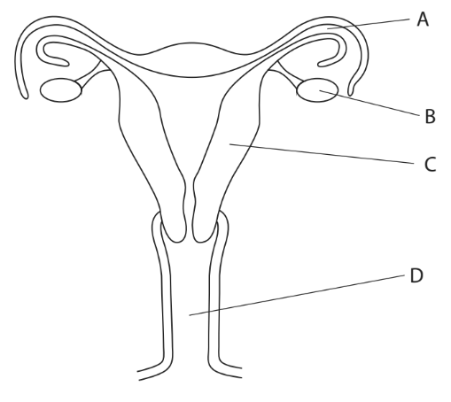

(i) What is the site of fertilisation?

**(1)**

| **A** |
|---|
| **B** |
| **C** |
| **D** |

(ii) Where does the fetus usually develop?

**(1)**

| **A** |
|---|
| **B** |
| **C** |
| **D** |

(iii) Describe the role of the hormones produced by structure B.

**(4)**

### 8((c)) — 5 marks — command: multiple — structured — from paper Nov 2021 · 4BI1/1B
The male reproductive system in humans produces sperm in a liquid called semen.

The production of sperm changes with age.

A scientist investigates how age affects mean semen volume and sperm concentration in one ejaculation.

The table shows the results of the investigation.

| **In one ejaculation** | **Age in years** |   |   |   |   |   |   |
|---|---|---|---|---|---|---|---|
| **16–30** | **31–33** | **34–36** | **37–39** | **40–43** | **44–47** | **48–72** |   |
| Mean semen volume in cm3 | 3.45 | 3.44 | 3.35 | 3.30 | 3.22 | 2.92 | 2.49 |
| Mean sperm concentration in millions per cm3 | 61.5 | 64.2 | 64.1 | 61.1 | 62.1 | 62.4 | 56.9 |
| Mean number of sperm released in millions | 212 | 221 | 215 | 202 |   | 182 | 142 |

(i) Calculate the mean number of sperm released in one ejaculation from men aged 40–43

**(1)**

(ii) Explain why mean number of sperm released is a better measure of fertility than either mean semen volume or mean sperm concentration.

**(2)**

(iii) Calculate the percentage decrease in mean number of sperm between men aged 37–39 and men aged 48–72

**(2)**

## Q8 — medium — 12 marks · exam-questions

### 8((a)) — 1 mark — command: which — structured — from paper Jan 2021 · 4BI1/1BR
The diagram shows an insect transferring pollen grains from flower P to flower Q.

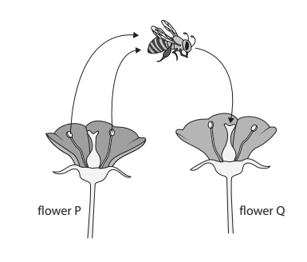

Which structure in flowers contains pollen grains?

| **A** | anther |
|---|---|
| **B** | ovary |
| **C** | petal |
| **D** | sepal |

### 8((b)) — 5 marks — command: multiple — structured — from paper Jan 2021 · 4BI1/1BR
Pollen grains are deposited on the stigma and grow tubes down the style.

(i) Suggest how style tissue helps the tube to grow.

**(2)**

(ii) The graph shows the change in the length of a pollen tube over a 180 minute period.

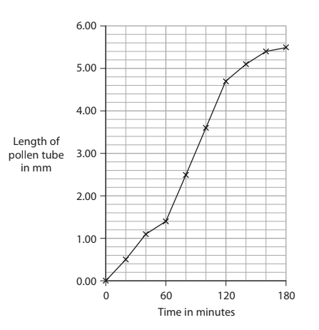

Calculate the fastest rate of pollen tube growth in mm per minute.

**(3)**

### 8((c)) — 6 marks — command: design — structured — from paper Jan 2021 ·  4BI1/1BR
A farmer grows apple trees.

The flowers on the apple trees must be pollinated by insects to produce an apple crop.

The farmer is concerned that the use of pesticides may affect the yield of apples.

Design an investigation to find out if pesticides reduce the yield of apples.

Include experimental details in your answer and write in full sentences.

## Q9 — medium — 11 marks · exam-questions

### 5((a)) — 6 marks — command: complete — structured — from paper Nov 2020 · 4BI1/2B
#### Separate: Biology Only

The table gives information about some hormones involved in the menstrual cycle.

Complete the table by giving the missing information.

| **Hormone** | **Name of structure that secretes hormone** | **Functions of hormone** |
|---|---|---|
| FSH | ________________ | 1. _________________________  2. Stimulates oestrogen secretion |
| __________ | Pituitary | 1. __________________________  2. Stimulates development of corpus luteum |
| __________ | Ovaries | 1. Repairs lining of the uterus  2. Stimulates LH secretion |
| Progesterone | ________________ | 1. Maintains lining of the uterus  2. Inhibits LH |

### 5((b)) — 1 mark — command: state — structured — from paper Nov 2020 · 4BI1/2B
State what is meant by the term **menstruation**.

### 5((c)) — 3 marks — command: estimate — structured — from paper Nov 2020 · 4BI1/2B
A girl starts to ovulate at the age of 12 years and continues to ovulate until she reaches the age of 51 years.

[Assume her menstrual cycle is 28 days and she releases one egg per cycle.]

Estimate the maximum number of eggs she could release in her lifetime.

Give your answer to two significant figures.

### 5((d)) — 1 mark — command: why — structured — from paper Nov 2020 · 4BI1/2B
Give a reason why a female does not produce as many offspring as the number of eggs she releases.

## Q10 — medium — 14 marks · exam-questions

### 2((a)) — 2 marks — command: which — structured — from paper Nov 2021 · 4BI1/2B
Flowers are involved in plant reproduction. The diagram shows a section through a flower with parts labelled A, B, C and D.

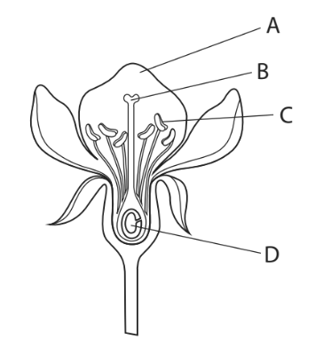

(i) Which part of the flower makes pollen grains?

**(1)**

| **A** |
|---|
| **B** |
| **C** |
| **D** |

(ii) What part of the flower is the stigma?

**(1)**

| **A** |
|---|
| **B** |
| **C** |
| **D** |

### 2((b)) — 3 marks — command: explain — structured — from paper Nov 2021 · 4BI1/2B
After a pollen grain lands on the stigma of a flower, a pollen tube grows.

Explain the role of the pollen tube.

### 2((c)) — 6 marks — command: multiple — structured — from paper Nov 2021 · 4BI1/2B
#### Separate: Biology Only

A scientist investigates the effect of three different solutions on the growth of pollen tubes using this apparatus.

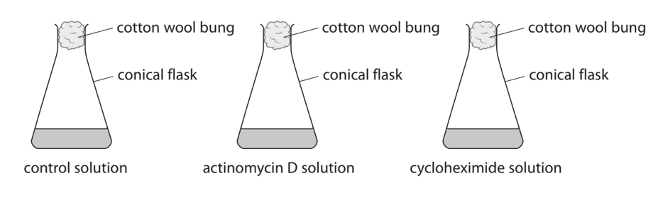

This is the scientist’s method.

- Place a different solution in three different flasks
- Add pollen grains to the solution in each flask
- Leave the grains in each solution for three hours
- Take a sample of pollen grains from each solution
- Measure the length of the pollen tubes in each sample

The graph shows the scientist’s results.

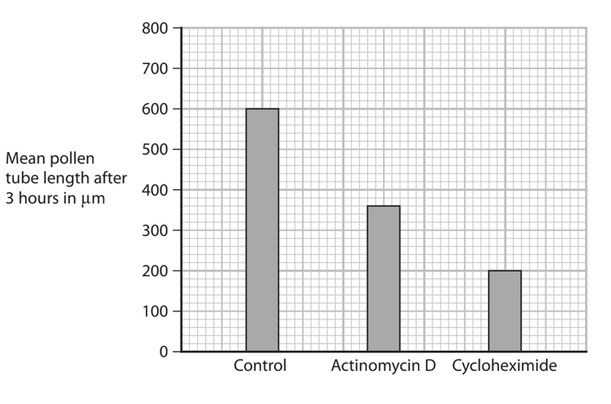

(i) Calculate the difference between the mean rate of pollen tube growth in the control solution and the mean rate of pollen tube growth in the actinomycin D solution.

Give your answer in μm per hour.

**(2)**

(ii) Actinomycin D prevents transcription and cycloheximide prevents translation.

Use this information and your own knowledge to explain the results of this investigation.

**(4)**

### 2((d)) — 3 marks — command: describe — structured — from paper Nov 2021 · 4BI1/2B
Describe a method the scientist could use to observe pollen grains

## Q11 — medium — 6 marks · exam-questions

### 11((b)) — 6 marks — command: design — structured — from paper June 2021 · 4BI1/1B
Some scientists have suggested that adding hydrogencarbonate solution to soil, instead of adding water, can increase plant growth.

Design an investigation to discover the effect that adding hydrogencarbonate solution has on the growth of seedlings.

Include experimental details in your answer and write in full sentences.

## Q12 — hard — 16 marks · exam-questions

### 7((a)) — 3 marks — command: multiple — structured — from paper Jan 2021 · 4BI1/1B
Scientists investigate the effect of salt (NaCl) concentration on the germination of maize seeds.

Batches of seeds are watered with different concentrations of salt solution.

They count the number of seeds that germinate in each batch 12 days after sowing. They then determined the percentage germination.

(i) Describe how the scientists could tell if a maize seed had germinated.

**(1)**

(ii) The scientists measured the germination after 12 days.

State two other abiotic variables that the scientists need to control in their investigation.

**(2)**

### 7((b)) — 9 marks — command: multiple — structured — from paper Jan 2021 · 4BI1/1B
The table shows the scientists’ results.

| **Concentration of salt solution in mmol** | **Percentage germination (%)** |
|---|---|
| 0 | 89 |
| 20 | 83 |
| 40 | 81 |
| 80 | 73 |
| 120 | 68 |
| 160 | 55 |
| 200 | 52 |
| 240 | 49 |
| 280 | 43 |
| 320 | 38 |

(i) Plot a line graph to show the effect of the concentration of the salt solution on germination.

Use a ruler to join your points with straight lines.

**(5)**

(ii) Explain the effect of increasing the concentration of the salt solution on germination.

**(4)**

### 7((c)) — 4 marks — command: explain — structured — from paper Jan 2021 · 4BI1/1B
As plants grow, they produce roots and stems.

(i) Explain the responses of roots and stems to gravity.

**(2)**

(ii) Explain the responses of roots and stems to light.

**(2)**

## Q13 — hard — 16 marks · exam-questions

### 1((a)) — 2 marks — command: suggest — structured — from paper June 2021 · 4BI1/2B
#### Separate: Biology Only

Read the passage below. Use the information in the passage and your own knowledge to answer the questions that follow.

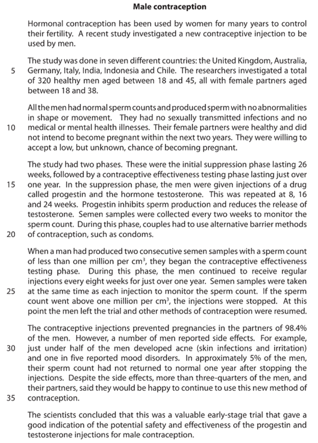

Suggest why the men in the study had to be able to produce sperm with no abnormalities in shape or movement (lines 8 and 9).

### 1((b)) — 4 marks — command: multiple — structured — from paper June 2021 · 4BI1/2B
#### Separate: Biology Only

(i) The contraceptive injection contained the drug progestin (lines 15 and 16).

Progestin is similar in structure and function to progesterone.

Describe the roles of progesterone in the human female body.

**(2)**

(ii) Suggest why the injections also contain the hormone testosterone (lines 15 and 16).

**(1)**

(iii) State where in the male body testosterone is produced.

**(1)**

### 1((c)) — 3 marks — command: multiple — structured — from paper June 2021 · 4BI1/2B
#### Separate: Biology Only

(i) Give the purpose of the initial suppression phase of the study (line 13).

**(1)**

(ii) State why the sperm count is monitored during the suppression phase (lines 18 and 19).

**(1)**

(iii) State why alternative contraception was used during the suppression phase (lines 19 and 20).

**(1)**

### 1((d)) — 1 mark — command: suggest — structured — from paper June 2021 · 4BI1/2B
#### Separate: Biology Only

Suggest why sperm count continues to be monitored during the testing phase (lines 25 and 26).

### 1((e)) — 2 marks — command: calculate — structured — from paper June 2021 · 4BI1/2B
#### Separate: Biology Only

Calculate the number of men whose partners became pregnant during the study (lines 6 and 28).

### 1((f)) — 4 marks — command: evaluate — structured — from paper June 2021 · 4BI1/2B
#### Separate: Biology Only

Evaluate the use of progestin and testosterone injections as a method of contraception.

## Q14 — hard — 16 marks · exam-questions

### 1((a)) — 2 marks — command: explain — structured — from paper Jan 2022 · 4BI1/2BR
#### Separate: Biology Only

Read the passage below. Use the information in the passage and your own knowledge to answer the questions that follow.

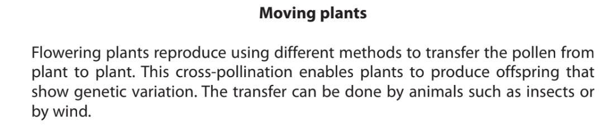

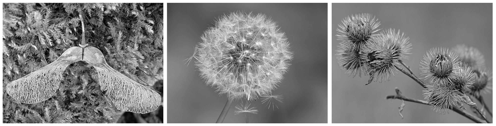

| Wings on a sycamore | Fluff on a dandelion | Spines on a burdock |
|---|---|---|

| lofaesofa, CC BY 2.0 <https://creativecommons.org/ licenses/by/2.0>, via Wikimedia Commons | Smudge 9000 CC BY-SA 2.0 <https://creativecommons.org/ licenses/by-sa/2.0>, via Flickr | Ryan Hodnett, CC BY-SA 4.0 <https://creativecommons.org/ licenses/by-sa/4.0>, via Wikimedia Commons |
|---|---|---|

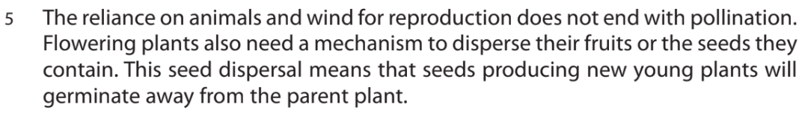

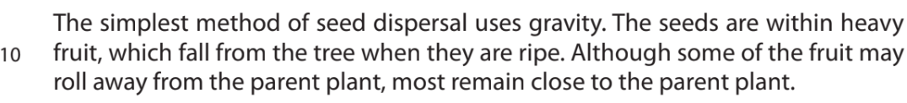

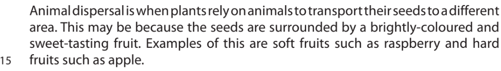

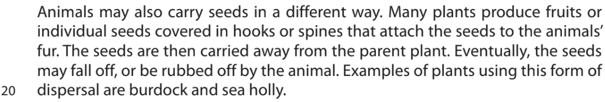

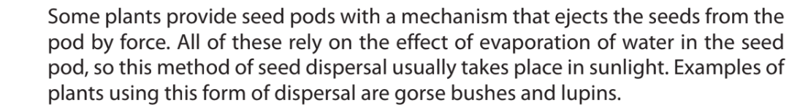

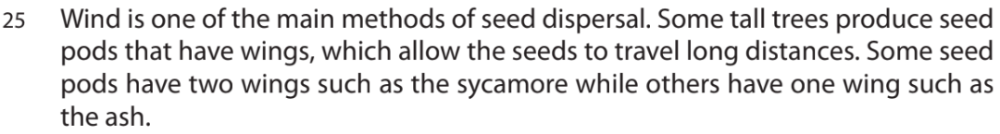

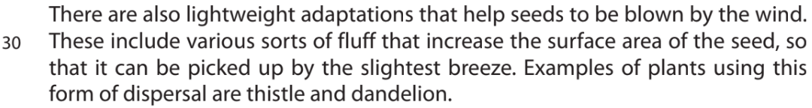

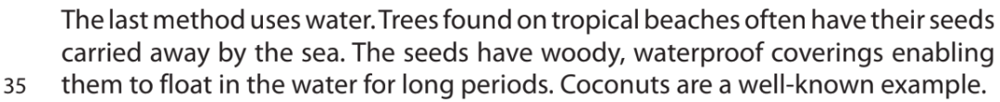

Explain how cross-pollination can lead to an increase in genetic variation. (Lines 2–3)

### 1((b)) — 4 marks — command: multiple — structured — from paper Jan 2022 · 4BI1/2BR
#### Separate: Biology Only

(i) Explain the advantages of the seeds germinating away from the parent plant. (Line 8)

**(3)**

(ii) Give one advantage of a seed germinating close to the parent plant. (Line 11)

**(1)**

### 1((c)) — 3 marks — command: explain — structured — from paper Jan 2022 · 4BI1/2BR
#### Separate: Biology Only

Explain the conditions needed for seed germination.

### 1((d)) — 2 marks — command: explain — structured — from paper Jan 2022 · 4BI1/2BR
#### Separate: Biology Only

Explain why some seeds are surrounded by a brightly-coloured and sweet-tasting fruit. (Lines 13–14)

### 1((e)) — 1 mark — command: suggest — structured — from paper Jan 2022 · 4BI1/2BR
#### Separate: Biology Only

Large numbers of tomato plants are often found growing along the sides of drains and settling beds on sewage farms.

Suggest a reason for this observation.

### 1((f)) — 1 mark — command: give — structured — from paper Jan 2022 · 4BI1/2BR
#### Separate: Biology Only

Give the reason why sunlight is required for lupin seeds to be dispersed. (Lines 21–24)

### 1((g)) — 3 marks — command: describe — structured — from paper Jan 2022 · 4BI1/2BR
#### Separate: Biology Only

Describe an experiment you could carry out to investigate how the presence of fluff on dandelion seeds affects how fast they fall. (Lines 30–31)
