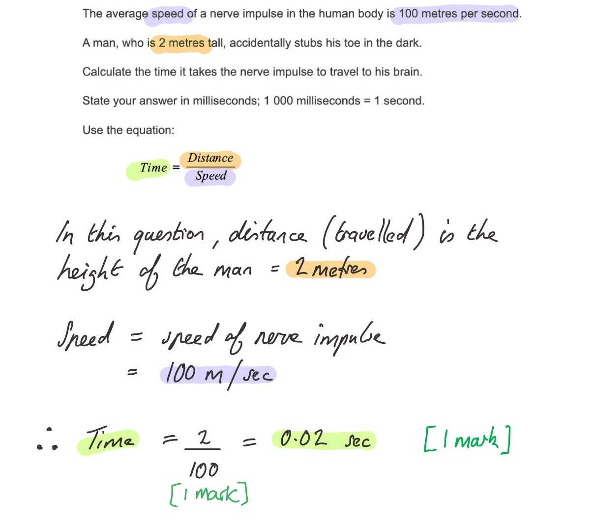
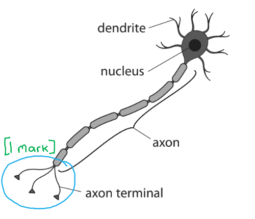
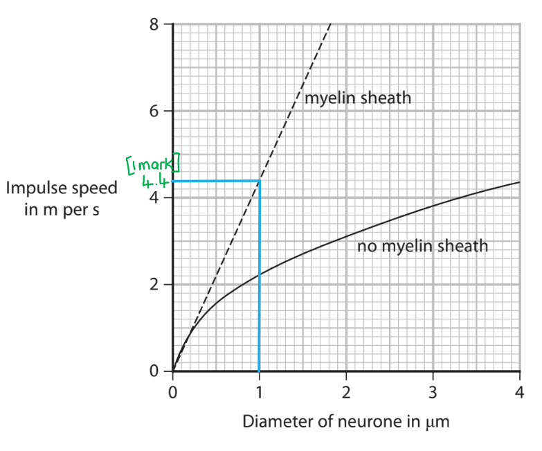
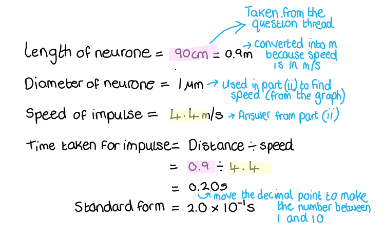
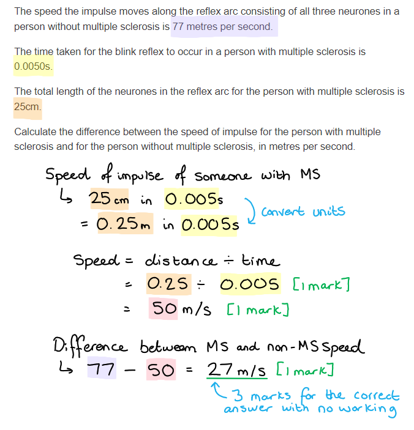
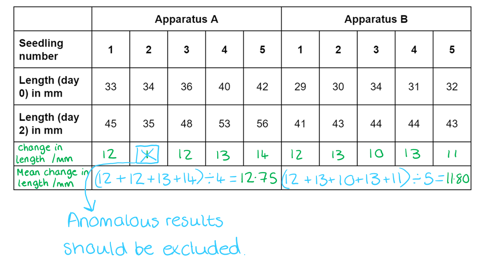

# Mark Schemes — Co-ordination & Response
**3. Structure & Functions in Living Organisms: Part 2** · Edexcel IGCSE Biology (Modular) (4XBI1) — 24/Unit 2

## Q1 — easy — 4 marks · exam-questions

### 1((b)) — 1 marks
**The correct answer is ****C****...**

Plants grow towards light and this is a positive phototropism**.**

**A** is incorrect as a root grows away from the light so has negative phototropism.

**B** is incorrect because it describes positive geotropism.

**D** is incorrect as it describes negative geotropism.

**[Total: 1 mark]**

### 1((c)) — 3 marks
The table should be completed as follows...

| **Role of substance** | **Name of substance** |
|---|---|
| Positive phototropism | Auxin |
| Digests fat | Lipase; **[1 mark]** |
| Diffuses across a synapse | Neurotransmitter/acetylcholine/noradrenaline/correct named neurotransmitter; **[1 mark]** |
| Prevents scurvy | Vitamin C/ascorbic acid;  **[1 mark]** |

**[Total: 3 marks]**

## Q2 — easy — 8 marks · exam-questions

### 1() — 2 marks
The organs of the Central Nervous System (CNS) are...

- The brain; **[1 mark]**
- The spinal cord; **[1 mark]**

**[Total: 2 marks]**

### 2() — 4 marks
The completed sentence is as follows...

The nervous system detects a change in the environment known as a **stimulus**; **[1 mark]** using specialised cells called **receptors**; **[1 mark]**.

**Impulses**; **[1 mark] **are then sent along neurones to the **CNS**; **[1 mark]** which co-ordinates a response.

**[Total: 3 marks]**

### 3() — 1 marks
**The correct answer is ****C**** (motor neurone).**

The impulse is travelling along neurone A **towards a muscle**, which is an example of an effector. The job of motor neurones is to carry impulses from the CNS towards effector organs.

**A** is incorrect because a relay neurone would not transmit its impulse to a muscle cell, but from a sensory neurone to a motor neurone.

**B** is incorrect because a sensory neurone carries an impulse away from a sense organ, e.g. the eye, to the CNS.

**D** is incorrect because the term 'reflex neurone' doesn't exist.

**[Total: 1 mark]**

### 4() — 1 marks
An example of an effector organ is...

Any **one** of the following:

- Gland(s); **[1 mark]**
- Muscle; **[1 mark]**

*Accept a named muscle, e.g. cardiac muscle, or a named gland, e.g. adrenal gland*

**[Total: 1 mark]**

> *Remember, effectors respond to the nerve impulse and '**effect'** (bring about) a response/change. For example, a muscle may contract in order to move a limb or a gland may secrete an enzyme to aid in the digestion of food.*

## Q3 — easy — 8 marks · exam-questions

### 1() — 1 marks
Structure **X** is the...

- Spinal cord; **[1 mark]**

*Reject spine or CNS.*

*Accept misspelling: spinal "chord".*

**[Total: 1 mark]**

> *Reflex actions do not involve the conscious part of the brain. Reflex arcs, therefore, send nerve impulses across the spinal cord, as shown here with structure X.*

### 2() — 3 marks
The journey taken by the nerve impulse between the sharp pin and the relay neurone within structure X shown in part (a) is...

Any **three** of the following:

- The stimulus/pin is detected by (pain) receptors (in the skin); **[1 mark]**
- A (nerve) <u>impulse</u> is sent...; **[1 mark]**
- ...(from the receptor) along a sensory neurone; **[1 mark]**
- The nerve impulse crosses a synapse (between the sensory neurone and the CNS); **[1 mark]**

**[Total: 3 marks]**

> *Note that this question does not ask you to describe the entire reflex arc, but just the stages between the pin and the relay neurone, so credit will not be awarded for answers relating to other stages.*

> *Credit is not given here for referring to the spinal cord as this is covered in part (a).*

### 3() — 2 marks
Reflex arcs are important because...

- Reflex arcs are rapid / allow for fast responses; **[1 mark]**
- They help minimise damage to the body / aid survival; **[1 mark]**

**[Total: 2 marks]**

> *This is an explain question, to gain full marks you need to mention the involuntary nature of reflexes and how they help the body to protect itself from potentially threatening situations.    *

### 4() — 2 marks
The time taken for the nerve impulse to travel to the man's brain is...

- 2 ÷ 100; **[1 mark]**
- 0.02 s / 20 ms; **[1 mark]**

*Full marks awarded for correct answer only*

**[Total: 2 marks]**

## Q4 — easy — 7 marks · exam-questions

### 1() — 2 marks
The table should be completed as follows...

Award 1 mark for each correct **column**:

| **Statement** | **Nerves** | **Hormones** |
|---|---|---|
| Very fast action | ✓ |   |
| Acts for a long time |   | ✓ |
| Makes use of chemical messenger molecules |   | ✓ |
| Acts on target cells in certain tissues |   | ✓ |
| Act for a** **short time | ✓ |   |
| Contains neurones | ✓ |   |

**[Total: 2 marks]**

### 2() — 1 marks
A hormone released by the pancreas is...

- Insulin; **[1 mark]**

*Accept glucagon.*

**[Total: 1 mark]**

> *Note that the pancreas is actually positioned more towards the left side of the body than the diagram in the question indicates!*

### 3() — 2 marks
The pancreas regulates blood glucose when levels rise above normal limits as follows...

Any **two** of the following:

- It detects an increase/change in blood glucose levels (and releases insulin); **[1 mark]**
- (Insulin) increases uptake/removal of glucose from the blood / causes glucose to be taken up by liver/muscle cells; **[1 mark]**
- (Insulin) causes glucose to be converted into/stored as glycogen; **[1 mark]**

**[Total: 2 marks]**

> *Note that marks are not awarded here for naming insulin, as credit has been given for this in part (b).*

### 4() — 2 marks
(i) A hormone produced by the testes is...

- Testosterone; **[1 mark]**

(ii) A role of testosterone is...

- Development of (male) secondary sexual characteristics / a named secondary sexual characteristic, e.g. growth of body/pubic hair / voice box; **[1 mark]**

**[Total: 2 marks]**

> *While the details of the role of testosterone may not be covered until the reproduction topic, you are expected to have knowledge of the roles of several different hormones here; make sure that you you can describe the source and function of adrenaline, insulin, testosterone, progesterone, and oestrogen.*

## Q5 — easy — 6 marks · exam-questions

### 1() — 1 marks
The plant chemical responsible for both phototropism and geotropism is...

- Auxin; **[1 mark]**

**[Total: 1 mark]**

> *Note that geotropism is sometimes referred to as gravitropism.*

### 2() — 1 marks
**Final answer:** ** The correct answer is ****C**** because...**

The term 'promote' refers to an increase in something. Here auxin **increases the rate of growth** of cells in the shaded side of a **shoot**, causing the shoot to bend towards light.

The term 'inhibit' refers to stopping something. Auxin **reduces the rate of growth **of cells in the lower side of a **root**, causing the root to bend towards gravity.

> *This is confusing! Auxins have different effects on the cells in the shoots and roots of plants, and it is essential that you are aware of this even if it doesn't seem very logical!*

**[Total: 1 mark]**

### 3() — 3 marks
The phototropism response in plants is important because...

Any **three** of the following:

- Plants can respond to <u>light</u>; **[1 mark]**
- Plants can maximise the absorption of light (energy); **[1 mark]**
- Plants can maximise their rate of photosynthesis; **[1 mark]**
- Plants can produce lots of glucose / as much glucose as possible; **[1 mark]**
- Glucose (produced in photosynthesis) can be used in respiration / to release energy (for growth); **[1 mark]**

**[Total: 3 marks]**

> *This is an example of an explanation that needs to be taken all the way to its conclusion, linking the ability to respond to light with the ability to carry out respiration and release energy in order to survive.*

> *Not every part of the explanation is needed here for full marks, but it is always good practice to take your explanations to their logical conclusion to ensure that the question has been fully answered.*

### 4() — 1 marks
Tropism responses that occur towards a stimulus are known as...

- Positive (tropisms); **[1 mark]**

**[Total: 1 mark]**

## Q6 — medium — 10 marks · exam-questions

### 10((a)) — 6 marks
(i) The names of the neurones shown are...

- A - sensory; **[1 mark]**
- B** **- relay; **[1 mark]**
- C** **- motor; **[1 mark]**

*Accept afferent for sensory.*

*Accept association for relay.*

*Accept efferent for motor.*

(ii) The role of these neurones in the withdrawal reflex of a finger from a hot object is as follows...

- Neurone A carries an impulse from a receptor to the CNS/spinal cord/relay neurone/neurone B; **[1 mark]**
- Neurone A joins to neurone B via a synapse / carries the impulse (from receptor neurone A) to the motor neurone/neurone C; **[1 mark]**
- Neurone C carries the impulse to an effector/muscle/gland; **[1 mark]**

*Award a maximum of 2 marks if the term 'impulse' has not been used anywhere in the answer.*

> *Impulse** is the best word to describe the electrical wave that is carried along neurones during nervous transmission. If you write 'message' or 'signal' you can only score a maximum of 2 marks for this question.*

**[Total: 6 marks]**

### 10((b)) — 4 marks
(i) The other measurements the teacher would need to make in order to calculate the speed of a nerve impulse are as follows...

Any **two** of the following:

- Measure the distance (from hand to spinal cord and or brain to other hand); **[1 mark]**
- For each student / all students in the circle; **[1 mark]**
- Measure time taken / how long it took (for student A to feel hand being squeezed); **[1 mark]**
- Divide distance by time to calculate speed; **[1 mark]**

***Ignore ****'count the number of students'*

(b) (ii) A description of whether the teacher’s method is likely to give an accurate estimate of the speed of a nerve impulse is as follows...

Any **two** of the following:

- (The teacher's estimate) may be under-estimate / too low / too slow / method adds time / delay; **[1 mark]**
- (The response from each student is not a reflex so) need to allow decision making / role of brain / reaction time; **[1 mark]**
- Because a delay occurs at each synapse; **[1 mark]**

**[Total: 4 marks]**

## Q7 — medium — 10 marks · exam-questions

### 10((a)) — 1 marks
The term used to describe the control of an organism's internal environment is...

- Homeostasis; **[1 mark]**

**[Total: 1 mark]**

### 10((b)) — 4 marks
The withdrawal reflex of a finger from a hot object can be described as follows...

Any **four** of the following:

- Receptors in the skin surface detect stimulus / are stimulated; **[1 mark]**
- An <u>impulse</u>/<u>action potential</u> is generated; **[1 mark]**
- (The impulse/action potential) travels along a sensory neurone to a relay neurone/central nervous system/CNS; **[1 mark]**
- (The impulse/action potential travels) via diffusion of neurotransmitters...; **[1 mark]**
- (...Across a) synapse; **[1 mark]**
- (From the CNS/relay neurone the impulse/action potential travels along a) motor neurone to a muscle/effector; **[1 mark]**
- (This causes the) effector/muscle to contract (and pull away finger); **[1 mark]**

*Ignore reference to 'message' or 'signal' for marking points 2, 3 and 6.*

**[Total: 4 marks]**

> *You must be able to describe the pathway of a simple reflex action, so invest some time in becoming familiar with the steps involved.*

> *The process can be summarised as follows:*

> *Stimulus → Receptor → Sensory neurone → CNS → Motor neurone → Effector*

### 10((c)) — 5 marks
(i) The changes taking place in structure A in a cold environment include...

- Less sweat is released (by structure A); **[1 mark]**
- (This leads to) less (sweat) evaporation / less cooling / less heat loss; **[1 mark]**

(ii) The changes taking place in structure B in a cold environment include...

Any **three** of the following:

- (In structure B) blood vessels (that supply the capillaries in the skin surface) constrict / vasoconstriction occurs; **[1 mark]**
- (This leads to) less blood flow (to the skin surface); **[1 mark]**
- (Resulting in) less heat loss / (more) heat conserved; **[1 mark]**
- (Due to) less convection / radiation (occurring); **[1 mark]**

***Ignore ****reference to 'capillaries constrict' for marking point 1.*

***Accept ****'more blood flows away from the (skin) surface' for marking point 2. *

**[Total: 5 marks]**

> *The skin is responsible for temperature regulation. When a person moves into a cold environment the aim is to reduce the amount of heat lost through the skin. The sweat glands become less active to reduce heat loss through evaporation of sweat, while the blood vessels that supply the capillaries that flow to the skin surface constrict to redirect the flow of blood away from the skin surface. These measures enable the body to conserve heat when needed.*

> *It is important to note here that capillaries themselves do not contain any muscle in their walls and so it is not the capillaries themselves that constrict; statements to this effect will not be credited here. You can gain credit by stating that **blood vessels** constrict as this is a broader term that encompasses the larger blood vessels that supply the skin capillaries.*

> *Both parts (i) and (ii) here are **explain** questions so for full marks you need to explain **how** the events described reduce heat loss at the skin surface.*

## Q8 — medium — 7 marks · exam-questions

### 2((a)) — 1 marks
**Final answer:** **The correct answer is ****C****.**

The adrenal gland is represented by the arrow labelled 'Y'

**A** is incorrect as it represents the pituitary gland (label W)

**B** is incorrect as it represents the pancreas (label X)

**D** is incorrect as it represents the ovary (label Z)

### 2((b)) — 1 marks
An organ is...

- A group of/several tissues carrying out one/a particular function/purpose/role; **[1 mark]**

**[Total: 1 mark]**

> *One tissue is made up of one type of cell, but when groups of different tissues work together to carry out a function, this is an organ. For example, the heart includes muscle tissue, nervous tissue and fat tissue.*

### 2((c)) — 5 marks
The advantages of these effects are...

Any **five** of the following:

- (Dilation of the pupil allows) more light into the eye/retina; **[1 mark]**
- (This is important) to see danger / be more aware of surroundings; **[1 mark]**
- (Increased heart rate allows) more blood to be transported to the lungs; **[1 mark]**
- (And) more blood to (leg) muscles / blood is diverted to (leg) muscles; **[1 mark]**
- Therefore more oxygen (is transported to muscles); **[1 mark]**
- (And) more glucose (transported to muscles / in blood); **[1 mark]**
- (More oxygen and glucose/blood flow means that) more (aerobic) respiration occurs / less anaerobic respiration occurs / less lactic acid is produced; **[1 mark]**
- (More respiration means) more ATP/energy; **[1 mark]**
- (Therefore the person can) run faster/escape / contract muscles more; **[1 mark]**

**[Total: 5 marks]**

> *The key link to understanding how adrenaline works is to understand that the oxygen and glucose being carried in the blood are the reason for the increased blood flow as they are the reactants of respiration.*

## Q9 — medium — 9 marks · exam-questions

### 6((a)) — 4 marks
(i) The circle should be drawn as follows...

- Round the axon terminals as shown; **[1 mark]**

(ii)** B**** is the correct answer**

A motor neurone connects the central nervous system (brain and spinal cord) to the effectors (as described in the thread of this question.

**A** is incorrect as it is not a type of neurone

**C** is a neurone found in the central nervous system connecting together the sensory neurones and motor neurones

**D** is a neurone which connects the receptors to the central nervous system

(iii) The advantage of the withdrawal reflex is...

Any **two** of the following:

- Its a fast (response); **[1 mark]**
- (Because there is) no brain involvement / no thought / automatic / involuntary; **[1 mark]**
- (This means) less damage/harm/ no burning (from the heat/hot object); **[1 mark]**

**[Total: 4 marks]**

### 6((b)) — 5 marks
(i) **The correct answer is**** D ****because...**

Wider neurones have faster impulses. This is shown in the graph as the impulse speed gets faster as diameter increases.

**A** is incorrect as the impulse is not faster in neurones with a diameter of 0.2 µm or less.

**B **is incorrect, relay neurones are an example of unmyelinated neurones.

**C **is incorrect as myelinated and unmyelinated neurones are shown in the graph to have the same diameters.

(ii) The speed of the impulse in this neurone is...

- 4.4 (m per s); **[1 mark]**

(iii) The time taken for the impulse to travel along this neurone can be calculated as follows...

- (90 cm =) 0.9 m; **[1 mark]**
- 0.20 s; **[1 mark]**
- 2.0 x 10-1; **[1 mark]**

*Full marks for correct answer without calculations shown*

*A maximum of 2 marks can be awarded for the correct answer not shown in standard form.*

> *There are several opportunities to earn marks here even if you get the wrong answer in the end.*

> *Each of the following can be awarded 1 mark if shown in the calculations:*

> *0.9 (m) **OR **speed expressed as x 100 cm/s **OR **90 ÷ speed** OR **0.9 ÷ speed.*

**[Total: 5 marks]**

## Q10 — medium — 6 marks · exam-questions

### 11() — 6 marks
An investigation to find out if light intensity affects the speed at which woodlice move would be as follows...

Any **six **of the following:

- C = (Experiment carried out at a) range of different light intensities / in the dark and in the light; **[1 mark]**
- O = Same species/age of wood lice (is used); **[1 mark]**
- R = Repeats are carried out / groups of woodlice are used; **[1 mark]**
- M1 = Measure the distance moved (by the woodlice); **[1 mark]**
- M2 = (Measure the distance moved) over a set time; **[1 mark]**
- S1 and S2 = Same humidity / temperature / oxygen / carbon dioxide / food / size of container / wood types; **[up to 2 marks]**

*Accept "Measure the length of time it takes" and "to move a set distance" for M1 and M2.*

**[Total: 6 marks]**

> *Remember that with **CORMS** questions you will not be expected to know anything about the experiment you're presented with. You just have to apply your knowledge of experimental design to a new scenario. *

> *Remember that **CORMS** stands for: **C**hange, **O**rganism, **R**epeat, **M**easure, **S**ame. There are always two marks available for **M**easure and two for **S**ame. *

> *The most difficult mark to get is the **O**rganism because you need to remember to include the word **same** in your answer, e.g. "same species". The point for **O**rganism needs to be different to the two points in **S**ame. *

> *Remember to write your answers in full sentences, as stated in the question stem, but you are welcome to make a quick bullet point plan in a blank space somewhere else on your page. Use your plan to tick off and make sure you've hit all the marking points.*

## Q11 — hard — 9 marks · exam-questions

### 2((a)) — 4 marks
(i) **The correct answer is ****B ****because...**

X is pointing to the cornea, which is the transparent protective outer coating at the front of the eye.

(ii) **The correct answer is ****A ****because...**

When the eye is viewing something close the shape of the lens adjusts through a process called accommodation. The lens becomes wider as the ciliary muscles contract and the suspensory ligaments become loose.

**B** is incorrect because it is not possible for the ciliary muscles to be contracted and the suspensory ligaments to be tight at the same time; when the ciliary muscles are contracted the suspensory ligaments are loose.

**C** is incorrect for a similar reason; it is not possible for the ciliary muscles to be relaxed and the suspensory ligaments to be loose at the same time. When the ciliary muscles are relaxed the suspensory ligaments are tight.

**D** is incorrect because this is what happens in the eye when viewing something far away.

(iii) Structure Y controls the light entering the eye when someone walks into a dark room by...

Any **two **of the following:

- <u>Pupil</u> widens/dilates/gets bigger; **[1 mark]**
- Radial muscles contract; **[1 mark]**
- Circular muscles relax; **[1 mark]**

**[Total: 4 marks]**

> *Structure Y is the iris, not the pupil. You need to state here that it is the **pupil** that dilates; this occurs because of contraction of the radial muscles of the iris.*

### 2((b)) — 5 marks
(i) The difference between the speed of impulse for the person with multiple sclerosis and for the person without multiple sclerosis is...

- 2.5 ÷ 0.005 **OR** 25 ÷ 0.005 **OR **0.25 (m) **OR** 5000; **[1 mark]**
- 50 (m/s); **[1 mark]**
- 27 (m/s); **[1 mark]**

*Full marks can be awarded for the correct answer of 27 m/s in the absence of other calculations.*

(ii) The speed of the impulse calculated along all three neurones is less than the speed of the impulse along only the motor neurone because...

Any **two **of the following:

- (More) synapses/gaps/clefts are present; **[1 mark]**
- (Impulses) are transmitted (across synapses) by (chemical) diffusion; **[1 mark]**
- Neurotransmitters (diffuse across the synapse); **[1 mark]**

**[Total: 5 marks]**

## Q12 — hard — 11 marks · exam-questions

### 11((a)) — 7 marks
(i) The role of structures A, C and D in focusing light from a near object onto the retina are...

- The cornea/C bends/refracts light; **[1 mark]**
- The lens/A becomes (more) curved/rounder/convex/thicker; **[1 mark]**
- As ciliary muscles/body/D contract; **[1 mark]**
- (The ciliary muscles/D) cause suspensory ligaments to relax / become less taut / slacken/loosen; **[1 mark]**

(ii) A reflex involving structure B protects the retina from damage because...

Any **three** of the following:

- The circular muscles (of the iris/B) contract; **[1 mark]**
- The radial muscles (of the iris/B) relax; **[1 mark]**
- The pupil constricts / becomes smaller; **[1 mark]**
- (Therefore) less light enters the eye; **[1 mark]**

**[Total: 7 marks]**

### 11((b)) — 4 marks
(i) The liquid contains lysozyme because...

- (The enzyme) breaks down/digests cell walls of / kills / prevents growth of / removes / protects from bacteria / fungi / pathogens / microorganisms; **[1 mark]**
- (Which) prevents infection/disease; **[1 mark]**

*Full marks can be awarded for stating that enzymes "prevent bacterial infection" as this combines marking points 1 and 2.*

(ii) the liquid is maintained at pH 7 because...

Any **two** of the following**:**

- This is the <u>optimum</u> pH (for lysozyme); **[1 mark]**
- (pH 7) prevents the enzyme being denatured **OR **(pH 7) prevents changes in active site; **[1 mark]**
- (Lysozyme will) break down cell walls / kill bacteria / work at <u>fastest</u> / <u>fast rate </u>; **[1 mark]**
- (If conditions were too) acidic **OR** (too) alkaline this may damage the eye; **[1 mark]**

**[Total: 4 marks]**

> *Remember that bacteria have cell walls but human (animal) cells do not so lysozyme enzymes will not break down our cells, only the bacterial cells. *

## Q13 — hard — 12 marks · exam-questions

### 1() — 1 marks
Neurone X is a...

- Relay (neurone); **[1 mark]**

**[Total: 1 mark]**

> *In a reflex arc, the sensory neurone is connected to the relay neurone and the relay neurone is connected to the motor neurone. Where each neurone connects, there is a synapse.*

### 2() — 4 marks
The events leading up to contraction of the diaphragm would be as follows...

- A nerve impulse arrives at the end of neurone X/the relay neurone **AND** this triggers the release of neurotransmitters;** [1 mark]**
- (Neurotransmitter) <u>diffuses</u> across the gap between neurones / the synaptic cleft; **[1 mark]**
- (Neurotransmitter) attaches/binds to (nicotinic acetylcholine) receptors on second/postsynaptic neurone membrane; **[1 mark]**
- A nerve impulse is generated in the second/postsynaptic neurone **AND** is transmitted to the diaphragm**; [1 mark]**

**[Total: 4 marks]**

> *Note that the question only requires you to describe the process up to the contraction of the diaphragm, so content relating to the recycling of neurotransmitter will not be credited here.*

### 3() — 3 marks
Anatoxin can lead to death as follows...

- Anatoxin binds to (nicotinic acetylcholine) receptors and stops/blocks the neurotransmitter from binding; **[1 mark]**
- Nerve impulses are not generated in the (second) neurone; **[1 mark]**
- Lack of stimulation (by nerve impulses) means that muscle does not contract / is paralysed **SO** breathing stops (leading to death); **[1 mark]**

**OR**

Any **three **of the following:

- Anatoxin binds to (nicotinic acetylcholine) receptors and mimics / takes the place of the neurotransmitter; **[1 mark]**
- Anatoxin triggers an impulse in the (second) neurone; **[1 mark]**
- Anatoxin is not broken down by the enzyme (that usually breaks down the neurotransmitter); **[1 mark]**
- Constant stimulation (by nerve impulses) causes muscle to contract continuously/without stopping **SO **breathing stops (leading to death); **[1 mark]**

**[Total: 3 marks]**

> *This question requires you to **apply your knowledge** of neurotransmitter function to this unfamiliar scenario. Here, as this is a **suggest** question and you are not expected to **know** the exact answer, there are two possible routes by which you can gain full marks.*

> *Many drugs and toxins work on a similar basis to that described here, by blocking or mimicking the effect of neurotransmitters at synapses.*

### 4() — 4 marks
(i) ADH is produced by the...

- Pituitary gland; **[1 mark]**

(ii) ADH helps to prevent dehydration in the body as follows...

Any **three** of the following:

- It is released in response to the blood becoming more concentrated / a drop in blood water content; **[1 mark]**
- It causes the collecting ducts in the nephron/tubules/kidney to become more permeable to water; **[1 mark]**
- More water is reabsorbed into the blood; **[1 mark]**
- A lower volume of urine is produced / less water is lost in the urine / the urine becomes more concentrated; **[1 mark]**

**[Total: 4 marks]**

> *ADH is in the specification for this topic for those students studying separate science.*

> *You may have covered ADH in more detail in the excretion topic, so you could check back to this section to remind yourself of the role of ADH in osmoregulation.*

## Q14 — hard — 10 marks · exam-questions

### 1() — 4 marks
The blood glucose changes in normal diet mice occurred because...

Any **four** of the following:

- (Blood glucose rises after a meal due to) absorption of glucose/products of carbohydrate digestion into the blood from the small intestine/ileum; **[1 mark]**
- A rise in blood glucose is detected by the pancreas; **[1 mark]**
- The pancreas releases insulin into the blood; **[1 mark]**
- Glucose is taken up/transported into the (muscle and liver) cells/tissues (from the blood) **OR **insulin increases the uptake of glucose into the (muscle and liver) cells/tissues; **[1 mark]**
- Conversion of glucose into glycogen; **[1 mark]**

**[Total: 4 marks]**

> *During the first 90 minutes, the glucose levels show an initial increase followed by a decrease. Your explanation should include the reason **why the blood glucose increases** (absorption of glucose in the small intestine after a meal), as well as the **reason it decreases **soon afterward (the release and action of insulin).*

### 2() — 2 marks
Glucose levels increase despite not having consumed a meal because...

- Blood glucose levels fall **SO** another hormone/glucagon is released; **[1 mark]**
- Glycogen is converted into glucose / glucose is released into the blood from the cells; **[1 mark]**

**[Total: 2 marks]**

> *High levels of blood glucose are regulated by the release of insulin, but when blood glucose levels drop too low then another hormone, known as glucagon, is released. Glucagon causes the breakdown of glycogen, leading to the release of glucose into the blood.*

### 3() — 2 marks
An explanation for the results shown in part (a) for the mice on a high-fat diet could be that...

Any **two** of the following:

- The mice are not producing as much insulin / are not responding to the insulin that they are producing / are producing non-functioning insulin; **[1 mark]**
- The mice are developing diabetes;** [1 mark]**
- The glucose is remaining in the blood instead of being taken up by/into the cells;** [1 mark]**
- More glucose enters the blood **SO** it takes longer for the cells to take up all the glucose / the cells do not need all of the glucose / the glucose will be removed from the body in the urine; **[1 mark]**

**[Total: 2 marks]**

> *The graph shows that the blood glucose levels of the mice on a high fat diet **keeps on increasing** after the blood glucose of the mice on a normal diet has started to decrease. The blood glucose of these mice also **fails to return to the initial low level**.*

> *While you are not expected to **know** about the causes of elevated blood glucose, **suggest **questions like this require you to **apply your existing knowledge** and to use your **reasoning skills** to come up with an answer. Here it would be reasonable to assume that the mechanism that is functioning for the mice on a normal diet is not working as it should for the mice on a high fat diet; their **insulin levels are lower**, or the insulin produced is **not having the effect** that it should, meaning that **glucose remains in the blood** for longer. The condition in which insulin production is low, or the cells fail to respond to insulin, is known as** diabetes**.*

> *There is also some credit for the logical idea that if more glucose enters the blood in the first place then it will take longer for that glucose to eventually enter the cells, or that the excess glucose may be excreted rather than used.*

### 4() — 2 marks
DDP-4 inhibitors would affect blood glucose as follows...

Any **two** of the following:

- The blood glucose (of the high fat diet mice) would decrease more quickly/faster after a meal; **[1 mark]**
- DDP-4 inhibitors prevent (the enzyme) DDP-4 from inactivating GLP-1 / cause GLP-1 to remain active; **[1 mark]**
- GLP-1 can continue stimulating the release of insulin (and suppressing the release of glucagon); **[1 mark]**

**[Total: 2 marks]**

> *This question requires you to interpret the events happening in the diagram. The diagram introduces two new enzymes; DDP-4 and GLP-1, as well as showing us what they do; GLP-1 acts to increase insulin secretion and suppress glucagon, while DDP-4 inactivates GLP-1. So, when the mice are treated with DDP-4 inhibitors, the action of DDP-4 stops, enabling GLP-1 to do its job. The effects of this will be to increase the ability of the mice to regulate their glucose levels.*

> *Questions like this are tricky, and the key is not to panic when presented with unfamiliar scenarios such as this one. Remember that you will always be presented with everything that you need in order to answer a question that contains off-spec content, so provided that you know your on-spec material well there is nothing to stop you from having a good go at application questions like this.*

## Q15 — hard — 13 marks · exam-questions

### 1() — 3 marks
Apparatus B should be set up as follows...

Any **three** of the following:

- Set up a cork board with 5 bean seedlings pinned to it / in the same way as that shown for apparatus A;** [1 mark] **
- Rotate the board constantly (using a motor/clinostat);** [1 mark] **
- (use a mechanism that will) cancel out the effects of gravity; **[1 mark] **
- Keep all other variables the same / named example of variable that should be kept the same, e.g. place apparatus in a dark cupboard for the same amount of time;** [1 mark] **

**[Total: 3 marks]**

> *Remember that a **control** is different from 'controlled variables'. An experimental control is important when analysing results as it provides a set of results to which the experimental results can be compared. This shows that **any changes which occur result from changes to the independent variable**, rather than some other factor.*

> *When setting up a control experiment, it is the effect of the variable of interest that needs to be cancelled out (so that the results both with and without this variable can be established). Here the students are studying the effects of gravity, so the effects of gravity need to be cancelled out in some way. The easiest way to do this is to set the board up to rotate so that gravity acts equally on every part of the seedlings.*

### 2() — 2 marks
The seedlings should be placed into a dark room because...

- It ensures that only one variable is changed / that light is controlled/kept constant/a control variable / that light is not directional;** [1 mark]**
- It prevents light from affecting root growth/the results / means that any observed results are due to gravity and not light; **[1 mark]**

**[Total: 2 marks]**

> *If the seedlings were in the light then it would be almost impossible to ensure that all seedlings received the same light intensity from all directions; by eliminating light altogether it is easier to control this variable.*

> *Keeping the seedlings in the dark means that light does not become an additional variable that might influence the results. If light were falling on the seedlings then this might influence root growth; by keeping them in the dark the effects of light can be eliminated and the effects of gravity can be isolated.*

### 3() — 4 marks
The table should be completed as follows...

- Change in length correctly calculated for apparatus A; **[1 mark]**
- Change in length correctly calculated for apparatus B; **[1 mark]**
- Mean change in length correctly calculated for apparatus A **AND** anomaly not included; **[1 mark]**
- Mean change in length correctly calculated for apparatus B; **[1 mark]**

|   | **Apparatus A** | **Apparatus B** |   |   |   |   |   |   |   |   |
|---|---|---|---|---|---|---|---|---|---|---|
| **Seedling number** | **1** | **2** | **3** | **4** | **5** | **1** | **2** | **3** | **4** | **5** |
| **Length of seedling on day 0 / mm** | 33 | 34 | 36 | 40 | 42 | 29 | 30 | 34 | 31 | 32 |
| **Length of seedling on day 2 / mm** | 45 | 35 | 48 | 53 | 56 | 41 | 43 | 44 | 44 | 43 |
| **Change in length / mm** | 12 | 1 | 12 | 13 | 14 | 12 | 13 | 10 | 13 | 11 |
| **Mean change in length / mm** | 12.75 | 11.80 |   |   |   |   |   |   |   |   |

**[Total: 4 marks]**

> *Remember that anomalous results should either be left out of the mean or repeated. Here seedling 2 grows much less than all of the other seedlings for apparatus A, so this result should be left out of the mean to avoid skewing the results.*

### 4() — 4 marks
The appearance of the seedlings can be explained as follows...

*Seedling from apparatus A*

- There is a higher concentration of auxin along the bottom/lower half of the root; **[1 mark]**
- Auxin inhibits/reduces growth in roots/root cells; **[1 mark]**
- The top half of the root grows faster than the bottom half / the root bends towards gravity; **[1 mark]**

*Seedling from apparatus B*

- The concentration of auxin is the same across the root / auxin is not distributed in response to gravity (so growth is equal);** [1 mark]**

**[Total: 4 marks]**

> *Make sure that you are clear which seedling you are referring to in your answer.*
