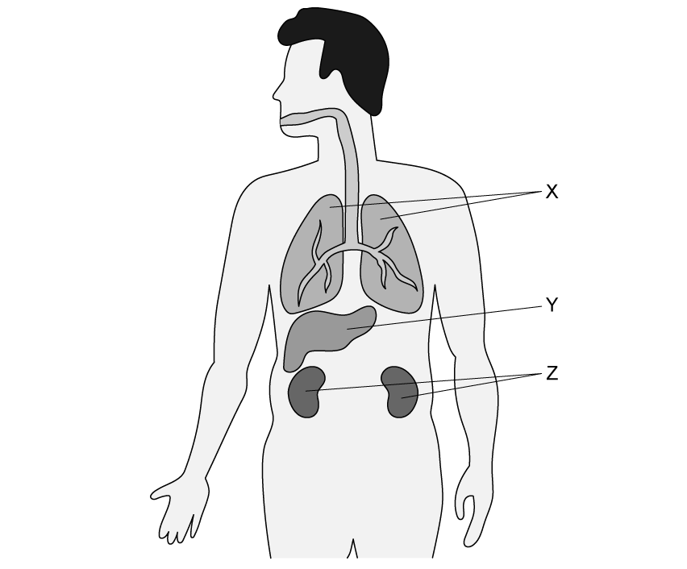
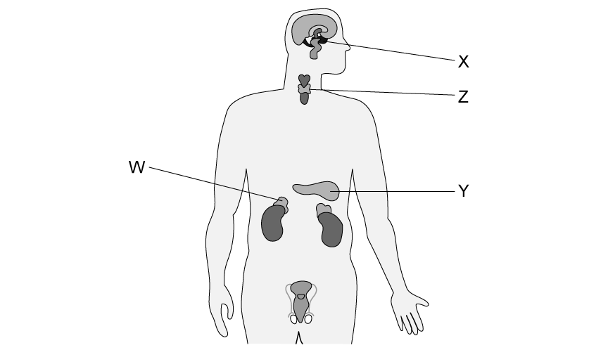
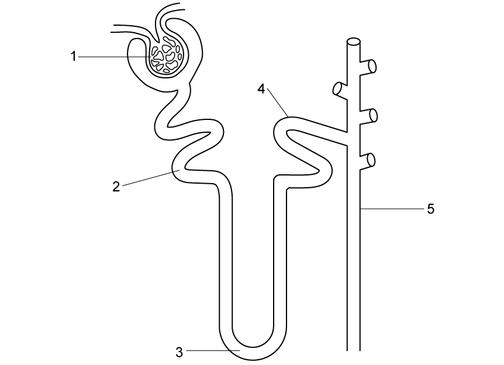
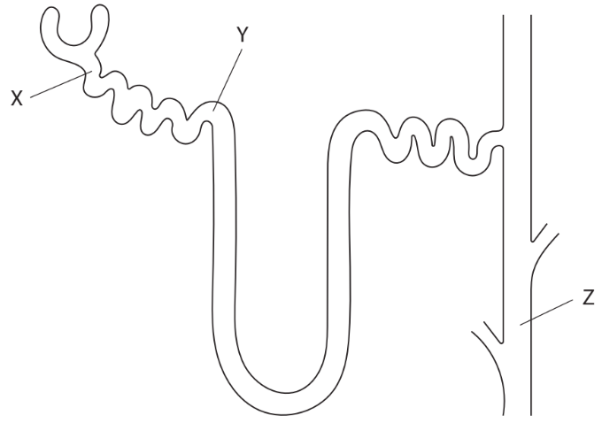
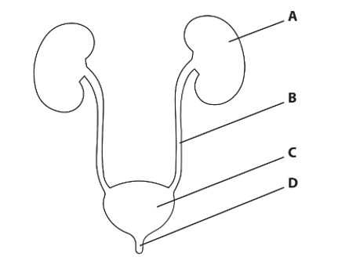
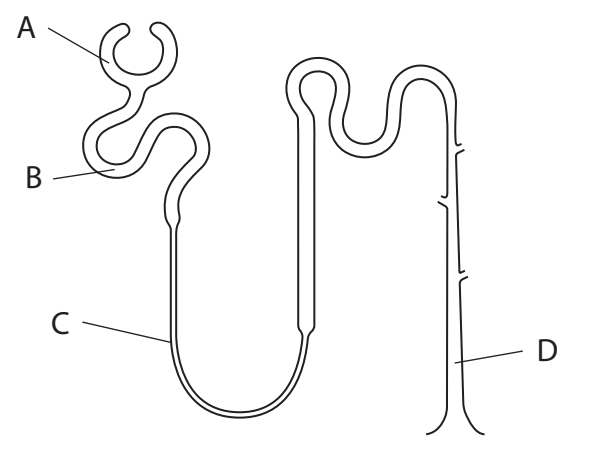
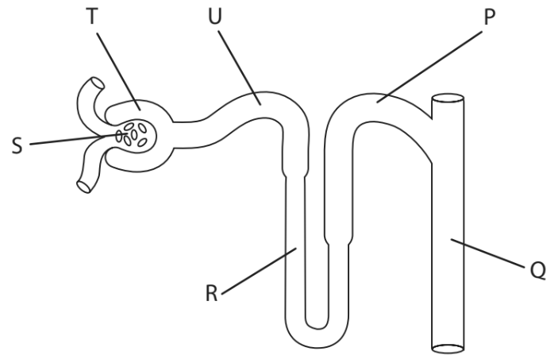
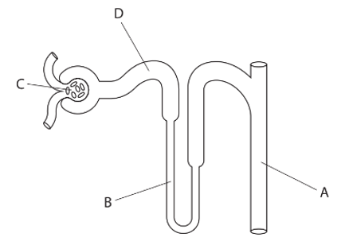

# Exam Questions — Excretion
**3. Structure & Functions in Living Organisms: Part 2** · Edexcel IGCSE Biology (Modular) (4XBI1) — 24/Unit 2
> Source: [https://www.savemyexams.com/igcse/biology/edexcel/modular/24/unit-2/topic-questions/structure-and-functions-in-living-organisms-part-2/excretion/exam-questions/](https://www.savemyexams.com/igcse/biology/edexcel/modular/24/unit-2/topic-questions/structure-and-functions-in-living-organisms-part-2/excretion/exam-questions/) · 10 questions · total 99 marks

## Q1 — easy — 10 marks · exam-questions

### 1() — 6 marks — command: multiple — structured
All living things carry out eight 'life processes', one of which is excretion.

(i) Give a definition of the term **excretion**.

**(1)**

(ii) State **five** **other **life processes.

**(5)**

### 2() — 1 mark — command: state — structured
A substance that is excreted by plants is oxygen.

State the source of this excreted oxygen.

### 3() — 3 marks — command: complete — structured
Complete the table below using either a **✓ **or a ✗ to indicate whether or not the plant processes described are examples of excretion

| **Process** | **Excretion ✓ or **✗ |
|---|---|
| Water is drawn up from the roots of the plant and is lost through the leaves |   |
| Carbon dioxide is released from respiring cells |   |
| Dead leaves fall off deciduous plants during the autumn |   |

## Q2 — easy — 8 marks · exam-questions

### 1() — 2 marks — command: name — structured
The diagram shows some human excretory organs.

Name organ **X** and organ **Z **shown in the diagram.

### 2() — 2 marks — command: suggest — structured
One waste product that is excreted from the human body is urea.

Urea is made from excess proteins that can't be stored in the body.

Excess carbohydrates and lipids do not need to be excreted,

Suggest why excess carbohydrates and lipids do not need to be excreted.

### 3() — 2 marks — command: explain — structured
Carbon dioxide is one of the substances that is excreted by the body.

Explain the importance of excreting carbon dioxide.

### 4() — 2 marks — command: explain — structured
Another organ of excretion is the skin.

Explain how the skin is able to carry out excretion.

## Q3 — easy — 9 marks · exam-questions

### 1() — 2 marks — command: multiple — structured
#### Separate: Biology Only

The diagram shows some glands of the endocrine system.

(i) Give the letter on the diagram that shows the gland that released the hormone ADH.

**(1)**

| **A** | W |
|---|---|
| **B** | X |
| **C** | Y |
| **D** | Z |

(ii) State the name of the gland identified in part (i) that released ADH.

**(1)**

### 2() — 1 mark — command: name — structured
#### Separate: Biology Only

ADH helps with a process called osmoregulation which involves regulating the quantity of water in the blood.

ADH travels in the blood to the nephron in the kidney.

Name the part of the nephron that is affected by ADH.

### 3() — 3 marks — command: complete — structured
#### Separate: Biology Only

Complete the sentences.

Choose answers from the box.

| less ADH          less          glucose         urine          more         more ADH |
|---|

The concentration of ............... is controlled by a hormone called anti-diuretic hormone.

If the blood water content is too high, ............... is released, so ............... water is reabsorbed in the kidney.

If the blood water content is too low, ............... is released, so ...............water is reabsorbed in the kidney.

### 4() — 3 marks — command: multiple — structured
#### Separate: Biology Only

Osmoregulation is an essential part of homeostasis.

(i) Give a definition of the term **homeostasis**.

**(1)**

(ii) Explain the consequences of having too much water in the blood.

**(2)**

## Q4 — easy — 9 marks · exam-questions

### 1() — 3 marks — command: multiple — structured
#### Separate: Biology Only

The diagram shows the structure of a nephron in the kidneys.

(i) Identify structure **1** in the diagram.

**(1)**

(ii) Describe the process taking place at structure **1**.

**(2)**

### 2() — 2 marks — command: state — structured
#### Separate: Biology Only

The fluid moving along structure **2** of the nephron in the diagram in part (a) is known as filtrate and it contains several substances.

State **two** substances that will form part of the filtrate in structure **2**.

### 3() — 1 mark — command: identify — structured
#### Separate: Biology Only

Water is reabsorbed from the filtrate back into the blood at various points along the nephron, such as structure **3** in the diagram in part (a).

Identify structure **3** in the diagram.

### 4() — 3 marks — command: complete — structured
#### Separate: Biology Only

Structure **5** represents the collecting duct, which can adjust the amount of water reabsorbed into the blood depending on the needs of the body.

Complete the following sentences about the role of the collecting duct.

On a hot, sunny day the body will ............... more water due to sweating.

In order to conserve water the collecting duct will reabsorb ............... water into the blood.

This results in the excretion of ............... urine that is more concentrated.

## Q5 — medium — 11 marks · exam-questions

### 5((a)) — 3 marks — command: explain — structured — from paper Jan 2022 · 4BI1/2B
#### Separate: Biology Only

The diagram shows a nephron from a kidney with three different areas, X, Y and Z.

The table gives the concentration of glucose and urea at X, Y and Z.

| **Area of nephron** | **Concentration of glucose in mg per 100 cm****3** | **Concentration of urea in mg per 100 cm****3** |
|---|---|---|
| X | 90 | 32 |
| Y | 0 | 440 |
| Z | 0 | 1700 |

Explain the difference in concentration of glucose between X and Y.

### 5((b)) — 4 marks — command: multiple — structured — from paper Jan 2022 · 4BI1/2B
#### Separate: Biology Only

(i) Calculate how many times more concentrated the urea is in area Z compared to area Y.

Give your answer to two significant figures.

**(2)**

(ii) Explain the difference in urea concentration in the filtrate found in Y and Z.

**(2)**

### 5((c)) — 4 marks — command: multiple — structured — from paper Jan 2022 · 4BI1/2B
#### Separate: Biology Only

High blood pressure during pregnancy can result in the production of urine that contains protein.

(i) Describe how a sample of urine could be tested to see if it contains protein.

**(2)**

(ii) Protein is not normally found in urine.

Suggest why high blood pressure could cause protein to be present in urine.

**(2)**

## Q6 — medium — 9 marks · exam-questions

### 2((a)) — 1 mark — command: which — structured — from paper Jan 2021 · 4BI1/2B
#### Separate: Biology Only

The urinary system is used in excretion.

The diagram shows the urinary system with parts labelled A, B, C and D.

(i) Which part of the urinary system contains nephrons?

| **A** |
|---|
| **B** |
| **C** |
| **D** |

### 2((b)) — 1 mark — command: name — structured — from paper Jan 2021 · 4BI1/2B
The urinary system produces urine.

Name a substance found in urine.

### 2((c)) — 7 marks — command: multiple — structured — from paper Jan 2021 · 4BI1/2B
#### Separate: Biology Only

A scientist uses this method to investigate the effect of drinking different liquids on urine production.

- Drink 600 cm3 of water in the morning
- Measure the volume of urine produced during the next two hours
- Drink 600 cm3 of 0.8 % salt (NaCl) solution at the same time the following morning
- Measure the volume of urine produced during the next two hours

The table shows the scientist’s results.

| **Liquid** | **Volume of urine produced during two hours in cm****3** |
|---|---|
| Water | 560 |
| Salt solution | 254 |

(i) Explain the scientist’s results.

**(5)**

(ii) Give **two** other factors that affect the volume of urine produced.

**(2)**

## Q7 — medium — 11 marks · exam-questions

### 3((a)) — 1 mark — command: which — structured — from paper Nov 2021 · 4BI1/2B
#### Separate: Biology Only

The kidney contains nephrons involved in osmoregulation and excretion.

The diagram shows a nephron.

Which part is the Bowman’s capsule?

| **A** |
|---|
| **B** |
| **C** |
| **D** |

### 3((b)) — 6 marks — command: multiple — structured — from paper Nov 2021 · 4BI1/2B
#### Separate: Biology Only

The table gives the mass of three substances transported in part A and in part D for all kidney nephrons during one day.

| **Substance** | **Mass of substance in g** |   |
|---|---|---|
| **Part A** | **Part D** |   |
| Glucose | 180 | 0 |
| Water | 180 000 | 1500 |
| Urea | 53 | 25 |

(i) Explain the change in the mass of glucose from part A to part D.

**(3)**

(ii) Calculate the percentage reabsorption of water by kidney nephrons.

**(2)**

(iii) A substance containing nitrogen is broken down in the liver to produce urea.

Which substance is broken down to produce urea?

**(1)**

| **A** | Fat |
|---|---|
| **B** | Glucose |
| **C** | Protein |
| **D** | Water |

### 3((c)) — 4 marks — command: explain — structured — from paper Nov 2021 · 4BI1/2B
#### Separate: Biology Only

A drug called MDMA increases the secretion of ADH.

Explain how this increase affects urine production.

## Q8 — hard — 13 marks · exam-questions

### 2((a)) — 3 marks — command: multiple — structured — from paper Jan 2022 · 4BI1/2BR
#### Separate: Biology Only

The diagram shows a nephron from a human kidney.

(i) From which structure does ultrafiltration take place?

**(1)**

| **A** | P |
|---|---|
| **B** | Q |
| **C** | R |
| **D** | S |

(ii) From which structure is glucose reabsorbed?

**(1)**

| **A** | Q |
|---|---|
| **B** | R |
| **C** | S |
| **D** | U |

(iii) Which structure is the loop of Henle?

**(1)**

| **A** | P |
|---|---|
| **B** | R |
| **C** | S |
| **D** | U |

### 2((b)) — 10 marks — command: multiple — structured — from paper Jan 2022 · 4BI1/2BR
#### Separate: Biology Only

The table gives the mean values of mass filtered per day and excreted per day for different plasma components that are filtered and reabsorbed in the nephron.

| **Plasma component** | **Mass filtered per day in g** | **Mass excreted per day in g** | **Percentage reabsorbed** |
|---|---|---|---|
| Water | 180 000 | 1800 | 99.0 |
| Sodium | 630 | 3.0 | 99.5 |
| Glucose | 180 | 0 | 100.0 |
| Urea | 54 |   | 44.0 |

(i) State what is meant by plasma components.

**(1)**

(ii) Calculate the mean mass of urea excreted per day.

Give your answer in g.

**(2)**

(iii) Explain why glucose is reabsorbed in the nephron.

**(2)**

(iv) The concentration of urine is determined by the volume of water present and the mass of dissolved substances.

A person eats a meal with a high protein and salt content and drinks a small volume of water.

Comment on how this may change the values in the table and the effect it will have on urine production.

**(5)**

## Q9 — hard — 11 marks · exam-questions

### 6((a)) — 2 marks — command: which — structured — from paper June 2021 · 4BI1/2B
#### Separate: Biology Only

The diagram shows a nephron of a kidney, with some of the structures labelled.

(i)  From which structure are substances forced out of the blood by ultrafiltration?

**(1)**

| **A** |
|---|
| **B** |
| **C** |
| **D** |

(ii) From which structure is glucose reabsorbed into the blood by selective reabsorption?

**(1)**

| **A** |
|---|
| **B** |
| **C** |
| **D** |

### 6((b)) — 2 marks — command: state — structured — from paper June 2021 · 4BI1/2B
#### Separate: Biology Only

In homeostasis, the kidney is involved in the control of blood concentration.

(i) State the name for the control of blood concentration.

**(1)**

(ii) Another function carried out by the kidney is excretion.

State what is meant by the term excretion.

**(1)**

### 6((c)) — 4 marks — command: explain — structured — from paper June 2021 · 4BI1/2B
#### Separate: Biology Only

Diabetes insipidus is a medical condition in which the body is unable to produce ADH.

Explain how diabetes insipidus affects the control of blood concentration.

### 6((d)) — 3 marks — command: multiple — structured — from paper June 2021 · 4BI1/2B
#### Separate: Biology Only

Desmopressin is a drug used to reduce the symptoms of diabetes insipidus.

(i) Suggest what effect the drug would have on the nephron.

**(1)**

(ii) Describe the effects the drug would have on urine production.

**(2)**

## Q10 — hard — 8 marks · exam-questions

### 7((a)) — 2 marks — command: calculate — structured — from paper Jan 2021 · 4BI1/2BR
#### Separate: Biology Only

The human kidney is an organ that is able to process excretory products from human metabolism.

Concentration of urine is calculated using this formula.

$\mathrm{concentration} \mathrm{in} \mathrm{milliosmoles} \mathrm{per} \mathrm{dm}^{3}=\frac{\mathrm{amount} \mathrm{of} \mathrm{waste} \mathrm{in} \mathrm{milliosmoles}}{\mathrm{volume} \mathrm{in} \mathrm{dm}^{3}}$

The amount of waste the kidneys produce per day is 600 milliosmoles.

The maximum concentration that the human kidneys can produce is 1400 milliosmoles per dm3.

Calculate the minimum volume of urine that must be produced each day.

Give your answer in cm3.

### 7((b)) — 1 mark — command: name — structured — from paper Jan 2021 · 4BI1/2BR
Name another organ that carries out excretion in the human body.

### 7((c)) — 5 marks — command: explain — structured — from paper Jan 2021 · 4BI1/2BR
#### Separate: Biology Only

Explain the role of the nephron in osmoregulation.
