# Exam Questions — Transport Systems
**3. Structure & Functions in Living Organisms: Part 2** · Edexcel IGCSE Biology (Modular) (4XBI1) — 24/Unit 2
> Source: [https://www.savemyexams.com/igcse/biology/edexcel/modular/24/unit-2/topic-questions/structure-and-functions-in-living-organisms-part-2/transport-systems/exam-questions/](https://www.savemyexams.com/igcse/biology/edexcel/modular/24/unit-2/topic-questions/structure-and-functions-in-living-organisms-part-2/transport-systems/exam-questions/) · 16 questions · total 185 marks

## Q1 — easy — 6 marks · exam-questions

### 3((a)) — 1 mark — command: identify — structured — from paper Nov 2020 · 4BI1/2BR
Plant roots absorb water from soil.

This water is transported to the leaves and then moves into the air.

Identify which of these processes is used to absorb water from the soil.

| **A** | Active transport |
|---|---|
| **B** | Diffusion |
| **C** | Evaporation |
| **D** | Osmosis |

### 3((b)) — 1 mark — command: name — structured — from paper Nov 2020 · 4BI1/2BR
Name the tissue that transports water to the leaves.

### 3((c)) — 1 mark — command: name — structured — from paper Nov 2020 · 4BI1/2BR
#### Separate: Biology Only

Name the process that moves water vapour into the air.

### 3((d)) — 1 mark — command: identify — structured — from paper Nov 2020 · 4BI1/2BR
#### Separate: Biology Only

Identify which of these reduces the movement of water from the leaves into the air.

| **A** | High light intensity |
|---|---|
| **B** | Low air humidity |
| **C** | Low air temperature |
| **D** | Windy conditions |

### 3((e)) — 2 marks — command: give — structured — from paper Nov 2020 · 4BI1/2BR
Give two uses of water in a plant.

## Q2 — easy — 12 marks · exam-questions

### 1() — 3 marks — command: multiple — structured
#### Separate: Biology Only

Plant root hair cells absorb water from the soil by osmosis.

(i) Explain how the structure of a root hair cell is adapted to absorb water.

**(2)**

(ii) Give one difference between osmosis and diffusion.

**(1)**

### 3((b)) — 5 marks — command: multiple — structured — from paper June 2021 · 4BI1/2B
#### Separate: Biology Only

A student investigates the effect of light on the volume of water taken up and lost by a plant shoot in one hour.

The table shows the student’s results.

|   | **Volume of water in cm****3** |   |
|---|---|---|
| **taken up** | **lost** |   |
| **Dark** | 2.0 | 1.6 |
| **Light** | 10.2 | 9.1 |

(i) Explain these results.

**(3)**

(ii) Give two abiotic variables the student should control.

**(2)**

### 3((c)) — 4 marks — command: multiple — structured — from paper June 2021 · 4BI1/2B
#### Separate: Biology Only

Another student uses this apparatus and a stop clock to find the mean (average) rate of water taken up by a plant shoot.

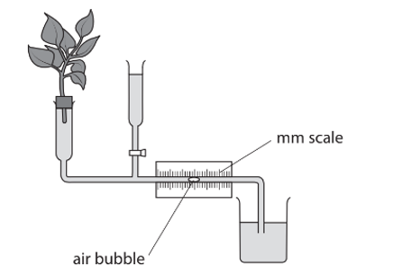

(i) Name the apparatus used by the student.

**(1)**

(ii) Describe how the student could use this apparatus to find the mean rate of water taken up by the plant.

**(3)**

## Q3 — medium — 12 marks · exam-questions

### 3((a)) — 2 marks — command: identify — structured — from paper Jan 2022 · 4BI1/2B
#### Separate: Biology Only

The diagram shows a cross‐section through a leaf.

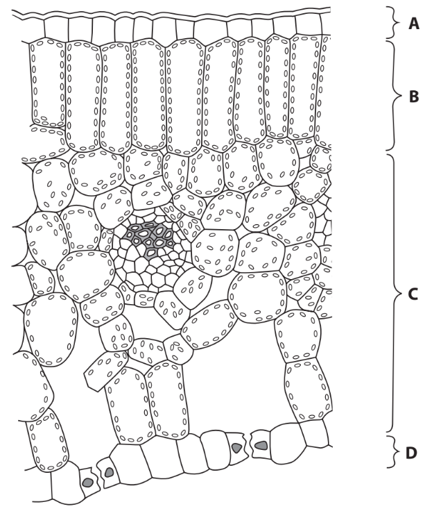

(i) Identify which layer contains palisade mesophyll cells.

**(1)**

| **A** | Layer **A** |
|---|---|
| **B** | Layer **B** |
| **C** | Layer **C** |
| **D** | Layer **D** |

(ii) Identify which set of environmental conditions would produce the fastest rate of transpiration from this leaf.

**(1)**

|   | **Humidity** | **Temperature** |
|---|---|---|
| **A** | High | High |
| **B** | High | Low |
| **C** | Low | High |
| **D** | Low | Low |

### 3((b)) — 10 marks — command: multiple — structured — from paper Jan 2022 · 4BI1/2B
#### Separate: Biology Only

Scientists investigate the effect of changing carbon dioxide concentration on the density of stomata of wheat plants.

They grow wheat plants from seed in different concentrations of carbon dioxide.

After three weeks, they take a leaf from each plant and calculate the mean density of stomata.

(i) State the independent variable in this investigation.

**(1)**

(ii) Give two abiotic variables that the scientists could control.

**(2)**

(iii) To calculate the mean density of stomata, leaf sections are viewed with a microscope.

The number of stomata within six circular areas of the leaf are counted.

The results for one leaf are shown in the table.

| **Leaf area number** | **Per number of stomata** |
|---|---|
| 1 | 68 |
| 2 | 72 |
| 3 | 66 |
| 4 | 75 |
| 5 | 76 |
| 6 | 63 |

The radius of each circular area is 0.40 mm.

area of circle = πr2

[π = 3.14]

Calculate the mean density of stomata on the leaf surface. Give your answer in stomata per mm2.

**(3)**

(iv) The investigation shows that in increased carbon dioxide concentrations there is a lower mean density of stomata.

The scientist concludes that in hot dry areas, with increased carbon dioxide concentrations, it would be an advantage for wheat to have a lower mean density of stomata.

Discuss the scientist’s conclusion.

**(4)**

## Q4 — medium — 10 marks · exam-questions

### 6((a)) — 6 marks — command: explain — structured — from paper Nov 2020 · 4BI1/2B
#### Separate: Biology Only

The diagram shows the path that the water takes when it is absorbed from the soil into the xylem of a plant.

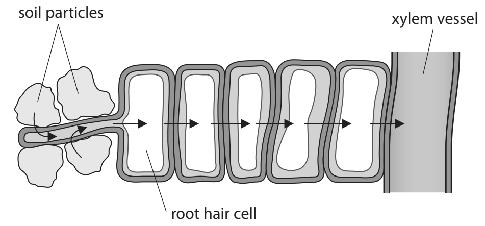

(i) Explain how root hair cells are adapted for efficient absorption of water.

**(2)**

(ii) Explain how water is transported from the soil to the leaves.

**(4)**

### 6((b)) — 4 marks — command: describe — structured — from paper Nov 2020 · 4BI1/2B
#### Separate: Biology Only

Describe how you could determine the rate of water loss from a leafy shoot.

## Q5 — medium — 12 marks · exam-questions

### 3((a)) — 4 marks — command: give — structured — from paper Jan 2022 · 4BI1/2BR
The diagram shows a magnified image of a root hair cell from a young plant.

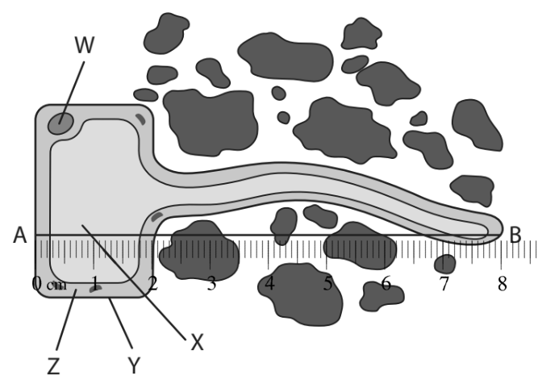

Give the names of structures labelled **W**, **X**, **Y** and **Z**.

### 3((b)) — 2 marks — command: calculate — structured — from paper Jan 2022 · 4BI1/2BR
The actual length of the cell, along the line between A and B, is 1000 μm.

Calculate the magnification of this drawing.

### 3((c)) — 6 marks — command: explain — structured — from paper Jan 2022 · 4BI1/2BR
#### Separate: Biology Only

(i) Explain the role of the root hair cell in absorption of water from the soil.

**(3)**

(ii) Sometimes gardeners give their plants too much water. The water fills up the air spaces in the soil around the plant roots. Explain how this can lead to plants failing to grow properly.

**(3)**

## Q6 — medium — 7 marks · exam-questions

### 2((a)) — 2 marks — command: give — structured — from paper June 2021 · 4BI1/2B
*P. multocida* is a bacterium that causes cholera in chickens.

The diagram shows the bacterium.

Give **two** structures in this bacterium that are also found in all eukaryotic cells.

### 2((b)) — 5 marks — command: multiple — structured — from paper June 2021 · 4BI1/2B
#### Separate: Biology Only

Scientists investigated the survival of chickens injected with normal *P. multocida* or with weakened *P. multocida*.

The table shows the scientists’ results.

| **Type of injection** | **Result** |
|---|---|
| normal *P. multocida* | chickens die |
| weakened *P. multocida* | chickens stay alive |

(i) Identify which option is a correct conclusion about *P. multocida* from these results.

**(1)**

| **A** | They are decomposers |
|---|---|
| **B** | They are pathogens |
| **C** | They are microscopic |
| **D** | They are non-living |

(ii) The scientists took the living chickens that had been injected with weakened *P. multocida* and then injected them with normal *P. multocida*.

The chickens did not die, as they were now immune.

Explain why these chickens did not die.

**(4)**

## Q7 — medium — 10 marks · exam-questions

### 2((a)) — 2 marks — command: identify — structured — from paper June 2021 · 4BI1/1B
The diagram shows the human heart with four blood vessels labelled **A**, **B**, **C** and **D**.

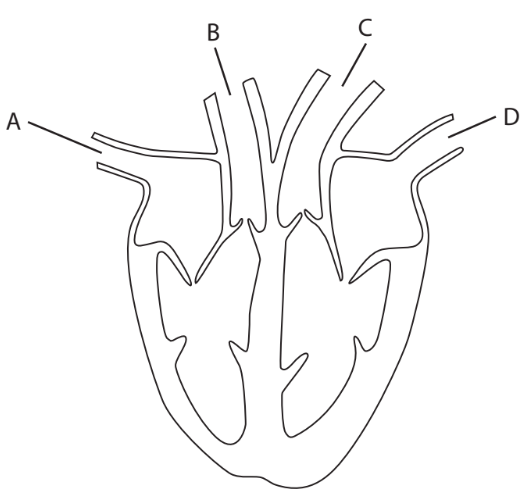

(i) Identify which blood vessel brings oxygenated blood to the heart.

**(1)**

| **A** |
|---|
| **B** |
| **C** |
| **D** |

(ii) Identify which blood vessel contains blood at the highest pressure.

**(1)**

| **A** |
|---|
| **B** |
| **C** |
| **D** |

### 2((b)) — 3 marks — command: multiple — structured — from paper June 2021 · 4BI1/1B
(i) Draw a label line on the diagram to show the position of a semi-lunar valve.

**(1)**

(ii) Describe the function of the semi-lunar valves.

**(2)**

### 2((c)) — 5 marks — command: explain — structured — from paper June 2021 · 4BI1/1B
In the heart of a foetus, the two upper chambers (atria) are linked by a hole so that blood can pass between them.

(i) Explain why this hole is normally closed before the baby is born.

**(2)**

(ii) Sometimes the hole does not close.

Explain what effect this will have on the baby.

**(3)**

## Q8 — medium — 11 marks · exam-questions

### 9((a)) — 4 marks — command: suggest — structured — from paper Jan 2021 · 4BI1/1B
Sickle cell anaemia is a condition in which some of the person’s red blood cells develop abnormally.

The diagram shows red blood cells from a healthy person and red blood cells from a person with sickle cell anaemia.

(i) A person with sickle cell anaemia often suffers pain as some of their blood vessels become blocked by the sickle cells.

Suggest why the person’s blood vessels may become blocked.

**(1)**

(ii) People with sickle cell anaemia have symptoms of tiredness and joint pain that get worse if they are exposed to cold temperatures and high altitudes.

Suggest why these symptoms get worse.

**(3)**

### 9((b)) — 3 marks — command: multiple — structured — from paper Jan 2021 · 4BI1/1B
Sickle cell anaemia is caused by a single recessive allele.

(i) State what is meant by the term **recessive**.

**(1)**

(ii) A man and a woman who are both heterozygous for the sickle cell allele have a child.

Calculate the probability that the child will be female and** not** have sickle cell anaemia.

**(2)**

### 9((c)) — 1 mark — command: identify — structured — from paper Jan 2021 · 4BI1/1B
Sickle cell anaemia is more common in countries where malaria is found. This is because having an allele for sickle cell anaemia can reduce the likelihood of developing malaria.

Identify which type of organism causes malaria.

| **A** | Bacterium |
|---|---|
| **B** | Fungus |
| **C** | Plant |
| **D** | Protoctist |

### 9((d)) — 1 mark — command: give — structured — from paper Jan 2021 · 4BI1/1B
Give the name of the pigment found in red blood cells.

| **A** | chlorophyll |
|---|---|
| **B** | haemoglobin |
| **C** | iron |
| **D** | magnesium |

### 9((e)) — 2 marks — command: give — structured — from paper Jan 2021 · 4BI1/1B
Give two differences in structure between red blood cells and white blood cells.

## Q9 — medium — 18 marks · exam-questions

### 1((a)) — 1 mark — command: suggest — structured — from paper Nov 2021 · 4BI1/2B
Read the passage below. Use the information in the passage and your own knowledge to answer the questions that follow.

Suggest why cardiomyopathy can cause heart failure (lines 6 to 7).

### 1((b)) — 3 marks — command: describe — structured — from paper Nov 2021 · 4BI1/2B
During the transplant procedure the patient’s heart is removed, leaving behind a section of the right and left atria.

Describe the functions of the atria in the body.

### 1((c)) — 2 marks — command: describe — structured — from paper Nov 2021 · 4BI1/2B
Describe how the blood in the pulmonary artery differs from the blood in the aorta.

### 1((d)) — 3 marks — command: explain — structured — from paper Nov 2021 · 4BI1/2B
Explain the function of the heart-lung bypass machine (lines 11 to 12).

### 1((e)) — 2 marks — command: explain — structured — from paper Nov 2021 · 4BI1/2B
Explain why the patient needs to be given immunosuppressants (lines 19 to 20).

### 1((f)) — 2 marks — command: explain — structured — from paper Nov 2021 · 4BI1/2B
Explain why patients should not smoke after their heart transplant (lines 28 to 29).

### 1((g)) — 1 mark — command: state — structured — from paper Nov 2021 · 4BI1/2B
State what is meant by the term **balanced diet.**

### 1((h)) — 2 marks — command: calculate — structured — from paper Nov 2021 · 4BI1/2B
Calculate the number of patients in the United Kingdom who have a heart transplant in one year that are still alive five years later (lines 2 to 3 and lines 35 to 36).

### 1((i)) — 1 mark — command: suggest — structured — from paper Nov 2021 · 4BI1/2B
Suggest why patients are advised to avoid strenuous activities after their heart transplant (line 24).

### 1((j)) — 1 mark — command: suggest — structured — from paper Nov 2021 · 4BI1/2B
Suggest why patients are more likely to be at risk of food poisoning after their heart transplant (lines 32 to 33).

## Q10 — medium — 12 marks · exam-questions

### 9((a)) — 2 marks — command: complete — structured — from paper Jan 2021 · 4BI1/1BR
Aerobic respiration uses oxygen and produces ATP.

Complete the word equation for aerobic respiration.

oxygen + .......................... → .......................... + .......................... + ATP

### 9((b)) — 3 marks — command: explain — structured — from paper Jan 2021 · 4BI1/1BR
A scientist investigates the rates of aerobic respiration of some animals.

The scientist calculates the rate of respiration per gram of each animal.

The results are shown in the table.

| **Animal** | **Rate of aerobic respiration per gram of animal in arbitrary units** |
|---|---|
| Frog | 150 |
| Human | 200 |
| Mouse | 1500 |

Explain why a mouse uses more oxygen per gram than a human.

### 9((c)) — 7 marks — command: multiple — structured — from paper Jan 2021 · 4BI1/1BR
The structure of a frog heart is different from the structure of a human heart.

The diagram shows a section of a frog heart with arrows showing the direction of blood flow.

(i)  Name the blood vessel labelled X.

**(1)**

| **A** | aorta |
|---|---|
| **B** | pulmonary artery |
| **C** | pulmonary vein |
| **D** | vena cava |

(ii) Give one difference between the structure of the frog heart and a human heart.

**(1)**

(iii) Humans can run for long periods of time. Frogs can only move for short periods of time.

Explain how the structure of the heart of a frog means that it is unable to move for long periods of time.

**(5)**

## Q11 — hard — 6 marks · exam-questions

### 2((a)) — 2 marks — command: multiple — structured — from paper Nov 2021 · 4BI1/1B
Human blood contains red blood cells and white blood cells.

The table shows the number of these blood cells in a sample of blood.

| **Type of cell** | **Number of cells per mm****3** | **Number of cells per mm****3 ****in standard form** |
|---|---|---|
| Red blood cell | 5 000 000 | 5.0 × 106 |
| White blood cell | 6000 |   |

(i) Complete the table to give the number of white blood cells per mm3 in standard form.

**(1)**

(ii) Calculate the number of red blood cells in 1000 cm3 of this person's blood?

**(1)**

| **A** | 5.0 × 106 |
|---|---|
| **B** | 5.0 × 109 |
| **C** | 5.0 × 1011 |
| **D** | 5.0 × 1012 |

### 2((b)) — 4 marks — command: explain — structured — from paper Nov 2021 · 4BI1/1B
The table gives names, descriptions and symptoms of two blood conditions.

| **Name of condition** | **Description** | **Symptom** |
|---|---|---|
| Anaemia | Low red blood cell count | Often tired |
| Leukopenia | Low white blood cell count | Likely to get infections |

(i) Explain why a person with anaemia is often tired.

**(2)**

(ii) Explain why a person with leukopenia is more likely to get an infection.

**(2)**

## Q12 — hard — 15 marks · exam-questions

### 6((a)) — 1 mark — command: state — structured — from paper Nov 2021 · 4BI1/1B
Cholesterol is needed in the diet for making cell membranes.

State the role of the cell membrane.

### 6((b)) — 2 marks — command: calculate — structured — from paper Nov 2021 · 4BI1/1B
Too much cholesterol is a health risk because fatty deposits build up in arteries.

The lumen of an artery had a diameter of 4.0 mm before the build-up of a fatty deposit.

The fatty deposit covers 45 % of the original area of the lumen.

Calculate the area in mm2 of the lumen that is available for blood flow.

[area of the lumen = πr2]

[π = 3.14]

### 6((c)) — 8 marks — command: multiple — structured — from paper Nov 2021 · 4BI1/1B
A scientist tests the blood cholesterol concentration in a sample of men between 25 and 34 years old.

The scientist groups the men in ranges of blood cholesterol concentration and counts the number of men in each range.

The table gives the scientist’s results.

| **Range of blood cholesterol concentration in mg per cm****3** | **Number of men in each range** |
|---|---|
| 80 to 119 | 13 |
| 120 to 159 | 150 |
| 160 to 199 | 442 |
| 200 to 239 | 299 |
| 240 to 279 | 115 |
| 280 to 319 | 34 |
| 320 to 359 | 9 |
| 360 to 399 | 5 |

(i) Plot a suitable graph on the grid to show these results.

**(5)**

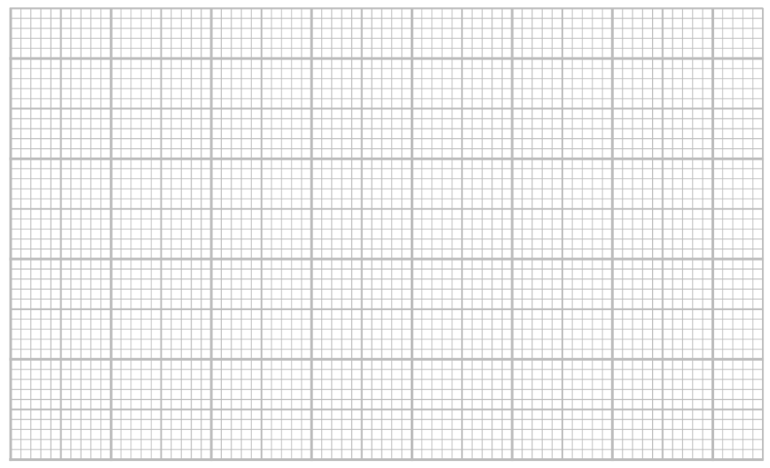

(ii) Identify which range of blood cholesterol levels is the mode for this sample?

**(1)**

| **A** | 80 to 119 |
|---|---|
| **B** | 80 to 379 |
| **C** | 160 to 199 |
| **D** | 360 to 399 |

(iii) A blood cholesterol level greater than 239 mg per 100 cm3 means a person has a higher risk of heart disease.

Calculate the percentage of men in the sample at a higher risk of heart disease.

**(2)**

### 6((d)) — 4 marks — command: discuss — structured — from paper Nov 2021 · 4BI1/1B
Statins are drugs that reduce blood cholesterol levels.

A scientist investigates the use of one type of statin on the risk of having a heart attack.

He gives the statin to one group of people and gives a control substance to another group of people.

He calculates the percentage of people in each group that has a heart attack during the next four years.

The table gives the scientist’s results.

| **Group** | **Percentage (%) having** **heart attacks** |
|---|---|
| Statin | 2.2 |
| Control substance | 3.8 |

A conclusion from this data is that statins reduce the risk of heart attacks.

Discuss this conclusion.

## Q13 — hard — 12 marks · exam-questions

### 3((a)) — 7 marks — command: multiple — structured — from paper Jan 2021 · 4BI1/1B
The diagram shows the human circulation system with some blood vessels labelled A to J. The arrows show the direction of blood flow.

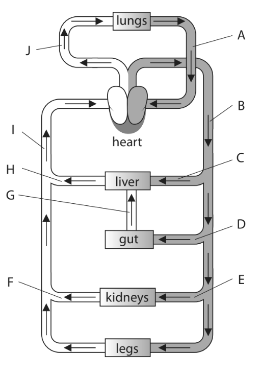

The table gives some statements about the content of blood vessels in this circulation system.

(i) Complete the table by giving the letter of the blood vessel that matches each statement.

**(5)**

| **Statement** | **Letter** |
|---|---|
| Contains the least carbon dioxide |   |
| Contains the most glucose after a meal |   |
| Contains the least oxygen |   |
| Contains the least urea |   |
| Contains blood at the highest pressure |   |

(ii) State two ways in which the structure of blood vessel A differs from the structure of blood vessel J.

**(2)**

### 3((b)) — 5 marks — command: discuss — structured — from paper Jan 2021 · 4BI1/1B
Muscles in the legs contain capillaries.

A scientist investigates how long-term training affects the number of capillaries in an athlete’s leg muscles.

The scientist determines the mean number of capillaries per mm2 in samples of leg muscle from the athlete before and after a period of training.

The table shows the scientist’s results.

| **Muscle sample** | **Mean number of capillaries per mm****2** |
|---|---|
| Before training | 313 |
| After training | 349 |

The scientist concludes that training improves the athletic performance.

Discuss this conclusion.

## Q14 — hard — 14 marks · exam-questions

### 1((a)) — 1 mark — command: name — structured — from paper Jan 2022 · 4BI1/2B
Read the passage below. Use the information in the passage and your own knowledge to answer the questions that follow.

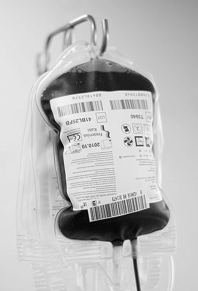

César Astudillo from Collado Villalba, Spain, CC BY 2.0 <https://creativecommons.org/licenses/by/2.0>, via Wikimedia Commons. Image cropped and colour removed.

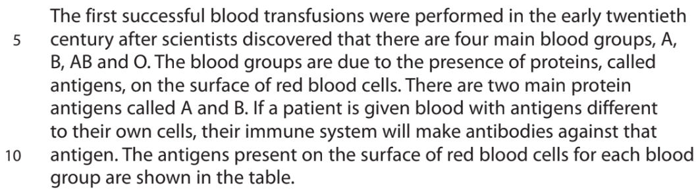

| **Blood group** | **Antigens present** |
|---|---|
| A | A |
| B | B |
| AB | A and B |
| O | Neither A nor B |

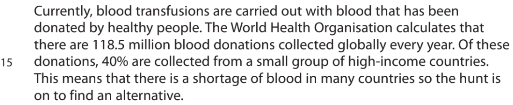

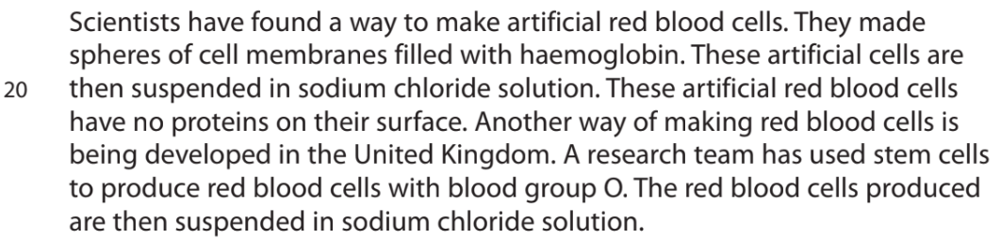

Name the type of cell that produces antibodies. (Lines 8 and 9)

### 1((b)) — 2 marks — command: multiple — structured — from paper Jan 2022 · 4BI1/2B
#### Separate: Biology Only

Human blood groups are controlled by three alleles, IA, IB and IO. 
The IA and IB alleles are codominant and the IO allele is recessive

(i) State what is meant by the term **codominant**.

**(1)**

(ii) Two parents have genotypes of IAIO and IBIO.

Identify which of these are all the possible blood groups of their children

**(1)**

| **A** | A and B |
|---|---|
| **B** | A, B and O |
| **C** | AB and O |
| **D** | A, B, AB and |

### 1((c)) — 2 marks — command: calculate — structured — from paper Jan 2022 · 4BI1/2B
Calculate the number of blood donations collected per year from the high‐income countries. (Lines 14 and 15)

Give your answer in standard form.

### 1((d)) — 3 marks — command: explain — structured — from paper Jan 2022 · 4BI1/2B
Some scientists have suggested that spherical artificial red blood cells transport oxygen less efficiently than normal human red blood cells.

Explain why the shape of the artificial red blood cells reduces the efficiency of oxygen transport compared to normal human red blood cells. (Lines 18 and 19)

### 1((e)) — 1 mark — command: suggest — structured — from paper Jan 2022 · 4BI1/2B
#### Separate: Biology Only

Suggest why artificial blood does not clot when stored. (Lines 26 and 27)

### 1((f)) — 2 marks — command: explain — structured — from paper Jan 2022 · 4BI1/2B
Explain why the artificial red blood cells are suspended in sodium chloride solution instead of in water. (Line 20)

### 1((g)) — 1 mark — command: multiple — structured — from paper Jan 2022 · 4BI1/2B
#### Separate: Biology Only

(i) Explain why stem cells can be used to make large quantities of red blood cells. (Lines 22 and 23)

**(2)**

(ii) Suggest why the scientists made red blood cells with blood group O. (Lines 22 and 23)

**(2)**

### 1((h)) — 2 marks — command: give — structured — from paper Jan 2022 · 4BI1/2B
Give two substances found in blood plasma that are not present in the artificial blood. (Lines 28 and 29)

## Q15 — hard — 17 marks · exam-questions

### 1((a)) — 1 mark — command: identify — structured — from paper Nov 2020 · 4BI1/2B
#### Separate: Biology Only

Read the passage below. Use the information in the passage and your own knowledge to answer the questions that follow.

**Schistosomiasis**

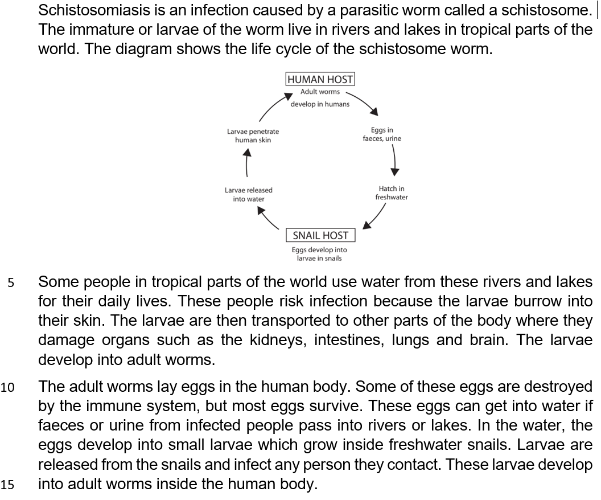

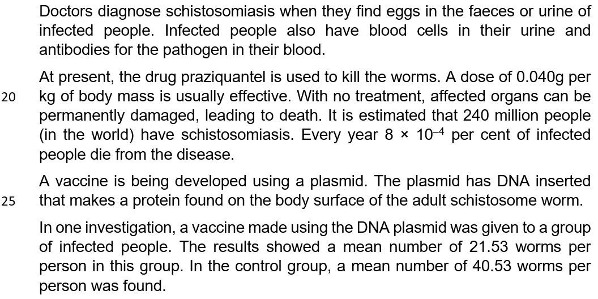

Identify which process is affected if kidneys are damaged (line 8).

| **A** | Digestion |
|---|---|
| **B** | Mutation |
| **C** | Ultrafiltration |
| **D** | Vaccination |

### 1((b)) — 3 marks — command: suggest — structured — from paper Nov 2020 · 4BI1/2B
Suggest three ways to reduce the risk of being infected by schistosomes.

### 1((c)) — 2 marks — command: name — structured — from paper Nov 2020 · 4BI1/2B
Name two different blood cells that would be found in the urine of infected people (line 17).

### 1((d)) — 1 mark — command: give — structured — from paper Nov 2020 · 4BI1/2B
An infected person has a body mass of 120 kg. Give the dose of drugs that would be effective for this person (lines 19 to 20).

| **A** | 0.04 mg |
|---|---|
| **B** | 4.8 mg |
| **C** | 40 mg |
| **D** | 4 800 mg |

### 1((e)) — 2 marks — command: calculate — structured — from paper Nov 2020 · 4BI1/2B
Using the estimated number of people in the world who have schistosomiasis (lines 21 to 22), calculate the number of people who die each year from schistosomiasis.

### 1((f)) — 1 mark — command: identify — structured — from paper Nov 2020 · 4BI1/2B
Identify which of these is the correct description of a plasmid

| **A** | A circle of DNA |
|---|---|
| **B** | A circle of mRNA |
| **C** | A circle of protein |
| **D** | A circle of tRNA |

### 1((g)) — 3 marks — command: explain — structured — from paper Nov 2020 · 4BI1/2B
#### Separate: Biology Only

Explain how a vaccine could protect people from schistosomiasis (lines 24 to 25).

### 1((h)) — 4 marks — command: multiple — structured — from paper Nov 2020 · 4BI1/2B
(i) Suggest what is given to the control group (lines 27 to 29).

**(1)**

(ii) A scientist claims that the investigation proves the vaccine is effective against schistosomiasis (lines 27 to 29).

Comment on this claim.

**(3)**

## Q16 — hard — 11 marks · exam-questions

### 2((a)) — 5 marks — command: multiple — structured — from paper Jan 2021 · 4BI1/2BR
#### Separate: Biology Only

A student investigates the rate of evaporation from a clay pot and the rate of transpiration by a plant. The clay pot is porous and has small holes that allow water to evaporate.

The student keeps the clay pot and the plant in the same conditions next to a closed window. He measures the rates at different times of the day.

The table shows the student’s results.

| **Time of day** | **Rate of evaporation from clay pot in cm****3**** per hour** | **Rate of transpiration from a plant in cm****3**** per hour** |
|---|---|---|
| 02 00 to 03 00 | 0.8 | 14 |
| 06 00 to 07 00 | 3.9 | 93 |
| 14 00 to 15 00 | 9.5 | 198 |
| 22 00 to 23 00 | 3.4 | 19 |

The student uses this apparatus to measure the rate of evaporation from the clay pot.

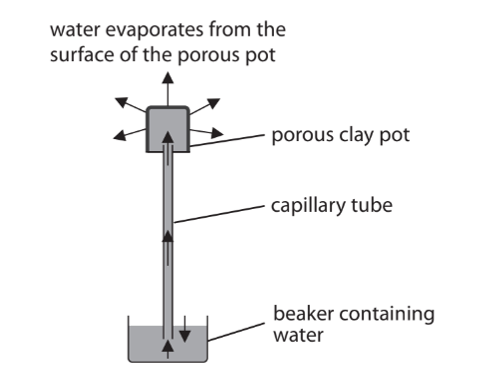

(i) Explain the changes in the rate of evaporation from the clay pot.

**(2)**

(ii) Suggest how the student could measure the rate of evaporation from the clay pot.

**(3)**

### 2((b)) — 6 marks — command: multiple — structured — from paper Jan 2021 · 4BI1/2BR
#### Separate: Biology Only

(i) Explain one factor that affects transpiration from the plant that does not affect evaporation from the clay pot.

**(2)**

(ii) Draw a labelled diagram of the apparatus the student could use to determine the rate of transpiration by a plant.

**(4)**
