# Exam Questions — Selective Breeding
**6. Use of Biological Resources** · Edexcel IGCSE Biology (Modular) (4XBI1) — 24/Unit 2
> Source: [https://www.savemyexams.com/igcse/biology/edexcel/modular/24/unit-2/topic-questions/use-of-biological-resources/selective-breeding/exam-questions/](https://www.savemyexams.com/igcse/biology/edexcel/modular/24/unit-2/topic-questions/use-of-biological-resources/selective-breeding/exam-questions/) · 9 questions · total 91 marks

## Q1 — easy — 5 marks · exam-questions

### 1() — 2 marks — command: multiple — structured
When growing millet, farmers choose seeds from high yielding plants.

(i) Complete the following sentence:

"When farmers choose seeds for plants with desirable characteristics, this is called..."

**(1)**

| **A** | Evolution |
|---|---|
| **B** | Adaptation |
| **C** | Artificial selection |
| **D** | Natural selection |

(ii) Suggest another characteristic of crop plants which may be chosen by farmers.

**(1)**

### 2() — 2 marks — command: give — structured
Farming methods such as those described in part (a) can lead to a reduced gene pool in a population.

(i) Give a definition of the term **gene pool**.

**(1)**

(ii) Give **one** reason why a reduced gene pool may have a negative affect on the population.

**(1)**

### 3() — 1 mark — command: suggest — structured
In order to increase the size of the gene pool, the farmer cross pollinates plants from two different populations of millet.

Suggest how this helps to increase the size of the gene pool.

## Q2 — easy — 6 marks · exam-questions

### 1() — 3 marks — command: describe — structured
The image shows a selectively-bred bull from the variety of beef cattle known as the Belgian blue.

Belgian blue cows are famous for being "ultra-muscular".

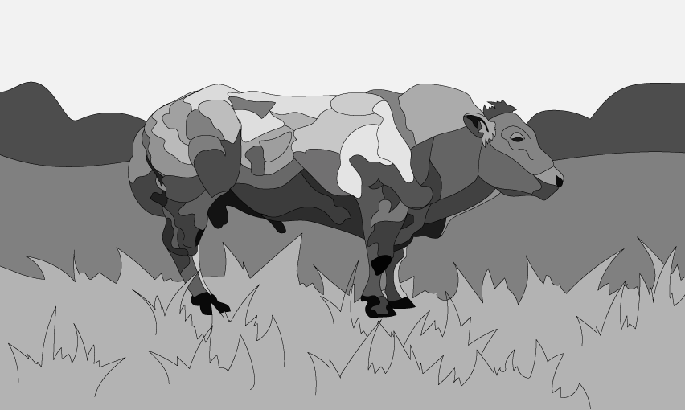

Describe how selective breeding was used to produce this bull.

### 2() — 2 marks — command: suggest — structured
Use your knowledge of selective breeding to suggest **one** benefit and **one **drawback of breeding from the bull shown in part (a).

### 3() — 1 mark — command: state — structured
The owner of the bull shown in part (a) is able to extract the bull's semen to sell to other cattle breeders. This will allow the breeder's cows to become pregnant with this bull's offspring. This practice is called artificial insemination (AI).

State **one **advantage of farmers using AI during selective breeding.

## Q3 — easy — 7 marks · exam-questions

### 1() — 1 mark — command: state — structured
A global study was carried out on the production of high protein maize.

Over 100 generations, scientists planted seeds which were the most protein rich from the previous generation, they then measured the percentage of protein in the corn kernels.

State the name given to the process used by these scientists to produce maize with a high percentage of protein.

### 2() — 3 marks — command: multiple — structured
The data collected on the percentage of protein content in the maize kernels over 100 generations can be seen below.

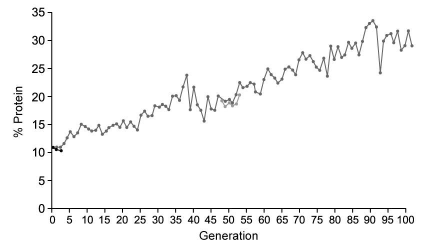

(i) Describe the trend on the graph.

**(2)**

(ii) Give the percentage of protein after 50 generations.

**(1)**

### 3() — 1 mark — command: which — structured
High protein maize is considered to be of superior nutritional value and is therefore desirable to food manufacturers.

Which of the following explains why high protein maize provides a superior nutritional value?

| **A** | Protein is required for growth and repair of tissues |
|---|---|
| **B** | Protein is an energy source |
| **C** | Protein provides roughage in a balanced diet |
| **D** | Protein provides insulation for key organs of the body |

### 4() — 2 marks — command: suggest — structured
Suggest why it may be appealing for farmers to invest in growing high protein maize.

## Q4 — medium — 18 marks · exam-questions

### 1((a)) — 1 mark — command: suggest — structured — from paper Nov 2020 · 4BI1/2BR
Read the passage below.

Use the information in the passage and your own knowledge to answer the questions that follow.

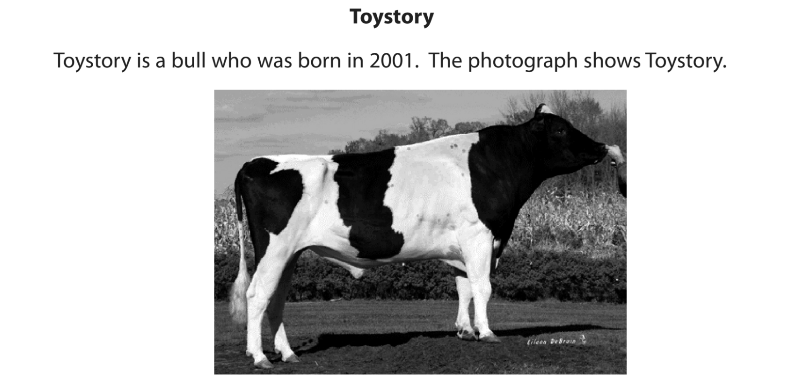

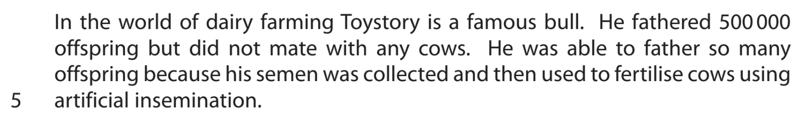

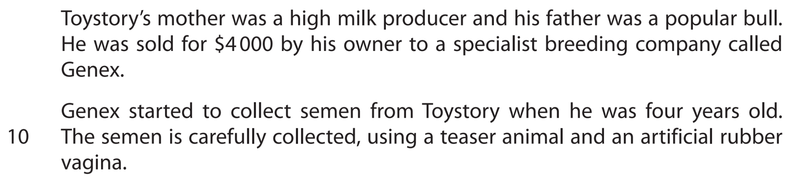

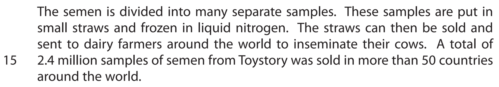

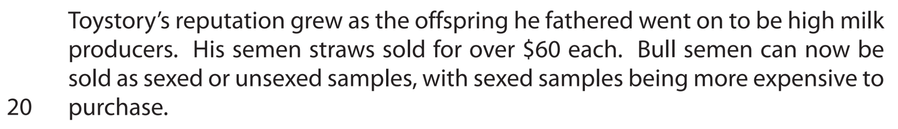

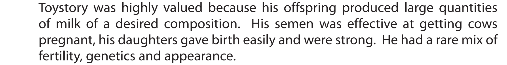

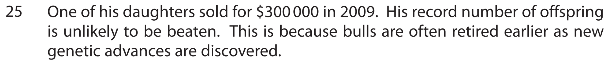

Suggest why Genex waited until Toystory was four years old before beginning to collect his semen (line 9).

### 1((b)) — 2 marks — command: explain — structured — from paper Nov 2020 · 4BI1/2BR
Explain how the semen from the bull is used to fertilise cows using artificial insemination.

### 1((c)) — 2 marks — command: suggest — structured — from paper Nov 2020 · 4BI1/2BR
(i) Suggest why the semen is stored in liquid nitrogen (line 13).

**(1)**

(ii) Sexed semen is guaranteed to produce offspring of one sex.

Suggest why dairy farmers would prefer to used sexed semen (line 19).

**(1)**

### 1((d)) — 2 marks — command: determine — structured — from paper Nov 2020 · 4BI1/2BR
Determine the percentage success of Toystory’s semen samples in producing offspring (line 2 and line 15).

### 1((e)) — 3 marks — command: describe — structured — from paper Nov 2020 · 4BI1/2BR
Describe how scientists could investigate which of two bulls is the best to use as a father in dairy farming.

### 1((f)) — 2 marks — command: explain — structured — from paper Nov 2020 · 4BI1/2BR
Explain why the composition of milk is important to consumers (line 22).

### 1((g)) — 6 marks — command: multiple — structured — from paper Nov 2020 · 4BI1/2BR
(i) Scientists are now using cloning to produce animals.

Describe the stages that are required to clone a bull.

**(4)**

(ii) Give **two** advantages of using cloning rather than selective breeding to produce offspring.

**(2)**

## Q5 — medium — 7 marks · exam-questions

### 1() — 3 marks — command: explain — structured
Selective breeding has been carried out for thousands of years. An example of this is the Dorper breed of sheep; a fast-growing sheep with a high fertility rate that is well adapted to survive in the arid regions of South Africa.  The Dorper was developed from the following two breeds:

- Dorset Horn sheep; a British breed with up to two lambing seasons per year, but not very tolerant of heat or arid conditions
- Blackhead Persian sheep; a Somalian breed with a fast growth rate and high tolerance to heat

Explain how selective breeding resulted in the development of Dorper sheep.

### 2() — 2 marks — command: suggest — structured
Suggest **two other** characteristics that breeders may select for when carrying out an artificial selection in sheep.

### 3() — 2 marks — command: describe — structured
Selective breeding can result in inbreeding which can have a negative impact on a species.

Describe the negative impact that inbreeding can have on a species.

## Q6 — medium — 15 marks · exam-questions

### 1() — 5 marks — command: explain — structured
The table shows some information about two types of potato plants.

| **Variety of potato** | **Size of potato** | **Quantity of potato** | **Rate of growth** |
|---|---|---|---|
| A | Large | Few | Slow |
| B | Small | Many | Fast |

Explain how selective breeding could be used to produce potato plants which are faster growing and produce many large potatoes.

### 2() — 3 marks — command: explain — structured
A new breeding technique has been developed which allows the production of potatoes with improved yield and quality whilst also showing a natural protection against the fungal diseases, potato blight.

Explain the benefits of breeding potato plants that are resistant to fungal diseases such as potato blight.

### 3() — 2 marks — command: describe — structured
Scientists carried out a genetic analysis on a population of potatoes of variety A and a population of variety B potato plants to establish the proportion of heterozygous genotypes in each population.

The data in the graph gives an indication of the genetic diversity of the population where the higher the heterozygosity, the higher the genetic diversity. Conversely, fewer heterozygous genotypes (and more homozygous genotypes) means there are fewer alleles in a population and therefore genetic diversity is reduced.

The graph shows the data collected for the two varieties or potato.

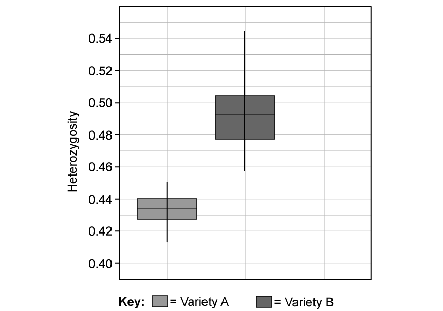

Describe what the graph shows.

### 4() — 2 marks — command: explain — structured
Explain the issues which may be associated with a lower heterozygosity demonstrated by variety A.

### 5() — 3 marks — command: suggest — structured
Suggest how breeding together individuals from varieties A and B may reduce the effects described in (d).

## Q7 — hard — 7 marks · exam-questions

### 1() — 3 marks — command: explain — structured
Explain how natural selection is different to artificial selection.

### 2() — 4 marks — command: suggest — structured
Successful methods of selective breeding used to produce good quality crops often include cross-breeding with plants from wild populations.

Suggest why it is important to maintain viable wild populations of crop plant species for these cross-breeding purposes.

## Q8 — hard — 17 marks · exam-questions

### 1() — 4 marks — command: explain — structured
There are a number of wild species of bananas that contain large seeds in the fruits, as shown below:

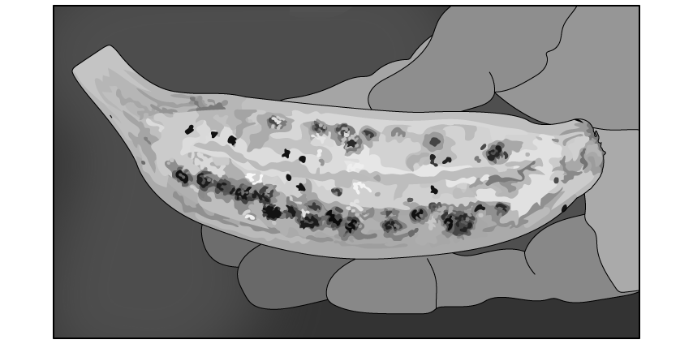

The varieties of bananas that we consume do not have large seeds, which improves the experience of eating them.

Banana plants cannot reproduce asexually.

Seeds play an important role in sexual reproduction in plants and therefore it is not possible for any species to naturally evolve to no longer produce seeds.

Explain how it is possible for humans to develop varieties of bananas without seeds.

### 2() — 4 marks — command: describe — structured
#### Separate: Biology Only

The bananas without seeds cannot reproduce sexually.

Banana farmers on plantations have to produce a large number of plants.

Describe **two **methods the farmer could use to grow a large number of banana plants without the use of seeds.

### 3() — 3 marks — command: explain — structured
There is currently an economically concerning disease called Black Sigtoka that affects banana plants.

It is a fungal pathogen that causes black streaks to appear on the leaves of the banana plants.

Explain why this reduces the yield of the banana plants.

### 4() — 2 marks — command: suggest — structured
#### Separate: Biology Only

One of the reasons why the spread of Black Sigatoka is so concerning is because a huge number of banana plants are susceptible to the pathogen.

Using your answer to parts (a) and (b), suggest why so many banana plants are susceptible to Black Sigatoka.

### 5() — 4 marks — command: discuss — structured
Two possible solutions for the susceptibility of banana plants to Black Sigatoka are as follows:

**Strategy One:** Breed new seedless banana varieties from wild banana plants that are resistant to the pathogen.

**Strategy Two:** Produce genetically engineered banana plants that contain DNA that makes them resistant to the pathogen.

Discuss the use of these two strategies as potential solutions for the susceptibility of banana plants to Black Sigatoka.

## Q9 — hard — 9 marks · exam-questions

### 1() — 2 marks — command: suggest — structured
Humans have been selectively breeding animals and plants for many thousands of years.

For example, some 'hypoallergenic' breeds of dogs have been selectively bred to reduce the risk of allergic reactions in humans.

Suggest **two **other reasons why dogs might be selectively bred.

### 2() — 4 marks — command: explain — structured
Dalmatians are a popular breed of dog but due to extensive inbreeding, they are prone to genetic defects. All pure-bred Dalmatians produce higher-than-normal levels of uric acid due to a gene mutation. This can lead to the formation of kidney and bladder stones which have to be surgically removed.

Another breed of dog called Pointer dogs do not possess this faulty gene and have normal levels of uric acid.

Cross-breed Dalmatians, which are about 99% Dalmatian and 1% pointer, look and behave like Dalmatians but crucially do not have the gene mutation which leads to high levels of uric acid.

Explain how selective breeding was used to produce cross-breed Dalmatians that do not suffer from kidney and bladder stones.

### 3() — 3 marks — command: explain — structured
The gene mutation in the pure-breed Dalmatian changes one amino acid in a protein involved in regulating levels of uric acid.

Explain how a change in one amino acid in the protein could stop it from functioning normally.
