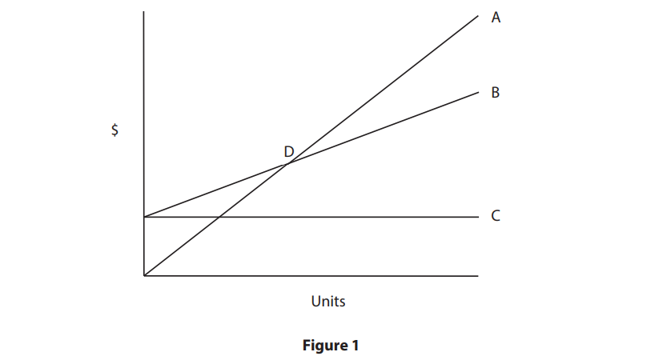
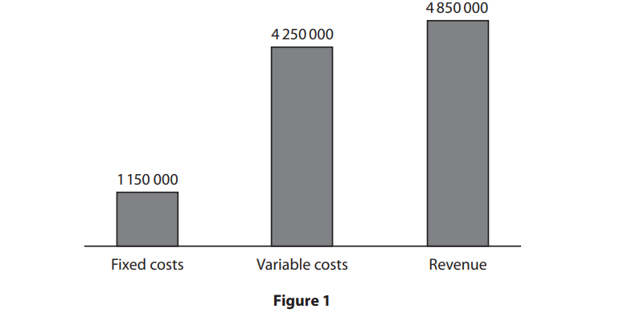

# Exam Questions — Costs & Break Even Analysis
**3. Business Finance** · Edexcel IGCSE Business (4BS1)
> Source: [https://www.savemyexams.com/igcse/business/edexcel/19/topic-questions/3-business-finance/costs-and-break-even-analysis/exam-questions/](https://www.savemyexams.com/igcse/business/edexcel/19/topic-questions/3-business-finance/costs-and-break-even-analysis/exam-questions/) · 37 questions · total 83 marks

## Q1 — easy — 1 marks · exam-questions

### 1() — 1 mark — multiple_choice — from paper June 2024 · Paper 2
Jewellery For You is a jewellery business making earrings and necklaces from stones and pebbles found on local beaches. It makes 240 items a month.

Price per item                           €27

Variable costs per item   €12

Fixed costs per month     €600

Which **one **of the following would be the total monthly cost for Jewellery For You?

Select **one** answer.
- **A.** €924
- **B.** €3 480
- **C.** €6 480
- **D.** €7 080

## Q2 — easy — 1 marks · exam-questions

### 1((c)) — 1 mark — command: define — structured — from paper June 2024 · Paper 2
Define the term **profit**.

## Q3 — easy — 1 marks · exam-questions

### 1() — 1 mark — multiple_choice — from paper Nov 2024 · Paper 1
Which **one **of the following would increase the break-even point?

Select **one **answer.
- **A.** A decrease in the fixed costs
- **B.** An increase in the variable costs
- **C.** An increase in the selling price
- **D.** A decrease in total costs

## Q4 — easy — 1 marks · exam-questions

### 1() — 1 mark — multiple_choice — from paper Nov 2024 · Paper 1
The currency of Türkiye is the Turkish lira (TRY).

In 2021 the cost of material for one robot was 80 000 TRY.

In 2023 the cost of material for one robot was 92 000 TRY.

Which **one **of the following is the percentage change in the cost of material for one robot between 2021 and 2023?

Select **one **answer.
- **A.** 1.30%
- **B.** 13.04%
- **C.** 15.00%
- **D.** 86.96%

## Q5 — easy — 1 marks · exam-questions

### 1() — 1 mark — multiple_choice — from paper Nov 2024 · Paper 2
Which **one **of the following is the break-even point on a break-even chart?

Select **one **answer.
- **A.** When fixed costs and variable costs are the same
- **B.** When total costs and fixed costs are the same
- **C.** When fixed costs and total revenue are the same
- **D.** When total costs and total revenue are the same

## Q6 — easy — 1 marks · exam-questions

### 1() — 1 mark — multiple_choice — from paper Nov 2024 · Paper 2
> **[case-study]**
> The first* Premier Inn* hotel was opened in 1987. *Premier Inn* now has over 820 hotels in the UK, United Arab Emirates (UAE) and India with over 83,000 rooms. It has recently expanded by opening the first *Premier Inn *in Germany and has plans to open more in other countries.
> 
> The majority of the hotels have restaurants with facilities for guests to buy meals and drinks.

**Figure 1 – **Extract from* Premier Inn *financial report in 2021–2022.

|   | 2021  £ millions | 2022  £ millions |
|---|---|---|
| Revenue | 249.60 | 772.80 |

Which **one **of the following is the percentage increase in revenue from 2021 to 2022.

Select **one **answer.
- **A.** 5.23%
- **B.** 67.70%
- **C.** 209.62%
- **D.** 523.20%

## Q7 — easy — 1 marks · exam-questions

### 1() — 1 mark — multiple_choice — from paper June 2023 · Paper 1
> **[case-study]**
> *Irsi Chocolatier* is a chocolate shop in Brussels, the capital city of Belgium. There are many other chocolate shops nearby. Opened in 1989 by the Corne family the business now has four directors and three employees. Florent Corne is the Managing Director with three other family members as Directors. *Irsi Chocolatier* opens from Tuesday till Saturday. The shop sells a variety of handmade chocolates and jelly fruit sweets. It delivers locally and has a website for information purposes only.

In 2021 *Irsi Chocolatier*’s revenue was €311 625. Each year it has seen its revenue increase.

Which **one **of the following would be a 3% increase in revenue for* Irsi Chocolatier*?

Select **one** answer.
- **A.** €317 857.50
- **B.** €319 415.63
- **C.** €320 973.75
- **D.** €322 531.88

## Q8 — easy — 1 marks · exam-questions

### 1() — 1 mark — multiple_choice — from paper June 2023 · Paper 1
> **[case-study]**
> *Irsi Chocolatier* is a chocolate shop in Brussels, the capital city of Belgium. There are many other chocolate shops nearby. Opened in 1989 by the Corne family the business now has four directors and three employees. Florent Corne is the Managing Director with three other family members as Directors. *Irsi Chocolatier* opens from Tuesday till Saturday. The shop sells a variety of handmade chocolates and jelly fruit sweets. It delivers locally and has a website for information purposes only.

*Irsi Chocolatier*’s monthly fixed costs are €950 and variable costs per luxury box of chocolates are €2.60.

Which **one **of the following is the break-even point when a box of luxury chocolates is priced at €15.10?

Select **one **answer.
- **A.** 75
- **B.** 76
- **C.** 77
- **D.** 78

## Q9 — easy — 1 marks · exam-questions

### 1() — 1 mark — multiple_choice — from paper June 2023 · Paper 2
Which **one **of the following are equal in a break-even graph?

Select **one **answer.
- **A.** Fixed costs and variable costs
- **B.** Fixed costs and revenue
- **C.** Total costs and fixed costs
- **D.** Total costs and revenue

## Q10 — easy — 1 marks · exam-questions

### 1() — 1 mark — multiple_choice — from paper Nov 2023 · Paper 1
A business has fixed costs of £6 000 a month. Variable costs are £5 per unit and 8,000 units are made each month.

Which **one **of the following is the total monthly cost?

Select **one **answer.
- **A.** £ 6 005
- **B.** £14 000
- **C.** £30 000
- **D.** £46 000

## Q11 — easy — 1 marks · exam-questions

### 1() — 1 mark — multiple_choice — from paper Nov 2023 · Paper 1
> **[case-study]**
> *As We Grow (AWG) *is a clothing business in Iceland. The social objective of the business is to use natural materials, such as wool, and produce environmentally friendly products. It aims to design clothes that will last a long time, to encourage families to buy fewer clothes and reduce waste in society.
> 
> *AWG’s* increasing product range now includes jumpers, dresses, shirts and baby clothes. These are produced in small workshops that employ family and friends. Waste is kept to a minimum and any leftover material is used to make scarves and hats. The business has one store in Iceland. It uses its website to advertise and sell its clothing online to customers in other countries. The business has received the Icelandic Design Award for its contribution to the environment.

The currency of Iceland is the krona (ISK).

*AWG*’s weekly fixed costs are 440 000 ISK and the variable cost per jumper is 2 500 ISK. Each jumper is sold for 8 000 ISK.

Which **one **of the following is the weekly break-even point?

Select **one **answer.
- **A.** 8
- **B.** 55
- **C.** 80
- **D.** 176

## Q12 — easy — 1 marks · exam-questions

### 1((b)) — 1 mark — command: define — structured — from paper Nov 2023 · Paper 1
Define the **term profit**.

## Q13 — easy — 1 marks · exam-questions

### 1((d)) — 1 mark — command: state — structured — from paper Nov 2023 · Paper 1
> **[case-study]**
> *As We Grow (AWG) *is a clothing business in Iceland. The social objective of the business is to use natural materials, such as wool, and produce environmentally friendly products. It aims to design clothes that will last a long time, to encourage families to buy fewer clothes and reduce waste in society.
> 
> *AWG’s* increasing product range now includes jumpers, dresses, shirts and baby clothes. These are produced in small workshops that employ family and friends. Waste is kept to a minimum and any leftover material is used to make scarves and hats. The business has one store in Iceland. It uses its website to advertise and sell its clothing online to customers in other countries. The business has received the Icelandic Design Award for its contribution to the environment.

State **one **likely variable cost for *AWG*.

## Q14 — easy — 1 marks · exam-questions

### 1() — 1 mark — multiple_choice — from paper Nov 2023 · Paper 2
Which **one **of the following is the break-even point?

Select **one** answer.
- **A.** 
- **B.** 
- **C.** 
- **D.** 

## Q15 — easy — 1 marks · exam-questions

### 1() — 1 mark — multiple_choice — from paper June 2022 · Paper 1
Which **one **of the following is a variable cost?

Select **one **answer.
- **A.** Rent paid
- **B.** Management salaries
- **C.** Insurance agreed
- **D.** Raw materials

## Q16 — easy — 1 marks · exam-questions

### 1() — 1 mark — multiple_choice — from paper June 2022 · Paper 2
> **[case-study]**
> The *LEGO *Group is a privately-owned business in Denmark. The business was founded in 1932 by the Kristiansen family. The family still owns it. The name *LEGO* is an abbreviation of two Danish words, ‘leg godt’ which means ‘play well’. It is now one of the world’s largest manufacturers of toys with 15 factories and over 18,000 employees around the world.
> 
> *LEGO *manufactures toys, games and art materials for boys and girls of all ages, and products from films such as Star Wars and Harry Potter. It believes that children are the role models of the future and playing with *LEGO* can support children in a developing and complex world.

**Figure 1** shows financial information for one of *LEGO’s *suppliers in Danish Krone (DKK).

Which **one **of the following is the correct statement?

Select **one **answer.
- **A.** Total costs of 10 250 000
- **B.** Cash inflow of 3 100 000
- **C.** Loss of 550 000
- **D.** Profit of 600 000

## Q17 — easy — 1 marks · exam-questions

### 1() — 1 mark — multiple_choice — from paper June 2022 · Paper 2
> **[case-study]**
> The *LEGO *Group is a privately-owned business in Denmark. The business was founded in 1932 by the Kristiansen family. The family still owns it. The name *LEGO* is an abbreviation of two Danish words, ‘leg godt’ which means ‘play well’. It is now one of the world’s largest manufacturers of toys with 15 factories and over 18,000 employees around the world.
> 
> *LEGO *manufactures toys, games and art materials for boys and girls of all ages, and products from films such as Star Wars and Harry Potter. It believes that children are the role models of the future and playing with *LEGO* can support children in a developing and complex world.

*LEGO’s *revenue in 2019 was 38.5 billion DKK. In 2020 it was 40.81 billion DKK.

Which **one **of the following is the percentage increase from 2019 to 2020?

Select **one **answer.
- **A.** 0.06%
- **B.** 1.06%
- **C.** 2.31%
- **D.** 6%

## Q18 — easy — 1 marks · exam-questions

### 1((b)) — 1 mark — command: define — structured — from paper June 2022 · Paper 2
Define the term** break-even.**

## Q19 — easy — 1 marks · exam-questions

### 1((b)) — 1 mark — command: define — structured — from paper June 2021 · Paper 1
Define the term** profit.**

## Q20 — easy — 1 marks · exam-questions

### 1() — 1 mark — multiple_choice — from paper Nov 2021 · Paper 2
**Figure 1** shows selected financial information for a pottery business.

| Number of ceramic bowls sold per day | 200 |
|---|---|
| Price per bowl | £12.00 |
| Variable cost per bowl | £3.00 |
| Fixed costs per day | £600 |

**Figure 1**

Which **one **of the following is the total revenue for a day?

Select **one **answer.
- **A.** £600
- **B.** £1 800
- **C.** £2 400
- **D.** £7 200

## Q21 — easy — 1 marks · exam-questions

### 3((a)) — 1 mark — command: define — structured — from paper Nov 2021 · Paper 2
Define the term** revenue.**

## Q22 — easy — 1 marks · exam-questions

### 1() — 1 mark — multiple_choice — from paper Nov 2020 · Paper 1
Which **one** of the following is a variable cost?** (1) **

Select **one **answer.
- **A.** Insurance
- **B.** Rent
- **C.** Salaries
- **D.** Packaging

## Q23 — easy — 1 marks · exam-questions

### 1((b)) — 1 mark — command: define — structured — from paper Nov 2020 · Paper 1
Define the term **fixed costs**.

## Q24 — easy — 1 marks · exam-questions

### 1() — 1 mark — multiple_choice — from paper June 2024 · Paper 1
> **[case-study]**
> *Posh Pets Spain (PPS) *is a pet hotel in the village of Alhaurin el Grande, Spain. It is run by Rachel Goutorbe, an animal enthusiast, and her team of four pet specialists. *PPS* offers overnight accommodation with room for seven dogs or cats, a pet grooming service and a shop selling pet products, such as dog coats and dog leads. Pet grooming involves washing, cutting and combing a pet’s coat.

**Figure 1** gives details of the *PPS* pet grooming service.

| Average number of customers each month | 30 |
|---|---|
| Average price per service | €54 |
| Variable costs per service | €17.25 |
| Fixed costs per month | €175 |

**Figure 1**

Which **one **of the following is the total monthly cost for *PPS*?

Select **one **answer.
- **A.** €692.50
- **B.** €931.50
- **C.** €2137.50
- **D.** €2312.50

## Q25 — medium — 2 marks · exam-questions

### 4((a)) — 2 marks — command: calculate — structured — from paper June 2024 · Paper 1
> **[case-study]**
> *Posh Pets Spain (PPS) *is a pet hotel in the village of Alhaurin el Grande, Spain. It is run by Rachel Goutorbe, an animal enthusiast, and her team of four pet specialists. *PPS* offers overnight accommodation with room for seven dogs or cats, a pet grooming service and a shop selling pet products, such as dog coats and dog leads. Pet grooming involves washing, cutting and combing a pet’s coat.

*PPS *is planning to introduce a new line of dog treats. **Figure 4** shows some financial information for this product.

|   | **€** |
|---|---|
| Monthly fixed costs | 1 000 |
| Variable cost per unit | 3.25 |
| Selling price | 4.50 |

**Figure 4**

Calculate the break-even level of output for this new line of dog treats. You are advised to show your working.

## Q26 — medium — 2 marks · exam-questions

### 4((a)) — 2 marks — command: calculate — structured — from paper June 2024 · Paper 2
> **[case-study]**
> *TUI *is a holiday business that has over 100 years of experience. It offers customers a variety of holidays including staying in hotels, and river and ocean-going cruises. There are many extras that it offers to holiday makers including: car hire, extensions to the holiday and arranging day trips at all its holiday destinations.
> 
> The business is well known and flies its customers to over 180 destinations around the world, including Greece, Turkey and Spain. It has 1,600 travel agencies and 27 million customers. Holidays can be booked by visiting a travel agency or online.
> 
> *TUI *has holidays to meet the needs of all its customers: families, children, couples and those with disabilities.

**Figure 2** shows the total cost to *TUI *of employees’ salaries.

| Total cost of employees | € ‘000 |
|---|---|
| 2021 | 39 631 |
| 2022 | 57 498 |

**Figure 2**

Calculate, to two decimal places, the percentage increase in the total cost of employees from 2021 to 2022. You are advised to show your working.

## Q27 — medium — 2 marks · exam-questions

### 1((e)) — 2 marks — command: calculate — structured — from paper Nov 2024 · Paper 1
> **[case-study]**
> *Saha *is a small business in Türkiye (formerly known as Turkey) that opened in 2020 with 15 employees. It designs and manufactures robots which are used in hospitals, hotels and restaurants. In hospitals its robots are used to move medical supplies between departments. In hotels and restaurants, the robots are used to welcome customers as they arrive and deliver food and drinks to hotel rooms and restaurant tables. *Saha* provides a seven day a week customer service for all businesses buying its robots.
> 
> Many new businesses are entering the global robot market and are competing for market share. Competitors in Türkiye include *NIO, Zoox and Vention.*
> 
> *Saha *has ambitious growth plans and has started to design robots that will be used in the home to help people with cleaning, shopping, security and entertainment. It aims to become a multinational business within five years to manufacture robots in all continents of the world.

The price of a battery pack for a *Saha *robot is \$90 each.

In 2023 it sold five battery packs every month.

Calculate the total revenue from the sale of all battery packs sold by *Saha *in 2023. You are advised to show your working.

## Q28 — medium — 6 marks · exam-questions

### 3((d)) — 6 marks — command: analyse — structured — from paper June 2023 · Paper 1
> **[case-study]**
> *Irsi Chocolatier* is a chocolate shop in Brussels, the capital city of Belgium. There are many other chocolate shops nearby. Opened in 1989 by the Corne family the business now has four directors and three employees. Florent Corne is the Managing Director with three other family members as Directors. *Irsi Chocolatier* opens from Tuesday till Saturday. The shop sells a variety of handmade chocolates and jelly fruit sweets. It delivers locally and has a website for information purposes only.

*Irsi Chocolatier* will need to consider many factors if it wants to introduce its new product of chocolate lollipops.

Analyse the limitations for* Irsi Chocolatier *of using break-even charts to decide whether it should sell the new product.

## Q29 — medium — 2 marks · exam-questions

### 1((e)) — 2 marks — command: calculate — structured — from paper June 2022 · Paper 1
> **[case-study]**
> *The Better Toy Store (TBTS)* is a children’s toy shop. *TBTS *has three shops in Singapore. Two of the shops are located in busy shopping malls and the third is located at the Jewel Changi Airport. *TBTS *has a website for customers looking to buy toys online.
> 
> *TBTS *selects toys to sell that are excellent for play, value, design and quality. All *TBTS* toys are environmentally friendly.

**Figure 1** is a financial extract from TBTS based on the sale of 160 wooden toy carts.

|   | SGD |
|---|---|
| Variable costs per unit | 0.93 |
| Fixed costs | 555.31 |

**Figure 1**

Calculate the total costs for *TBTS *of making 160 wooden toy carts. You are advised to show your working.

## Q30 — medium — 3 marks · exam-questions

### 2((d)) — 3 marks — command: explain — structured — from paper June 2022 · Paper 1
Explain **one **method a small business might use to increase its profit.

## Q31 — medium — 2 marks · exam-questions

### 3((c)) — 2 marks — command: calculate — structured — from paper June 2021 · Paper 1
> **[case-study]**
> *Nantgwynfaen Organic Farm (NOF)* is a farm growing a range of fruit and vegetables. It has a farm shop and offers accommodation with breakfast. It was set up by Amanda and Ken Edwards in West Wales, UK.
> 
> *NOF* supports farmers by selling local organic produce in its farm shop. The produce from the farm shop is served to the visitors staying overnight at the farm.
> 
> *NOF *is committed to being environmentally friendly by recycling, avoiding the use of packaging and reducing the use of electricity.

*NOF *is looking to expand its product range by making and selling tubs of ice cream.

A tub of ice cream will sell for £2.50.

Variable costs will be £1.10 per tub of ice cream with fixed costs of £77 per day.

Calculate the number of tubs of ice cream *NOF *will have to sell each day to break‑even. You are advised to show your working.

## Q32 — medium — 6 marks · exam-questions

### 3((d)) — 6 marks — command: analyse — structured — from paper June 2021 · Paper 1
> **[case-study]**
> *Nantgwynfaen Organic Farm (NOF)* is a farm growing a range of fruit and vegetables. It has a farm shop and offers accommodation with breakfast. It was set up by Amanda and Ken Edwards in West Wales, UK.
> 
> *NOF* supports farmers by selling local organic produce in its farm shop. The produce from the farm shop is served to the visitors staying overnight at the farm.
> 
> *NOF *is committed to being environmentally friendly by recycling, avoiding the use of packaging and reducing the use of electricity.

Analyse how useful break‑even calculations can be for *NOF *when deciding whether to include ice cream in its product range.

## Q33 — medium — 2 marks · exam-questions

### 1((e)) — 2 marks — command: calculate — structured — from paper June 2021 · Paper 2
> **[case-study]**
> *NEXT *is a well-known clothing retailer that operates in 70 countries and employs over 43,000 employees. Since *NEXT *commenced trading it has introduced many other products to its range such as home interiors, flowers and a wedding list service.
> 
> In 1999 *NEXT* launched its own online shopping platform, enabling customers to purchase its products where ever they live. It continues to improve its customer service by introducing new initiatives such as next day delivery.
> 
> *NEXT* mainly uses its own factories for production. However, it does purchase some clothes such as ladies dresses from Turkish factories.

*NEXT *predicts that its £727 million sales will grow by 3.2% next year.

Calculate the predicted sales for next year. You are advised to show your working.

## Q34 — medium — 2 marks · exam-questions

### 4((a)) — 2 marks — command: calculate — structured — from paper Nov 2021 · Paper 1
> **[case-study]**
> *Artify Studio *was set up in 2015 by Tay Hui Jae in the busy Kampong Glam area of Singapore. *Artify Studio*’s aim is to have ‘a communal art space where people can come together and paint, where people would be given as much creative freedom as they would have if they were in their own spaces.
> 
> ’ *Artify Studio *provides many services including its popular Liberty Art Jam where customers can paint as well as listen to music. The studio offers a Corporate Art Jam and Regular Kids Classes. Customers can purchase art materials after attending the studio.* *
> 
> *Artify Studio* is a profit-making organisation with a social element. It employs seven part-time people, all of whom are art enthusiasts.

*Artify Studio* is planning to open a second art studio in the small mining town of Sungai Lembing in Malaysia. It will recruit highly skilled employees to provide a high standard of service.

In order to advertise the opening of the second art studio, *Artify Studio* need to look at promotional cost.

It costs 459.50 MYR for 1,000 colour leaflets to be printed. The cost of delivery is 17.87 MYR per hour.

Calculate the cost to* Artify Studio* of delivering 1,000 printed leaflets which will take 3 hours. You are advised to show your workings.costs.

## Q35 — hard — 9 marks · exam-questions

### 1() — 9 marks — command: justify — structured
> **[case-study]**
> Golde is a small artisan bakery in Dublin, Ireland. It was founded ten years ago by Maeve O'Brien, who trained as a professional pastry chef. The bakery sells handmade sourdough bread, pastries and celebration cakes from a single shop in a busy market street. Maeve employs two part-time assistants who help with baking and serving customers.
> 
> Golde has built a strong reputation for quality and has a loyal local customer base, with many customers visiting several times a week. However, the cost of organic flour, butter and other specialist ingredients has risen sharply over the past year. As a result, the bakery is struggling to break even. Several other independent bakeries operate nearby, and a large supermarket recently opened on the same street.

Maeve is considering two options to lower Golde's break-even point.

- Option 1: Reduce variable costs by sourcing cheaper ingredients
- Option 2: Increase the selling prices of Golde's products

Justify which one of these two options Maeve should choose.

## Q36 — hard — 9 marks · exam-questions

### 1() — 9 marks — command: justify — structured
> **[case-study]**
> Veld is a small flower farm on the outskirts of Amsterdam in the Netherlands. Petra van Dijk set up the business five years ago after leaving a career in horticulture. The farm grows tulips and sunflowers, which are hand-picked and sold in bunches to twelve local florists. Petra employs three full-time workers during the growing season.
> 
> Last year, Veld moved to a larger site to increase its capacity, resulting in significantly higher monthly rent. Despite selling a similar number of bunches as the previous year, the business is no longer making a profit. Petra prides herself on the high quality and presentation of Veld's flowers, which are wrapped in premium branded packaging. Several larger, commercial flower farms in the region supply the same florists and compete on price.

Petra is considering two options to help Veld return to profit.

- Option 1: Reduce fixed costs by moving back to a smaller site with lower rent
- Option 2: Reduce variable costs by using cheaper packaging for the flower bunches

Justify which one of these two options Petra should choose.

## Q37 — hard — 12 marks · exam-questions

### 1() — 12 marks — command: evaluate — structured
> **[case-study]**
> Lumea is a small candle-making business based in Lisbon, Portugal. Sofia Antunes founded the business three years ago after leaving a career as a chemist. Lumea produces a range of scented soy candles by hand, each made using premium soy wax, essential oils and recycled glass jars. The candles are sold through a small shop in a popular tourist area of central Lisbon and through the business website, which attracts customers across Europe. Sofia employs one full-time assistant.
> 
> Lumea has built a strong reputation for quality and sustainability, and its products are priced at a premium to reflect the use of natural ingredients. Over the past year, the cost of soy wax and essential oils has risen by 20%, significantly increasing variable costs. As a result, Lumea is currently selling below its break-even point and is making a loss.

Evaluate the view that Lumea should reduce its variable costs in order to return to profit.
