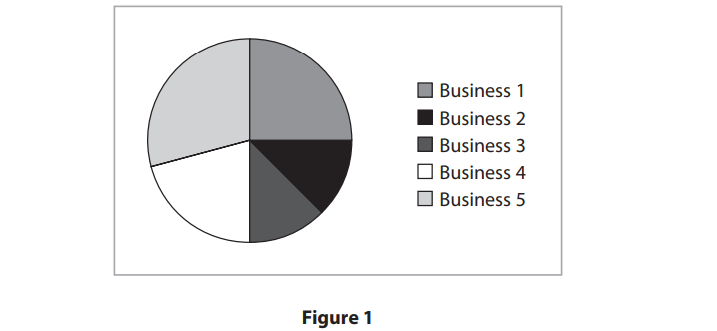

# Exam Questions — The Market
**4. Marketing** · Edexcel IGCSE Business (4BS1)
> Source: [https://www.savemyexams.com/igcse/business/edexcel/19/topic-questions/4-marketing/the-market/exam-questions/](https://www.savemyexams.com/igcse/business/edexcel/19/topic-questions/4-marketing/the-market/exam-questions/) · 20 questions · total 76 marks

## Q1 — easy — 1 marks · exam-questions

### 2((a)) — 1 mark — command: state — structured — from paper June 2024 · Paper 1
> **[case-study]**
> *Posh Pets Spain (PPS) *is a pet hotel in the village of Alhaurin el Grande, Spain. It is run by Rachel Goutorbe, an animal enthusiast, and her team of four pet specialists. *PPS *offers overnight accommodation with room for seven dogs or cats, a pet grooming service and a shop selling pet products, such as dog coats and dog leads. Pet grooming involves washing, cutting and combing a pet’s coat.

State **one **advantage for *PPS* of keeping its customers loyal.

## Q2 — easy — 1 marks · exam-questions

### 2((a)) — 1 mark — command: state — structured — from paper June 2024 · Paper 2
> **[case-study]**
> *TUI *is a holiday business that has over 100 years of experience. It offers customers a variety of holidays including staying in hotels, and river and ocean-going cruises. There are many extras that it offers to holiday makers including: car hire, extensions to the holiday and arranging day trips at all its holiday destinations.
> 
> The business is well known and flies its customers to over 180 destinations around the world, including Greece, Turkey and Spain. It has 1,600 travel agencies and 27 million customers. Holidays can be booked by visiting a travel agency or online.
> 
> *TUI *has holidays to meet the needs of all its customers: families, children, couples and those with disabilities.
> 
> *TUI *has employees throughout the world. Some are employed to greet customers arriving at their holiday destination by air, rail or road. Others sell trips and excursions to customers once they reach their holiday destination. *TUI* prides itself on looking after all its employees and making sure that their needs are met.

State **one **possible reason why *TUI *would want to keep its customers loyal.

## Q3 — easy — 1 marks · exam-questions

### 2((a)) — 1 mark — command: state — structured — from paper June 2023 · Paper 1
> **[case-study]**
> *Irsi Chocolatier *is a chocolate shop in Brussels, the capital city of Belgium. There are many other chocolate shops nearby. Opened in 1989 by the Corne family the business now has four directors and three employees. Florent Corne is the Managing Director with three other family members as Directors. *Irsi Chocolatier* opens from Tuesday till Saturday. The shop sells a variety of handmade chocolates and jelly fruit sweets. It delivers locally and has a website for information purposes only.

State **one **method *Irsi Chocolatier* could use to improve its competitive position.

## Q4 — easy — 1 marks · exam-questions

### 1() — 1 mark — multiple_choice — from paper June 2022 · Paper 1
Which **one **of the following is a form of promotion that targets a specialised segment of the market?

Select **one **answer.
- **A.** Mass marketing
- **B.** Niche marketing
- **C.** Market share
- **D.** Market analysis

## Q5 — easy — 1 marks · exam-questions

### 2((b)) — 1 mark — command: state — structured — from paper June 2022 · Paper 1
> **[case-study]**
> *The Better Toy Store (TBTS)* is a children’s toy shop. *TBTS *has three shops in Singapore. Two of the shops are located in busy shopping malls and the third is located at the Jewel Changi Airport. *TBTS *has a website for customers looking to buy toys online.
> 
> *TBTS *selects toys to sell that are excellent for play, value, design and quality. All *TBTS *toys are environmentally friendly.

State **one **way *TBTS *can measure its success as a business.

## Q6 — easy — 2 marks · exam-questions

### 3((b)) — 2 marks — command: outline — structured — from paper June 2022 · Paper 1
> **[case-study]**
> *The Better Toy Store (TBTS)* is a children’s toy shop. *TBTS *has three shops in Singapore. Two of the shops are located in busy shopping malls and the third is located at the Jewel Changi Airport. *TBTS *has a website for customers looking to buy toys online.
> 
> *TBTS *selects toys to sell that are excellent for play, value, design and quality. All *TBTS *toys are environmentally friendly.

Outline **one **method that *TBTS *might use to respond to greater competition.

## Q7 — easy — 1 marks · exam-questions

### 1((d)) — 1 mark — command: state — structured — from paper June 2021 · Paper 1
> **[case-study]**
> *Nantgwynfaen Organic Farm (NOF) *is a farm growing a range of fruit and vegetables. It has a farm shop and offers accommodation with breakfast. It was set up by Amanda and Ken Edwards in West Wales, UK.
> 
> *NOF *supports farmers by selling local organic produce in its farm shop. The produce from the farm shop is served to the visitors staying overnight at the farm.
> 
> *NOF *is committed to being environmentally friendly by recycling, avoiding the use of packaging and reducing the use of electricity.

State **one **reason why *NOF* segments its target market by income.

## Q8 — easy — 1 marks · exam-questions

### 1() — 1 mark — multiple_choice — from paper June 2021 · Paper 2
> **[case-study]**
> *NEXT *is a well-known clothing retailer that operates in 70 countries and employs over 43,000 employees. Since *NEXT *commenced trading it has introduced many other products to its range such as home interiors, flowers and a wedding list service.
> 
> In 1999 *NEXT *launched its own online shopping platform, enabling customers to purchase its products where ever they live. It continues to improve its customer service by introducing new initiatives such as next day delivery.
> 
> *NEXT *mainly uses its own factories for production. However, it does purchase some clothes such as ladies dresses from Turkish factories.

**Figure 1*** *shows the number of online customers using *NEXT *in 2017–2018.

|   | 2017 Millions | 2018 Millions |
|---|---|---|
| Online customers | 4.7 | 4.9 |

**Figure 1**

What is the percentage increase, to two decimal places, of online customers from 2017 to 2018?

Select **one **answer.
- **A.** 2.00%
- **B.** 4.08%
- **C.** 4.26%
- **D.** 4.70%

## Q9 — easy — 1 marks · exam-questions

### 1((c)) — 1 mark — command: define — structured — from paper Nov 2021 · Paper 2
Define the term **demographics**.

## Q10 — easy — 1 marks · exam-questions

### 1() — 1 mark — multiple_choice — from paper Nov 2020 · Paper 2
**Figure 1** shows the annual total revenue of £1200000 for five businesses.

Business 1      £300000

Business 2     £150000

Business 3     £150000

Business 4     £250000

Business 5     £350000

What is the market share for Business 2?

Select **one **answer.
- **A.** 12.5%
- **B.** 20.8%
- **C.** 25.0%
- **D.** 29.2%

## Q11 — medium — 3 marks · exam-questions

### 2((e)) — 3 marks — command: explain — structured — from paper Nov 2023 · Paper 1
Explain **one **benefit to a business of using market segmentation to target its customers.

## Q12 — medium — 6 marks · exam-questions

### 1() — 6 marks — command: analyse — structured
> **[case-study]**
> Botanica is a food business based in São Paulo, Brazil, that produces and sells plant-based meat alternatives. Its products are sold in supermarkets and through its own website. Brazil has a large and diverse population, with significant differences in income levels, age groups and dietary preferences across the country.

Analyse the importance of market segmentation to Botanica.

## Q13 — medium — 6 marks · exam-questions

### 1((g)) — 6 marks — command: analyse — structured — from paper June 2021 · Paper 1
> **[case-study]**
> *Nantgwynfaen Organic Farm (NOF) *is a farm growing a range of fruit and vegetables. It has a farm shop and offers accommodation with breakfast. It was set up by Amanda and Ken Edwards in West Wales, UK.
> 
> *NOF *supports farmers by selling local organic produce in its farm shop. The produce from the farm shop is served to the visitors staying overnight at the farm.
> 
> *NOF *is committed to being environmentally friendly by recycling, avoiding the use of packaging and reducing the use of electricity.

Analyse the importance of marketing to *NOF*.

## Q14 — medium — 2 marks · exam-questions

### 1() — 2 marks — command: calculate — structured
> **[case-study]**
> Presto is a supermarket chain operating in Portugal. The table below shows information about the Portuguese supermarket industry.
> 
> |   | 2023 | 2024 |
> |---|---|---|
> | Total market size (€m) | 20,000 | 22,000 |
> | Presto's sales (€m) | 3,400 | 3,900 |

Calculate Presto's market share in 2024.

## Q15 — medium — 3 marks · exam-questions

### 1() — 3 marks — command: explain — structured
> **[case-study]**
> Apex is a retailer selling sports equipment and clothing. It operates ten stores across Canada and has an e-commerce website. The Canadian sports retail market has grown significantly over the past five years.

Explain one benefit to Apex of operating in a growing market.

## Q16 — medium — 3 marks · exam-questions

### 1() — 3 marks — command: explain — structured
> **[case-study]**
> Verdant is a small UK business that sells specialist loose-leaf teas sourced from farms in Japan and Taiwan. Its products are sold exclusively through its own website and are priced significantly higher than supermarket tea brands.

Explain one reason why Verdant has chosen to operate in a niche market rather than a mass market.

## Q17 — medium — 6 marks · exam-questions

### 1() — 6 marks — command: analyse — structured
> **[case-study]**
> Solara is a solar panel installation company based in Sydney, Australia. Demand for solar energy has grown rapidly across Australia over the past decade, driven by rising electricity prices and increasing environmental awareness.
> 
> Solara currently holds a 12% share of the Australian residential solar market and operates in a sector with many competing firms.

Analyse the benefits to Solara of operating in a growing market.

## Q18 — hard — 12 marks · exam-questions

### 4((c)) — 12 marks — command: evaluate — structured — from paper June 2024 · Paper 1
> **[case-study]**
> *Posh Pets Spain (PPS) *is a pet hotel in the village of Alhaurin el Grande, Spain. It is run by Rachel Goutorbe, an animal enthusiast, and her team of four pet specialists. *PPS *offers overnight accommodation with room for seven dogs or cats, a pet grooming service and a shop selling pet products, such as dog coats and dog leads. Pet grooming involves washing, cutting and combing a pet’s coat.

Another pet business is about to open a rival pet hotel in the village. This is the first time *PPS *has faced competition.

Evaluate the importance of marketing to *PPS *so it can keep its market share. You should use the information provided as well as your own knowledge of business.

## Q19 — hard — 12 marks · exam-questions

### 4((c)) — 12 marks — command: evaluate — structured — from paper June 2023 · Paper 2
> **[case-study]**
> *IKEA *is a well-known home furniture retailer with stores throughout the world. It was started in 1943 by Ingvar Kamprad when he was given some money by his father for doing well at school. He wanted to produce furniture at a price that people could afford to buy.
> 
> He realised that transporting furniture to customers was difficult as goods were often damaged. He developed flat packs to avoid damage. A flat pack contained all the materials needed to self-assemble a table, a chair or a bed.
> 
> All *IKEA *stores are run as franchises.

*IKEA *prides itself on knowing the tastes and demands of its customers. This means it can provide the best experience possible when customers are shopping. It offers inspirational home furnishing tutorials and workshops to help customers create the perfect home.

Evaluate the importance to *IKEA *of using demographic segmentation when targeting its customers. You should use the information provided as well as your own knowledge of business.

## Q20 — hard — 12 marks · exam-questions

### 4((c)) — 12 marks — command: evaluate — structured — from paper Nov 2020 · Paper 2
> **[case-study]**
> In 1985 *Emirates *started its airline business with just two aircraft. It is now a well‑known airline with over 265 aircraft flying to over 180 destinations around the world.
> 
> *Emirates *has won many awards for service and reliability. Until 2016 passengers rated *Emirates *the leading airline to travel with. However, in 2017 its rating dropped from first to fourth.

Evaluate how changes in consumer spending patterns and competition may affect a business such as *Emirates*. You should use the information provided as well as your own knowledge of business.
