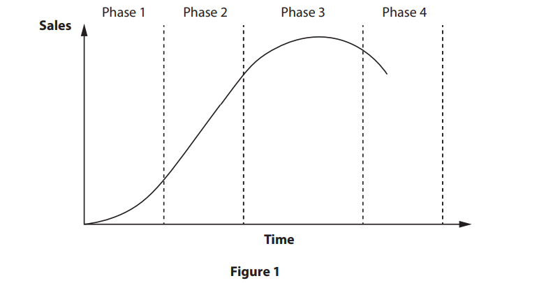

# Exam Questions — The Marketing Mix
**4. Marketing** · Edexcel IGCSE Business (4BS1)
> Source: [https://www.savemyexams.com/igcse/business/edexcel/19/topic-questions/4-marketing/the-marketing-mix/exam-questions/](https://www.savemyexams.com/igcse/business/edexcel/19/topic-questions/4-marketing/the-marketing-mix/exam-questions/) · 58 questions · total 238 marks

## Q1 — easy — 1 marks · exam-questions

### 1() — 1 mark — multiple_choice — from paper June 2024 · Paper 1
Which **one** of the following represents a star product on the Boston matrix?

Select **one **answer.
- **A.** High market growth, high market share
- **B.** High market growth, low market share
- **C.** Low market growth, high market share
- **D.** Low market growth, low market share

## Q2 — easy — 1 marks · exam-questions

### 1((d)) — 1 mark — command: state — structured — from paper June 2024 · Paper 1
> **[case-study]**
> *Posh Pets Spain (PPS)* is a pet hotel in the village of Alhaurin el Grande, Spain. It is run by Rachel Goutorbe, an animal enthusiast, and her team of four pet specialists. *PPS* offers overnight accommodation with room for seven dogs or cats, a pet grooming service and a shop selling pet products, such as dog coats and dog leads. Pet grooming involves washing, cutting and combing a pet’s coat.

*PPS *has seen lower sales of its pet accessories.

State **one **extension strategy PPS could use to extend the life cycle of the pet accessories.

## Q3 — easy — 1 marks · exam-questions

### 2((a)) — 1 mark — command: state — structured — from paper Nov 2024 · Paper 1
> **[case-study]**
> *Saha *is a small business in Türkiye (formerly known as Turkey) that opened in 2020 with 15 employees. It designs and manufactures robots which are used in hospitals, hotels and restaurants. In hospitals its robots are used to move medical supplies between departments. In hotels and restaurants, the robots are used to welcome customers as they arrive and deliver food and drinks to hotel rooms and restaurant tables. *Saha *provides a seven day a week customer service for all businesses buying its robots.
> 
> Many new businesses are entering the global robot market and are competing for market share. Competitors in Türkiye include *NIO, Zoox* and *Vention*.
> 
> *Saha *has ambitious growth plans and has started to design robots that will be used in the home to help people with cleaning, shopping, security and entertainment. It aims to become a multinational business within five years to manufacture robots in all continents of the world.

State **one **reason why branding is important to *Saha*.

## Q4 — easy — 1 marks · exam-questions

### 1() — 1 mark — multiple_choice — from paper June 2023 · Paper 1
Which **one **of the following functions is responsible for public relations?

Select **one **answer.
- **A.** Human resources
- **B.** Finance
- **C.** Marketing
- **D.** Production

## Q5 — easy — 1 marks · exam-questions

### 1() — 1 mark — multiple_choice — from paper June 2023 · Paper 1
Which **one **of the following is an example of a good?

Select **one **answer.
- **A.** Motor vehicle
- **B.** Financial advice
- **C.** Car washing
- **D.** Gardening

## Q6 — easy — 1 marks · exam-questions

### 1((d)) — 1 mark — command: state — structured — from paper June 2023 · Paper 1
> **[case-study]**
> *Irsi Chocolatier *is a chocolate shop in Brussels, the capital city of Belgium. There are many other chocolate shops nearby. Opened in 1989 by the Corne family the business now has four directors and three employees. Florent Corne is the Managing Director with three other family members as Directors.* Irsi Chocolatier *opens from Tuesday till Saturday. The shop sells a variety of handmade chocolates and jelly fruit sweets. It delivers locally and has a website for information purposes only.

State **one **way *Irsi Chocolatier *could use the Boston matrix.

## Q7 — easy — 1 marks · exam-questions

### 2((b)) — 1 mark — command: state — structured — from paper June 2023 · Paper 1
> **[case-study]**
> *Irsi Chocolatier *is a chocolate shop in Brussels, the capital city of Belgium. There are many other chocolate shops nearby. Opened in 1989 by the Corne family the business now has four directors and three employees. Florent Corne is the Managing Director with three other family members as Directors.* Irsi Chocolatier *opens from Tuesday till Saturday. The shop sells a variety of handmade chocolates and jelly fruit sweets. It delivers locally and has a website for information purposes only.

State **one **way *Irsi Chocolatier* might extend the life cycle of one of its products.

## Q8 — easy — 2 marks · exam-questions

### 3((b)) — 2 marks — command: outline — structured — from paper June 2023 · Paper 1
> **[case-study]**
> *Irsi Chocolatier *is a chocolate shop in Brussels, the capital city of Belgium. There are many other chocolate shops nearby. Opened in 1989 by the Corne family the business now has four directors and three employees. Florent Corne is the Managing Director with three other family members as Directors.* Irsi Chocolatier *opens from Tuesday till Saturday. The shop sells a variety of handmade chocolates and jelly fruit sweets. It delivers locally and has a website for information purposes only.

Outline **one **way *Irsi Chocolatier *could keep customer loyalty.

## Q9 — easy — 1 marks · exam-questions

### 1() — 1 mark — multiple_choice — from paper June 2023 · Paper 2
**Figure 1** is a diagram of a product life cycle.

Which **one **of the following is Phase 3 of the product life cycle?

Select **one **answer.
- **A.** Decline
- **B.** Growth
- **C.** Introduction
- **D.** Maturity

## Q10 — easy — 1 marks · exam-questions

### 1() — 1 mark — multiple_choice — from paper Nov 2023 · Paper 1
Which **one **of the following is an element of the marketing mix?

Select **one **answer.
- **A.** Price
- **B.** Partnership
- **C.** Production
- **D.** Profit

## Q11 — easy — 1 marks · exam-questions

### 1() — 1 mark — multiple_choice — from paper Nov 2023 · Paper 2
> **[case-study]**
> Most people recognise Heinz for the phrase ‘57 varieties’ even though it now produces many more than the original 57 varieties. H J Heinz, the founder of the Heinz business, believed the phrase sounded lucky.
> 
> *Kraft Heinz *is a world-wide producer of food products. It was formed from the merger of Kraft Foods and Heinz in 2015. This created the third largest food and drinks business in the USA and the fifth largest food and drinks business in the world.
> 
> *Kraft Heinz* has over 24 different brands, including Greenseas in Australia and Nutri+Plus in New Zealand. America has the largest number of brands from Maxwell House to Cool Whip. *Kraft Heinz* produces many different products including tomato sauce, ‘Mac&Cheese’, pasta and its famous baked beans that are used and eaten by many people.
> 
> *Kraft Heinz* uses many methods to advertise its products. These include posters, billboards and leaflets in supermarkets.

*Kraft Heinz* uses price promotions to encourage customers to purchase more of its products. The price of a tin of baked beans in the US is \$0.54. If 12 tins are purchased the price is reduced by 12.5%.

Which **one **of the following is the price of 12 tins of baked beans with the 12.5% promotional price discount?

Select **one **answer.
- **A.** \$5.67
- **B.** \$6.48
- **C.** \$56.25
- **D.** \$81.00

## Q12 — easy — 1 marks · exam-questions

### 1() — 1 mark — multiple_choice — from paper June 2021 · Paper 1
Which **one **of the following is the name of a pricing strategy where a business sets a high price for a new product in the market?

Select **one** answer.
- **A.** Penetration
- **B.** Skimming
- **C.** Competition
- **D.** Promotional

## Q13 — easy — 1 marks · exam-questions

### 2((b)) — 1 mark — command: state — structured — from paper June 2021 · Paper 1
> **[case-study]**
> *Nantgwynfaen Organic Farm (NOF)* is a farm growing a range of fruit and vegetables. It has a farm shop and offers accommodation with breakfast. It was set up by Amanda and Ken Edwards in West Wales, UK.
> 
> *NOF *supports farmers by selling local organic produce in its farm shop. The produce from the farm shop is served to the visitors staying overnight at the farm.
> 
> *NOF *is committed to being environmentally friendly by recycling, avoiding the use of packaging and reducing the use of electricity.

State **one **reason *NOF* might use other retailers to sell its products.

## Q14 — easy — 1 marks · exam-questions

### 1((d)) — 1 mark — command: state — structured — from paper June 2021 · Paper 2
> **[case-study]**
> *NEXT *is a well-known clothing retailer that operates in 70 countries and employs over 43,000 employees. Since *NEXT *commenced trading it has introduced many other products to its range such as home interiors, flowers and a wedding list service.
> 
> In 1999 *NEXT* launched its own online shopping platform, enabling customers to purchase its products where ever they live. It continues to improve its customer service by introducing new initiatives such as next day delivery.
> 
> *NEXT* mainly uses its own factories for production. However, it does purchase some clothes such as ladies dresses from Turkish factories.

State **one** reason why *NEXT* might use cost plus pricing.

## Q15 — easy — 2 marks · exam-questions

### 3((b)) — 2 marks — command: outline — structured — from paper June 2021 · Paper 2
> **[case-study]**
> *NEXT *is a well-known clothing retailer that operates in 70 countries and employs over 43,000 employees. Since *NEXT *commenced trading it has introduced many other products to its range such as home interiors, flowers and a wedding list service.
> 
> In 1999 *NEXT* launched its own online shopping platform, enabling customers to purchase its products where ever they live. It continues to improve its customer service by introducing new initiatives such as next day delivery.
> 
> *NEXT* mainly uses its own factories for production. However, it does purchase some clothes such as ladies dresses from Turkish factories.

*NEXT *works hard to remain competitive with other retailers of similar products.

Outline **one **reason why *NEXT *uses special offers.

## Q16 — easy — 1 marks · exam-questions

### 3((a)) — 1 mark — command: define — structured — from paper Nov 2021 · Paper 1
Define the term **price skimming**.

## Q17 — easy — 1 marks · exam-questions

### 1() — 1 mark — multiple_choice — from paper Nov 2021 · Paper 2
> **[case-study]**
> *Huawei *is a leading global provider of information and communications technology, infrastructure and smart devices. In March 2011, over one million of its C8500 smartphones were sold in China following its launch.
> 
> It now manufactures a wide variety of different products including *Huawei *smartphones, watches and tablets. In recent years *Huawei *has won many awards. In 2018 it was named the 68th most valuable brand by Best Global Brands. In 2019 it introduced a smartphone which had new photographic technology.

*Huawei’s *brand value for 2018 was \$7.6 billion. Huawei plans to increase its brand value by 14% in 2019.

What would be the brand value in 2019?

Select **one **answer.
- **A.** \$6.20 billion
- **B.** \$7.74 billion
- **C.** \$8.66 billion
- **D.** \$10.64 billion

## Q18 — easy — 1 marks · exam-questions

### 2((b)) — 1 mark — command: state — structured — from paper Nov 2021 · Paper 2
> **[case-study]**
> *Huawei *is a leading global provider of information and communications technology, infrastructure and smart devices. In March 2011, over one million of its C8500 smartphones were sold in China following its launch.
> 
> It now manufactures a wide variety of different products including *Huawei *smartphones, watches and tablets. In recent years *Huawei *has won many awards. In 2018 it was named the 68th most valuable brand by Best Global Brands. In 2019 it introduced a smartphone which had new photographic technology.

State **one** possible reason why *Huawei *would want to keep its customers loyal to its brand.

## Q19 — easy — 1 marks · exam-questions

### 1((d)) — 1 mark — command: state — structured — from paper Nov 2020 · Paper 2
> **[case-study]**
> In 1985 *Emirates *started its airline business with just two aircraft. It is now a well‑known airline with over 265 aircraft flying to over 180 destinations around the world.
> 
> *Emirates* has won many awards for service and reliability. Until 2016 passengers rated *Emirates *the leading airline to travel with. However, in 2017 its rating dropped from first to fourth.

State **one **reason why *Emirates *uses competition pricing.

## Q20 — easy — 1 marks · exam-questions

### 2((b)) — 1 mark — command: state — structured — from paper Nov 2020 · Paper 2
> **[case-study]**
> In 1985 *Emirates *started its airline business with just two aircraft. It is now a well‑known airline with over 265 aircraft flying to over 180 destinations around the world.
> 
> *Emirates* has won many awards for service and reliability. Until 2016 passengers rated *Emirates *the leading airline to travel with. However, in 2017 its rating dropped from first to fourth.

*Emirates* wants to encourage its employees to remain with the company and offers them incentives to do so. It offers all of its passengers a loyalty programme.

State **one **reason why *Emirates *has a loyalty programme for its passengers.

## Q21 — medium — 2 marks · exam-questions

### 1((e)) — 2 marks — command: calculate — structured — from paper June 2024 · Paper 2
> **[case-study]**
> *TUI *is a holiday business that has over 100 years of experience. It offers customers a variety of holidays including staying in hotels, and river and ocean-going cruises. There are many extras that it offers to holiday makers including: car hire, extensions to the holiday and arranging day trips at all its holiday destinations.
> 
> The business is well known and flies its customers to over 180 destinations around the world, including Greece, Turkey and Spain. It has 1,600 travel agencies and 27 million customers. Holidays can be booked by visiting a travel agency or online.
> 
> *TUI *has holidays to meet the needs of all its customers: families, children, couples and those with disabilities.

*TUI* is charging an adult £725.92 for a week in Cyprus. If booked online, there is a discount of 12.5%.

Calculate the total price of a holiday for **two **adults with a 12.5% promotional discount for booking online.

## Q22 — medium — 6 marks · exam-questions

### 4((b)) — 6 marks — command: analyse — structured — from paper June 2024 · Paper 2
> **[case-study]**
> *TUI *is a holiday business that has over 100 years of experience. It offers customers a variety of holidays including staying in hotels, and river and ocean-going cruises. There are many extras that it offers to holiday makers including: car hire, extensions to the holiday and arranging day trips at all its holiday destinations.
> 
> The business is well known and flies its customers to over 180 destinations around the world, including Greece, Turkey and Spain. It has 1,600 travel agencies and 27 million customers. Holidays can be booked by visiting a travel agency or online.
> 
> *TUI *has holidays to meet the needs of all its customers: families, children, couples and those with disabilities.

Analyse how *TUI *could make use of the Boston Matrix to review all the different types of holidays it offers.

## Q23 — medium — 3 marks · exam-questions

### 2((d)) — 3 marks — command: explain — structured — from paper Nov 2024 · Paper 1
Explain **one **method of above the line promotion a business may use to increase its sales revenue.

## Q24 — medium — 2 marks · exam-questions

### 1((e)) — 2 marks — command: calculate — structured — from paper Nov 2024 · Paper 2
> **[case-study]**
> The first *Premier Inn* hotel was opened in 1987. *Premier Inn *now has over 820 hotels in the UK, United Arab Emirates (UAE) and India with over 83,000 rooms. It has recently expanded by opening the first *Premier Inn *in Germany and has plans to open more in other countries.
> 
> The majority of the hotels have restaurants with facilities for guests to buy meals and drinks.

To encourage people to stay at a new German hotel, *Premier Inn* offers a 12.5% discount on a room for the first night only.

The price for one night is €89.25.

Calculate, to two decimal places, the price for the first night after the discount has been applied. You are advised to show your working.

## Q25 — medium — 3 marks · exam-questions

### 2((d)) — 3 marks — command: explain — structured — from paper Nov 2024 · Paper 2
Explain **one **reason why a business might use sponsorship.

## Q26 — medium — 2 marks · exam-questions

### 1((e)) — 2 marks — command: calculate — structured — from paper June 2023 · Paper 1
> **[case-study]**
> *Irsi Chocolatier *is a chocolate shop in Brussels, the capital city of Belgium. There are many other chocolate shops nearby. Opened in 1989 by the Corne family the business now has four directors and three employees. Florent Corne is the Managing Director with three other family members as Directors.* Irsi Chocolatier *opens from Tuesday till Saturday. The shop sells a variety of handmade chocolates and jelly fruit sweets. It delivers locally and has a website for information purposes only.

A customer buying five boxes of chocolates for a total of €75.50 is given a 6% discount.

Calculate, to two decimal places, the cost of these chocolates after the discount has been applied. You are advised to show your working.

## Q27 — medium — 3 marks · exam-questions

### 1((f)) — 3 marks — command: explain — structured — from paper June 2023 · Paper 1
Explain **one **benefit for a business that uses test marketing.

## Q28 — medium — 6 marks · exam-questions

### 1((g)) — 6 marks — command: analyse — structured — from paper June 2023 · Paper 1
> **[case-study]**
> *Irsi Chocolatier *is a chocolate shop in Brussels, the capital city of Belgium. There are many other chocolate shops nearby. Opened in 1989 by the Corne family the business now has four directors and three employees. Florent Corne is the Managing Director with three other family members as Directors.* Irsi Chocolatier *opens from Tuesday till Saturday. The shop sells a variety of handmade chocolates and jelly fruit sweets. It delivers locally and has a website for information purposes only.

Analyse the importance of branding for *Irsi Chocolatier*.

## Q29 — medium — 3 marks · exam-questions

### 2((c)) — 3 marks — command: explain — structured — from paper June 2023 · Paper 1
Explain **one **way a business could use e-newsletters.

## Q30 — medium — 6 marks · exam-questions

### 4() — 6 marks — command: analyse — structured — from paper June 2023 · Paper 1
> **[case-study]**
> *Irsi Chocolatier *is a chocolate shop in Brussels, the capital city of Belgium. There are many other chocolate shops nearby. Opened in 1989 by the Corne family the business now has four directors and three employees. Florent Corne is the Managing Director with three other family members as Directors.* Irsi Chocolatier *opens from Tuesday till Saturday. The shop sells a variety of handmade chocolates and jelly fruit sweets. It delivers locally and has a website for information purposes only.

Analyse the importance of place to* Irsi Chocolatier*.

## Q31 — medium — 3 marks · exam-questions

### 2((e)) — 3 marks — command: explain — structured — from paper June 2023 · Paper 2
Explain **one **reason why businesses continually design new products.

## Q32 — medium — 2 marks · exam-questions

### 1((e)) — 2 marks — command: calculate — structured — from paper Nov 2023 · Paper 1
> **[case-study]**
> *As We Grow (AWG)* is a clothing business in Iceland. The social objective of the business is to use natural materials, such as wool, and produce environmentally friendly products. It aims to design clothes that will last a long time, to encourage families to buy fewer clothes and reduce waste in society.
> 
> *AWG’s *increasing product range now includes jumpers, dresses, shirts and baby clothes. These are produced in small workshops that employ family and friends. Waste is kept to a minimum and any leftover material is used to make scarves and hats. The business has one store in Iceland. It uses its website to advertise and sell its clothing online to customers in other countries. The business has received the Icelandic Design Award for its contribution to the environment.

*AWG *sells a woman’s jumper on its international website for \$329. *AWG *had a promotional sale and offered a discount of 25% on the price of jumpers.

Calculate, to two decimal places, the new price of the jumper in the promotional sale. You are advised to show your working.

## Q33 — medium — 6 marks · exam-questions

### 1((g)) — 6 marks — command: analyse — structured — from paper Nov 2023 · Paper 1
> **[case-study]**
> *As We Grow (AWG)* is a clothing business in Iceland. The social objective of the business is to use natural materials, such as wool, and produce environmentally friendly products. It aims to design clothes that will last a long time, to encourage families to buy fewer clothes and reduce waste in society.
> 
> *AWG’s *increasing product range now includes jumpers, dresses, shirts and baby clothes. These are produced in small workshops that employ family and friends. Waste is kept to a minimum and any leftover material is used to make scarves and hats. The business has one store in Iceland. It uses its website to advertise and sell its clothing online to customers in other countries. The business has received the Icelandic Design Award for its contribution to the environment.

Analyse the advantages to *AWG *of using e-commerce to sell its products.

## Q34 — medium — 3 marks · exam-questions

### 2((d)) — 3 marks — command: explain — structured — from paper Nov 2023 · Paper 1
Explain **one **method of below-the-line promotion a business may use to retain its customers.

## Q35 — medium — 3 marks · exam-questions

### 2((e)) — 3 marks — command: explain — structured — from paper June 2022 · Paper 1
Explain **one **benefit to a business of using the Boston Matrix.

## Q36 — medium — 2 marks · exam-questions

### 4((a)) — 2 marks — command: calculate — structured — from paper June 2022 · Paper 1
> **[case-study]**
> *The Better Toy Store (TBTS)* is a children’s toy shop. *TBTS *has three shops in Singapore. Two of the shops are located in busy shopping malls and the third is located at the Jewel Changi Airport. *TBTS *has a website for customers looking to buy toys online.
> 
> *TBTS *selects toys to sell that are excellent for play, value, design and quality. All *TBTS *toys are environmentally friendly.

*TBTS *lets customers sign up for a Very Important Person (VIP) membership on its website. The website gives VIP members special rates and exclusive offers.

*TBTS *sells dinosaur toys for 22.80 SGD. VIP members get a discount of 15%.

Calculate the total cost to a VIP member of buying 17 dinosaur toys. You are advised to show your working.

## Q37 — medium — 3 marks · exam-questions

### 2((d)) — 3 marks — command: explain — structured — from paper June 2022 · Paper 2
Explain **one **reason why product trials are important to a business.

## Q38 — medium — 3 marks · exam-questions

### 1((f)) — 3 marks — command: explain — structured — from paper June 2021 · Paper 1
Explain **one **strategy a small business might use to extend the product life cycle of one of its products.

## Q39 — medium — 2 marks · exam-questions

### 1((e)) — 2 marks — command: calculate — structured — from paper Nov 2021 · Paper 1
> **[case-study]**
> *Artify Studio *was set up in 2015 by Tay Hui Jae in the busy Kampong Glam area of Singapore. *Artify Studio*’s aim is to have ‘a communal art space where people can come together and paint, where people would be given as much creative freedom as they would have if they were in their own spaces.’
> 
> *Artify Studio *provides many services including its popular Liberty Art Jam where customers can paint as well as listen to music. The studio offers a Corporate Art Jam and Regular Kids Classes. Customers can purchase art materials after attending the studio.
> 
> *Artify Studio *is a profit-making organisation with a social element. It employs seven part-time people, all of whom are art enthusiasts.

*Artify Studio* offers a 12% discount to parents if they book the ‘Duo Parent and Child Art Camp’ and the ‘Children’s Illustration Workshop’ at the same time. The combined price for both courses before being discounted is S\$285.

Calculate the discounted cost of booking both courses at the same time.

You are advised to show your working.

## Q40 — medium — 3 marks · exam-questions

### 2((d)) — 3 marks — command: explain — structured — from paper Nov 2021 · Paper 1
Explain **one **way social media can be used by a business.

## Q41 — medium — 3 marks · exam-questions

### 1((f)) — 3 marks — command: explain — structured — from paper Nov 2021 · Paper 2
Explain **one **advantage for a business of using **sponsorship**.

## Q42 — medium — 3 marks · exam-questions

### 2((c)) — 3 marks — command: explain — structured — from paper Nov 2021 · Paper 2
Explain **one **reason why having good public relations is important to a business.

## Q43 — medium — 6 marks · exam-questions

### 4((b)) — 6 marks — command: analyse — structured — from paper Nov 2020 · Paper 1
> **[case-study]**
> *The Alternative Drum School (TADS)* was set up in the wealthy area of Cricklade, England in 2008 by Ollie Tanner who had a passion for and enjoyed drumming. Ollie invested all of his savings into the drumming school. He saw the potential of being located away from other drumming schools.
> 
> Ollie promotes his business by writing columns in local papers, performing at local music festivals and by word of mouth recommendations. He has invested heavily in computer technology to allow students to produce the music they enjoy playing. Ollie finds it difficult to maintain a good work-life balance.
> 
> Ollie currently works 60 hours a week in a business that does not have reliable profits.

Analyse the benefits for *TADS *of using below-the-line promotion.

## Q44 — hard — 9 marks · exam-questions

### 2((f)) — 9 marks — command: justify — structured — from paper June 2024 · Paper 1
> **[case-study]**
> *Posh Pets Spain (PPS)* is a pet hotel in the village of Alhaurin el Grande, Spain. It is run by Rachel Goutorbe, an animal enthusiast, and her team of four pet specialists. *PPS* offers overnight accommodation with room for seven dogs or cats, a pet grooming service and a shop selling pet products, such as dog coats and dog leads. Pet grooming involves washing, cutting and combing a pet’s coat.

*PPS *is looking to improve its revenue and is considering two options:

- **Option 1: **trial a new brand of dog food in the shop
- **Option 2:** sponsor a local dog show.

Justify which **one **of these two options PPS should choose.

## Q45 — hard — 9 marks · exam-questions

### 2((f)) — 9 marks — command: justify — structured — from paper June 2024 · Paper 2
> **[case-study]**
> *TUI *is a holiday business that has over 100 years of experience. It offers customers a variety of holidays including staying in hotels, and river and ocean-going cruises. There are many extras that it offers to holiday makers including: car hire, extensions to the holiday and arranging day trips at all its holiday destinations.
> 
> The business is well known and flies its customers to over 180 destinations around the world, including Greece, Turkey and Spain. It has 1,600 travel agencies and 27 million customers. Holidays can be booked by visiting a travel agency or online.
> 
> *TUI *has holidays to meet the needs of all its customers: families, children, couples and those with disabilities.

The travel market that *TUI* operates in is very competitive, with many different businesses offering the same holidays at the same venues. When *TUI* introduces a new holiday or experience it has to consider the pricing strategy it will use. For its new holiday destination in Sri Lanka it is considering two options:

- **Option 1:** competition pricing
- **Option 2:** promotional pricing.

Justify which **one **of these two options *TUI *should choose.

## Q46 — hard — 9 marks · exam-questions

### 3((e)) — 9 marks — command: justify — structured — from paper Nov 2024 · Paper 1
> **[case-study]**
> *Saha *is a small business in Türkiye (formerly known as Turkey) that opened in 2020 with 15 employees. It designs and manufactures robots which are used in hospitals, hotels and restaurants. In hospitals its robots are used to move medical supplies between departments. In hotels and restaurants, the robots are used to welcome customers as they arrive and deliver food and drinks to hotel rooms and restaurant tables. *Saha *provides a seven day a week customer service for all businesses buying its robots.
> 
> Many new businesses are entering the global robot market and are competing for market share. Competitors in Türkiye include *NIO, Zoox* and *Vention*.
> 
> *Saha *has ambitious growth plans and has started to design robots that will be used in the home to help people with cleaning, shopping, security and entertainment. It aims to become a multinational business within five years to manufacture robots in all continents of the world.

*Saha *is planning to develop a new range of robots aimed at helping people in the home with cleaning, shopping, security and entertainment.

It is considering two pricing methods for these robots:

- **Option 1:** price skimming
- **Option 2: **cost plus pricing.

Justify which **one **of these two options *Saha *should choose.

## Q47 — hard — 9 marks · exam-questions

### 2((f)) — 9 marks — command: justify — structured — from paper Nov 2024 · Paper 2
> **[case-study]**
> The first *Premier Inn* hotel was opened in 1987. *Premier Inn *now has over 820 hotels in the UK, United Arab Emirates (UAE) and India with over 83,000 rooms. It has recently expanded by opening the first *Premier Inn *in Germany and has plans to open more in other countries.
> 
> The majority of the hotels have restaurants with facilities for guests to buy meals and drinks.

To be competitive in India, *Premier Inn *must make sure that it uses the correct pricing strategy. It is considering the following two options:

- **Option 1:** competition pricing
- **Option 2: **promotional pricing.

Justify which **one **of these two options *Premier Inn* should choose.

## Q48 — hard — 9 marks · exam-questions

### 2((f)) — 9 marks — command: justify — structured — from paper June 2023 · Paper 2
> **[case-study]**
> IKEA is a well-known home furniture retailer with stores throughout the world. It was started in 1943 by Ingvar Kamprad when he was given some money by his father for doing well at school. He wanted to produce furniture at a price that people could afford to buy. He realised that transporting furniture to customers was difficult as goods were often damaged. He developed flat packs to avoid damage. A flat pack contained all the materials needed to self-assemble a table, a chair or a bed. All IKEA stores are run as franchises.

*IKEA *constantly aims to improve the way it promotes its furniture. To do this *IKEA* is considering using the following techniques.

- **Option 1: **above the line promotion
- **Option 2:** below the line promotion.

Justify which **one **of these two options *IKEA *should use.

## Q49 — hard — 9 marks · exam-questions

### 3((e)) — 9 marks — command: justify — structured — from paper Nov 2023 · Paper 1
> **[case-study]**
> *As We Grow (AWG)* is a clothing business in Iceland. The social objective of the business is to use natural materials, such as wool, and produce environmentally friendly products. It aims to design clothes that will last a long time, to encourage families to buy fewer clothes and reduce waste in society.
> 
> *AWG’s *increasing product range now includes jumpers, dresses, shirts and baby clothes. These are produced in small workshops that employ family and friends. Waste is kept to a minimum and any leftover material is used to make scarves and hats. The business has one store in Iceland. It uses its website to advertise and sell its clothing online to customers in other countries. The business has received the Icelandic Design Award for its contribution to the environment.

*AWG *is planning to launch a new range of clothing aimed at teenagers and younger adults. It is considering two pricing methods:

- **Option 1:** competition pricing
- **Option 2:** cost plus pricing.

Justify which **one **of these two options *AWG *should choose.

## Q50 — hard — 9 marks · exam-questions

### 2((f)) — 9 marks — command: justify — structured — from paper Nov 2023 · Paper 2
> **[case-study]**
> Most people recognise Heinz for the phrase ‘57 varieties’ even though it now produces many more than the original 57 varieties. H J Heinz, the founder of the Heinz business, believed the phrase sounded lucky.
> 
> *Kraft Heinz *is a world-wide producer of food products. It was formed from the merger of Kraft Foods and Heinz in 2015. This created the third largest food and drinks business in the USA and the fifth largest food and drinks business in the world.
> 
> *Kraft Heinz* has over 24 different brands, including Greenseas in Australia and Nutri+Plus in New Zealand. America has the largest number of brands from Maxwell House to Cool Whip. *Kraft Heinz* produces many different products including tomato sauce, ‘Mac&Cheese’, pasta and its famous baked beans that are used and eaten by many people.
> 
> *Kraft Heinz* uses many methods to advertise its products. These include posters, billboards and leaflets in supermarkets.

*Kraft Heinz* constantly aims to promote its products to encourage people to increase sales. To do this *Kraft Heinz* is considering using the following techniques:

- **Option 1:** sponsorship of a local charity
- **Option 2:** increasing the number of special offers.

Justify which **one **of these two options *Kraft Heinz* should choose.

## Q51 — hard — 12 marks · exam-questions

### 4((c)) — 12 marks — command: evaluate — structured — from paper Nov 2023 · Paper 2
> **[case-study]**
> Most people recognise Heinz for the phrase ‘57 varieties’ even though it now produces many more than the original 57 varieties. H J Heinz, the founder of the Heinz business, believed the phrase sounded lucky.
> 
> *Kraft Heinz *is a world-wide producer of food products. It was formed from the merger of Kraft Foods and Heinz in 2015. This created the third largest food and drinks business in the USA and the fifth largest food and drinks business in the world.
> 
> *Kraft Heinz* has over 24 different brands, including Greenseas in Australia and Nutri+Plus in New Zealand. America has the largest number of brands from Maxwell House to Cool Whip. *Kraft Heinz* produces many different products including tomato sauce, ‘Mac&Cheese’, pasta and its famous baked beans that are used and eaten by many people.
> 
> *Kraft Heinz* uses many methods to advertise its products. These include posters, billboards and leaflets in supermarkets.
> 
> *Kraft Heinz* has factories in over 29 countries. Countries include Japan, The Netherlands, New Zealand and America.

*Kraft Heinz *advertises on a regular basis using different methods such as television and posters. Its products are purchased by the young and old. In 2019, it used a television advertisement with Ed Sheeran, the pop star, demonstrating his taste for Heinz tomato sauce.

Evaluate the importance to* Kraft Heinz *of using a variety of different methods to advertise to its target customers. You should use the information provided as well as your own knowledge of business.

## Q52 — hard — 9 marks · exam-questions

### 2((f)) — 9 marks — command: justify — structured — from paper June 2022 · Paper 2
> **[case-study]**
> The *LEGO *Group is a privately-owned business in Denmark. The business was founded in 1932 by the Kristiansen family. The family still owns it. The name *LEGO *is an abbreviation of two Danish words, ‘leg godt’ which means ‘play well’. It is now one of the world’s largest manufacturers of toys with 15 factories and over 18,000 employees around the world.
> 
> *LEGO *manufactures toys, games and art materials for boys and girls of all ages, and products from films such as Star Wars and Harry Potter. It believes that children are the role models of the future and playing with *LEGO* can support children in a developing and complex world.

*LEGO *is constantly introducing new toys to the market to keep its customers buying. It is planning to introduce a new Star Wars Princess Leia toy. It is considering the following two pricing strategies to launch the toy.

- **Option 1:** cost plus
- **Option 2:** skimming.

Justify which **one** of these two options *LEGO *should choose.

## Q53 — hard — 9 marks · exam-questions

### 2((f)) — 9 marks — command: justify — structured — from paper June 2021 · Paper 1
> **[case-study]**
> *Nantgwynfaen Organic Farm (NOF)* is a farm growing a range of fruit and vegetables. It has a farm shop and offers accommodation with breakfast. It was set up by Amanda and Ken Edwards in West Wales, UK.
> 
> *NOF *supports farmers by selling local organic produce in its farm shop. The produce from the farm shop is served to the visitors staying overnight at the farm.
> 
> *NOF *is committed to being environmentally friendly by recycling, avoiding the use of packaging and reducing the use of electricity.

*NOF *has recently harvested its corn crop. It intends to turn the corn into popcorn called ‘*NOF* pop’ to sell in the farm shop and through local retailers.

*NOF *is considering two options to introduce the product into the market:

- **Option 1: **offering a low introductory price for three months
- **Option 2:** selling at the same price as competitors.

Justify which **one **of these two options *NOF* should choose.

## Q54 — hard — 9 marks · exam-questions

### 2((f)) — 9 marks — command: justify — structured — from paper June 2021 · Paper 2
> **[case-study]**
> *NEXT *is a well-known clothing retailer that operates in 70 countries and employs over 43,000 employees. Since *NEXT *commenced trading it has introduced many other products to its range such as home interiors, flowers and a wedding list service.
> 
> In 1999 *NEXT* launched its own online shopping platform, enabling customers to purchase its products where ever they live. It continues to improve its customer service by introducing new initiatives such as next day delivery.
> 
> *NEXT* mainly uses its own factories for production. However, it does purchase some clothes such as ladies dresses from Turkish factories.

*NEXT *already uses a range of promotional methods to encourage customers to buy its products. It is now considering the following two methods as a way of increasing customer awareness of its brand and products:

- **Option 1:** targeted advertising online
- **Option 2:** e-newsletters.

Justify which **one **of these two options *NEXT *should choose.

## Q55 — hard — 9 marks · exam-questions

### 2((f)) — 9 marks — command: justify — structured — from paper Nov 2021 · Paper 1
> **[case-study]**
> *Artify Studio *was set up in 2015 by Tay Hui Jae in the busy Kampong Glam area of Singapore. *Artify Studio*’s aim is to have ‘a communal art space where people can come together and paint, where people would be given as much creative freedom as they would have if they were in their own spaces.’
> 
> *Artify Studio *provides many services including its popular Liberty Art Jam where customers can paint as well as listen to music. The studio offers a Corporate Art Jam and Regular Kids Classes. Customers can purchase art materials after attending the studio.
> 
> *Artify Studio *is a profit-making organisation with a social element. It employs seven part-time people, all of whom are art enthusiasts.

*Artify Studio *has decided to use public relations to improve its image. It is considering two options:

- **Option 1:** sponsoring a local art show in the Kampong Glam area
- **Option 2:** having a stand at a national art exhibition in Singapore’s capital.

Justify which **one **of these two options *Artify Studio* should choose.

## Q56 — hard — 9 marks · exam-questions

### 3((e)) — 9 marks — command: justify — structured — from paper Nov 2021 · Paper 2
> **[case-study]**
> *Huawei *is a leading global provider of information and communications technology, infrastructure and smart devices. In March 2011, over one million of its C8500 smartphones were sold in China following its launch.
> 
> It now manufactures a wide variety of different products including *Huawei *smartphones, watches and tablets. In recent years *Huawei *has won many awards. In 2018 it was named the 68th most valuable brand by Best Global Brands. In 2019 it introduced a smartphone which had new photographic technology.

*Huawei *operates in a very competitive market. For any new smartphone it has to decide which pricing strategy it will use. For its next smartphone *Huawei *is considering two options:

- **Option 1: **competition pricing
- **Option 2:** promotional pricing

Justify which **one **of these two options *Huawei *should use when launching its new smartphone.

## Q57 — hard — 9 marks · exam-questions

### 3((e)) — 9 marks — command: justify — structured — from paper Nov 2020 · Paper 1
> **[case-study]**
> *The Alternative Drum School (TADS)* was set up in the wealthy area of Cricklade, England in 2008 by Ollie Tanner who had a passion for and enjoyed drumming. Ollie invested all of his savings into the drumming school. He saw the potential of being located away from other drumming schools.
> 
> Ollie promotes his business by writing columns in local papers, performing at local music festivals and by word of mouth recommendations. He has invested heavily in computer technology to allow students to produce the music they enjoy playing. Ollie finds it difficult to maintain a good work-life balance.
> 
> Ollie currently works 60 hours a week in a business that does not have reliable profits.

*TADS* is looking to increase its revenue.

*TADS *is considering the following **two **options:

- **Option 1: **teach other musical instruments
- **Option 2: **increase the number of online drum lessons.

Justify which **one **of these two options *TADS *should choose.

## Q58 — hard — 9 marks · exam-questions

### 3((e)) — 9 marks — command: justify — structured — from paper Nov 2020 · Paper 2
> **[case-study]**
> In 1985 *Emirates *started its airline business with just two aircraft. It is now a well‑known airline with over 265 aircraft flying to over 180 destinations around the world.
> 
> *Emirates* has won many awards for service and reliability. Until 2016 passengers rated *Emirates *the leading airline to travel with. However, in 2017 its rating dropped from first to fourth.

*Emirates* wants to improve its market share to regain its number one position with passengers. It needs to improve its promotional activities. It is considering two options:

- **Option 1: **increase the number of special offers
- **Option 2:** increase advertising via social media.

Justify which **one **of these two options *Emirates *should use.
