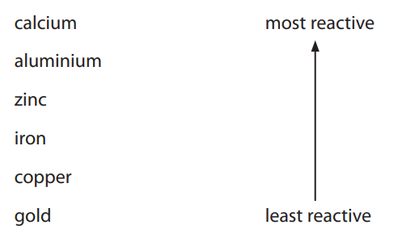
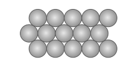

# Exam Questions — Extraction & uses of metals
**2. Inorganic Chemistry: Part 1** · Edexcel IGCSE Chemistry (Modular) (4XCH1) — 24/Unit 1
> Source: [https://www.savemyexams.com/igcse/chemistry/edexcel/modular/24/unit-1/topic-questions/inorganic-chemistry/extraction-and-uses-of-metals/exam-questions/](https://www.savemyexams.com/igcse/chemistry/edexcel/modular/24/unit-1/topic-questions/inorganic-chemistry/extraction-and-uses-of-metals/exam-questions/) · 15 questions · total 92 marks

## Q1 — easy — 1 marks · exam-questions

### 1() — 1 mark — multiple_choice
Which metal is found as an uncombined element in the Earth's crust?
- **A.** Zinc
- **B.** Lithium
- **C.** Lead
- **D.** Platinum

## Q2 — easy — 1 marks · exam-questions

### 1() — 1 mark — multiple_choice
#### Separate: Chemistry Only

Some metals, such as aluminium, are extracted from their ores using electrolysis.

Why are some metals extracted using electrolysis?
- **A.** They are native metals
- **B.** They are more reactive than carbon
- **C.** They have low melting points
- **D.** They conduct electricity

## Q3 — easy — 1 marks · exam-questions

### 1() — 1 mark — multiple_choice
#### Separate: Chemistry Only

Why are alloys harder than the pure metals from which they are made?
- **A.** There are stronger bonds between the atoms
- **B.** The atoms are all the same size
- **C.** The layers of atoms are distorted
- **D.** The properties of each element have combined

## Q4 — easy — 6 marks · exam-questions

### 3((a)) — 1 mark — multiple_choice — from paper 2018 · Specimen 1F
#### Separate: Chemistry Only

Unreactive metals are found as uncombined metals in the Earth’s crust.

Which of the following metals is found uncombined in the Earth’s crust?
- **A.** aluminium
- **B.** gold
- **C.** sodium
- **D.** zinc

### 3() — 3 marks — command: multiple — structured — from paper 2018 · Specimen 1F
When iron oxide is heated with carbon, iron is produced.

i) Complete the word equation for the reaction.

iron oxide + carbon → ............................................ + .......................................

(2)

ii) What happens to the iron oxide during this reaction?

(1)

| ☐ | **A** | the iron oxide burns |
|---|---|---|
| ☐ | **B** | the iron oxide is neutralised |
| ☐ | **C** | the iron oxide is oxidised |
| ☐ | **D** | the iron oxide is reduced |

### 3((c)) — 1 mark — command: give — structured — from paper 2018 · Specimen 1F
Copper ore contains copper carbonate, CuCO3.

In the first stage of the extraction process, the copper carbonate is decomposed by heating to form copper oxide, CuO, and carbon dioxide.

CuCO3 → CuO + CO2

When 100g of copper carbonate is decomposed completely in this way, it is found that the total mass of products is 100g. Give a reason why the starting mass of copper carbonate is always the same as the mass of the products formed.

### 3((d)) — 1 mark — command: give — structured — from paper 2018 · Specimen 1F
#### Separate: Chemistry Only

Zinc can be extracted from its ore by electrolysis or by heating the ore with carbon. Give a reason for the method that is used.

## Q5 — easy — 8 marks · exam-questions

### 1() — 4 marks — command: multiple — structured
#### Separate: Chemistry Only

An alloy of aluminium with magnesium is used for parts of aeroplanes.

i) What is an alloy?

(2)

ii) Explain why the aluminium alloy is stronger than pure aluminium.

(2)

### 2() — 1 mark — command: why — structured
#### Separate: Chemistry Only

Aluminium is extracted by the electrolysis of a molten mixture of its ore (bauxite) and cryolite. Why is aluminium extracted by electrolysis instead of reduction by carbon?

### 3() — 1 mark — command: what — structured
#### Separate: Chemistry Only

What property makes the aluminium alloy suitable for making aeroplane bodies.

Tick (✔) one box.

| Good electrical conductor |   |
|---|---|
| High strength to weight ratio |   |
| Non-toxic |   |
| Good conductor of heat |   |

### 4() — 2 marks — command: calculate — structured
Bauxite contains a high percentage of aluminium oxide. Calculate the percentage by mass of aluminium in aluminium oxide, Al2O3.

(*A*r: Al = 27, O = 16)

## Q6 — medium — 1 marks · exam-questions

### 1() — 1 mark — multiple_choice
#### Separate: Chemistry Only

Which property belongs to low carbon steels?
- **A.** Easily shaped
- **B.** Brittle
- **C.** Resistant to corrosion
- **D.** Very hard

## Q7 — medium — 10 marks · exam-questions

### 5((a)) — 4 marks — command: multiple — structured — from paper 2020 · N2CR
#### Separate: Chemistry Only

This question is about the metal aluminium.

i) Draw a labelled diagram to represent the structure and bonding in a metal.

(2)

ii) Explain why a metal conducts electricity.

(2)

### 5((b)) — 2 marks — command: give — structured — from paper 2020 · N2CR
#### Separate: Chemistry Only

Aluminium is used to make cans for drinks.

Give two properties of aluminium that make it suitable for this use.

### 5((c)) — 4 marks — command: multiple — structured — from paper 2020 · N2CR
Aluminium is extracted from aluminium oxide (Al2O3) by electrolysis.

The electrolyte is aluminium oxide dissolved in molten cryolite.

i) State why aluminium cannot be extracted by heating aluminium oxide with carbon.

(1)

ii) Aluminium is produced at the negative electrode. The ionic half-equation for the reaction is:  Al3+ + 3e− → Al

State why this is a reduction reaction.

(1)

iii) Complete the ionic half-equation for the reaction at the positive electrode.

(2)

............................... O2− → ................................... + .....................................

## Q8 — medium — 1 marks · exam-questions

### 1() — 1 mark — multiple_choice
#### Separate: Chemistry Only

Which two properties make aluminium suitable as the metal used as cans for drinks?
- **A.** Property 1: ductile 
Property 2: good conductor of heat
- **B.** Property 1: good electrical conductor
Property 2: does not react with drink
- **C.** Property 1: low density
Property 2: malleable
- **D.** Property 1: non- toxic
Property 2: cheap to extract

## Q9 — medium — 8 marks · exam-questions

### 9((a)) — 4 marks — command: multiple — structured — from paper 2018 · Ju1F
#### Separate: Chemistry Only

Most metals are extracted from ores found in the Earth’s crust.

The method used to extract a metal from its ore is linked to the reactivity of the metal.

Part of the reactivity series is shown below.

Iron ore contains iron oxide.

Iron is extracted from iron oxide by heating the oxide with carbon.

iron oxide + carbon → iron + carbon dioxide

i) In this reaction

(1)

| ☐ | **A** | carbon is reduced |
|---|---|---|
| ☐ | **B** | iron oxide is neutralised |
| ☐ | **C** | iron oxide is reduced |
| ☐ | **D** | iron is oxidised |

ii) The formula of the iron oxide is Fe2O3.

Calculate the maximum mass of iron that can be obtained from 240 tonnes of iron oxide, Fe2O3.

(relative atomic masses: O = 16, Fe = 56)

(3)

### 9((b)) — 2 marks — command: explain — structured — from paper 2018 · Ju1F
#### Separate: Chemistry Only

Aluminium cannot be extracted by heating its oxide with carbon. Aluminium has to be extracted from its oxide by electrolysis. Explain why.

### 9((c)) — 1 mark — command: predict — structured — from paper 2018 · Ju1F
#### Separate: Chemistry Only

Predict the method that will have to be used to extract calcium from its ore.

### 4() — 1 mark — multiple_choice
#### Separate: Chemistry Only

Which of the following metals can not be extracted from its ore by reduction?
- **A.** Iron
- **B.** Zinc
- **C.** Copper
- **D.** Lithium

## Q10 — medium — 10 marks · exam-questions

### 1() — 2 marks — command: explain — structured
#### Separate: Chemistry Only

The table** **provides information about some metals.

| **Metal** | **Date of discovery** | **Main source** | **Main extraction method** |
|---|---|---|---|
| **Gold** | Known to ancient civilisations | In the Earth's crust | Physical separation |
| **Zinc** | 1500 | Zinc carbonate | Reduction by carbon |
| **Sodium** | 1807 | Sodium chloride | Electrolysis |

Explain why gold is found in its unreacted form, as the metal itself in the Earth.

### 2() — 2 marks — command: explain — structured
#### Separate: Chemistry Only

The equation below shows one of the reactions in the extraction of zinc.

ZnO + C → Zn + CO

Explain why carbon is used to extract zinc.

### 3() — 3 marks — command: explain — structured
#### Separate: Chemistry Only

Sodium is one of the most abundant metals on Earth but was not extracted until 1807.

Explain, as fully as you can, why this is so.

### 4() — 3 marks — command: state — structured
#### Separate: Chemistry Only

The reactivity series of metals contains two non-metals.

State the names of these elements and give** **one reason why they are included.

## Q11 — hard — 10 marks · exam-questions

### 3((a)) — 3 marks — command: multiple — structured — from paper 2020 · Nov2C
#### Separate: Chemistry Only

The box gives the names of some metals.

| calcium | copper | iron | magnesium | silver | zinc |
|---|---|---|---|---|---|

i) Identify the metal from the box that burns with a bright white flame.

(1)

ii) In the Earth, metals are found either in ores or as uncombined elements. Explain which metal from the box is most likely to be found as an uncombined element.

(2)

### 3((b)) — 3 marks — command: explain — structured — from paper 2020 · Nov2C
#### Separate: Chemistry Only

This is the order of reactivity of four metals.

| most reactive | aluminium |
|---|---|
|   | iron |
|   | lead |
| least reactive | copper |

The method used to obtain a metal from its oxide depends on the reactivity of the metal. Two possible methods are

Method 1 heating the metal oxide with carbon

Method 2 electrolysis

Explain which method should be used to obtain lead from lead(II) oxide, PbO. Include an equation for the formation of lead in your answer.

### 3() — 4 marks — command: draw — structured
#### Separate: Chemistry Only

The diagram shows the arrangement of the particles in a pure metal.

Metals are often made into alloys to make them harder.

Explain why alloys are harder than pure metals.

Draw a diagram to support your answer.

## Q12 — hard — 8 marks · exam-questions

### 7((a)) — 3 marks — command: describe — structured — from paper 2021 · N1H
The order of reactivity of copper, magnesium and zinc can be determined by the displacement reactions between these metals and solutions of their salts.

You are provided with

- Samples of the three metals
- Solutions of copper sulfate, magnesium sulfate and zinc sulfate

Describe the experiments that can be done to determine the order or reactivity of these metals by displacement reactions.

### 7((b)) — 2 marks — command: explain — structured — from paper 2021 · N1H
#### Separate: Chemistry Only

Metals can be extracted from ores found in the Earth’s crust.

Explain why aluminium cannot be extracted from its ore by heating with carbon but can be extracted by electrolysis.

### 7((c)) — 1 mark — command: suggest — structured — from paper 2021 · N1H
Titanium is extracted from its ore in several stages.

In the first stage, titanium chloride is formed as a gas.

The gas is cooled to form liquid titanium chloride containing **dissolved **impurities.

Suggest how pure titanium chloride could be separated from the impurities.

### 7((e)) — 2 marks — command: suggest — structured — from paper 2021 · N1H
After this reaction, there is a mixture of the solids magnesium, titanium and magnesium chloride.

Titanium does not react with dilute hydrochloric acid.

Suggest a simple method to separate titanium from the mixture.

## Q13 — hard — 10 marks · exam-questions

### 1() — 2 marks — command: write — structured
Tungsten is a useful metal. It has the chemical symbol W.

One method of extracting tungsten involves heating a tungsten compound, WO3, with hydrogen. Write the balanced symbol equation for this reaction.

### 2() — 1 mark — command: explain — structured
Explain why the reaction in part (a) is described as reduction.

### 3() — 3 marks — command: explain — structured
#### Separate: Chemistry Only

Tungsten alloyed with nickel and copper can be used to make protective covers for electrical sensors and missile guidance systems. Explain why this alloy is stronger than pure tungsten.

### 4() — 4 marks — command: calculate — structured
An ore of tungsten is Scheelite. The composition of this ore is 13.9% of calcium, 63.9% of tungsten and the remainder is oxygen. Calculate the empirical formula for this ore of tungsten.

## Q14 — hard — 10 marks · exam-questions

### 1() — 2 marks — command: explain — structured
#### Separate: Chemistry Only

This question is about titanium.

Titanium is highly valued as a metal due to its high tensile strength, resistance to corrosion and high melting point. It is also as strong as steel but 45% lighter**.**

Titanium is most commonly produced by using the following batch process from its ore, rutile (titanium oxide). This process can take up to 17 days.

1. Titanium oxide reacts with chlorine
2. Titanium chloride is placed in a reactor with magnesium at 900 oC in a sealed container for 3 days
3. The reactor is allowed to cool
4. The titanium and magnesium chloride are separated by hand

Carbon cannot be used in the reactor as a replacement for magnesium, as there is no reaction.

Explain what this suggests about the relative reactivities of carbon, magnesium and titanium.

### 2() — 3 marks — command: show — structured
Titanium reactors produce about 41.67 kg of titanium per hour whereas iron blast furnaces produce about 20 000 tonnes of iron per hour.

Calculate how many **times more** iron is produced per hour. Show your working.

Give your answer to three significant figures.

### 3() — 4 marks — command: explain — structured
#### Separate: Chemistry Only

There are several applications where titanium is used instead of steel. However, the cost of titanium limits its uses.

Explain why titanium costs more than steel to produce.

### 4() — 1 mark — command: explain — structured
#### Separate: Chemistry Only

It is suggested that the titanium end product could be purified by washing it with water to remove the magnesium chloride.

Explain why this suggestion is not suitable.

## Q15 — hard — 7 marks · exam-questions

### 3((b)) — 2 marks — command: multiple — structured — from paper 2011 · Ju31
#### Separate: Chemistry Only

Steel is formed from iron and carbon and is widely used in the construction industry.

i) Explain why steel alloys are used in preference to iron.

(1)

ii) State a use of stainless steel.

(1)

### 3((c)) — 4 marks — command: explain — structured — from paper 2011 · Ju31
#### Separate: Chemistry Only

Both iron and steel have typical metallic structures - a lattice of positive ions and a sea of electrons.

i) Explain why iron and steel have high melting points.

(2)

ii) Explain why, when a force is applied to a piece of steel, it does not break but changes its shape.

(2)

### 3() — 1 mark — command: which — structured
#### Separate: Chemistry Only

Brass is an alloy of two metals, copper and zinc.

Which statement is correct, tick (✔) one box.

| Brass dissolves fully in hydrochloric acid |   |
|---|---|
| Brass has a chemical formula of CuZn |   |
| Brass is formed by a chemical reaction between two metals |   |
| One of the metals in the alloy will dissolve in dilute hydrochloric acid |   |
