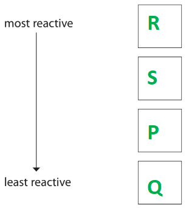
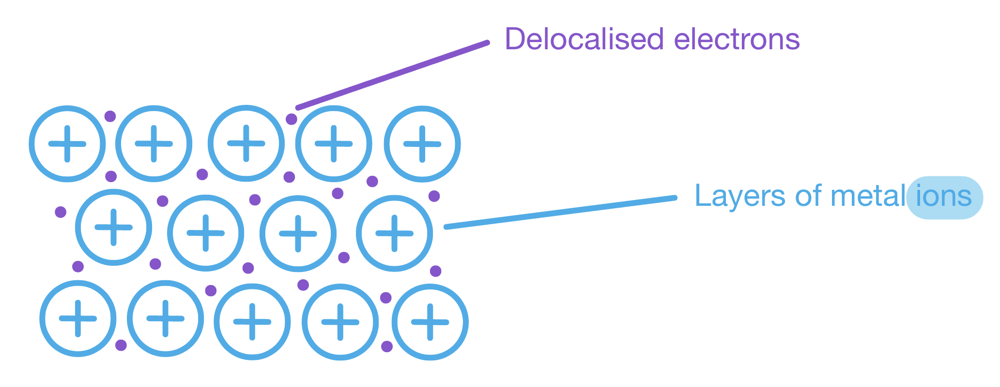
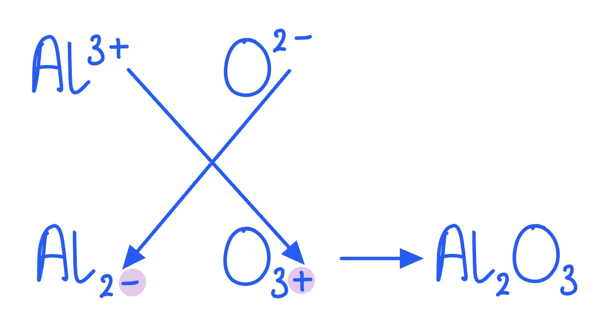

# Mark Schemes — Reactivity series
**2. Inorganic Chemistry: Part 1** · Edexcel IGCSE Chemistry (Modular) (4XCH1) — 24/Unit 1

## Q1 — easy — 9 marks · exam-questions

### 2((a)) — 4 marks
i) The two substances needed for iron to rust are:

- Oxygen / O2  **OR **Air; **[1 mark]**
- Water / H2O; **[1 mark]**

ii) The chemical name for rust is:

- (Hydrated) iron(III) oxide; **[1 mark]**

iii) The type of reaction that occurs when iron rusts is:

- **C** / oxidation; **[1 mark]**

**[Total: 4 marks]**

- *Rusting is the reaction of iron with oxygen, which is oxidation*
- *The reaction / rusting requires both water and oxygen*
- *Most people think that rust is iron oxide but it is hydrated iron(III) oxide more specifically *

  - *This is why iron(II) oxide is not accepted*

### 2((b)) — 5 marks
i) This type of rust prevention is:

- Galvanising / galvanisation; **[1 mark]**

ii) This type of rust prevention continues to protect iron when the layer of zinc is damaged because:

- Zinc is more reactive than iron 
**OR **
Zinc is higher in the reactivity series than iron; **[1 mark]**
- So, zinc reacts / oxidised / corrodes before iron; **[1 mark]**

iii) Two other methods used to prevent iron from rusting are:

Any **two **of the following:

- Painting; **[1 mark]**
- Powder / plastic coating; **[1 mark]**
- Oiling / greasing; **[1 mark]**
- Chromium plating; **[1 mark]**
- Sacrificial protection; **[1 mark]**
- Cathodic protection; **[1 mark]**

**[Total: 5 marks]**

- *For part (ii), talking about zinc rusting loses this mark *
- *The most common methods to prevent iron from rusting are:*

  - *Painting*
  - *Oiling / greasing*
  
    - *Painting / oiling / greasing are barrier methods that prevent oxygen / water getting to the iron*
  - *Galvanising*
  
    - *This uses the higher reactivity of zinc to prevent iron from rusting*
    - *The oxygen will react preferentially with the zinc*

## Q2 — easy — 1 marks · exam-questions

### 1() — 1 marks
**Correct answer: A** — Oxidation

**Final answer:** **The correct answer is A**

- The type of reaction which occurs when iron rusts is Oxidation.
- Iron reacts with oxygen and water to form hydrated iron (III) oxide
- The iron is oxidised so it is therefore an oxidation reaction

## Q3 — easy — 1 marks · exam-questions

### 1() — 1 marks
**Correct answer: D** — Zinc

**Final answer:** **The correct answer is D**

- The metal most suitable for galvanizing iron is Zinc.
- Zinc is used to galvanize iron because it is higher up in the reactivity series
- The iron is coated with a layer of zinc so that ZnCO3 is formed when zinc reacts with oxygen and carbon dioxide in the air thereby protecting the iron
- If the coating is damaged or scratched, the iron is still protected from rusting because zinc preferentially corrodes
- **A** and **B** are incorrect as they are less reactive than iron
- **C** is incorrect as even though sodium is more reactive than iron, sodium reacts vigorously with water so cannot be used

## Q4 — easy — 5 marks · exam-questions

### 1((a)) — 2 marks
Two substances that are needed to cause iron to rust are:

- Oxygen **OR **Air; **[1 mark]**
- Water / water vapour **OR **Moisture; **[1 mark]**

**[Total: 2 marks]**

- *It doesn't matter which way round you give the two substances*
- *Although, air and moisture are accepted answers, it is better to learn that the two substances needed for rusting are oxygen and water*

### 1((b)) — 3 marks
i) The name of a non-metallic element is:

- Iodine; **[1 mark]**

ii) The name of a compound is:

- Methane; **[1 mark]**

iii) The name of the metal that is lowest in the reactivity series is:

- Gold; **[1 mark]**

**[Total: 3 marks]**

## Q5 — easy — 8 marks · exam-questions

### 1() — 2 marks
i) This type reaction is known as

- Redox / displacement; **[1 mark]**

ii) One observation would be:

Any **one** of the following

- Zinc dissolves / disappears; **[1 mark] **
- Blue colour becomes more pale; **[1 mark]**
- Pink solid seen; **[1 mark]**

**[Total: 2 marks] **

- *The colour change is due to the change in solution that occurs*

  - *Copper(II) sulfate is blue and zinc(II) sulfate is colourless*
- *Displacement is when a more reactive metal takes the place of less reactive metal in a compound*

  - *Here zinc has displaced copper*

### 2() — 3 marks
i) The word equation for this reaction is:

- Zinc + hydrochloric acid → Zinc chloride + hydrogen; **[1 mark]**

ii) The test is:

- Lit splint; **[1 mark]**
- Burns with squeaky pop; **[1 mark]**

**[Total: 3 marks] **

- *A metal will react with an acid to form a salt and hydrogen gas*

  - *M**etal + **A**cid → **S**alt + **H**ydrogen *
  - *MASH*
- *The salt will be zinc chloride as hydrochloric acid forms chloride salts*
- *To test for hydrogen gas you must say lit splint, not just squeaky pop*
- *The lit splint is essential in carrying out the test*

  - *Hydrogen is flammable*

### 3() — 2 marks
Two observations for the reaction of alkali metals and water are:

Any **two** of the following

- Metal floats on water / moves around on the surface; **[1 mark]**
- Fizzing; **[1 mark]**
- Metal dissolves / disappears; **[1 mark]**
- (Yellow / orange / lilac) flame; **[1 mark]**

**[Total: 2 marks]**

- *Group 1 metals react with water vigorously to form a hydroxide solution and hydrogen gas *

  - *lithium + water → lithium hydroxide + hydrogen*
- *The way in which they react is the same, but the reactions become more violent or vigorous down the group*
- *So this is why you may see an orange or yellow flame when sodium reacts with water, and a lilac flame if potassium reacts with water*

  - *The reactions of rubidium and caesium are too violent to carry out in a school laboratory safely *
- *Group 1 metals are not very dense so will float on water*

### 4() — 1 marks
**Correct answer: B** — Loss of electrons

**Final answer:** **The correct answer is B**

- The correct definition of oxidation is  Loss of electrons.
- Oxidation is either:

  - The gain of oxygen
  - Loss of electrons
  - Loss of hydrogen
- You can remember oxidation is the loss of electrons by using **OILRIG**

  - **O**xidation **I**s **L**oss (of electrons)** R**eduction **I**s **G**ain (of electrons)
- The lithium atom loses 1 electron to form the Li 1+ ion
- This then forms lithium hydroxide with the OH– ion

  - LiOH

## Q6 — medium — 8 marks · exam-questions

### 3((a)) — 3 marks
i) The metal that could be gold is:

- Q; **[1 mark]**

ii) The reaction between metal R and dilute hydrochloric acid was not done because:

- It would be too explosive/dangerous/unsafe; **[1 mark]**

iii) The correct order of reactivity is:

- All boxes correctly completed showing the order R, S, P, Q; **[1 mark]**

**[Total: 3 marks]**

- *Gold is an unreactive metal*

  - *The only metal that had no reactions was Q*
- *Metal R reacted vigorously with water to produce lots of flammable hydrogen gas*

  - *You can assume that the reaction will be even greater when metal R reacts with dilute hydrochloric acid*
  - *This would make it dangerous / unsafe to perform and potentially explosive *
- *You have to use the information in the table to complete the order of reactivity*

  - *Q has to be the least reactive as it showed no reactions with water or acid*
  - *P is the second least reactive as it slowly formed hydrogen when reacted with acid but had no reaction with water*
  - *You then use the reactions with water to determine that R is the most reactive because it produced hydrogen gas very quickly*
  - *You can apply this logic in reverse to get the order with the most reactive first and work down*

### 3((b)) — 2 marks
i) The name of this method of preventing iron from rusting by coating it with zinc is:

- Galvanising / galvanisation; **[1 mark]**

ii) Another method of preventing iron from rusting is:

Any **one **of the following:

- Paint; **[1 mark]**
- Oil; **[1 mark]**
- Grease; **[1 mark]**
- Sacrificial protection; **[1 mark]** 
*Barrier method is not an accepted answer Galvanising can achieve this mark but only if it was not given in part (i)*

**[Total: 2 marks]**

- *Iron is a commonly available method but it rusts over time in air / water*
- *You need to know the different methods to protect iron*

### 3((c)) — 3 marks
i) The reaction shows that zinc is more reactive than copper by:

- Zinc displacing copper 
**OR **
Zinc takes the oxygen from copper 
**OR **
Zinc replaces / swaps with copper; **[1 mark]**

ii) The substance that is the oxidising agent is:

- Copper(II) oxide / CuO; **[1 mark]**
- (Because) it loses oxygen 
**OR **
(Because) it gives oxygen to zinc 
**OR **
** **It is reduced; **[1 mark]** 
*The second mark is only awarded if copper oxide / CuO is given ****OR**** if copper is given*

**[Total: 3 marks]**

- *A more reactive metal will always take the place of a less reactive metal in a compound*
- *Careful: **The terms reducing agent and oxidising agent are often mixed up*

  - *Reducing agents cause reduction, and they are themselves oxidised*
  - *Oxidising agents cause oxidation, and they are themselves reduced*
- *In this question, the copper(II) oxide loses oxygen / gives its oxygen to the zinc*

  - *The copper(II) oxide is reduced*
  - *The copper(II) causes oxidation*
  - *These are two possible definitions of an oxidising agent*

## Q7 — medium — 1 marks · exam-questions

### 1() — 1 marks
**Correct answer: B** — Magnesium

**Final answer:** **The correct answer is B**

- The species which has been oxidized is Magnesium.
- Oxidation is the loss of electrons
- The magnesium atoms (Mg) lose electrons to form magnesium ions (Mg2+)
- **A** is incorrect as the Fe2+ ions gain electrons so are reduced
- **C** is incorrect as the sulfate ions have not changed and are spectator ions
- **D** is incorrect as he magnesium was oxidised

## Q8 — medium — 8 marks · exam-questions

### 5((a)) — 2 marks
**Two** other variables that must be controlled if the experiment is to be valid.

Any **two** of the following:

- Concentration of copper(II) sulfate solution; **[1 mark]**
- Volume of copper(II) sulfate solution; **[1 mark]**
- Particle size of metal; **[1 mark]**

**[Total: 2 marks] **

- *Control variables must be kept the same in each experiment to ensure that the independent variable can be investigated *
- *If the control variables change then it is not possible to determine the effect of the independent variable*

  - *In this case, the reactivity of the metal*

### 5((b)) — 6 marks
i) The mean temperature increase for metals **G** and **H** are:

- (**G**) 5.5 (°C); **[1 mark]**
- (**H**) 11.5 (°C); **[1 mark]**

ii) The most reactive metal is:

- **H**; **[1 mark]**
- Because of the biggest temperature increase; **[1 mark]**

iii) The metal less reactive than copper is:

- **F**; **[1 mark]**
- Because there is no temperature increase; **[1 mark]**

**[Total: 6 marks] **

- *When calculating the mean temperature increase of **H**, you must discard the anomalous results of 5.5 before calculating the mean*
- *The metal with the highest reactivity will cause the greatest increase in temperature *
- *The metal that is less reactive than copper will not be able to displace it, therefore no reaction will be able to take place and no temperature change will be recorded*

## Q9 — medium — 5 marks · exam-questions

### 6((a)) — 1 marks
The correct answer is:

- **B**; **[1 mark]**

**[Total: 1 mark]**

- *You can determine the order of reactivity using only the reaction with dilute sulfuric acid*

  - *Z is the most reactive as it reacts violently*
  - *X is next as it reacts quickly*
  - *Y is next as it reacts slowly*
  - *W is the least reactive as there is no reaction*
- *Careful:** Be sure that you have got the order the right way around as students often go from least reactive to most reactive and pick option **C** incorrectly*

### 6((b)) — 2 marks
i) The metal that could be copper is:

- W; **[1 mark]**

ii) The metal that could be magnesium is:

- X; **[1 mark]**

**[Total: 2 marks]**

- *Copper is an unreactive metal, which means that it will be the one that does not react with water or dilute sulfuric acid*
- *Magnesium is a reactive metal, which means that it is likely to be one of the metals that react quickly, i.e. X or Z *

  - *Magnesium only reacts with water slowly, i.e. X - it will react quickly with water vapour*

### 6((c)) — 2 marks
Two observations that can be made when an excess of magnesium powder is added to an aqueous solution of copper(ll) sulfate are:

- A brown solid / precipitate forms; **[1 mark]**
- The solution turns colourless / goes paler; **[1 mark]**

**[Total: 2 marks]**

- *You can use the following colours to describe the solid / precipitate that forms*

  - *Pink / pink-brown / red-brown / orange-brown*
  - *But, red and orange on their own are not accepted*
- *Magnesium is more reactive than copper, so it will displace the copper out of the copper sulfate solution*

  - *But, references to magnesium disappearing or heat are ignored*
- *As this reaction happens, the blue colour of the copper sulfate solution will fade to colourless and copper will start to be deposited*

## Q10 — medium — 10 marks · exam-questions

### 3((a)) — 1 marks
The process used to coat iron with zinc is:

- Galvanising / galvanisation; **[1 mark]**

**[Total: 1 mark]**

### 3((b)) — 3 marks
i) The common name for the brown solid is:

- Rust; **[1 mark]**

ii) The names of the two substances that react with the iron to form the brown solid are:

- Oxygen / air / O2; **[1 mark]**
- Water / H2O / moisture; **[1 mark]**

**[Total: 3 marks]**

- *You need to know the conditions required for rusting to occur and how you could investigate these to show this experimentally*

### 3((c)) — 6 marks
i) The meaning of the term **exothermic **is:

- (A reaction which) gives out / produces / releases heat (energy) / thermal energy; **[1 mark]**

ii) This reaction shows that:

- Aluminium / Al is more reactive than iron / Fe 
**OR **
Aluminium / Al is higher in reactivity series than iron / Fe 
**OR **
Reverse arguments; **[1 mark]**
- (Because) aluminium / Al displaces / replaces iron / Fe (from its oxide); **[1 mark]**

iii) The reaction between aluminium and iron(III) oxide is a redox reaction because:

- Aluminium is oxidised AND iron / iron oxide is reduced 
**OR** 
Both oxidation and reduction occur; **[1 mark]**
- (Because) aluminium gains oxygen 
**OR **
(Because) aluminium loses electrons; **[1 mark]**
- Iron oxide / iron loses oxygen  
**OR **
Iron <u>ions</u> / Fe3+ gains electrons; **[1 mark]** 
*Allow correct references to changes in oxidation number for marks 2 and 3*

**[Total: 6 marks]**

- *This reaction is also known as a thermite reaction, renowned for its highly exothermic nature which you may have seen demonstrated*
- *It is an example of a displacement reaction as the more reactive metal (aluminium) is able to displace the less reactive metal (iron) from its compound*

## Q11 — medium — 12 marks · exam-questions

### 6((a)) — 1 marks
The word equation for the reaction of dilute hydrochloric acid with zinc is:

- zinc + hydrochloric acid → zinc chloride + hydrogen 
**OR **
Zn + 2HCl → ZnCl2 + H2; **[1 mark]**

**[Total: 1 mark]**

- *Remember**: **M**etal + **A**cid → **S**alt + **H**ydrogen (think MASH!)*
- *The chemical equation is*

  - *Zn + 2HCl → ZnCl**2** + H**2*

### 6((b)) — 3 marks
The correct temperature readings and temperature change are:

| temperature in °C after adding zinc | 22.4; **[1 mark]** |
|---|---|
| temperature in °C before adding zinc | 17.7; **[1 mark]** |
| temperature change in °C | (+)4.7; **[1 mark]** |

**[Total: 3 marks]**

- *If the readings given in the answer are correct but in the wrong order then you can still achieve 1 mark*
- *Each larger interval on the thermometer represents 1 °C and each smaller interval represents 0.2 °C *

### 6((c)) — 5 marks
i) A polystyrene cup is better than a glass beaker in this investigation because:

Any **two** from:

- Polystyrene is an insulator / is not a good conductor of heat; **[1 mark]**
- (So) reduces / prevents heat loss / keeps heat in; **[1 mark]**
- (So the) temperature rise / change / reading will be closer to true value / more accurate / valid; **[1 mark]**

ii) Three factors that the student should keep constant in this investigation are:

Any **three** from:

- Amount / mass / size / surface area of metal;  **[1 mark]**
- Concentration of acid; **[1 mark]**
- Volume / amount of acid; **[1 mark]**
- (Speed / time of) stirring; **[1 mark]**
- External / room / initial / starting temperature; **[1 mark]**

**[Total: 5 marks]**

- *In any experiment where temperature changes are measured, heat loss with be the biggest source of error*
- *Using a polystyrene cup, insulating a beaker or using a lid are common methods to reduce heat loss which will produce results that are more accurate*
- *When performing experiments, you should only change the independent variable (in this case, the different metals)*
- *You will measure the dependent variable (in this case, the temperature of the mixture*
- *Any other variable must be kept the same to ensure it is a fair test*

### 6((d)) — 3 marks
i) There is no temperature change for copper because:

- No reaction (occurred between copper and hydrochloric acid) 
**OR **
Copper is less reactive than hydrogen; **[1 mark]**

ii) The temperature change for iron could be:

- Any value between 1.5 and 5.0 °C inclusive; **[1 mark]**

iii) The order of reactivity of the five metals is:

| most reactive | magnesium / Mg |
|---|---|
|   | zinc / Zn |
|   | iron / Fe |
|   | tin / Sn |
| least reactive | copper / Cu |

- Order correct; **[1 mark]**

**[Total: 3 marks]**

- *The more reactive the metal is, the more vigorous the reaction between the metal and acid will be and the temperature change will be greater*
- *The observations show that rate of bubbling when iron is used is quicker than tin but slower than zinc*
- *This means that the corresponding temperature change will be somewhere between tin and zinc*
- *When deducing the order of reactivity, you can either look at the rate of bubbling or the temperature change*
- *Make sure you start with the most reactive, as the question prompts you to do - if you start with the least reactive, you will get no marks*

## Q12 — medium — 9 marks · exam-questions

### 4((a)) — 3 marks
i) The chemical name for rust:

- Iron(III) oxide; **[1 mark]**

ii) How a barrier method prevents rusting:

- The iron is coated in paint / oil / grease; **[1 mark]**
- The coat prevents air / water from contact with the iron; **[1 mark]**

**[Total: 3 marks]**

- *Rust is actually a hydrated form of iron(III) oxide, but you wouldn't be penalised if you didn't mention that*
- *Getting the oxidation state wrong would lose you the mark*
- *You would get credit for describing tin or chrome as a barrier material on the surface of the iron, but not zinc*

  - *That is because tin and chromium are less reactive than iron, but as soon as the barrier is damaged rusting can occur*
  - *If a zinc coating is damaged (galvanising) the iron does not rust because zinc is more reactive than iron and sacrificial protection is taking place*

### 4((b)) — 3 marks
i)   Complete the table with all values to the nearest 0.5 cm3:

| reading at start in cm3  | 20.5 |
|---|---|
| reading at end in cm3 | 33.5 **[1 mark]** |
| volume of oxygen used in cm3 | 13.0 **[1 mark]** |

ii)  Why her calculated value is lower than the expected value:

- The reaction was incomplete 
**OR **
Not all of the oxygen reacted with the iron wool 
**OR **
The experiment was not left for long enough; **[1 mark]**

**[Total: 3 marks]**

### 4((c)) — 3 marks
Calculate the percentage by volume of oxygen in air:

- *Volume of oxygen*: 35.5-20.0 = 15.5; **[1 mark]**
- *Percentage of oxygen* = $\frac{15.5}{80.0}\times100$% ; **[1 mark]**
- 19.4%; **[1 mark]**

**[Total: 3 marks]**

- *You will score all three marks for the correct answer even without workings*
- *You should give your answer to the same number of decimal places as the data, but you will still be crediting if you gave 19.38 or 19.375*

## Q13 — medium — 6 marks · exam-questions

### 2((a)) — 2 marks
i) The appearance of the iron nail after several days.

- Red-brown (coating on nail); **[1 mark]**

ii) The main compound in rust is:

- <u>Hydrated</u> iron(III) oxide / ferric oxide; **[1 mark]**

**[Total: 2 marks] **

- *You can also gain marks for saying orange-brown / brown / orange coating *
- *Rust is mainly composed of hydrated iron(III) oxide and you would gain the mark for hydrated iron oxide*
- *Rust is formed when water and oxygen are both present*

  - *Therefore, you must state hydrated iron oxide and not just iron oxide*

### 2((b)) — 4 marks
The iron nail in tube 1 and the iron nail in tube 2 do not rust as:

An explanation that links **four** of the following points:

Tube 1

- Air / oxygen is needed for rusting; **[1 mark]**
- Boiled water does not contain air / oxygen; **[1 mark]**
- Oil keeps air/oxygen out; **[1 mark]**

Tube 2

- Water / moisture is needed for rusting; **[1 mark]**
- Drying agent keeps water / moisture out; **[1 mark]**

**[Total: 4 marks] **

- *You also need to know about the prevention of rusting*
- *Rust can be prevented by coating iron with barriers*

  - *These prevent the iron from coming into contact with water and / or oxygen*
- *However, if the coatings are washed away or scratched, the iron is once again exposed to water and oxygen and will rust*

## Q14 — medium — 1 marks · exam-questions

### 1() — 1 marks
**Correct answer: A** — W, Y, X, Z

**Final answer:** **The correct answer is A**

- The order of reactivity starting with the least reactive is **A.**
- W displays no reaction with water and sulfuric acid so is the least reactive
- Y only reacts slowly with acid
- X reacts slowly with water but strongly with acid
- Z reacts vigorously with both acid and water

## Q15 — hard — 7 marks · exam-questions

### 4((a)) — 3 marks
The percentage of oxygen in the sample of air is:

- (Volume of oxygen =) 100 – 25 
**OR **
75 (cm3); **[1 mark]**
- $\frac{75}{365}\times100$; **[1 mark]**
- = 20.5 (%); [1 mark]

**Alternative method:**

- (Volume of air left =) 265 + 25 
**OR** 
290 (cm3); **[1 mark]**
- $\frac{290}{365}\times100$ **OR** 79.5 (%); **[1 mark]**
- (100-79.5 =) 20.5 (%); **[1 mark]**

**[Total: 3 marks]**

- *A correct answer of 20.5 % with or without working scores 3 marks*
- *Careful**: The total volume of air needs to take into account the volume of air in the syringe **and** the volume of air in the conical flask and connecting tube = 100 + 265 = 365 cm**3*
- *Oxygen is used as it reacts with iron as it rusts, removing the oxygen from the syringe*
- *The volume of oxygen in the air = 100 - 25 = 75 cm**3*
- *To calculate the percentage of oxygen in the air, use the equation:*

`fraction numerator volume space of space oxygen space in space the space air over denominator volume space of space air end fraction space cross times space 100 space equals space 75 over 365 space cross times space 100 space equals space 20.5 percent sign`

- *A common error would be to use the volume of gas in the conical flask and connecting tube instead of the total volume of gas, i.e. divide by 265 instead of 365*

  - *This would give you a final answer of 28.3% and you would be awarded 2 marks for this*

### 4((b)) — 4 marks
i) Painting prevents the iron in car bodies from rusting by:

- Paint provides a barrier; **[1 mark]**
- Which prevents oxygen / water / air getting to / reacting with the iron; **[1 mark]**

ii) Particles of zinc prevent iron in car bodies from rusting even when paint is scratched because:

- Zinc is more reactive / higher in the reactivity series (than iron) 
**OR** 
Zinc is a sacrificial metal; [1 mark]
- Zinc will oxidise / react / corrode instead of / before iron; **[1 mark]**

**[Total: 4 marks]**

- *Careful**: Do not refer to zinc rusting - rusting only applies to the corrosion of iron (or steel, which contains a large percentage of iron)*

## Q16 — hard — 1 marks · exam-questions

### 1() — 1 marks
**Correct answer: D** — Zn (s)  →    Zn2+ (aq) + 2e-

**Final answer:** **The correct answer is D**

- The half equation which correctly shows the change that zinc undergoes is: Zn (s)  →    Zn2+ (aq) + 2e-
- Zinc and copper chloride react as follows:

Zn (s) + CuCl2 (aq) → ZnCl2 (aq) + Cu (s)

- Zinc atoms are oxidised (lose electrons) to form zinc ions
- This is represented by:

Zn (s)  →    Zn2+ (aq) + 2e-

## Q17 — hard — 8 marks · exam-questions

### 5((a)) — 1 marks
The reaction in stage 3 shows that zinc is more reactive than cadmium by:

- Zinc has displaced cadmium; **[1 mark] **

**[Total: 1 mark] **

- *Stage 3 shows the following reaction:*

  - *Cd**2+** (aq) + Zn (s) → Cd (s) + Zn**2+** (aq)*
  
    - *Zinc has been oxidised (lost electrons): Zn**2+** → Zn + 2e**-*
    - *Zinc has donated electrons to Cadmium *
    - *This shows that zinc is the more reactive metal *

### 5((b)) — 4 marks
i) The ionic half-equation for the reaction that occurs is:

- Zn2+ + 2e(–) → Zn; **[1 mark] **

ii) The completed reaction is:

- 2H2O → 4H+ + O2 + 4e–; **[1 mark] **

iii) The pH of the solution surrounding the anode changes during the electrolysis:

- The pH decreases; **[1 mark] **
- (Because,)  the hydrogen ion / H+ (ion) concentration increases; **[1 mark] **

**[Total: 4 marks] **

- *If zinc is deposited at the cathode, zinc ions have been reduced to form zinc metal / atoms*
- *Balancing the ionic equation should be done for atoms and charge*

  - *H**2**O → H**+** + O**2** + e**– **; balance oxygen atoms *
  - *2H**2**O → H**+** + O**2** + e**– **; balance hydrogen atoms*
  - *2H**2**O → 4H**+** + O**2** + e**–** ; balance charge by using electrons*
  - *2H**2**O → 4H**+** + O**2** + 4e**–*
- *The increase in hydrogen ions increases the acidity of a solution *

  - *2H**2**O → 4H**+** + O**2** + 4e**–*

### 5((c)) — 3 marks
Brass is harder than pure copper because:

An explanation that links **three** of the following points:

- The atoms / particles / ions of (pure) copper are the same size; **[1 mark] **
- The layers (of atoms / particles / ions) can easily slide over one another;** [1 mark] **
- The atoms / particles / ions of zinc and copper have different sizes; **[1 mark] **
- This disrupts the layers / structure / arrangement of the copper atoms / particles / ions; **[1 mark] **
- Hence it is more difficult for the layers (of atoms / particles / ions) to slide over one another; **[1 mark]**

**[Total: 3 marks] **

- *When a metal is alloyed the ions become unable to slide past one another as easily as shown below*
- *You may be asked to draw the structure of both a metal and an alloy*
- *If so, make sure you label your diagram * 

## Q18 — hard — 11 marks · exam-questions

### 1() — 3 marks
The balanced symbol equation is:

3MnO2 (s) + 4Al (s) → 3Mn (l) + 2Al2O3 (s)

- Correct formulae for reactants and products;** [1 mark] **
- Correct balancing; **[1 mark]**
- Correct state symbols; **[1 mark] **

**[Total: 3 marks] **

- *You are given the following information in the question*

  - *"Manganese is extracted from manganese oxide, **MnO**2 **, by heating with **aluminium powder**. **Molten manganese** and a **solid product** are formed in this reaction"*
  - *Therefore you can write*
  
    - *MnO**2** (s) + Al (s) → Mn (l) + ? (s)*
- *There are only 2 products formed in the reaction, so the solid product must be aluminium oxide*

  - *The formula of aluminium oxide is Al**2**O**3*
  - *You can work this out by using the swap and drop method shown below*
  - *Remember to remove the charges*

- *Now you have MnO**2** (s) + Al (s) → Mn (l) + Al**2**O**3** (s) which now needs balancing*
- *To balance:*

  - *Start with the O atoms, there are 2 on the left hand side and 3 on the right*
  
    - *3MnO**2** (s) + Al (s) → Mn (l) + 2Al**2**O**3** (s)*
    - *There are now 6 O atoms each side of the equation*
  - *Then you can balance the Mn and Al atoms*
  
    - *3MnO**2** (s) + 4Al (s) → 3Mn (l) + 2Al**2**O**3** (s)*

### 2() — 2 marks
The ionic equation is:

3Mn4+ + 4Al → 4Al3+ + 3Mn

- Correct formulas for reactants and products; **[1 mark] **
- Correct balancing; **[1 mark] **

**[Total: 2 marks] **

- *The best thing to do when writing an ionic equation is to use the symbol equation and then cancel down, this way you're less likely to make a mistake*
- *Write out the full symbol equation*

  - *3MnO**2** (s) + 4Al (s) → 3Mn (l) + 2Al**2**O**3** (s) *
- *Break up into ions - keeping the equation balanced!*

  - *3Mn**4+** + 6O**2-** + 4Al → 3Mn + 4Al**3+** + 6O**2-** *
- *Cancel the spectator ions*

  - *3Mn**4+** + 6O**2-** + 4Al → 3Mn + 4Al**3+** + 6O**2-** *
- *The charge should be the same each side of the equation, in this case, both sides have a charge of 12+*

### 3() — 3 marks
This reaction is a redox reaction because:

- Manganese <u>ions</u> / Mn4+ ions are gaining electrons which is reduction; **[1 mark] **
- Aluminium / Al atoms are losing electrons which is oxidation; **[1 mark] **
- Reduction and oxidation occurring at the same time; **[1 mark] **

**[Total: 3 marks]**

- *Many students would miss the first marking point as they would say manganese is gaining electrons *

  - *Be specific with your terminology, it is the manganese ions that are gaining electrons*
- *Remember: **Oxidation is loss of electrons and reduction is gain of electrons (OILRIG)*
- *The oxidation half equation is:*

  - *Al → Al**3+ **+ 3e**–*
- *The reduction half equation is:*

  - *Mn**4+** + 4e**–** → Mn*

### 4() — 3 marks
To calculate the mass of aluminium required:

- Moles in 200 g of Mn = $\frac{200}{55}$= 3.63 moles; **[1 mark]**
- Moles of Al = $\frac{3.63}{3}\times4$ = 4.84 moles;** [1 mark] **
- Mass of Al = 4.84 x 27 = 131 g to 3 significant figures; **[1 mark] **

**[Total: 3 marks] **

- *You need to use *

  - *Moles = *`fraction numerator mass space open parentheses straight g close parentheses over denominator A subscript straight r end fraction`* and mass = moles x **A**r** *
- *The ratio here is tricky as it is a 3:4 reaction of manganese to aluminium*
- *The easiest way is to divide the number of moles of manganese by 3 and then multiply by 4*
- *This will give you the moles of aluminium to apply to the equation above to calculate its mass*

## Q19 — hard — 8 marks · exam-questions

### 1() — 3 marks
The balanced symbol equation for the reaction including state symbols is:

SnO2 (s) + 2C (s) → Sn (l) + 2CO (g)

- Correct formulae for reactants and products; **[1 mark] **
- Correct balancing; **[1 mark] **
- Correct state symbols; **[1 mark]**

**[Total: 3 marks] **

- *The name tin(IV) oxide tells you the charge of the tin ion in this compound*

  - *(IV) = Sn**4+*
  - *Tin has the symbol Sn, not Tn so double check this on your Periodic Table if are not sure*
  - *This means the formula for tin(IV) oxide is SnO**2** as each oxide ion has a charge of 2-*
  - *So two oxide ions are required to cancel out the 4+ charge of the tin ion *

### 2() — 2 marks
i) Tin ions have been reduced because:

- Tin ions / Sn4+ ions have gained 4 electrons; **[1 mark] **

ii) The half equation is:

- Sn4+ + 4e– → Sn; **[1 mark] **

**[Total: 2 marks] **

- *Reduction is the gain of electrons, in your answer you should specify how many electrons have been gained*
- *The half equation shows that electrons have been gained by the positive tin ion to form tin*

### 3() — 1 marks
**Correct answer: B** — Sn3(PO4)4

**The correct answer is B**** **

- The formula containing tin(IV) ions is  Sn3(PO4)4
- SnCl2 contains one Sn2+ ion and two Cl– ions
- Sn3(PO4)4 contains three Sn4+ and four PO43– ions
- SnSO4 contains one Sn2+ ion and one SO42– ion
- Sn(NO3)2 contains one Sn2+ ion and two NO3– ions

### 4() — 2 marks
The ionic equation is:

2Zn + Sn4+ → 2Zn2+ + Sn

- Correct formulae of reactants and products;** [1 mark]**
- Correct balancing; **[1 mark]**

**[Total: 2 marks] **

- *The overall reaction is:*

  - *2Zn + SnO**2** → 2ZnO + Sn*
- *To write the ionic equation, turn the compounds into ions and keep the reaction balanced*

  - *2Zn + 2O**2–** + Sn**4+** → 2Zn**2+** + 2O**2–** + Sn *
- *Cancel out the spectator ions *

  - *2Zn + 2O**2–** + Sn**4+** → 2Zn**2+** + 2O**2–** + Sn *
- *Check both sides are balanced for atoms and charge*
