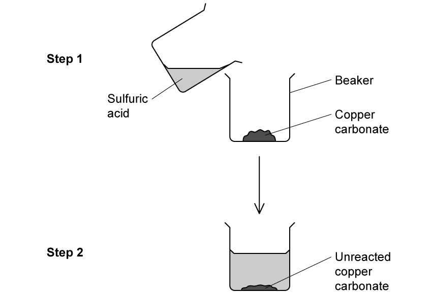
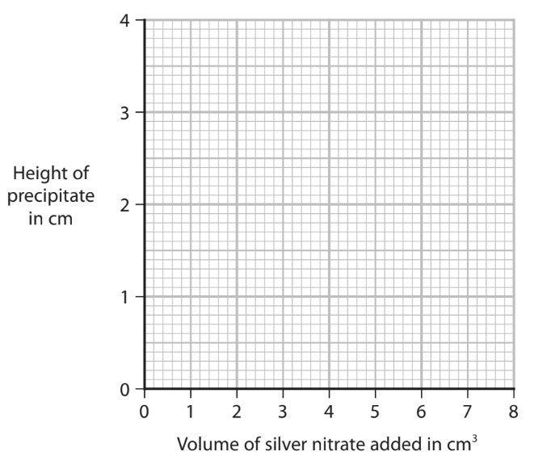
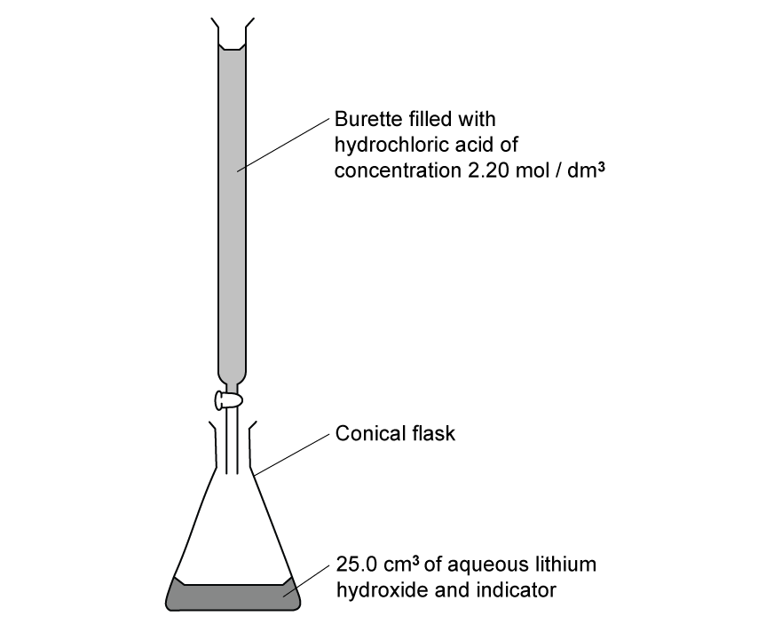

# Exam Questions — Acids, bases & salt preparations
**2. Inorganic Chemistry: Part 1** · Edexcel IGCSE Chemistry (Modular) (4XCH1) — 24/Unit 1
> Source: [https://www.savemyexams.com/igcse/chemistry/edexcel/modular/24/unit-1/topic-questions/inorganic-chemistry/salt-preparations/exam-questions/](https://www.savemyexams.com/igcse/chemistry/edexcel/modular/24/unit-1/topic-questions/inorganic-chemistry/salt-preparations/exam-questions/) · 16 questions · total 119 marks

## Q1 — easy — 1 marks · exam-questions

### 1() — 1 mark — multiple_choice
A neutralisation reaction occurs between ammonia and sulfuric acid.

How does the ammonia act in this reaction?
- **A.** As a proton donor
- **B.** As an electron acceptor
- **C.** As a proton acceptor
- **D.** As a neutron donor

## Q2 — easy — 1 marks · exam-questions

### 1() — 1 mark — multiple_choice
The chemical equation for the preparation of lead(II) sulfate is written below.

Pb(NO3)2  (___) + Na2SO4 (___) → PbSO4 (___) + 2NaNO3 (___)

What are the state symbols for each substance in this reaction?
- **A.** aq, aq, s, aq
- **B.** aq, aq, s, s
- **C.** s, aq, aq, s
- **D.** s, aq, s, aq

## Q3 — easy — 1 marks · exam-questions

### 1() — 1 mark — multiple_choice
A student making copper sulfate crystals used the method below.

Unreacted copper carbonate was left over as it had been added in excess.

What is the reason for adding it in excess and what would step 3 be of this method?
- **A.** Reason: to produce a greater amount of salt crystals
Step 3: filtration
- **B.** Reason: to improve the colour intensity of the crystals
Step 3: crystallisation
- **C.** Reason: to ensure all the acid reacts
Step 3: filtration
- **D.** Reason: to increase the rate of reaction
Step 3: evaporation

## Q4 — easy — 5 marks · exam-questions

### 1((a)) — 4 marks — command: complete — structured — from paper 2020 · N2CR
The diagram shows some pieces of apparatus.

Complete the table by giving the name of each piece of apparatus.

| **Letter** | **Name** |
|---|---|
| **A** |   |
| **B** |   |
| **C** |   |
| **D** |   |

### 1((b)) — 1 mark — multiple_choice — from paper 2020 · N2CR
Which piece of apparatus can be used to measure the volume of a liquid?
- **A.** 
- **B.** 
- **C.** 
- **D.** 

## Q5 — easy — 4 marks · exam-questions

### 1() — 1 mark — multiple_choice
Sulfuric acid can be used to make a soluble salt when reacted with a base.

All acids contain the same ion. What is the formula of this ion?
- **A.** H+
- **B.** OH-
- **C.** S2-
- **D.** Na+

### 2() — 1 mark — multiple_choice
Sulfuric acid reacts with copper(II) oxide to form a salt.  What is the name of the salt formed?
- **A.** Copper(II) chloride
- **B.** Copper(II) nitrate
- **C.** Copper(II) sulfate
- **D.** Copper(II) citrate

### 3() — 1 mark — command: write — structured
The steps below show the method the student carried out to make the salt using the reactants in part b).

The steps shown are not in the correct order.

| **step J** | Leave the solution to cool |
|---|---|
| ** step K** | Filter the mixture and transfer the filtrate to an evaporating basin |
| **step L** | Add copper(II) oxide in excess |
| **step M** | Heat the acid |
| **step N** | Evaporate the water until crystals appear |

Write the steps in the correct order.

Some have been completed for you.

| ** first step** |   |   |   | **last step** |
|---|---|---|---|---|
| **M** |   |   |   | **J** |

### 4() — 1 mark — command: explain — structured
Explain why the copper(II) oxide was added in excess to the sulfuric acid.

## Q6 — medium — 14 marks · exam-questions

### 7((a)) — 8 marks — command: multiple — structured — from paper 2019 · Ju1CR
A student makes some magnesium nitrate crystals from magnesium oxide and dilute nitric acid. The equation for the reaction is

MgO (s) + 2HNO3 (aq) → Mg(NO3)2 (aq) + H2O (l)

i) Give the formula of each ion in magnesium nitrate.

......................................... and ......................................

(2)

ii) A student has a beaker containing dilute nitric acid. Describe a method that she could use to prepare a pure, dry sample of magnesium nitrate crystals from magnesium oxide.

(6)

### 7((b)) — 6 marks — command: multiple — structured — from paper 2019 · Ju1CR
Magnesium nitrate crystals contain water of crystallisation with the formula Mg(NO3)2.6H2O

i) Show by calculation that the relative formula mass of Mg(NO3)2.6H2O is 256.

(1)

ii) Show that the maximum mass of Mg(NO3)2.6H2O that could be made from 0.050 mol of nitric acid is about 6 g.

(3)

iii) The actual mass of crystals that the student obtains is 4.8 g. Calculate the percentage yield of Mg(NO3)2.6H2O in this experiment.

(2)

## Q7 — medium — 9 marks · exam-questions

### 8((a)) — 4 marks — command: multiple — structured — from paper 2019 · Ju1CR
A student investigates the neutralisation reaction between sodium hydroxide and nitric acid. This is her method.

- pour 20 cm3 of sodium hydroxide solution into a polystyrene cup
- record the temperature of the sodium hydroxide solution
- add 5 cm3 of dilute nitric acid to the cup
- stir the mixture and record the highest temperature reached
- add further 5 cm3 portions of dilute nitric acid, recording the highest temperature reached each time, until a total of 40 cm3 of acid has been added

i) Give a word equation for this neutralisation reaction.

(1)

ii) Explain why a polystyrene cup is used rather than a beaker.

(2)

iii) Give a safety precaution that the student should take when using sodium hydroxide solution.

(1)

### 8((b)) — 5 marks — command: multiple — structured — from paper 2019 · Ju1CR
The table shows the student’s results.

| **Total volume of acid in cm****3** | 0 | 5 | 10 | 15 | 20 | 25 | 30 | 35 | 40 |
|---|---|---|---|---|---|---|---|---|---|
| **Temperature of** **reaction mixture in °C** | 20.5 | 22.5 | 24.4 | 26.4 | 28.5 | 28.3 | 27.5 | 26.7 | 26.0 |

i) Plot the results on the grid. Draw a straight line of best fit through the first five points and another straight line of best fit through the last four points. Make sure that the two lines cross.

(3)

ii) The point where the lines cross shows

- the volume of acid needed to exactly neutralise the alkali
- the maximum temperature reached

Use your graph to determine these values.

volume of acid = ...................................................................... cm3 maximum temperature = ............................................... °C

(2)

## Q8 — medium — 6 marks · exam-questions

### 3((a)) — 1 mark — multiple_choice — from paper 2020 · Ja2CR
#### Separate: Chemistry Only

Solutions of silver nitrate and potassium chloride react together to make the insoluble salt, silver chloride. A student uses this method to prepare a sample of silver chloride.

Step 1     add 25 cm3 of silver nitrate solution to a conical flask Step 2     add potassium chloride solution to the flask Step 3     filter off the silver chloride

What term is used for this reaction?
- **A.** neutralisation
- **B.** precipitation
- **C.** redox
- **D.** thermal decomposition

### 3((b)) — 2 marks — command: give — structured — from paper 2020 · Ja2CR
#### Separate: Chemistry Only

Give two more steps that will produce a pure, dry sample of silver chloride.

Step 4 ........................................................................................................ Step 5 ........................................................................................................

### 3((c)) — 1 mark — command: give — structured — from paper 2020 · Ja2CR
Acidified silver nitrate solution is used to test for chloride ions.

Give a reason why hydrochloric acid is not used to acidify silver nitrate solution.

### 3((d)) — 2 marks — command: calculate — structured — from paper 2020 · Ja2CR
The chemical equation for the reaction between solutions of silver nitrate and potassium chloride is

AgNO3(aq) + KCl(aq) → AgCl(s) + KNO3(aq)

A student adds an excess of potassium chloride solution to 25.0 cm3 of 0.100 mol/dm3 silver nitrate solution

Calculate the maximum mass of silver chloride, in grams, that can be produced. [*M*r of AgCl = 143.5]

mass = .............................................................. g

## Q9 — medium — 1 marks · exam-questions

### 1() — 1 mark — multiple_choice
Which equation does **not** show the correct reaction of an acid?
- **A.** copper oxide + hydrochloric acid → copper chloride + water
- **B.** calcium carbonate + nitric acid → calcium nitrate + carbon dioxide
- **C.** potassium hydroxide + sulfuric acid → potassium sulfate + water
- **D.** zinc + sulfuric acid → zinc sulfate + hydrogen

## Q10 — medium — 13 marks · exam-questions

### 6((a)) — 1 mark — command: name — structured — from paper 2020 · N2CR
#### Separate: Chemistry Only

A student wants to prepare sodium chloride crystals from sodium hydroxide solution and dilute hydrochloric acid.

He does a titration to find the volume of dilute hydrochloric acid needed to neutralise the sodium hydroxide solution.

This is his method.

- Add 25.0 cm3 of sodium hydroxide solution to a conical flask
- Add a few drops of phenolphthalein indicator to the conical flask
- Titrate the solution with the hydrochloric acid

Name a suitable piece of apparatus that the student should use to measure 25.0 cm3 of sodium hydroxide solution.

### 6((b)) — 3 marks — command: multiple — structured — from paper 2020 · N2CR
i) Give the colour of the phenolphthalein indicator in sodium hydroxide solution and in hydrochloric acid.

(2)

Colour in sodium hydroxide solution: .................................................

Colour in hydrochloric acid: ....................................................................

ii) Suggest why universal indicator is never used in a titration.

(1)

### 6((c)) — 6 marks — command: describe — structured — from paper 2020 · N2CR
#### Separate: Chemistry Only

The student finds that 21.50 cm3 of hydrochloric acid is needed to neutralise 25.0 cm3 of sodium hydroxide solution.

i) Describe what the student should do next to prepare a pure solution of sodium chloride.

(2)

ii) Describe how the student could obtain dry crystals of sodium chloride from the pure sodium chloride solution.

(4)

### 6((d)) — 3 marks — command: calculate — structured — from paper 2020 · N2CR
#### Separate: Chemistry Only

The student needs 21.50 cm3 of hydrochloric acid to neutralise 25.0 cm3 of sodium hydroxide solution of concentration 0.800 mol / dm3.

The equation for the reaction is

NaOH + HCl → NaCl + H2O

Calculate the concentration, in mol / dm3, of the hydrochloric acid.

concentration = .............................................................. mol / dm3

## Q11 — medium — 1 marks · exam-questions

### 1() — 1 mark — multiple_choice
#### Separate: Chemistry Only

A student was preparing the insoluble salt lead(II) sulfate from solutions of lead(II) nitrate and potassium sulfate.

Why could the student not use lead(II) carbonate to prepare this salt?
- **A.** It has a high melting point
- **B.** It is insoluble in water
- **C.** it is toxic
- **D.** It is flammable

## Q12 — hard — 15 marks · exam-questions

### 10((a)) — 2 marks — command: state — structured — from paper 2021 · Ja1CR
This question is about salts.

Soluble salts can be prepared by the reaction between a metal oxide and an acid.

The equation for this type of reaction is:

metal oxide + acid → salt + water

i) State the name given to this type of reaction.

(1)

ii) State, in terms of protons, what happens in this reaction.

(1)

### 10((b)) — 8 marks — command: multiple — structured — from paper 2021 · Ja1CR
A student is given 50 cm3 of dilute sulfuric acid and a bottle of solid copper(II) carbonate.

i) Describe the method that the student should use to prepare a saturated solution of copper(II) sulfate.

In your answer, refer to the pieces of apparatus that the student should use.

(5)

ii) The student produces dry crystals of hydrated copper(II) sulfate from the saturated solution.

He calculates that 6.40 g of dry crystals should be formed.

The mass of dry crystals he actually obtains is 1.80 g less than he calculated.

Calculate the student’s percentage yield.

Give your answer to one decimal place.

percentage yield = .............................................. %

(3)

### 10((c)) — 5 marks — command: multiple — structured — from paper 2021 · Ja1CR
i) Gypsum is hydrated calcium sulfate.

A sample of gypsum contains 79% of calcium sulfate by mass.

Calculate the value of x in CaSO4.xH2O

[*M*r of CaSO4 = 136   *M*r of H2O = 18]

x = ..............................................

(3)

ii) Describe a test for calcium ions in the sample of gypsum.

(2)

## Q13 — hard — 15 marks · exam-questions

### 6((a)) — 4 marks — command: describe — structured — from paper 2021 · Ja2C
#### Separate: Chemistry Only

This question is about the insoluble salt silver chloride (AgCl). Silver chloride can be made by the reaction between copper(II) chloride and silver nitrate.

Describe how a student could prepare a pure, dry sample of silver chloride starting with copper(II) chloride solution and silver nitrate solution.

### 6((b)) — 5 marks — command: multiple — structured — from paper 2021 · Ja2C
#### Separate: Chemistry Only

A student investigates the quantity of silver chloride produced when different volumes of silver nitrate solution are added to copper(II) chloride solution. This is the student’s method.

- pour 5.0 cm3 of copper(II) chloride solution into a test tube
- add 1.0 cm3 of silver nitrate solution to the test tube
- allow the silver chloride precipitate to settle
- measure the height of the precipitate

The student repeats the method using different volumes of silver nitrate solution. The table shows the student’s results.

| **Volume of silver nitrate** **added in cm****3** | **Height of precipitate** **in cm** |
|---|---|
| 0.0 | 0.0 |
| 1.0 | 0.5 |
| 2.0 | 1.0 |
| 3.0 | 1.2 |
| 4.0 | 2.0 |
| 5.0 | 2.5 |
| 6.0 | 3.0 |
| 7.0 | 3.0 |
| 8.0 | 3.0 |

i) Plot the student’s results.

(2)

ii) Draw two straight lines of best fit, ignoring the anomalous result.

(1)

iii) Suggest a mistake the student made to cause the anomalous result.

(1)

iv) Give a reason why the last three heights are the same.

(1)

### 6((c)) — 6 marks — command: multiple — structured — from paper 2021 · Ja2C
#### Separate: Chemistry Only

The equation for the reaction between copper(II) chloride and silver nitrate is

CuCl2 (aq) + 2AgNO3 (aq) → 2AgCl (s) + Cu(NO3)2 (aq)

A student measures 25.0 cm3 of 0.500 mol / dm3 copper(II) chloride solution and reacts it with silver nitrate solution.

i) Name a piece of apparatus suitable for measuring 25.0 cm3 of copper(II) chloride solution.

(1)

ii) Calculate the maximum mass, in grams, of silver chloride that could be produced.

[*M*r of AgCl = 143.5]

(3)

maximum mass = ............................................................... g

iii) In an experiment using different solutions, the mass of silver chloride produced is 0.744 g.

The maximum mass of silver chloride that could be produced is 0.850 g. Calculate the percentage yield.

(2)

percentage yield = ............................................................... %

## Q14 — hard — 15 marks · exam-questions

### 7((a)) — 3 marks — command: multiple — structured — from paper 2020 · Ja202C
This question is about some Group 2 elements and their compounds.

Calcium reacts with water to produce calcium hydroxide and hydrogen gas.

i) Give the word equation for this reaction.

(1)

ii) State two observations that would be made during this reaction.

(2)

### 7((b)) — 7 marks — command: multiple — structured — from paper 2020 · Ja202C
#### Separate: Chemistry Only

i) Describe how a pure, dry sample of the insoluble salt, barium sulfate, could be made from the two solids sodium sulfate and barium chloride.

(5)

ii) Give an ionic equation for the reaction that occurs. Include state symbols in your equation.

(2)

### 7((c)) — 5 marks — command: multiple — structured — from paper 2020 · Ja202C
#### Separate: Chemistry Only

When magnesium nitrate is heated, magnesium oxide, nitrogen dioxide and oxygen form. The equation for the reaction is

2Mg(NO3)2 (s) → 2MgO (s) + 4NO2 (g) + O2 (g)

i) What is the name for this type of reaction?

(1)

| ☐ | **A** | addition |
|---|---|---|
| ☐ | **B** | combustion |
| ☐ | **C** | decomposition |
| ☐ | **D** | neutralisation |

ii) Calculate the total volume, in dm3, of gas produced at rtp when 7.7 g of magnesium nitrate completely reacts.

[Assume that the molar volume of a gas at rtp is 24 dm3]

[*M**r* of Mg(NO3)2 = 148] Give your answer to two significant figures.

(4)

total volume of gas = ................................................ dm3

## Q15 — hard — 7 marks · exam-questions

### 7() — 2 marks — command: describe — structured — from paper 2013 · Ju31
#### Separate: Chemistry Only

The hydroxides of the Group I metals are soluble in water. Most other metal hydroxides are insoluble in water.

Crystals of lithium chloride can be prepared from lithium hydroxide by titration.

25.0 cm3 of aqueous lithium hydroxide is pipetted into the conical flask.

A few drops of an indicator are added. Dilute hydrochloric acid is added slowly to the alkali until the indicator just changes colour. The volume of acid needed to neutralise the lithium hydroxide is noted.

A neutral solution of lithium chloride, which still contains the indicator, is left. Describe how you could obtain a neutral solution of lithium chloride which does not contain an indicator.

### 2() — 1 mark — command: write — structured
The reaction between hydrochloric acid with lithium hydroxide solution is an example of a neutralisation reaction.

Write the ionic equation, including state symbols, for neutralisation.

### 3() — 2 marks — command: explain — structured
#### Separate: Chemistry Only

Explain why a pipette is used to measure the lithium hydroxide solution but a burette is used to measure the hydrochloric acid.

### 7() — 2 marks — command: calculate — structured — from paper 2013 · Ju31
#### Separate: Chemistry Only

The concentration of the hydrochloric acid was 2.20 mol / dm3. The volume of acid needed to neutralise the 25.0 cm3 of lithium hydroxide was 20.0 cm3. Calculate the concentration of the aqueous lithium hydroxide.

LiOH + HCl → LiCl + H2O

## Q16 — hard — 11 marks · exam-questions

### 1() — 1 mark — multiple_choice
An insoluble solid and dilute nitric acid can react to produce soluble salts.

Copper, copper carbonate and copper oxide are insoluble solids.  Which of these insoluble solids can be used to make a copper salt by reacting the solid with dilute nitric acid?
- **A.** Copper and copper oxide only
- **B.** Copper and copper carbonate only
- **C.** Copper carbonate, copper and copper oxide
- **D.** Copper carbonate and copper oxide only

### 2() — 2 marks — command: write — structured
A student made crystals of magnesium nitrate using nitric acid and magnesium oxide.

Write a balanced symbol equation for the reaction.

### 3() — 3 marks — command: explain — structured
The method the student used to make magnesium nitrate crystals is below.

| a. | Add nitric acid to a beaker |
|---|---|
| b. | Warm the nitric acid |
| c. | Add magnesium oxide to the beaker using a spatula |
| d. | Stir the mixture |
| e. | Repeat steps c and d until some magnesium oxide remains in the beaker |
| f. | Filter the mixture |
| g. | Heat the filtrate to evaporate some solution until crystals start to form |
| h. | Leave the solution to finish crystallising |

Explain why each of the following steps were carried out:

Step b: ...........................................................................................................

Step e: ...........................................................................................................

Step f: ..........................................................................................................

### 4() — 3 marks — command: calculate — structured
A different student used magnesium carbonate and nitric acid to make magnesium nitrate. They wanted to make 11 g of magnesium nitrate.  The equation for the reaction is:

MgCO3 + 2HNO3  →  Mg(NO3)2 + H2O + CO2

Calculate the mass of magnesium carbonate the student should react with dilute nitric acid to make 11.0 g of magnesium nitrate.

(*A*r: H= 1; C = 12; O = 16; N = 14; Mg = 24)

### 5() — 2 marks — command: calculate — structured
The percentage yield of magnesium nitrate was 76.3%.

Calculate the mass of magnesium nitrate the student actually produced.
