# Mark Schemes — Alkanes
**4. Organic Chemistry: Part 1** · Edexcel IGCSE Chemistry (Modular) (4XCH1) — 24/Unit 1

## Q1 — easy — 1 marks · exam-questions

### 1() — 1 marks
**Correct answer: C** — C10H22

**Final answer:** **The correct answer is C.**

- The general formula for alkanes is CnH2n+2
- The number of carbon atoms is doubled and then two added to obtain the number of hydrogen atoms
- C10H22 follows this formula

## Q2 — easy — 1 marks · exam-questions

### 1() — 1 marks
**Correct answer: D** — R and T

**Final answer:** **The correct answer is D.**

- Alkanes are saturated hydrocarbons

  - This means they contain only hydrogen and carbon atoms only, joined together with single bonds
- Compound P - contains C, H and only single bonds

  - This is an alkane
- Compound Q - contains C, H and only single bonds

  - This is an alkane
- Compound R - contains C, H but has a double bond

  - This is not an alkane, it is an alkene
- Compound S - contains C, H and only single bonds

  - This is an alkane
- Compound T - contains C, H and Br

  - This is not alkane, it is a haloalkane
- Compound U - contains C, H but has a double bond

  - This is not an alkane, it is an alkene
- The compounds that are not alkanes are compounds R, T and U

  - The only answer option that contains two non-alkane compounds is option D (R and T)

## Q3 — easy — 1 marks · exam-questions

### 1() — 1 marks
**Correct answer: D** — C4H10

**Final answer:** **The correct answer is D.**

- The correct formula of butane is C4H10
- The names of organic compounds have two parts: the prefix or stem and the end part (or suffix)
- The prefix tells you how many carbon atoms are present in the longest continuous chain in the compound
- But- indicates that four carbon atoms are present
- Alkanes have the general formula CnH2n+2
- C4H10 is therefore the formula of butane

## Q4 — easy — 7 marks · exam-questions

### 3((a)) — 2 marks
The elements combined together in propane are:

- Carbon;** [1 mark]**
- Hydrogen; **[1 mark]**

**[Total: 2 marks]**

- *Use the Periodic Table to look up the symbols for H and C if you do not already know them*
- *You should be able to recall that a hydrocarbon is a compound made from hydrogen and carbon atoms only *

### 3((b)) — 3 marks
i) The word equation for this reaction is:

propane + oxygen → carbon dioxide + water

- Left-hand side / reactants correct;** [1 mark]**
- Right-hand side / reactants correct;** [1 mark]**

ii) Fuels are burned because:

- They release energy;** [1 mark]**

**[Total: 3 marks]**

- *All of the reactants and products for part i) are given to you in the question so you just need to put them into a word equation*

### 3((c)) — 1 marks
**Correct answer: D** — carbon monoxide

**Final answer:** **The correct answer is D.**

- The product formed when there is incomplete combustion of propane is Carbon monoxide
- Incomplete combustion occurs when there is insufficient quantities of oxygen for the fuel to burn in
- As a result carbon monoxide (or sometimes carbon)  is produced instead of carbon dioxide

### 3((d)) — 1 marks
**Correct answer: B** — CH3CH2CH2CH3

**Final answer:** **The correct answer is B**

- The formula of an alkane is CH3CH2CH2CH3
- Alkanes are saturated hydrocarbons so they only contain hydrogen and carbon atoms, and the carbon-carbon bonds are single bonds
- Alkanes have the general formula CnH2n+2
- **B** has the molecular formula C4H10 which obeys the general formula for alkanes
- **A** can be eliminated as it contains an oxygen atom
- **C** can be eliminated as it has a C=C double bond, and is an alkene
- **D** can be eliminated as it is an alkene because it obeys the general formula CnH2n

## Q5 — easy — 7 marks · exam-questions

### 1() — 2 marks
The correct pairings are:

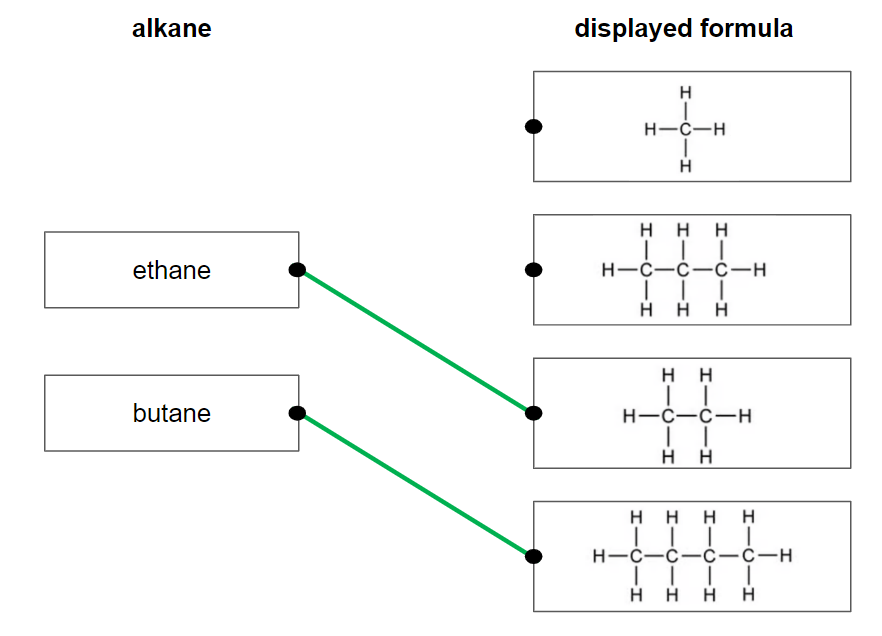

- Ethane with C2H6; **[1 mark]**
- Butane with C4H10; **[1 mark]**

**[Total: 2 marks]**

- *You need to know the names, formulae and structures of the first four alkanes *
- *Remember: **To name organic compounds, the same prefix is used depending on how many carbon atoms there are *

  - *The order is always meth-, eth-, prop-, and but- for 1, 2, 3, 4 carbons respectively *
  - *One way of remembering this is: **M**onkeys **E**at **P**eanut **B**utter*

### 2() — 1 marks
The general formula of alkanes is:

- CnH2n+2; **[1 mark]**

**[Total: 1 mark]**

- *The general formula can be applied to any alkane and allows you to determine the number of hydrogen atoms from a given number of carbon atoms or vice versa*
- *In the case of alkanes, the number of carbon atoms can be doubled and two added to calculate the number of hydrogen atoms it would have*
- *For example, an alkane with 5 carbon atoms will have (2 x 5) + 2 = 12 hydrogen atoms and have the formula C**5**H**12*

### 3() — 1 marks
The type of bond formed between carbon and hydrogen atoms is:

- Covalent; **[1 mark]**

**[Total: 1 mark]**

- *Carbon and hydrogen are non-metals so a covalent bond is formed*

### 4() — 3 marks
i) The correct equation for the reaction is:

ethane + chlorine → chloroethane + hydrogen chloride

- Chlorine identified as the missing reactant; **[1 mark]**
- Chloroethane identified as the missing product; **[1 mark]**

ii) The necessary condition for the reaction is:

- C / ultraviolet radiation; **[1 mark]**

**[Total: 3 marks]**

- *When chlorine reacts with ethane, C**2**H**6**, one of the hydrogen atoms on the ethane molecule is replaced with a chlorine atom to form C**2**H**5**Cl, chloroethane*
- *The hydrogen that was replaced reacts with the other chlorine atom to form hydrogen chloride, HCl:*

  - *C**2**H**6** + Cl**2** → C**2**H**5**Cl + HCl*
- *The reaction occurs in the presence of ultraviolet radiation, which is used to break the bond in the chlorine molecule that can then react with ethane*

## Q6 — medium — 14 marks · exam-questions

### 6((a)) — 6 marks
i) Compound B belongs to:

- The alkanes; **[1 mark]**
- (Because) it has the general formula CnH2n+2; **[1 mark]**

ii) The compound that has the same empirical formula as its molecular formula is:

- D; **[1 mark]**

iii) Isomers are:

- (Compounds with the same molecular formula but) <u>different structural / displayed formulae</u>; **[1 mark]**

Two isomers of F are:

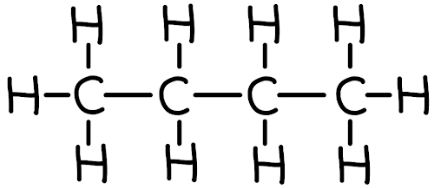

**OR **CH3CH2CH2CH3; **[1 mark]**

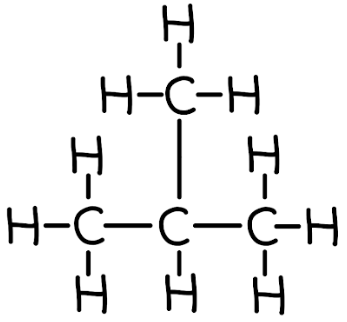

**OR **CH3CHCH3CH3; **[1 mark]**

**[Total: 3 marks]**

- *Homologous series and isomers are two common pieces of knowledge when talking about the alkanes, even at A-level*

  - *You should know what these mean as well as the general formulae of the alkanes (C**n**H**2n+2**) and the alkenes (C**n**H**2n**) *
- *Since you are not given any structures, you can start with the simplest isomer which will be all four carbons in a chain*

  - *Careful: **Don't forget to draw ALL of the hydrogen atoms on - you can check that you have added enough using the C**4**H**10** formula*
- *The next step is to start with the basic chain of four carbons and "snap" one carbon off*

  - *Work out where else can you put it to make a different structure*
  - *The only place is on the second carbon*
  - *Then you add all the hydrogen atoms on again, making sure your final answer matches the C**4**H**10** formula*

### 6((b)) — 4 marks
Compound D can be obtained from crude oil using the industrial process of fractional distillation by:

- Heating / boiling / vapourising crude oil; **[1 mark]**
- Letting the vapours pass into a (fractionating) column / tower;** [1 mark]**
- Fractions / compounds / molecules / hydrocarbons separate because they have different boiling points; **[1 mark]**
- Compound D will collect at top of the (fractionating) column / tower 
**OR **
Compound D will be in the refinery gas fraction; **[1 mark]** 
*Marks can be awarded to a suitably labelled diagram *
*A maximum of 3 marks can be awarded if a laboratory process is described, not an industrial one *
*Only 1 mark can be awarded if cracking is mentioned*

**[Total: 4 marks]**

- *The process of fractional distillation is a common extended response question, so make sure that you are able to describe it fully*
- *Tip: **As the mark scheme says, you can score marks from labelled diagrams so draw one to help focus your answer, as well as use bullet points rather than prose*

### 6((c)) — 4 marks
i) The type of polymer formed from compound C is:

- Addition; **[1 mark]** *Additional is not accepted*

ii) The polymer formed from compound C is:

- Poly(propene) / polypropylene / polypropene; **[1 mark]**

iii) The structure of this polymer is:

- Correct repeat unit (inside the brackets); **[1 mark]**
- Brackets 
**AND **
n outside the brackets on the right 
**AND **
Extension / continuation bonds; **[1 mark]** 
*The second mark is dependent on the first mark being awarded*

**[Total: 4 marks]**

- *Compound C is an alkene*

  - *Alkenes undergo addition polymerisation*
- *Compound C contains 3 carbons in its chain and is, therefore, propene*
- *To name polymers*

  - *Add the word poly in front of the monomer's name*
  - *Propene → polypropene / (poly)propene*
- * To draw polymers:*

  - *Draw the monomer (alkene) in pencil*
  - *Replace the double bond between the carbons with a single bond*
  - *Add brackets around the whole molecule *
  - *Add a small letter n after the brackets, at the bottom, on the right*
  - *Add one bond from the left-hand central carbon sticking out through the bracket on the left*
  - *Add one bond from the left-hand central carbon sticking out through the bracket on the right*

## Q7 — medium — 15 marks · exam-questions

### 5((a)) — 6 marks
i) The completed boxes with the missing information about the alkane with the molecular formula C2H6 is:

| **molecular formula** | C2H6 |
|---|---|
| **name** | Ethane;** [1 mark]** |
| **empirical formula** | CH3; **[1 mark]** |
| **displayed formula** | 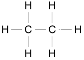  ; **[1 mark]** |

ii) The chemical equation for the complete combustion of the alkane C2H6 is:

- 2C2H6 + 7O2 → 4CO2 + 6H2O; **[1 mark]**

iii) The names of two products of incomplete combustion are:

Any **two** of the following:

- Carbon monoxide / CO; **[1 mark]**
- Carbon / C / soot; **[1 mark]**
- Water / H2O; **[1 mark]**

**[Total: 6 marks]**

- *To name the hydrocarbon:*

  - *C**2**H**6** has two carbons which means that its name starts with eth-*
  - *It fits the general formula of alkanes, C**n**H**2n+2**, so its name ends with -ane*
  - *Combining these, you get ethane*
- *The empirical formula is the simplest whole number ratio of atoms, which for C**2**H**6** is CH**3** *
- *Remember: **Displayed formulae should show all bonds and atoms*

  - *A common mistake for this would be to draw H**3**C-CH**3** *
- *You should practice balancing equations as these often come up in questions, especially combustion equations*
- *This means that you would also benefit from knowing the products of complete and incomplete combustion*

  - *Complete combustion = carbon dioxide and water*
  - *Incomplete combustion = carbon monoxide / carbon and water*
  
    - *Although limited for incomplete combustion, the amount of available oxygen will determine whether carbon monoxide or carbon is formed*

### 5((b)) — 4 marks
i) This reaction is:

- A / addition;** [1 mark]**

ii) The displayed formulae for two different alkenes with the molecular formula C4H8 are:

Any **two **of the following:

| 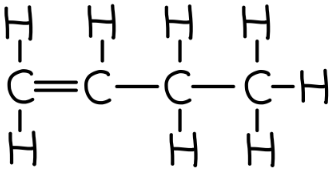  **[1 mark]** | 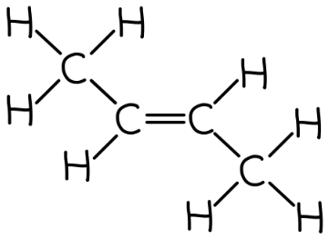  **[1 mark]** |   **[1 mark]** | 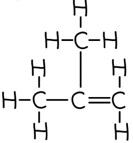  **[1 mark]** |
|---|---|---|---|

iii) The term used for compounds with the same molecular formula but different structural formulae is:

- Isomers / isomerism; **[1 mark]**

**[Total: 4 marks]**

- *C**4**H**8** is the chemical formula of the alkene butene*
- *Bromine will react across the carbon-to-carbon double bond / C=C in an addition reaction to form 1,2-dibromoethane*
- *You should know the definition of an isomer*

  - *Chemicals with the same molecular formula but a different structure / arrangement of atoms*
- *The easiest way to draw two possible isomers of butene is:*

  - *Draw the four carbons in a chain*
  - *Place the carbon-to-carbon double bond first*
  
    - *It can go between carbons 1 and 2 or between carbons 2 and 3*
    - *Placing it between carbons 3 and 4 is the mirror image of carbons 1 and 2*
  - *Add the remaining single bonds to ensure that each carbon has four bonds*
  - *Then, add the eight hydrogen atoms to complete the structures*

### 55((c)) — 5 marks
i) The product of this polymerisation reaction is:

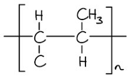

- Correct repeat unit; **[1 mark]** *If the bond between the carbons is a double bond / C=C then no marks can be scored for this question*
- Continuation / extension bonds 
**AND**
** **Brackets 
**AND **
n after the brackets; **[1 mark]**

ii) The environmental problems caused by these two methods of disposal are:

- Polymers / polypropylene will remain in landfill indefinitely;** [1 mark]**
- (Because) they are unreactive / inert / non-biodegradable; **[1 mark]**
- Burning produces toxic / greenhouse gases; **[1 mark] **

**[Total: 5 marks]**

- *To draw polymers:*

  - *Draw the monomer in pencil*
  - *Add brackets around the monomer*
  - *Add an n after the brackets*
  - *Replace the double bond / C=C with a single bond / C-C*
  - *Add continuation / extension bonds coming out of the brackets*
- *You should be aware of the environmental issues of polymer / plastic disposal*

  - *If this polymer contained chlorine, then the third mark would be specifically for toxic gases*

## Q8 — medium — 1 marks · exam-questions

### 1() — 1 marks
**Correct answer: A** — Substitution

**Final answer:** **The correct answer is A.**

- This type of reaction is Substitution
- Alkanes react with halogens in substitution reactions
- A substitution reaction is one where one atom is replaced by another
- In this case, the hydrogen atom is replaced by a bromine atom

## Q9 — medium — 1 marks · exam-questions

### 1() — 1 marks
**Correct answer: C** — Untraviolet radiation

**Final answer:** **The correct answer is C.**

- This reaction occurs in the presence of Ultraviolet radiation
- You should know that the substitution reaction between an alkane and a halogen takes place in the presence of ultraviolet radiation

## Q10 — medium — 7 marks · exam-questions

### 9((a)) — 1 marks
**Correct answer: C** — C2H5

**Final answer:** **The correct answer is C.**

- The empirical formula for butane is C2H5
- The empirical formula is the simplest ratio of atoms of each element in a compound
- To work it out, you need to determine the molecular formula - the actual number of atoms of each element
- Using the diagram, we can see the molecular formula is C4H10
- The simplest ratio is therefore C2H5

### 9((b)) — 1 marks
The estimated boiling point of pentane is:

- 36 °C; **[1 mark]**

**[Total: 1 mark]**

- *Finish the line of best fit from 4 to 6 carbon atoms *
- *Find 5 carbons on the x-axis and determine where this sits on the line of best fit*
- *Read the boiling points from the y axis *
- *It helps to use a ruler to do this so that your answer is as accurate as possible*
- *Answers between 34 and 38 °C would be accepted*

### 3() — 2 marks
i) The name of the other product formed in this reaction is:

- Hydrogen bromide;** [1 mark]**

ii) The molecular formula of bromopentane is:

- C5H11Br; **[1 mark]**

**[Total: 2 marks]**

- *In the presence of UV radiation, one of the hydrogen atoms of pentane will be replaced by a bromine atom:*

  - *C**5**H**12 **+ Br**2** → C**5**H**11**Br + HBr*
- *So, the other product is HBr - hydrogen bromide*
- *Careful**: The question asks for the name so you would not get the mark for giving the formula, HBr*
- *The molecular formula shows the number of each atom within a molecule*
- *As pentane has had one of its hydrogen atoms substituted by bromine, bromopentane will have one less hydrogen atom than pentane and one bromine atom*

### 4() — 3 marks
The displayed formula of the three isomers of bromopentane are:

| **isomer 1** | **isomer 2** | **isomer 3** |
|---|---|---|
| 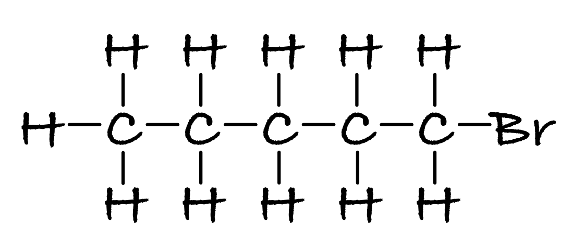 | 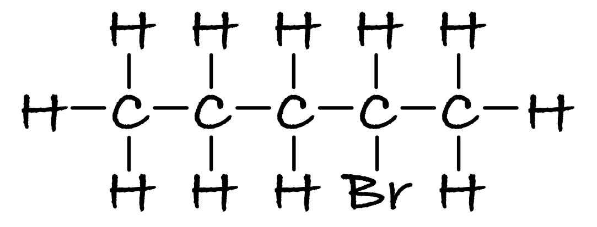 | 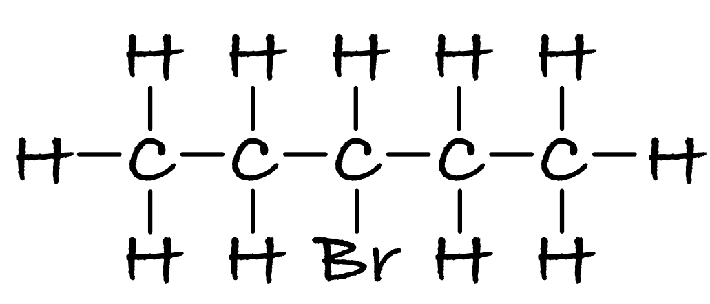 |

- Each correct isomer with all bonds shown; **[1 mark]**

**[Total: 3 marks]**

- *To deduce the isomers, start by drawing the carbon chain with five carbons*
- *Then place the bromine atom on a terminal (end) carbon and add the rest of the hydrogen atoms in*
- *Then repeat, but place the bromine atom on the second carbon atom from the end*
- *Then finally draw the chain with the bromine atom on the middle carbon*
- *Careful**: The formula with a bromine atom on the second carbon and the formula with a bromine atom on the fourth carbon are actually the same isomer, so you would not gain marks if you drew both of these*

  - *Similarly, formulae with a bromine atom on either end are the same isomer*
- *In fact, C**5**H**11**Br will form 8 different isomers as it can exist as a branched chain; you would be given credit for any of these isomers*
- *Some examples of branched chained isomers are:*

  - *1-bromo-2-methylbutane:*

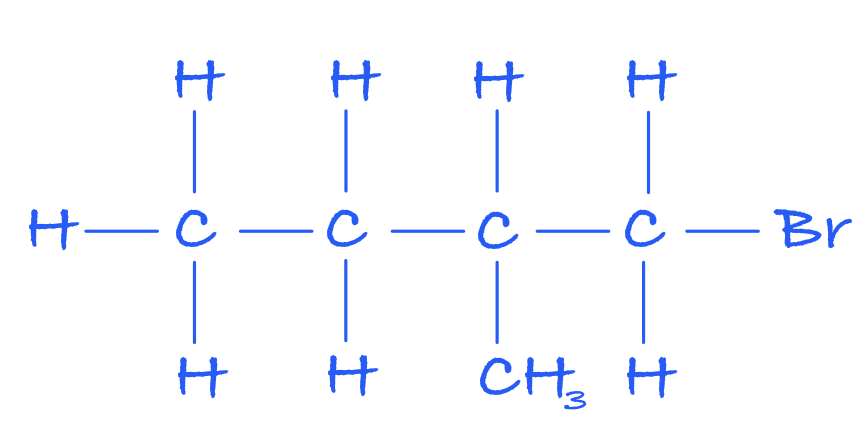

- *1-bromo-3-methylbutane:*

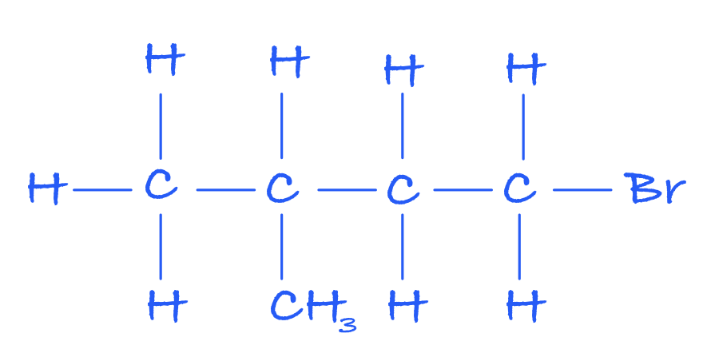

- *1-bromo-2,2-dimethylpropane:*

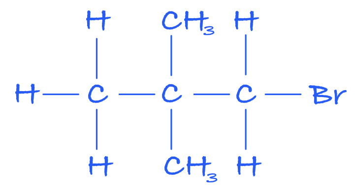

## Q11 — medium — 10 marks · exam-questions

### 1() — 5 marks
i) To calculate the relative formula mass of C4H10 is:

- Add the masses of all atoms:

masses of all atoms = (4 x 12) + (10 x 1)

masses of all atoms = **58 ****[1 mark]**

> **[mark-scheme]**
> ii) The term isomers means:
> 
> - Molecules with the same molecular formula **[1 mark]**
> - But different arrangements of atoms/ different structural/displayed formula** [1 mark]**
> 
> iii) The name of the displayed isomer is:
> 
> - Butane **[1 mark]**

iv) The displayed formula of the other isomer:

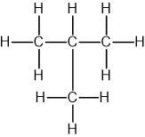

**[1 mark]**

> **[exam-tip]**
> There is no up or down when drawing displayed formulae of organic molecules, so it doesn't matter if you draw the methyl group (-CH3) above or below the three carbons.

### 2() — 5 marks
> **[mark-scheme]**
> The differences in the reactions of C4H10 and C4H8 with bromine:
> 
> Any **five** from (1 mark each):
> 
> - Butane needs UV radiation to react
> - Butane produces bromobutane
> - Butane produces hydrogen bromide (HBr)
> - The reaction with butane involves breaking a C–H bond
> **OR**
> The reaction with butene involves breaking a C=C bond
> - Butane reaction is a substitution
> - Butene produces dibromobutane
> - Butene reaction is an addition
> 
> **[5 marks]**

> **[exam-tip]**
> You can make your answer clearer by writing separate paragraphs for butane and butene.
> 
> You don't need to give the conditions other than UV light, as they are not required in the specification. Although you might be tempted to include the bromine colour change with butene, it won't get you any marks as it is not asked for in the question.
> 
> You can use the formula of the products, e.g., C4H9Br and C4H8Br2, as long as they are correct, or you risk losing the marks.

## Q12 — hard — 7 marks · exam-questions

### 10((a)) — 4 marks
i) Isomers are:

- (Compounds / molecules) with the same molecular formula 
**OR **
(Compounds / molecules) with the same number 
**AND**
** **type of atoms; **[1 mark]** 
*Use of the word element instead of compound / molecule loses a maximum of 1 mark*
- With different structural / displayed formula 
**OR **
With different structures 
**OR **
With a different arrangement of atoms (in space); **[1 mark] ** *One mark is lost if there is a contradiction in the answer, e.g. same displayed formula but different structures*

ii) The displayed formula for another isomer of C5H12 is:

**OR**

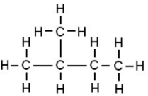

- Correct carbon skeleton; **[1 mark]**
- <u>ALL</u> hydrogen atoms shown 
**AND** 
<u>ALL</u> bonds shown; **[1 mark] **

**[Total: 4 marks]**

- *The easiest way to draw isomers is:*

  - *Draw only the carbons *
  - *Break one carbon off the main chain and place it somewhere else on the main chain*
  - *Add all the hydrogens*

### 10((b)) — 3 marks
i) The complete equation for this reaction is:

C5H12 + Br2 → C5H11Br + HBr

- C5H11Br; **[1 mark]** 
*All subscripts must be correct*
- HBr;** [1 mark]** 
*C**5**H**12** + Br**2** → C**5**H**10**Br**2** + H**2** scores one mark*

ii) This type of reaction is:

- Substitution; **[1 mark]**

**[Total: 3 marks]**

- *This reaction is (free radical) substitution*
- *In this reaction, one hydrogen on the alkane is replaced / substituted by a bromine*
- *This leaves a hydrogen and a bromine, which react / combine to form HBr*

## Q13 — hard — 12 marks · exam-questions

### 7() — 4 marks
i) The volumes are:

- Volume of oxygen left = 35 cm3; **[1 mark]**
- Volume of carbon dioxide formed = 40 cm3; **[1 mark]**

ii) Incomplete combustion of any alkane, particularly in an enclosed space, is dangerous because:

- It forms carbon monoxide; **[1 mark]**
- Which is poisonous / toxic / lethal 
**OR **
Which prevents blood carrying oxygen / effect(s) on haemoglobin; **[1 mark]**

**[Total: 4 marks]**

- *There are two ways of calculating the volume of oxygen and carbon dioxide, one is more complicated than the other*
- *Method 1:*

  - *This uses the concept that equal volumes of gases will occupy the same volume, regardless of what type of gaseous species it is*
  - *So, 10 cm**3** of butane contains the same number of moles as 10 cm**3 **of carbon dioxide or 10 cm**3** of oxygen*
  - *Using the balanced symbol equation, you can see that 1 mole of butane will react with 6.5 moles of oxygen, therefore 10cm**3** of butane will react with 10 x 6.5 = 65 cm**3** of oxygen*
  - *Initially, there was 100 cm**3** of oxygen, therefore the volume of oxygen remaining = 100 - 65 = 35 cm**3*
  - *Also, 1 mole of butane will form 4 moles of carbon dioxide, therefore 10 cm**3** of butane forms 10 x 4 = 40 cm**3** of carbon dioxide*
- **Method 2:**

  - *This involves calculating the number of moles of butane*
  - *In both cases, you have to determine the number of moles of butane and then apply that to determine the volumes of oxygen remaining and carbon dioxide formed*
  - *Moles of butane = *$\frac{10}{24000}$* = 0.000417 mol*
  - *Oxygen remaining*
  
    - *There are 6.5 times more moles of oxygen used in the reaction *$\frac{10}{24000}\times6.5$* = 0.0027803 moles*
    - *This corresponds to 0.0027803 x 24 000 = 65 cm**3** of oxygen that are consumed in the reaction*
    - *Therefore, there are 100 - 65 = 35 cm**3** of oxygen remaining*
  - *Carbon dioxide formed*
  
    - *There are 4 times more moles of carbon dioxide formed in the reaction *$\frac{10}{24000}\times4$* = 0.00167 moles*
    - *This corresponds to 0.00167 x 24 000 = 40 cm**3** of carbon dioxide are formed in the reaction*
- *Incomplete combustion of hydrocarbons releases carbon monoxide (and carbon particulates) *

  - *Carbon monoxide is harmful to the human body but, nowadays, the word harmful is insufficient for any marks, so you have to be more specific by saying that it is poisonous / toxic / lethal or describe the effects that it has on haemoglobin and the blood's ability to transport oxygen*

### 3() — 5 marks
i) An isomer of 1-chloropropane is:

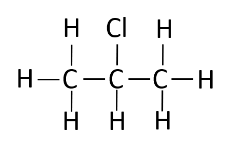

- A correct structure of an isomer e.g. 2-chloropropane;** [1 mark]**

ii) Propane could be made into 1-chloropropane by:

- Adding chlorine; **[1 mark]**
- In the presence of ultraviolet / UV radiation / light; **[1 mark]**

iii) A pure sample of 1-chloropropane is not made in ii) as:

- The reaction could produce 2-chloropropane;** [1 mark]**
- The reaction produces HCl 
**OR** The reaction could produce dichloropropanes;** [1 mark]**

**[Total: 5 marks]**

- *Isomers occur where the molecular formula is the same, but the arrangement of atoms (the structural formula) is different. In this case, the chlorine is placed on the central carbon rather than a terminal one*
- *Alkanes can undergo substitution reactions to form haloalkanes in the presence of ultraviolet radiation which is found in sunlight. This is an example of a photochemical reaction*

  - *Heat or lead tetraethyl can also be used and would both gain a mark, although you are not expected to know either of these*
- *A pure product would mean that there were no alternative products or by-products possible.*

  - *In a substitution reaction, there is always a by-product and are often alternative products*
  - *Only addition reactions give only one product*

### 3() — 3 marks
i) You could show that the reaction mixture contained an iodide ion by:

- Adding silver nitrate / lead nitrate;** [1 mark]**
- Watching for a yellow precipitate; **[1 mark]**

ii) The alcohol formed when 1-chloropropane reacts with water is:

- Propanol / propan-1-ol;** [1 mark]**

**[Total: 3 marks]**

- *The test for halide ions is one of the required ones, and the colours of the precipitates are white for chloride ions, cream for bromide ions and yellow for iodide ions*
- *Dilute nitric acid is also added which removes any unwanted ions which may otherwise form precipitates*

  - *This could lead to a false positive result*
- *The substitution of haloalkanes to form alcohols is not explicitly in the specification, but the question gives you all of the information you need to know and is really about naming an alcohol and identifying that this is another example of a substitution reaction, so the -OH group will go where the -Cl was*

## Q14 — hard — 13 marks · exam-questions

### 1() — 4 marks
Comparing hexane and cyclohexane:

Similarities:

- They are both saturated / only contain carbon-carbon single bonds; **[1 mark]**
- They are both hydrocarbons / contain carbon and hydrogen atoms <u>only</u>; **[1 mark]**

Differences:

- Hexane is in a straight chain 
**AND**
** **cyclohexane is in a ring / circle / is cyclic; **[1 mark]**
- Hexane obeys the general formula of alkanes 
**AND **
cyclohexane does not  
**OR** 
The empirical formula of hexane is C3H7 
**AND**
** **the empirical formula of cyclohexane is CH2;** [1 mark]**

**[Total: 4 marks]**

- *The question asks you to compare, therefore you must give both the similarities and differences between the two structures*
- *You may not have seen a cycloalkane before but don't be put off by seeing something unfamiliar, you need to explain what you see*
- *You will have learnt that the general formula of alkanes is C**n**H**2n+2**, however, this is only true for straight-chain alkanes*
- *As you can see from cyclohexane, this has the formula C**6**H**12** which does not obey the general formula of alkanes that you know*

### 2() — 4 marks
i) The empirical formula of the sample is:

- Divide percentages by relative atomic masses; **[1 mark]** | C | H |
|---|---|
| $\frac{83.72}{12}$ | $\frac{16.28}{1}$ |
| (= 6.977) | (= 16.28) |
- Divide results by smallest value to obtain ratio; **[1 mark]** | C | H |
|---|---|
| $\frac{6.977}{6.977}$ | $\frac{16.28}{6.977}$ | **OR** | 1 | 2.33 |
|---|---|
- Empirical formula: C3H7;** [1 mark]**

ii) The sample is:

- Hexane; **[1 mark]**

**[Total: 4 marks]**

- *You are only told the percentage of carbon, but as you know the structure is an alkane, the remaining 16.28% of the compound must be due to hydrogen*
- *When you find a ratio that is not a whole number ratio, you need to multiply both numbers to obtain whole numbers*
- *In this case, multiply both by 3 which gives a 3 : 7 ratio*
- *Hexane has the formula C**6**H**14** and its empirical formula is C**3**H**7*
- *Cyclohexane has the formula C**6**H**12** and its empirical formula is CH**2*
- *So the sample is hexane*

### 3() — 2 marks
i) The molecular formula of cyclohexane is:

- C6H12; **[1 mark]**

ii) An isomer of cyclohexane is:

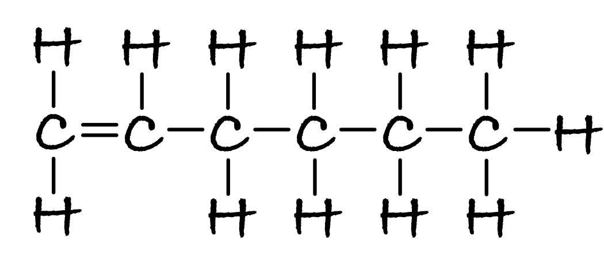

- Correct structure with 6 C atoms and 12 H atoms showing all bonds; **[1 mark]**

**[Total: 2 marks]**

- *The expected answer is the one given above of hex-1-ene, however, there are a number of other accepted answers*
- *You could have drawn the C=C double bond between different carbon atoms in the chain, for example, hex-3-ene:*

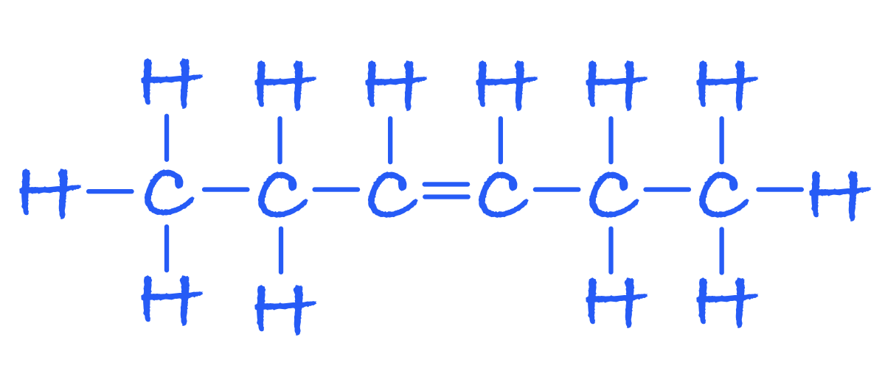

- *Or, had a branched chain alkene, for example, 3-methylpent-2-ene:*

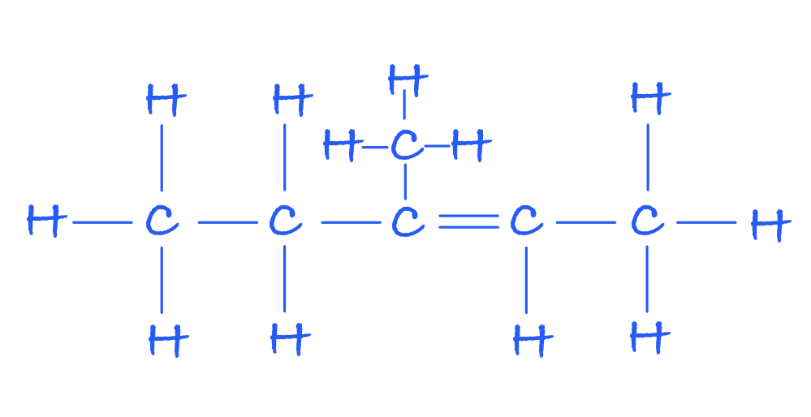

- *Alternatively, you could have drawn another cycloalkane but with branching such as methylcyclopentane:*

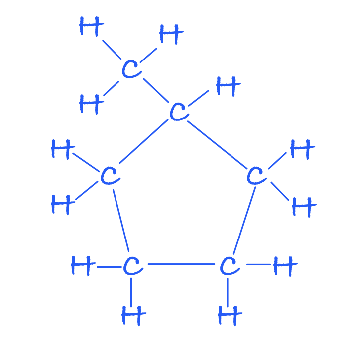

- *Or 1,2-dimethylcyclobutane:*

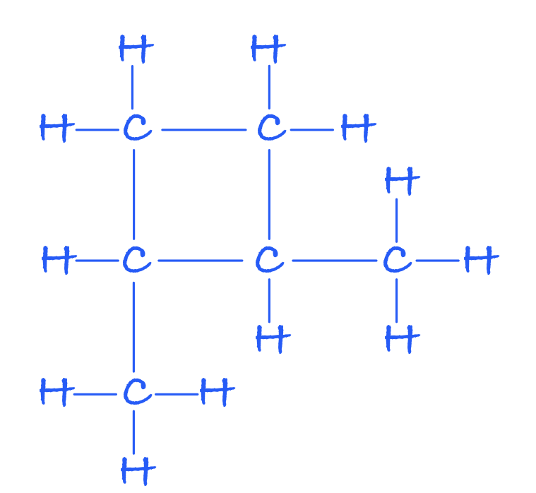

- *This is not an exhaustive list and examiners would check to see if the structure you had drawn includes 6 carbon atoms and 12 hydrogen atoms, with all bonds shown and award a mark accordingly*

### 4() — 3 marks
The names of compounds **X**, **Y** and **Z** are:

- Compound **X**: (1-)chlorohexane; **[1 mark]**
- Compound **Y**: Chlorocyclohexane; **[1 mark]**
- Compound **X**: Cyclohexanol;** [1 mark]**

**[Total: 3 marks]**

- *This question requires you to apply your knowledge and use the information provided as the reaction between chloroalkanes and sodium hydroxide solution is not a reaction that you will have studied*
- *When reacted with chlorine in the presence of UV radiation, alkanes will undergo a substitution reaction whereby one of its hydrogen atoms is replaced by a chlorine atom*
- *The resulting products are hydrogen chloride and a chloroalkane*
- *To name these, simply use 'chloro-' as a prefix to the name of the alkane*
- *You are given the product when chlorohexane is heated with sodium hydroxide solution and you should see from the formula that the chlorine atom has been replaced by -OH thus resulting in the formation of the alcohol, hexan-1-ol*
- *You should then be able to deduce that when chlorohexane is heated with sodium hydroxide solution, the chlorine atom will also be replaced by -OH and cyclohexanol is produced*

## Q15 — hard — 8 marks · exam-questions

### 1() — 1 marks
The molecular formula of heptane is:

- C7H16;** [1 mark]**

**[Total: 1 mark]**

- *You need to know the name and molecular formula for the first 5 alkanes in the homologous series, so you should know that pentane has 5 carbons*
- *The question states that pentane, hexane and heptane are consecutive alkanes, so that means that hexane must have 6 carbon atoms and heptane must have 7*
- *The general formula for alkanes is C**n**H**2n+2**, so if there are 7 carbon atoms, there must be 2 x 7 + 2 = 16 hydrogen atoms*

### 2() — 3 marks
The correct boiling points are:

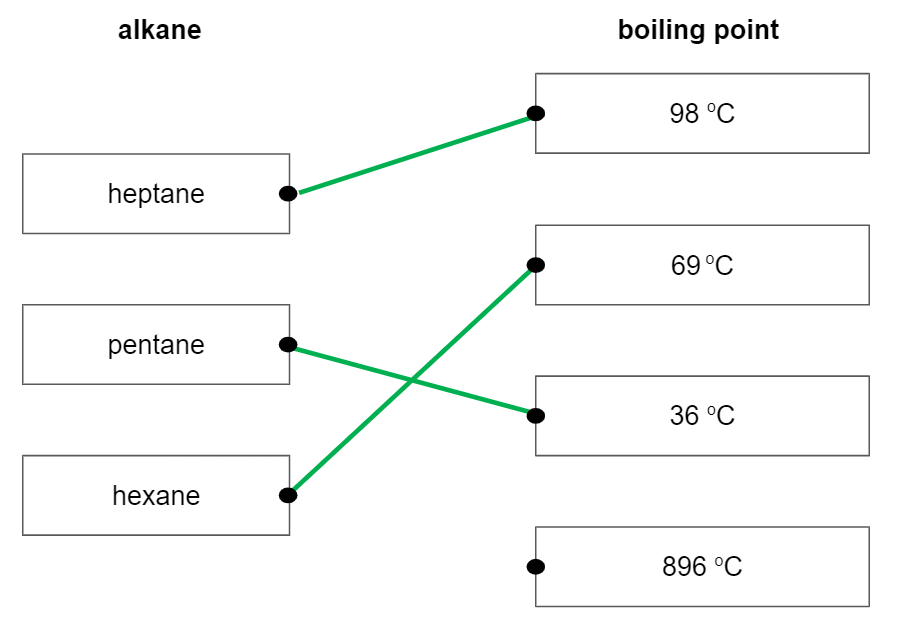

- Each correct pair;** [1 mark]**

**[Total: 3 marks]**

- *You are not expected to know the formulae of hexane and heptane but you can deduce how the structure of the three compounds differs*
- *You are told in part a) that pentane, hexane and heptane are consecutive members of the same homologous series and that pentane has the least number of carbon atoms*
- *The difference in the molecular formula between one member and the next is CH**2*

  - *That means that the formula of hexane has an additional CH**2** compared with pentane and heptane has an additional CH**2** compared with hexane*
- *So, the molecular mass of the alkanes increases from pentane to heptane*
- *As there are more electrons in the structure, there are more intermolecular forces of attraction that need to be overcome when a substance changes state*
- *So larger amounts of heat energy are needed to overcome these forces, causing the compound to have a higher boiling point*
- *You can deduce from this that the boiling point will increase from pentane to heptane*
- *Alkanes are simple molecular structures that have low boiling points as there are weak intermolecular forces of attraction between molecules - a temperature of 896 °C is far too high, so this option can be dismissed*
- *The remaining three boiling points can then be assigned with pentane having the lowest value and heptane having the highest value*

### 3() — 2 marks
The boiling point of ethyne:

Would be expected to be lower than ethane as:

- Ethyne has fewer (atoms and) electrons than ethane 
**OR** 
Ethyne has a lower relative molecular mass than ethane; **[1 mark] **
- The intermolecular forces would be weaker (so the boiling point should be lower); **[1 mark] **

**OR**

Would be expected to be higher than ethane as:

- Ethyne is a linear molecule / only 1 hydrogen on each carbon atom;** [1 mark] **
- The molecules can pack together more closely increasing the strength of the intermolecular forces; **[1 mark] **

**[Total: 2 marks]     **

- *In this question, you do not get a mark for stating whether the boiling point of ethyne is higher or lower than ethane, the marks are for the explanation*
- *The expected response is the first option as you will have learnt that the boiling point of a substance will increase with relative molecular mass*
- *Sometimes predictions in chemistry are not always straightforward, as more than one factor can be involved.*
- *In reality, ethyne has a higher boiling point than ethane*
- *Ethyne does not have as many hydrogen atoms and the molecules can pack more closely together*
- *This means there are more surface area points of contact and the intermolecular forces are slightly stronger than in ethane, leading to a higher boiling point*

### 4() — 2 marks
The dot-and-cross diagram for a molecule of ethyne, C2H2 is:

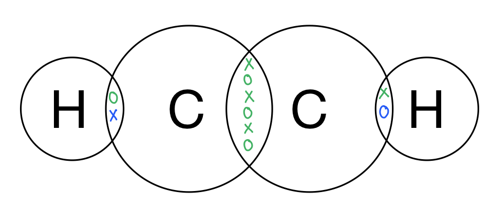

- 2 electrons between each carbon and hydrogen atom; **[1 mark]**
- 6 electrons between the carbon atoms; **[1 mark]**

**[Total: 2 marks]**

- *This is a dot-and-cross diagram that you are unlikely to have come across before, so you need to apply your knowledge to work out where the electrons should be drawn*
- *You should be familiar with the dot-and-cross between carbon and hydrogen atoms from other, simpler structures, such as methane or ethane*
- *Hydrogen needs to share 1 electron to gain a full outer shell, so will  share a pair with a carbon atom*
- *Carbon atoms have 4 electrons in their outer shell, sharing 1 with hydrogen means that it still needs to gain 3 electrons to obtain a full outer shell*
- *Each carbon atom is only bonded with 1 hydrogen atom and 1 carbon atom, so it can only gain these electrons from the other carbon atom*
- *This means that between the 2 carbon atoms, there must be 3 shared pairs of electrons, i.e. 6 electrons*
- *This is also known as a triple bond, which you should be aware of as a nitrogen molecule contains a triple bond*
- *You can use all dots, all crosses, a combination of the dots and crosses or other symbols to represent the electrons*

## Q16 — hard — 9 marks · exam-questions

### 1() — 2 marks
The equation which represents the complete combustion of 1 mole of ethane is:

C2H6 +3½O2 → 2CO2 + 3H2O

- Correct formulae; **[1 mark]**
- Correct balancing; **[1 mark]**

**[Total: 2 marks]**

- *You should know that the complete combustion of alkanes produces carbon dioxide and water, so the unbalanced equation is:*

  - *C**2**H**6** +O**2** → CO**2** + H**2**O*
- *When balancing combustion reactions, balance the carbon atoms first:*

  - *C**2**H**6** + O**2** → **2**CO**2** + H**2**O*
- *Then balance the hydrogen atoms:*

  - *C**2**H**6** + O**2** → 2CO**2** + **3**H**2**O*
- *Finally, balance the oxygen atoms, there are 7 on the right-hand side so on the left-hand side, you need 3½ molecules of oxygen to provide 7 oxygen atoms:*

  - *C**2**H**6** + **3½**O**2** → CO**2** + H**2**O*
- *Often in a balanced equation where fractions exist, the whole equation is multiplied to give a whole number ratio, to show 2 moles of ethane combusting:*

  - * 2C**2**H**6** +7O**2** → 4CO**2** + 6H**2**O*
- *However, in this question, you are asked to give the equation for the complete combustion of **one mole** of ethane, so it needs to be left with 3½ moles of O**2** and 1 mole of ethane*

### 2() — 2 marks
The equation to show the displayed formulae of the reactants and products is:

| 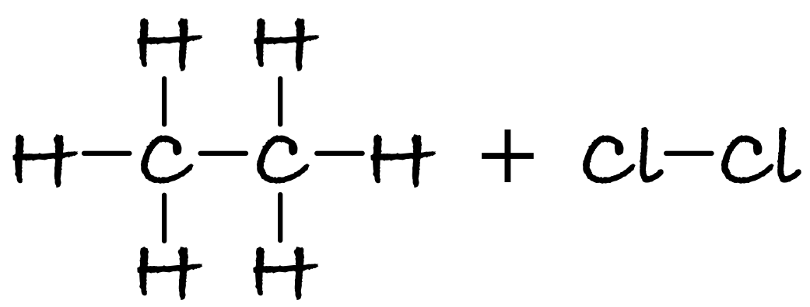 | → | 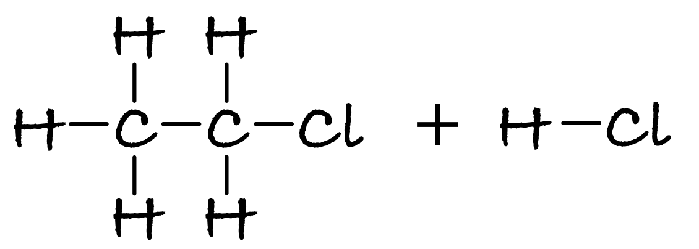 |
|---|---|---|

- Correct displayed formula of reactants;** [1 mark]**
- Correct displayed formula of products; **[1 mark]**

**[Total: 2 marks]**

- *If you did not score either mark, you would be given a mark if you correctly drew the displayed formula of ethane AND chloroethane*
- *Make sure that you show all of the bonds*

### 3() — 3 marks
The bond energy of the C-Cl bond is calculated by:

- Sum of bond broken = 3068 (kJ/mol); **[1 mark]**
- Sum of bonds formed = 2844 (+ C-Cl); **[1 mark]**
- Bond energy = (+)346 (kJ/mol); **[1 mark]**

**[Total: 3 marks]**

- *The most common type of question involving bond energies is to calculate the enthalpy change of reaction*
- *This question gives you the enthalpy change of the reaction, and you need to use this and the bond energies to calculate the bond energy of the C-Cl bond*
- *The sum of the bonds broken, Σ(bonds broken), are:*

  - *(6 x C-H) + (1 x C-C) + (1 x C-Cl) = (6 x 413) + (1 x 347) + (1 x 243) = 3068*
- *The sum of the bonds formed, Σ(bonds made), are:*

  - *(5 x C-H) + (1 x C-C) + (1 x C-Cl) + (1 x H-Cl) = (5 x 413) + (1 x 347) + (1 x C-Cl) + (1 x 432) = 2844 + C-Cl*
- *The enthalpy change is calculated by:*

  - *Enthalpy change = Σ(bonds broken) - Σ(bonds made)*
- *Substituting the values known gives:*

  - *-122 = 3068 - (2844 + C-Cl)*
- *Rearranging gives:*

  - *C-Cl = 3068 - 2844 + 122 = (+)346 kJ/mol*
- *You would score the full three marks for a final answer of 346, but only two marks if your final answer is -346, so take care when rearranging*
- *Remember**: Bond energies will always be positive as they give the energy required to break bonds, which is an endothermic process*

### 4() — 2 marks
The compound which is the most reactive is:

- Chloroethane;** [1 mark]**
- (Because) a C-Cl bond requires less energy to break than C-H;** [1 mark]**

**[Total: 2 marks]**

- *As the question contains the command word 'suggest' you should expect that you will need to apply your knowledge *
- *The only structural difference between ethane and chloroethane is that chloroethane contains a C–Cl bond whereas ethane contains a C–H bond*
- *As the bond energy of the C–Cl bond is 346 kJ/mol but the bond energy is 413 kJ/mol for the C–H bond, the C-–Cl bond will break more easily, making it more reactive*
