# Exam Questions — Alkanes
**4. Organic Chemistry: Part 1** · Edexcel IGCSE Chemistry (Modular) (4XCH1) — 24/Unit 1
> Source: [https://www.savemyexams.com/igcse/chemistry/edexcel/modular/24/unit-1/topic-questions/organic-chemistry/alkanes/exam-questions/](https://www.savemyexams.com/igcse/chemistry/edexcel/modular/24/unit-1/topic-questions/organic-chemistry/alkanes/exam-questions/) · 16 questions · total 114 marks

## Q1 — easy — 1 marks · exam-questions

### 1() — 1 mark — multiple_choice
Which of these formulae is that of an alkane?
- **A.** C6H11
- **B.** C8H16
- **C.** C10H22
- **D.** C12H28

## Q2 — easy — 1 marks · exam-questions

### 1() — 1 mark — multiple_choice
The table shows the displayed formulae of some organic compounds.

Which two are **not **classed as alkanes?
- **A.** R and S
- **B.** S and T
- **C.** P and Q
- **D.** R and T

## Q3 — easy — 1 marks · exam-questions

### 1() — 1 mark — multiple_choice
What is the correct chemical formula of butane?
- **A.** C3H6
- **B.** C3H8
- **C.** C4H8
- **D.** C4H10

## Q4 — easy — 7 marks · exam-questions

### 3((a)) — 2 marks — command: give — structured — from paper 2018 · Specimen 2F
The structure of a molecule of propane is shown as

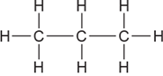

Give the names of the elements combined together in propane.

### 3((b)) — 3 marks — command: multiple — structured — from paper 2018 · Specimen 2F
Propane can burn completely in oxygen to form carbon dioxide and water.

i) Write the word equation for this reaction.

(2)

ii) Propane is a fuel. Give the reason why fuels are burned.

(1)

### 3((c)) — 1 mark — multiple_choice — from paper 2018 · Specimen 2F
Which product is formed when there is incomplete combustion of propane?
- **A.** sulfur dioxide
- **B.** oxygen
- **C.** hydrogen
- **D.** carbon monoxide

### 3((d)) — 1 mark — multiple_choice — from paper 2018 · Specimen 2F
Which of the following is the formula of an alkane?
- **A.** C6H5OH
- **B.** CH3CH2CH2CH3
- **C.** H2C=CHCH2CH3
- **D.** C6H12

## Q5 — easy — 7 marks · exam-questions

### 1() — 2 marks — command: draw — structured
This question is about alkanes.  Draw **one **line from the name of the alkane to the correct displayed formula.

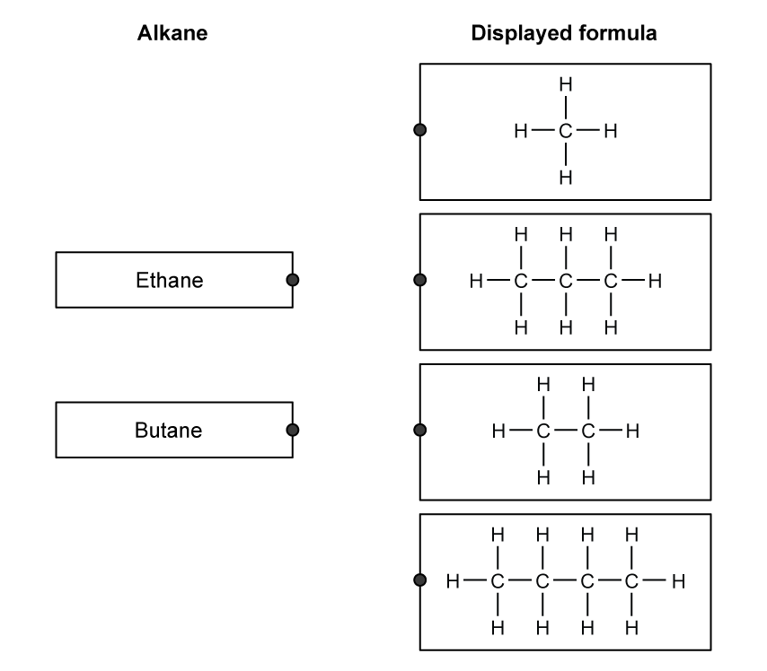

### 2() — 1 mark — command: what — structured
What is the general formula of alkanes?

Tick (**✓**) **one** box. ** **

| CnH2n |   |
|---|---|
| CnH2n+1 |   |
| CnH2n+2 |   |

### 3() — 1 mark — command: what — structured
What type of bond is formed between the carbon and hydrogen atoms in an alkane?

### 4() — 3 marks — command: multiple — structured
Ethane can react with chlorine in a substitution reaction where one of the hydrogen atoms in ethane is replaced by a chlorine atom.

i) Complete the equation for the reaction

ethane + ......................... → ........................................... + hydrogen chloride

(2)

ii) What condition is necessary for this reaction to occur?

(1)

| ☐ | **A** | a catalyst |
|---|---|---|
| ☐ | **B** | 30 °C and no oxygen |
| ☐ | **C** | ultraviolet radiaton |
| ☐ | **D** | none - it will occur at room temperature and pressure |

## Q6 — medium — 14 marks · exam-questions

### 6((a)) — 6 marks — command: multiple — structured — from paper 2020 · Nov1C
The table shows the molecular formulae of six organic compounds, A, B, C, D, E and F.

| **A** | **B** | **C** | **D** | **E** | **F** |
|---|---|---|---|---|---|
| C2H4 | C2H6 | C3H6 | C3H8 | C4H8 | C4H10 |

i) Explain which homologous series compound B belongs to.

(2)

ii) Give the letter of the compound that has the same empirical formula as its molecular formula.

(1)

iii) Compound F exists as two isomers.

Explain what is meant by the term **isomers**.

Include the structures of the two isomers of compound F in your answer.

(3)

### 6((b)) — 4 marks — command: describe — structured — from paper 2020 · Nov1C
Describe how compound D can be obtained from crude oil using the industrial process of fractional distillation.

### 6((c)) — 4 marks — command: multiple — structured — from paper 2020 · Nov1C
Compound C can be used to make a polymer.

i) State the type of polymer formed from compound C.

(1)

ii) Name the polymer formed from compound C.

(1)

iii) Draw the structure of this polymer.

Include the displayed formula of the repeat unit.

(2)

## Q7 — medium — 15 marks · exam-questions

### 5((a)) — 6 marks — command: multiple — structured — from paper 2021 · Ju1C
This question is about alkanes and alkenes.

i) Complete the boxes by giving the missing information about the alkane with the molecular formula C2H6

| **molecular formula** | C2H6 |
|---|---|
| **name** |   |
| **empirical formula** |   |
| **displayed formula** |   |

(3)

ii) Complete the chemical equation for the complete combustion of the alkane C2H6

(1)

...........C2H6 + ...........O2 → ...........CO2 + ...........H2O

iii) Incomplete combustion occurs when the air supply is limited.

Give the names of two products of incomplete combustion.

(2)

### 5((b)) — 4 marks — command: multiple — structured — from paper 2021 · Ju1C
An alkene with molecular formula C4H8 reacts with bromine to form a compound with molecular formula C4H8Br2

i) What is the name of this type of reaction?

(1)

| ☐ | **A** | addition |
|---|---|---|
| ☐ | **B** | decomposition |
| ☐ | **C** | precipitation |
| ☐ | **D** | substitution |

ii) Draw displayed formulae for two different alkenes with the molecular formula C4H8

(2)

| \| **alkene 1** \| \|---\| \|   \| | \| **alkene 2** \| \|---\| \|   \| |
|---|---|

iii) State the term used for compounds with the same molecular formula but different structural formulae.

(1)

### 55((c)) — 5 marks — command: multiple — structured — from paper 2021 · Ju1C
The alkene C3H6 can be polymerised to form the polymer poly(propene).

i) Complete the equation for this polymerisation reaction.

(2)

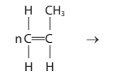

ii) Two ways of disposing of polymers such as poly(propene) are:

- burying them in landfill sites
- burning them to release heat energy

Discuss the environmental problems caused by these two methods of disposal.

(3)

## Q8 — medium — 1 marks · exam-questions

### 1() — 1 mark — multiple_choice
Ethane and bromine can react in the following reaction:

What name is given to this type of reaction?
- **A.** Substitution
- **B.** Addition
- **C.** Dehydration
- **D.** Thermal decomposition

## Q9 — medium — 1 marks · exam-questions

### 1() — 1 mark — multiple_choice
Methane and bromine react to form bromomethane and hydrogen bromide.

What does this reaction occur in the presence of?
- **A.** Infrared radiation
- **B.** Visible light
- **C.** Untraviolet radiation
- **D.** Ozone

## Q10 — medium — 7 marks · exam-questions

### 9((a)) — 1 mark — multiple_choice — from paper 2018 · Specimen 2F
Alkanes are hydrocarbons. The structure of a molecule of butane is shown.

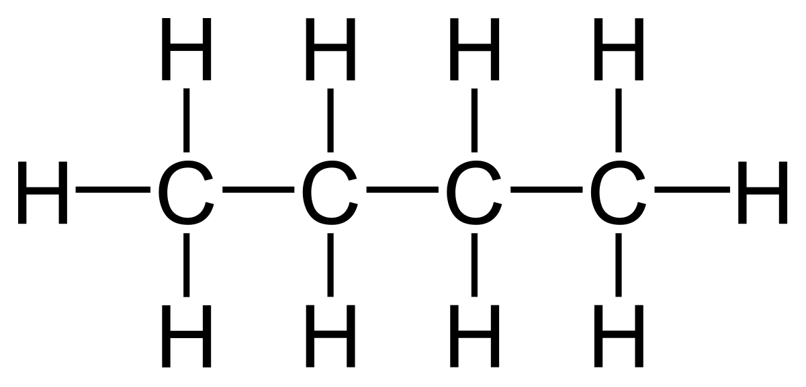

Which of the following is the empirical formula for butane?
- **A.** CH
- **B.** CH2
- **C.** C2H5
- **D.** C4H10

### 9((b)) — 1 mark — command: estimate — structured — from paper 2018 · Specimen 2F
The graph below shows the boiling points of some alkanes plotted against the number of carbon atoms in one molecule of each alkane.

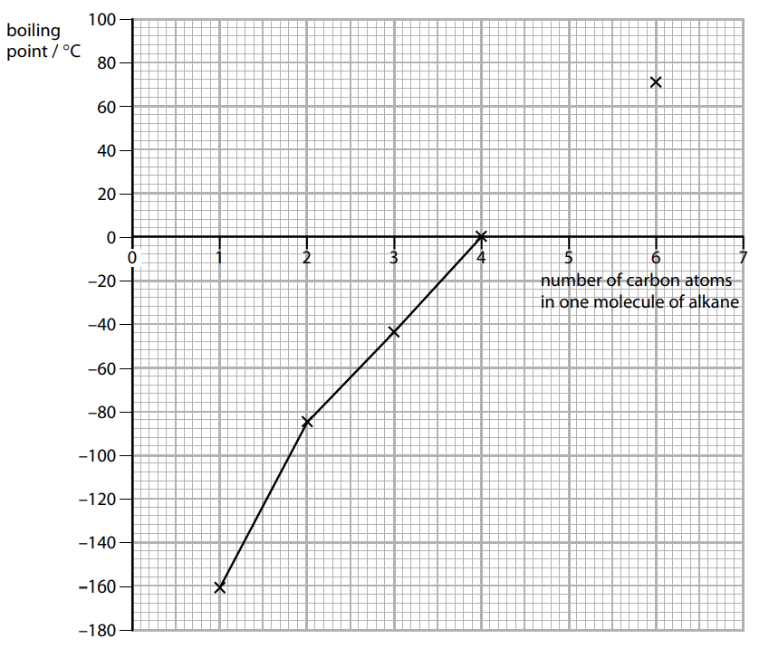

A molecule of pentane contains five carbon atoms. Use the graph to estimate the boiling point of pentane.

boiling point of pentane = .............................................................. °C

### 3() — 2 marks — command: multiple — structured
When pentane reacts with bromine in the presence of ultraviolet radiation, bromopentane is produced.

i) State the name of the other product formed in this reaction.

(1)

ii) Give the molecular formula of bromopentane.

(1)

### 4() — 3 marks — command: draw — structured
Draw the displayed formula of the three isomers of bromopentane.

| **isomer 1** | **isomer 2** | **isomer 3** |
|---|---|---|
|   |   |   |

## Q11 — medium — 10 marks · exam-questions

### 1() — 5 marks — command: multiple — structured
This question is about alkanes and alkenes.

The alkane, C4H10, has two isomers.

i) Calculate the relative formula mass (*M**r*) of C4H10.

*M**r* of C4H10 =<u>                   </u>

[1]

ii) Explain the meaning of the term isomers.

[2]

iii) This is the displayed formula of one of the isomers:

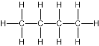

State the name of this isomer.

[1]

iv) Draw the displayed formula of the other isomer.

[1]

### 2() — 5 marks — command: explain — structured
Bromine will react with C4H10 and C4H8.

Explain the difference in the reactions of each substance with bromine.

Refer to the conditions, the products, and the types of reaction involved.

## Q12 — hard — 7 marks · exam-questions

### 10((a)) — 4 marks — command: multiple — structured — from paper 2019 · Ju1C
There are three isomers with the molecular formula C5H12

One of these isomers is pentane.

The displayed formula for pentane is

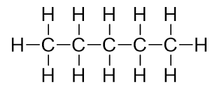

i) State what is meant by the term **isomers**.

(2)

ii) Draw the displayed formula for another isomer of C5H12

(2)

### 10((b)) — 3 marks — command: multiple — structured — from paper 2019 · Ju1C
Pentane reacts with bromine in the presence of ultraviolet radiation.

i) Complete the equation for this reaction.

(2)

C5H12 + Br2 → .................... + ....................

ii) Give the name of this type of reaction.

(1)

## Q13 — hard — 12 marks · exam-questions

### 7() — 4 marks — command: multiple — structured — from paper 2008 · O31
#### Separate: Chemistry Only

The alkanes are generally unreactive. Their reactions include combustion and substitution.

The complete combustion of an alkane gives carbon dioxide and water.

i) 10 cm3 of butane is mixed with 100 cm3 of oxygen, which is an excess. The mixture is ignited. What is the volume of unreacted oxygen left and what is the volume of carbon dioxide formed?

C4H10 (g) + 6.5O2 (g) → 4CO2 (g) + 5H2O (l)

Volume of oxygen left = .................................................. cm3

Volume of carbon dioxide formed = .................................................. cm3

(2)

ii) Why is the incomplete combustion of any alkane dangerous, particularly in an enclosed space?

(2)

### 3() — 5 marks — command: multiple — structured — from paper 2012 · Oc32
Many organic compounds which contain a halogen have chloro, bromo or iodo in their name.

The following diagram shows the structure of 1-chloropropane.

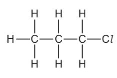

i) Draw the structure of an isomer of this compound.

(1)

ii) Describe how 1-chloropropane could be made from propane.

(2)

iii) Suggest an explanation why the method you have described in (ii) does not produce a pure sample of 1-chloropropane.

(2)

### 3() — 3 marks — command: multiple — structured — from paper 2012 · Oc32
#### Separate: Chemistry Only

Organic halides react with water to form an alcohol and a halide ion.

CH3–CH2–I + H2O → CH3–CH2–OH + I–

i) Describe how you could show that the reaction mixture contained an iodide ion.

(2)

ii) Name the alcohol formed when 1-chloropropane reacts with water.

(1)

## Q14 — hard — 13 marks · exam-questions

### 1() — 4 marks — command: compare — structured
An alkane containing six carbon atoms can exist as a number of different structures. Two of these structures are shown below.

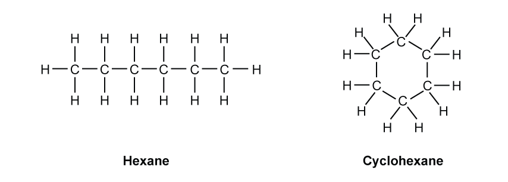

Compare the structures of hexane and cyclohexane.

### 2() — 4 marks — command: multiple — structured
A sample of one of these structures was found to contain 83.72% carbon.

i) Calculate its empirical formula.

Show your working.

(3)

ii) Dedeuce whether the sample was hexane or cyclohexane.

(1)

### 3() — 2 marks — command: multiple — structured
i) Give the molecular formula of cyclohexane.

(1)

ii) Draw the displayed formula of an isomer of cyclohexane.

(1)

### 4() — 3 marks — command: give — structured
In the presence of ultraviolet radiation, hexane will react with chlorine to form hydrogen chloride and another compound, **X**. Compound **X** will undergo a further substitution reaction when heated with sodium hydroxide solution to form sodium chloride and a compound with the formula CH3(CH2)5OH.

Cyclohexane will also react with chlorine in the presence of ultraviolet to form hydrogen chloride and compound **Y. **When heated with sodium hydroxide solution, compound **Y** will undergo a further substitution reaction to form sodium chloride and another product, **Z**. Give the names of compounds **X**, **Y** and **Z**.

| Compound **X** | ................................................. |
|---|---|
| Compound **Y** | ................................................. |
| Compound **Z** | ................................................. |

## Q15 — hard — 8 marks · exam-questions

### 1() — 1 mark — command: suggest — structured
Three consecutive straight-chain members of the same homologous series are pentane, hexane and heptane.

Pentane is the compound containing the least number of carbon atoms.

Suggest the molecular formula of heptane.

### 2() — 3 marks — command: draw — structured
Draw one line from each alkane to its boiling point.

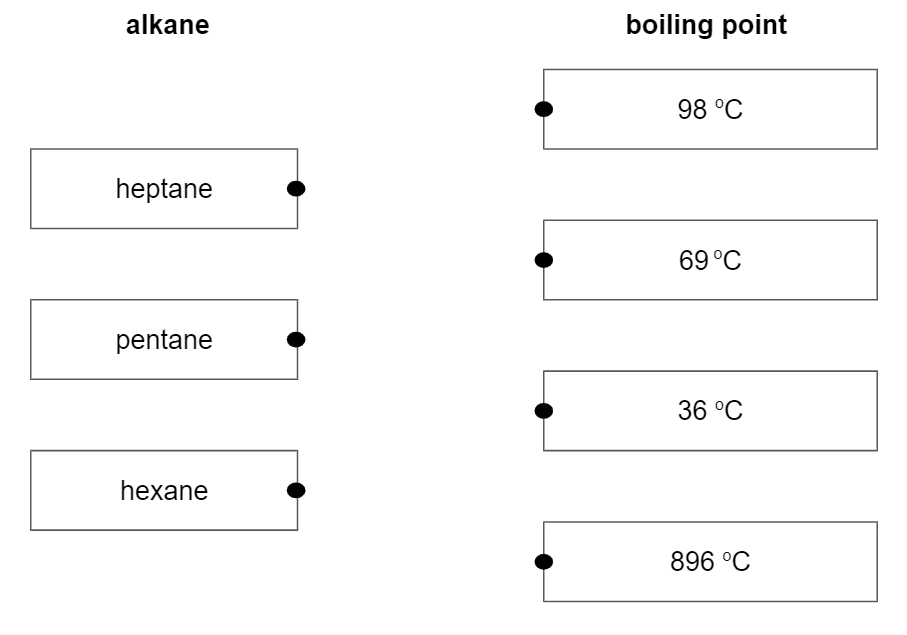

### 3() — 2 marks — command: justify — structured
Alkynes are hydrocarbons with the general formula CnH2n-2. The alkyne containing 2 carbon atoms is ethyne, C2H2.

State, with a reason, whether the boiling point of ethyne would be expected to be higher or lower than the boiling point of ethane, C2H6.

### 4() — 2 marks — command: complete — structured
Complete the dot-and-cross diagram for a molecule of ethyne, C2H2.

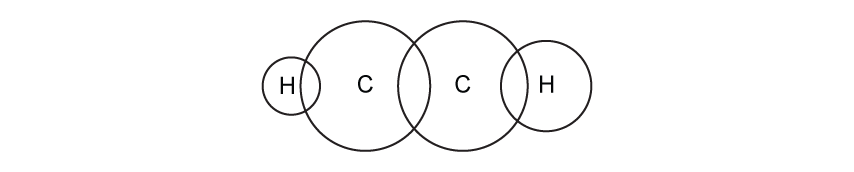

## Q16 — hard — 9 marks · exam-questions

### 1() — 2 marks — command: write — structured
This question is about the reactions of the gas ethane, C2H6.

Write the equation which represents the complete combustion of 1 mole of ethane.

### 2() — 2 marks — command: rewrite — structured
Ethane will react with chlorine in the presence of ultraviolet radiation to form chloroethane and hydrogen chloride.

C2H6 (g) + Cl2 (g) → C2H5Cl (g) + HCl (g)

Rewrite this equation to show the displayed formulae of the reactants and products.

### 3() — 3 marks — command: calculate — structured
#### Separate: Chemistry Only

The enthalpy change of this reaction is -122 kJ/mol.

Use the bond energy data in the table below to calculate the bond energy of the C-Cl bond.

| **Bond** | **Bond energy (kJ/mol)** |
|---|---|
| C – H | 413 |
| C – C | 347 |
| H – Cl | 432 |
| Cl – Cl | 243 |

bond energy ........................................................ kJ / mol

### 4() — 2 marks — command: suggest — structured
#### Separate: Chemistry Only

Use your answer from part c) to suggest which compound, ethane or chloroethane, is the more reactive. Explain your answer.
