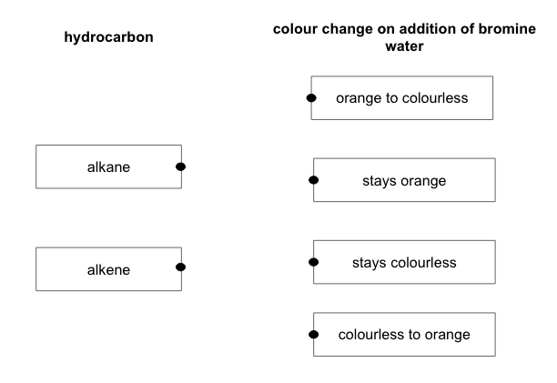
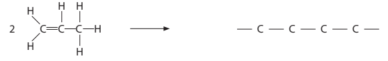
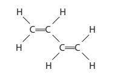
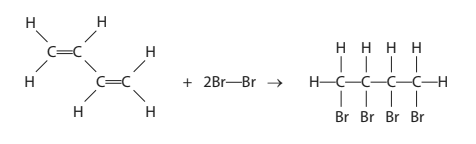
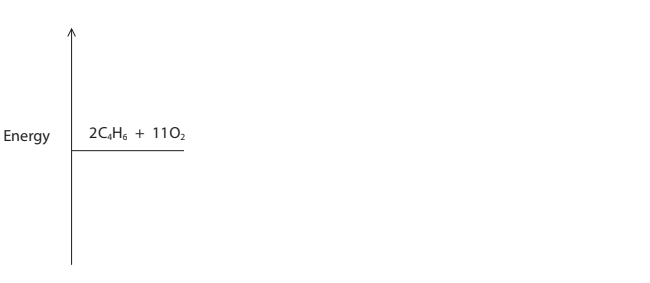
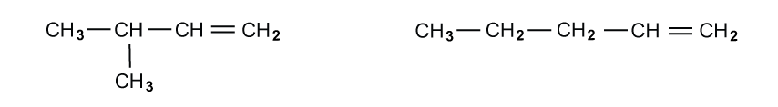

# Exam Questions — Alkenes
**4. Organic Chemistry: Part 1** · Edexcel IGCSE Chemistry (Modular) (4XCH1) — 24/Unit 1
> Source: [https://www.savemyexams.com/igcse/chemistry/edexcel/modular/24/unit-1/topic-questions/organic-chemistry/alkenes/exam-questions/](https://www.savemyexams.com/igcse/chemistry/edexcel/modular/24/unit-1/topic-questions/organic-chemistry/alkenes/exam-questions/) · 16 questions · total 127 marks

## Q1 — easy — 1 marks · exam-questions

### 1() — 1 mark — multiple_choice
Which of the following molecules is an alkene?
- **A.** C6H10
- **B.** C4H10
- **C.** C5H10
- **D.** C6H14

## Q2 — easy — 1 marks · exam-questions

### 1() — 1 mark — multiple_choice
Bromine water is an orange-brown solution.

When shaken with bromine water, which of the following compounds would cause the solution to decolourise?
- **A.** C3H8
- **B.** C9H20
- **C.** C6H16
- **D.** C4H8

## Q3 — easy — 1 marks · exam-questions

### 1() — 1 mark — multiple_choice
The displayed formula of alkene **Y** is shown below:

What is the name of alkene **Y**?
- **A.** Ethene
- **B.** Propene
- **C.** Butene
- **D.** Pentene

## Q4 — easy — 7 marks · exam-questions

### 1() — 2 marks — command: give — structured
The structures of an alkane and an alkene are shown below.

Give two differences between an alkane and an alkene.

### 2() — 2 marks — command: draw — structured
To distinguish between alkanes and alkenes, bromine water can be added.

Draw one line from each hydrocarbon to give the colour change that would be observed if bromine water was added.

### 3() — 1 mark — command: what — structured
What is the general formula for alkenes?

### 4() — 2 marks — command: draw — structured
Draw the structure of propene.

## Q5 — easy — 4 marks · exam-questions

### 1() — 1 mark — command: tick — structured
This question is about the reactions of alkenes.

Which substance is an alkene?

Tick (**✓**) one box.

| C5H12 |   |
|---|---|
| C7H14 |   |
| C12H20 |   |

### 2() — 1 mark — command: give — structured
Alkenes are produced from the cracking of long chain hydrocarbons

Give one use of the alkenes produced by this reaction.

### 3() — 1 mark — multiple_choice
Ethene can react with bromine due to the presence of the C=C double bond in ethene.

What is the correct formula of the product?
- **A.** C2H2Br2
- **B.** C2H4Br2
- **C.** C2H6Br2
- **D.** C2H5Br

### 4() — 1 mark — multiple_choice
What type of reaction occurs when alkenes react with bromine?
- **A.** addition
- **B.** substitution
- **C.** decompostion
- **D.** neutralization** **

## Q6 — medium — 14 marks · exam-questions

### 3((a)) — 4 marks — command: complete — structured — from paper 2020 · Nov1CR
This question is about alkenes and alkanes.

Complete the table by giving the missing information about the alkene with the molecular formula C3H6

| ** Molecular formula** | C3H6 |
|---|---|
| ** Name** |   |
| ** Empirical formula** |   |
| ** General formula** |   |
| ** Displayed formula** |   |

### 3((b)) — 3 marks — command: multiple — structured — from paper 2020 · Nov1CR
Alkenes are unsaturated compounds.

i) State what is meant by the term unsaturated.

(1)

ii) Describe a test to show that a compound is unsaturated.

(2)

### 3((c)) — 3 marks — command: multiple — structured — from paper 202 · Nov1CR
When the alkane methane reacts with chlorine, the products are chloromethane (CH3Cl) and hydrogen chloride gas.

i) Give a chemical equation for this reaction.

(1)

ii) What is the name of this type of reaction?

(1)

| ☐ | **A** | addition |
|---|---|---|
| ☐ | **B** | decomposition |
| ☐ | **C** | neutralisation |
| ☐ | **D** | substitution |

iii) State the condition needed for this reaction to occur.

(1)

### 3((d)) — 4 marks — command: multiple — structured — from paper 2020 · Nov1CR
When ethane reacts with chlorine, one of the products of the reaction has the formula C2H4Cl2 There are two isomers with this formula.

i) State what is meant by the term isomers.

(2)

ii) Draw the displayed formulae of the two isomers with the formula C2H4Cl2

(2)

| **Isomer 1** | **Isomer 2** |
|---|---|
|   |   |

## Q7 — medium — 13 marks · exam-questions

### 6((a)) — 1 mark — command: calculate — structured — from paper 2022 · Jan1CR
Ocimene is an organic compound that gives some plants their particular smell.

The molecular formula of ocimene is C10H16

Calculate the relative formula mass (*M*r) of ocimene.

*M*r = ..............................

### 6((b)) — 2 marks — command: explain — structured — from paper 2022 · Jan1CR
Using ocimene as an example, explain what is meant by the term **empirical formula**.

### 6((c)) — 3 marks — command: explain — structured — from paper 2022 · Jan1CR
The displayed formula of ocimene is

Explain why ocimene is described as an unsaturated hydrocarbon.

### 6((d)) — 2 marks — command: multiple — structured — from paper 2022 · Jan1CR
Ocimene is an alkene.

i) Which of these types of reaction occurs between ocimene and bromine?

| **A** | addition |
|---|---|
| **B** | polymerisation |
| **C** | precipitation |
| **D** | substitution |

(1)

ii) Many alkenes have the general formula CnH2n

Suggest why ocimene does not have this general formula.

(1)

### 6((e)) — 2 marks — command: complete — structured — from paper 2022 · Jan1CR
Ocimene can take part in combustion reactions.

Complete the equation for the complete combustion of ocimene.

C10H16 + .......... O2 → .............................. + ..............................

### 6((f)) — 3 marks — command: multiple — structured — from paper 2022 · Jan1CR
Two different products can form during the incomplete combustion of ocimene.

One product is a solid and the other is a poisonous gas.

i) Identify these two products.

(2)

ii) State why the gas produced is poisonous.

(1)

## Q8 — medium — 1 marks · exam-questions

### 1() — 1 mark — multiple_choice
The structures of some organic compounds are shown below.

Compound R can be converted to compound T by reacting it with bromine.

What kind of reaction is this?
- **A.** Substitution
- **B.** Displacement
- **C.** Combustion
- **D.** Addition

## Q9 — medium — 7 marks · exam-questions

### 1((a)) — 3 marks — command: multiple — structured — from paper 2022 · Jan2C
This question is about the unsaturated hydrocarbon, ethene.

The displayed formula of ethene is

i) State the meaning of the term hydrocarbon.

(2)

ii) Give the reason why ethene is described as unsaturated.

(1)

### 1((b)) — 1 mark — multiple_choice — from paper 2022 · Jan2C
Ethene is bubbled through bromine water until there is no further colour change.

Which of these is the appearance of the solution formed?
- **A.** colourless
- **B.** orange
- **C.** purple
- **D.** red

### 1((c)) — 3 marks — command: multiple — structured — from paper 2022 · Jan2C
#### Separate: Chemistry Only

Ethanol is produced industrially by the reaction between ethene and steam.

The equation for the reaction is

CH2CH2 (g) + H2O (g) → CH3CH2OH (l)

i) State the temperature and pressure used in this reaction.

(2)

temperature ..............................

pressure ..............................

ii) Give the molecular formula of ethanol.

(1)

## Q10 — medium — 1 marks · exam-questions

### 1() — 1 mark — multiple_choice
Name the product formed from the reaction between ethene and chlorine.
- **A.** Chloroethane
- **B.** Chloroethene
- **C.** Dichloroethane
- **D.** Dichloroethene

## Q11 — medium — 9 marks · exam-questions

### 1() — 2 marks — command: complete — structured
This question is about alkenes and polymers.

Propene can be represented by different types of formulae.

Complete the table about propene by giving the missing information.

| Molecular Formula | Empirical Formula | General Formula |
|---|---|---|
| C3H6 |   |   |

### 2() — 2 marks — command: complete — structured
Butene reacts with bromine in an addition reaction.

Complete the missing information in the symbol and word equations.

C4H8 + Br2 → ....................

butene + bromine → ..........................

### 3() — 4 marks — command: multiple — structured
i) Complete the equation for the polymerisation of propene.

[2]

ii) Name the product of the reaction.

[1]

iii) State the type of polymerisation taking place.

[1]

### 4() — 1 mark — command: draw — structured
The repeat unit of another polymer has the following structure:

Draw the displayed formula of the monomer used to make this polymer.

## Q12 — hard — 15 marks · exam-questions

### 8((a)) — 5 marks — command: multiple — structured — from paper 2022 · Jan1C
The table shows the structures of six organic compounds.

i) Give the letter of a compound not shown as a displayed formula.

(1)

ii) Give the letter of a saturated compound with the general formula CnH2n

(1)

iii) Name compound E.

(1)

iv) Explain why compound A and compound D are isomers.

(2)

### 8((b)) — 2 marks — command: multiple — structured — from paper 2022 · Jan1C
Compound F reacts with bromine in the presence of ultraviolet radiation.

i) Complete the equation for the reaction.

(1)

CH4 + Br2 →

ii) Give the name of this type of reaction.

(1)

### 8((c)) — 5 marks — command: multiple — structured — from paper 2022 · Jan1C
i) Another compound, G, has this percentage composition by mass.

C = 37.8%   H = 6.3%   Cl = 55.9%

Show by calculation that the empirical formula of compound G is C2H4Cl

(3)

ii) The relative formula mass (*M*r) of G is 127

Determine the molecular formula of G.

(2)

molecular formula = ..............................

### 8((d)) — 3 marks — command: multiple — structured — from paper 2022 · Jan1C
Compound E is used to make an addition polymer.

i) Complete the equation to show part of the polymer formed from two molecules of compound E.

(2)

ii) Give one problem caused by the disposal of addition polymers.

(1)

## Q13 — hard — 15 marks · exam-questions

### 5((a)) — 3 marks — command: explain — structured — from paper 2020 · Nov2C
The organic compound butadiene is a colourless gas used in the manufacture of synthetic rubber for tyres. The displayed formula of butadiene is

Explain why butadiene is described as an unsaturated hydrocarbon.

### 5((b)) — 5 marks — command: multiple — structured — from paper 2020 · Nov2C
#### Separate: Chemistry Only

i) Butadiene reacts with bromine water. State the colour change that occurs during this reaction.

(1)

from ..................................................... to ..............................................................

ii) The equation for the reaction between butadiene and bromine can be shown using displayed formulae.

The table gives some bond energies.

| **Bond** | C-H | C=C | Br-Br | C-C | C-Br |
|---|---|---|---|---|---|
| **Bond energy in kJ/mol** | 412 | 612 | 193 | 348 | 276 |

Use this information to calculate the enthalpy change, ΔH, for the reaction. Include a sign in your answer.

(4)

Δ*H* = ................................ kJ/mol

### 5((c)) — 7 marks — command: multiple — structured — from paper 2020 · Nov2C
A scientist does an investigation to find out if butadiene would be a good fuel. He burns a sample of butadiene gas and  observes that carbon forms as black soot.

i) Complete the equation to explain the scientist’s observation.

(1)

2C4H6 + 7O2 → ..........C + 4CO + 2CO2 + ..........H2O

ii) Explain how one of the products, other than carbon, may cause a problem.

(2)

iii) The equation for the combustion of butadiene in excess oxygen is

2C4H6 + 11O2 → 8CO2 + 6H2O

The enthalpy change for this reaction, Δ*H*, is – 3446 kJ/mol.

Complete the energy profile diagram for the reaction.

Label the enthalpy change for this reaction, Δ*H*, and the activation energy.

(4)

## Q14 — hard — 11 marks · exam-questions

### 5() — 3 marks — command: multiple — structured — from paper 2013 · O31
The alkenes are unsaturated hydrocarbons. They form a homologous series, the members of which have the same chemical properties.

They undergo addition reactions and are easily oxidised.

The following hydrocarbons are isomers.

i) Explain why these two hydrocarbons are isomers.

(2)

ii) Give the structural formula of another hydrocarbon which is isomeric with the above.

(1)

### 5() — 4 marks — command: multiple — structured — from paper 2013 · O31
i) Give the structural formula and name of the product of the reaction between ethene and bromine.

(2)

ii) State the type of reaction that occurs when ethene reacts with bromine.

(1)

iii) Hydrogen will react in a similar way to bromine when it reacts with ethene.

Suggest the molecular formula of the product of the reaction between hydrogen and bromine.

(1)

### 5() — 2 marks — command: deduce — structured — from paper 2013 · O31
#### Separate: Chemistry Only

Alkenes can be oxidised to carboxylic acids.

For example, propene, CH3 –CH=CH2, would produce ethanoic acid, CH3 –COOH, and methanoic acid, H–COOH. Deduce the formulae of the alkenes which would produce the following carboxylic acids when oxidised.

ethanoic acid and propanoic acid

only ethanoic acid

### 5() — 2 marks — command: draw — structured — from paper 2013 · O31
Alkenes polymerise to form addition polymers. Draw the displayed formula of poly(cyanoethene), include at least two monomer units. The displayed formula of the monomer, cyanoethene, is given below.

## Q15 — hard — 9 marks · exam-questions

### 7() — 2 marks — command: multiple — structured — from paper 2012 · Ju32
The alkenes are unsaturated hydrocarbons. They form a homologous series, the members of which undergo the following chemical reaction.

- addition reactions
- polymerization
- combustion.

Alkenes that have one carbon-carbon double bond have the same empirical formula.

i) State their empirical formula.

(1)

ii) Why is the empirical formula the same for these alkenes?

(1)

### 7() — 1 mark — command: complete — structured — from paper 2012 · Ju32
Complete the following equation for the addition reaction of propene.

CH3–CH=CH2 + Br2 → ....................................

### 7() — 2 marks — command: draw — structured — from paper 2012 · Ju32
Draw the repeat unit of poly(propene).

### 7() — 4 marks — command: multiple — structured — from paper 2012 · Ju32
0.01 moles of an alkene needed 2.4 g of oxygen for complete combustion. 2.2 g of carbon dioxide were formed.

i) Determine the following mole ratio.

moles of alkene : moles of O2 : moles of CO2

From this ratio determine the formula of the alkene.

(3)

ii) Write an equation for the complete combustion of this alkene.

(1)

## Q16 — hard — 18 marks · exam-questions

### 3() — 4 marks — command: multiple — structured — from paper 2003 · Ju31
Alkenes are unsaturated hydrocarbons. They undergo addition reactions.

Two of the methods of making alkenes are cracking and the thermal decomposition of chloroalkanes.

i) Complete an equation for the cracking of the alkane, decane.

| C10H22  decane | → | ................ | + | ................. |
|---|---|---|---|---|

(2)

ii) Propene can be made by the thermal decomposition of chloropropane.

Describe how chloropropane can be made from propane.

reagents:  propane and ..............................

conditions ...................................................

(2)

### 3() — 4 marks — command: multiple — structured — from paper 2003 · Ju31
The following alkenes are isomers.

i) Explain why they are isomers.

(2)

ii) Give the name and structural formula of another hydrocarbon that is isomeric with the above.

name ...................................................... 
structural formula ......................................................

(2)

### 3() — 8 marks — command: compare — structured
The structures of an alkane and an alkene are shown below.

i) Compare the structures of propene with propane.

(4)

ii) Compare the reactions of propene with propane.

(4)

### 4() — 2 marks — command: write — structured
Write a balanced symbol equation for the incomplete combustion of propene to form carbon monoxide and water.
