# Exam Questions — Crude oil
**4. Organic Chemistry: Part 1** · Edexcel IGCSE Chemistry (Modular) (4XCH1) — 24/Unit 1
> Source: [https://www.savemyexams.com/igcse/chemistry/edexcel/modular/24/unit-1/topic-questions/organic-chemistry/crude-oil/exam-questions/](https://www.savemyexams.com/igcse/chemistry/edexcel/modular/24/unit-1/topic-questions/organic-chemistry/crude-oil/exam-questions/) · 19 questions · total 165 marks

## Q1 — easy — 1 marks · exam-questions

### 1() — 1 mark — multiple_choice
Incomplete combustion occurs when there is insufficient oxygen for a reaction.

Which are the **two** main substances formed during incomplete combustion, aside from water?
- **A.** Particulates and carbon monoxide
- **B.** Soot and sulfur dioxide
- **C.** Carbon dioxide and carbon monoxide
- **D.** Oxides of nitrogen and sulfur dioxide

## Q2 — easy — 1 marks · exam-questions

### 1() — 1 mark — multiple_choice
Cars running on fossil fuels contribute a high amount of pollutants into the atmosphere, one of which is carbon dioxide.

Which other gas is produced by the internal combustion engine in a car?
- **A.** Ammonia
- **B.** Argon
- **C.** Oxides of nitrogen
- **D.** Nitrogen

## Q3 — easy — 10 marks · exam-questions

### 2((b)) — 3 marks — command: complete — structured — from paper 2022 · Ja2CR
Crude oil is a mixture of hydrocarbons.

This passage is about the industrial separation of crude oil. Complete the passage by adding the missing words.

Crude oil is ............................................................... to form vapour. The vapour is passed through a ........................................column. The refinery gases are collected at the top of the column because they have low .............................................. ............................................. .

### 2((b)) — 1 mark — command: give — structured — from paper 2022 · Ja2CR
Bitumen is collected at the bottom of the column. Give one use of bitumen.

### 2((c)) — 2 marks — command: multiple — structured — from paper 2022 · Ja2CR
One of the hydrocarbons in crude oil is an alkane with this structural formula.

CH3CH2CH2CH2CH3

i) Give the name of this alkane.

(1)

ii) Calculate the relative molecular mass (*M*r) of this alkane.

(1)

*M*r = ..............................................................

### 2((d)) — 2 marks — command: give — structured — from paper 2022 · Ja2CR
Catalytic cracking is used to convert long-chain alkanes into shorter-chain alkanes. Give the name of the catalyst and the temperature used in catalytic cracking.

| catalyst | ............................................................................................. |
|---|---|
| temperature | ............................................................................................. |

### 2((e)) — 2 marks — command: complete — structured — from paper 2022 · Ja2CR
Catalytic cracking also produces alkenes.

Decane (C10H22) can undergo cracking to give C4H10 and two different alkenes.

Complete the equation for this cracking process.

C10H22 → C4H10 + ..................... + .....................

## Q4 — easy — 1 marks · exam-questions

### 1() — 1 mark — multiple_choice
Fractional distillation is the process by which crude oil is separated into simpler, more useful fractions.

Which of the following statements about the process of fractional distillation is correct?
- **A.** The fractionating column is cooler at the bottom than at the top
- **B.** The fractions collected at the top of the fractionating column have a high boiling point
- **C.** The molecules in each fraction have a similar boiling point and carbon chain length
- **D.** The fractions collected at the bottom of the fractionating column have a low viscosity

## Q5 — easy — 1 marks · exam-questions

### 1() — 1 mark — multiple_choice
Kerosene, bitumen and diesel oil are fractions obtained through the fractional distillation of crude oil.

Which of the following shows the correct use of each fraction?

|   | ** ** | **kerosene** | **bitumen** | **fuel oil** |
|---|---|---|---|---|
| ☐ | **A** | fuel for aircraft | surfacing roads | in power stations |
| ☐ | **B** | fuel for trains | in power stations | fuel for aircraft |
| ☐ | **C** | in domestic heating | surfacing roads | in power stations |
| ☐ | **D** | fuel for aircraft | in domestic cooking | in domestic cooking |
- **A.** Option A
- **B.** Option B
- **C.** Option C
- **D.** Option D

## Q6 — medium — 13 marks · exam-questions

### 3((a)) — 1 mark — command: state — structured — from paper 2021 · Ja1CR
Crude oil is a mixture of organic compounds. Most of these compounds are members of the same homologous series.

State the name of this homologous series.

### 3((b)) — 4 marks — command: multiple — structured — from paper 2021 · Ja1CR
An industrial process is used to separate crude oil into fractions.

i) The process depends on a difference in a property of the fractions. What is this property?

| ☐ | **A** | Boiling point |
|---|---|---|
| ☐ | **B** | Density |
| ☐ | **C** | Melting point |
| ☐ | **D** | Solubility |

(1)

ii) The boxes give some uses of fractions and some names of fractions.

Draw **one** straight line from each use to its correct fraction.

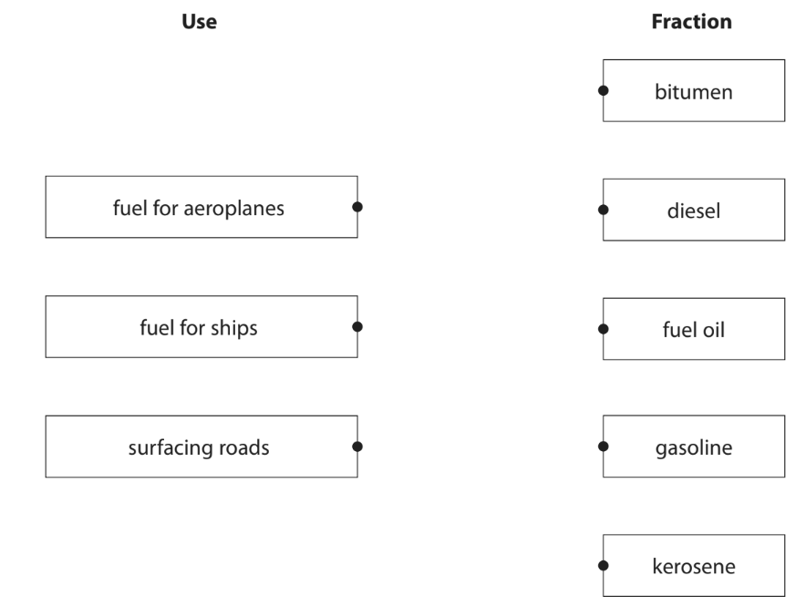

(3)

### 3((c)) — 3 marks — command: explain — structured — from paper 2021 · Ja1CR
Fuels obtained from the fractions may contain impurities.

Explain how the combustion of a common impurity in fuels may cause an environmental problem.

### 3((d)) — 5 marks — command: multiple — structured — from paper 2021 · Ja1CR
Some of the fractions contain long-chain molecules which are not very useful.

i) Give the name of the process used to convert long-chain molecules into more useful shorter-chain molecules.

(1)

ii) Give the catalyst and temperature used in the industrial process to convert long-chain molecules into shorter-chain molecules.

(2)

catalyst..............................................................................................................................

temperature.......................................................................................................................

iii) When C13H28 is used in this process, three different molecules are formed.

Complete the equation for this reaction.

C13H28 → C8H18 + ............................... + ...............................

(2)

## Q7 — medium — 12 marks · exam-questions

### 9((a)) — 2 marks — command: why — structured — from paper 2021 · Ja1C
Propane is a hydrocarbon with the formula C3H8

State why propane is a hydrocarbon.

### 9((b)) — 2 marks — command: multiple — structured — from paper 2021 · Ja1C
i) Name the poisonous gas that forms when propane is burned in a limited supply of air.

(1)

ii) State why this gas is poisonous to humans.

(1)

### 9((c)) — 2 marks — command: describe — structured — from paper 2021 · Ja1C
The diagram represents a molecule of propane.

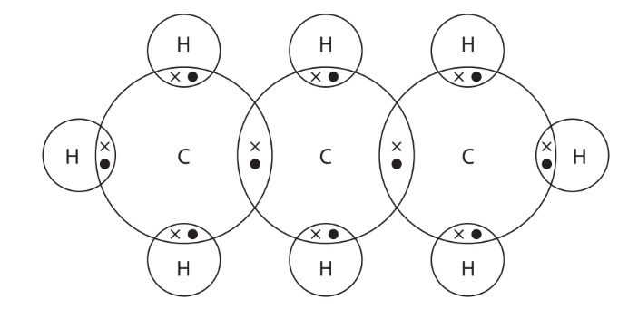

Describe the forces of attraction between the atoms in a molecule of propane.

### 9((d)) — 3 marks — command: explain — structured — from paper 2021 · Ja1C
Propane can be produced by cracking. An equation for cracking is

C13H28 → C3H8 + 2C3H6 + 2C2H4

Explain why cracking is an important process in the oil industry.

### 9((e)) — 3 marks — command: multiple — structured — from paper 2021 · Ja1C
Propane reacts with bromine in the presence of ultraviolet radiation.

i) Complete the equation for this reaction.

(2)

C3H8 + Br2 → ............................... + ...............................

ii) Give the name of this type of reaction.

(1)

## Q8 — medium — 1 marks · exam-questions

### 1() — 1 mark — multiple_choice
The diagram shows some processes involved in the oil industry.

Which process represents cracking?
- **A.** Option A
- **B.** Option B
- **C.** Option C
- **D.** Option D

## Q9 — medium — 13 marks · exam-questions

### 4((a)) — 2 marks — command: state — structured — from paper 2019 · Ju1CR
This question is about hydrocarbons.

State the meaning of the term *hydrocarbon*.

### 4((b)) — 7 marks — command: multiple — structured — from paper 2019 · Ju1CR
One homologous series of hydrocarbons is the alkanes. Pentane (C5H12) is an alkane.

i) When pentane burns completely in oxygen, carbon dioxide and water are produced. Give a chemical equation for this combustion reaction.

(2)

ii) Incomplete combustion can occur when the oxygen supply is limited. Give the names of two products of the incomplete combustion of pentane.

(2)

iii) One of the products of incomplete combustion is a poisonous gas. State why this gas is poisonous to humans.

(1)

iv) C5H12 has three isomers. The displayed formula for one of these isomers is

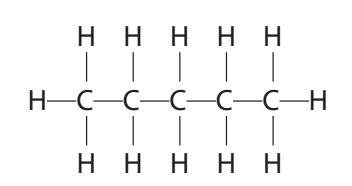

Draw the displayed formulae of the other two isomers.

(2)

### 4((c)) — 4 marks — command: multiple — structured — from paper 2019 · Ju1CR
Another homologous series of hydrocarbons is the alkenes. Alkenes are unsaturated hydrocarbons.

i) Give the general formula for the alkenes.

(1)

ii) State the meaning of the term **unsaturated**.

(1)

iii) Describe a test to show that a hydrocarbon is unsaturated.

(2)

## Q10 — medium — 10 marks · exam-questions

### 3((a)) — 4 marks — command: give — structured — from paper 2021 · Jun2C
The diagram shows the industrial equipment used to separate crude oil into fractions.

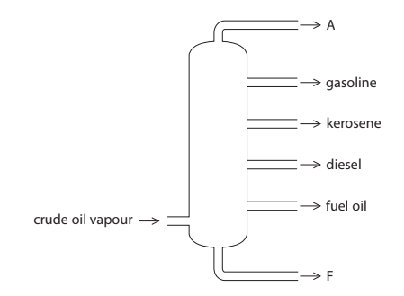

i) Give the name of the industrial equipment.

(1)

ii) Give one use of the fuel oil fraction.

(1)

iii) Give the names of fraction A and fraction F.

(2)

Fraction A    Fraction F

### 3((b)) — 4 marks — command: multiple — structured — from paper 2021 · Jun2C
One compound in the gasoline fraction is the alkane octane (C8H18) and one compound in the kerosene fraction is the alkane dodecane (C12H26)

These two alkanes are covalently bonded and have simple molecular structures.

i) Give the general formula for the alkanes.

(1)

ii) Explain, in terms of their structures, why C12H26 has a higher boiling point than C8H18

(3)

### 3((c)) — 2 marks — command: multiple — structured — from paper 2021 · Jun2C
Catalytic cracking can be used to convert the alkane C12H26 into more useful products.

i) Give the name of the catalyst used for catalytic cracking.

(1)

ii) Complete the equation for this cracking reaction.

(1)

C12H26 → C9H20 + ..................................................

## Q11 — medium — 10 marks · exam-questions

### 2((a)) — 1 mark — command: name — structured — from paper 2020 · Ja202R
Crude oil is a mixture of hydrocarbons.

Name the process used to separate crude oil into fractions.

### 2() — 1 mark — command: give — structured — from paper 2020 · Ja202R
Give one use of the kerosene fraction.

### 2((b)) — 2 marks — command: multiple — structured — from paper 20202 · Ja202C
One of the hydrocarbons in the refinery gas fraction is an alkane with the structural formula CH3CH2CH2CH3.

i) Give the name of this alkane.

(1)

ii) Calculate the relative molecular mass (*M**r*) of this alkane.

(1)

### 2((d)) — 2 marks — command: multiple — structured — from paper 2020 · Ja202R
One of the alkanes in the gasoline fraction has the displayed formula

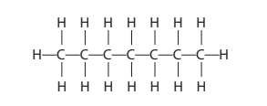

i) Determine the molecular formula of this alkane.

(1)

ii) Give the general formula for the alkanes.

(1)

### 2((e)) — 2 marks — command: multiple — structured — from paper 2020 · Ja202R
Catalytic cracking is used to convert long‐chain alkanes into shorter‐chain alkanes.

i) Name the catalyst used in catalytic cracking.

(1)

ii) Explain why it is necessary to convert long‐chain alkanes into shorter‐chain alkanes.

(1)

### 2((f)) — 2 marks — command: complete — structured — from paper 2020 · Ja202C
Catalytic cracking also produces alkenes. C11H24 can undergo cracking to give pentane (C5H12) and two different alkenes. Complete the equation for this cracking reaction.

C11H24 → C5H12 + ............................+............................

## Q12 — medium — 8 marks · exam-questions

### 3((a)) — 6 marks — command: multiple — structured — from paper 2019 · Ju2CR
Crude oil is an important source of organic compounds.

The diagram shows crude oil being separated into different fractions.

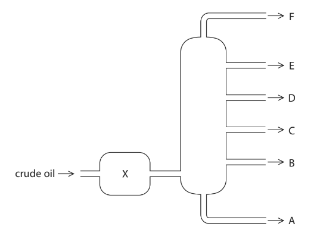

i) Name the process used to separate crude oil into different fractions.

(1)

ii) State what happens to the crude oil at X.

(1)

iii) Describe the differences between fraction B and fraction E. In your answer, refer to

- size of the molecules
- boiling point
- colour
- viscosity

(4)

### 3((b)) — 2 marks — command: explain — structured — from paper 2019 · Ju2CR
Crude oil often contains sulfur as an impurity.

Explain why this is a problem when using crude oil fractions as fuels.

## Q13 — medium — 8 marks · exam-questions

### 3((a)) — 4 marks — command: multiple — structured — from paper 2020 · N2CR
The diagram shows a fractionating column used to separate crude oil into fractions.

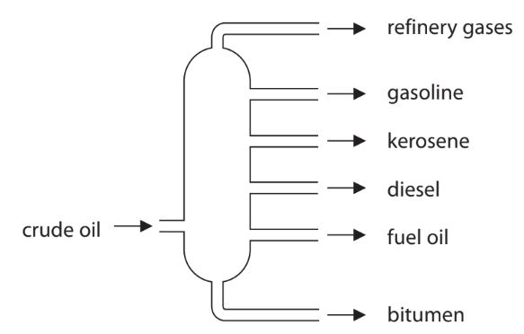

i) Give a use for bitumen and a use for gasoline.

(2)

Use for bitumen: ....................................................................

Use for gasoline: ...................................................................

ii) Explain why bitumen is collected at the bottom of the fractionating column and gasoline is collected near the top of the fractionating column.

(2)

### 3((b)) — 4 marks — command: multiple — structured — from paper 2020 · N2CR
There is a low demand for some of the fractions obtained from crude oil.   Cracking can be used to convert these fractions into more useful substances.

i) State the conditions needed for cracking.

(2)

ii) Dodecane (C12H26) can be cracked to produce an alkane and two alkenes.

Complete the equation by giving the formulae of the two alkenes.

(2)

C12H26 → C7H16 + ................................ + ....................................

## Q14 — medium — 5 marks · exam-questions

### 1() — 3 marks — command: describe — structured
Describe how long-chain alkanes are converted into short-chain alkanes and alkenes.

### 2() — 2 marks — command: explain — structured
Explain why it is necessary to convert long-chain alkanes into short-chain alkanes and alkenes.

## Q15 — hard — 13 marks · exam-questions

### 7((a)) — 6 marks — command: multiple — structured — from paper 2017 · Specimen1C
This question is about hydrocarbons.

The table shows the formulae of some hydrocarbons.

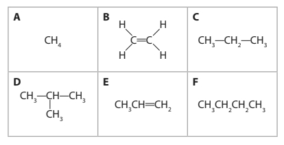

i) Give the letters that represent hydrocarbons with the general formula CnH2n

(1)

ii) State why **B** is the only hydrocarbon shown as a displayed formula.

(1)

iii) Explain which **two** letters represent isomers.

(3)

iv) How many of the hydrocarbons are members of the homologous series of alkanes?

(1)

### 7((b)) — 3 marks — command: multiple — structured — from paper 2017 · Specimen1C
Many hydrocarbons are used as fuels. There are problems associated with this use.

i) Explain how the combustion of a hydrocarbon can lead to the formation of a poisonous gas.

(2)

ii) State why this gas is poisonous to humans.

(1)

### 7((c)) — 4 marks — command: explain — structured — from paper 2017 · Specimen1C
Fuels used in cars often have sulfur compounds removed.

Explain how the combustion of these fuels in car engines still leads to the formation of acid rain.

## Q16 — hard — 19 marks · exam-questions

### 9((a)) — 5 marks — command: describe — structured — from paper 2017 · Specimen1C
The flow chart shows how ethene can be obtained industrially from crude oil.

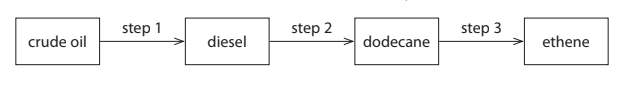

Step 1 involves the use of a tall column. Describe how the diesel fraction is obtained from the crude oil in step 1.

### 9((b)) — 3 marks — command: explain — structured — from paper 2017 · Specimen1C
In step 2, saturated compounds such as dodecane are obtained from the mixture of hydrocarbons in the diesel fraction. Explain why dodecane is described as a saturated hydrocarbon.

### 9((c)) — 1 mark — multiple_choice — from paper 2017 · Specimen1C
Which of these formulae is that of an alkane?
- **A.** C7H12
- **B.** C9H18
- **C.** C11H24
- **D.** C13H30

### 9((d)) — 1 mark — command: complete — structured — from paper 2017 · Specimen1C
In step 3, cracking is used to convert alkanes into alkenes. Complete the equation to show the reaction in which one molecule of dodecane is converted into two molecules of ethene and one molecule of another hydrocarbon.

C12H26 → 2C2H4 + .....................................

### 9((e)) — 5 marks — command: multiple — structured — from paper 2017 · Specimen1C
Alkanes and alkenes both react with halogens, but in different ways. The equations for two examples of these different reactions are shown.

equation 1       C2H6+ Cl2 → C2H5Cl + compound X

equation 2       C2H4 + Br2 → C2H4Br2

i) State the condition needed for the reaction in equation 1 to occur.

(1)

ii) Deduce the formula of compound X.

(1)

iii) Draw a dot-and-cross diagram to represent a molecule of C2H5Cl

Show only the outer electrons of each atom.

(2)

iv) Equation 2 shows an example of an addition reaction. State the type of reaction shown by equation 1.

(1)

### 9((f)) — 4 marks — command: multiple — structured — from paper 2017 · Specimen1C
Alkenes can be distinguished from alkanes using bromine water.

i) What colour change occurs in the reaction between propene and bromine water?

| ☐ | **A** | colourless to orange |
|---|---|---|
| ☐ | **B** | colourless to green |
| ☐ | **C** | green to colourless |
| ☐ | **D** | orange to colourless |

(1)

ii) A compound formed in the reaction between propene and bromine water has the percentage composition by mass:

C = 25.9%, H = 5.0%, Br = 57.6% and O = 11.5%

Calculate the empirical formula of this compound.

(3)

## Q17 — hard — 14 marks · exam-questions

### 7((a)) — 4 marks — command: describe — structured — from paper 2021 · Ja2C
This question is about octane (C8H18) which is produced in the gasoline fraction during fractional distillation of crude oil.

The diagram shows a fractionating column.

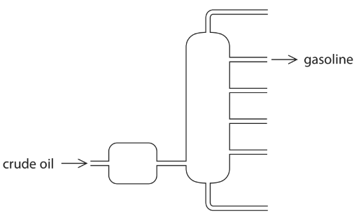

Describe how crude oil is separated into fractions in the fractionating column.

### 7((b)) — 2 marks — command: give — structured — from paper 2021 · Ja2C
Octane can also be produced by the process of cracking. Give the conditions for cracking.

### 7((c)) — 8 marks — command: multiple — structured — from paper 2021 · Ja2C
#### Separate: Chemistry Only

A car is driven at constant speed for 4.00 km.

The exhaust gases are collected and their volume at room temperature and pressure (rtp) is 5.02 × 105 cm3.

The exhaust gases include carbon dioxide and oxides of nitrogen.

The carbon dioxide is removed from the exhaust gases. The volume of the remaining gases at rtp is 2.96 × 105 cm3.

i) Explain how oxides of nitrogen form in a car engine.

(2)

ii) Give a reason why oxides of nitrogen should not be released into the atmosphere.

(1)

iii) Show that the car produces less than 100 g of carbon dioxide per km. [molar volume of carbon dioxide at rtp = 24 000 cm3]

(5)

## Q18 — hard — 13 marks · exam-questions

### 1() — 3 marks — command: multiple — structured
This question is about the processes and reactions which occur in the petrochemical industry.

The diagram below shows some of these processes and reactions. ** **

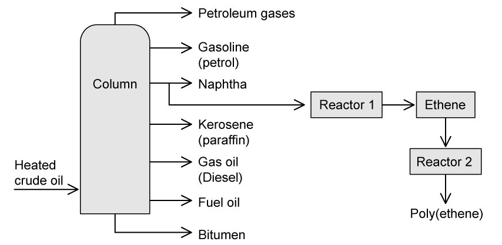

i) Describe the conditions required in reactor **1**.

** **(2)

ii) Name the reaction that occurs in reactor **2. **

(1)

### 2() — 4 marks — command: compare — structured
Compare the properties of gasoline and fuel oil.

### 3() — 1 mark — command: suggest — structured
Reactor 1 is used to break down large alkanes into smaller hydrocarbons. The market demand for shorter chain alkanes is greater than the market demand for long chain alkanes.

Suggest **one** reason why.

### 4() — 3 marks — command: suggest — structured
Short chain fractions have low supply and high market demand.

Suggest three ways in which the oil industry could overcome this problem.

### 5() — 2 marks — command: explain — structured
The table below shows some alkanes that are found in crude oil.

| **Alkanes** | **Boiling point in ****o****C** |
|---|---|
| C5H12 | 36 |
| C7H16 | 98 |
| C10H22 | 174 |

A student was investigating the properties of the alkanes shown in the table above using the following method:

1) Pour 20 cm3 of C5H12 into a funnel

2) Open the tap and start a stopwatch

3) When the level of C5H12 reaches line **X **stop the stopwatch

4) Repeat steps with the other two alkanes

The diagram below shows the apparatus used.

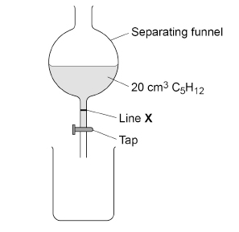

C5H12 took 5.3 seconds to reach line **X.**

Explain the trend you would expect to see when the student repeats the method with the other two alkanes.

## Q19 — hard — 12 marks · exam-questions

### 1() — 4 marks — command: state — structured
This question is about pollutants.

Fossil fuels, such as coal, are burned to release energy.

Hydrogen, sulfur, and carbon are all elements found in coal.

Name two products released when coal burns that have a negative effect on the environment.

State the impact each of the products you have named have.

### 2() — 3 marks — command: multiple — structured — from paper 2015 · O32
Another major source of pollutants is motor vehicles.

i) Nitrogen monoxide, NO, is released by motor vehicle exhausts. Explain how nitrogen monoxide is formed in motor vehicle engines.

(2)

ii) When nitrogen monoxide is released into the atmosphere, nitrogen dioxide, NO2, is formed. Suggest an explanation why this happens.

(1)

### 3() — 2 marks — command: describe — structured
Describe two effects of oxides of nitrogen being released into the atmosphere.

### 2() — 3 marks — command: how — structured — from paper 2015 · O32
How are the amounts of carbon monoxide and nitrogen monoxide emitted by modern motor vehicles reduced?

Include an equation in your answer.
