# Mark Schemes — Introducing organic chemistry
**4. Organic Chemistry: Part 1** · Edexcel IGCSE Chemistry (Modular) (4XCH1) — 24/Unit 1

## Q1 — easy — 1 marks · exam-questions

### 1() — 1 marks
**Correct answer: B** — CH2Br

**Final answer:** **The correct answer is B**

- Empirical formula is the simplest ratio of atoms of each element
- The molecular formula for this compound is C2H4Br2
- Therefore the simplest ratio of each atom is CH2Br

## Q2 — easy — 1 marks · exam-questions

### 1() — 1 marks
**Correct answer: B** — 

**Final answer:** **The correct answer is B**

- Displayed formula shows all of the atoms and the bonds between them
- Diagram B does not show the covalent bonds linking the atoms together* *

## Q3 — easy — 1 marks · exam-questions

### 1() — 1 marks
**Correct answer: B** — Compounds have the same physical properties

**Final answer:** **The correct answer is B**

- The statement that is **not **a feature of a homologous series is: B / Compounds have the same physical properties
- Compounds in the same homologous series demonstrate a graduation in their physical properties
- This means there are small differences in physical properties, this happens as the size of the organic molecule increases

## Q4 — easy — 13 marks · exam-questions

### 1() — 4 marks
The missing information about the alkene with the molecular formula C2H4 is:

- Name = Ethene; **[1 mark]**
- Empirical formula = CH2; **[1 mark]**
- General formula = CnH2n; **[1 mark]**
- Displayed formula = 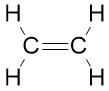 ; **[1 mark]**

**[Total: 4 marks]**

- *You may find it easier to name C**2**H**4** after drawing the displayed formula*

  - *To draw the displayed formula:*
  
    - *Place the two carbons*
    - *Add two hydrogens around each carbon and connect them with single bonds*
    - *Remember: **Carbon prefers to have four bonds*
    - *This means that the bond between the carbon atoms must be a double bond*
- *C**2**H**4** contains two carbons so its name is eth- based*

  - *The question tells you that the compound is an alkene so its name will include -ene*
  
    - *Combining these pieces gives you the name ethene*
  - *You can use your displayed formula to* *check that the compound is an alkene and, therefore, ethene*
- *The empirical formula of an alkene is CH**2** *

  - *Remember: **The empirical formula is the simplest whole number ratio of atoms in a compound*
  - *With a molecular formula of C**2**H**4**, there is a factor of 2 in both numbers which you can divide by to get CH**2** *
- *You specifically need to know the general formulae of alkanes (C**n**H**2n+2**) and alkenes (C**n**H**2n**)*

### 2() — 3 marks
The terms **unsaturated **and **hydrocarbon** mean:

Unsaturated:

- Contains a (carbon-carbon) double bond / C=C 
**OR  **
Contains a (carbon-carbon) multiple bond; **[1 mark]**

Hydrocarbon

- (A chemical / substance / thing that) contains carbon and hydrogen; **[1 mark]**
- Only  **OR **And no other elements;** [1 mark]**

**[Total: 3 marks]**

- *Unsaturated and hydrocarbon are some of the basic definitions of organic chemistry that you are expected to know*

  - *Others include:*
  
    - *Saturated*
    - *Empirical formula*
    - *Molecular formula*
    - *General formula*
    - *Homologous series*
    - *Isomer*
- *Careful:** For hydrocarbon, you must include the word only or add words to suggest that there are no chemical elements apart from hydrogen and carbon in a hydrocarbon*

### 3() — 4 marks
The completed sentences are:

Butene, C4H8, and C2H4 have the same **general **formula and **functional **group.

They will show similar **chemical **properties but there will be differences in their **physical **properties, such as density and boiling point.

Each correct word scores 1 mark

- "same **general **formula"; **[1 mark]**
- "and **functional **group"; **[1 mark]**
- "similar **chemical **properties"; **[1 mark]**
- "in their **physical **properties"; **[1 mark]**

**[Total: 4 marks]**

- *Remember: **A homologous series is a group / family of organic compounds that have similar reactions and chemical properties due to them having the same functional group*

  - *They will, usually, show a pattern in their physical properties such as density, melting point, boiling point, etc*

### 4() — 2 marks
i) The word equation for the reaction of butene with bromine to form dibromobutane is:

- Butene + bromine → dibromobutane; **[1 mark]**

ii) This type of reaction is:

- **A** / addition; **[1 mark]**

**[Total: 2 marks]**

- *You should be able to use a question to write word equations*

  - *"with" often becomes a +*
  - *"to form" becomes the reaction arrow →*
- *The question tells you that you start with two chemicals (butene and bromine) and finish with one chemical (dibromobutane)*

  - *Addition reactions have more reactants (starting materials) than products*

## Q5 — easy — 6 marks · exam-questions

### 2((a)) — 1 marks
The name of **F** is:

- Butane; **[1 mark]**

**[Total: 1 mark]**

- *The main carbon chain / backbone contains 4 carbons*

  - *This means that the name will be based on "but-"*
- *There are only single bonds and no other atoms apart from hydrogens*

  - *Therefore, the name will be "-ane" based*
- *This leads to the overall name of butane*

### 2((b)) — 1 marks
Two compounds that are members of the same homologous series are:

- Compounds: **A** and **B **
**OR ** But(-2-)ene and ethene

**OR**

Compounds: **E** and **F**
**OR**
1-methyl propane and butane; **[1 mark]**

**[Total: 1 mark]**

- *For questions like these, most of the compounds will have carbon atoms, hydrogen atoms and single carbon-carbon / carbon-hydrogen bonds*
- *This means that you need to look at the other features of the compounds: *

  - *A** has one double bond between carbons / C=C*
  - *B** has one double bond between carbons / C=C*
  
    - *Therefore **A** and **B** belong to the same homologous series*
  - *C** has oxygen atoms, one double bond between carbon and oxygen / C=O, one single bond between carbon and oxygen / C-O and one single bond between oxygen and hydrogen / O-H *
  - *D** has one oxygen atom, one single bond between carbon and oxygen / C-O and one single bond between oxygen and hydrogen / O-H *
  - *E** has no "interesting chemistry", only carbon and hydrogen atoms with all single bonds *
  - *F** has no "interesting chemistry", only carbon and hydrogen atoms with all single bonds*
  
    - *Therefore **E** and **F** belong to the same homologous series*

### 3() — 2 marks
The term isomers means:

- Compounds with the same molecular formula
**OR**
Contain the same number of atoms of each element; **[1 mark]**
- But they have different structures
**OR**
Different structural formulae
**OR**
A different arrangement of atoms; **[1 mark]**

**[Total: 2 marks]**

- *Remember: **Isomers are compounds with the same molecular formula but a different arrangement of atoms*

  - *Compounds **E **and **F** both have the general formula C**4**H**10** but they have different displayed formulae as shown in part (a).*

### 2((d)) — 2 marks
**B** is an unsaturated hydrocarbon because it contains:

- A (carbon-carbon) double bond / C=C 
**OR **
Not all of the (carbon-carbon) bonds are single bonds; **[1 mark]**
- Hydrogen and carbon <u>only</u>; **[1 mark] **

**[Total: 2 marks]**

- *You can use the **S** of **S**aturated compounds to help you remember that they contain only **S**ingle bonds*
- *The standard definition of a hydrocarbon is a compound that contains **only** hydrogen and carbon*

## Q6 — medium — 6 marks · exam-questions

### 8((a)) — 1 marks
The completed chemical equation for this reaction is:

- 2C2H4 + 4HCl + O2 → 2C2H4Cl2 + 2H2O; **[1 mark]** 
*Multiples and fractions are accepted*

**[Total: 1 mark]**

- *Remember: **You can put a big number in front of the chemical to say how many of that chemical there are, but you cannot add small numbers to the chemicals *

  - *e.g. 2C**2**H**4** means that you have 2 x C**2**H**4** molecules*
  - *e.g. changing HCl to H**2**Cl**2** might help with balancing the equation but it has changed the chemical*
- *One possible way to balance this equation is:*

  - *Double the HCl to balance the chlorine atoms on either side, which actually balances the carbons and hydrogens as well C**2**H**4** + **2**HCl + .......... O**2** → C**2**H**4**Cl**2** + .......... H**2**O*
  - *You can balance the one oxygen on the right-hand side by using half an oxygen molecule C**2**H**4** + 2HCl + **½**O**2** → C**2**H**4**Cl**2** + H**2**O*
  - *This can be doubled to work with whole numbers 2C**2**H**4** + 4HCl + O**2** → 2C**2**H**4**Cl**2** + 2H**2**O*
- *Find a way that you are comfortable to balance equations, even if you take the time to draw the molecules out*

  - *These can be easy marks to pick up in your exam once you are confident with this skill*

### 8((b)) — 1 marks
Thermal decomposition is:

- Breaking down (a chemical / compound) by heating / using heat; **[1 mark]**

**[Total: 1 mark]**

- *Thermal links to heat*
- *Decomposition links to breaking down*
- *Therefore, thermal decomposition is using heat to break **something** a chemical down*

  - *Try and avoid words like "something" and be specific with keywords as this could cost you a mark in an exam*
  - *If you are not sure if a chemical is ionic, covalent or metallic then you can just use "a chemical" and you don't unnecessarily lose a mark *

### 8((c)) — 3 marks
i) Chloroethene is described as an unsaturated compound because:

- It contains a (carbon-carbon) double bond; **[1 mark] **

ii) A test to show that chloroethene is unsaturated is:

Option 1:

- Add bromine water / solution 
**OR**
** **Add Br2 (aq); **[1 mark]**
- (The bromine water) is decolourised 
**OR**
** **The bromine water changes (from orange / yellow / brown) to colourless; **[1 mark]**

Option 2:

- Add acidified potassium manganate(VII) solution
 **OR **
Add KMnO4 (aq);** [1 mark]**
- (The acidified potassium manganate(VII) solution) is decolourised 
**OR**
** **(The acidified potassium manganate(VII) solution) changes (from purple) to colourless; **[1 mark]**

**[Total: 3 marks]**

- *Saturated compounds contain carbon-carbon single bonds*
- *Unsaturated compounds contain at least one carbon=carbon double (or multiple) bond*
- *The test for an unsaturated compound is that bromine water decolourises *

  - *This is because the bromine is reacted out of the bromine water, which leaves just colourless water *

### 8((d)) — 1 marks
The polymer formed from chloroethene is:

- Poly(chloroethene) / polychloroethene 
**OR **
Polyvinyl chloride / PVC; **[1 mark]**

**[Total: 1 mark]**

- *To name a polymer from its monomer, you simply put poly in front of the name*

  - *Ethene → polyethene*
  - *Propene → polypropene*

## Q7 — medium — 1 marks · exam-questions

### 1() — 1 marks
**Correct answer: C** — C and F

**Final answer:** **The correct answer is C**

- The two compounds that are isomers of one another are: **C** / Compounds C and F

- Isomers have the same molecular formula but different displayed formula
- C and F both have the molecular formula C5H12  but their atoms are arranged differently* *

## Q8 — medium — 1 marks · exam-questions

### 1() — 1 marks
**Correct answer: B** — C2H4 + Br2 → C2H4Br2

**Final answer:** **The correct answer is B**

- The example of an addition reaction is: **B** / C2H4 + Br2 → C2H4Br2

- An addition reaction takes place when two or more molecules combine to form a larger molecule with no other product
- Alkenes undergo addition reactions with hydrogen, the halogens and water
- In this case, ethene reacts with bromine to form dibromoethane
- **A** is incorrect as this equation shows incomplete combustion
- **C** is incorrect as this equation shows complete combustion
- **D** is incorrect as this equation shows a substitution reaction

## Q9 — medium — 11 marks · exam-questions

### 1() — 2 marks
i) The name of the third member of the homologous series of alkenes is:

- Butene / but-1-ene / but-2-ene; **[1 mark] **

ii) Propane and the third member of the homologous series of alkenes do not have similar chemical properties because:

- They have different functional groups; **[1 mark]**

**[Total: 2 marks]**

- *For part (i)*

  - *Careful:** There is a temptation to automatically write propene as the answer but this is incorrect*
  - *The first member of the homologous series of alkenes is ethene*
  - *This is because an alkene requires a minimum of two carbon atoms to have a  carbon=carbon double bond / C=C*
  - *Therefore, the homologous series of alkenes is:*
  
    1. *Ethene*
    2. *Propene*
    3. *Butene*
  - *The series gets more complicated at butene and beyond because there is more than one place to put the carbon=carbon double bond / C=C, which results in different chemicals / names*
- *For part (ii)*

  - *Members of a homologous series have similar chemical properties because they have the same functional group*

### 2() — 3 marks
i) The chemical equation for the reaction where propene is bubbled through bromine water until there is no further colour change is:

- C3H6 + Br2 → C3H6Br2  
**OR **
CH3CHCH2 + Br2 → CH3CHBrCH2Br; **[1 mark]**

ii) The observation supports that this is an addition reaction because:

- Bromine water is orange / brown; **[1 mark]**
- The bromine colour disappears / fades as it is added to propene / used up;** [1 mark]**

**[Total: 3 marks]**

- *When orange / brown bromine water is added to an alkene, it will decolourise or go colourless*

  - *Examiners are quite specific about colours, especially in relation to bromine*
  - *Orange / brown / orange-brown are all generally acceptable colours for bromine water but any mention of red will lose the mark*
  - *Clear is never an acceptable colour - you should be using the word colourless*
- *The question also tells you that this is an addition reaction which makes the chemical equation easier*

  - *Propene + bromine → a product*
  - *C**3**H**6** + Br**2** → a product*
  - *Since you know this is an addition reaction, you can simply add the Br**2** on the end of C**3**H**6**  *
  - *C**3**H**6** + Br**2** → C**3**H**6**Br**2** *
- *The bromine water (Br**2** (aq)) is responsible for an initial orange / brown colour*

  - *As the bromine reacts, it is added to the propene and removed from the bromine water*
  - *When you remove the bromine from bromine water, you are left with water *
  - *This means that the reaction will turn from orange / brown to colourless and will remain colourless once all of the bromine had reacted / been used up*

### 3() — 3 marks
i) The chemical equation for the reaction of ethene with steam to form ethanol is:

- CH2CH2 (g) + H2O (g) → CH3CH2OH (l); **[1 mark]**

ii) The temperature and pressure required for this reaction are:

- Temperature = An answer in the range of 250 - 350 oC; **[1 mark]**
- Pressure = An answer in the range of 60 - 70 atmosphere; **[1 mark]**

**[Total: 3 marks]**

- *The question specifically asks for you to use structural formulae in your equation*

  - *You will normally be allowed to give chemical equations with structural formulae if there is no further guidance*
  - *On very rare occasions, you will be given further guidance about the appearance of the chemicals, e.g. molecular or structural formulae*
  - *On these rare occasions, make sure your answer uses the appropriate formulae or you will lose marks *
- *Steam hydration of ethene to form ethanol is a chemical reaction you should know the reaction conditions for*

  - *You can give answers in other units but they must fall within the allowed ranges*

### 4() — 3 marks
i) The homologous series to which the oxidation product belongs is:

- Carboxylic acids; **[1 mark] **

ii) The empirical and molecular formulae of the oxidation product are:

- Empirical formula = CH2O; **[1 mark]**
- Molecular formula = C2H4O2; **[1 mark] **

**[Total: 3 marks]**

- *Ethanol reacts with oxygen to form ethanoic acid*
- *Ethanoic acid is a member of the carboxylic acid family / homologous series with the structural formula CH**3**COOH*

  - *This means that it has a molecular formula of C**2**H**4**O**2** *
  - *Since all the little numbers in the molecular formula can be divided by 2, this gives an empirical formula of CH**2**O*
  - *Remember:** Empirical formula is the smallest whole number ratio of atoms*

## Q10 — medium — 14 marks · exam-questions

### 6((a)) — 4 marks
i) The completed table is:

| alcohol | formula |
|---|---|
| methanol | CH3OH |
| ethanol | CH3–CH2–OH |
| propan-1-ol | **CH****3****–CH****2****–CH****2****–OH**; **[1 mark]** |
| butan-1-ol | CH3–CH2–CH2–CH2–OH |
| pentan-1-ol | CH3–CH2–CH2–CH2–CH2–OH |

ii) The completed equation for the combustion of pentan-1-ol in excess oxygen is:

C4H9OH + 6O2 → 4CO2 + 5H2O

- Correct products; **[1 mark]**
- Correct balancing; **[1 mark]**

iii) The type of reaction occurring between butan-1-ol and oxygen is:

- Combustion  
**OR **
Oxidation; **[1 mark]**

**[Total: 4 marks]**

- *The mark for the missing formula can be achieved by spotting the pattern in the formula, which is gaining a CH**2** as you move down the alcohols*
- *To balance the equation:*

  - *You are told that it is excess oxygen, which means that you are looking at complete combustion*
  - *4 carbons on the reactants side will form 4 carbon dioxide molecules *
  
    - *C**4**H**9**OH + .......O**2** → **4**CO**2** + ..........*
  - *10 hydrogens on the reactants side will form 5 water molecules *
  
    - *C**5**H**11**OH + .......O**2** → **4**CO**2** + **5**H**2**O*
  - *This means that you now have 13 oxygen atoms on the product side There is one oxygen atom in the alcohol, which means that 12 more oxygen atoms need to be accounted for The "missing" oxygen atoms come from the O**2** / oxygen molecule, which means that you need 6 oxygen molecules*
  
    - *C**5**H**11**OH + **6**O**2** → **4**CO**2** + **5**H**2**O*

### 6((b)) — 3 marks
**Three **characteristics of a homologous series other than the variation of physical properties down the series are:

Any **three** of the following:

- Same general formula; **[1 mark]**
- Same functional group; **[1 mark]**
- Same chemical properties; **[1 mark]**
- Same methods of preparation; **[1 mark]**
- Consecutive members differ by CH2; **[1 mark]**

**[Total: 3 marks]**

- *Remember: **Chemicals in a homologous series have the same general formula but are slightly different in terms of how they are produced, their actual structure and their chemical properties *

### 6((c)) — 3 marks
i) They are isomers because they:

- Have the same molecular formula; **[1 mark]**
- But, different structures / different structural formulae / different arrangements of atoms; **[1 mark]**

ii) The displayed formula of the fourth isomer is:

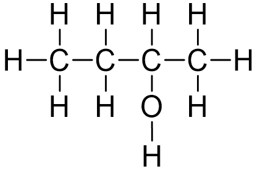

- ; **[1 mark]**

**[Total: 3 marks]**

- *You should know and be able to apply the definition of an isomer*
- *You can apply the logic of the chemical names for the isomers that you have been given*

  - *There are two isomers that are "-methylpropan-" based*
  
    - *The difference between the molecules is that the OH group has moved by one carbon*
  - *There is only one "butan-" based isomer*
  
    - *If you take this chemical and move the OH group alone, you will get the fourth isomer butan-2-ol *

### 4() — 4 marks
i) To show that the molecular formula of the alcohol could be C3H8O:

**Method 1**:

- Carbon = $\frac{60.0}{12}$ 
**AND **
Hydrogen = $\frac{13.3}{1}$ 
**AND **
Oxygen = $\frac{26.7}{16}$; **[1 mark]**
- Carbon = 5 
**AND **
Hydrogen = 13.3  
**AND **
Oxygen = 1.67;** [1 mark]**
- Divide by 1.67 to get 3 : 8 : 1; **[1 mark]**

**Method 2:**

- *M*r of C3H8O = 60;** [1 mark]**
- Carbon = $\frac{36}{60}\times100$ 
**AND **
Hydrogen = $\frac{8}{60}\times100$ 
**AND **
Oxygen = $\frac{16}{60}\times100$; **[1 mark]**
- Carbon = 60.0 % 
**AND **
Hydrogen = 13.3% 
**AND **
Oxygen = 26.7%**[1 mark]**

ii) The empirical formula is also the molecular formula of the alcohol because:

- C3H8O has the simplest whole number ratio of atoms;** [1 mark]**

**[Total: 4 marks]**

- *Make sure you know how to calculate empirical and molecular formulae from given data *
- *There is a single, consistent method that you can use:*

  - *Elements, values, atomic mass, divide, ratio, answer*
  - | > *Elements* | > *Carbon* | > *Hydrogen* | > *Oxygen* |
  |---|---|---|---|
  | > *Value from the question* | > *60.0 %* | > *13.3 %* | > *26.7 %* |
  | > *Atomic mass* | > *12* | > *1* | > *16* |
  | > *Divide * | > $\frac{60.0}{12}$* = 5* | > $\frac{13.3}{1}$*= 13.3* | > $\frac{26.7}{16}$* = 1.67* |
  | > *Ratio (divide by the smallest)* | > $\frac{5}{1.67}$* = 3* | > $\frac{13.3}{1.67}$* = 8* | > $\frac{1.67}{1.67}$* = 1* |
  | > *Answer* | > *C**3* | > *H**8* | > *O* |

## Q11 — hard — 9 marks · exam-questions

### 1() — 4 marks
The names of the compounds are:

| **Structure** | **Name** |
|---|---|
| CH3CH2CH2CH2OH | Butan(-1-)ol; **[1 mark]** |
| CH3CH2CH2NH2 | Propylamine; **[1 mark]** |
| CH3COOCH2CH2CH3 | Propyl ethanoate; **[1 mark]** |
| CH3CH2CH2OH | Propan(-1-)ol; **[1 mark]** |

**[Total: 4 marks]**

- *To name the following compounds*

  - *CH**3**CH**2**CH**2**CH**2**OH*
  
    - *There are 4 carbon atoms in the chain so the name will start with 'but-'*
    - *The bonds are all single so the name will start with 'butan-'*
    - *The OH group at the compound means that it is an alcohol, therefore the ending is '-ol'*
  - *CH**3**CH**2**CH**2**NH**2*
  
    - *There are 3 carbon atoms in the chain so the name will start with 'prop-'*
    - *The bonds are all single so the name will start with 'propan-'*
    - *The NH**2** group represents an amine group so the name will end in '-amine'*
  - *CH**3**COOCH**2**CH**2**CH**3*
  
    - *This is an ester and is therefore made from the reaction between an alcohol and carboxylic acid*
    - *Therefore, it will have two parts to the name*
    
      - *The part from the alcohol (named first)*
      - *The part from the carboxylic acid (named last)*
    - *CH**3**CO is from the acid as this contains the C=O group, there are 2 carbon atoms so the second part of the name will be '-ethanoate'*
    - *OCH**2**CH**2**CH**3** is from the alcohol as there is an O-CH**2** group, there are 3 atoms so the first part of the name is 'propyl'*
  - *CH**3**CH**2**CH**2**OH*
  
    - *There are 3 carbon atoms in the chain so the name will start with 'prop-'*
    - *The bonds are all single so the name will start with 'propan-'*
    - *The OH group in the compound means that it is an alcohol, therefore the ending is '-ol'*

### 2() — 2 marks
The balanced symbol equation is:

CH3CH2CH2OH + 4½O2 → 3CO2 + 4H2O  **   **
**OR **   
C3H7OH + 4½O2 → 3CO2 + 4H2O

- Correct formulae; **[1 mark]**
- Correct balancing; **[1 mark] **

**[Total: 2 marks] **

- *To construct this equation start with the information you are given*

  - *CH**3**CH**2**CH**2**OH + O**2** → *
- *This reaction is therefore combustion- the two products are carbon dioxide and water*

  - *CH**3**CH**2**CH**2**OH + O**2** → CO**2** + H**2**O*
- *Then you can balance this equation*

  - *Start with the carbon atoms CH**3**CH**2**CH**2**OH + O**2** → 3CO**2** + H**2**O*
  - *Then balance the hydrogen atoms CH**3**CH**2**CH**2**OH + O**2** → 3CO**2** + 4H**2**O*
  - *Then balance the oxygen atoms CH**3**CH**2**CH**2**OH + 4½O**2** → 3CO**2** + 4H**2**O*
- *You would also be awarded the mark for any correct multiples of this, e.g.:*

  - *2CH**3**CH**2**CH**2**OH + 9O**2** → 6CO**2** + 8H**2**O*

### 3() — 2 marks
To calculate the percentage by mass of carbon:

- Compound A = C6H14O; **[1 mark] **
- % of carbon = `fraction numerator open parentheses 6 space cross times space 12 close parentheses over denominator 102 end fraction cross times 100` = 70.6%; **[1 mark] **

**[Total: 2 marks] **

- *To answer this question, use the clues given to you*

  - *The functional group will be OH, which has an **M**r** of 17 (16 + 1)*
  
    - *Therefore the remaining **M**r** is 85 (102 - 17)*
  - *You know that this must contain carbon and hydrogen atoms*
  
    - *The compound must contain a CH**3** group and CH**2** groups*
    - *The CH**3** group has an **M**r** of 15 leaving a mass of 70*
    - *Therefore there must be C**5**H**10** in the remaining part of the compound*
    
      - *C**6**H**14**O*
  - *Now you know you have 6 carbon atoms in compound A you can work out the percentage by mass*

### 4() — 1 marks
d) The displayed formula of CH3CH2CH2NH2 is:

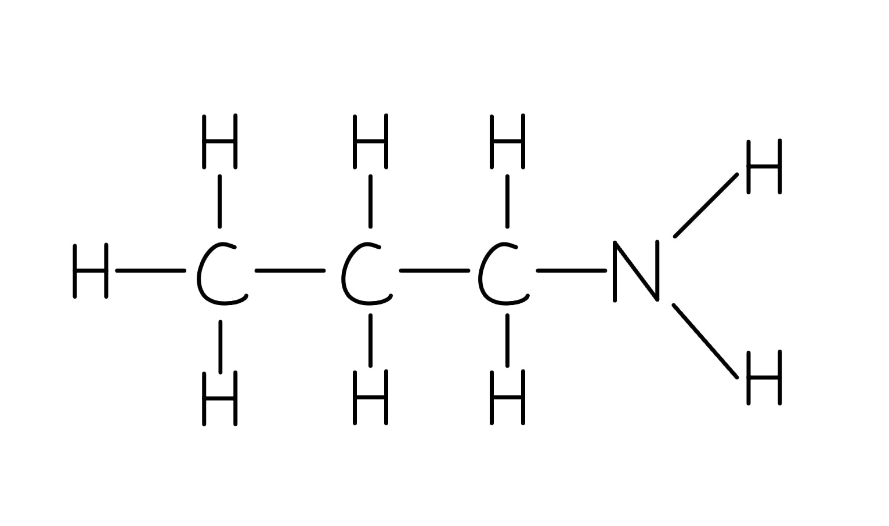

- ; **[1 mark]**

**[Total: 1 mark]**

- *Displayed formulas must show all bonds*
- *If you wrote -NH**2** at the end of the formula you would not gain the mark*
- *This is a common error that students make*

## Q12 — hard — 5 marks · exam-questions

### 1() — 3 marks
To determine the empirical formula of compound X

- Carbon = $\frac{85.7}{12}$ = 7.14 
Hydrogen = $\frac{14.3}{1}$= 14.3; **[1 mark] **
- Ratio 
Carbon = $\frac{7.14}{7.14}$ = 1 
Hydrogen = $\frac{14.3}{7.14}$ = 2; **[1 mark] **
- Molecular formula = $\frac{\mathrm{CH}_{2}}{70}=\frac{14}{70}$= 5 
CH2 x 5 = C5H10 ; **[1 mark] **

**[Total: 3 marks] **

- *Empirical formula calculations follow the same steps regardless of the compound*
- *To calculate the empirical formula, it can be helpful to use the following table:*

| > *1* | > *Write the elements* | > *C* | > *H* |
|---|---|---|---|
| > *2* | > *Write the values from the question* *(can be % or g)* | > *85.7* | > *14.3* |
| > *3* | > *Write the atomic mass* | > *12* | > *1* |
| > *4* | $\frac{\mathrm{Value}}{\mathrm{Atomic} \mathrm{mass}}$ | > *7.14* | > *14.3* |
| > *5* | > *Ratio (divide the answers by the smallest value)* | > $\frac{7.14}{7.14}$* = 1* | > $\frac{14.3}{7.14}$* = 2* |
| > *6* | > *Write the empirical formula* | > *C* | > *H**2* |

- *Using the empirical formula the next step is to determine the molecular formula*
- *This can be done by:*

| > *M**r** of empirical formula* | > *CH**2** = 12 + 1*  > *M**r** **= 14* |
|---|---|
| > *Divide **M**r** of molecular formula by **M**r** **of empirical formula* | > *  *$\frac{70}{14}$* = 5* |
| > *Multiply empirical formula by answer* | > *5 x CH**2** = C**5**H**10* |

### 2() — 1 marks
The structure of compund X is:

Any **one **of the following:

- 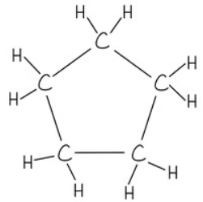

; **[1 mark] **

- 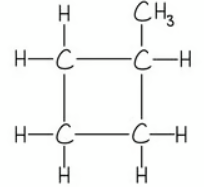

; **[1 mark] **

- 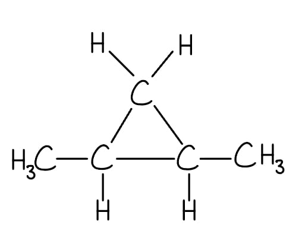

;** [1 mark] **

- 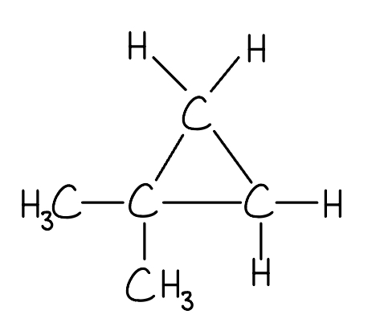

; **[1 mark] **

**[Total: 1 mark]**

- *The clue in this question is the fact that compound X does not react with bromine water*
- *Therefore the compound must be an alkane*
- *Alkanes can be cyclic as well as straight chains*

### 3() — 1 marks
The equation for the reaction between compound X and chlorine is:

C₅H₁₂ + Cl₂ → C₅H₁₁Cl + HCl

- Correct reactants and products;** [1 mark] **

**[Total: 1 mark]**

- *Chlorine can react with **alkanes and cycloalkanes** in the presence of UV light in a substitution reaction*

## Q13 — hard — 16 marks · exam-questions

### 7() — 3 marks
i) A hydrocarbon is:

- A compound containing carbon and hydrogen **only**; **[1 mark]**

ii) The general formulae are:

- Alkanes: CnH2n+2; **[1 mark]**
- Alkenes: CnH2n; **[1 mark]**

**[Total: 3 marks]**

- *The word 'only' is very important when defining hydrocarbons, you will not gain the mark if you do not include it!*
- *This is because there are many compounds that contain carbon and hydrogen and other elements which are not classed as hydrocarbons*

### 7() — 4 marks
i) The empirical formula of compound X is found by:

- (Moles of) C = 54.54/12 **OR **4.5 
**AND** 
(Moles of) H = 9.09/1 **OR **9.09 
**AND** (Moles of) O = 36.37/16 **OR **2.27;** [1 mark]**
- Empirical formula: C2H4O;** [1 mark]**

ii) The molecular formula of compound X is found by:

- *M*r of C2H4O = 44; **[1 mark]**
- (88/44 = 2 therefore molecular formula is) C4H8O2; **[1 mark]**

**[Total: 4 marks]**

- *To calculate the empirical formula when given percentages, it is easiest to assume that you have 100 g of the sample, then you can work out the number of moles of each element in 100 g by using the **M**r**:*

|   | **C** | **H** | **O** |
|---|---|---|---|
| > *Calculate the number of moles of each element in 100g (%/**M**r**)* | $\frac{54.54}{12}\,=4.5$ | $\frac{9.09}{1}\,=9.09$ | $\frac{36.37}{16}\,=2.27$ |
| > *Divide by the smallest number to find the smallest ratio* | > * 4.5/2.27 = 2* | > * 9.09/2.27 = 4* | > * 2.27/2.27 = 1* |

- *The empirical formula is therefore C**2**H**4**O*
- *Compound X has twice the** M**r** of the empirical formula, therefore compound X must contain twice the number of atoms that appears in the empirical formula*

### 7() — 4 marks
The names and structural formulae of two esters with the molecular formula C3H6O2 are:

| **Name of ester** | methyl ethanoate; **[1 mark]** | ethyl methanoate; **[1 mark]** |
|---|---|---|
| **Structural formula** | CH3COOCH3; **[1 mark]** | HCOOC2H5; **[1 mark]** |

**[Total: 4 marks]**

- *Esters are produced from the reaction between an alcohol and a carboxylic acid (water is also formed)*
- *There are two possibilities of producing an ester with 3 carbons:*

  - *Where the alcohol provides 1 carbon (methanol) and the carboxylic acid provides 2 carbons (ethanoic acid), resulting in methyl ethanoate*
  - *Where the alcohol provides 2 carbons (ethanol) and the carboxylic acid provides 1 carbon (methanoic acid), resulting in ethyl methanoate*
- *The name of the ester takes the first part from the alcohol used and the second part from the carboxylic acid*

### 7() — 1 marks
The ester produced from the reaction of propanoic acid and methanol is:

- Methyl propanoate; **[1 mark]**

**[Total: 1 mark]**

- *The name of the ester takes the first part from the alcohol used and the second part from the carboxylic acid*

  - *The alcohol is methanol, therefore the first part of the name is methyl*
  - *The carboxylic acid is propanoic acid, therefore the second part of the name is propanoate*

### 7() — 4 marks
i) The type of polymerisation used for the production of polyesters is:

- Condensation;** [1 mark]**

ii) The simple molecule removed when the polyester is formed is:

- Water / H2O;** [1 mark]**

iii) The correct diagrams to show the structures of the monomers used to produce the polyester are:

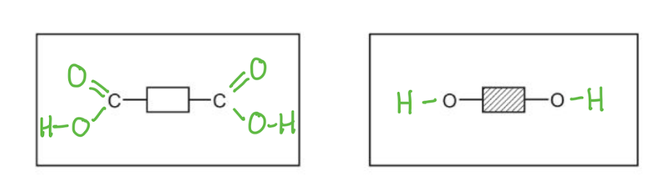

- Dicarboxylic acid 
**OR**
** **Diacyl (di)chloride;** [1 mark]**
- Diol; **[1 mark]**

**[Total: 4 marks]**

- *Polyesters are made from dicarboxylic acid monomers (a carboxylic with a -COOH group at either end) and diols (alcohol with an -OH group at either end)*
- *Remember:** Show the bonds between the O and H as the question asks you to show all of the bonds*
- *Diacyl chlorides (similar to dicarboxylic acids but the -OH groups are replaced with -Cl) can also be used but these are not covered at this level*

## Q14 — hard — 10 marks · exam-questions

### 1() — 2 marks
More than one compound can have the same molecular formula because:

- The compounds have the same number of atoms 
**AND **
The same types of atom;** [1 mark]**
- But, they have a different structural / displayed formula 
**OR **
They have a different arrangement of atoms (in 3-D space) 
**OR **
They have different structures;** [1 mark]**

**[Total: 2 marks]**

- *This question is another way of asking you to **'state what is meant by the term isomers'** and other variations on those words*

  - *The challenging part of this question is getting the first mark*
  - *You might be used to saying that 'isomers are compounds with the same molecular formula but a different structural formula'*
  
    - *This will not get the first mark as the question already states that the compounds have the same molecular formula*
    - *This means that you have to explain what having the same molecular formula means in terms of numbers and types of atoms*

### 2() — 2 marks
The displayed formulae of two isomers with the formula C4H8 that belong to different homologous series are:

Any **one **of the following:

| 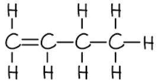  ; **[1 mark]** | 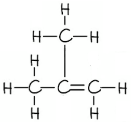  ; **[1 mark]** |
|---|---|
| 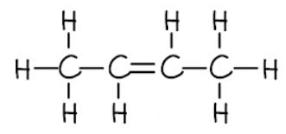  ; **[1 mark]** | 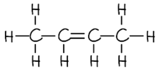  ;** [1 mark]** |

Plus, any **one **of the following:

| 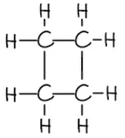  ; **[1 mark]** | 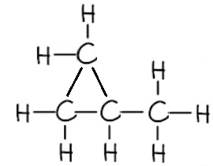  ; **[1 mark]** |
|---|---|

** [Total: 2 marks]**

- *The two homologous series with compounds that have the molecular formula C**4**H**8** are the alkenes and the cyclic alkanes*

  - *You should be able to deduce the alkenes from the molecular formula as it matches the C**n**H**2n** general formula of an alkene*
  - *The common isomers of alkenes are cyclic alkanes*

### 3() — 4 marks
i) The chemical test to show that compounds with the molecular formula belong to different homologous series is:

- Add bromine water / Br2 (aq); **[1 mark]**
- One homologous series will decolourise the bromine water  
**OR  **
One homologous series will turn the bromine water (from orange / brown to) colourless;** [1 mark]**
- The other homologous series will have no effect on bromine water 
**OR **
Bromine water will remain orange / brown with the other homologous series; **[1 mark]**

ii) The results of the chemical test in part (i) prove that compounds with the molecular formula C4H8 belong to different homologous series because:

- They have different chemical properties / reactions; **[1 mark]**

**[Total: 4 marks]**

- *For part (i)*

  - *If you scored the marks in part (b), then you know that the compounds with the molecular formula C**4**H**8** are alkenes and cycloalkanes*
  - *The molecular formula C**4**H**8** should guide you to one of the homologous series being the alkenes with the general formula C**n**H**2n** *
  - *Even if you are not aware that the other homologous series is the cyclic alkanes, you should know that the chemical test for an alkene is the addition of bromine water*
  
    - *Bromine and bromide are not accepted for the mark*
    - *Any mention of red as the colour of bromine water will automatically lose the mark, it is described as orange, brown or orange-brown*
- *For part (ii)*

  - *This question is asking you to use the characteristics of a homologous series *
  - *Since some compounds belong to different homologous series, they will:*
  
    - *React differently / have different chemical properties - this can be shown by the different results with bromine water*
    - *Have different functional groups*
    - *Have different physical properties *
  - *Alkenes and cyclic alkanes is a peculiar case where they actually have the same general formula *

### 4() — 2 marks
i) The chemical equation for organic compounds with the molecular formula C4H8 being hydrated to form alcohols is:

- C4H8 + H2O → C4H9OH;** [1 mark]**

ii) This type of reaction is:

- Addition; **[1 mark]**

**[Total: 2 marks]**

- *For part (i)*

  - *Hydration is a reaction with water*
  
    - *C**4**H**8** + H**2**O → *
  - *The question states that the product is an alcohol so you must show the OH functional group that is formed*
  
    - *C**4**H**8** + H**2**O → C**4**H**9**OH*
- *For part (ii)*

  - *You start with two reactants that form one product*
  - *They are being added together*

## Q15 — hard — 12 marks · exam-questions

### 1() — 2 marks
i) The compound that is not a hydrocarbon is:

- (Compound) **D **
**AND** 
(Because,) it does not contain hydrogen and carbon <u>only</u> 
**OR**
** **it contains <u>bromine</u> (as well as hydrogen and carbon); **[1 mark]**

ii) The compounds that are shown as displayed formulae are:

- (Compounds) **D** and **F **
**OR **
(Because,) they show all of the (individual) bonds
 **AND** 
all of the (individual) atoms; **[1 mark]**

**[Total: 2 marks]**

- *Remember:** Hydrocarbons are compounds that contain hydrogen and carbon **only*

  - *You must include the word **'only'** or you will lose the mark*
- *All of the compounds contain hydrogen and carbon*

  - *But, compound **D** also contains bromine *
- *Displayed formulae show all of the individual atoms and bonds in a compound's structure*

  - *The most common mistake made when drawing displayed formulae is forgetting to draw the bond in an O–H group*

### 2() — 2 marks
i) The condition needed for this reaction to occur is:

- Ultraviolet light / radiation; **[1 mark]**

ii) The formula of compound **G **is:

- HCl; **[1 mark]**

**[Total: 2 marks]**

- *Compound **B** is an alkane*
- *Alkanes are relatively unreactive*

  - *In ultraviolet light / radiation they can undergo a substitution reaction with halogens, swapping / substituting a hydrogen atom for a halogen atom*
  - *C**4**H**10** + Cl**2** → C**4**H**9**Cl + HCl*

### 3() — 4 marks
i) The chemical equation for the combustion of compound **D** to form a toxic colourless gas, a brown gas and one other product is:

2CH3Br + 2.5O2 → 2CO + Br2 + 3H2O **   **
**OR **   
4CH3Br + 5O2 → 4CO + 2Br2 + 6H2O

- Correct formulae; **[1 mark]**
- Correct balancing; **[1 mark]**

ii) How the toxic colourless gas affects the respiratory system:

- It reduces the ability of blood / red blood cells / haemoglobin to carry oxygen 
**OR **
It prevents blood / red blood cells / haemoglobin from carrying oxygen; **[1 mark]**
- (Because,) it binds tightly / strongly / irreversibly (to blood / red blood cells / haemoglobin) 
**OR **
(Because,) it causes haemoglobin to form carboxyhaemoglobin; **[1 mark]**

**[Total: 4 marks]**

- *For part (i)*

  - *Compound **D** is CH**3**Br*
  - *It undergoes combustion which means it is reacting with oxygen*
  
    - *CH**3**Br + O**2** → *
  - *The toxic colourless gas is carbon monoxide*
  - *The brown gas is bromine*
  - *The other product is water, since this is a combustion reaction*
  
    - *CH**3**Br + O**2** → CO + Br**2** + H**2**O*
  - *Two bromine atoms on the right-hand side mean that you need 2CH**3**Br*
  
    - *2**CH**3**Br + O**2** → CO + Br**2** + H**2**O*
  - *This now means that there are two carbon atoms on the left-hand side, which will make 2CO*
  - *This also means that there are six hydrogen atoms on the left-hand side, which will make 3H**2**O*
  
    - *2**CH**3**Br + O**2** → **2**CO + Br**2** + **3**H**2**O*
  - *There are now five oxygen atoms on the right-hand side, which require 2.5O**2** *
  
    - *2**CH**3**Br + **2.5**O**2** → **2**CO + Br**2** + **3**H**2**O*
  - *You can also double all of the numbers if you prefer equations with whole number coefficients*
  
    - *4**CH**3**Br + **5**O**2** → **4**CO + **2**Br**2** + **6**H**2**O*
- *For part (ii)*

  - *The toxic colourless gas is carbon monoxide*
  - *You should know that carbon monoxide binds strongly / irreversibly to haemoglobin in the blood / red blood cells*
  - *This means that less oxygen can be carried around the body*
  - *Answers in terms of haemoglobin are not expected but are often seen in exam answers*

### 4() — 4 marks
i) The values of *y* and *z* are:

- *y* = $\frac{308}{44}$ = 7; **[1 mark]**
- *z* = $\frac{144}{18}$ = 8; **[1 mark]**

ii) The molecular formula of the compound **H** and the value of *x* are:

- Molecular formula = C7H16;** [1 mark]**/li>
- *x* = 11;** [1 mark]**

**[Total: 4 marks]**

- *The question tells you that one mole of compound **H** forms 308 g of carbon monoxide and 144 g of water*

  - *This means that you can use these values to calculate the number of moles of each product, using the equation:*
  *Moles = *$\frac{\mathrm{mass}}{M_{r}}$
  - *y** = *$\frac{308}{44}$* = 7*
  - *z** = *$\frac{144}{18}$* = 8*
- *This means that the chemical equation can be updated to:*

  - *Compound **H** + **x** O**2** → **7**CO**2** + **8**H**2**O*
- *The question also tells you that compound **H** is in the same homologous series as compound **A*

  - *This means that it is an alkane*
  - *It must contain seven carbon atoms to form seven carbon monoxide molecules*
  - *It must also contain 16 hydrogen atoms to form eight water molecules*
  - *Therefore, the molecular formula is C**7**H**16** *
- *This means that the chemical equation can be updated to:*

  - *C**7**H**16** + **x** O**2** → **7**CO**2** + **8**H**2**O*
- *There are (7 x 2) + (8 x 1) = 22 oxygen atoms on the right-hand side of the equation*

  - *This will require eleven oxygen molecules on the left-hand side*
  - *Therefore, **x** = 11*
