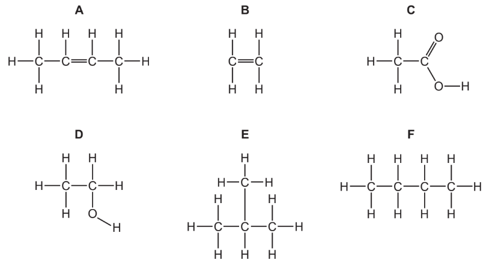
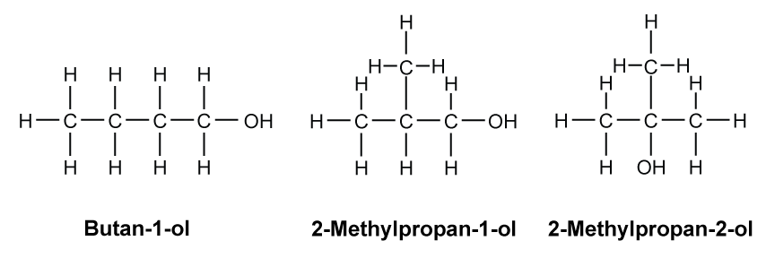
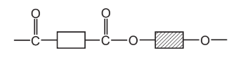
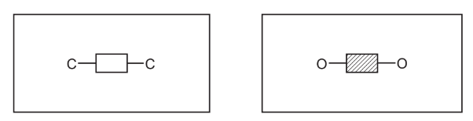
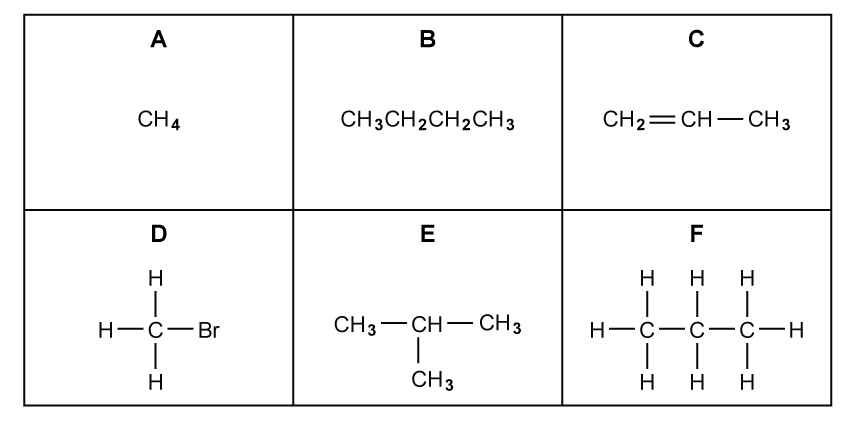

# Exam Questions — Introducing organic chemistry
**4. Organic Chemistry: Part 1** · Edexcel IGCSE Chemistry (Modular) (4XCH1) — 24/Unit 1
> Source: [https://www.savemyexams.com/igcse/chemistry/edexcel/modular/24/unit-1/topic-questions/organic-chemistry/introduction-to-organic-chemistry/exam-questions/](https://www.savemyexams.com/igcse/chemistry/edexcel/modular/24/unit-1/topic-questions/organic-chemistry/introduction-to-organic-chemistry/exam-questions/) · 15 questions · total 107 marks

## Q1 — easy — 1 marks · exam-questions

### 1() — 1 mark — multiple_choice
The displayed formulae of an organic compound is shown below.

What is the empirical formula of this compound?
- **A.** CHBr
- **B.** CH2Br
- **C.** C2H4Br2
- **D.** CH4Br

## Q2 — easy — 1 marks · exam-questions

### 1() — 1 mark — multiple_choice
The structures of four organic compounds are shown.

Which one does **not** show the displayed formula of the compound?
- **A.** 
- **B.** 
- **C.** 
- **D.** 

## Q3 — easy — 1 marks · exam-questions

### 1() — 1 mark — multiple_choice
Which of the following is **not** a feature of a homologous series?
- **A.** Compounds have the same functional group
- **B.** Compounds have the same physical properties
- **C.** Compounds have the same general formula
- **D.** Compounds have similar chemical properties

## Q4 — easy — 13 marks · exam-questions

### 1() — 4 marks — command: complete — structured
This question is about alkanes and alkenes.

Complete the boxes by giving the missing information about the alkene with the molecular formula C2H4.

| ** Molecular formula** | C2H4 |
|---|---|
| ** Name** |   |
| ** Empirical formula** |   |
| ** General formula** |   |
| ** Displayed formula** |   |

### 2() — 3 marks — command: state — structured
Alkenes are unsaturated hydrocarbons.

State what is meant by the terms **unsaturated **and **hydrocarbon**.

### 3() — 4 marks — command: complete — structured
Butene, C4H8, is a member of the same homologous series as C2H4.

Use the words in the box to complete the sentences.

| chemical | general | group | functional |
|---|---|---|---|
| molecular | period | physical | structural |

Butene, C4H8, and C2H4 have the same .................... formula and .................... group.

They will show similar .................... properties but there will be differences in their .................... properties, such as density and boiling point.

### 4() — 2 marks — command: multiple — structured
When the alkene butene reacts with bromine, the product is dibromobutane, C4H8Br2.

i) Give a word equation for this reaction.

(1)

ii) What is the name of this type of reaction?

(1)

| ☐ | **A** | addition |
|---|---|---|
| ☐ | **B** | decomposition |
| ☐ | **C** | neutralisation |
| ☐ | **D** | substitution |

## Q5 — easy — 6 marks · exam-questions

### 2((a)) — 1 mark — command: give — structured — from paper 2016 · Ju43
The structures of six organic compounds are shown.

Give the name of **F**.

### 2((b)) — 1 mark — command: identify — structured — from paper 2016 · Ju43
Identify two compounds that are members of the same homologous series.

### 3() — 2 marks — command: state — structured
Compounds **E **and **F **are isomers of each other.

State what is meant by the term **isomers**.

### 2((d)) — 2 marks — command: explain — structured — from paper 2016 · Ju43
Explain why **B** is an unsaturated hydrocarbon.

## Q6 — medium — 6 marks · exam-questions

### 8((a)) — 1 mark — command: complete — structured — from paper 2019 · Ju1C
Ethene (C2H4) can be converted into chloroethene (C2H3Cl) in a two-stage process.

The first stage is to convert ethene into 1,2-dichloroethane, C2H4Cl2

Ethene is reacted with hydrogen chloride and oxygen.

Complete the chemical equation for this reaction.

.......... C2H4 + .......... HCl + .......... O2 → .......... C2H4Cl2 + .......... H2O

### 8((b)) — 1 mark — command: state — structured — from paper 2019 · Ju1C
In the second stage, 1,2-dichloroethane is converted into chloroethene.

C2H4Cl2 → C2H3Cl + HCl

This is a thermal decomposition reaction.

State what is meant by the term **thermal decomposition.**

### 8((c)) — 3 marks — command: multiple — structured — from paper 2019 · Ju1C
The diagram shows the displayed formula of chloroethene.

i) State why chloroethene is described as an unsaturated compound.

(1)

ii) Describe a test to show that chloroethene is unsaturated.

(2)

### 8((d)) — 1 mark — command: name — structured — from paper 2019 · Ju1C
Name the polymer formed from chloroethene.

## Q7 — medium — 1 marks · exam-questions

### 1() — 1 mark — multiple_choice
The structures of six organic compounds are shown.

Which two compounds are isomers of one another?
- **A.** B and D
- **B.** A and C
- **C.** C and F
- **D.** C and E

## Q8 — medium — 1 marks · exam-questions

### 1() — 1 mark — multiple_choice
Which of the following reactions is an example of an addition reaction?
- **A.** CH4 + ½O2 → CO + 2H2O
- **B.** C2H4 + Br2 → C2H4Br2
- **C.** CH4 + 2O2 → CO2 + 2H2O
- **D.** CH4 + Br2 → CH3Br + HBr

## Q9 — medium — 11 marks · exam-questions

### 1() — 2 marks — command: multiple — structured
This question is about organic compounds.

Propane is the third member of the homologous series of alkanes.

i) State the name of the third member of the homologous series of alkenes.

(1)

ii) Explain why propane and the third member of the homologous series of alkenes do not have similar chemical properties.

(1)

### 2() — 3 marks — command: multiple — structured
Propene is bubbled through bromine water until there is no further colour change.

i) Give the chemical equation for this reaction.

(1)

ii) How does the observation support that this is an addition reaction?

(2)

### 3() — 3 marks — command: multiple — structured
#### Separate: Chemistry Only

In industry, ethene is reacted with steam to form ethanol.

i) Using structural formulae, give the chemical equation for this reaction.

(1)

ii) State the temperature and pressure required for this reaction.

(2)

### 4() — 3 marks — command: multiple — structured
#### Separate: Chemistry Only

Ethanol oxidises slowly in air to form a chemical that is a member of a different homologous series and has a bitter smell.

i) State the homologous series to which the oxidation product belongs.

(1)

ii) Give the empirical and molecular formulae of the oxidation product.

(2)

## Q10 — medium — 14 marks · exam-questions

### 6((a)) — 4 marks — command: multiple — structured — from paper 2013 · O33
The alcohols form a homologous series with the general formula CnH2n+1OH.

The first five members of the homologous series are given in the table below.

| **alcohol** | **formula** |
|---|---|
| **methanol ** | CH3OH |
| **ethanol ** | CH3–CH2–OH |
| **propan-1-ol** |   |
| **butan-1-ol ** | CH3–CH2–CH2–CH2–OH |
| **pentan-1-ol ** | CH3–CH2–CH2–CH2–CH2–OH |

i) Complete the table.

(1)

ii) Complete the equation for the reaction of butan-1-ol in excess oxygen.

C4H9OH + .......O2 → ..................... + .....................

(2)

iii) What is the name of the type of reaction occurring between butan-1-ol and oxygen?

(1)

### 6((b)) — 3 marks — command: state — structured — from paper 2013 · O33
State **three **characteristics of a homologous series other than the variation of physical properties down the series.

### 6((c)) — 3 marks — command: multiple — structured — from paper 2013 · O33
There are four isomers with the molecular formula C4H9OH that are alcohols.

These are the displayed formulae of the isomers.

i) Explain why they are isomers.

(2)

ii) Draw the displayed formula of the fourth isomer.

(1)

### 4() — 4 marks — command: multiple — structured
An alcohol has this percentage composition by mass.

C = 60.0%       H = 13.3%       O = 26.7%

i) Show by calculation that the molecular formula of the alcohol could be C3H8O.

(3)

ii) Explain why the empirical formula is also the molecular formula of the alcohol.

(1)

## Q11 — hard — 9 marks · exam-questions

### 1() — 4 marks — command: write — structured
The formulas for four organic compounds are given in the table below.

Write the names of each of the compounds.

| **Structure** | **Name** |
|---|---|
| CH3CH2CH2CH2OH |   |
| CH3CH2CH2NH2 |   |
| CH3COOCH2CH2CH3 |   |
| CH3CH2CH2OH |   |

### 2() — 2 marks — command: balance — structured
CH3CH2CH2OH undergoes a combustion reaction in excess oxygen. Write a balanced symbol equation for this reaction.

### 3() — 2 marks — command: calculate — structured
Compound A has an *M*r of 102 and contains the same functional group as CH3CH2CH2OH. Calculate the percentage by mass of carbon in compound A.

(*A*r: O = 16, C = 12, H = 1)

### 4() — 1 mark — command: draw — structured
Draw the displayed formula of CH3CH2CH2NH2

## Q12 — hard — 5 marks · exam-questions

### 1() — 3 marks — command: calculate — structured
Compound X is a hydrocarbon with an *M*r of 70 that contains 85.7% by mass of carbon. When bromine water is added to compound X it remains orange.

Calculate the empirical formula of compound X

### 2() — 1 mark — command: determine — structured
Using the information in part a), determine the structure of compound X.

### 3() — 1 mark — command: write — structured
Compound X reacts with chlorine in the presence of ultra-violet light. Write the equation for this reaction.

## Q13 — hard — 16 marks · exam-questions

### 7() — 3 marks — command: multiple — structured — from paper 2016 · Ja42
Alkanes and alkenes are examples of hydrocarbons.

i) What is meant by the term hydrocarbon?

(1)

ii) Give the general formula of straight-chain

alkanes.

alkenes.

(2)

### 7() — 4 marks — command: multiple — structured — from paper 2016 · Ja42
A compound X contains carbon, hydrogen and oxygen only.

X contains 54.54% of carbon by mass, 9.09% of hydrogen by mass and 36.37% of oxygen by mass.

i) Calculate the empirical formula of compound X.

(2)

ii) Compound X has a relative molecular mass of 88.

Deduce the molecular formula of compound X.

(2)

### 7() — 4 marks — command: give — structured — from paper 2016 · Ja42
#### Separate: Chemistry Only

An ester has the molecular formula C3H6O2. Name and give the structural formulae of two esters with the molecular formula C3H6O2.

| **Name of ester** |   |   |
|---|---|---|
| **Structural formula** |   |   |

### 7() — 1 mark — command: name — structured — from paper 2016 · Ja42
#### Separate: Chemistry Only

Name the ester produced from the reaction of propanoic acid and methanol.

### 7() — 4 marks — command: multiple — structured — from paper 2016 · Ja42
#### Separate: Chemistry Only

A polyester is represented by the structure shown.

i) What type of polymerization is used for the production of polyesters?

(1)

ii) Which simple molecule is removed when the polyester is formed?

(1)

iii) Complete the diagrams below to show the structures of the monomers used to produce the polyester. Show all atoms and bonds.

(2)

## Q14 — hard — 10 marks · exam-questions

### 1() — 2 marks — command: explain — structured
There is a number of compounds with the molecular formula C4H8.

Explain how more than one compound can have the same molecular formula.

### 2() — 2 marks — command: draw — structured
Draw the displayed formulae of two isomers with the formula C4H8 that belong to different homologous series.

| **isomer 1**  ** **  ** **  ** **  ** **  ** ** | **isomer 2**  ** **  ** **  ** **  ** **  ** ** |
|---|---|

### 3() — 4 marks — command: multiple — structured
i) Describe a chemical test to show that compounds with the molecular formula C4H8 belong to different homologous series.

(3)

ii) Explain how the results of the chemical test in part (i) proves that compounds with the molecular formula C4H8 belong to different homologous series.

(1)

### 4() — 2 marks — command: multiple — structured
Some organic compounds with the molecular formula C4H8 can be hydrated to form alcohols.

i) Give a chemical equation for this reaction.

(1)

ii) State the name of this type of reaction.

(1)

## Q15 — hard — 12 marks · exam-questions

### 1() — 2 marks — command: explain — structured
The diagram shows the formulae of some organic compounds.

i) Explain which compound is not a hydrocarbon.

(1)

ii) Explain which compounds are shown as displayed formulae.

(1)

### 2() — 2 marks — command: multiple — structured
An example of the reaction of compound **B **with a halogen is shown.

C4H10 + Cl2 → C4H9Cl + compound **G**

i) State the condition needed for this reaction to occur

(1)

ii) Deduce the formula of compound **G**.

(1)

### 3() — 4 marks — command: multiple — structured
Compound **D** undergoes combustion to form a toxic colourless gas, a brown gas and one other product.

i) Give a chemical equation for this reaction.

(2)

ii) Explain how the toxic colourless gas affects the respiratory system.

(2)

### 4() — 4 marks — command: multiple — structured
Compound **H** belongs to the same homologous series as compound **A**.

The complete combustion of one mole of compound **H** burns is represented by the equation

compound **H** + *x* O2 → *y* CO2 + *z* H2O

The numbers *x*, *y* and *z* are used to balance the equation.

i) One mole of compound **H** burning completely in oxygen produces 308 g of carbon dioxide and 144 g of water.

Calculate the values of *y* and *z*.

[*M*r of CO2 = 44, *M*r of H2O = 18]

(2)

*y* = ..........

*z* = ..........

ii) Determine the molecular formula of the compound **H** and the value of *x*.

(2)

molecular formula = ..........

*x* = ..........
