# Exam Questions — Energetics
**3. Physical Chemistry: Part 1** · Edexcel IGCSE Chemistry (Modular) (4XCH1) — 24/Unit 1
> Source: [https://www.savemyexams.com/igcse/chemistry/edexcel/modular/24/unit-1/topic-questions/physical-chemistry/energetics/exam-questions/](https://www.savemyexams.com/igcse/chemistry/edexcel/modular/24/unit-1/topic-questions/physical-chemistry/energetics/exam-questions/) · 24 questions · total 172 marks

## Q1 — easy — 1 marks · exam-questions

### 1() — 1 mark — multiple_choice
Which is true about chemical energy changes?

|   | ** Reaction type** | **Energy flows** | **Temperature of surroundings** |
|---|---|---|---|
| **A** | exothermic | to the surroundings | increases |
| **B** | exothermic | from the surroundings | decreases |
| **C** | endothermic | to the surroundings | decreases |
| **D** | endothermic | from the surroundings | increases |
- **A.** Option A
- **B.** Option B
- **C.** Option C
- **D.** Option D

## Q2 — easy — 1 marks · exam-questions

### 1() — 1 mark — multiple_choice
Which statement is **true **about exothermic and endothermic reactions?
- **A.** The products have more energy than the reactants in an exothermic reaction
- **B.** The products have more energy than the reactants in an endothermic reaction
- **C.** The activation energy for an exothermic reaction is always larger than the activation energy for an endothermic reaction
- **D.** Most reactions are endothermic

## Q3 — easy — 1 marks · exam-questions

### 1() — 1 mark — multiple_choice
When solid sodium oxide is added to water, an exothermic reaction occurs:

Na2O (s) + H2O (l)$\rightarrow$2NaOH (aq)

A student uses the apparatus below to measure the temperature change of the reaction:

The student records the following results for the reaction:

mass of sodium oxide used = 3.0 g

volume of water used = 50 cm3

starting temperature of mixture = 19.5 oC

maximum temperature of mixture = 30.5 oC

What is the heat energy, Q,  released in this experiment, in J?

c = 4.2 J/g/ oC

mass of 1 cm3 of water = 1 g
- **A.** Q = 2,310 J
- **B.** Q = 2,450 J
- **C.** Q = 139 J
- **D.** Q = 126 J

## Q4 — easy — 1 marks · exam-questions

### 1() — 1 mark — multiple_choice
#### Separate: Chemistry Only

The graph below shows a reaction profile for the reaction between methane and oxygen.

What does the label X represent?
- **A.** Activation Energy
- **B.** Overall energy change
- **C.** Reactants
- **D.** Progress of the reaction

## Q5 — easy — 1 marks · exam-questions

### 1() — 1 mark — multiple_choice
#### Separate: Chemistry Only

The reaction profile for making nitrogen monoxide, NO, is shown below:

What is the activation energy for this reaction?
- **A.** +140 kJ
- **B.** +180 kJ
- **C.** +320 kJ
- **D.** -330 kJ

## Q6 — medium — 14 marks · exam-questions

### 8((a)) — 3 marks — command: multiple — structured — from paper 2020 · Nov1C
A student uses this apparatus to investigate the heat energy change when a salt dissolves in water to form a solution.

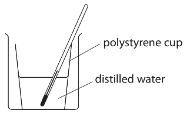

This is the student’s method.

- Add 50 cm3 of distilled water to a polystyrene cup
- Record the initial temperature of the water
- Add a known mass of solid anhydrous copper(II) sulfate to the polystyrene cup and stir the solution with the thermometer until all the solid has dissolved
- Record the maximum temperature of the copper(II) sulfate solution

i) Name the piece of apparatus the student should use to add the distilled water to the polystyrene cup.

(1)

ii) The student stirs the solution to help the solid dissolve more quickly.

Suggest another reason why the student stirs the solution.

(1)

iii) State the colour of the copper(II) sulfate solution.

(1)

### 8((b)) — 3 marks — command: complete — structured — from paper 2020 · Nov1C
The diagram shows the temperatures in one experiment.

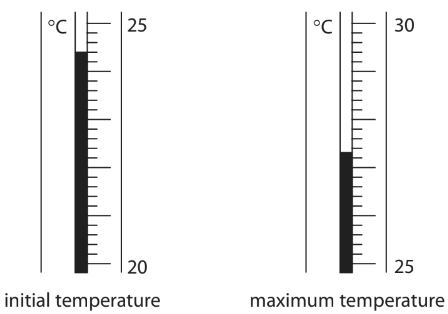

Complete the table, giving all values to the nearest 0.1 °C.

| maximum temperature in °C |   |
|---|---|
| initial temperature in °C |   |
| increase in temperature in °C |   |

### 8((c)) — 6 marks — command: multiple — structured — from paper 2020 · Nov1C
In a second experiment, when a student dissolves the anhydrous copper(II) sulfate in 50 cm3 of distilled water, the increase in temperature is 3.3 °C.

i) Show that the heat energy change (Q) in this second experiment is approximately 700 J.

[for water, c = 4.2 J / g / °C]

[mass of 1.0 cm3 of water = 1.0 g]

(2)

ii) In this experiment, the student uses 1.70 g of the anhydrous copper(II) sulfate.

Calculate the molar enthalpy change (Δ*H*) in kJ / mol.

Include a sign in your answer.

[*M*r of CuSO4 = 159.5]

(4)

Δ*H* = ................................ kJ / mol

### 8((d)) — 2 marks — command: explain — structured — from paper 2020 · Nov1C
Another student does a similar experiment but uses hydrated copper(II) sulfate instead of anhydrous copper(II) sulfate.

The table shows his results.

| initial temperature in °C | 23.8 |
|---|---|
| final temperature in °C when all solid dissolves | 22.7 |

Explain what the results show about the type of energy change that occurs when hydrated copper(II) sulfate dissolves.

## Q7 — medium — 9 marks · exam-questions

### 12((a)) — 2 marks — command: explain — structured — from paper 2019 · Ju1C
A student uses this apparatus to investigate the temperature change that occurs when ammonium nitrate is dissolved in water.

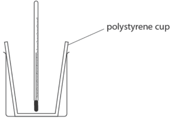

She uses this method.

- put 100 cm3 of water into the polystyrene cup and measure the initial temperature of the water
- add 8.00 g of ammonium nitrate and stir
- record the lowest temperature reached by the solution

The table shows her results.

| **Initial temperature of water in ****o****C** | 20.0 |
|---|---|
| **Lowest temperature of solution in ****o****C** | 14.2 |

Use the results of the experiment to explain what type of reaction is taking place when ammonium nitrate is added to water.

### 12((b)) — 3 marks — command: show — structured — from paper 2019 · Ju1C
Show that the heat energy change, *Q*, is about 2400 J.

[mass of 1.00 cm3 of solution = 1.00 g]

[for the solution, *c* = 4.185 J / g / °C]

*Q *= .............................. J

### 12((c)) — 4 marks — command: calculate — structured — from paper 2019 · Ju1C
Use your answer to part (b) to calculate the enthalpy change, Δ*H*, in kilojoules per mole of ammonium nitrate.

[*M*r of ammonium nitrate = 80.0]

Include a sign in your answer.

Δ*H* = .............................. kJ / mol

## Q8 — medium — 1 marks · exam-questions

### 1() — 1 mark — multiple_choice
Sodium oxide reacts with water to form sodium hydroxide.

A scientist plans to measure the temperature change of the reaction using calorimetry in a lab.

This is the scientist's basic method:

- use 50 g of water
- record the temperature of the water
- add sodium hydroxide
- stir
- record the maximum temperature reached

Which apparatus list is the most appropriate for this experiment?
- **A.** Electronic balance, measuring cylinder, glass beaker, thermometer
- **B.** Measuring cylinder, glass beaker, polystyrene cup, thermometer
- **C.** Electronic balance, glass beaker, polystyrene cup, thermometer
- **D.** Measuring cylinder, glass beaker, glass rod, thermometer

## Q9 — medium — 15 marks · exam-questions

### 9((a)) — 1 mark — command: suggest — structured — from paper 2020 · Ja1C
A student uses this apparatus to investigate the heat energy released when a liquid fuel is burned.

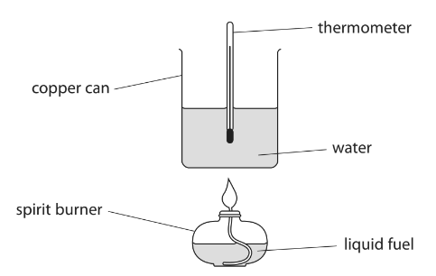

This is the student’s method.

- measure the mass of the spirit burner and fuel
- add 100 cm3 of water to the copper can
- record the temperature of the water
- use the spirit burner to heat the water until the temperature rises by 30 °C
- immediately measure the new mass of the spirit burner and fuel

Suggest why the student measures the mass of the spirit burner and fuel immediately after heating the water.

### 9((c)) — 3 marks — command: multiple — structured — from paper 2020 · Ja1C
When the fuel is burned, the student notices that a black solid forms on the bottom of the copper can.

i) Identify the black solid.

(1)

ii) Explain why the black solid forms.

(2)

### 9((c)) — 6 marks — command: multiple — structured — from paper 2020 · Ja1C
i) Show that the heat energy change, Q, to raise the temperature of 100 cm3 of water by 30 °C is approximately 13 kJ.

[mass of 1.0 cm3 of water = 1.0 g] [c for water = 4.2 J / g / °C]

(3)

ii) The student burns 0.96 g of methanol, CH3OH Calculate the molar enthalpy change, Δ*H*, in kJ / mol, for the combustion of methanol. Include a sign in your answer. [*M*r of methanol = 32]

(3)

Δ*H* = ...................................................................... kJ / mol

### 9((d)) — 5 marks — command: multiple — structured — from paper 2020 · Ja1C
The table shows data book values for the molar enthalpy change, Δ*H*, for the combustion of some alcohols with different numbers of carbon atoms per molecule.

| ** Number of carbon atoms per molecule** | 1 | 2 | 3 | 4 | 5 |
|---|---|---|---|---|---|
| ** Molar enthalpy change, Δ*****H*****, in kJ/mol** | -730 | -1370 | -2020 | -2680 | -3320 |

i) Plot the data values from the table on the grid. Draw a straight line of best fit.

(2)

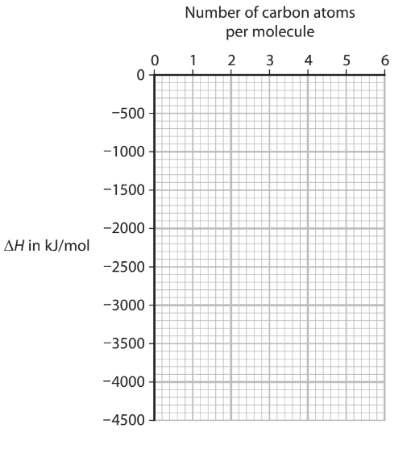

ii) Deduce the value of Δ*H* for an alcohol with six carbon atoms per molecule. Show on the graph how you obtained your answer.

(2)

Δ*H* = ...................................................................... kJ/mol

iii) State the relationship between Δ*H* and the number of carbon atoms per molecule.

(1)

## Q10 — medium — 13 marks · exam-questions

### 7((a)) — 3 marks — command: describe — structured — from paper 2021 · Ja1C
This question is about lithium oxide.

The diagram shows the electron configurations of an atom of lithium and an atom of oxygen.

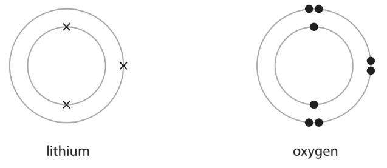

Describe the changes in electronic configuration when lithium and oxygen react to form lithium oxide, Li2O

### 7((b)) — 10 marks — command: multiple — structured — from paper 2021 · Ja1C
Lithium oxide reacts with water to form lithium hydroxide as the only product. A scientist uses this apparatus to measure the temperature change of the reaction.

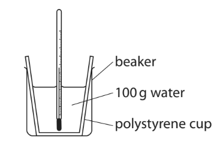

This is the scientist’s method.

- pour 100 g of water into a polystyrene cup
- record the temperature of the water
- add the lithium oxide and stir the mixture
- record the maximum temperature reached

The diagram shows the thermometer readings before and after adding the lithium oxide.

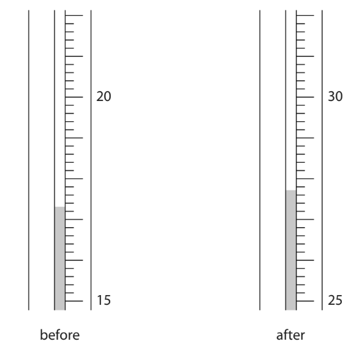

i) Complete the table, giving all values to the nearest 0.1 °C.

(2)

| temperature in °C after adding the lithium oxide |   |
|---|---|
| temperature in °C before adding the lithium oxide | 17.3 |
| temperature rise in °C |   |

ii) Calculate the heat energy change in the reaction. Give your answer to two significant figures. [c = 4.2 J / g / °C]

(4)

heat energy change = .............................. J

iii) In another experiment the scientist obtains these results.

| amount of lithium oxide in mol | 0.0580 |
|---|---|
| heat energy change in J | 5210 |

Calculate the molar enthalpy change (Δ*H*) in kJ / mol. Include a sign in your answer.

(3)

Δ*H* = ..............................kJ / mol

iv) Give a reason why the scientist does the experiment in a polystyrene cup.

(1)

## Q11 — medium — 1 marks · exam-questions

### 1() — 1 mark — multiple_choice
Another student carries out the experiment to find the heat energy released in the reaction of sodium oxide with water:

Na2O (s) + H2O (l) $\rightarrow$ 2NaOH (aq)

They found that 10,800 J of heat energy was released when 0.060 mol of sodium oxide reacts.

What is the value of Δ*H*, in kJ/mol, for the reaction of sodium oxide with water?
- **A.** 0.0056 kJ/mol
- **B.** 180 kJ/mol
- **C.** 1,800 kJ/mol
- **D.** 8,000 kJ/mol

## Q12 — medium — 1 marks · exam-questions

### 1() — 1 mark — multiple_choice
The actual molar enthalpy change, Δ*H*, for the reaction of sodium oxide with water, is -238 kJ/mol.

Experimental results from calorimetry in labs give less exothermic results.

Which of the following does not explain this difference?
- **A.** The reaction may have been incomplete
- **B.** Heat energy also transfers to the surroundings
- **C.** The calorimetry equipment also has a specific heat capacity, and so affects the final temperature reading
- **D.** The student measured the initial temperature of the water as lower than the actual value.

## Q13 — medium — 10 marks · exam-questions

### 10((a)) — 3 marks — command: multiple — structured — from paper 2019 · Ju1CR
A student investigates the reaction between zinc and copper(II) sulfate solution. The equation for the reaction is

Zn + CuSO4 → Cu + ZnSO4

This is his method.

- add exactly 25.0 cm3 of copper(II) sulfate solution to a polystyrene cup
- record the temperature of the solution
- add about 5 g of zinc powder (an excess) and stir the mixture
- record the highest temperature reached

i) Suggest why it is not important to add an exact mass of zinc powder.

(1)

ii) State the colour change of the solution. from ........................................................... to ...........................................................

(2)

### 10((b)) — 7 marks — command: multiple — structured — from paper 2019 · Ju1CR
The table shows the student’s results

| volume of copper(II) sulfate solution in cm3 | 25.0 |
|---|---|
| initial temperature of copper(II) sulfate solution in °C | 19.0 |
| final temperature of solution in °C | 31.5 |

i) Show that the heat energy change (Q) is about 1300 J. [for the solution, c = 4.18 J/g/°C] [mass of 1.00 cm3 of solution = 1.00 g]

(3)

ii) The mass of anhydrous copper(II) sulfate (CuSO4) used to make 25.0 cm3 of solution is 2.00 g. Calculate the amount, in moles, of CuSO4 in 2.00 g. [*M**r* of CuSO4 = 159.5]

(1)

iii) Calculate the value of the enthalpy change *(*Δ*H),* in kilojoules per mole, for the reaction between zinc and copper(II) sulfate. Include a sign in your answer.

(3)

## Q14 — medium — 10 marks · exam-questions

### 1() — 5 marks — command: calculate — structured — from paper 2019
#### Separate: Chemistry Only

During the Second World War, engineers developed a rocket-powered aircraft.

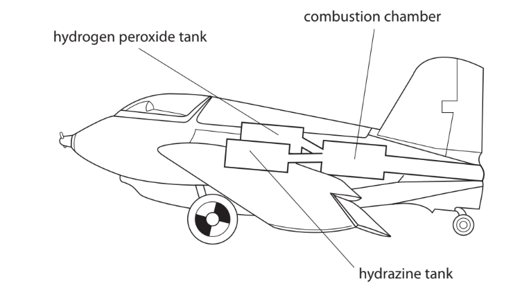

The aircraft carried these two liquids

- hydrazine, N2H4
- hydrogen peroxide, H2O2

When these two liquids mix in the combustion chamber, they evaporate and then react rapidly to form nitrogen gas, N2, and steam, H2O

The reaction is exothermic.

The equation for the reaction is

N2H4 + 2H2O2 → N2 + 4H2O

The displayed formulae for the reactants and products are

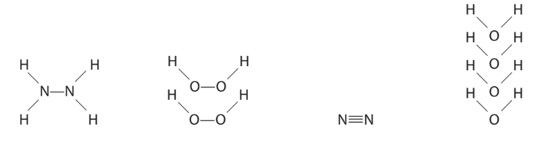

The tables give the bond energies for the bonds broken in the reactants and the bonds made in the products.

| **Bonds broken ** |   | **Bonds made** |   |
|---|---|---|---|
| bond | bond energy  in kJ/mol | bond | bond energy  in kJ/mol |
| N—N | 159 | N=N | 945 |
| N—H | 391 |   |   |
| O—O | 143 | O—H | 463 |
| O—H | 463 |   |   |

i) Use the data in the tables to calculate the total amount of energy required to break all of the bonds in the reactants.

(1)

energy required = .............................................................. kJ

ii) Use the data in the tables to calculate the total amount of energy released when all of the bonds in the products are made.

(1)

energy released = .............................................................. kJ

iii) Calculate the enthalpy change, ∆*H*, in kJ/mol, for the reaction.

Include a sign in your answer.

(3)

∆H = .............................................................. kJ/mol

### 2() — 2 marks — command: explain — structured — from paper 2019
#### Separate: Chemistry Only

Explain, in terms of bonds broken and bonds made, why this reaction is exothermic.

### 5((c)) — 3 marks — command: draw — structured — from paper 2019 · Ju2C
#### Separate: Chemistry Only

Draw an energy level diagram for the reaction between N2H4 and H2O2

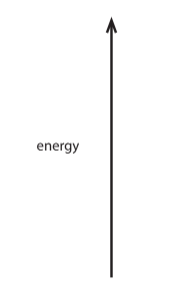

## Q15 — medium — 8 marks · exam-questions

### 5((a)) — 1 mark — multiple_choice — from paper 2020 · Ja202C
Oxygen can be prepared from hydrogen peroxide using a catalyst.

Which is a correct statement about oxygen?
- **A.** it burns with a squeaky pop
- **B.** it relights a glowing splint
- **C.** it turns blue litmus red
- **D.** it turns limewater milky

### 5((b)) — 2 marks — command: explain — structured — from paper 2020 · JA202C
Explain how a catalyst increases the rate of a reaction.

### 4((c)) — 5 marks — command: multiple — structured — from paper 2020 · Ja202C
#### Separate: Chemistry Only

The equation for the preparation of oxygen from hydrogen peroxide is

2H2O2 → 2H2O + O2

This equation can also be written using displayed formulae to show all the covalent bonds in the molecules.

2H—O—O—H → 2H—O—H + O=O

The table gives the bond energies for these bonds.

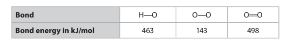

i) Use the values in the table to calculate the enthalpy change, Δ*H*, for the reaction. Include a sign in your answer.

(3)

ii) Complete the energy level diagram to show the position of the products and the enthalpy change, Δ*H*, for the reaction.

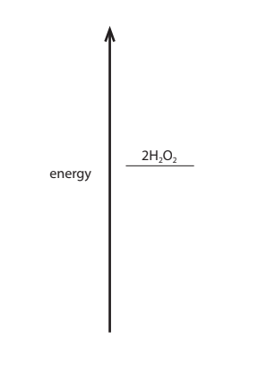

(2)

## Q16 — medium — 1 marks · exam-questions

### 1() — 1 mark — multiple_choice
#### Separate: Chemistry Only

Chlorine reacts with methane in sunlight.

CH4 + Cl2  → CH3Cl + HCl

The diagram below shows the displayed formulae for the reaction of chlorine with methane.

The table below shows the bond energies and the overall energy change in the reaction.

|   | **C-H** | **Cl-Cl** | **C-Cl** | **H-Cl** | **Overall energy change** |
|---|---|---|---|---|---|
| **Energy in kJ/mol** | 413 | 243 | X | 432 | -122 |

What is the value of X?
- **A.** 67
- **B.** 134
- **C.** 346
- **D.** 542

## Q17 — medium — 12 marks · exam-questions

### 7((a)) — 1 mark — command: state — structured — from paper 2022 · Ja2CR
The reaction between hydrogen and chlorine is exothermic. This is the equation for the reaction.

H2 (g) + Cl2 (g) → 2HCl (g)        Δ*H* = −184kJ

State the meaning of the term exothermic.

### 7((b)) — 4 marks — command: calculate — structured — from paper 2022 · Ja2CR
#### Separate: Chemistry Only

The table gives the bond energies for the H–H and H–Cl bonds.

| ** Bond** | H–H | H–Cl |
|---|---|---|
| ** Bond energy in kJ/mol** | 436 | 431 |

Use the equation and information from the table to calculate the bond energy of the Cl–Cl bond.

bond energy = .............................................................. kJ/mol

### 7((c)) — 3 marks — command: explain — structured — from paper 2022 · Ja2CR
#### Separate: Chemistry Only

Explain why this reaction is exothermic. Refer to bond-breaking and bond-making in your answer.

### 7((d)) — 4 marks — command: complete — structured — from paper 2022 · Ja2CR
#### Separate: Chemistry Only

Complete the reaction profile diagram to show the position of the products, the enthalpy change (Δ*H*) and the activation energy (*E*a) for the reaction.

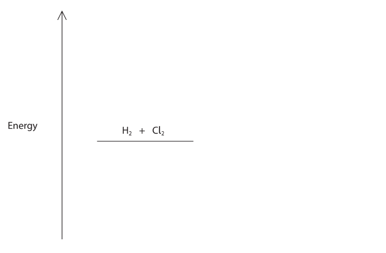

## Q18 — medium — 9 marks · exam-questions

### 1() — 6 marks — command: multiple — structured
This question is about chemical energy changes.

Zinc reacts with copper(II) sulfate solution to form copper and zinc sulfate

A student uses this apparatus to measure the temperature change of the reaction.

This is the student’s method.

- pour 100 cm3 of copper(II)sulfate solution into a polystyrene cup
- record the temperature of the solution
- add the zinc powder and stir the mixture
- record the maximum temperature reached

The diagram shows the thermometer readings before and after adding the zinc powder.

i) Complete the table, giving all values to the nearest 0.1o C.

| temperature in oC after adding the zinc |   |
|---|---|
| temperature in oC before adding the zinc | 17.7 |
| temperature rise in °C |   |

[2]

ii) Calculate the heat energy change in the reaction.

Give your answer to two significant figures.

[c = 4.2 J/g/oC]

[4]

### 2() — 3 marks — command: multiple — structured
i) State two observations you might expect to see in the reaction

[2]

ii) Give the name of the type of reaction taking place.

[1]

## Q19 — hard — 12 marks · exam-questions

### 10((a)) — 2 marks — command: suggest — structured — from paper 2017 · Specimen1C
When aqueous solutions of potassium hydroxide and nitric acid are mixed together, an exothermic reaction occurs. The diagram shows the apparatus used in an experiment to measure the temperature increase.

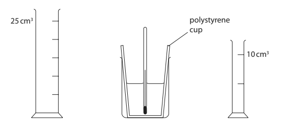

This is the student’s method:

- use the larger measuring cylinder to add 25cm3 of aqueous potassium hydroxide to the polystyrene cup
- record the steady temperature
- use the smaller measuring cylinder to add 5cm3 of dilute nitric acid to the cup, stir the mixture with the thermometer
- record the highest temperature of the mixture
- continue adding further 5cm3 portions of dilute nitric acid to the cup, stirring and recording the temperature, until a total volume of 35cm3 has been added.

A teacher advises the student to use a 50 cm3 burette instead of the 10 cm3 measuring cylinder. Suggest **two** reasons why it would be better to use a burette instead of a measuring cylinder to add the acid in this experiment.

### 10((b)) — 2 marks — command: complete — structured — from paper 2017 · Specimen1C
The diagram shows the thermometer readings at the start and at the end of one experiment.

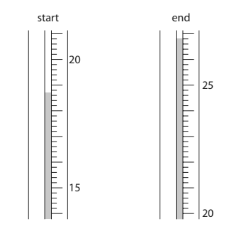

Complete the table to show:

- the thermometer reading at the start of the experiment
- the temperature rise in the experiment.

| thermometer reading at end / °C | 26.8 |
|---|---|
| thermometer reading at start / °C |   |
| thermometer rise / °C |   |

### 10((c)) — 2 marks — command: identify — structured — from paper 2017 · Specimen1C
Another student uses the same method, adding the dilute nitric acid from a burette. The table shows his results.

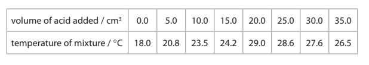

This is the student’s graph.

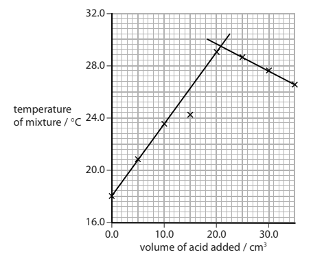

The point where the lines cross represents complete neutralisation.

i) Identify the maximum temperature reached during the experiment.

(1)

maximum temperature = .............................................................. °C

ii) Identify the volume of dilute nitric acid that exactly neutralises the 25 cm3 of aqueous potassium hydroxide.

(1) 
volume = .............................................................. cm3

### 10((d)) — 4 marks — command: calculate — structured — from paper 2017 · Specimen1C
Another student records these results.

| volume of aqueous potassium hydroxide | 20.0 cm3 |
|---|---|
| starting temperature of aqueous potassium hydroxide | 18.5 °C |
| maximum temperature of mixture | 30.0 °C |
| volume of dilute nitric acid | 20.0 cm3 |

Calculate the heat energy released in this experiment.

| c = 4.2 J /g/ °C |
|---|
| mass of 1 cm3 of mixture = 1 g |

heat energy = .............................................................. J

### 10((e)) — 2 marks — command: calculate — structured — from paper 2017 · Specimen1C
In another experiment, the heat energy released is 1600 J when 0.040 mol of potassium hydroxide is neutralised. Calculate the value of Δ*H*, in kJ/mol, for the neutralisation of potassium hydroxide.

Δ*H* = .............................................................. kJ/mol

## Q20 — hard — 9 marks · exam-questions

### 7((a)) — 1 mark — command: complete — structured — from paper 2021 · Ju1C
A student investigates the reaction between magnesium and hydrochloric acid.

He uses this method:

Step 1: add 25 cm3 of dilute hydrochloric acid to a polystyrene cup

Step 2: record the temperature of the acid

Step 3: find the mass of a 10 cm strip of magnesium ribbon

Step 4: add the magnesium ribbon to the hydrochloric acid

Step 5: when all the magnesium has reacted, record the highest temperature reached

Complete the word equation for the reaction.

magnesium + hydrochloric acid → ......................... + ...........................

### 7((b)) — 8 marks — command: multiple — structured — from paper 2021 · Ju1C
The thermometer shows the temperature of the acid at the start of the experiment.

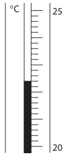

i) Complete the table by giving the temperatures to the nearest 0.1 °C.

(2)

| **temperature of the acid at the start in °C** |   |
|---|---|
| **highest temperature reached in °C** |   |
| **temperature rise in °C** | 20.8 |

ii) Show that the heat energy change (Q) for this reaction is about 2200 J.

[mass of 1.0 cm3 of solution = 1.0 g]

[for the solution, c = 4.2 J / g / °C]

(2)

iii) The mass of magnesium used by the student was 0.12 g.

Calculate the value of the enthalpy change (Δ*H*), in kilojoules per mole of magnesium, for the reaction between magnesium and hydrochloric acid.

Include a sign in your answer.

(4)

## Q21 — hard — 12 marks · exam-questions

### 6((a)) — 2 marks — command: multiple — structured — from paper 2020 · Ja1CR
The reaction between magnesium and copper(II) sulfate solution is exothermic. This apparatus is used to measure the temperature increase when excess magnesium is added to 100 cm3 of copper(II) sulfate solution.

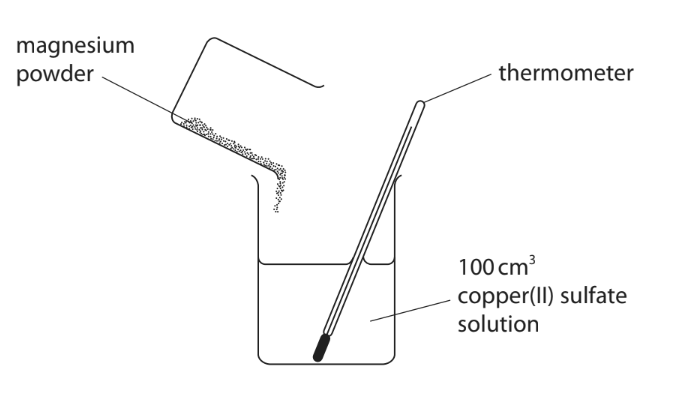

i) State why a reaction occurs when magnesium is added to copper(II) sulfate solution.

(1)

ii) Complete the word equation for this reaction.

(1)

magnesium + copper(II) sulfate $\rightarrow$ .............................................................. + ..............................................................

### 6((b)) — 4 marks — command: multiple — structured — from paper 2020 · Ja1CR
The temperature at the start of the reaction is 20.2 °C. The maximum temperature recorded is 56.3 °C.

i) Calculate the heat energy change, in joules, for the reaction.

[mass of 1.00 cm3 of solution = 1.00 g] [c for the solution = 4.2 J/g/ °C]

(2)

heat energy change = .............................................................. J

ii) Explain why it is better to use a polystyrene cup rather than a glass beaker in this experiment.

(2)

### 6((c)) — 6 marks — command: multiple — structured — from paper 2020 · Ja1CR
The reaction between zinc and copper(II) sulfate solution is also exothermic.

i) A mass of 0.500 g of zinc is reacted with an excess of copper(II) sulfate solution. The heat energy change is 1.67 kJ. Calculate the molar enthalpy change, ΔH, in kJ/mol. Include a sign in your answer. Give your answer to three significant figures.

(3)

ΔH = .............................................................. kJ/mol

ii) The ionic equation for the reaction between zinc and copper(II) sulfate is

Zn (s) + Cu2+ (aq) $\rightarrow$ Zn2+ (aq) + Cu (s)

Explain why this is a redox reaction.

(3)

## Q22 — hard — 13 marks · exam-questions

### 10((a)) — 3 marks — command: multiple — structured — from paper 2020 · Nov1CR
A student uses this apparatus to investigate the reaction between potassium hydroxide solution and dilute hydrochloric acid.

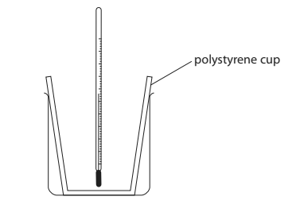

This is her method.

- pour 25 cm3 of potassium hydroxide solution into a polystyrene cup and record the temperature of the solution
- pour 25 cm3 of dilute hydrochloric acid into a measuring cylinder and record the temperature of the acid
- add the acid to the polystyrene cup and stir the mixture
- record the highest temperature reached

i) Give a word equation for the reaction between potassium hydroxide and hydrochloric acid.

(1)

ii) Explain why the student needs to stir the mixture.

(2)

### 10((b)) — 2 marks — command: calculate — structured — from paper 2020 · Nov1CR
The table gives the temperatures of the solutions before the student mixes them.

| potassium hydroxide solution | 17.8 °C |
|---|---|
| dilute hydrochloric acid | 18.4 °C |

Calculate the mean (average) temperature of the two solutions.

mean temperature = .............................................................. °C

### 10((c)) — 8 marks — command: multiple — structured — from paper 2020 · Nov1CR
The student repeats the experiment on a different day, using 25 cm3 of potassium hydroxide solution and 25 cm3 of dilute hydrochloric acid. The thermometer shows the highest temperature reached at the end of the experiment.

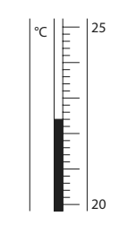

i) Complete the table by giving the missing information. Give both temperatures to the nearest 0.1°C.

(2)

| Mean temperature at start in °C |   |
|---|---|
| Temperature at end in °C |   |
| Temperature rise in °C | 5.2 |

ii) Show that the heat energy change, Q, in the student’s experiment is about 1100J.

[for the mixture, c = 4.2 J/g/°C]

[mass of 1.0 cm3 of mixture = 1.0 g]

(3)

iii) The student uses 0.020 mol of potassium hydroxide in his experiment. Calculate the enthalpy change (Δ*H*) in kJ/mol, for 1.0 mol of potassium hydroxide. Include a sign in your answer.

(3)

## Q23 — hard — 16 marks · exam-questions

### 11((a)) — 6 marks — command: discuss — structured — from paper 2022 · Jan1CR
A student investigates the temperature change during the reaction between zinc metal and copper(II) sulfate solution.

The student considers two different methods.

**Method 1**

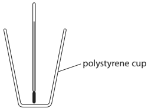

- Pour 50 cm3 of copper(II) sulfate solution into the polystyrene cup
- Record the temperature of the solution
- Add 3 g of zinc powder
- Stir using the thermometer and record the highest temperature reached

**Method 2**

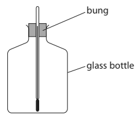

- Record the temperature of 50 cm3 of copper(II) sulfate solution
- Pour the 50 cm3 of copper(II) sulfate solution into the glass bottle
- Add 3 g of zinc powder
- Push the bung and thermometer into the bottle and record the highest temperature reached

Discuss the advantages and disadvantages of each method.

### 11((b)) — 2 marks — command: show — structured — from paper 2022 · Jan1CR
The equation for the reaction is

Zn (s) + CuSO4 (aq) → ZnSO4 (aq) + Cu (s)

50cm3 of copper(II) sulfate solution contains 0.025 mol CuSO4

A mass of 3 g of zinc is used.

Show that the zinc is in excess.

[*A*r of zinc = 65]

### 11((c)) — 6 marks — command: multiple — structured — from paper 2022 · Jan1CR
The student reacts a solution containing 0.025 mol CuSO4 with an excess of zinc.

These are the student’s results.

- Temperature of 50 cm3 of copper(II) sulfate solution = 21.1 °C
- Highest temperature reached = 40.6 °C

i) Show that the energy change Q for this reaction is about 4000 J

[mass of 1 cm3 of solution = 1.0 g]

[for the solution, c = 4.2 J / g / °C]

(3)

ii) Calculate the molar enthalpy change (Δ*H*), in kJ / mol, for the reaction.

(3)

Δ*H* = .............................. kJ / mol

### 11((d)) — 2 marks — command: explain — structured — from paper 2022 · Jan1CR
The ionic equation for the reaction is

Zn (s) + Cu2+ (aq) → Zn2+ (aq) + Cu (s)

Explain what is oxidised and what is reduced in this reaction.

## Q24 — hard — 1 marks · exam-questions

### 1() — 1 mark — multiple_choice
#### Separate: Chemistry Only

How much energy is needed to break all the bonds in 0.025 g of nitrogen gas?

The relative atomic mass, *Ar*, of N is 14.

| **Bond** | ** Bond energy in kJ/mol** |
|---|---|
| N$\equiv$N | 945 |
- **A.** 1701 J
- **B.** 1701 kJ
- **C.** 844 J
- **D.** 844 kJ
