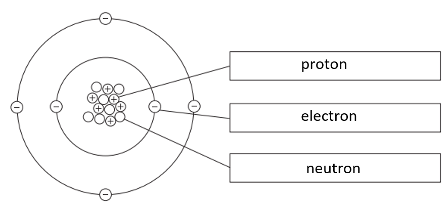

# Mark Schemes — Atomic structure
**1. Principles of Chemistry: Part 1** · Edexcel IGCSE Chemistry (Modular) (4XCH1) — 24/Unit 1

## Q1 — easy — 5 marks · exam-questions

### 1((a)) — 1 marks
The central part of the atom is:

- The nucleus;** [1 mark] **

**[Total: 1 mark] **

- *Labelling an atom is a very common question so make sure you know the structure and can state the relative masses and charges of each subatomic particle*

### 1((b)) — 1 marks
The positively charged particles in an atom are:

- Protons; **[1 mark]**

**[Total: 1 mark] **

- *You can remember **p**rotons are **p**ositive as both words begin with **p*

### 1((c)) — 1 marks
The diagram shows the atom is neutral because:

- Equal numbers of protons and electrons; **[1 mark]**  
*Accept equal numbers of positive and negative particles / charges*

**[Total: 1 mark] **

- *Protons have a positive charge and electrons have a negative charge, therefore if there are equal numbers of both, then the overall charge is neutral - they cancel one another out*

### 1((d)) — 1 marks
The mass number is:

- 5; **[1 mark] **

**[Total: 1 mark] **

- *The mass number is*

  - *number of protons + number of neutrons (3 + 2 = 5)*
- *Each subatomic particle has a relative mass of 1*

### 1((e)) — 1 marks
The element is:

- Lithium; **[1 mark]**

**[Total: 1 mark] **

- *The elements in the Periodic Table are in order of atomic number*
- *The number of protons is the same as the atomic number*
- *Lithium has an atomic number of 3 *
- *Always use the number of protons to identify an element as the mass number may vary due to different isotopes*

  - *Isotopes have a different number of neutrons but the same number of protons*

## Q2 — easy — 1 marks · exam-questions

### 1() — 1 marks
**Correct answer: B** — electron

**Final answer:** **The correct answer is B**

- The  particle is furthest from the centre of each atom is Electron.
- Electrons are found in shells orbiting the nucleus so they are furthest from the centre of the atom

## Q3 — easy — 6 marks · exam-questions

### 1((a)) — 1 marks
**Correct answer: C** — a neutron

**Final answer:** **The correct answer is C**

- Particle Z is a neutron.
- The only correct answer is C because the nucleus contains protons and neutrons. Protons are identified as the white dots

  - A is not correct because electrons occur in the shells
  - B is not correct because a molecule is not a particle found in the nucleus
  - D is not correct because the nucleus contains protons and neutrons.

### 1((b)) — 1 marks
**Correct answer: A** — an electron

**Final answer:** **The correct answer is A**

- The smallest mass is that of an electron.
- The only correct answer is A because electrons have a relative mass of 1/1836 compared to a proton or a neutron

  - B is not correct because a neutron has a relative mass of 1
  - C is not correct because the nucleus contains 4 protons and 5 neutrons
  - D is not correct because a proton has a relative mass of 1

### 1((c)) — 1 marks
**Correct answer: C** — 9

**The correct answer is C**

- The mass number of this atom is 9.
- The only correct answer is C because the mass number is the sum of the protons and neutrons

  - A is not correct because the atomic number is 4
  - B is not correct because 5 is the number of neutrons
  - D is not correct because 13 is the total number of protons, neutrons and electrons

### 1((d)) — 1 marks
**Correct answer: A** — 4

**Final answer:** **The correct answer is A**

- The atomic number is 4.
- The only correct answer is A because the atomic number is equal to the number of protons which is 4

  - B is not correct because 5 is the number of neutrons
  - C is not correct because 9 is the total number of particles in the nucleus
  - D is not correct because 13 is the total number of protons, neutrons and electrons

### 1((e)) — 2 marks
i) The element is:

- Beryllium / Be; **[1 mark]**

ii) When the outer electrons are lost it forms a:

- Ion; **[1 mark]**

* Allow ecf from the element given in (e)(i)*
*Ignore reference to charge and identity of ion in (e)(ii)*

**[Total: 2 marks]**

- *The original structure of 2,2 means that the element is in Group 2 and has 2 shells, so is in Period 2, so the Periodic Table can be used to locate the element as well as the mass and atomic numbers*

## Q4 — easy — 1 marks · exam-questions

### 1() — 1 marks
**Correct answer: B** — Atomic number =  5           Mass number = 11

**Final answer:** **The correct answer is B**

- The atomic number and mass number for the unknown element is: Atomic number=  5    Mass number= 11
- The atomic number is the number of protons.

  - These are the positively charged particles and there are five of these in the atom
- The mass number is the number of protons and neutrons which are both located in the nucleus

## Q5 — easy — 6 marks · exam-questions

### 1((a)) — 3 marks
The correct particle names in the boxes are:

- Each correct name;** [1 mark]**

**[Total: 3 marks]**

### 1((b)) — 1 marks
The mass number of this atom is:

- 13; **[1 mark]**

**[Total: 1 mark]**

- *You need to count all the particles in the nucleus*
- *There are 6 protons and 7 neutrons giving a mass number of 13*

### 1((c)) — 2 marks
The sentence about isotopes is:

- Isotopes are atoms that have the same number of <u>*protons*</u> **[1 mark]** but have a different number of <u>*neutrons*</u> **[1 mark]**

**[Total: 2 marks]**

- *You need to learn the definition of isotopes as it comes up frequently*
- *Although they have the same number of electrons it is not part of the definition and mentioning electrons will be ignored in an exam answer*

## Q6 — easy — 1 marks · exam-questions

### 1() — 1 marks
**Correct answer: B** — 

**Final answer:** **The correct answer is B**

- The box that contains only atoms is B.
- Atoms are single particles, but molecules are two or more atoms joined together
- Box B shows white and black atoms, not joined together
- A shows an atom in black and two molecules in black and an atom in white
- C shows one atom in white and a molecule in white and two atoms in black
- D shows three molecules in white

## Q7 — medium — 1 marks · exam-questions

### 1() — 1 marks
**Correct answer: C** — neutron

**Final answer:** **The correct answer is C**

- The particle is missing from one of the diagrams is  Neutron.
- Atoms of a particular element must have the same number of protons and electrons
- The number of neutrons can change
- Hydrogen has an atomic number of 1, so it has 1 proton and 1 electron
- The atom on the left has no neutrons
- Atoms with different numbers of neutrons are called isotopes

## Q8 — medium — 1 marks · exam-questions

### 1() — 1 marks
**Correct answer: B** — 10.8

**Final answer:** **The correct answer is B**

- The relative atomic mass of this sample of boron is 10.8
- *A**r** *= `fraction numerator left parenthesis percent sign space of space isotope space 1 space cross times space mass space of space isotope space 1 right parenthesis plus left parenthesis percent sign space of space isotope space 2 space cross times mass space of space isotope space 2 right parenthesis over denominator 100 end fraction`
- *A**r** *of boron = $\frac{(19\times10)+(81\times11)}{100}=10.8$

## Q9 — medium — 5 marks · exam-questions

### 1((a)) — 3 marks
i) The name of the particle labelled Y is:

- D / proton; **[1 mark]**

ii) The mass number of this atom is:

- 7; **[1 mark]**

iii) The name of this element is:

- Lithium; **[1 mark]**

**[Total: 3 marks]**

- *In part (i):*

  - *D is the correct answer because protons occur in the nucleus and have a positive charge*
  - *A is not the correct answer since electrons occur in the energy levels*
  - *B is not the answer since ions do not occur in the nucleus*
  - *C is not the correct answer since neutrons have no charge*
- *Mass number = number of protons + number of neutrons (i.e. the total number of nucleons) = 7*
- *The number of protons determines which element the atom is*

  - *This element has 3 protons so will have an atomic (proton) number of 3, which means that the atom is one of lithium*
  - *You would gain a mark if you had given the formal of lithium, Li*

### 1((b)) — 2 marks
One way, in terms of sub-atomic particles, that these isotopes are the same and one way that they are different are:

- Same number of protons; **[1 mark]**
- Different number of neutrons; **[1 mark]**

**[Total: 2 marks]**

- *This is a common question so make sure you learn this*
- *In an atom, the number of electrons is equal to the number of protons so if you said they had the same number of electrons, this would be an acceptable answer, however, this is not the case for ions*
- *When explaining the similarities and differences of isotopes, refer to the different sub-atomic particles as opposed to the mass number or atomic number*

  - *This question specifically asks you for an explanation in terms of sub-atomic particles so no credit is given for references to mass / atomic number*
- *Watch out for the common trap!*

  - *Protons = the element's identity*
  - *All isotopes of an element have the same protons*
  - *If protons are different, they're different elements, not isotopes*
- *Neutrons = what makes isotopes different*
- *A common wrong answer is "same electrons, different protons", this scores 0/2*
- *In a neutral atom, electrons = protons, so this combination is impossible, and the contradiction cancels out the correct half*
- *Safe full-mark answer: *

  - *Same number of protons; different number of neutrons*

## Q10 — medium — 7 marks · exam-questions

### 2((a)) — 1 marks
**Correct answer: A** — 3

**Final answer:** **The correct answer is A**

- The number of electrons in the outer shell of an atom of thallium is 3.
- B is incorrect as there are not 6 electrons in the outer shell of a thallium atom
- C is incorrect as there are not 13 electrons in the outer shell of a thallium atom
- D is incorrect as 81 is the total number of electrons in a thallium atom not the number in the outer shell

### 2((b)) — 1 marks
**Correct answer: B** — 78

**Final answer:** **The correct answer is B**

- The number of electrons in this thallium ion is 78.
- A is incorrect as there are not 3 electrons in a thallium ion
- C is incorrect as 81 is the number of electrons in a thallium atom, not a thallium ion
- D is incorrect as there are not 84 electrons in a thallium ion

  - This would suggest a 3– thallium ion Tl3–

### 2((c)) — 5 marks
i) The number of protons and the number of neutrons in one atom of the thallium-205 isotope:

- (Number of protons): 81; **[1 mark]**
- (Number of neutrons): 124; **[1 mark]**

ii) Calculate the sum of mass numbers multiplied by percentage abundance:

- (203 x 30.8) + (205 x 69.2) **OR** 20438.4; **[1 mark]**

Divide answer by 100:

- 20438.4 ÷ 100 OR 204.384; **[1 mark]**

Give answer to one decimal place

- 204.4; **[1 mark]**

*(203 x 0.308) + (205 x 0.692) or 204.384 with or without working scores M1 and M2* 
*Correct answer to 1 d.p. with or without working scores 3 marks*

**[Total: 5 marks]**

- *The mass number of thallium-205 is 205*
- *The proton number remains the same for all isotopes and can be found on the Periodic Table*

  - *You are also told that thallium has an atomic number of 81 at the start of this question*
- *The steps are the same for the calculation of any relative atomic mass from isotopic masses and abundances*

  - *Make sure you follow the steps*
  - *Check your answer at the end - it should be somewhere between the highest and lowest mass values*

## Q11 — medium — 11 marks · exam-questions

### 2((a)) — 4 marks
i) Table 1 completed with the missing information is:

| **Subatomic particle** | **Relative mass** | **Relative charge** |
|---|---|---|
| electron | 0.0005 | -1 / minus 1; **[1 mark]** |
| proton | one / 1; **[1 mark]** | +1 |
| neutron | 1 | zero / 0 / no charge; **[1 mark]** |

ii) The name of the part of the atom containing protons and neutrons is the:

- Nucleus; **[1 mark]**

**[Total: 4 marks]**

- *The relative mass and charge of the sub-atomic particles are expected knowledge*
- *Remember: **The nucleus contains protons and neutrons while the electrons orbit the nucleus in shells / orbitals*

### 2((b)) — 4 marks
i) The letter of the species that has six electrons in its outer shell is:

- U; **[1 mark]**

ii) The mass number of Z is:

- 25; **[1 mark]**

iii) The letter of the species that is a positive ion is:

- W; **[1 mark]**

iv) The letters of the two species that are isotopes of the same element are:

- Y **AND **Z; **[1 mark]**

**[Total: 4 marks]**

- *The first element that has 6 outer electrons is in the second period and has the electronic configuration of 2,6*

  - *This means that it has 8 electrons and is, therefore, species U*
- *The mass number is the number of protons + the number of neutrons*

  - *For species Z, this is 12 + 13 = 25*
- *A positive ion will have more positive protons than negative electrons*

  - *The only species with more protons than electrons is species W*
- *Isotopes of the same element will have the same number of protons but a different number of neutrons*

  - *Species W and X have the same number of protons (11) but they are not isotopes as they have the same number of neutrons (12)*
  - *Species Y and Z have the same number of protons (12) and different numbers of neutrons (Y = 12, Z = 13)*

### 2((c)) — 3 marks
The relative atomic mass of this sample of neon is:

- Calculating the sum of (mass x percentage) (20 x 91.2) + (22 x 8.80) **OR **2017.6; **[1 mark]**
- Dividing by 100 $\frac{2017.6}{100}$ **OR **20.176; **[1 mark]**
- Answer to one decimal place 20.2;** [1 mark]**

**[Total: 3 marks]**

- *Treat questions calculating the relative atomic mass of an element from the relative isotopic masses as a mean average calculation*

## Q12 — medium — 4 marks · exam-questions

### 1() — 4 marks
> **[mark-scheme]**
> i) The term isotopes means:
> 
> - Atoms with the same number of protons but a different number of neutrons
> **OR** Atoms with the same atomic number, but different mass numbers **[1 mark]**
> 
> ii) The species that are isotopes are:
> 
> - **V AND X**** [1 mark]**
> 
> iii) The species that is an element from Group 5 of the Periodic Table is:
> 
> - **W**** [1 mark]**
> 
> iv) The species that are ions:
> 
> - **W AND Y**** [1 mark]**

> **[exam-tip]**
> Many students mix up **isotopes **and **ions**. Remember:
> 
> - Isotopes have the same number of protons but different numbers of neutrons
> - Ions have a different number of electrons
> 
> Always use the number of protons to identify an element, not neutrons or electrons.
> 
> When deciding Group or Period, think about the electronic configuration of the neutral atom. So, use the number of protons, not the number of electrons if it’s an ion.
> 
> A quick check:
> 
> - Same number of protons = same element
> - Different number of neutrons = isotopes
> - More or fewer electrons than protons = ions

## Q13 — hard — 8 marks · exam-questions

### 2((a)) — 5 marks
The completed table:

| name of the part of this atom labelled Z | nucleus; **[1 mark]** |
|---|---|
| number of protons in this atom | 12; **[1 mark]** |
| number of the group that contains this element | 2; **[1 mark]** |
| number of the period that contains this element | 3; **[1 mark]** |
| the charge on the ion formed from this atom | 2+ / +2 / Mg2+; **[1 mark]** |

**[Total: 5 marks]**

- *In an atom, the number of protons = the number of electrons*

  - *In this atom, there are 12 electrons shown, therefore there must be 12 protons*
- *The group number corresponds to the number of electrons in the outer shell = 2*
- *The period corresponds to the number of electron shells that are occupied = 3*
- *When this atom forms an ion, it will lose its 2 outer electrons, therefore there will be 2 more protons than electrons, making it have a 2+ charge*

### 2((b)) — 3 marks
The relative atomic mass (*A*r) of this element is:

- **Calculate sum of mass numbers multiplied by percentage abundances**: 
(24 x 79.2) + (25 x 10.0) + (26 x 10.8) 
**OR **
2431.6; **[1 mark]** 
*This mark cannot be awarded if the correct working is given but results in an incorrect answer*
- **Divide answer by 100**: 
2431.6 ÷ 100 
**OR **
24.316; **[1 mark]** 
*This mark can be awarded using an incorrect value from the first marking point (by error carried forward)* *(24 x 0.792) + (25 x 0.100) + (26 x 0.108) OR 24.316 with or without working scores both the first and second marking point*
- **Give answer to one decimal place**: 
24.3; **[1 mark]** 
*This mark can be awarded using an incorrect value from the second marking point (by error carried forward) if the calculated answer is to 2 dp*

**[Total: 3 marks]**

- *The relative atomic mass can be calculated by the following equation:*

  - `A subscript straight r space equals fraction numerator space open parentheses percent sign space o f space i s o t o p e space straight A space straight x space m a s s space o f space i s o t o p e space straight A close parentheses space plus space space open parentheses percent sign space o f space i s o t o p e space straight B space straight x space m a s s space o f space i s o t o p e space straight B close parentheses space plus space stretchy left parenthesis percent sign space o f space i s o t o p e space straight C space straight x space m a s s space o f space i s o t o p e space straight C stretchy right parenthesis over denominator 100 end fraction space`
  - `equation`
- *Make sure your answer looks sensible as it is very easy to make a calculator error when performing these calculations:*

  - *The mass must be somewhere between 24 and 26 as the masses of the three isotopes are 24, 25 and 26*
  
    - *Relative atomic mass calculations are basically the mean average of the isotopic masses*
  - *It will be closer to 24 as the isotope with the mass number of 24 is the most abundant*

## Q14 — hard — 11 marks · exam-questions

### 5((a)) — 2 marks
The completed table to show the relative mass and relative charge of a proton and a neutron is:

|   | **Proton** | **Electron** | **Neutron** |
|---|---|---|---|
| **Relative mass** | **Final answer:** **1** | 1/2000 | **Final answer:** **1** |
| **Relative charge** | **Final answer:** **+1** | –1 | **Final answer:** **0** |

- All four correct;** [2 marks]**
- 2 or 3 correct; **[1 mark]**

**[Total: 2 marks]**

- *Protons and neutrons both have a relative mass of 1*
- *You should know the relative charges of protons from their names:*

  - *P**ositive **P**rotons*
  - *Neutr**al **Neutr**ons*

### 5((b)) — 8 marks
i) The term isotope means:

- Atoms (of the same element) with the same number of protons 
**OR **
Atoms (of the same element) with the same atomic number; **[1 mark]**
- But different numbers of neutrons; **[1 mark]**

ii) The number of protons, neutrons and electrons in one atom of `begin mathsize 14px style Mg presubscript 12 presuperscript 26 end style` is:

- Protons = 12 **AND **Electrons = 12; **[1 mark]**
- Neutrons = 14; **[1 mark]**

iii) Showing that the relative atomic mass of magnesium is 24.32:

`fraction numerator open parentheses 24 cross times 79 close parentheses plus open parentheses 25 cross times 10 close parentheses plus open parentheses 26 cross times 11 close parentheses over denominator 100 end fraction`

- All masses multiplied by the percentage (top line of the calculation); **[1 mark]**
- All added together and divided by 100;** [1 mark**]

iv) The mass, in grams, of one atom of magnesium is:

- $\frac{24.32}{6.022\times10^{23}}$; **[1 mark]**
- 4.039 x 10–23; **[1 mark]**

**[Total: 8 marks]**

- *You need to know the definition of an isotope and how to calculate the number of protons, electrons and neutrons in an atom *

  - *The numbers of protons, neutrons and electrons can be used to demonstrate that certain atoms are isotopes of the same element*
- *Calculating (or proving by calculation) the relative atomic mass of an element is just calculating the mean (average) using the information given to you*
- *In part (iv), you are basically told that 6.022 x 10**23** atoms of magnesium have a mass of 24.32 g*

  - *You can scale this down to determine the mass of one atom by dividing by 6.022 x 10**23** *

### 5((c)) — 1 marks
The maximum amount, in moles, of magnesium oxide that can be produced from 0.50 mol of magnesium and 0.20 mol of oxygen is:

- 0.40; **[1 mark]**

**[Total: 1 mark]**

- *There is a clear 2 : 1 relationship between magnesium and oxygen *
- *This means that 0.50 moles of magnesium would require 0.25 moles of oxygen to react completely*
- *Since, there is only 0.20 moles of oxygen it must be the limiting reagent*
- *One mole of oxygen is used to form 2 moles of magnesium oxide*
- *Therefore, 0.20 moles of oxygen can be used to form 0.40 moles of magnesium oxide*

## Q15 — hard — 7 marks · exam-questions

### 4((a)) — 1 marks
The atomic number is:

- The number of protons (in the nucleus / atom); **[1 mark]**

**[Total: 1 mark]**

- *The atomic number is sometimes called the proton number*

  - *This is often on the key of your Periodic Table*

### 4((b)) — 3 marks
i) The mass number of the atom is:

- D / 29; **[1 mark]**

ii) Element X belongs to:

- Group 4; **[1 mark]**
- (Because) it has 4 outer electrons / 4 electrons in its outer shell 
**OR **
(Because) it has an electronic configuration of 2, 8, 4; **[1 mark]**

**[Total: 3 marks]**

- *Remember: **The mass number of an element is the number of protons + the number of neutrons*

  - *In this case, 14 + 15 = 29*
- *To deduce the group, you have to work out how many outer electrons an element has*

  - *In this case, there are 14 electrons*
  - *The first (innermost) shell can contain a maximum of 2 electrons 14 - 2 = 12*
  - *The second shell can contain a maximum of 8 electrons 12 - 8 = 4*
  - *The third shell can contain a maximum of 8 electrons This element has four remaining electrons, which will go into the third shell*
  - *Therefore, the element is in group 4 as it has four outer electrons*

### 4((c)) — 3 marks
The *A*r of element Y is:

- *A*r = `fraction numerator open parentheses 32 cross times 95.0 close parentheses plus open parentheses 33 cross times 0.75 close parentheses plus open parentheses 34 cross times 4.25 close parentheses over denominator 100 end fraction` 
**OR **
*A*r = `begin mathsize 14px style fraction numerator open parentheses 3040 close parentheses plus open parentheses 24.75 close parentheses plus open parentheses 144.5 close parentheses over denominator 100 end fraction end style`; **[1 mark]**
- *A*r = 32.0925; **[1 mark]**
- *A*r = 32.1 (to 1 d.p.); **[1 mark]**

**[Total: 3 marks]**

- *For this question:*

  - *A final answer of 32.0925 with no working scores 2 marks*
  - *A final answer of 32.1 with no working scores all 3 marks*
  - *If the calculation for the first mark is incorrect, the second and third mark can still be scored by error carried forward*
- *The calculation of **A**r** is basically a mean (average) calculation using the data given to you*

## Q16 — hard — 7 marks · exam-questions

### 2((a)) — 5 marks
The completed table is:

| atomic number | 5 |
|---|---|
| mass number | 11; **[1 mark]** |
| number of neutrons | 6; **[1 mark]** |
| group in the Periodic Table that contains boron | 3; **[1 mark]** |
| period in the Periodic Table that contains boron | 2; **[1 mark]** |
| electronic configuration of an atom of boron | 2,3; **[1 mark]** |

**[Total: 5 marks]**

- *The number of neutrons is calculated by mass number - atomic number = 11 - 5 = 6*
- *The group number is the same as the number of electrons in the outer shell = 3*
- *The period is the same as the number of occupied electron shells = 2*
- *The electronic configuration shows that there are 2 electrons in the first shell and 3 electrons in the second shell*

### 2((b)) — 2 marks
The relative atomic mass of this sample of boron is:

- (18.7 x 10) + (81.3 x 11) 
**OR **
1081.3 / 1081 / 1080; **[1 mark]**
- 10.813 / 10.81 / 10.8 
**OR**
** **Answer from first marking point divided by 100; **[1 mark]**

**[Total: 2 marks]**

- *For this question:*

  - *A correct answer without working scores 2*
  - *An answer of 11 without working scores 0*
  - *An answer of 11 with correct working scores 1*
- *The relative atomic mass can be calculated by the following equation:*

  - `A subscript straight r space equals fraction numerator space open parentheses percent sign space o f space i s o t o p e space straight A space straight x space m a s s space o f space i s o t o p e space straight A close parentheses space plus space space open parentheses percent sign space o f space i s o t o p e space straight B space straight x space m a s s space o f space i s o t o p e space straight B close parentheses over denominator 100 end fraction space`
  - $A_{r}=\frac{(18.7x10)+(81.3x11)}{100}=10.813$
- *Make sure your answer looks sensible as it is very easy to make a calculator error when performing these calculations:*

  - *The mass must be somewhere between 10 and 11 as the masses of the two isotopes are 10 and 11*
  - *It will be closer to 11 as boron-11 is the most abundant*

## Q17 — hard — 11 marks · exam-questions

### 1() — 3 marks
Students 1 and 2 could combine their ideas to produce one possible correct conclusion with an appropriate justification because:

- Student 1 suggests three possible elements 
**AND **
Student 2 talks about atoms;** [1 mark]**
- If the diagram represents an atom then it can only be neon; **[1 mark]**
- (Because,) it contains 10 electrons 
**AND **
Neon contains / has 10 electrons; **[1 mark]**

**[Total: 3 marks]**

- *This question focuses on a combination of the student's language and an application of the electronic structure of atoms*
- *The key point hiding in this question is whether this diagram represents an atom or an ion (student 2)*

  - *By stating the word **atom**, student 2 narrows the possible options of student 1 to a single answer*
  
    - *An atom with 10 electrons*
    - *Therefore, they could make a correct combined statement that the diagram represents an atom of neon because it contains 10 electrons*
  - *By stating the word **ion**, student 2 narrows the possible options of student 1 to two possible answers*
  
    - *An ion with 10 electrons*
    - *Therefore, they could make a combined statement that the diagram represents an ion of fluorine or sodium because it contains 10 electrons*
  - *Since the question asks for one possible conclusion / identity, you have to focus on the **atom** idea not the **ion** idea*

### 2() — 2 marks
To evaluate student 1's suggestions of fluorine and sodium:

- Fluorine is incorrect 
**AND **
Fluorine only has nine electrons 
**OR** 
fluoride / the fluoride ion has 10 electrons;** [1 mark]**
- Sodium could be correct 
**AND **
The sodium <u>ion</u> contains / has 10 electrons; **[1 mark]**

**[Total: 2 marks]**

- *For this question, the exam command word **evaluate** means to discuss the correctness of the suggestions*
- *Fluorine cannot be correct because fluor**ine** is the atom with 9 electrons whereas fluor**ide** is the ion with 10 electrons*
- *Sodium could be correct because they could be referring to the sodium ion*

### 3() — 3 marks
Student 3 could be corrected by:

- Stating that the <u>proton</u> number is 10; **[1 mark]**
- There is no charge shown in the diagram;** [1 mark]**
- So, 10 electrons mean 10 protons 
**AND**
(Because,) atoms are electronically neutral / have no overall charge; **[1 mark]**

**[Total: 3 marks]**

- *The student has made a common mistake by counting the number of electrons and associating it with the mass number*
- *There is an argument that this diagram could have an atomic number of 10*

  - *There is no charge showing*

### 4() — 3 marks
The additions that should be made to the diagram to show that it is  `begin mathsize 14px style Mg presubscript 12 presuperscript 25 superscript 2 plus end superscript end style` are:

- 12 protons (in the nucleus); **[1 mark]**
- 13 neutrons (in the nucleus); **[1 mark]**
- A 2+ charge (added to the diagram); **[1 mark]**

**[Total: 3 marks]**

- *The first part of this question is asking you to calculate the number of protons, neutrons and electrons in the isotope of magnesium-25*
- *Then you have to apply the 2+ charge to compensate for only having 10 electrons in the diagram*

## Q18 — hard — 10 marks · exam-questions

### 1() — 2 marks
The completed table is:

|   | **Final answer:** **proton** | **Final answer:** **neutron** | **Final answer:** **electron** |
|---|---|---|---|
| **Final answer:** **Relative mass** | 1 | 1 | 0.0005 |
| Relative charge | +1 | 0 | -1 |

**[2 marks]**

> **[mark-scheme]**
> 1 mark for proton **AND **neutron** AND **electron
> 
> 1 mark for relative mass

### 2() — 5 marks
> **[mark-scheme]**
> (i) The atomic number of element K is:
> 
> - A / 5** ****[1 mark]**
> 
> (ii)** **The mass number of element N is:
> 
> - D / 23** [1 mark]**
> 
> (iii) The element in Group 2 is:
> 
> - Element M **[1 mark]**
> 
> (iv) The element(s) which are ions are:
> 
> - M, N, and O** [2 marks]**
> 
> One mark for two correct ions

> **[exam-tip]**
> Atomic number is the number of protons.
> 
> Mass number is the number of protons and neutrons added together.
> 
> To be in Group 2, an element must have two outer shell electrons.
> 
> Element M has four electrons (as a neutral atom, to balance the four protons). Two will be in the first shell, and two in the outer shell.
> 
> To be an ion, an element must have a different number of electrons compared to protons. M, N, and O all have more or fewer electrons than protons.

### 3() — 3 marks
To calculate the percentage abundance of element K:

- Use the formula for calculating the relative atomic mass:

`A r space equals space fraction numerator open parentheses Mass space isotope space straight A cross times percent sign space abundance space straight A close parentheses plus open parentheses Mass space isotope space straight B cross times percent sign space abundance space straight B close parentheses over denominator 100 end fraction`

- Substitute the known values:

`10.8 space equals fraction numerator open parentheses 11 cross times straight K percent sign close parentheses plus open parentheses 10 cross times straight L percent sign close parentheses over denominator 100 end fraction`** [1 mark]**

- Let the % abundance of element K = $x$

1080 = (11*x*) + (10 x (100 *- x*) **[1 mark]**

1080 = 11*x* - 1000-10*x*

*x *= **80%** **[1 mark]**

> **[mark-scheme]**
> 1 mark for substitution into the relative atomic mass formula
> 
> 1 mark for simplification of the substituted relative atomic mass formula
> 
> 1 mark for the final answer
> 
> A correct final answer scores all three marks, even without workings.

> **[exam-tip]**
> It is strongly advised that you show your workings! If you make a mistake, you may still pick up marks, even if you get the final answer wrong.
> 
> This question is a variation on calculating relative atomic mass, given the percentage abundances. Instead of starting with the percentage abundances, you are given the relative atomic mass and have to work the problem backwards to get the percentage abundances.
> 
> The trick here is to realise you need to substitute one of the percentage abundances using the other. They must both add up to 100, so if the percentage of one isotope is *x, *then the other is 100-*x*.
> 
> If your final answer was 20% then you would score 2 marks as you have got the two isotopes mixed up.
