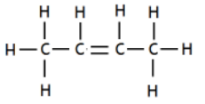
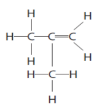
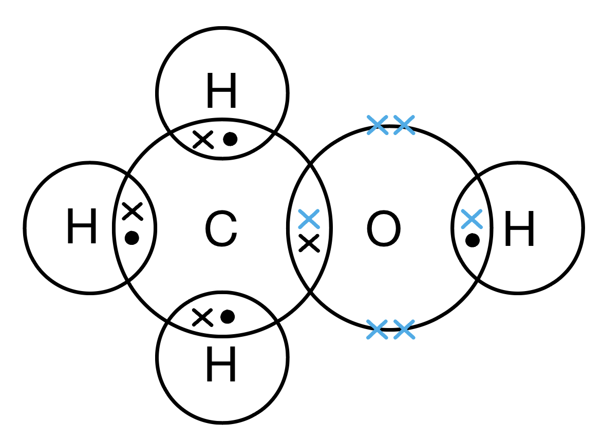
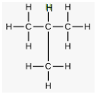
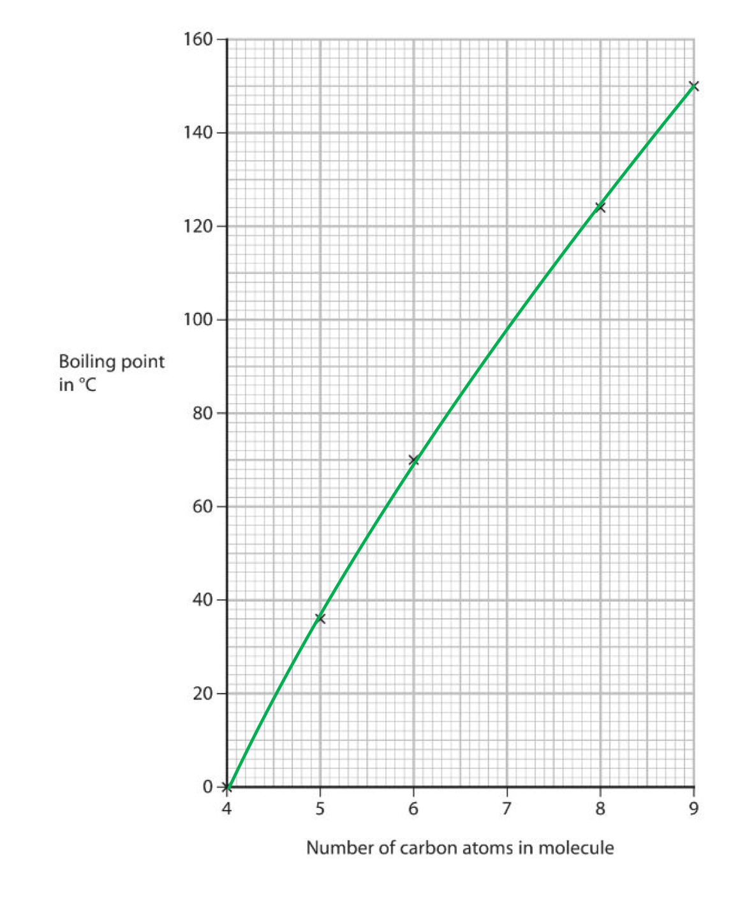
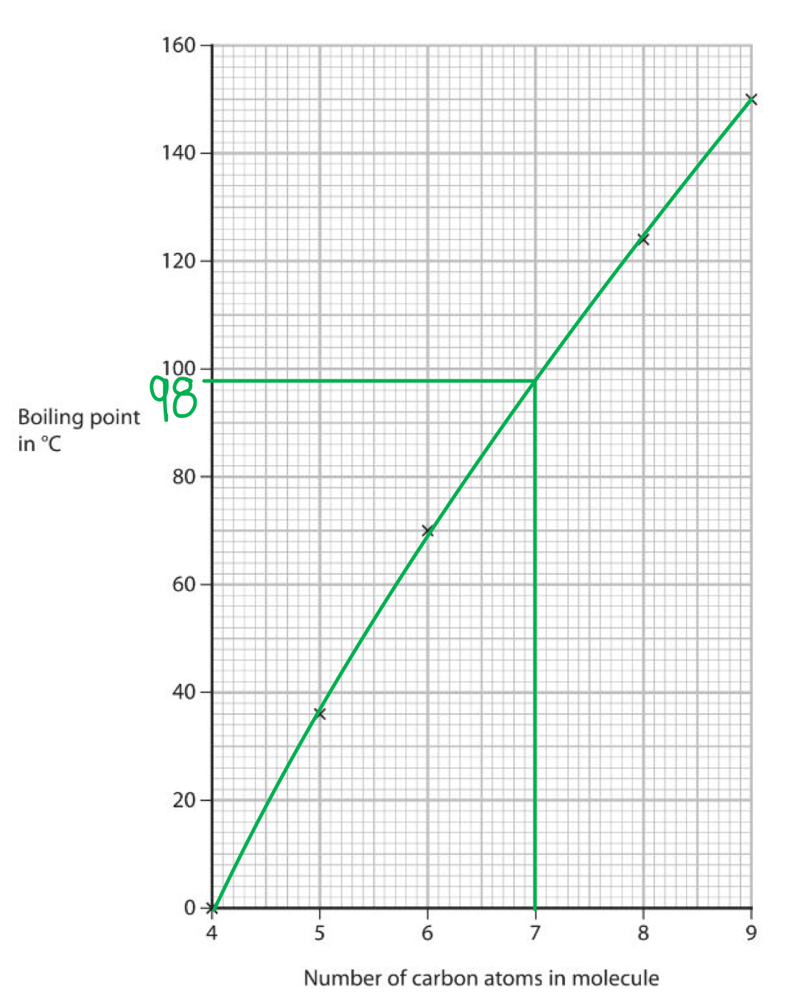
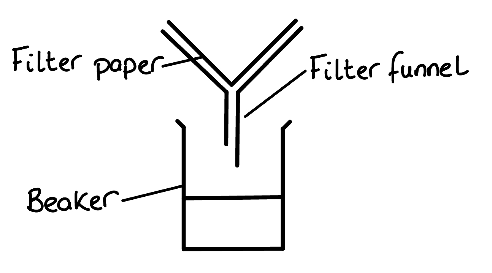
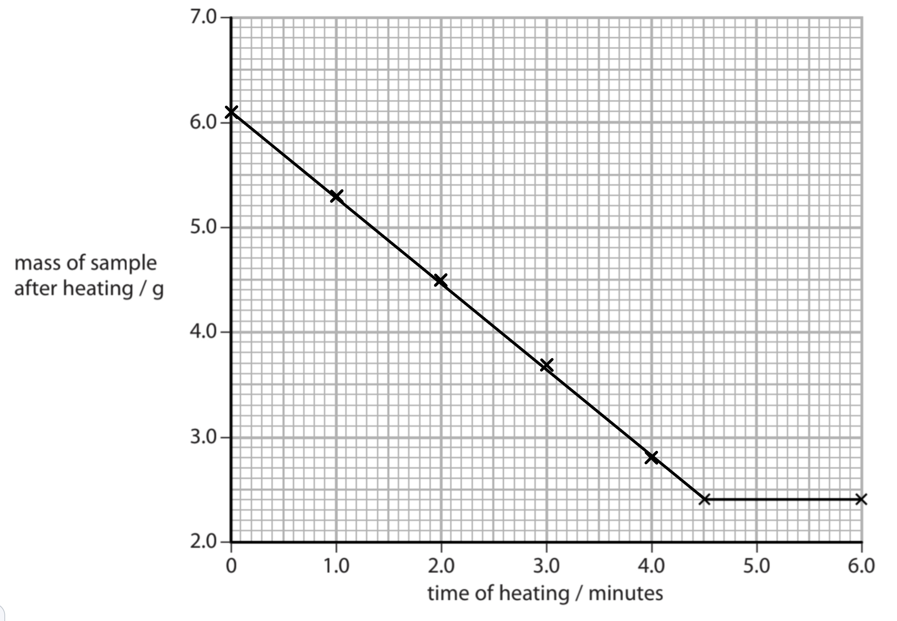
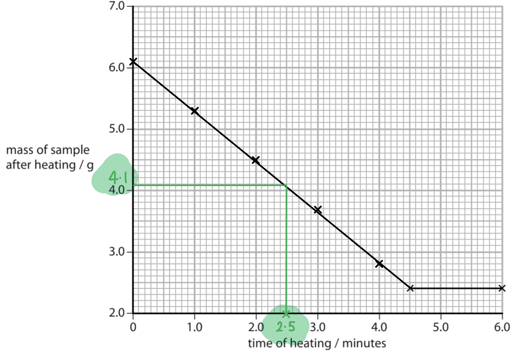

# Mark Schemes — Chemical formulae, equations, calculations
**1. Principles of Chemistry: Part 1** · Edexcel IGCSE Chemistry (Modular) (4XCH1) — 24/Unit 1

## Q1 — easy — 1 marks · exam-questions

### 1() — 1 marks
**Correct answer: B** — 4,3,2

**Final answer:** **The correct answer is B**

- The numbers which will  balance the equation are  4,3,2
- The balanced equation is

4Fe (s) + 3O2 (g) → 2Fe2O3 (g)

## Q2 — easy — 1 marks · exam-questions

### 1() — 1 marks
**Correct answer: B** — 151

**Final answer:** **The correct answer is B**

- The relative formula mass (*M**r*) of tin oxide, SnO2 is 151.
- The relative formula mass calculation is:

  - *M**r *= Sn + (O x 2)
  - *M*r = 119 + (16 x 2) = 151

## Q3 — easy — 1 marks · exam-questions

### 1() — 1 marks
**Correct answer: D** — 120

**Final answer:** **The correct answer is D**

- The relative formula mass of hydrated magnesium carbonate, MgCO3.2H2O is 120.
- Relative formula mass of MgCO3.2H2O = 24 + 12+ (16 x 3) + 2((1 x 2) +16) = 120

## Q4 — easy — 6 marks · exam-questions

### 1() — 1 marks
The number of atoms in a Fe2O3 compound is:

- Five / 5; **[1 mark]**

**[Total: 1 mark]**

- *The compound Fe**2**O**3** contains:*

  - *2 atoms of iron*
  - *3 atoms of oxygen*
- *Remember:** The little (subscript) number after an element belongs to that element*

  - *Therefore, the little 2 belongs to Fe / iron and the little 3 belongs to O / oxygen*

### 2() — 1 marks
The relative formula mass of Fe(OH)2 is:

- 90; **[1 mark]**

**[Total: 1 mark]**

- *The relative atomic masses and number of atoms of each element are used to calculate the relative formula mass:*

  - *Fe(OH)**2** = 56 + 2(16) + 2(1) = 90*

### 3() — 1 marks
The percentage by mass of iron in iron(II) hydroxide, Fe(OH)2 is:

- 62(%); **[1 mark]**

**[Total: 1 mark]**

- *There is one iron atom in Fe(OH)**2** *
- *The percentage by mass of an element is found using the formula:*

  - *% of an element = *$\frac{\mathrm{mass} \mathrm{of} \mathrm{the} \mathrm{element}}{\mathrm{relative} \mathrm{formula} \mathrm{mass} \mathrm{of} \mathrm{the} \mathrm{compound}}x100$
  - *This gives, *`56 over 90 cross times 100 space equals space 62 percent sign`

### 4() — 3 marks
The correct sentences are:

- There is/are <u>one</u> atom(s) of iron on both sides of the equation; **[1 mark]**
- There is/are <u>two</u> atom(s) of oxygen on both sides of the equation; **[1 mark]**
- The total number of atoms <u>stays the same</u>; **[1 mark]**

**[Total: 3 marks]**

- *Remember: **The Law of Conservation of Mass states that no matter is lost or gained during a chemical reaction*
- *This means that there must be the same total number of reactant atoms (on the left) as the total number of product atoms (on the right)*

## Q5 — easy — 11 marks · exam-questions

### 1() — 4 marks
i) The formula for lithium oxide is:

- Li2O; **[1 mark]**

ii) The balanced symbol equation for the reaction of lithium and oxygen to form lithium oxide is:

4Li (s) + O2 (g) → 2Li2O (s) **   **
**OR**    
2Li (s) + ½O2 (g) → Li2O (s)

- Correct formulae for reactants and product; **[1 mark]**
- Correct state symbols; **[1 mark]**
- Correct balancing; **[1 mark]**

**[Total: 4 marks] **

- *To work out the formula of lithium oxide you first need to know the charges of the lithium ion and the oxide ion*

  - *Lithium is a Group 1 metal, so its charge will be 1+*
  - *Oxygen is a Group 6 non-metal, so the oxide ion will have a charge of 2–*
  - *Therefore two lithium ions are required to cancel out the 2- charge on the oxide ion*
- *To balance the equation*

  - *First, remember that oxygen has a formula of O**2*
  - *Write the formulae into an unbalanced equation*
  
    - *Li + O**2**  → Li**2**O *
  - *Write in the state symbols (as asked for in the question)*
  
    - *Li (s) + O**2** (g) → Li**2**O (s)*
  - *There are 2 oxygen atoms on the left-hand side, so we need 2 on the right-hand side  *
  
    - *Li (s) + O**2** (g) → **2**Li**2**O (s)*
  - *There are now 4 lithium atoms on the right-hand side and only 1 on the left-hand side*
  
    - *4**Li (s) + O**2** (g) → 2Li**2**O (s)*

### 2() — 2 marks
The number of moles in 3 g on lithium is:

- Number of moles = $\frac{\mathrm{mass}}{A_{r}}$; **[1 mark]**
- Number of moles = $\frac{3}{7}$= 0.43 (moles); **[1 mark]**

**[Total: 2 marks] **

- *The answer on your calculator may show 0.428571*

  - *The mark scheme shows an answer of 0.43 because two decimal places is a common way to round*
  - *Any answer based on 0.428571 correctly rounded will gain the mark*
  - *If the calculator value is used in further calculations, then you might see more variation in answers *
- *In order to calculate the number of moles you need to use the equation*

  - *Number of moles =  *$\frac{\mathrm{mass}}{A_{r}}$
  - *Remember:** The mass from the question is on the top of the equation*

### 3() — 2 marks
i) To calculate the number of moles of oxygen:

- Moles of oxygen = 0.43 ÷ 4 = 0.11 moles; **[1 mark]**

ii) To calculate the volume of oxygen in cm3:

- Volume of oxygen = 0.11 x 24 000 = 2640 cm3; **[1 mark]**

**[Total: 2 marks]**

- *If you have 0.428571 as your answer in part (b) and have continued using this value, you will get:*

  - *Moles of oxygen = 0.428571 ÷ 4 = 0.10714285 moles (calculator value)*
  
    - *This would round to 0.11 to 2 decimal places *
  - *Volume of oxygen = 0.10714285 x 24 000 = 2571.428571 cm**3** (calculator value)*
  
    - *This would round to 2571 cm**3** to the nearest whole number*
  - *Other answers based on your value from part (b) would be checked by an examiner and marks awarded appropriately*
- *You can use the chemical equation to calculate the number of moles of oxygen*

  - *There are four times the number of moles of lithium to oxygen, so the number of moles of lithium must be divided by four*
- *To work out the volume of oxygen you can use*

  - *Volume (cm**3**) = moles x 24 000*

### 4() — 3 marks
To show the empirical formula is MgO:

- Moles of Mg = $\frac{0.29}{24}$ = 0.01; **[1 mark]**
- Moles of O = $\frac{0.19}{16}$ = 0.01; **[1 mark]**
- Ratio = 1:1; **[1 mark]**

**[Total: 3 marks]**

- *To work out an empirical formula you can use the following table to help:*

| > *1* | > *Write down the elements* | > *Mg* | > *O* |
|---|---|---|---|
| > *2* | > *Divide the mass by the **A**r* | > $\frac{0.29}{0.01}$*= 0.01* | > $\frac{0.19}{16}$*= 0.01* |
| > *3* | > *Divide each answer by the smallest** | > $\frac{0.01}{0.01}$*= 1* | > $\frac{0.01}{0.01}$*= 1* |

- **The value for the second step is the same, so therefore the ratio of each element is 1:1, so the formula must be MgO*

## Q6 — medium — 1 marks · exam-questions

### 1() — 1 marks
**Correct answer: B** — 13.8 g

**Final answer:** **The correct answer is B**

- The mass of zinc carbonate the student should add to the hydrochloric acid to make 15.0 g of zinc chloride is 13.8g.
- **Step 1: **Calculate the relative formula masses of the zinc chloride and zinc carbonate:

*M**r *of ZnCl2 = 65 + (2 x 35.5) = 136

*M**r *of ZnCO3 = 65 + 12 + (3 x 16) = 125

- **Step 2: **Calculate the number of moles of the desired product, zinc chloride:

$\mathrm{moles}=\frac{\mathrm{mass}}{\mathrm{molar} \mathrm{mass}}=\frac{15.0}{136}=0.11\mathrm{mol}$

- **Step 3: **Use the balanced equation to deduce the number of moles of zinc carbonate needed:

ZnCO3 + 2HCl →  ZnCl2 + CO2 + H2O

0.11 mol               0.11 mol

- **Step 4: **Calculate the mass of zinc carbonate needed:

mass of ZnCO3 = moles x molar mass

mass of ZnCO3 = 0.11 x 125 = **13.8 g**

## Q7 — medium — 1 marks · exam-questions

### 1() — 1 marks
**Correct answer: D** — 50 mol

**Final answer:** **The correct answer is D.**

- The number of moles present in 9 kg of glucose, C6H12O6 are 50 mol.
- **Step 1: **To find the number of moles of a substance use the formula

  - $\mathrm{moles}=\frac{\mathrm{mass} \mathrm{in}g}{\mathrm{molar} \mathrm{mass}}$
- **Step 2: **Make sure the units of mass are in g (1 kg = 1 000 g)

  - 9 kg = 9 000 g
  - $\mathrm{moles}=\frac{\mathrm{mass}}{\mathrm{molar} \mathrm{mass}}=\frac{9000}{180}=50\mathrm{mol}$

## Q8 — medium — 14 marks · exam-questions

### 5((a)) — 3 marks
i) The letter of the compound that is **not **a hydrocarbon is:

- S; **[1 mark]**

ii) The letters of the two compounds that have the same empirical formula are:

- T **AND** U; **[1 mark]**

iii) The letter of the compound that is used to manufacture poly(propene) is:

- U; **[1 mark]**

**[Total: 3 marks]**

- *A hydrocarbon contains carbon and hydrogen atoms **only*

  - *Compound S also contains a bromine atom so cannot be classed as a hydrocarbon*
- *The empirical formula is the simplest whole number ratio of the atoms of each element*

  - *T has the molecular formula, C**2**H**4** and the empirical formula CH**2*
  - *U has the molecular formula C**3**H**6** and the empirical formula CH**2*
- *Propene is the monomer which is used to form poly(propene) which is compound U*

  - *Prop- means it has 3 carbon atoms in a straight chain and -ene means it contains a double bond*

### 5((b)) — 3 marks
A test that can be used to distinguish between compounds Q and T is:

- **Test**: (Add) bromine water / Br2 (aq); **[1 mark]**
- **Result with compound Q**: no change / no reaction 
**OR **
Stays yellow / orange / brown; **[1 mark]**
- **Result with compound T**: (bromine water) decolourised / changes (from yellow / orange / brown) to colourless;** [1 mark]**

**[Total: 3 marks]**

- *Examiners are quite specific about the colour change with bromine*

  - *Clear and discoloured do not achieve this mark*
- *The examiners have extra guidance about marking this question*

  - *If no reagent is given but both results are correct, then 1 mark can be awarded*
  - *If an incorrect reagent is given, then 0 marks can be awarded*
- *Compound Q is the alkane, ethane and compound T is the alkene, ethene*
- *Bromine water is used to distinguish between alkanes, it is an orange solution due to the presence of Br**2*
- *Bromine will add across the carbon-carbon double bond within an alkene*

  - *This removes bromine from the solution, which causes it to turn colourless*

### 5((c)) — 2 marks
Two characteristics of a homologous series are:

Any **two** from:

- (Can be represented by a) general formula;** [1 mark]**
- Each member differs from the next by a CH2 group; **[1 mark]**
- Each member has the same functional group; **[1 mark]**
- (Each member has) similar / same chemical properties / similar / same (chemical) reactions / reacts in a similar / same way; **[1 mark]**
- Trend in physical properties (between successive members) 
**OR **
A trend in a named physical property, e.g. boiling point; **[1 mark]**

**[Total: 2 marks]**

- *Similar / same physical properties is not accepted as an answer as this it too general*
- *Make sure you know 2 or 3 characteristics of a homologous series as this is a common question*

### 5((d)) — 2 marks
i) The name of alkene V is:

- But-1-ene / 1-butene; **[1 mark]**

ii) The displayed formula of another alkene that is an isomer of alkene V is:

**OR **

- Either correct displayed formula;** [1 mark]**

**[Total: 2 marks]**

- *Alkene V has 4 carbon atoms in a continuous chain, therefore it has the prefix but-*
- *It is an alkene, so its suffix is -ene*
- *The location of the double bond is between carbon 1 and 2, which is denoted by a 1 before -ene: but-1-ene*
- *Isomers are compounds that have the same molecular formula but different displayed formulae*
- *In this case, the double bond can go between carbon atoms 2 and 3 or the carbon chain can become branched, so that 3 carbon atoms appear in the longest continuous chain*
- *Careful**: Do not draw the double bond between carbon 3 and 4, as this is exactly the same as compound V and not an isomer*
- *In part (ii), cyclic alkanes is not an an accepted answer*

### 5((e)) — 4 marks
i) To show that the empirical formula of the compound is CH2F:

- Divide percentages by relative atomic masses; **[1 mark]** | C | H | F |
|---|---|---|
| `space fraction numerator 36.36 over denominator 12 end fraction space open parentheses equals 3.03 close parentheses` | `space space fraction numerator 6.06 over denominator 1 end fraction open parentheses equals 6.06 close parentheses` | `space fraction numerator 57.58 over denominator 19 end fraction open parentheses equals 3.03 close parentheses` |
- Divide results by smallest value to obtain ratio; **[1 mark]** | C | H | F |
|---|---|---|
| $\frac{3.03}{3.03}$ | $\frac{6.06}{3.03}$ | $\frac{3.03}{3.03}$ |
|   |   |   | **OR** | 1 | 2 | 1 |
|---|---|---|

ii) The molecular formula of the compound is:

- Divide relative molecular mass by empirical formula mass: $\frac{66}{12+2+19}\mathrm{OR}\frac{66}{33}\mathrm{OR}2$;** [1 mark]**
- Correct molecular formula: C2H4F2; **[1 mark]**

**[Total: 4 marks]**

- *A correct answer without working scores a maximum of 2 marks*
- *Empirical formula calculations follow the same steps every time, so once you know these, the calculations are relatively straightforward*
- *Comparing the mass of the empirical formula to the mass of the molecular formula shows that the molecular formula has twice the mass of the empirical formula, therefore the molecular formula must contain 2 x the atoms that are in the empirical formula*

  - *2 x CH**2**F = C**2**H**4**F**2*

## Q9 — medium — 1 marks · exam-questions

### 1() — 1 marks
**Correct answer: C** — 62.5 g

**Final answer:** **The correct answer is C.**

- The mass of 0.25 moles of hydrated copper(II) sulfate, CuSO4.5H2O is 62.5g
- **Step 1: **Calculate the molar mass of CuSO4.5H2O

  - Molar mass of CuSO4.5H2O = 160 + (5 x 18) = 250 g/mol

- **Step 2: **To find the mass use the formula

  - Mass = moles x molar mass
  - Mass of CuSO4.5H2O = 0.25 x 250 = 62.5 g

## Q10 — medium — 10 marks · exam-questions

### 4((a)) — 2 marks
i) The ion that makes the sodium hydroxide solution alkaline is:

- Hydroxide / OH– / HO–; **[1 mark]**

ii) The pH of ammonia solution is:

- **C** / pH 11; **[1 mark]**

**[Total: 2 marks]**

- *The ion that makes acids acidic is the hydrogen ion / H**+** *
- *The ion that makes alkalis alkaline is the hydroxide ion / OH**–** *
- *Remember: **pH 1 - 6 is for acids, pH 8 - 14 is for alkalis and pH 7 is neutral*

  - *Ammonia is a weak alkali and therefore has a pH in the region of 8 - 11*

### 4((b)) — 2 marks
i) In this reaction, the sulfuric acid acts as:

- **C** / a proton donor;** [1 mark]**

ii) The colours of the phenolphthalein indicator before and after adding excess sulfuric acid are:

- **C** / pink → colourless;** [1 mark]**

**[Total: 2 marks]**

- *Acids contain the hydrogen ion / H**+** which makes the proton donors*

  - *Options A and B were not possible as there are no neutron donors / acceptors*
- *You need to know the colour changes from acid to alkali and vice versa for: *

  - *Litmus*
  - *Phenolphthalein*
  - *Methyl orange*

### 4((c)) — 6 marks
i) The chemical formula of ammonium sulfate is (NH4)2SO4 because:

- The ammonium ion is 1+ / NH4+  
**AND **
The sulfate ion is 2– / SO42–;** [1 mark]**
- The charges balance / cancel 
**OR **
Ammonium sulfate has no overall charge; **[1 mark]**

ii) The relative formula mass of ammonium sulfate, (NH4)2SO4 is:

- 132; **[1 mark]**

iii) The mass, in grams, of nitrogen in 1.0 kg of ammonium sulfate is:

Method 1:

- Moles of ammonium sulfate = $\frac{1000}{132}$ 
**OR **
Moles of ammonium sulfate = 7.58; **[1 mark]**
- Mass of nitrogen = $\frac{28\times1000}{132}$ 
**OR **
Mass of nitrogen = 28 x 7.58; **[1 mark]**
- Final answer = 212 (g) 
**AND **
Answer given to a minimum of 2 significant figures;** [1 mark]**

Method 2:

- 132 g of ammonium sulfate contains 28 g of nitrogen 
**OR **
1 g of ammonium sulfate contains $\frac{28}{132}$ g of nitrogen; **[1 mark]**
- 1000 g of ammonium sulfate contains $\frac{28}{132}\times1000$ g of nitrogen;** [1 mark]**
- Final answer = 212 (g) 
**AND **
Answer given to a minimum of 2 significant figures;** [1 mark]**

**[Total: 6 marks]**

- *You can be expected to know the formulae of common ions such as ammonium (NH**4**+**) and sulfate (SO**4**2–**)*

  - *The overall compound has no charge which means that the positive charge of the ammonium ion must cancel the negative charge of the sulfate ion*
  - *This means that you need 2 ammonium ions which give an overall 2+ charge to balance out the 2– charge of the sulfate ion*
- *To calculate the relative formula mass of a compound you add up the masses of all the atoms*

  - *(NH**4**)**2**SO**4** = (N x 2) + (H x 4 x 2) + S + (O x 4) (14 x 2) + (1 x 4 x 2) + 32 + (16 x 4) = 132*
- *In the 132 g of ammonium sulfate, there are 2 nitrogen atoms with a total mass of 28 g*

  - *If you divide both values by 132, you can calculate that 1 g of ammonium sulfate contains 0.2121 g of nitrogen *
  - *Multiplying by 1000 gives you the final answer that 1000 g of ammonium sulfate contains 212 g of nitrogen *
- *For part (iii), the use of 14 instead of 28 gives a final answer of 106 g which scores 2 marks*

## Q11 — medium — 1 marks · exam-questions

### 1() — 1 marks
**Correct answer: C** — 81%

**Final answer:** **The correct answer is C.**

- The percentage yield of zinc nitrate is 81%
- **Step 1: **Nitric acid is the limiting reagent, so calculate the amount of Zn(NO3)2 formed based on that, using the balanced equation:

  - 2 mol HNO3 ⇒  1 mol Zn(NO3)2
  - 0.200 mol HNO3 ⇒  0.100 mol Zn(NO3)2

- **Step 2: ** Convert the moles of Zn(NO3)2 into mass to find the theoretical yield

  - Mass of  Zn(NO3)2 = moles x *M**r*
  - Mass of  Zn(NO3)2 = 0.1 x 189 = 18.9 g

- **Step 3: ** Calculate the percentage yield using the formula

  - $\mathrm{percentage} \mathrm{yield}=\frac{\mathrm{actual} \mathrm{yield}}{\mathrm{theorectical} \mathrm{yield}}\times100$
  - `percentage space yield space equals space fraction numerator 15.3 over denominator 18.9 end fraction space cross times space 100 space equals space 80.9 space percent sign` rounded to 81%

## Q12 — medium — 11 marks · exam-questions

### 5((a)) — 2 marks
i) The number of atoms in one molecule of methanol is:

- Six / 6;** [1 mark] **

ii) Methanol is not a hydrocarbon because:

- (Methanol / it) does not contain only carbon and hydrogen **OR**
 (Methanol / it) contains (an atom of) oxygen; **[1 mark] **

**[Total: 2 marks] **

- *The formula for methanol is CH**3**OH*

  - *There is: 1 carbon atom, 4 hydrogen atoms, 1 oxygen atom*
- *Hydrocarbons contain **only** hydrogen and carbon atoms, so alkanes and alkenes are classed as hydrocarbons, but any other molecule that contains a different type of atom / element can not be*

### 5((b)) — 4 marks
i) A covalent bond is:

- Two / a pair of electrons; **[1 mark] **
- Shared between two atoms; **[1 mark] **

ii) The dot-and-cross diagram to show the bonding in a molecule of methanol is:

- Pairs of electrons around the central carbon atom, with one pair to O and 3 pairs to H; **[1 mark]**
- Rest of molecule fully correct; **[1 mark] **

**[Total: 4 marks] **

- *You may have to use specific symbols for your dot-and-cross diagrams so take time to read the question and check these*

  - *For example*
  - *x's for carbon, • for hydrogens *

### 5((c)) — 5 marks
i) To calculate the empirical formula:

- Divide percentages by relative atomic masses;** [1 mark] **
- Divide results by smallest value to obtain ratio; **[1 mark] **
- Write empirical formula; **[1 mark] **

ii) To calculate the molecular formula:

- Divide relative molecular mass by empirical formula mass; **[1 mark] **
- Write molecular formula; **[1 mark] **

**[Total: 5 marks] **

- *Empirical formula calculations follow the same steps regardless of the compound*
- *To calculate the empirical formula, it can be helpful to use the following table:*

| > *1* | > *Write the elements* | > *C* | > *H* | > *O* |
|---|---|---|---|---|
| > *2* | > *Write the values from the question (can be % or g)* | > *38.7* | > *9.7* | > *51.6* |
| > *3* | > *Write the atomic mass* | > *12* | > *1* | > *16* |
| > *4* | $\frac{\mathrm{Value}}{\mathrm{Atomic} \mathrm{mass}}$ | > *3.225* | > *9.7* | > *3.225* |
| > *5* | > *Ratio (divide the answers by the smallest value)* | > $\frac{3.225}{3.225}$* = 1* | > $\frac{9.7}{3.225}$* = 3* | > $\frac{3.225}{3.225}$* = 1* |
| > *6* | > *Write the empirical formula* | > *C* | > *H**3* | > *O* |

- *Using the empirical formula the next step is to determine the molecular formula*
- *This can be done by:*

| > *M**r** of empirical formula* | > *CH**3**O = 12 + 3 + 16*  > *M**r** **= 31* |
|---|---|
| > *Divide **M**r** of molecular formula by **M**r** **of empirical formula* | > * *$\frac{62}{31}$* = 2* |
| > *Multiply empirical formula by answer* | > *2 x CH**3**O = C**2**H**6**O**2* |

## Q13 — medium — 10 marks · exam-questions

### 8((a)) — 3 marks
i) The observations are:

- White flame / light;** [1 mark] **
- White powder / solid (formed); **[1 mark] **

ii) It has been oxidised because:

- Magnesium gains oxygen;** [1 mark] **

**[Total: 3 marks] **

- *You should be able to describe this reaction, you may have seen this *
- *To gain the mark you could also say*

  - *Magnesium loses electrons*
  - *The oxidation state (of Mg) increases*
  - *The oxidation state changes from 0 to +2*

### 8((b)) — 3 marks
i) The term exothermic means:

- Gives out / releases heat (energy) / thermal energy;** [1 mark] **

ii) The chemical equation for this reaction is:

- 2Mg + CO2 → 2MgO + C; **[1 mark] **

iii) A carbon dioxide extinguisher would not put out the fire because:

- The fire would keep burning 
**OR** 
The carbon dioxide would not put out the fire 
**OR** 
A large amount of heat/thermal energy would be released;** [1 mark] **

**[Total: 3 marks] **

- *The reaction between magnesium and oxygen is very exothermic so carbon dioxide alone is not enough to put out the fire *
- *Using sand would work in this case*

### 8((c)) — 4 marks
Two changes, with explanations, that the student should make to his method to obtain a mass of magnesium oxide closer to the expected mass are:

- (The student should) lift and replace the lid;** [1 mark] **
- (To allow) oxygen/air to enter the crucible (to react with the magnesium);** [1 mark] **
- Reheat and reweigh / heat to constant mass;** [1 mark] **
- To make sure that all the magnesium has reacted; **[1 mark] **

**[Total: 4 marks] **

- *This is a method that you should be able to explain and also complete empirical formula calculation from given data*

## Q14 — medium — 1 marks · exam-questions

### 1() — 1 marks
**Correct answer: B** — CBrF3

**Final answer:** **The correct answer is B.**

- The empirical formula of Halon 1301 is  CBrF3
- **Step 1: **Treat the % as a mass out of 100 and divide the masses by the Ar of each element
- **Step 2: **Divide by the lowest answer to obtain a whole number ratio

C                              Br                       F

$\frac{8.05}{12}=0.67$        $\frac{53.69}{80}=0.67$     $\frac{38.26}{19}=2.01$

$\frac{0.67}{0.67}=1$    $\frac{0.67}{0.67}=1$              $\frac{2.01}{0.67}=3$

- **Step 3: **Write the formula:   **CBrF****3**** **

## Q15 — medium — 1 marks · exam-questions

### 1() — 1 marks
**Correct answer: C** — 2.83 x 106

**Final answer:** **The correct answer is C.**

- The maximum volume, in dm3, of chlorine gas at rtp that can be obtained from 17.6 tonnes of molten potassium chloride is 2.83 x 106
- **Step 1**: Convert the mass of KCl from tonnes to grams

  - 17.6 tonnes = 17.6 x 106 g = 1.76 x 107 g

- **Step 2**: Calculate the amount of KCl in moles

  - $\mathrm{moles}=\frac{\mathrm{mass}}{\mathrm{molar} \mathrm{mass}}$
  - $\mathrm{amount} \mathrm{of} \mathrm{KCl}=\frac{1.76\times10^{7}}{74.5}=2.36\times10^{5}\mathrm{mol}$

- **Step 3**: Use a balanced equation to deduce the moles of chlorine gas produced

  - 2KCl   →   2K + Cl2
  - $2.36\times10^{5}\mathrm{mol} \mathrm{of} \mathrm{KCl}\Rightarrow\frac{2.36\times10^{5}}{2}=1.18\times10^{5}\mathrm{moles} \mathrm{of} \mathrm{Cl}_{2}$

- **Step 4**: Calculate the volume of chlorine in dm3

  - $\mathrm{volume}=\mathrm{moles}x24\mathrm{dm}^{3}/\mathrm{mol}$
  - $\mathrm{volume}=1.18\times10^{5}\times24\mathrm{dm}^{3}=2.83\times10^{6}\mathrm{dm}^{3}$ 

## Q16 — medium — 1 marks · exam-questions

### 1() — 1 marks
**Correct answer: C** — 0.25 mol / dm3

**Final answer:** **The correct answer is C**

- The concentration, in mol / dm3, of a solution produced when 6.9 g of potassium carbonate, K2CO3, dissolves in 200 cm3 of water is 0.25 mol / dm3
- **Step 1: **Convert the mass of K2CO3 into moles:

  - $\mathrm{moles}=\frac{\mathrm{mass}}{Mr}=\frac{6.9}{138}=0.05\mathrm{mol}$

- **Step 2: **Convert the volume into dm3:

  - $\mathrm{volume} \mathrm{in} \mathrm{dm}^{3}=\frac{200}{1000}=0.20\mathrm{dm}^{3}$

- **Step 3: **Calculate the concentration:

  - $\mathrm{concentration}=\frac{\mathrm{moles}}{\mathrm{volume} \mathrm{in} \mathrm{dm}^{3}}=\frac{0.05}{0.20}=0.25\mathrm{mol}/\mathrm{dm}^{3}$

## Q17 — medium — 7 marks · exam-questions

### 8((a)) — 2 marks
A safety precaution that should be taken when doing this experiment:

- You should use a fume cupboard; **[1 mark]**
- As chlorine is toxic / poisonous; **[1 mark]**

**OR**

- You should wear goggles / safety glasses / gloves; **[1 mark]**
- As acid / bleach (may be) corrosive / irritant;** [1 mark]**

**[Total: 2 marks] **

- *You should be specific when you are justifying safety precautions*

  - *Rather than just saying that chlorine is dangerous or harmful (which doesn't say what the harm is) you need to state that it is toxic or poisonous*
- *Similarly, the reason why you should use safety glasses, etc, should be linked to a specified hazard*
- *A laboratory coat, while good practice, protects your clothes, but not you, so it is not given credit as a safety precaution*

### 8((b)) — 5 marks
i)  The amount, in moles, of chlorine gas produced:

- moles=  $\frac{60.0}{24000}$; **[1 mark] **
- 0.0025 (mol);** [1 mark]**

ii)   The amount, in moles, of NaClO in 4.00 cm3 of bleach:

- 0.0025 mol;** [1 mark]**

iii)  The concentration, in mol/dm3, of the bleach solution.

- Concentration = `begin mathsize 14px style fraction numerator 0.0025 over denominator open parentheses begin display style fraction numerator 4.00 over denominator 1000 end fraction end style close parentheses end fraction end style` or $\frac{0.0025}{4.00}$ x 1000; **[1 mark]**
- 0.625 mol/dm3;** [1 mark]**

**[Total: 5 marks]**

- *Remember: **To calculate moles from gas volumes you use the formula:*

  - *moles of a gas = *$\frac{\mathrm{volume} \mathrm{in} \mathrm{cm}^{3}}{\mathrm{molar} \mathrm{gas} \mathrm{volume} \mathrm{in} \mathrm{cm}^{3}\mathrm{per} \mathrm{mol}}$

- *The equation shows the ratio of chlorine gas to NaClO is 1:1, so your answer to ii) is the same as i)*
- *If you make a mistake in part i) but use the same figure in part ii) you will get credit for that*
- *To calculate the concentration you are using the formula:*

  - *concentration = *$\frac{\mathrm{moles}}{\mathrm{volume} \mathrm{in} \mathrm{dm}^{3}}$

## Q18 — medium — 6 marks · exam-questions

### 7((a)) — 2 marks
The amount, in moles, of hydrocarbon X in the sample is:

- Amount in moles = $\frac{\mathrm{volume} \mathrm{of} \mathrm{gas}}{\mathrm{molar} \mathrm{volume}}$; **[1 mark]**
- Correct evaluation; **[1 mark] **

Example calculation

amount in moles = $\frac{600}{24000}$= 0.025 (mol)

**[Total: 2 marks] **

- *You are given volume in cm**3** so you must divide by 24 000*
- *If given the volume in dm**3** you must divide by 24*

### 7((b)) — 2 marks
To show that the relative molecular mass (*M*r) of X is 58:

- *M*r = $\frac{\mathrm{mass}}{\mathrm{moles}}$; **[1 mark] **
- *M*r  = $\frac{1.45}{0.025}$ = 58; **[1 mark] **

**[Total: 2 marks] **

- *You may be used to using moles = *$\frac{mass}{M_{r}}$* or mass = moles x **M**r*
- *The same equation can be used to find the **M**r** **of a compound as well*

### 3() — 1 marks
To show that the molecular formula of X is C4H10:

- Molecular formula = C4H10 = (4 x 12) + (10 x 1) = 58 
**OR** 
Alkane general formula = CnH2n+2 (n x 12) + (2n + 2) x1 = 58 so 14n = 56 n = 4 so C4H10; **[1 mark] **

**[Total: 1 mark] **

- *You are asked to show that the molecular formula is C**4**H**10 **which means you must show your working*

### 4() — 1 marks
The displayed formula of the branched-chain isomer of hydrocarbon X is:

- ; **[1 mark] **

**[Total: 1 mark] **

- *Isomers are compounds that have the same molecular formula but different displayed formulae*

  - *The final carbon atom in the chain has been taken off and placed in the middle of the chain to form the isomer *

## Q19 — medium — 1 marks · exam-questions

### 1() — 1 marks
**Correct answer: C** — C2H3O2

**Final answer:** **The correct answer is C.**

- The **empirical formula** for this compound is C2H3O2
- The actual number of each atom, known as the molecular formula is C4H6O4
- The empirical formula is the simplest ratio of each element in a compound
- Therefore, the empirical formula of this compound is C2H3O2

## Q20 — hard — 17 marks · exam-questions

### 11((a)) — 4 marks
The completed table is:

| **Reactants** | **Name of salt formed** | **Other product(s)** |
|---|---|---|
| zinc + hydrochloric acid | zinc chloride; **[1 mark]** | hydrogen; **[1 mark]** |
| calcium carbonate + nitric acid | calcium nitrate; **[1 mark]** | water + carbon dioxide; **[1 mark]** |

**[Total: 4 marks] **

- *You should know the different reactions of acids with*

  - *Metals, bases and carbonates *
- *As well as this you need to know the names of the salts that will be produced*
- *The first part in the full name of the salt (or first name of a salt) is the metal*
- *The second part (or surname) is the name of the acid *

  - *Hydrochloric acid forms chloride salts*
  - *Nitric acid forms nitrate salts*

### 11((b)) — 4 marks
i) **Two** ways to make sure that all the acid is reacted in step 2 are:

- Use excess aluminium hydroxide; **[1 mark]**
- Stir (thoroughly); **[1 mark]**

ii) The purpose of filtration in step 3 is:

- To remove unreacted aluminium hydroxide / solid; **[1 mark]**

iii) **One** method of drying these crystals.

Any **one** from:

- Leave in a warm place; **[1 mark]**
- Use filter paper or paper towel; **[1 mark]**

**[Total: 4 marks] **

- *This is a method that you should be familiar with*
- *The purpose is to make pure and dry crystals of the soluble salt so any excess reactants and water must be removed*

### 11((c)) — 3 marks
To determine which reagent is in excess:

- Calculation of *M*r of aluminium hydroxide; **[1 mark]**
- Calculation of amount of aluminium hydroxide; **[1 mark]**
- Reference to 2 : 3 ratio in equation 
**AND **
Statement that sulfuric acid is in excess; **[1 mark]**

Example calculation:

- Calculation of *M*r of aluminium hydroxide = 27 + (3 × 17) = 78
- Mols / amount of aluminium hydroxide = $\frac{3.9}{78}$ = 0.05 mol
- This is more than 3/2 times the amount of aluminium hydroxide, so sulfuric acid is in excess

**[Total: 3 marks] **

- *You are given 2 marks to work out the number of moles of aluminium hydroxide, Al(OH)**3*

  - *mols = *$\frac{mass}{M_{r}}$
- *There are 0.09 moles of sulfuric acid used in the reaction and 0.05 moles of aluminium hydroxide used *

  - *2Al(OH)**3 **+ 3H**2**SO**4** → Al**2**(SO**4**)**3** + 6H**2**O*
  *0.05             0.09 *
  - *Given the 2 : 3 ratio of aluminium hydroxide to sulfuric acid there is more acid present *
  - *Assuming all of the sulfuric acid is used up 0.09 x *$\frac{2}{3}$* we require 0.06 mols of aluminium hydroxide *
  
    - *Only 0.05 moles of aluminium hydroxide is present, therefore the acid is in excess*

### 11((d)) — 3 marks
To calculate the mass of aluminium sulfate prepared:

- *M*r of aluminium sulfate Al2(SO4)3 = (27 × 2) + (32 × 3) + (16 × 12) = 342; **[1 mark]**
- Mass = *M*r x moles = 342 x 0.025; **[1 mark]**
- 8.55 g; **[1 mark]**

**[Total: 3 marks] **

- *In order to calculate the mass of a product you must use the limiting reagent mols, this is the aluminium hdyroxide, 0.05 mols*
- *2Al(OH)**3 **+ 3H**2**SO**4** → Al**2**(SO**4**)**3** + 6H**2**O*
- *There is a 2 : 1 ratio therefore 0.05 must be divided by 2*
- *Then mass can be calculated by using mass = mols x **M**r*

### 11((e)) — 3 marks
To calculate the percentage yield:

- Amount of lead nitrate = 209 ÷ 331 = 0.631 mol; **[1 mark]**
- Percentage yield = $\frac{0.631}{0.75}$ x 100; **[1 mark]**
- Percentage yield = 84%; **[1 mark]**

**[Total: 3 marks] **

- *You could also work out the percentage yield by the following method:*

  - *Mass of lead nitrate expected = 0.75 mols x 331 = 248.25 g*
  - *% yield = *$\frac{209}{248.25}$* x 100 = 84%*

## Q21 — hard — 12 marks · exam-questions

### 10((a)) — 3 marks
a)

i) The chemical equation for the reaction in stage 1 is:

- **4**NH3 + **5**O2 $\rightleftharpoons$ **4**NO + **6**H2O; **[1 mark]**

ii) The meaning of the symbol $\rightleftharpoons$ is:

- Reversible reaction 
**OR** 
A reaction that goes both ways / both forwards and backwards reactions occur; **[1 mark]**

iii) The purpose of the platinum catalyst is:

- To increase the rate of the reaction / to speed up the reaction; **[1 mark]**

**[Total: 3 marks]**

- *To balance, balance the hydrogen atoms first. As there are 3 on the LHS and 2 on the RHS, you are best off balancing both sides to give 6 atoms of hydrogen:*

  - *2**NH**3** + O**2* $\rightleftharpoons$ *NO + **3**H**2**O*
- *Now balance the nitrogen atoms to give 2 on either side:*

  - *2**NH**3** + O**2* $\rightleftharpoons$ *2**NO + **3**H**2**O*
- *Now balance the oxygen atoms: there are 5 on the RHS, so to give 5 on the LHS, you need 2½ molecules of O2 on the LHS:*

  - *2**NH**3** +**2½**O**2* $\rightleftharpoons$ *2**NO + **3**H**2**O;*
- *This would be acceptable as it is, or you can multiply all of the balancing numbers by 2 to give whole numbers:*

  - *4**NH**3** + **5**O**2* $\rightleftharpoons$ *4**NO + **6**H**2**O;*

### 10((b)) — 1 marks
b) A chemical equation for the reaction of nitrogen monoxide and oxygen in stage 2 is:

- 2NO + O2 → 2NO2; **[1 mark]**

**[Total: 1 mark]**

- *You need to extract the information from the question to deduce the chemical equation, then balance it*
- *You are told that nitrogen monoxide, NO reacts with more O**2** to produce nitrogen dioxide gas, NO**2*
- *All of the formulae are given to you so the equation is:*

  - *NO + O**2** → NO**2*
- *The oxygen atoms aren't balanced, as there are 3 on the LHS and 2 on the RHS, you can balance the equation by both sides having 4 oxygen atoms and 2 nitrogen atoms*

  - *2NO + O**2** → 2NO**2*

### 10((c)) — 5 marks
c)

i) The maximum mass, in tonnes, of nitric acid that could be produced in this reaction from 11.5 tonnes of nitrogen dioxide is:

- **Calculate *****M*****r**** of NO****2**** and HNO****3**: 
*M*r of NO2 = (14 + (2 x 16)) = 46 
**AND **
*M*r of HNO3 = (1 + 14 + (3 x 16)) = 63; **[1 mark]**
- **Calculate the amount, in moles, of** **NO****2**: 
n(NO2) = (mass ÷ *M*r =) 11.5 x 106 ÷ 46 
**OR **
250 000 (mol); **[1 mark]**
- **Calculate the amount, in moles, of HNO****3**: 
n(HNO3) = $\frac{2\times250000}{3}$ 
**OR** 
167 000 / 170 000; **[1 mark]**
- **Calculate the mass in tonnes of HNO****3**: 
(moles x *M*r = 167 000 x 63 ) = 10.5 (tonnes); **[1 mark]** 
*Accept 10.7 if 170 000 moles used*

ii) A potential use of the nitrogen monoxide gas formed in stage 3 is:

- (It) can be (re)used in stage 2 / to make more nitrogen dioxide (in stage 2) / can be used to make more nitric acid; **[1 mark]**

**[Total: 5 marks]**

- *The equation relating the amount of substance (in moles), mass and molar mass requires the mass to be in grams so you need to convert tonnes to grams by multiplying by 1.0 x 10**6** as provided in the questions*
- *Your final answer of mass will be calculated in grams, so you need to convert back to tonnes by diving by 1.0 x 10**6*
- *However, if you didn't do this conversion, you were still awarded the marks, i.e. n(NO**2**) = (mass x **M**r** =) 11.5 ÷ 46 **OR **0.25 mol gained the second mark and you would have gained the third mark for an answer of 167 000 (or 170 000)*
- *You will be awarded full marks if you get the answer correct without workings but it is important that you clearly show your workings in case you make a mistake. This way you can have an error carried forward and still pick up marks for the subsequent steps*

### 10((d)) — 3 marks
d) The percentage yield of copper(II) nitrate is:

- **Calculate the amount, in moles, of copper(II) nitrate**: 
n Cu(NO3)2 formed = mass ÷ molar mass = 15.3 ÷ 187.5 
**OR** 
0.0816; **[1 mark]**
- **Calculate the theoretical yield, in moles, of copper(II) nitrate**: 
Theoretical n Cu(NO3)2 = 0.200 ÷ 2 
**OR **
0.100; **[1 mark]**
- **Calculate the percentage yield:**
 `fraction numerator 0.0816 over denominator 0.100 end fraction space cross times space 100 space equals space 81.6 space open parentheses percent sign close parentheses`; **[1 mark]**

**Alternative method**:

- **Calculate the theoretical yield, in moles, of copper(II) nitrate**: 
Theoretical n Cu(NO3)2 = 0.200 ÷ 2 **OR **0.100; **[1 mark]**
- **Calculate the theoretical mass of copper nitrate that should be formed** = 
(moles x *M*r = ) 0.1 x 187.5 = 18.75 / 18.8 (g); **[1 mark]**
- **Calculate the percentage yield**:
 `fraction numerator 15.3 over denominator 18.75 end fraction space cross times space 100 space equals space 81.6 space open parentheses percent sign close parentheses`; **[1 mark]** 
*Accept 82%*

**[Total: 3 marks]**

- *When calculating the percentage yield, the theoretical and actual amounts produced can be given as either masses or in moles*
- *Remember**: Percentage yield cannot be greater than 100%, so if your calculated answer is greater, check your calculation*
- *The most common error is to divide the theoretical amount by the actual amount instead of vice versa*

## Q22 — hard — 12 marks · exam-questions

### 9((a)) — 2 marks
i) This type of reaction is:

- B / decomposition; **[1 mark]**

ii) The reaction makes the cakes increase in size because:

- Carbon dioxide / CO2 / gas is produced; **[1 mark]**

**[Total: 2 marks]**

- *The reaction shows one chemical being broken down into 3 separate chemicals, which is decomposition*

  - *Combustion and oxidation involve reactions with oxygen*
  - *Reduction involves the loss of oxygen*
- *When cakes are baked, they fill with little bubbles of "air" as the cakes rise*

  - *The "air" is actually the carbon dioxide released as the sodium hydrogen carbonate decomposes*

### 9((b)) — 3 marks
i) One reason why the crucible and contents are heated for a further three minutes is:

- To get a constant mass 
**OR **
To ensure the reaction is complete 
**OR **
To ensure that only sodium carbonate / Na2CO3 is left; **[1 mark]**

ii) An advantage and a disadvantage of using a lid on the crucible are:

- Advantage: To stop any solids / Na2CO3 / NaHCO3 being lost; **[1 mark]**
- Disadvantage : The gas(es) / CO2 / H2O / steam would not escape; **[1 mark]**

**[Total: 3 marks]**

- *Any time a solid is heated for a **further** length of time, it is usually to achieve a constant mass*
- *Lids are used in experiments to stop chemicals / energy from escaping from the reaction vessel, this can become an issue when gases are also released as the pressure inside the reaction vessel can build up*

### 9((c)) — 4 marks
i) The mass of sodium hydrogencarbonate that the student uses is:

- 3.25 (g); **[1 mark]**

ii) The maximum mass of sodium carbonate (Na2CO3) that could form in the student’s reaction is:

Method 1:

- Moles of NaHCO3 = $\frac{3.25}{84}$ 
**OR **
Moles of NaHCO3 = 0.0387; **[1 mark]**
- Moles of Na2CO3 = $\frac{0.0387}{2}$ 
**OR **
Moles of Na2CO3 = 0.01935; **[1 mark]**
- Mass of Na2CO3 = 0.01935 x 106 = 2.05 (g); **[1 mark]** 
*2.05 g without working scores all 3 marks 4.1 g without working scores 2 marks*

Method 2:

- 168 g of NaHCO3 → 106 g of Na2CO3; **[1 mark]**
- 3.25 g of NaHCO3 → $\frac{106}{168}\times3.25$ g of Na2CO3; **[1 mark]**
- Mass of Na2CO3 = 2.05 (g); **[1 mark]**

**[Total: 4 marks]**

- *The mass of sodium hydrogen carbonate used is 29.75 - 26.50 = 3.255 g*
- *You use this value to calculate the number of moles of sodium hydrogen carbonate*
- *Using the chemical equation, you can see that 2 moles of sodium hydrogen carbonate make one mole of sodium carbonate*

  - *Therefore, you halve the moles of sodium hydrogen carbonate to get the moles of sodium carbonate*
- *You can then use the moles of sodium carbonate to calculate the mass of sodium carbonate by multiplying by the **M**r*

### 9((d)) — 3 marks
i) The percentage yield from the student’s experiment is:

- $\frac{4.2}{4.8}$ **OR **0.875; **[1 mark]**
- (0.875 x 100 =) 87.5%; **[1 mark]**

ii) One possible reason why the student’s actual yield is less than expected is:

- The sodium hydrogen carbonate was impure 
**OR **
Not all the sodium hydrogen carbonate had reacted / decomposed; **[1 mark]**

**[Total: 3 marks]**

- *Percentage yield = *$\frac{\mathrm{actual} \mathrm{yield}}{\mathrm{theoretical} \mathrm{yield}}\times100$
- *The main reasons for reactions not having a 100% yield are impure reactants and / or the reaction not going to completion*

## Q23 — hard — 14 marks · exam-questions

### 10((a)) — 6 marks
i) A curve of best fit:

- An approporiate curved line of best fit; **[1 mark]**

ii) Using the graph to find boiling point of the alkane with 7 carbon atoms in its molecule:

- Lines shown on graph; **[1 mark]**
- Value correctly read from graph (expected value between 97 and 103 °C to ±1 °C); **[1 mark]**

iii) The trend shown by the graph is:

- The boiling point increases as the number of carbons / the chain length increases; **[1 mark]**
- Because the intermolecular forces (of attraction) get stronger; **[1 mark]**
- And therefore take more energy to overcome / break; **[1 mark]**

**[Total: 6 marks]**

- *Make sure you draw a curved line of best fit, as specified in the question, and not a straight line, or a 'dot-to-dot' line*
- *When drawing a line of best fit:*

  - *Ignore any anomalous points*
  - *Try to get as many points on the line as possible, and, for those that don't fit on the line, an equal number of points above and below the line*
- *When explaining the trend, make sure you don't use the term 'directly proportional' as, although it goes through the origin, it is not a straight line so cannot be described as proportional*
- *Make sure you do not refer to covalent bonds breaking - when a simple covalent compound boils, the covalent bonds are not broken but the molecules move further apart from each other*

### 10((b)) — 2 marks
These compounds are isomers because:

- They have the same **molecular **formula; **[1 mark]**
- But different **displayed **/ **structural **formulae 
**OR** 
Different structures / different arrangement of atoms; **[1 mark]**

**[Total: 2 marks]**

- *The definition of isomers is a key definition to learn*
- *Pay attention to the words in bold - these are important to learn!*

### 10((c)) — 3 marks
i) Showing that the empirical formula of this alkane is C2H5:

- 82.8 ÷ 12 **OR **6.9 
**AND** 
17.2 ÷ 1 **OR **17.2; **[1 mark]**
- Divide by smallest: 1:2.5 which is 2:5; **[1 mark]**

ii) The molecular formula of this alkane is:

- C4H10; **[1 mark]**

**[Total: 3 marks]**

- *To calculate the empirical formula when given percentages, it is easiest to assume that you have 100 g of the sample, then you can work out the number of moles of each element in 100 g by using the **M**r**:*

| > * * | > *C* | > *H* |
|---|---|---|
| > *Calculate the number of moles of each element in 100 g (%/**M**r**)* | $\frac{82.8}{12}\,=6.9$ | $\frac{17.2}{1}\,=17.2$ |
| > *Divide by the smallest number to find the smallest ratio* | > * 6.9/6.9 = 1* | > * 17.6/6.9 = 2.5* |
| > *Multiply both by 2 to give the simplest whole number ratio* | > *1 x 2 = 2* | > *2.5 x 2 = 5* |

- *The empirical formula is therefore C**2**H**5*
- *The molecular formula of an alkane must obey the general formula C**n**H**2n+2** which C**2**H**5 ** does not*
- *Doubling the atoms in the empirical gives C**4**H**10 **which also obeys the general formula of alkanes*

### 10((d)) — 3 marks
The values of X, Y and Z are:

- Moles of X / CO2 = 7; **[1 mark]**
- Moles of Y / H2O = 8; **[1 mark]**
- Z / balancing number = 11 ; **[1 mark]**

**[Total: 3 marks]**

- *Moles of CO**2** = mass ÷ **M**r** = 308 ÷ 44 = 7*
- *Moles of H**2**O = mass ÷ **M**r** = 144 ÷ 18 = 8*
- *This gives the balanced products to be: 7CO**2** + 8H**2**O*
- *The number of oxygen atoms in the products = (7 x 2) + (8 x 1) = 22*
- *The reactants must also have 22 oxygen atoms, which must all come from O**2** as alkanes only contain carbon and hydrogen atoms*
- *Therefore, there must be 11 oxygen molecules to give 22 oxygen atoms*

## Q24 — hard — 13 marks · exam-questions

### 10((a)) — 3 marks
i) Hydrogen is passed through the reduction tube until the tube and contents are cool.

- So that the (hot) lead does not react with oxygen / air 
**OR **
So that the (hot) lead is not oxidised / converted back into lead oxide; **[1 mark]**

ii) To make sure all the lead oxide has been reduced to lead, the teacher should:

- (Repeat) heating; **[1 mark]**
- Until the mass remains constant / does not change; **[1 mark]**

**[Total: 3 marks]**

- *The teacher's method removes the oxygen from the lead oxide by reduction*

  - *Therefore, hydrogen is passed through the reduction tube so that there is no air / oxygen in the reduction tube*
- *For this kind of experiment and water of crystallisation experiments, the idea of heating to a constant mass is a common question*

### 10((b)) — 6 marks
i) The mass of lead formed is:

- 4.66 (g); **[1 mark]**

ii) The mass of oxygen removed from the lead oxide is:

- 0.48 (g); **[1 mark]**

iii) The empirical formula of lead oxide is

- Moles of lead = $\frac{4.66}{207}$ **OR **0.0225 **AND **
Moles of oxygen = $\frac{0.48}{16}$ **OR** 0.03; **[1 mark]**
- Lead : oxygen ratio = $\frac{0.0225}{0.0225}$ : $\frac{0.03}{0.0225}$ 
**OR **
Lead : oxygen ratio = 1 : 1.33; **[1 mark]**
- Convert to whole number ratio = 3 : 4; **[1 mark]**
- Pb3O4; **[1 mark]**

**[Total: 6 marks]**

- *The mass of lead is (the mass of tube + lead) – (mass of reduction tube) = 28.16 - 23.50 = 4.66 g*
- *The mass of oxygen is (the mass of tube + lead oxide) – (the mass of tube + lead) = 28.64 - 28.46 = 0.48 g*
- *You then apply the standard steps of an empirical formula calculation remembering that an empirical formula is the simplest whole number ratio of elements:* | > *Elements* | > *Pb* | > *O* |
|---|---|---|
| > *Value* | > *4.66* | > *0.48* |
| > *A**r* | > *207* | > *18* |
| $\frac{Value}{A_{r}}$ | > $\frac{4.66}{207}$* = 0.0225* | > $\frac{0.48}{16}$*= 0.03* |
| > *Ratio (divide by the smallest answer)* | > $\frac{0.0225}{0.0225}$*= 1* | > *= 1.33* |
| > *Convert to the simplest whole number ratio (x 3)* | > *3* | > *4* |
- *Therefore, the empirical formula is Pb**3**O**4*

### 10((c)) — 4 marks
i) The completed equation for the reaction with state symbols is:

- Pb(NO3)2 (aq) + 2HCl (aq) → PbCl2 (s) + 2HNO3 (aq); **[1 mark]**

ii) To show that the maximum mass of lead(II) chloride that can be made from 0.0370 mol of hydrochloric acid is about 5 g:

- Moles of PbCl2 = $\frac{0.0370}{2}$ 
**OR **
Moles of PbCl2 = 0.0185; **[1 mark]**
- Mass of PbCl2 = 0.0185 x 278 (g); **[1 mark]**
- Mass of PbCl2 = 5.143(g); **[1 mark]**

**[Total: 4 marks]**

- *You are told in the question that:*

  - *Lead nitrate is a solution, which means that it is aqueous*
  - *Lead chloride is an insoluble salt, which means that it will be a solid*
- *You should know that acids are aqueous*
- *When completing the reacting masses calculation:*

  - *The number of moles of lead chloride is half the number of moles of hydrochloric acid as there are 2HCl and only one PbCl**2** *
  - *Once you have the moles of PbCl**2**, you can calculate the mass of PbCl**2** *
  - *Remember: **The question tells you that your answer should be around 5 g*

## Q25 — hard — 12 marks · exam-questions

### 11((a)) — 4 marks
i) A chemical test to show that the colourless liquid contains water is:

Alternative 1:

- Add anhydrous / white copper sulfate; **[1 mark]**
- Which turns (from white) to blue; **[1 mark]**

Alternative 2:

- Add anhydrous / blue cobalt chloride; **[1 mark]**
- Which turns (from blue) to pink; **[1 mark]**

ii) A physical test to show the colourless liquid is pure water is:

Alternative 1:

- Boil the liquid / water 
**OR **
Measure the boiling point; **[1 mark]**
- Which should be 100 oC; **[1 mark]**

Alternative 2:

- Freeze the liquid / water 
**OR**
** **Measure the freezing point; **[1 mark]**
- Which should be 0 oC; **[1 mark]**

**[Total: 4 marks]**

- *You need to be clear about which tests are chemical tests and which are physical tests*

  - *Chemical tests will involve some form of reaction*
  - *Physical tests work with the physical properties*
  
    - *The most common physical properties to test are melting and boiling points*

### 11((b)) — 5 marks
The maximum volume, in cm3, of pure water that could be produced is:

- Mass of hydrated zinc sulfate = 54.46 - 41.64 
**OR **
Mass of hydrated zinc sulfate = 12.82 g; **[1 mark]**
- Moles of hydrated zinc sulfate = $\frac{12.82}{287}$ 
**OR **
Moles of hydrated zinc sulfate = 0.0447; **[1 mark]**
- Moles of water = 0.0447 x 7 
**OR **
Moles of water = 0.313; **[1 mark]**
- Mass of water = 5.63 g; **[1 mark]**
- Volume of water = 5.6 cm3; **[1 mark]**

**[Total: 5 marks]**

- *From the question, you know that each ZnSO**4**.7H**2**O contains 7 water molecules for every zinc sulfate*
- *You have the information to calculate:*

  1. *The mass of zinc sulfate*
  2. *The number of moles of zinc sulfate*
  3. *The number of moles of water, by applying the 1 : 7 ratio*
  4. *The mass of water*
  5. *The volume of water, using the fact that the density of water is 1 g / cm**3*

### 11((c)) — 3 marks
i) The volume, in cm3, of pure water collected.

- 1.7 
**OR **
1.725(5); **[1 mark]**

ii) An improvement to the apparatus that would increase the percentage yield of pure water is:

- Stand the measuring cylinder in a beaker of ice 
**OR **
Cool the measuring cylinder 
**OR **
Replace the delivery tube with a (Liebig) condenser; **[1 mark]**
- So that less water / water vapour / steam is lost 
**OR **
So that more water / water vapour / steam condenses; **[1 mark]**

**[Total: 3 marks]**

- *In part (i), you are told that there is a theoretical yield of 8.5 cm**3** and that the percentage yield is 20.3%*

  - *So the actual yield is 8.5 x *$\frac{20.3}{100}$* = 1.7255 cm**3*
- *In part (ii), you need to suggest a way to keep as much of the water as possible*

  - *The water will be lost as vapour, so you need to find a way to condense this water with an explanation of how this will help increase the yield of water*

## Q26 — hard — 15 marks · exam-questions

### 11((a)) — 2 marks
The balanced equation with state symbols is:

**   4**CuO **(s)** + CH4 **(g)** → **4**Cu **(s)** + CO2 **(g)** + **2**H2O **(l/g)**

- Correct balancing; **[1 mark]**
- Correct state symbols; **[1 mark]**

**[Total: 2 marks]**

- *Start balancing the hydrogen in this case, then oxygen and then copper!*
- *Copper is present on its own so it easy to balance last without changing anything else*

### 11((b)) — 5 marks
i) Workings to show the empirical formula is Cu2O:

- Mass copper 3.18 g and mass oxygen 0.40 g; **[1 mark]**
- Moles copper = 3.18 / 63.5 **OR** 0.0500 moles; **[1 mark]**
- Moles oxygen = 0.40/ 16 **OR** 0.025 moles; **[1 mark]**
- Ratio of moles Cu:O is 2:1; **[1 mark]**

ii) **One** other safety precaution is:

Any **one** from:

- Use a safety screen; **[1 mark]**
- Position the class some distance from the apparatus; **[1 mark]**
- Do the experiment in a fume cupboard; **[1 mark]**
- Set fire to the (excess) methane gas straight away; **[1 mark]**
- Tie hair back; **[1 mark]**
- Wear heat-proof gloves; **[1 mark]**

**[Total: 5 marks]**

- *You are given the empirical formula in part i), so if you do not get data that supports this then you can have a chance to check your workings*
- *There are lots of safety precautions that are needed, just make sure that you are specific with what you write*

### 11((c)) — 8 marks
i) The equation shows that iron(III) oxide is reduced as:

- (Iron (III) oxide)/ iron loses oxygen; **[1 mark]**

ii) Carbon monoxide should not be released into the atmosphere as:

- Carbon monoxide is poisonous / toxic 
**OR** 
Carbon monoxide reduces the ability of the blood to carry oxygen 
**OR** 
Carbon monoxide binds to haemoglobin in the blood; **[1 mark]**

iii) The maximum mass, in tonnes, of iron that can be produced when 30.0 tonnes of iron(III) oxide are reacted with an excess of carbon is:

Calculate *M**r* of Fe2O3:

Calculate the amount, in moles, of Fe2O3:

- Mr of Fe2O3 = 160; **[1 mark]**
- n(Fe2O3) = 30.0 x 106 ÷ 160 
**OR** 
187,500 moles; **[1 mark]**

Calculate the amount, in moles, of Fe:

- n(Fe) = 187,500 x 2 
**OR** 
375,000 moles; **[1 mark]**

Calculate the mass in tonnes of Fe:

- 375,000 x 56 = 21 tonnes; **[1 mark]**

iv) Showing that iron(II) oxide is in excess:

Method 1:

- 840,000 g is 70,000 moles of carbon; **[1 mark]**
- Therefore need 23,333 moles Fe2O3 (but we have 25,000 which is an excess); **[1 mark]**

**OR**

Method 2:

- Need 75,000 moles carbon; **[1 mark]**
- 900,000g of carbon is needed (and have 840,000g of carbon so iron(III) oxide is in excess as carbon is the limiting reactant); **[1 mark]**

**OR**

Method 3:

- Need 75,000 moles of carbon; **[1 mark]**
- Have 840,000÷12 OR 70,000 moles of carbon (so iron(III) oxide is in excess as carbon is the limiting reactant); **[1 mark]**

**[Total: 8 marks]**

- *The reason why a species is oxidised or reduced should always be explained in terms of gain or loss of electrons, gain or loss of oxygen or gain or loss of hydrogen (depending on the question)*
- *You need to know the reason why carbon monoxide is a problem; this question is a slightly more obscure way of asking why it is not a desirable gas to produce*
- *It is always a good idea to set out your workings clearly so that you can find any errors and access error carried forward marks if there is an issue*

## Q27 — hard — 13 marks · exam-questions

### 7((a)) — 2 marks
i) The completed equation is:

- Zn (**s**) + H2SO4 (**aq**) → ZnSO4 (**aq**) + H2 (**g**); **[1 mark]**

ii) The observations will be:

- Effervescence / bubbles / fizzing; **[1 mark]**

**[Total: 2 marks] **

- *You can also be given the marks for using capital letters for the state symbols and stating the zinc gets smaller or disappears *
- *The question asks for observations, so you will not be given the mark for saying hydrogen is released*

### 7((b)) — 4 marks
i) It is necessary to add excess zinc because:

An explanation that links the following two points

- To make sure all of the acid reacts; **[1 mark]**
- (So that) a pure zinc sulfate solution is obtained / pure zinc sulfate crystals are obtained; **[1 mark]**

ii) The apparatus required is:

- Filter funnel containing filter paper; **[1 mark]**
- Suitable container to collect filtrate e.g. beaker, conical flask, evaporating basin; **[1 mark]**

**[Total: 4 marks] **

- *Your diagram should be labelled, an example is:* 

### 7((c)) — 7 marks
i) To calculate the relative molecular mass (*M**r*) of zinc sulfate crystals:

- Setting out of calculation; **[1 mark]**
- Evaluation; **[1 mark]**

Example calculation

(*M**r*) of zinc sulfate crystals = 65 + 32 + (4 x 16) + (7 x 18) = 287

ii) To show that the maximum mass of zinc sulfate crystals that the student could obtain is about 6 g.

- Multiply moles by *M**r**:* **[1 mark]**
- Evaluation; **[1 mark]**

Example calculation

(mass of ZnSO4.7H2O =) 287 x 0.02(00)

(mass of ZnSO4.7H2O =) 5.74 (g)

iii) To calculate the percentage yield of the zinc sulfate crystals to 3 sf

- 4.28 ÷ 5.74 = 0.7456; **[1 mark]**
- 0.7456 × 100; **[1 mark]**
- 74.6; **[1 mark]**

**[Total: 7 marks] **

- *The reaction is a 1:1 ratio, so you do not have to multiply or divide this number *

  - *Therefore the number of moles of zinc sulfate is the same as the number of moles of acid used*
  - *The zinc is in excess, so the acid is the limiting reagent *
- *Percentage yield can be calculated by:*

  - $\mathrm{percentage} \mathrm{yield}=\frac{\mathrm{actual} \mathrm{yield}}{\mathrm{theoretical} \mathrm{yield}}\times100$

## Q28 — hard — 6 marks · exam-questions

### 7((a)) — 2 marks
Thermal decomposition is:

- Breaking a compound / substance down; **[1 mark]**
- By heat / heating; **[1 mark]**

**[Total: 2 marks]**

- *Use your exam technique to help answer this question*
- *There are two marks and two words in the term thermal decomposition*

  - *Thermal - linked to heat*
  - *Decomposition - linked to breaking down*
- *The mark scheme for this question is very specific:*

  - *The word element in place of compound / substance is not accepted*
  - *Ideas about heat being given out / exothermic reactions are not accepted*

### 7((b)) — 4 marks
The maximum mass of K2CO3 that could be produced from the thermal decomposition of 2.50 g of KHCO3 is:

Method 1:

- *M*r of KHCO3 = 100 
**AND **
*M*r of K2CO3 = 138; **[1 mark]**
- 200 g of KHCO3 produces 138 g of K2CO3; **[1 mark]**
- 2.50 g of KHCO3 produces $\frac{138}{200}\times2.50$ g of K2CO3; **[1 mark]**
- 1.725 (g of K2CO3); **[1 mark]**

Method 2:

- *M*r of KHCO3 = 100 
**AND **
*M*r of K2CO3 = 138; **[1 mark]**
- Moles of KHCO3 = $\frac{2.50}{100}$ = 0.025 moles; **[1 mark]**
- Moles of K2CO3 = $\frac{0.025}{2}$ = 0.0125 moles; **[1 mark]**
- Mass of K2CO3 = 0.0125 x 138 = 1.725 (g); **[1 mark]**

**[Total: 4 marks]**

- *For method 1:*

  - *The second, third and fourth marks can be scored with incorrect values calculated in the first marking point, by error carried forward*
  - *1.725 without working scores all 4 marks*
- *For method 2:*

  - *The second, third and fourth marks can be scored with incorrect values calculated in the first marking point, by error carried forward*
  - *1.725 without working scores all 4 marks*
  - *3.45 / 3.46 / 3.5 / 6.9 all score 3 marks*
- *The best way to complete this calculation is using method 2 to:*

  1. *Calculate the moles of KHCO**3** *
  2. *Use the chemical equation to calculate the moles of K**2**CO**3** - there is a 2 : 1 relationship*
  3. *Calculate the mass of K**2**CO**3** by multiplying by the **M**r** of K**2**CO**3** *

## Q29 — hard — 10 marks · exam-questions

### 10((a)) — 1 marks
The *x*H2O in the formula shows that the sodium carbonate crystals:

- Contain water of crystallisation 
**OR **
Are hydrated; **[1 mark]**

**[Total: 1 mark]**

- *Hydrated salts contain water of crystallisation, e.g. CuSO**4**.5H**2**O is copper sulfate containing 5 moles of water of crystallisation*
- *The use of **x** in place of a number, e.g. CuSO**4**.**x**H**2**O, shows that the hydrated salt contains "some" water of crystallisation*

### 10((b)) — 5 marks
i) The mass of sodium carbonate left after heating and cooling is:

- 3.18 g; **[1 mark]**

ii) The mass of H2O lost from the sodium carbonate crystals during heating is:

- 3.78 g; **[1 mark]**

iii) To show that the student’s results suggest that the formula of the sodium carbonate crystals is Na2CO3.7H2O:

- Moles of Na2CO3 = $\frac{3.18}{106}$ 
**OR **
Moles of Na2CO3 = 0.03; **[1 mark]**
- Moles of H2O = $\frac{3.78}{18}$ 
**OR **
Moles of H2O = 0.21; **[1 mark]**
- $\frac{0.03}{0.03}$ : $\frac{0.21}{0.03}$ = 1 : 7; **[1 mark]**

**[Total: 5 marks]**

- *You can calculate the value of x by doing an empirical formula type calculation* | > *Compounds* | > *Na**2**CO**3** * | > *H**2**O* |
|---|---|---|
| > *Value* | > *3.18* | > *3.78* |
| > *M**r* | > *106* | > *18* |
| $\frac{Value}{M_{r}}$ | > $\frac{3.18}{106}$* = 0.03* | > $\frac{3.78}{18}$* = 0.21* |
| > *Ratio (divide by the smallest answer)* | > $\frac{0.03}{0.03}$* = 1* | > $\frac{0.21}{0.03}$* = 7* |

  - *You swap:*
  
    - *The elements for the salt Na**2**CO**3** and water (H**2**O)*
    - *The atomic masses for relative formula masses*
- *You now have the ratio of Na**2**CO**3** to H**2**O *

  - *1 : 7*
- *Therefore, **x** = 7*

### 10((c)) — 4 marks
i) The student’s value for *x* being too low could be caused by:

- Not heating the crystals for long enough; **[1 mark]**
- So, not all of the water (of crystallisation) is removed / evaporated; **[1 mark]**

ii) The student could improve the method to obtain a more accurate value for *x* by:

- Repeating the heating (and cooling); **[1 mark]**
- Until a constant mass is achieved; **[1 mark]**

**[Total: 4 marks]**

- *When completing water of crystallisation experiments, the most common mistake is to not heat the crystals to constant mass*
- *This means that the mass of water appears less while the mass of the salt appears more leading to a lower value of **x*

## Q30 — hard — 11 marks · exam-questions

### 6((a)) — 2 marks
The completed graph is:

- All points plotted correctly; **[1 mark]**
- Best fit line drawn; **[1 mark]**

**[Total: 2 marks] **

- *The best way to plat graphs is by using crosses, if you use dots or circles they tend to get covered by the line of best fit *
- *The scale given here is simple to follow, each small square represents 0.1 of a minute on the x-axis and 0.1 g on the y-axis *

### 6((b)) — 2 marks
The mass after 2.5 minutes is:

- Answer read correctly from graph drawn / 4.1 (g); **[1 mark]**
- Appropriate horizontal or vertical line drawn; **[1 mark]**

**[Total: 2 marks] **

- *You must show lines drawn with a ruler in order to gain the second mark*
- *Note that the mark scheme says value read from graph, so if your line of best fit is slightly off it will not matter, you will still gain the mark*

### 6((c)) — 1 marks
The last two masses in the table are exactly the same because:

- All of the water has been removed / there is no more water left; **[1 mark]**

**[Total: 1 mark] **

- *The student heated until there was no further change in mass*
- *This way they could be sure that all the water had evaporated*

### 6((e)) — 3 marks
To calculate the value for x in MgCO3.xH2O:

- Calculate the amount of magnesium carbonate; **[1 mark]**
- Calculate the amount of water; **[1 mark]**
- Evaluation; **[1 mark]**

Example calculation:

- n(MgCO3) = (1.68 ÷ 84) = 0.02(0) (mol)
- n(H2O) = (1.08 ÷ 18) = 0.06(0) (mol)
- x = 3

**[Total: 3 marks] **

- *To calculate the value of x you can work out the ratio between MgCO**3 **and H**2**O by working out the number of mols*
- *There is a 0.2 : 0.06 or 1 : 3 ratio of MgCO**3 **to H**2**O*

### 6((e)) — 3 marks
To calculate the volume of carbon dioxide formed:

- Calculate the amount of magnesium carbonate; **[1 mark]**
- Calculate the volume of carbon dioxide in dm3 ; **[1 mark]**
- Calculate the volume of carbon dioxide in cm3 ; **[1 mark]**

Example calculation:

n(MgCO3) = 4.2 ÷ 84 = 0.050 mol

vol(CO2) = 0.050 × 24 = 1.2 dm3

vol(CO2) = (1.2 × 1000) = 1200 (cm3)

**[Total: 3 marks] **

- *Once you have calculated the number of moles of carbon dioxide using the equation you can then determine the volume *
- *If asked to give the volume in dm**3** then you must multiply by 24*
- *If asked to give the volume in cm**3** then you must multiply by 24 000*

## Q31 — hard — 11 marks · exam-questions

### 6((a)) — 3 marks
i) The student does not use zinc electrodes in her experiment because:

- Zinc would react with sulfuric acid / solution X; **[1 mark]**

ii) The observation at the anode and cathode is:

- Bubbles / fizzing; **[1 mark]**

iii) The correct option is:

- **B** / a burning splint gives a squeaky pop; **[1 mark]**

**[Total: 3 marks] **

- *Electrodes (anodes and cathodes) must be made from an inert material that will conduct electricity during electrolysis of solutions (unless electroplating is taking place)*
- *The electrolysis of sulfuric acid will form oxygen at the anode and hydrogen at the cathode*

  - *You could be asked the half equations for these, or to balance given half equations*
- *For part iii)*

  - *B** is the correct answer because a burning splint gives a squeaky pop is correct because this is the test for hydrogen*
  - *A**, **C** and **D** are incorrect as they are not the correct test for hydrogen*
  
    - *A** - a glowing splint relights is the test for oxygen *
    - *C** - a burning splint goes out is not a specific gas test as both nitrogen and carbon dioxide will do this *
    - *D** - limewater turns cloudy is the the test for carbon dioxide*

### 6((b)) — 2 marks
The test for a sulfate ion is:

- Add barium chloride / BaCl2; **[1 mark]**
- White ppt forms; **[1 mark]**

**[Total: 2 marks] **

- *Make sure you give the positive result for the identification of the ion that you have been asked about *

### 6((c)) — 6 marks
i) The piece of apparatus the student should use to measure 25.0 cm3 of the potassium hydroxide solution.

- (Graduated) pipette; **[1 mark]**

ii) To calculate the amount, in mol, of KOH in 25.0 cm3 of this solution:

Calculation with following steps

- n(KOH) = 0.125 x 25 ÷ 1000; **[1 mark]**
- n(KOH) = 0.003125 / 3.125 x 10-3; **[1 mark]**

iii) To calculate the volume, in cm3, of 0.10 mol/dm3 sulfuric acid needed to neutralise 25.0 cm3 of the potassium hydroxide solution:

Calculation with following steps

- n(H2SO4) = 0.003125 ÷ 2 = 0.0015625 / 1.5625 x 10-3 
**OR **
n(H2SO4) = Answer from (ii) ÷ 2; **[1 mark]**
- vol H2SO4 = (0.0015625 x 1000) ÷ 0.10 
**OR **
vol H2SO4 = (Answer x 1000) ÷ 0.10; **[1 mark]**
- vol H2SO4 = 15.625 / 15.63 / 15.6 /16 (cm3); **[1 mark]**

**[Total: 6 marks] **

- *This question involves the use of the following calculation*
- *Moles = concentration x volume (dm**3**) and volume in dm**3** = *$\frac{\mathrm{Moles}}{\mathrm{Concentration}}$
- *To convert dm**3** to cm**3** you need to multiply by 1000*

## Q32 — hard — 12 marks · exam-questions

### 5((a)) — 4 marks
i) One environmental problem caused by the release of sulfur dioxide into the atmosphere is:

- It produces acid rain; **[1 mark]**

ii) The maximum volume, in dm3, of sulfur dioxide gas that can be produced at rtp is:

- **Find the moles of sulfur**: mass ÷ *M*r = 6.4 x 106 ÷ 32 
**OR** 
2.0 x 105 / 200 000; **[1 mark]**
- **Multiply moles by 24**: 2.0 x 105 x 24 / 200 000 x 24 / 4 800 000; **[1 mark]**
- **Answer in standard form**: 4.8 x 106; **[1 mark]**

**[Total: 4 marks]**

- *A correct answer without working scores all 3 marks, however, it is important to show your working in case you make a mistake and you can be awarded 'error carried forward' and would only lose 1 mark per error*
- *When calculating the number of moles, the mass needs to be in grams before you divide it by the **M**r** - you are told that 1 tonne = 10**6** g so multiply the mass in grams by 10**6*
- *You must give your answer in standard form to gain the final mark*

### 5((b)) — 4 marks
i) A catalyst increases the rate of a reaction as:

- It provides an alternative (reaction) pathway / route; **[1 mark]**
- With a lower activation energy 
**OR** 
So more particles / collisions have energy greater than the activation energy; **[1 mark]**

ii) Increasing the pressure would increase the yield of sulfur trioxide because:

- There are fewer moles / molecules (of gas) on RHS (than on (LHS); **[1 mark]**

iii) It is not necessary to increase the pressure in stage 2 because:

- The yield is approximately 98% / very high (it is not necessary to increase the pressure) 
**OR** 
The reaction rate is already high enough as a catalyst is used; **[1 mark]**

**[Total: 4 marks]**

- *Careful**: The catalyst doesn't lower the activation energy but it provides a different way in which the reactant molecules can react and this has a lower activation energy than without the catalyst*
- *For part (ii), you can specify the number of moles on either side of the equation or state that there are fewer moles of product or SO**3** to gain this mark*

### 5((c)) — 2 marks
The complete chemical equations for the two reactions are:

- **SO****3** (+) **H****2****SO****4** (→ H2S2O7); **[1 mark]**
- (H2S2O7 +) **H****2****O** (→ ) **2H****2****SO****4**; **[1 mark]**

**[Total: 2 marks]**

- *You are given the necessary information in the question to be able to construct these equations*
- *You are told that sulfur trioxide is reacted with concentrated sulfuric acid*
- *You have been given the formula for sulfur dioxide earlier in the question and you should know the formula of sulfuric acid which gives:*

  - *SO**3** + **H**2**SO**4** → H**2**S**2**O**7*
- *The equation is already balanced*
- *You are then told that oleum is added to water to form sulfuric acid*
- *You are given the formula of oleum and you should know water and sulfuric acid which gives the equation:*

  - *H**2**S**2**O**7** + **H**2**O** → **H**2**SO**4*
- *This is not balanced so needs a 2 in front of the oleum:*

  - *H**2**S**2**O**7** + **H**2**O** → 2**H**2**SO**4*

### 5((d)) — 2 marks
The percentage by mass of nitrogen in ammonium sulfate is:

- 2 x 14 ÷ 132 (x 100); **[1 mark]**
- = 21.21 (%) 
**AND **
Answer given to a minimum of 2 significant figures; **[1 mark]**

**[Total: 2 marks]**

- *To calculate the percentage by mass use the equation:*

> *   *`percent sign space by space mass space of space an space element space equals space fraction numerator A subscript straight r space cross times space number space of space atoms space of space the space elements over denominator M subscript straight r space of space the space compound end fraction`

- *Remember**: There are 2 atoms of nitrogen in ammonium sulfate, so you must multiply the mass of nitrogen by 2*
- *You also need to remember to multiply by 100 to convert it to a percentage*
- *If you make a mistake in the first step, as long as you use 132 in your calculation, you will get error carried forward so can still be awarded the second mark*
