# Exam Questions — Chemical formulae, equations, calculations
**1. Principles of Chemistry: Part 1** · Edexcel IGCSE Chemistry (Modular) (4XCH1) — 24/Unit 1
> Source: [https://www.savemyexams.com/igcse/chemistry/edexcel/modular/24/unit-1/topic-questions/principles-of-chemistry/chemical-formulae-equations-calculations/exam-questions/](https://www.savemyexams.com/igcse/chemistry/edexcel/modular/24/unit-1/topic-questions/principles-of-chemistry/chemical-formulae-equations-calculations/exam-questions/) · 32 questions · total 244 marks

## Q1 — easy — 1 marks · exam-questions

### 1() — 1 mark — multiple_choice
What numbers will balance the following equation?

_Fe (s) + _O2 (g) → _Fe2O3 (g)
- **A.** 2,3,4
- **B.** 4,3,2
- **C.** 2,3,1
- **D.** 1,2,3

## Q2 — easy — 1 marks · exam-questions

### 1() — 1 mark — multiple_choice
A company produces tin from an ore called cassiterite, which is mainly tin oxide.

What is the relative formula mass (*M**r*) of tin oxide, SnO2?

[*A**r *of  Sn= 119; O= 16 ]
- **A.** 135
- **B.** 151
- **C.** 270
- **D.** 1904

## Q3 — easy — 1 marks · exam-questions

### 1() — 1 mark — multiple_choice
What is the relative formula mass of hydrated magnesium carbonate, MgCO3.2H2O?

[*A**r *of Mg= 24; H= 1; O=16; C=12]
- **A.** 84
- **B.** 102
- **C.** 112
- **D.** 120

## Q4 — easy — 6 marks · exam-questions

### 1() — 1 mark — command: how — structured
This question is about reactions of iron.

Iron can form iron(III) oxide with a chemical formula of Fe2O3.

How many atoms are shown in the formula Fe2O3?

### 2() — 1 mark — command: calculate — structured
Calculate the relative formula mass iron(II) hydroxide, Fe(OH)2

(*A*r: Fe = 56, O = 16, H = 1)

### 3() — 1 mark — command: calculate — structured
Calculate the percentage by mass of iron in iron(II) hydroxide, Fe(OH)2.

### 4() — 3 marks — command: draw — structured
Recent discoveries in the fields of Geology and Seismology have established the potential existence of a previously undiscovered iron oxide compound, FeO2.

This iron oxide requires very high pressures and temperatures to form.

In theory, FeO2 could be formed by the reaction of iron and oxygen, under suitable conditions, as follows.

Fe + O2 → FeO2

How does this reaction demonstrate the law of conservation of mass?

Draw a ring around the correct answers to complete the sentences.

| There is/are | \| one  two  three \| \|---\| | atom(s) of iron on both sides of the equation |
|---|---|---|

| There is/are | \| one  two  three \| \|---\| | atom(s) of oxygen on both sides of the equation |
|---|---|---|

| The total number of atoms | \| increases  stays the same  decrease \| \|---\| |
|---|---|

## Q5 — easy — 11 marks · exam-questions

### 1() — 4 marks — command: multiple — structured
This question is about the elements in Group 1.

Lithium reacts with oxygen to form solid lithium oxide.

i) Give the formula for lithium oxide.

(1)

ii) Write a balanced symbol equation for this reaction. Include state symbols in your answer.

(3)

### 2() — 2 marks — command: calculate — structured
3 g of lithium was reacted with oxygen gas.

Calculate the number of moles of lithium (*A*r: Li = 7.0)

### 3() — 2 marks — command: calculate — structured
#### Separate: Chemistry Only

Use your answer to part (b) to do the following:

i) Calculate the number of moles of oxygen.

(1)

ii) Calculate the volume of oxygen in cm3 that reacted with 3 g of lithium.

(1 mole of gas occupies 24 000 cm3 at room temperature)

(1)

### 4() — 3 marks — command: show — structured
A student performed an experiment to determine the empirical formula of a Group 2 oxide, magnesium oxide.

Use the data below to show that the empirical formula is MgO.

(*A*r: Mg = 24, O = 16)

| **Mass of magnesium (g)** | **Mass of oxygen (g) ** |
|---|---|
| 0.29 | 0.19 |

## Q6 — medium — 1 marks · exam-questions

### 1() — 1 mark — multiple_choice
A student wanted to make 15.0 g of zinc chloride. The equation for the reaction is:

ZnCO3 + 2HCl →  ZnCl2 + CO2 + H2O

What mass of zinc carbonate should the student add to the hydrochloric acid to make 15.0 g of zinc chloride?

[*A**r *of C = 12;   Zn = 65;   O = 16;  Cl = 35.5;   H = 1]
- **A.** 11.0 g
- **B.** 13.8 g
- **C.** 15.0 g
- **D.** 22.0 g

## Q7 — medium — 1 marks · exam-questions

### 1() — 1 mark — multiple_choice
How many moles are present in 9 kg of glucose, C6H12O6?

[*M**r *of  C6H12O6 = 180 ]
- **A.** 0.02 mol
- **B.** 0.05 mol
- **C.** 20 mol
- **D.** 50 mol

## Q8 — medium — 14 marks · exam-questions

### 5((a)) — 3 marks — command: give — structured — from paper 2020 · Ja1C
The boxes show the displayed formulae of six organic compounds, P, Q, R, S, T and U.

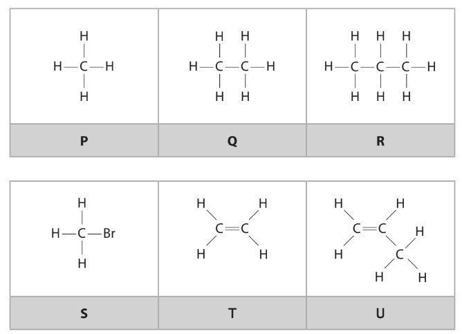

Use the letters P, Q, R, S, T and U to answer these questions. Each letter may be used once, more than once or not at all.

i) Give the letter of the compound that is **not **a hydrocarbon.

(1)

ii) Give the letters of the two compounds that have the same empirical formula.

(1)

iii) Give the letter of the compound that is used to manufacture poly(propene).

(1)

### 5((b)) — 3 marks — command: distinguish — structured — from paper 2020 · Ja1C
Describe a test that can be used to distinguish between compounds Q and T.

test ....................................................................................................

result with compound Q ....................................................................................................

result with compound T ....................................................................................................

### 5((c)) — 2 marks — command: give — structured — from paper 2020 · Ja1C
Compounds P, Q and R are members of the same homologous series. Give two characteristics of a homologous series.

### 5((d)) — 2 marks — command: multiple — structured — from paper 2020 · Ja1C
This is the displayed formula of an alkene, V.

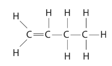

i) Give the name of alkene V.

(1)

ii) Draw the displayed formula of another alkene that is an isomer of alkene V.

(1)

### 5((e)) — 4 marks — command: multiple — structured — from paper 2020 · Ja1C
An organic compound has the percentage composition by mass

C = 36.36% H = 6.06% F = 57.58%

i) Show that the empirical formula of the compound is CH2F

(2)

ii) The relative molecular mass (*M*r) of the compound is 66. Determine the molecular formula of the compound.

(2)

molecular formula = ......................................................................

## Q9 — medium — 1 marks · exam-questions

### 1() — 1 mark — multiple_choice
What is the mass of 0.25 moles of hydrated copper(II) sulfate, CuSO4.5H2O?

Relative formula mass (*M**r*):  H2O = 18  CuSO4 = 160
- **A.** 40.0 g
- **B.** 44.5 g
- **C.** 62.5 g
- **D.** 1000 g

## Q10 — medium — 10 marks · exam-questions

### 4((a)) — 2 marks — command: multiple — structured — from paper 2020 · Nov1C
Sodium hydroxide dissolves in water, forming a strongly alkaline solution.

Ammonia dissolves in water, forming a slightly less alkaline solution.

i) Identify the ion that makes the sodium hydroxide solution alkaline.

(1)

ii) What is a possible pH of ammonia solution?

(1)

| **A** | 3 |
|---|---|
| **B** | 6 |
| **C** | 11 |
| **D** | 14 |

### 4((b)) — 2 marks — command: multiple — structured — from paper 2020 · Nov1C
When ammonia solution reacts with sulfuric acid, a neutralisation reaction occurs and ammonium sulfate forms.

i) How does the sulfuric acid act in this reaction?

(1)

| **A** | as a neutron donor |
|---|---|
| **B** | as a neutron acceptor |
| **C** | as a proton donor |
| **D** | as a proton acceptor |

ii) The diagram shows a beaker containing some ammonia solution and a few drops of phenolphthalein indicator.

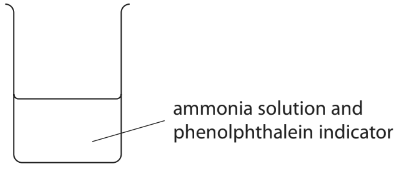

Dilute sulfuric acid is added to the beaker until it is in excess.

What are the colours of the phenolphthalein indicator before and after adding excess sulfuric acid?

(1)

| ** ** | **Before** | **After** |
|---|---|---|
| **A** | orange | red |
| **B** | yellow | red |
| **C** | pink | colourless |
| **D** | colourless | pink |

### 4((c)) — 6 marks — command: multiple — structured — from paper 2020 · Nov1C
Ammonium sulfate is used by gardeners as a fertiliser because it contains nitrogen.

i) Explain why the chemical formula of ammonium sulfate is (NH4)2SO4

Refer to the charges on the ions in your answer.

(2)

ii) Calculate the relative formula mass of ammonium sulfate, (NH4)2SO4

(1)

relative formula mass = ..............................................................

iii) Calculate the mass, in grams, of nitrogen in 1.0 kg of ammonium sulfate.

(3)

mass = .............................................................. g

## Q11 — medium — 1 marks · exam-questions

### 1() — 1 mark — multiple_choice
When zinc oxide reacts with dilute nitric acid, zinc nitrate is produced. The equation for the reaction is:

ZnO + 2HNO3 → Zn(NO3)2 + H2O

0.200 mol of nitric acid reacts with excess zinc oxide. A mass of 15.3 g of zinc nitrate is produced. Calculate the percentage yield of zinc nitrate. [*M**r* of zinc nitrate = 189]
- **A.** 26%
- **B.** 37%
- **C.** 81%
- **D.** 65%

## Q12 — medium — 11 marks · exam-questions

### 5((a)) — 2 marks — command: multiple — structured — from paper 2020 · Nov1CR
The diagram shows the displayed formula of the organic compound methanol, CH3OH

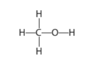

i) Determine the number of atoms in one molecule of methanol.

(1)

ii) State why methanol is not a hydrocarbon.

(1)

### 5((b)) — 4 marks — command: multiple — structured — from paper 2020 · Nov1CR
The atoms in methanol are held together by covalent bonds.

i) State what is meant by the term covalent bond.

(2)

ii) Draw a dot-and-cross diagram to show the bonding in a molecule of methanol. Show only the outer electrons of each atom.

(2)

### 5((c)) — 5 marks — command: multiple — structured — from paper 2020 · Nov1CR
Another organic compound has the percentage composition by mass

C = 38.7% H = 9.7% O = 51.6%

i) Calculate the empirical formula of this compound.

(3)

empirical formula = ..............................................................

ii) The relative molecular mass (*M*r) of the compound is 62 Determine the molecular formula of the compound.

(2)

molecular formula = ........................................................

## Q13 — medium — 10 marks · exam-questions

### 8((a)) — 3 marks — command: multiple — structured — from paper 2020 · Nov1CR
A piece of magnesium ribbon is ignited and placed in a gas jar of oxygen. The equation for the reaction is

2Mg + O2 → 2MgO

i) Give two observations that would be made in this reaction.

(2)

1........................................................................................................2........................................................................................................

ii) State why this is an oxidation reaction.

(1)

### 8((b)) — 3 marks — command: multiple — structured — from paper 2020 · Nov1CR
A second piece of magnesium ribbon is ignited and placed in a gas jar of carbon dioxide. A very exothermic reaction occurs, forming magnesium oxide and carbon.

i) State what is meant by the term exothermic.

(1)

ii) Give the chemical equation for this reaction.

(1)

iii) A fire starts in a warehouse where magnesium is stored. Suggest why it would not be suitable to use a carbon dioxide fire extinguisher to put out this fire.

(1)

### 8((c)) — 4 marks — command: explain — structured — from paper 2020 · Nov1CR
A student uses this apparatus to find the mass of magnesium oxide that forms when a known mass of magnesium is heated.

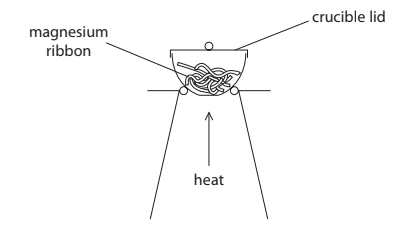

This is his method.

- find the mass of the crucible and lid
- place some magnesium ribbon in the crucible
- find the mass of the crucible, lid and magnesium
- heat the crucible with the lid on for a few minutes
- find the mass of the crucible, lid and magnesium oxide

Using this method, the mass of magnesium oxide formed is less than expected. Explain two changes that the student should make to his method to obtain a mass of magnesium oxide closer to the expected mass.

## Q14 — medium — 1 marks · exam-questions

### 1() — 1 mark — multiple_choice
Halon 1301 is a compound used in some fire extinguishers.

Halon 1301 has the percentage composition by mass of 8.05% C, 53.69% Br and 38.26% F.

Calculate the empirical formula of Halon 1301.

[*A**r* of C = 12; Br = 80; F = 19]
- **A.** CBrF
- **B.** CBrF3
- **C.** CBr3F
- **D.** CBr2F2

## Q15 — medium — 1 marks · exam-questions

### 1() — 1 mark — multiple_choice
#### Separate: Chemistry Only

What is the maximum volume, in dm3, of chlorine gas at rtp that can be obtained from 17.6 tonnes of molten potassium chloride?

[1 tonne = 106 g]

[*M**r *of KCl = 74.5]

[Assume that the molar volume of chlorine at rtp is 24 dm3/mol]
- **A.** 2.83
- **B.** 5.67
- **C.** 2.83 x 106
- **D.** 5.67 x 106

## Q16 — medium — 1 marks · exam-questions

### 1() — 1 mark — multiple_choice
#### Separate: Chemistry Only

Calculate the concentration, in mol / dm3, of a solution produced when 6.9 g of potassium carbonate, K2CO3, dissolves in 200 cm3 of water.

[*M**r  *of K2CO3 = 138 ]
- **A.** 0.05 mol / dm3
- **B.** 0.20 mol / dm3
- **C.** 0.25 mol / dm3
- **D.** 0.50 mol / dm3

## Q17 — medium — 7 marks · exam-questions

### 8((a)) — 2 marks — command: explain — structured — from paper 2019 · Ju2C
The concentration of NaClO (aq) in a solution of bleach is found by reacting it with hydrochloric acid. The equation for the reaction is

NaClO (aq) + 2HCl (aq) → NaCl (aq) + H2O (l) + Cl2 (g)

An excess of dilute hydrochloric acid is added to 4.00 cm3 of bleach solution. 60.0 cm3 of chlorine gas is produced.

Explain a safety precaution that should be taken when doing this experiment.

### 8((b)) — 5 marks — command: multiple — structured — from paper 2019 · Ju2C
#### Separate: Chemistry Only

i) Calculate the amount, in moles, of chlorine gas produced.

Assume one mole of chlorine gas occupies 24000 cm3

(2)

amount of chlorine = .............................................................. mol

ii) Determine the amount, in moles, of NaClO in 4.00 cm3 of bleach.

(1)

amount of NaClO = .............................................................. mol

iii) Calculate the concentration, in mol/dm3, of the bleach solution.

(2)

concentration = .............................................................. mol/dm3

## Q18 — medium — 6 marks · exam-questions

### 7((a)) — 2 marks — command: calculate — structured — from paper 2021 · Jan2CR
#### Separate: Chemistry Only

A sample of a gaseous hydrocarbon, X, has a volume of 600 cm3 at room temperature and pressure (rtp).

Calculate the amount, in moles, of hydrocarbon X in the sample.

[molar volume of a gas = 24 000 cm3 at rtp]

amount of hydrocarbon X = .............................................................. mol

### 7((b)) — 2 marks — command: show — structured — from paper 2021 · Jan2CR
The mass of the sample of hydrocarbon X is 1.45g. Show that the relative molecular mass (*M*r) of X is 58

*M*r = ..............................................................

### 3() — 1 mark — command: show — structured
Hydrocarbon X is an alkane. Show that the molecular formula of X is C4H10

### 4() — 1 mark — command: give — structured
Give the displayed formula of the branched-chain isomer of hydrocarbon X.

## Q19 — medium — 1 marks · exam-questions

### 1() — 1 mark — multiple_choice
The diagram shows the displayed formula of succinic acid.

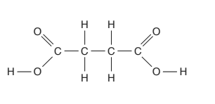

What is the **empirical formula** for this compound?
- **A.** C4H6O4
- **B.** CH2O
- **C.** C2H3O2
- **D.** CHO

## Q20 — hard — 17 marks · exam-questions

### 11((a)) — 4 marks — command: complete — structured — from paper 2017 · Specimen1C
Many different salts can be prepared from acids.

The table shows the reactants used in two salt preparations. Complete the table to show the name of the salt formed and the other product(s) in each case.

| **Reactants** | **Name of salt formed** | **Other product(s)** |
|---|---|---|
| zinc + hydrochloric acid |   |   |
| calcium carbonate + nitric acid |   |   |

### 11((b)) — 4 marks — command: state — structured — from paper 2017 · Specimen1C
A student uses the reaction between aluminium hydroxide and dilute sulfuric acid to prepare a pure, dry sample of aluminium sulfate crystals. The equation for the reaction used to prepare this salt is:

2Al(OH)3 + 3H2SO4 → Al2(SO4)3 + 6H2O

The diagram shows the steps in the student’s method.

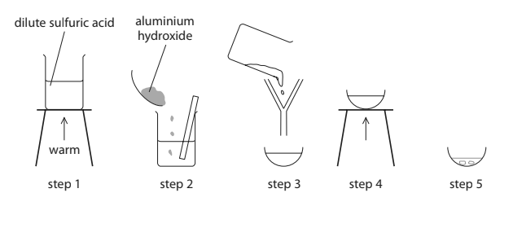

i) State **two** ways to make sure that all the acid is reacted in step 2.

(2)

ii) State the purpose of filtration in step 3.

(1)

iii) In step 5, the basin is left to cool to room temperature to allow crystals of aluminium sulfate to form.

State **one** method of drying these crystals.

(1)

### 11((c)) — 3 marks — command: determine — structured — from paper 2017 · Specimen1C
The student records this information about the reagents she uses in her preparation.

mass of aluminium hydroxide = 3.9 g

amount of sulfuric acid = 0.090 mol

Determine which reagent is in excess, making use of this information and the equation in part (b).

reagent used in excess = ..............................................................

### 11((d)) — 3 marks — command: calculate — structured — from paper 2017 · Specimen1C
Another student prepares 0.025 mol of aluminium sulfate. The formula of aluminium sulfate is Al2(SO4)3

Calculate the mass of aluminium sulfate prepared.

mass = .............................................................. g

### 11((e)) — 3 marks — command: calculate — structured — from paper 2017 · Specimen1C
The equation for another reaction used to prepare a sample of a salt is:

PbO + 2HNO3 → Pb(NO3)2 + H2O

In one experiment, the amount of lead(II) oxide used was 0.75 mol and the amount of nitric acid used was 1.5 mol. At the end of the experiment, the mass of lead(II) nitrate obtained was 209 g.

Calculate the percentage yield of lead(II) nitrate in this experiment.

[*M*r of lead(II) nitrate = 331]

percentage yield = .............................................................. %

## Q21 — hard — 12 marks · exam-questions

### 10((a)) — 3 marks — command: multiple — structured — from paper 2020 · Ja1C
Nitric acid (HNO3) is used in the production of fertilisers.

Nitric acid is manufactured in three stages.

| Stage 1 | ammonia reacts with oxygen in the presence of a platinum catalyst to produce nitrogen monoxide gas, NO, and water. |
|---|---|
| Stage 2 | nitrogen monoxide gas reacts with more oxygen to produce nitrogen dioxide gas, NO2. |
| Stage 3 | nitrogen dioxide gas reacts with water to produce nitric acid and more nitrogen monoxide gas. |

i) Complete the chemical equation for the reaction in stage 1.

......................NH3 + ......................O2 $\rightleftharpoons$ ......................NO + .......................H2O

(1)

ii) Give the meaning of the symbol $\rightleftharpoons$

(1)

iii) State the purpose of the platinum catalyst.

(1)

### 10((b)) — 1 mark — command: give — structured — from paper 2020 · Ja1C
Give a chemical equation for the reaction of nitrogen monoxide and oxygen in stage 2.

### 10((c)) — 5 marks — command: multiple — structured — from paper 2020 · Ja1C
i) The equation for the reaction in stage 3 is

3NO2 + H2O → 2HNO3 + NO

Calculate the maximum mass, in tonnes, of nitric acid that could be produced in this reaction from 11.5 tonnes of nitrogen dioxide. [1 tonne = 1.0 × 106 g]

(4)

mass of nitric acid = ...................................................................... tonnes

ii) Suggest what use can be made of the nitrogen monoxide gas formed in stage 3.

(1)

### 10((d)) — 3 marks — command: calculate — structured — from paper 2020 · Ja1C
When copper(II) oxide reacts with dilute nitric acid, copper(II) nitrate is produced.

The equation for the reaction is

CuO + 2HNO3 → Cu(NO3)2 + H2O

0.200 mol of nitric acid reacts with excess copper(II) oxide. A mass of 15.3g of copper(II) nitrate is produced.

Calculate the percentage yield of copper(II) nitrate.

[*M*r of copper(II) nitrate = 187.5]

## Q22 — hard — 12 marks · exam-questions

### 9((a)) — 2 marks — command: multiple — structured — from paper 2020 · Nov1C
Sodium hydrogencarbonate (NaHCO3) is also known as baking soda.

Baking soda can be used to make cakes increase in size in an oven.

This is the equation for the reaction that takes place when baking soda is heated.

2NaHCO3 (s) → Na2CO3 (s) + CO2 (g) + H2O (g)

i) What type of reaction is this?

(1)

| ☐ | **A** | combustion |
|---|---|---|
| ☐ | **B** | decomposition |
| ☐ | **C** | oxidation |
| ☐ | **D** | reduction |

ii) Suggest why the reaction makes the cakes increase in size.

(1)

### 9((b)) — 3 marks — command: multiple — structured — from paper 2020 · Nov1C
A student uses this apparatus to investigate the reaction that takes place when sodium hydrogencarbonate is heated.

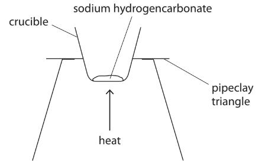

This is the student’s method.

- Weigh a crucible and record the mass
- Add some sodium hydrogencarbonate to the crucible, reweigh it and record the mass
- Heat the crucible and contents for five minutes, then allow to cool before weighing and recording the mass
- Heat the crucible and contents again for a further three minutes, then allow to cool before weighing and recording the mass

i) Give a reason why the crucible and contents are heated for a further three minutes.

(1)

ii) The student considered using a lid on the crucible in the experiment.

Suggest an advantage and a disadvantage of using a lid on the crucible.

(2)

advantage ....................................................................................................

disadvantage ....................................................................................................

### 9((c)) — 4 marks — command: calculate — structured — from paper 2020 · Nov1C
The table shows some of the student’s results.

| mass of crucible and sodium hydrogencarbonate in g | 29.75 |
|---|---|
| mass of empty crucible in g | 26.50 |

i) Calculate the mass of sodium hydrogencarbonate that the student uses.

(1)

mass = ..............................................................g

ii) Using this equation, calculate the maximum mass of sodium carbonate (Na2CO3) that could form in the student’s reaction.

2NaHCO3 (s) → Na2CO3 (s) + CO2 (g) + H2O (g)

[*M*r of NaHCO3 = 84   *M*r of Na2CO3 = 106]

(3)

maximum mass = .............................................................. g

### 9((d)) — 3 marks — command: multiple — structured — from paper 2020 · Nov1C
In a second experiment, the student uses a larger mass of sodium hydrogencarbonate.

She calculates that she should obtain 4.8 g of sodium carbonate.

She actually obtains 4.2 g of sodium carbonate.

i)  Calculate the percentage yield from the student’s experiment.

(2)

percentage yield = ..............................................................%

ii) Other than spillages, suggest a possible reason why the student’s actual yield is less than expected.

(1)

## Q23 — hard — 14 marks · exam-questions

### 10((a)) — 6 marks — command: multiple — structured — from paper 2021 · Ja1C
This question is about alkanes.

The graph shows the boiling points of several unbranched alkanes.

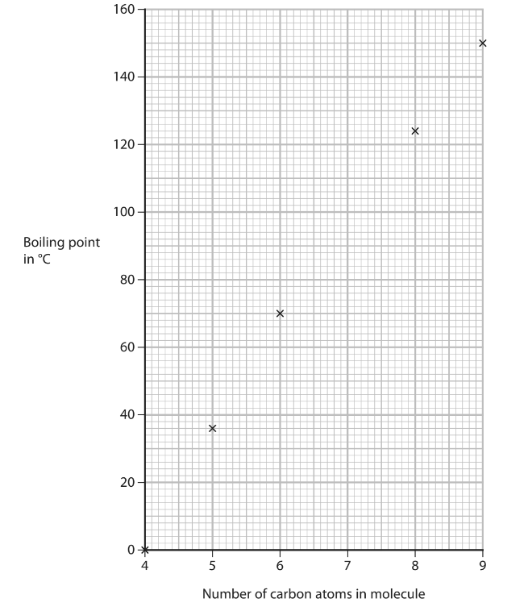

i) Draw a curve of best fit.

(1)

ii) Use the graph to find the boiling point of the alkane with 7 carbon atoms in its molecule.

Show on the graph how you obtain your answer.

(2)

boiling point = .............................................................. °C

iii) Explain the trend shown by the graph.

(3)

### 10((b)) — 2 marks — command: explain — structured — from paper 2021 · Ja1C
The diagram represents two isomers with the formula C5H12

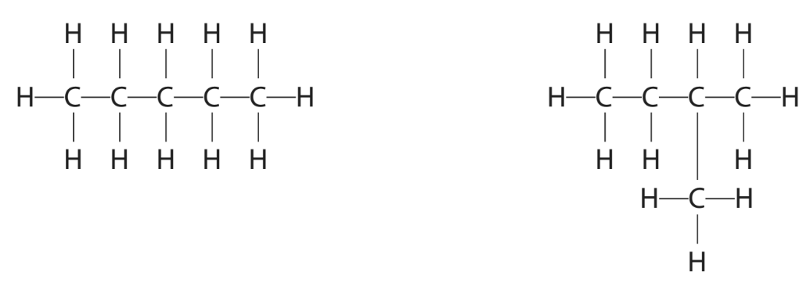

Explain why these compounds are isomers.

### 10((c)) — 3 marks — command: multiple — structured — from paper 2021 · Ja1C
i) An alkane contains 82.8% carbon and 17.2% hydrogen by mass. Show by calculation that the empirical formula of this alkane is C2H5

(2)

ii) Deduce the molecular formula of this alkane.

(1)

### 10((d)) — 3 marks — command: calculate — structured — from paper 2021 · Ja1C
The equation for the complete combustion of one mole of an alkane can be represented by

alkane + ZO2 → XCO2 + YH2O

Complete combustion of one mole of the alkane produces 308 g of carbon dioxide and 144 g of water.

X, Y and Z are the numbers used to balance the equation.

Calculate the values of X, Y and Z.

[*M*r of CO2 = 44, *M*r of H2O = 18]

X = ................................

Y = ................................

Z = ................................

## Q24 — hard — 13 marks · exam-questions

### 10((a)) — 3 marks — command: multiple — structured — from paper 2021 · Ju1C
The diagram shows the apparatus a teacher uses to determine the formula of an oxide of lead.

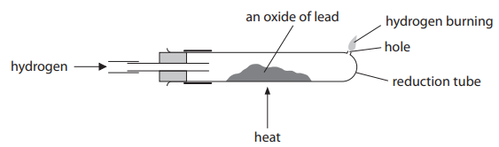

This is the teacher’s method.

1. Find the mass of the reduction tube
2. Add some of the lead oxide to the reduction tube
3. Find the mass of the reduction tube and lead oxide
4. Pass hydrogen gas over the lead oxide and ignite the hydrogen at the hole
5. Heat the lead oxide strongly for 10 minutes
6. Keep passing hydrogen through the reduction tube until the tube and contents are cool
7. Find the new mass of the reduction tube and its contents

i) Give a reason why hydrogen is passed through the reduction tube until the tube and contents are cool.

(1)

ii) Describe what the teacher should do next to make sure all the lead oxide has been reduced to lead.

(2)

### 10((b)) — 6 marks — command: multiple — structured — from paper 2021 · Ju1C
The teacher completes the experiment and obtains these results.

- mass of reduction tube = 23.50 g
- mass of tube + lead oxide = 28.64 g
- mass of tube + lead = 28.16 g

i) Calculate the mass of lead formed.

(1)

mass of lead = .............................. g

ii) Calculate the mass of oxygen removed from the lead oxide.

(1)

mass of oxygen = .............................. g

iii) Determine the empirical formula of the lead oxide.

(4)

empirical formula of the lead oxide ..............................

### 10((c)) — 4 marks — command: multiple — structured — from paper 2021 · Ju1C
The insoluble salt lead(II) chloride (PbCl2) can be prepared by reacting a solution of lead(II) nitrate with dilute hydrochloric acid.

i) Complete the equation for the reaction by adding the state symbols.

(1)

Pb(NO3)2 (..........) + 2HCl (..........) → PbCl2 (..........) + 2HNO3 (..........)

ii) Show that the maximum mass of lead(II) chloride that can be made from 0.0370 mol of hydrochloric acid is about 5 g.

[*M*r of PbCl2 = 278]

(3)

maximum mass = .............................. g

## Q25 — hard — 12 marks · exam-questions

### 11((a)) — 4 marks — command: describe — structured — from paper 2022 · Jan1C
A student uses this apparatus to heat crystals of hydrated zinc sulfate and collect the liquid produced.

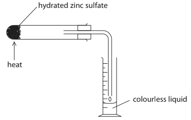

i) Describe a chemical test to show that the colourless liquid contains water.

(2)

ii) Describe a physical test to show the colourless liquid is pure water.

(2)

### 11((b)) — 5 marks — command: calculate — structured — from paper 2022 · Jan1C
The equation for the decomposition of hydrated zinc sulfate is

ZnSO4·7H2O (s) → ZnSO4 (s) + 7H2O (l)

The student records these masses.

- mass of boiling tube = 41.64 g
- mass of boiling tube + ZnSO4·7H2O = 54.46 g

Calculate the maximum volume, in cm3, of pure water that could be produced.

Give your answer to 1 decimal place.

[1.00 cm3 of pure water has a mass of 1.00 g]

[*M*r of ZnSO4·7H2O = 287   *M*r of H2O = 18]

maximum volume of pure water = .............................. cm3

### 11((c)) — 3 marks — command: multiple — structured — from paper 2022 · Jan1C
In an experiment using a different mass of ZnSO4·7H2O the maximum volume of pure water that could be produced is 8.5 cm3.

The student collected the pure water and calculated the percentage yield to be 20.3%.

i) Calculate the volume, in cm3, of pure water collected.

(1)

volume of pure water = .............................. cm3

ii) Explain an improvement to the apparatus that would increase the percentage yield of pure water.

(2)

## Q26 — hard — 15 marks · exam-questions

### 11((a)) — 2 marks — command: complete — structured — from paper 2020 · Ja1CR
This question is about the reduction of metal oxides.

Solid oxides of copper can be reduced by reacting them with methane gas.

Complete the equation for the reaction between copper(II) oxide and methane. Include state symbols.

.....CuO (.....) + .....CH4 (.....) $\rightarrow$ .....Cu (.....) + .....CO2 (.....) + .....H2O (.....)

### 11((b)) — 5 marks — command: multiple — structured — from paper 2020 · Ja1CR
A teacher uses this apparatus to demonstrate the reaction between a different oxide of copper and methane.

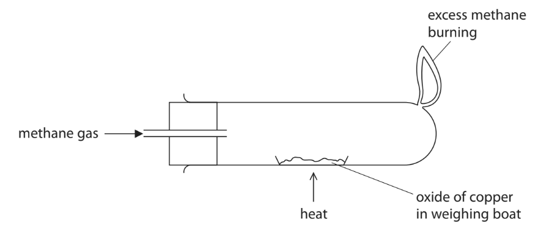

The teacher heats the oxide of copper until the reaction is complete. The table shows the teacher’s results.

|   | **Mass in g** |
|---|---|
| empty weighting boat | 15.05 |
| weighing boat + oxide of copper | 18.63 |
| weighing boat + copper | 18.23 |

i) Use the teacher’s results to show that the empirical formula of this oxide of copper is Cu2O

(4)

ii) The teacher wears safety glasses and a lab coat during the demonstration. Give **one** other safety precaution that she should take.

(1)

### 11((c)) — 8 marks — command: multiple — structured — from paper 2020 · Ja1CR
Iron forms when iron(III) oxide is heated with carbon. The equation for the reaction is:

Fe2O3 + 3C → 2Fe + 3CO

i) State how the equation shows that iron(III) oxide is reduced.

(1)

ii) State why carbon monoxide should not be released into the atmosphere.

(1)

iii) Calculate the maximum mass, in tonnes, of iron that can be produced when 30.0 tonnes of iron(III) oxide are reacted with an excess of carbon.

[1 tonne = 1.0 × 106 g]

(4)

mass = .............................................................. tonnes

iv) A mixture of 25 000 mol of iron(III) oxide and 840 000 g of carbon is heated. Use this equation to show that the iron(III) oxide is in excess.

Fe2O3 + 3C → 2Fe + 3CO

(2)

## Q27 — hard — 13 marks · exam-questions

### 7((a)) — 2 marks — command: multiple — structured — from paper 2020 · Nov1CR
A student uses the reaction between zinc and dilute sulfuric acid to prepare some zinc sulfate crystals.

i) Complete the equation for this reaction by giving the correct state symbols.

(1)

Zn (....................) + H2SO4 (....................) → ZnSO4 (....................) + H2 (....................)

ii) State what would be observed during this reaction.

(1)

### 7((b)) — 4 marks — command: multiple — structured — from paper 2020 · Nov1CR
The student adds excess zinc to a beaker of dilute sulfuric acid.

i) Explain why it is necessary to add excess zinc.

(2)

ii) Draw a diagram of the apparatus the student should use to remove the unreacted zinc and collect the zinc sulfate solution.

(2)

### 7((c)) — 7 marks — command: multiple — structured — from paper 2020 · Nov1CR
The student obtains a pure, dry sample of zinc sulfate crystals. The formula of zinc sulfate crystals is ZnSO4.7H2O

i) Calculate the relative molecular mass (*M**r*) of zinc sulfate crystals.

(2)

*M**r* = ..............................................................

ii) The student uses 0.0200 mol of dilute sulfuric acid in her preparation. Show that the maximum mass of zinc sulfate crystals that the student could obtain is about 6 g.

(2)

iii) The student obtains a mass of 4.28 g of zinc sulfate crystals. Calculate the percentage yield of the zinc sulfate crystals. Give your answer to three significant figures.

(3)

percentage yield = ..............................................................%

## Q28 — hard — 6 marks · exam-questions

### 7((a)) — 2 marks — command: explain — structured — from paper 2022 · Jan1CR
Explain the meaning of the term **thermal decomposition**.

### 7((b)) — 4 marks — command: calculate — structured — from paper 2022 · Jan1CR
The equation for the thermal decomposition of potassium hydrogencarbonate is

2KHCO3 → K2CO3 + H2O + CO2

Calculate the maximum mass of K2CO3 that could be produced from the thermal decomposition of 2.50 g of KHCO3

## Q29 — hard — 10 marks · exam-questions

### 10((a)) — 1 mark — command: state — structured — from paper 2022 · Jan1CR
A student is given a pure sample of sodium carbonate crystals and is told that the formula of the crystals is Na2CO3.*x*H2O

State what *x*H2O in the formula shows about the sodium carbonate crystals.

### 10((b)) — 5 marks — command: multiple — structured — from paper 2022 · Jan1CR
The student uses this apparatus to find the value of *x* in Na2CO3.*x*H2O

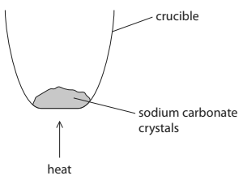

This is the student’s method.

- Find the mass of an empty crucible without a lid
- Add some sodium carbonate crystals Na2CO3.*x*H2O to the crucible
- Find the total mass of the crucible and sodium carbonate crystals
- Heat the crucible to remove water from the crystals
- Allow the crucible and contents to cool down
- Find the mass of the cold crucible and its contents

These are the student’s results.

|   | **Mass in grams** |
|---|---|
| empty crucible | 22.75 |
| crucible and sodium carbonate crystals, Na2CO3.*x*H2O | 29.71 |
| cold crucible and contents | 25.93 |

i) Calculate the mass of sodium carbonate left after heating and cooling.

(1)

mass of sodium carbonate = .............................................................. g

ii) Calculate the mass of H2O lost from the sodium carbonate crystals during heating.

(1)

mass of H2O = .............................................................. g

iii) Show that the student’s results suggest that the formula of the sodium carbonate crystals is Na2CO3.7H2O

[*M*r of Na2CO3 = 106   *M*r of H2O = 18]

(3)

### 10((c)) — 4 marks — command: multiple — structured — from paper 2022 · Jan1CR
The student’s teacher says that the correct formula of the sodium carbonate crystals is Na2CO3.10H2O

i) The student did not make any mistakes in their measurements.

Explain what could have caused the student’s value for *x* to be too low.

(2)

ii) Describe how the student could improve the method to obtain a more accurate value for *x*.

(2)

## Q30 — hard — 11 marks · exam-questions

### 6((a)) — 2 marks — command: plot — structured — from paper 2017 · Specimen2C
The mineral nesquehonite is a form of hydrated magnesium carbonate. The formula, MgCO3.xH2O, shows that nesquehonite contains water of crystallisation. When a sample of nesquohonite is heated gently, the water of crystallisation is given off and anhydrous magnesium carbonate is left. Six students are each given a sample of nesquehonite of mass 6.1 g. The students heat their samples for different times. The samples are then allowed to cool before being reweighed. The table shows their results.

| **time of heating / minutes** | 0 | 1.0 | 2.0 | 3.0 | 4.0 | 4.5 | 6.0 |
|---|---|---|---|---|---|---|---|
| **mass of sample after heating / g** | 6.1 | 5.3 | 4.5 | 3.7 | 2.8 | 2.4 | 2.4 |

Plot these results on the grid provided. The last two points have been plotted for you. Draw a straight line of best fit for the points you have plotted.

(2)

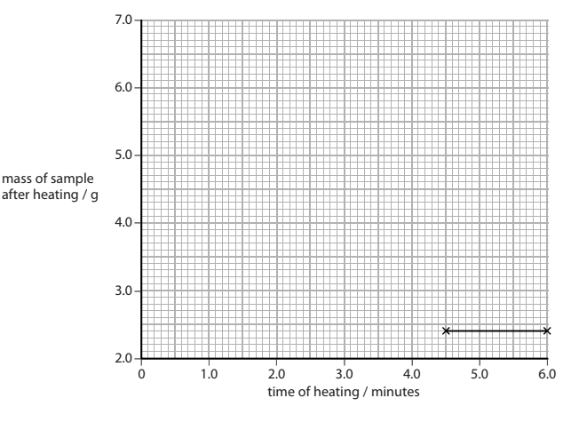

### 6((b)) — 2 marks — command: predict — structured — from paper 2017 · Specimen2C
Predict the mass of sample remaining after heating for 2.5 minutes. Show on the graph how you obtain your answer.

mass after 2.5 minutes = .............................................................. g

### 6((c)) — 1 mark — command: why — structured — from paper 2017 · Specimen2C
State why the last two masses in the table are exactly the same.

### 6((e)) — 3 marks — command: calculate — structured — from paper 2017 · Specimen2C
A sample of nesquehonite contains 1.68 g of MgCO3 and 1.08 g of H2O. Calculate the value of x in the formula MgCO3.xH2O

[*M**r* of MgCO3 = 84; *M**r* of H2O = 18]

x = ..............................................................

### 6((e)) — 3 marks — command: calculate — structured — from paper 2017 · Specimen2C
#### Separate: Chemistry Only

When anhydrous magnesium carbonate is heated strongly, it decomposes. The equation for the reaction is:

MgCO3 (s) → MgO (s) + CO2 (g)

Calculate the volume of carbon dioxide formed in cm3, at rtp, when 4.2 g of anhydrous magnesium carbonate are completely decomposed.

[*M**r* of MgCO3 = 84] [Assume that the molar volume at rtp of carbon dioxide is 24 dm3]

volume = .............................................................. cm3

## Q31 — hard — 11 marks · exam-questions

### 6((a)) — 3 marks — command: multiple — structured — from paper 2020 · Nov2C
#### Separate: Chemistry Only

A student is provided with a bottle containing a colourless solution X.

Solution X is thought to be dilute sulfuric acid of concentration 0.10 mol/dm3.

The student does some experiments on samples of solution X to try to show that it is dilute sulfuric acid.

The student adds a few drops of litmus to a sample of solution X.

The litmus turns red.

The student knows that the products of the electrolysis of dilute sulfuric acid are hydrogen and oxygen.

She carries out the electrolysis using this apparatus.

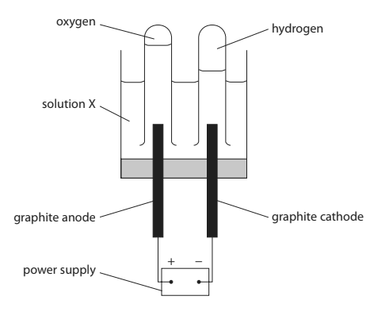

i) Suggest why the student does not use zinc electrodes in her experiment.

(1)

ii) State what is observed at both the anode and the cathode during the electrolysis.

(1)

iii) Which of these tests shows that the gas formed at the cathode is hydrogen?

(1)

| ☐ | **A** | a glowing splint relights |
|---|---|---|
| ☐ | **B** | a burning splint gives a squeaky pop |
| ☐ | **C** | a burning splint goes out |
| ☐ | **D** | limewater turns cloudy |

### 6((b)) — 2 marks — command: describe — structured — from paper 2020 · Nov2C
Describe a test to show that solution X contains sulfate ions.

### 6((c)) — 6 marks — command: multiple — structured — from paper 2020 · Nov2C
#### Separate: Chemistry Only

The student then does a titration to see if the concentration of the dilute sulfuric acid is 0.10 mol/dm3.

She measures 25.0 cm3 of potassium hydroxide solution into a conical flask, and then adds a few drops of indicator solution.

i) Name the piece of apparatus the student should use to measure 25.0 cm3 of the potassium hydroxide solution.

(1)

ii) The concentration of potassium hydroxide in the solution is 0.125 mol/dm3. Calculate the amount, in mol, of KOH in 25.0 cm3 of this solution.

(2)

amount = .............................................................. mol

iii) The equation for the reaction in the titration is

H2SO4 + 2KOH → K2SO4 + 2H2O

Calculate the volume, in cm3, of 0.10 mol/dm3 sulfuric acid needed to neutralise 25.0 cm3 of the potassium hydroxide solution.

(3)

volume of sulfuric acid = .............................................................. cm3

## Q32 — hard — 12 marks · exam-questions

### 5((a)) — 4 marks — command: multiple — structured — from paper 2022 · Ja2CR
#### Separate: Chemistry Only

This question is about three stages in the manufacture of sulfuric acid.

In stage 1, sulfur is burned in oxygen to form sulfur dioxide gas.

S (s) + O2 (g) → SO2 (g)

i) State one environmental problem caused by the release of sulfur dioxide into the atmosphere.

(1)

ii) A mass of 6.4 tonnes of sulfur is burned to produce sulfur dioxide gas. Calculate the maximum volume, in dm3, of sulfur dioxide gas that can be produced at rtp. [molar volume of sulfur dioxide gas at rtp = 24 dm3]

[1 tonne = 106 g] Give your answer in standard form.

(3)

maximum volume = .............................................................. dm3

### 5((b)) — 4 marks — command: multiple — structured — from paper 2022 · Ja2CR
#### Separate: Chemistry Only

In stage 2, sulfur dioxide is reacted with oxygen to form sulfur trioxide gas.

2SO2 (g) + O2 (g) $\rightleftharpoons$ 2SO3 (g)

The yield of sulfur trioxide is approximately 98%.

i) A catalyst is used in this reaction. Explain how a catalyst increases the rate of a reaction.

(2)

ii) The temperature is kept constant.

Give a reason why increasing the pressure would increase the yield of sulfur trioxide.

(1)

iii) Suggest why it is not necessary to increase the pressure in stage 2.

(1)

### 5((c)) — 2 marks — command: complete — structured — from paper 2021 · Ja2CR
In stage 3, the sulfur trioxide is reacted with concentrated sulfuric acid to form a liquid called oleum, H2S2O7 

The oleum is then added to water to form concentrated sulfuric acid.

Complete the chemical equations for these two reactions.

............................ + ............................ → H2S2O7 
H2S2O7 + ............................ → ...........................

### 5((d)) — 2 marks — command: calculate — structured — from paper 2022 · Ja2CR
Sulfuric acid reacts with ammonia to form ammonium sulfate, (NH4)2SO4 

Calculate the percentage by mass of nitrogen in ammonium sulfate.

[*M*r of (NH4)2SO4 = 132]

percentage = .............................................................. %
