# Exam Questions — Elements, compounds & mixtures
**1. Principles of Chemistry: Part 1** · Edexcel IGCSE Chemistry (Modular) (4XCH1) — 24/Unit 1
> Source: [https://www.savemyexams.com/igcse/chemistry/edexcel/modular/24/unit-1/topic-questions/principles-of-chemistry/elements-compounds-mixtures/exam-questions/](https://www.savemyexams.com/igcse/chemistry/edexcel/modular/24/unit-1/topic-questions/principles-of-chemistry/elements-compounds-mixtures/exam-questions/) · 24 questions · total 177 marks

## Q1 — easy — 7 marks · exam-questions

### 2((a)) — 4 marks — command: explain — structured — from paper 2017 · Specimen1C
Substances can be classified as elements, compounds or mixtures.

Each of the boxes in the diagram represents either an element, a compound or a mixture.

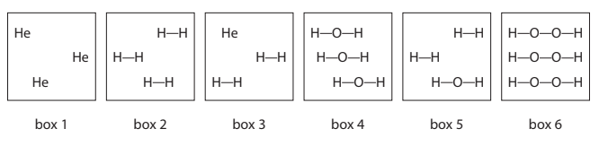

i) Explain which two boxes represent an element.

(2)

ii) Explain which two boxes represent a mixture.

(2)

### 2((b)) — 3 marks — command: choose — structured — from paper 2017 · Specimen1C
The list gives the names of some methods used in the separation of mixtures:

- chromatography
- crystallisation
- distillation
- filtration

Use names from the list to choose a suitable method for each separation. Each name may be used once, more than once or not at all.

i) Separating water from sodium chloride solution.

(1)

ii) Separating the blue dye from a mixture of blue and red dyes.

(1)

iii) Separating potassium nitrate from potassium nitrate solution.

(1)

## Q2 — easy — 1 marks · exam-questions

### 1() — 1 mark — multiple_choice
The diagram below represents a sample of air:

What correctly describes this sample of air?
- **A.** an element
- **B.** a compound
- **C.** a mixture of elements
- **D.** a mixture of compounds

## Q3 — easy — 7 marks · exam-questions

### 1((a)) — 3 marks — command: identify — structured — from paper 2022 · Jan1C
This question is about mixtures and compounds.

The box gives some methods used to separate mixtures.

| chromatography | crystallisation |
|---|---|
| fractional distillation | simple distillation |

Choose methods from the box to answer the following questions.

Each method may be used once, more than once or not at all.

i) Identify a method to separate a single food dye from a mixture of food dyes.

(1)

ii) Identify a method to separate gasoline from crude oil.

(1)

iii) Identify a method to separate water from copper(II) sulfate solution.

(1)

### 1((b)) — 2 marks — command: explain — structured — from paper 2022 · Jan1C
The diagram represents a molecule.

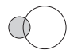

Explain why this molecule is a compound.

### 1((c)) — 2 marks — command: multiple — structured — from paper 2022 · Jan1C
The molecular formula of another compound is C3H5N3O9

i) State the number of different elements in C3H5N3O9

(1)

ii) Determine the number of atoms in a molecule of C3H5N3O9

(1)

## Q4 — easy — 6 marks · exam-questions

### 1((a)) — 3 marks — command: identify — structured — from paper 2020 · Nov1CR
The box gives some methods used in the separation of mixtures.

| chromatography | crystallisation | evaporation |
|---|---|---|
| filtration | fractional distillation | simple distillation |

Use words from the box to answer these questions.

i) Identify the method used to obtain pure water from sea water.

(1)

ii) Identify the method used to separate the dyes in a food colouring.

(1)

iii) Identify the method used to obtain ethanol from a mixture of ethanol and water.

(1)

### 1((b)) — 3 marks — command: complete — structured — from paper 2020 · Nov1CR
Complete the sentences by writing a suitable word in each blank space.

When salt is added to water and stirred until no more will ............................................ , a saturated solution forms.

The salt is the ........................................................ .

The water is the ......................................................... .

## Q5 — easy — 6 marks · exam-questions

### 1((a)) — 1 mark — command: name — structured — from paper 2021 · Ja1CR
The box lists some substances. Choose substances from the box to answer these questions.

Each substance may be used once, more than once or not at all.

| air | bromine | carbon | copper | glucose |
|---|---|---|---|---|
|   | nitrogen | oxygen | sulfur | water |

Name a metallic element.

### 1((b)) — 1 mark — command: name — structured — from paper 2021 · Ja1CR
Name a compound.

### 3((c)) — 1 mark — command: name — structured — from paper 2021
Name a mixture.

### 1((d)) — 1 mark — command: name — structured — from paper 2021 · Ja1CR
Name an element that is a gas at room temperature.

### 1((e)) — 1 mark — command: name — structured — from paper 2021 · Ja1CR
Name an element that forms a basic oxide.

### 1((f)) — 1 mark — command: name — structured — from paper 2021 · Ja1CR
Name two elements that are in the same group of the Periodic Table.

## Q6 — easy — 5 marks · exam-questions

### 1((a)) — 1 mark — command: name — structured — from paper 2020 · Ja202C
This question is about elements, compounds and mixtures.

Name the element that burns with a lilac flame.

### 1((b)) — 1 mark — command: name — structured — from paper 2020 · Ja202C
Name the technique used to separate the mixture of colours in black ink.

### 1((c)) — 3 marks — command: identify — structured — from paper 2020 · Ja202R
Indented content here. The box gives the names of some substances.

| air | bromine | magnesium | neon | sodium chloride | sulfur |
|---|---|---|---|---|---|

i) Choose substances from the box to answer these questions. Identify the compound.

(1)

ii) Identify the mixture.

(1)

iii) Identify the non‐metal element that is a solid at room temperature.

(1)

## Q7 — easy — 5 marks · exam-questions

### 1((a)) — 1 mark — multiple_choice — from paper 2020 · Nov2C
A student is given a mixture of salt solution and sand. She wants to obtain pure water from the mixture.

She separates the sand from the salt solution. Which method of separation should she use?
- **A.** crystallisation
- **B.** filtration
- **C.** fractional distillation
- **D.** simple distillation

### 1((b)) — 4 marks — command: multiple — structured — from paper 2020 · Nov2C
The student then uses this apparatus to obtain pure water from the salt solution.

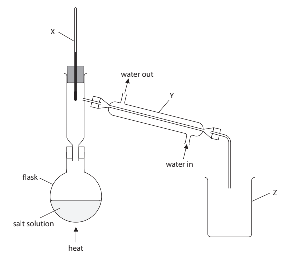

i) Name the pieces of apparatus labelled X, Y and Z.

(3)

X ..........................................................................................................

Y ..........................................................................................................

Z ..........................................................................................................

ii) State what remains in the flask when the separation is complete.

(1)

## Q8 — easy — 6 marks · exam-questions

### 1((a)) — 4 marks — command: multiple — structured — from paper 2020 · Ja2CR
Substances can be classified as elements, mixtures or compounds.

Each box represents an element, a mixture or a compound.

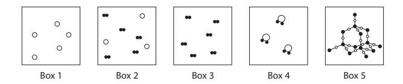

i) Which box represents a mixture?

| ☐ | **A** | 1 |
|---|---|---|
| ☐ | **B** | 2 |
| ☐ | **C** | 3 |
| ☐ | **D** | 4 |

(1)

ii) Which two boxes represent elements?

| ☐ | **A** | 1 and 2 |
|---|---|---|
| ☐ | **B** | 2 and 3 |
| ☐ | **C** | 1 and 3 |
| ☐ | **D** | 3 and 4 |

(1)

iii) Explain why Box 5 represents a compound.

(2)

### 1((b)) — 2 marks — command: multiple — structured — from paper 2020 · Ja2CR
The Periodic Table contains all the known elements.

i) How are the elements arranged in the Periodic Table?

| ☐ | **A** | increasing mass number |
|---|---|---|
| ☐ | **B** | Increasing number of neutrons |
| ☐ | **C** | increasing number of protons |
| ☐ | **D** | increasing reactivity |

(1)

ii) Elements in the same group have the same number of

| ☐ | **A** | electrons in outer shell |
|---|---|---|
| ☐ | **B** | electron shells |
| ☐ | **C** | neutrons |
| ☐ | **D** | protons |

(1)

## Q9 — medium — 8 marks · exam-questions

### 4((a)) — 4 marks — command: explain — structured — from paper 2019 · Ju1c
A student uses this apparatus to investigate the colours in four different inks, A, B, C and D.

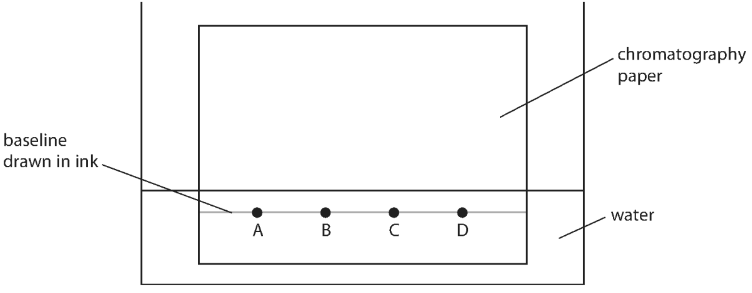

Explain two mistakes the student made when setting up the experiment.

### 4((b)) — 4 marks — command: multiple — structured — from paper 2019 · Ju1C
Another student does the experiment but does not make any mistakes.

The diagram shows her results.

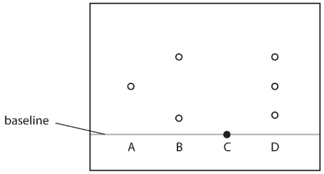

i) State how many colours ink D contains.

(1)

ii) State which of the inks tested could be mixed together to make ink D.

(1)

iii) Explain which of the inks tested is insoluble in water.

(2)

## Q10 — medium — 1 marks · exam-questions

### 1() — 1 mark — multiple_choice
The diagram shows four pieces of apparatus for separating mixtures:

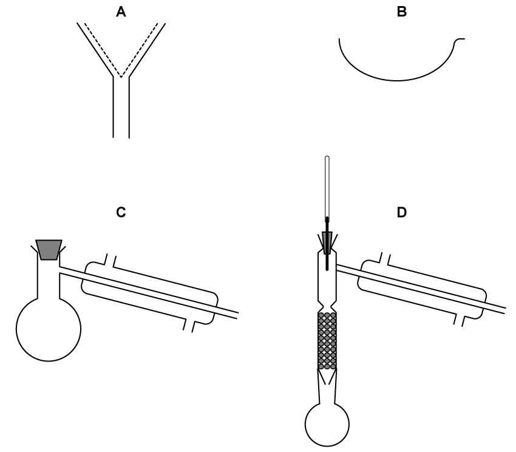

Which one would be most suitable for separating a mixture of alcohol and water?
- **A.** 
- **B.** 
- **C.** 
- **D.** 

## Q11 — medium — 7 marks · exam-questions

### 2((a)) — 2 marks — command: deduce — structured — from paper 2021 · Ja1CR
A student does a chromatography experiment using ink 1, ink 2, and three known dyes A, B and C. The student uses water as the solvent.

The diagram shows the student’s chromatogram.

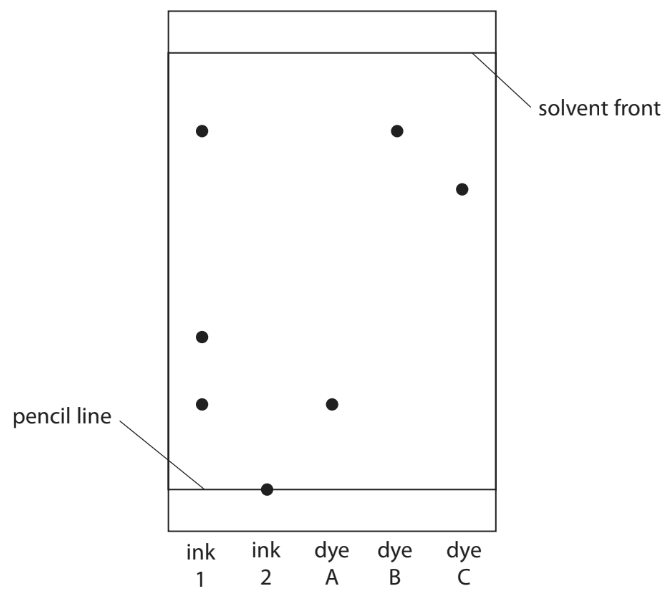

Deduce what conclusions can be made about the composition of ink 1.

### 2((b)) — 2 marks — command: multiple — structured — from paper 2021 · Ja1CR
i) Give one conclusion that can be made about ink 2.

(1)

ii) Suggest how the student could change the experiment to find the composition of ink 2.

(1)

### 2((c)) — 3 marks — command: calculate — structured — from paper 2021 · Ja1CR
Calculate the Rf value of dye C, giving your answer to 2 significant figures.

Rf value = ...............................................

## Q12 — medium — 10 marks · exam-questions

### 4((a)) — 7 marks — command: multiple — structured — from paper 2021 · Ju1C
A student uses paper chromatography in an experiment to separate the dyes in four different food colourings, E, F, G and H.

The diagram shows the appearance of the paper before and after the experiment.

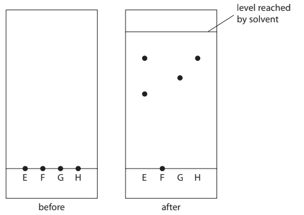

i) Describe how the student should complete the experiment after putting a spot of each food colouring on the paper.

(3)

ii) Deduce the number of dyes in food colouring H.

(1)

iii) Suggest why food colouring F does not move during the experiment.

(1)

iv) Explain which two food colourings contain the dye that is likely to be the most soluble in the solvent.

(2)

### 4((b)) — 3 marks — command: show — structured — from paper 2021 · Ju1C
Determine which food colouring contains a dye with Rf value closest to 0.67

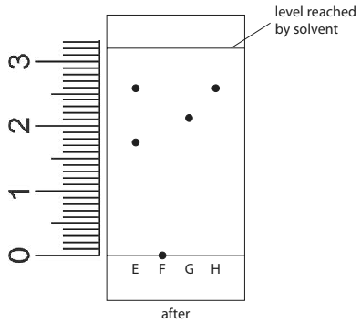

Show your working.

## Q13 — medium — 8 marks · exam-questions

### 3((a)) — 2 marks — command: state — structured — from paper 2022 · Jan1CR
This question is about chromatography.

Two students carry out separate chromatography experiments to find the *R**f* values for five different food dyes, A, B, C, D and E.

State two things that should be the same in both experiments so that the students can compare their results fairly.

### 3((b)) — 3 marks — command: multiple — structured — from paper 2022 · Jan1CR
After doing the experiments the students calculate the *R**f* value for each food dye.

The table shows their results.

| **Dye** | **Student 1 *****R******f***** value** | **Student 2 *****R******f***** value** |
|---|---|---|
| A | 0.45 | 0.45 |
| B | 0.63 | 0.64 |
| C | 0.00 | 0.00 |
| D | 0.83 | 1.20 |
| E | 0.30 | 0.30 |

i) State what can be concluded about dye C.

(1)

ii) Explain which *R**f* value cannot be correct.

(2)

### 3((c)) — 3 marks — command: calculate — structured — from paper 2022 · Jan1CR
The diagram shows a chromatogram for a different food dye.

Some distances are shown on the diagram.

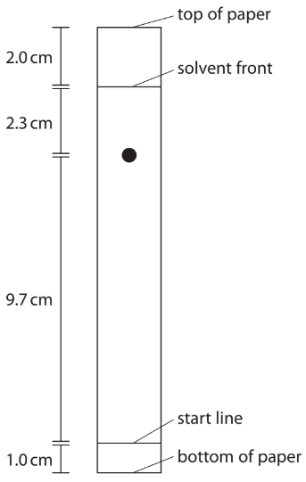

Calculate the *R**f* value for this food dye.

Give your answer to two significant figures.

## Q14 — medium — 1 marks · exam-questions

### 1() — 1 mark — multiple_choice
A student obtained the following chromatogram for substance A.

Determine the *R**f* value of substance A.
- **A.** 0.66
- **B.** 0.26
- **C.** 0.35
- **D.** 0.43

## Q15 — medium — 1 marks · exam-questions

### 1() — 1 mark — multiple_choice
A student set up the following apparatus to investigate the colours in three different food colourings.

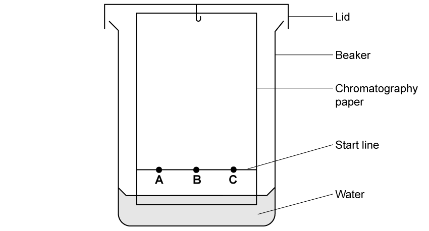

What are the stationary and mobile phases for this experiment?
- **A.** stationary: chromatography papermobile: water
- **B.** stationary: beakermobile: start line
- **C.** stationary: watermobile: food colourings
- **D.** stationary: start linemobile: chromatography paper

## Q16 — medium — 8 marks · exam-questions

### 2((a)) — 1 mark — multiple_choice — from paper 2020 · Nov2C
In a chromatography experiment a student uses samples of three pure food dyes, blue (B), red (R) and yellow (Y). He also uses samples of four unknown substances, S, T, U and V. The student puts a small drop of each substance on the pencil line. The diagram shows the student’s chromatogram at the end of the experiment.

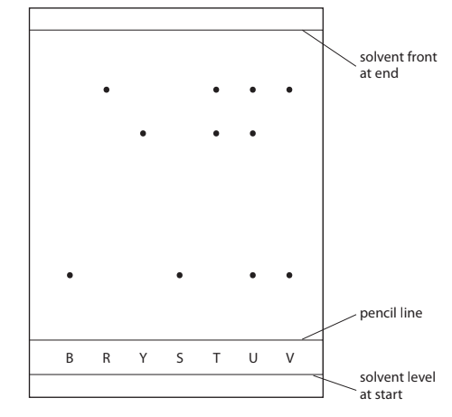

Which of the unknown substances contains only one food dye?
- **A.** substance S
- **B.** substance T
- **C.** substance U
- **D.** substance V

### 2() — 2 marks — command: explain — structured
Explain which pure food dyes are in substance V.

### 2((c)) — 5 marks — command: multiple — structured — from paper 2020 · Nov2C
i) Calculate the *R**f*  value of the yellow food dye Y.

(3)

*   R**f* = ..............................................................

ii) State how the chromatogram suggests that the yellow food dye Y is less soluble in the solvent than the red food dye R.

(2)

## Q17 — medium — 9 marks · exam-questions

### 2((a)) — 2 marks — command: state — structured — from paper 2020 · Ja2CR
Chromatography is used to analyse mixtures.

A student does a chromatography experiment to analyse the composition of green food colouring in sweets.

She places four known dyes, A, B, C and D, and the green food colouring on chromatography paper.

The diagram shows the student’s apparatus at the start of her experiment.

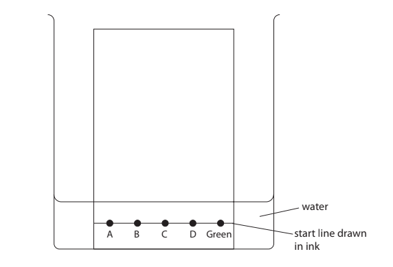

The diagram shows that the student makes two mistakes when setting up her apparatus.

State the two changes that the student should make so that her experiment works.

### 2((b)) — 7 marks — command: multiple — structured — from paper 2020 · Ja2CR
Another student does the chromatography experiment correctly.

The diagram shows her chromatogram at the end of the experiment.

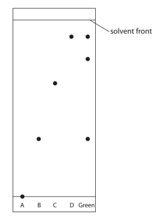

i) Explain what the chromatogram shows about the composition of the green food colouring.

(3)

ii) The distance between the start line and the spot for dye C is 6.2 cm. Calculate the *R*f value of dye C.

*R*f value = ..............................................................

(3)

iii) Suggest why dye A does not move.

(1)

## Q18 — medium — 13 marks · exam-questions

### 1() — 5 marks — command: multiple — structured
This question is about elements, compounds, and mixtures.

i) Table 1 shows nine substances, which are elements, compounds, or mixtures.

[3]

| brass | salt | crude oil |
|---|---|---|
| buckminsterfullerene | air | water |
| iodine | concrete | kerosene |

**Table 1**

Complete table 2 below using the words from table 1. Every word in table 1 must appear in one of the boxes in table 2.

| Element | Compound | Mixture |
|---|---|---|
|   |   |   |

**Table 2**

ii) Suggest, with a reason, which substance(s) in table 1 has/have a fixed melting and boiling point.

[2]

### 2() — 1 mark — multiple_choice
Which statement correctly describes the contents of the box?

- **A.** a mixture of elements
- **B.** a mixture of compounds
- **C.** a mixture of elements and compounds
- **D.** a compound

### 3() — 5 marks — command: multiple — structured
Fractional distillation is used to obtain many fractions from crude oil.

The diagram shows a fractionating column.

i) Complete the missing labels on the diagram.

[2]

ii) Explain how crude oil is separated using a fractionating column.

[4]

### 4() — 2 marks — command: determine — structured
An organic compound has the formula (CH3COO)2Ca

i) Determine the number of different elements in (CH3COO)2Ca.

[1]

ii) Determine the number of atoms in the formula of (CH3COO)2Ca.

[1]

## Q19 — hard — 14 marks · exam-questions

### 14((a)) — 1 mark — command: state — structured — from paper 2019 · Ju1C
A salt can be made by reacting an acid with an insoluble base.

A student has a sample of copper(Il) oxide.

The student uses this method.

- Stage 1 pour 50 cm3 of dilute sulfuric acid into a beaker
- Stage 2 warm the acid using a Bunsen burner
- Stage 3 add a small amount of copper(II) oxide to the warm acid and stir the mixture
- Stage 4 add further amounts of copper(II) oxide until copper(II) oxide is in excess
- Stage 5 filter the mixture
- Stage 6 obtain crystals from the filtrate

State why the acid is warmed in stage 2.

### 14((b)) — 1 mark — command: how — structured — from paper 2019 · Ju1C
State how the student would know that the copper(II) oxide is in excess in stage 4.

### 14((c)) — 1 mark — command: why — structured — from paper 2019 · Ju1C
State why the mixture is filtered in stage 5.

### 14((d)) — 1 mark — command: state — structured — from paper 2019 · Ju1C
State the colour of the filtrate obtained in stage 5.

### 14((e)) — 5 marks — command: describe — structured — from paper 2019 · Ju1C
Describe how the student could obtain a pure, dry sample of hydrated copper(II) sulfate crystals from the filtrate in stage 6.

### 14((f)) — 5 marks — command: multiple — structured — from paper 2019 · Ju1C
The overall equation for the formation of hydrated copper(ll) sulfate crystals from copper(II) oxide is

CuO (s) + H2SO4 (aq) + 4H2O (I) → CuSO4.5H2O (s)

i) In an experiment, a student completely reacts 9.54 g copper(II) oxide.

Show that the maximum possible mass of CuSO4.5H20 crystals that can be obtained is about 30 g.

[*M*r of CuO = 79.5   *M*r of CuSO4.5H2O = 249.5]

Give your answer to an appropriate number of significant figures.

(3)

mass = .............................. g

ii) In this experiment, the actual yield of CuSO4.5H2O crystals is 23.92 g.

Calculate the percentage yield of CuSO4.5H2O

(2)

## Q20 — hard — 13 marks · exam-questions

### 10((a)) — 2 marks — command: complete — structured — from paper 2020 · Nov1C
The table gives information about some lead compounds.

| **Compound** | **Formula** | **Appearance** | **Solubility in water** |
|---|---|---|---|
| lead(II) oxide | PbO | yellow solid | insoluble |
| lead(IV) oxide | PbO2 | brown solid | insoluble |
| red lead oxide | Pb3O4 | red solid | insoluble |
| lead(II) nitrate | Pb(NO3)2 | white solid | soluble |

When a sample of red lead oxide is heated, it changes into a yellow solid and a gas forms that relights a glowing splint.

Complete the word equation for this reaction.

red lead oxide → ........................................ + ........................................

### 10((b)) — 3 marks — command: show — structured — from paper 2020 · Nov1C
A sample of one of the oxides of lead contains 86.6% lead and 13.4% oxygen by mass.

Show by calculation that the sample is lead(IV) oxide, PbO2

[*A*r of Pb = 207   *A*r of O = 16]

### 10((c)) — 8 marks — command: multiple — structured — from paper 2020 · Nov1C
Red lead oxide reacts with warm dilute nitric acid.

i) Complete the chemical equation for the reaction.

Pb3O4 (..........) + 4HNO3 (..........) → ..........Pb(NO3)2 (aq) + PbO2 (s) + ..........H2O (l)

(2)

ii) A student is given a sample of solid red lead oxide and some dilute nitric acid.

Describe how the student could obtain a pure dry sample of lead(II) nitrate crystals.

(6)

## Q21 — hard — 10 marks · exam-questions

### 5((a)) — 4 marks — command: complete — structured — from paper 2021 · Ja1C
This question is about the separation of mixtures.

The box gives some methods used to separate mixtures.

| crystallisation | filtration | fractional distillation | simple distillation |
|---|---|---|---|

Complete the table by giving the correct method from the box for each separation. Each method can be used once, more than once or not at all.

| **Separation** | **Method** |
|---|---|
| insoluble solid from a liquid |   |
| pure water from a solution |   |
| liquid from a mixture of liquids with different boiling points |   |
| soluble solid from a solution |   |

### 5((b)) — 4 marks — command: explain — structured — from paper 2021 · Ja1C
A student uses chromatography to analyse the composition of purple ink. The diagram shows the student’s chromatogram at the end of the experiment.

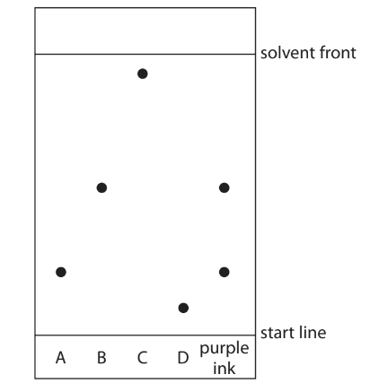

i) Explain which dyes are contained in the purple ink.

(2)

ii) Explain which dye is least soluble in the solvent.

(2)

### 5((c)) — 2 marks — command: calculate — structured — from paper 2021 · Ja1C
A different chromatography experiment is set up.

A spot of food colouring is placed on the start line.

A food dye in the colouring has an Rf value of 0.72

The distance between the start line and the solvent front is 120 mm.

Calculate the distance the food dye moves from the start line.

distance = .............................................................. mm

## Q22 — hard — 8 marks · exam-questions

### 7((a)) — 1 mark — multiple_choice — from paper 2022 · Jan1C
This question is about soluble and insoluble compounds.

A precipitate is an insoluble compound formed when solutions of soluble compounds react after mixing.

Different solutions are mixed in separate test tubes.

- Tube 1 copper(II) sulfate solution and calcium chloride solution
- Tube 2 magnesium nitrate solution and potassium sulfate solution
- Tube 3 sodium carbonate solution and copper(II) sulfate solution

In which of the tubes will a precipitate form?
- **A.** 1 and 2 only
- **B.** 2 and 3 only
- **C.** 1 and 3 only
- **D.** 1, 2 and 3

### 7((b)) — 7 marks — command: multiple — structured — from paper 2022 · Jan1C
A student mixes solutions, containing equal amounts in moles, of silver nitrate and sodium chloride.

The equation for the reaction between silver nitrate solution and sodium chloride solution is

AgNO3 (aq) + NaCl (aq) → AgCl (s) + NaNO3 (aq)

i) State the colour of the precipitate of silver chloride.

(1)

ii) The student wants to obtain pure, dry crystals of sodium nitrate.

Crystals of sodium nitrate decompose at temperatures above 300 °C.

Describe a method the student could use to obtain pure, dry crystals of sodium nitrate.

(5)

iii) Give an advantage of mixing solutions containing equal amounts, in moles, of silver nitrate and sodium chloride

(1)

## Q23 — hard — 15 marks · exam-questions

### 3((a)) — 4 marks — command: describe — structured — from paper 2019 · Ju1CR
A student uses paper chromatography to investigate the dyes in five different inks, V, W, X, Y and Z.

This is what she uses.

- a beaker
- a piece of chromatography paper with a pencil line drawn near the bottom of the paper
- a solvent
- inks V, W, X, Y and Z

Describe how the student should set up and carry out her experiment.

You may draw a diagram to help with your answer.

### 3((b)) — 2 marks — command: explain — structured — from paper 2019 · Ju1CR
Explain why the line on the paper is drawn in pencil rather than in ink.

### 3((c)) — 6 marks — command: explain — structured — from paper 2019 · Ju1CR
The chromatogram shows the results for inks V, W, X, Y and Z.

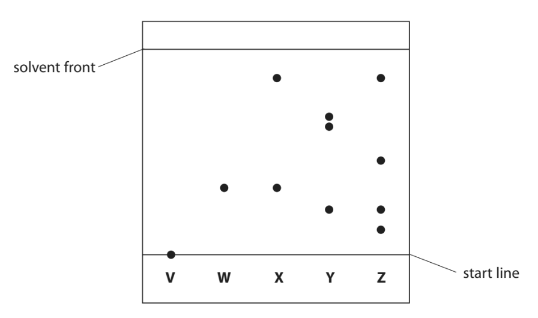

i) Explain which ink contains a dye that is insoluble in the solvent.

(2)

ii) Explain which two inks contain the dye that is likely to be the most soluble in the solvent.

(2)

iii) Explain which two inks may contain only one dye.

(2)

### 3((d)) — 3 marks — command: calculate — structured — from paper 2019 · Ju1CR
One dye in ink Y moves 4.3 cm when the solvent front moves 6.5 cm. Calculate the *R*f value for this dye. Give your answer to 2 significant figures.

## Q24 — hard — 8 marks · exam-questions

### 1() — 2 marks — command: multiple — structured
This question is about the solubility of salts.

The table shows how the solubility of a salt in water varies at six different temperatures.

| Temperature/ oC | Solubility in g/100g water |
|---|---|
| 0 | 17 |
| 20 | 29 |
| 30 | 36 |
| 40 | 44 |
| 50 | 54 |
| 80 | 97 |

i) Plot the points on the grid provided

[1]

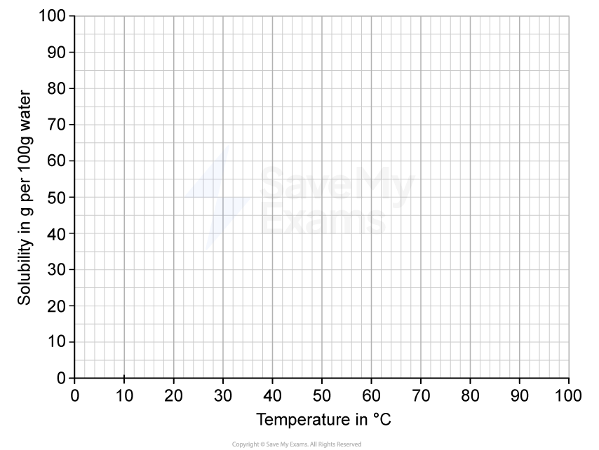

ii) Draw the curve of best fit

[1]

### 2() — 2 marks — command: indicate — structured
A saturated solution of the salt in 100 g of water is cooled from 60°C to 10°C.

Using your graph, find the mass of salt that crystallises out as the solution cools.

Indicate your working clearly on the graph.

### 3() — 3 marks — command: identify — structured
When solutions of lead nitrate and potassium sulfate are mixed, one product is solid lead sulfate.

This is the equation for the reaction.

Pb(NO3)2 (aq) + K2SO4 (aq) → PbSO4 (s) + 2KNO3 (aq)

Identify, at the end of the reaction,

the solute: ............................................

the solvent: ..........................................

the solution: ........................................

### 4() — 1 mark — multiple_choice
Which pair of solutions produces an insoluble salt when mixed?
- **A.** sodium chloride and potassium chloride
- **B.** sodium carbonate and calcium nitrate
- **C.** sodium chloride and ammonium sulfate
- **D.** potassium hydroxide and sodium sulfate
