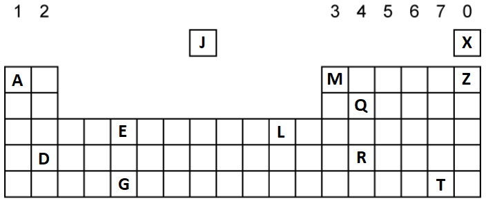
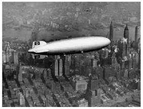
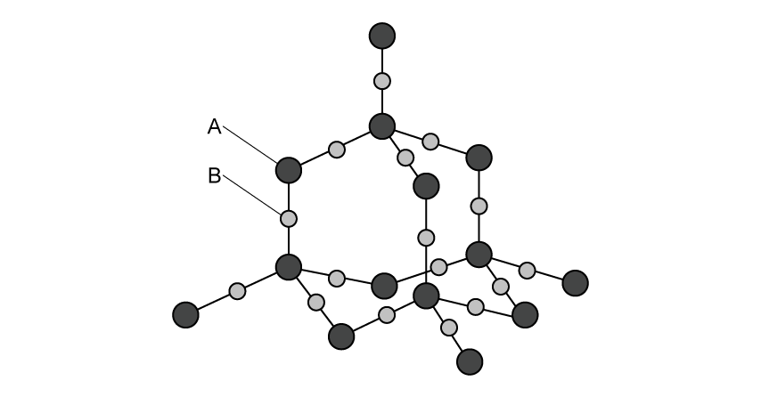

# Exam Questions — The Periodic Table
**1. Principles of Chemistry: Part 1** · Edexcel IGCSE Chemistry (Modular) (4XCH1) — 24/Unit 1
> Source: [https://www.savemyexams.com/igcse/chemistry/edexcel/modular/24/unit-1/topic-questions/principles-of-chemistry/periodic-table/exam-questions/](https://www.savemyexams.com/igcse/chemistry/edexcel/modular/24/unit-1/topic-questions/principles-of-chemistry/periodic-table/exam-questions/) · 16 questions · total 85 marks

## Q1 — easy — 7 marks · exam-questions

### 1((a)) — 5 marks — command: multiple — structured — from paper 2020 · Nov1C
This question is about chemical elements.

Use the Periodic Table to help you answer this question.

i) Identify the element with atomic number 5

(1)

ii) Give the symbol of a metallic element in Period 3

(1)

iii) Identify the element whose atoms contain 14 protons.

(1)

iv) Identify the element whose atoms have the electronic configuration 2.5

(1)

v) Give the name of the compound formed between oxygen and the element with atomic number 13

(1)

### 1((b)) — 2 marks — command: which — structured — from paper 2020 · Nov1C
The position of an element in the Periodic Table can be used to predict its properties.

i) Which group contains elements that are all unreactive?

(1)

| ☐ | **A** | Group 2 |
|---|---|---|
| ☐ | **B** | Group 5 |
| ☐ | **C** | Group 6 |
| ☐ | **D** | Group 0 |

ii) Which of these is the least reactive element in Group 1?

(1)

| ☐ | **A** | caesium |
|---|---|---|
| ☐ | **B** | lithium |
| ☐ | **C** | potassium |
| ☐ | **D** | sodium |

## Q2 — easy — 7 marks · exam-questions

### 1((a)) — 5 marks — command: complete — structured — from paper 2021 · Ju1C
The box shows the names of some substances.

| bromine | carbon dioxide | copper | iodine |
|---|---|---|---|
| methane | nitrogen | sulfur dioxide | water |

Complete the table by choosing substances from the box that match the description.

Each substance may be used once, more than once or not at all.

| **Description** | **Substance** |
|---|---|
| a good conductor of electricity |   |
| an element that has a basic oxide |   |
| a substance used as a fuel |   |
| a major cause of acid rain |   |
| a non‐metallic element that is a solid at room temperature |   |

### 1((b)) — 2 marks — command: describe — structured — from paper 2021 · Ju1C
Describe a test for carbon dioxide.

## Q3 — easy — 5 marks · exam-questions

### 2((a)) — 4 marks — command: give — structured — from paper 2020 · Nov1CR
The diagram shows the positions of some elements in the Periodic Table.

Use symbols from this table to answer these questions.

Each symbol may be used once, more than once or not at all.

i) Give the symbol of a metal.

(1)

ii) Give the symbol of a noble gas.

(1)

iii) Give the symbol of a liquid at room temperature.

(1)

iv) Give the symbols of the two elements in Period 3

(1)

......................................... and .........................................

### 2((b)) — 1 mark — command: deduce — structured — from paper 2020 · Nov1CR
Deduce the electronic configuration of Na.

## Q4 — easy — 9 marks · exam-questions

### 1() — 2 marks — command: give — structured
The diagram shows part of the Periodic Table, with elements represented by the letters L, M, Q, R and T.

The letters in the diagram represent elements but are not their chemical symbols.

i) Give the letter from the diagram that represents an element in period 3.

(1)

ii) Give two letters from the diagram that represent elements that are in the same group

(1)

### 2() — 2 marks — command: multiple — structured
Use the diagram in part a) to answer this question.

i) Give the letter from the diagram that represents the element with 5 protons.

(1)

ii) State the electronic configuration of the element with 5 protons.

(1)

### 3() — 3 marks — command: multiple — structured
An element on the Periodic Table has the electronic configuration 2.8.6.

i) State the number of the period to which this element belongs.

(1)

ii) State the number of the group to which this element belongs.

(1)

iii) Give the name of the element with the electronic configuration 2.8.6.

(1)

### 4() — 2 marks — command: multiple — structured
i) Name of the element with the electronic configuration 2.8.1.

(1)

ii) State whether the element in part i) is a metal or a non-metal.

(1)

## Q5 — easy — 8 marks · exam-questions

### 1() — 1 mark — command: what — structured
Mendeleev arranged the elements in the Periodic Table so that elements with similar properties fell into the same vertical columns. The physical property that he used was the atomic mass of the element and the chemical property was the behaviour of the oxide and hydride formed.

What term is used to describe the vertical columns of the Periodic Table?

### 2() — 3 marks — command: multiple — structured
The Group 1 elements are often called the alkali metals because of their reaction with water to form metal hydroxides and hydrogen.

i) Name two alkali metals.

(1)

ii) Name the element that is in Group 1 but cannot be classed as an alkali metal.

(1)

iii) State one observation when an alkali metal reacts with water.

(1)

### 3() — 3 marks — command: state — structured
State the trends, if any, in the reactivity of elements in Groups 1, 7 and 0.

### 4() — 1 mark — command: complete — structured
Argon is a Group 0 element that is found in Period 3 of the Periodic Table.

Complete the diagram to show the electronic configuration of argon.

## Q6 — medium — 1 marks · exam-questions

### 1() — 1 mark — multiple_choice
What is the electronic configuration of silicon?

- **A.** 2,4
- **B.** 2,2,4
- **C.** 2,2,8
- **D.** 2,8,4

## Q7 — medium — 1 marks · exam-questions

### 1() — 1 mark — multiple_choice
Which diagram shows the electronic configuration of a nitrogen atom?
- **A.** 
- **B.** 
- **C.** 
- **D.** 

## Q8 — medium — 1 marks · exam-questions

### 1() — 1 mark — multiple_choice
The diagram shows part of the periodic table, with elements represented by the letters M, Q, R and T. The letters in the diagram represent elements but are not their chemical symbols.

Use the Periodic Table to help you answer this question.

Which of these statements is true?
- **A.** T and Q form acidic oxides
- **B.** M conducts electricity
- **C.** M is a non-metal element
- **D.** R is a gaseous non-metal element

## Q9 — medium — 6 marks · exam-questions

### 1((a)) — 3 marks — command: name — structured — from paper 2021 · Jun2C
Use the Periodic Table to help you answer this question.

i) Name the element with atomic number 14

(1)

ii) Name the element with a relative atomic mass of 11

(1)

iii) Name the element in Group 2 and Period 3

(1)

### 1((b)) — 3 marks — command: multiple — structured — from paper 2021 · Jun2C
i) Determine the number of neutrons in a phosphorus atom with mass number 31

(1)

ii) State the electronic configuration of an aluminium atom.

(1)

iii) State why neon is unreactive.

(1)

## Q10 — medium — 1 marks · exam-questions

### 1() — 1 mark — multiple_choice
The following elements are found in group 0 of the periodic table.

**He   Ne   Ar   Kr   Xe   Rn**

What explains their similar chemical and physical properties?
- **A.** They have the same number of valence electrons
- **B.** They are all gases
- **C.** They have the same number of protons and electrons
- **D.** They have full outer shells

## Q11 — medium — 1 marks · exam-questions

### 1() — 1 mark — multiple_choice
Which element, T, Q, R, or M has the electronic configuration 2,8,3?

- **A.** element M
- **B.** element Q
- **C.** element T
- **D.** element R

## Q12 — hard — 4 marks · exam-questions

### 2((a)) — 1 mark — command: give — structured — from paper 2019 · Ju1C
The diagram shows part of the Periodic Table, with elements represented by the letters L, M, Q, R and T.

The letters in the diagram represent elements but are not their chemical symbols.

Give the letter from the diagram that represents a noble gas.

### 2((b)) — 1 mark — command: state — structured — from paper 2019 · Ju1C
Elements L and M are in the same group.

State why they have similar chemical reactions.

### 2((c)) — 2 marks — command: apply — structured — from paper 2019 · Ju1C
An atom of element Q has 31 protons.

Use this information to explain how you can determine the number of protons in an atom of element R.

## Q13 — hard — 5 marks · exam-questions

### 5((a)) — 1 mark — multiple_choice — from paper 2019 · Ju1C
In 1937, an airship full of hydrogen gas flew from Germany to America.

(Source: © Michael Rosskothen/Shutterstock)

Which property of hydrogen makes it a suitable gas to use in an airship?
- **A.** colourless
- **B.** insoluble in water
- **C.** low density
- **D.** no smell

### 5((b)) — 2 marks — command: explain — structured — from paper 2019 · Ju1C
Explain why helium is now used in airships instead of hydrogen.

### 5((c)) — 2 marks — command: multiple — structured — from paper 2019 · Ju1C
Hydrogen is used to manufacture ammonia, NH3

Hydrogen is reacted with nitrogen using an iron catalyst.

i) Give a chemical equation for this reaction.

(1)

ii) State why a catalyst is used in this reaction.

(1)

## Q14 — hard — 10 marks · exam-questions

### 1() — 2 marks — command: give — structured
Mendeleev's Periodic Table was published in 1869, classifying the elements that had been discovered at that time by their atomic weights. Part of his Periodic Table is shown.

Use the information in this table and the Periodic Table to answer the questions.

| **Group 1** | **Group 2** | **Group 3** | **Group 4** | **Group 5** | **Group 6** | **Group 7** |
|---|---|---|---|---|---|---|
| H |   |   |   |   |   |   |
| Li | Be | B | C | N | O | F |
| Na | Mg | Al | Si | P | S | Cl |

Hydrogen is an element from Mendeleev's table that is not in the same group of the modern Periodic Table.

Give **two **reasons why it should not be in Group 1.

### 2() — 2 marks — command: give — structured
Give two reasons why hydrogen could be placed in Group 1.

### 3() — 2 marks — command: why — structured
Give two reasons why hydrogen could be placed in Group 7.

### 4() — 4 marks — command: how — structured
The modern Periodic Table arranges the elements in order of atomic number.

What scientific discoveries allowed elements to be placed in their correct period and group?

How did this knowledge allow elements to be correctly placed?

## Q15 — hard — 8 marks · exam-questions

### 1() — 2 marks — command: state — structured
The table shows the electronic structures of five elements represented by letters,** **not the chemical symbols of the element.

| **Element** | **Electronic structure** |
|---|---|
| **J** | 2,8,8 |
| **K** | 2,8,1 |
| **L** | 2,8,8,1 |
| **M** | 2,7 |
| **N** | 2,8,4 |

Give the letters of two elements that belong to the same group in the Periodic Table and state the group that they belong to.

### 2() — 2 marks — command: multiple — structured
One of the elements can form the giant covalent structure shown.

i) Give the letter of the element that is represented by the atom labelled A.

(1)

ii) State how the diagram shows that the atom labelled B is oxygen.

(1)

### 3() — 3 marks — command: explain — structured
Give the letter of the element that is monatomic.

Explain your answer.

### 4() — 1 mark — command: give — structured
Give the letters of two elements that are gases at room temperature.

## Q16 — hard — 11 marks · exam-questions

### 1() — 2 marks — command: identify — structured
This question is about chemical elements.

Use the Periodic Table to help you answer this question.

i) Identify the element whose atoms contain 10 neutrons and 9 protons.

(1)

ii) Identify the element whose atoms have the electronic configuration 2.8.5

(1)

### 2() — 1 mark — command: give — structured
Give the name of the compound formed between the element with an electronic configuration of 2.8.6 and the non-metallic element in Group 3.

### 3() — 5 marks — command: multiple — structured
A white solid is formed from the reaction between the element with an atomic number of 7 and the element with an electronic configuration of 2.8.3

i) State the type of bonding present in the white solid.

(1)

ii) Describe the changes that occur to the atoms of both elements as they react to form the white .

(3)

iii) Give the chemical formula of the white solid.

(1)

### 4() — 3 marks — command: multiple — structured
The Group 6 element whose oxides are linked to acid rain can react with the element whose electronic configuration is 2.7 to form different compounds.

i) Draw a dot-and-cross diagram to show the bonding in a molecule of the compound formed with a relative molecular mass (*M*r) of 70.

(2)

ii) An alternative product with a relative molecular mass (*M*r) of 146 is formed under different conditions. Suggest the molecular formula of this product.

(1)
