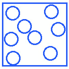
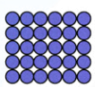
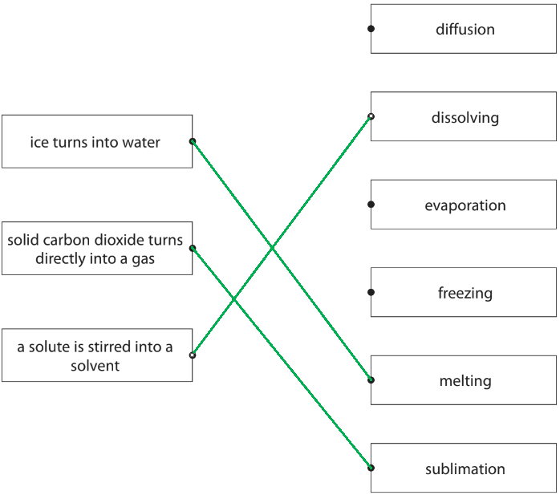
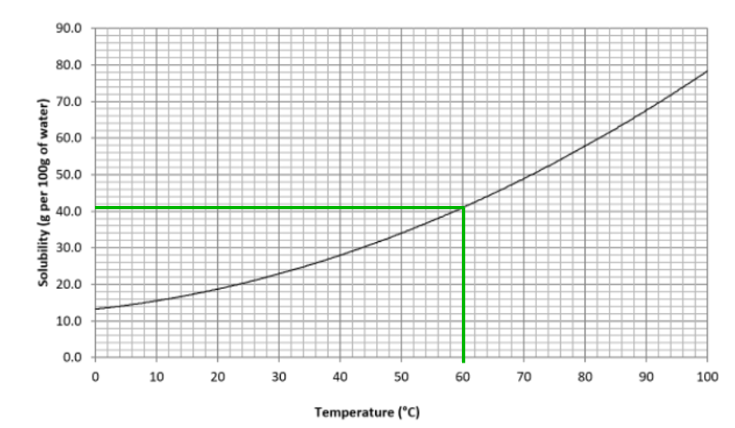
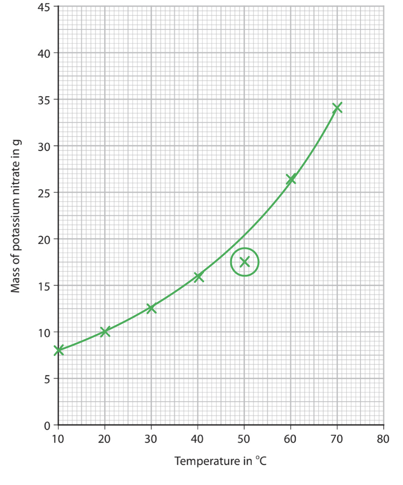
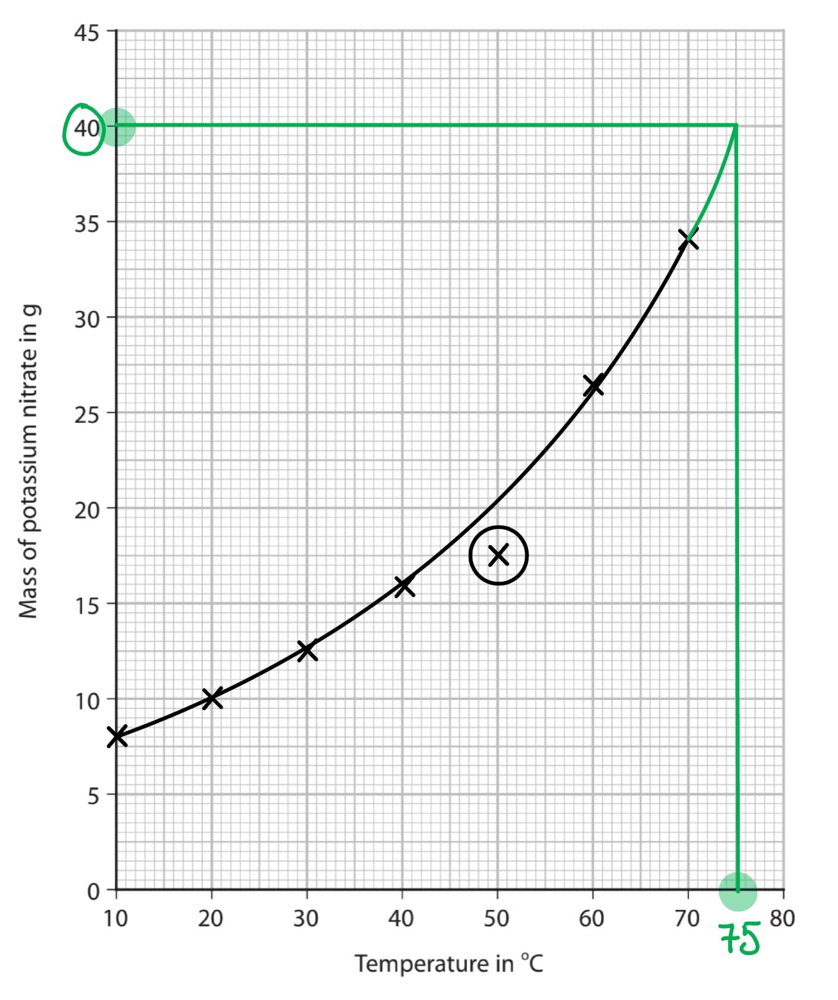
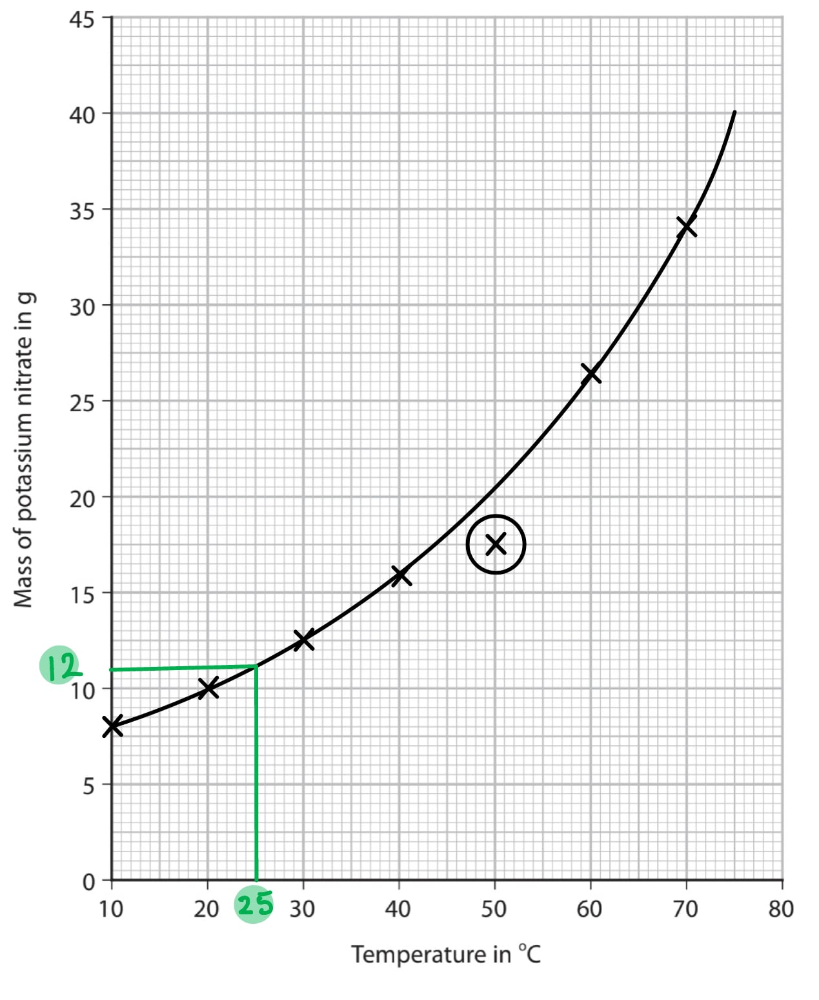
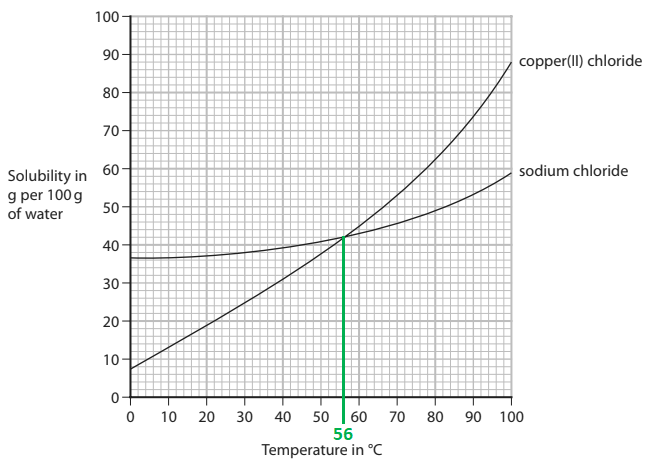

# Mark Schemes — States of matter
**1. Principles of Chemistry: Part 1** · Edexcel IGCSE Chemistry (Modular) (4XCH1) — 24/Unit 1

## Q1 — easy — 7 marks · exam-questions

### 2((a)) — 2 marks
i) The completed diagram should show:

- Particles should be close together **AND **Particles should fill from the bottom of the box **AND **Some particles should be touching; **[1 mark]**

ii) The state of matter where the particles have the most energy is:

- Gas / gaseous; **[1 mark]**

**[Total: 2 marks]**

- *You will lose the mark in part (i) if there is a regular arrangement / pattern to your diagram*
- *The liquid particle diagram is the one that is most commonly drawn incorrectly*

  - *In a liquid particles are still close together and mostly touching*
  - *But there is an irregular arrangement that allows particles to 'roll past' each other if you are imagining them as spheres*
- *Try to draw particles of a similar size to those in the other boxes or larger; don't make your life hard by drawing tiny particles*

### 2((b)) — 3 marks
The completed table should include:

Water evaporates:

- Before change = (l) / l / liquid 
**AND **
After change = (g) / g / gas; **[1 mark]**

Crystals of iodine sublime:

- Before change = (s) / s / solid 
**AND **
After change = (g) / g / gas; **[1 mark]**

Ice melts:

- Before change = (s) / s / solid 
**AND **
After change = (l) / l / liquid; **[1 mark]**

**[Total: 3 marks]**

- *You must ensure you know key terms for changes of state and be able to apply them to both familiar and unfamiliar contexts*

### 2((c)) — 2 marks
Hot water evaporates more quickly than cold water as:

- (Particles / molecules / water have) more energy / move faster; **[1 mark]**
- To overcome / break the forces / bonds (between water molecules) **OR** To break away from one another **OR** So, escape more easily; **[1 mark]**

**[Total: 2 marks]**

- *References to collisions or activation energy in your answer will be ignored*
- *If in doubt when explaining changes of state, refer to energy changes involved*

## Q2 — easy — 6 marks · exam-questions

### 3((a)) — 3 marks
i) The process that occurs which causes the sugar to spread throughout the water is:

- Diffusion; **[1 mark]**

ii) Two ways to make the sugar dissolve more quickly are:

Any **two** of the following:

- Stir / shake / swirl (the mixture); **[1 mark]**
- Heat (the mixture)
 **OR**
** **A description of heating; **[1 mark]**
- Grind the sugar (into a powder)
 **OR**
** **Break the sugar into smaller pieces 
**OR **
Increase the surface area of the sugar; **[1 mark]**

**[Total: 3 marks]**

- *When the sugar is added to the cold water it will form an area of high concentration*

  - *Once it has dissolved it will move from an area of high concentration to an area of low concentration *
  - *The dissolved sugar will continue this until it is evenly spread throughout the water*
- *You can think of a cup of tea for part (ii) as you heat the water and stir the tea to make the sugar spread evenly throughout the cup of tea*

  - *Also, granulated sugar dissolves quicker than sugar cubes / lumps because it has a greater surface area*

### 3((b)) — 3 marks
i) The process used to obtain pure water from the sugar solution is:

- Distilling / (simple) distillation; **[1 mark]**

ii) The purpose of the piece of apparatus labelled X is to:

- Water / water vapour / steam / gas is cooled; **[1 mark]**
- And condenses 
**OR **
In the condenser; **[1 mark]**

**[Total: 3 marks]**

- *Separating soluble liquids from a mixture / solution by boiling points is distillation*

  - *This process cannot be fractional distillation as that is used for a complex mixture rather than a simple one like sugar solution*
  - *Therefore, fractional distillation is not accepted as an answer*
- *You should know that the piece of equipment labelled X is a condenser*

  - *As the name suggests, this will condense gases back to liquids*

## Q3 — easy — 6 marks · exam-questions

### 2((a)) — 2 marks
i) Solute means:

- The substance/solid that dissolves/dissolved (in a solvent); **[1 mark]**

ii) Solvent means:

- The substance/liquid that the solute solid dissolves in; **[1 mark]**

**[Total: 2 marks]**

- *Although these terms are more commonly used in questions, it is useful to know their definitions*
- *This is in case the examiner decides to check that you correctly understand the underpinning definitions, like this question*

### 2((b)) — 2 marks
A saturated solution is:

- A solution that contains as much dissolved solute / solid / substance as possible; **[1 mark]**
- At a given / particular temperature; **[1 mark]**

**[Total: 2 marks]**

- *Questions about saturated solutions will tend to be based on practical experiments and commonly focus on crystallisation*
- *You do, however, need to know this definition*

### 2((c)) — 2 marks
The process that causes this change is:

- Diffusion; **[1 mark]**
- (This is where) particles move from an area of high concentration to an area of low concentration 
**OR **
(This is where) the particles spread out (evenly through the water / solution / liquid); **[1 mark]**

**[Total: 2 marks]**

- *Careful: **This question is asking about the colour moving throughout the liquid*

  - *There is no change in the concentration, so the process involved in this question cannot be dilution *
- *The most common answer to this question was the higher-level comment about moving from an area of high concentration to an area of low concentration*

## Q4 — easy — 1 marks · exam-questions

### 1() — 1 marks
**Correct answer: B** — condensation

**Final answer:** **The correct answer is ****B**** **

- The water vapour changes to liquid water the change is called Condensation
- Water vapour is a gas and changes into liquid water
- The change of state from gas to liquid is called condensation

## Q5 — easy — 1 marks · exam-questions

### 1() — 1 marks
**Correct answer: A** — The perfume particles diffuse into the air

**The correct answer is ****A**

- The statement which explains these observations is: The perfume particles diffuse into the air
- When the perfume is sprayed the particles are in the gaseous state
- The gas particles move freely and randomly in all directions
- This is called diffusion

## Q6 — easy — 1 marks · exam-questions

### 1() — 1 marks
**Correct answer: A** — Potassium permanganate solution is formed

**Final answer:** **The correct answer is A**

- The statement which is correct is: Potassium permanganate solution is formed
- **A** is the correct answer because the potassium permanganate forms a purple-coloured solution, so the crystal has dissolved in the water
- **B**, **C** and **D **are incorrect because:

  - **B** - water is the solvent, not the solute
  - **C** - you can't tell if the solution is saturated as it may not have finished dissolving
  - **D** - subliming refers to the change of state from a solid to a gas

## Q7 — easy — 5 marks · exam-questions

### 1((a)) — 2 marks
i) When a substance melts the change is:

- Solid to liquid; **[1 mark] **

ii) The word equation for the sublimation of iodine is:

- Iodine (s) → Iodine (g); **[1 mark] **

**[Total: 2 marks] **

- *You should be able to link the following processes to the correct changes of state*

  - *Melting** is when a solid changes into a liquid*
  - *Boiling** is when a liquid changes into a gas*
  - *Freezing** is when a liquid changes into a solid*
  - *Evaporation **is when a liquid changes into a gas*
  - *Condensation** is when a gas changes into a liquid, usually on cooling*
  - *Sublimation** is when a solid changes directly into a gas*

### 1((b)) — 1 marks
The diagram for particles in a gas should be:

- Diagram showing particles well spread out with none touching; **[1 mark]**

**[Total: 1 mark] **

- *Your diagram could look like this:*

- *The particles in a gas should not be touching and be in a random arrangement*

### 1((c)) — 2 marks
The completed table is:

| **Statement** | **Tick** |
|---|---|
| the particles only vibrate |   |
| the particles do not move |   |
| the particles have no gaps between them |   |
| the particles move randomly | **✓**; **[1 mark]** |
| the particles have more energy than in ice | **✓**; **[1 mark] ** |
| the particles have a regular arrangement |   |

**[Total: 2 marks] **

- *Water is a liquid so the particles will be:*

  - *Randomly arranged*
  - *Moving around each other*
  - *Close together*

## Q8 — easy — 1 marks · exam-questions

### 1() — 1 marks
**Correct answer: C** — Boiling

**Final answer:** **The correct answer is C**

- The change of state that occurs at Y is Boiling.
- **C** is the correct answer because boiling is the change of state which occurs when a liquid changes into a gas
- **A**, **B** and **D** are incorrect as:

  - **A** - melting occurs when a solid turns into a liquid
  - **B** - freezing occurs when a liquid turns into a solid
  - **D **- condensation occurs when a gas turns into a liquid

## Q9 — easy — 1 marks · exam-questions

### 1() — 1 marks
**Correct answer: C** — In the liquid the particles move randomly

**Final answer:** **The correct answer is C**

- The correct statement about the movement or arrangement of the particles is  In the liquid the particles move randomly.
- **C** is the correct answer because

  - In the liquid state, the particles are arranged randomly and are close together
  - They move around each other

## Q10 — easy — 6 marks · exam-questions

### 1() — 4 marks
The completed table is:

| Description | Substance |
|---|---|
| the state of ammonia at room temperature | **gas** **[1]** |
| when particles gain the most kinetic energy at constant temperature | **boiling point** **[1]** |
| particles break away from their fixed arrangement | **melting** **[1]** |
| when kerosene is formed from crude oil | **condensing** **[1]** |

> **[exam-tip]**
> Particles gain kinetic energy when the temperature increases or they change state. If the temperature is constant, the particles only gain energy by changing state, which occurs at the melting point and boiling point. Since the question refers to the most kinetic energy, the answer must be the boiling point.
> 
> The only state where particles are in a fixed arrangement is a solid, so breaking away from the arrangement occurs during melting.
> 
> Kerosene is one of the products of the fractional distillation of crude oil. To form the fractions, the hot vapours have to condense to liquids.

### 2() — 2 marks
> **[mark-scheme]**
> The test for ammonia is:
> 
> - Test with (damp) red litmus paper **[1 mark]**
> - (The litmus paper) turns blue** [1 mark]**
> 
> Allow universal indicator paper turns blue.
> 
> The colour of the litmus paper must be specified.

> **[exam-tip]**
> If an item appears in brackets, it means it is not needed to gain the mark. However, it can make your answers clearer to an examiner if you include those details.

## Q11 — medium — 6 marks · exam-questions

### 1((a)) — 3 marks
i) The change from solid to liquid is called:

- Melting; **[1 mark]**

ii) The change from liquid to gas is called:

- Evaporation; **[1 mark]**

iii) The change from solid to gas is called:

- Sublimation; **[1 mark]**

**[Total: 3 marks]**

- *You need to know all of the terms which are used to describe the interconversions between the states*

### 1((b)) — 3 marks
The arrangement and the movement of particles in a solid can be described by:

Any **three **from:

- (The particles are) close together / tightly packed / touching; **[1 mark]**
- (The particles are) regularly arranged / in a lattice; **[1 mark]**
- (The particles) do not move around / freely; **[1 mark]**
- (The particles) vibrate (about a fixed position); **[1 mark]**

**[Total: 3 marks]**

- *References to a fixed shape and / or volume in your answer will be ignored*
- *The arrangement and movement of particles in the three states of matter is a common question, either asking you to describe their arrangement and movement of the particles, as in this question*
- *You can also be asked to compare the arrangement and movement of the particles; this is when you need to explain the similarities and differences in how the particles are arranged and how they move*
- *A suitable diagram that would gain the first two marking points is:*

## Q12 — medium — 9 marks · exam-questions

### 4((a)) — 1 marks
The formula of an ammonium ion is:

- NH4+ / NH4+1 / NH41+; **[1 mark]**

**[Total: 1 mark]**

- *You need to recall common ions like this and it is important to write the charge superscript*
- *As the charge is a single positive charge the 1 is not needed, but you will not be penalised for including it*

### 4((b)) — 3 marks
A test for ammonium ions is:

- Add sodium hydroxide solution (and warm);** [1 mark]**

Method 1:

- (Test the gas with damp) red litmus; **[1 mark]**
- Turns blue; **[1 mark]**

**OR**

- (Test the gas with damp) Universal indicator; **[1 mark]**
- Turns blue / purple; **[1 mark]**

**OR**

Method 2:

- Expose the gas to concentrated hydrochloric acid; **[1 mark]**
- White smoke produced; **[1 mark]**

**[Total: 3 marks]**

- *Adding sodium hydroxide solution results in the production of ammonia gas*

  - *If sodium hydroxide solution is not added then a maximum of 1 mark can be awarded*
- *This can be tested by either method; the gas will change the colour of damp litmus paper as it is an alkaline gas or react with concentrated HCl to make a white 'smoke' of ammonium chloride (as the formed crystals of the salt are tiny and are suspended in the air when formed in this way*

### 4((c)) — 1 marks
The symbol means that:

- (The reaction is) reversible / goes both ways / both forwards and backwards reactions occur; **[1 mark]**

**[Total: 1 mark]**

- *References to equilibrium are ignored in your answer*
- *This is a symbol you must recognise and be able to explain the meaning of*

### 4((d)) — 4 marks
i) The differences in the mean speed of ammonia and hydrochloric acid are:

- (Molecules / particles of) ammonia move / diffuse faster; **[1 mark]**

Plus any **one** of the following

- Because the ammonium chloride forms near(er) to the HCl;** [1 mark]**
- Because the ammonia has travelled further (in the same time);** [1 mark]**

ii) It takes several minutes for ammonium chloride to form because:

Any **one **of the following pairs:

Pair 1:

- (Gas particles) move in random directions / don’t travel in straight lines; **[1 mark]**
- (Gas particles) collide with air / other particles; **[1 mark]**

Pair 2:

- Air / other particles slow them down; **[1 mark]**
- (Gas particles) collide with the walls / sides (of the tube); **[1 mark]**
*Allow air / other particles slow them down*

**[Total: 4 marks]**

- *The question is asking about the evidence from the diagram provided; so the masses are not needed, just the observation that the smoke ring does not form in the middle, but closer to the hydrogen chloride/HCl*

  - *The speed of a gas relative to its mass is not on the specification so this question is about deducing from observation rather than recall*
- *You should know from earlier studies that many gas particles are present in the air and that these would act as a complex obstacle course for the reacting particles*

## Q13 — medium — 6 marks · exam-questions

### 2((a)) — 3 marks
The correct pairs are:

- Ice turns to water = melting; **[1 mark]**
- Solid carbon dioxide turns directly into a gas = sublimation; **[1 mark]**
- A solute is stirred into a solvent = dissolving; **[1 mark]**

**[Total: 3 marks]**

- *For these match-up questions, if more than one line comes from the box on the left then the mark for that box cannot be awarded*
- *Ice turning into water is a solid changing into a liquid, which is melting*
- *Solid carbon dioxide turning directly into a gas is sublimation*
- *The solute being stirred into a solvent is, arguably, the trickiest of the three*

  - *It could only be diffusion or dissolving as all the other options are changes of state*
  - *Diffusion is moving from an area of high concentration to an area of low concentration, which is not happening*
  - *This leaves dissolving as the only option*
  
    - *You could use the SOLV of solvent as a guide*

### 2((b)) — 3 marks
The student could identify which solid is pure and which is a mixture by:

- Measuring the melting / boiling point; **[1 mark]**
- The melting / boiling point is fixed / sharp if the substance is pure **OR **The melting / boiling point is a narrow / tight range if the substance is pure; **[1 mark]**
- The melting / boiling point is broad if the substance is not pure **OR **The melting / boiling point is a broad / wide range if the substance is not pure; **[1 mark]**

**[Total: 3 marks]**

- *The purity of a solid is tested by measuring the melting point*

  - *A narrow / tight temperature range for the melting point indicates that it is pure*
  - *A  broad / wide temperature range for the melting point indicates that it is not pure *
- *The purity of a liquid is tested by measuring the boiling point*

  - *A narrow / tight temperature range for the boiling point indicates that it is pure*
  - *A  broad / wide temperature range for the boiling point indicates that it is not pure*

## Q14 — medium — 6 marks · exam-questions

### 1((a)) — 3 marks
The correct states for each of the changes are:

| **Change** | **Initial state** | **Final state** |
|---|---|---|
| melting | solid | liquid |
| sublimation | **solid** | **gas** |
| condensing | **gas** | **liquid** |
| evaporation | **liquid** | **gas** |

- Award 1 mark for each correct row; **[3 marks]**

**[Total: 3 marks]**

- *You could also be asked to give the name of the physical change between two given states*

### 1((b)) — 3 marks
A description of the arrangement and movement of the particles in a gas is:

Any **three** from:

- Irregular / random arrangement (of particles); **[1 mark]**
- Large gaps between them / far apart / widely spaced; **[1 mark]**
- Random movement / move freely; **[1 mark]**
- Move (very) quickly; **[1 mark]**

**[Total: 3 marks]**

- *Make sure you can describe the arrangement and movement of particles in solids, liquids and gases*
- *You may be asked to compare the arrangement and movement of particles between different states where you would need to give similarities and differences between the states in question*

## Q15 — medium — 7 marks · exam-questions

### 3((a)) — 3 marks
The completed table is:

| **Change of state** | **Name of change** |
|---|---|
| solid to liquid | melting; **[1 mark]** |
| solid to gas | sublimation; **[1 mark]** |
| liquid to solid | freezing; **[1 mark]** |

**[Total: 3 marks]**

- *Solid to gas is the only one that you might have to just know*
- *Tip: **You can work out the other changes of state by considering water:*

  - *Solid to liquid = ice to water*
  
    - *Therefore, this is melting*
  - *Liquid to solid = water to ice*
  
    - *Therefore, this is freezing*

### 3((b)) — 4 marks
i) The name given to the spreading out of gas particles is:

- Diffusion; **[1 mark]**

ii) The diagram shows that the particles of ammonia gas are travelling at higher speeds than the particles of hydrogen chloride gas because

- Ammonia travels further (in the same length of time) 
**OR **
The ammonium chloride/ white ring / solid forms further away from the ammonia 
**OR **
The ammonium chloride/ white ring / solid forms further closer to the hydrochloric acid;** [1 mark]**

iii) A reason why the white ring of ammonium chloride takes several minutes to form is:

- Gas particles move in random directions 
**OR** 
Gas particles collide with air particles / each other 
**OR **
Gas particles collide with the (wall of the) tube; [1 mark]

iv) One safety precaution the teacher should take is to:

- Wear eye protection / safety glasses / safety goggles 
**OR **
Wear gloves 
**OR **
Wear an apron / lab coat 
**OR **
Put a bung / cork in both ends; **[1 mark]**

**[Total: 4 marks]**

- *This experiment is used to show diffusion in action*

  - *Diffusion is the process where particles move from an area of high concentration to an area of low concentration*
- *The ammonia and hydrochloric are both concentrated and corrosive, so safety precautions need to be in place*

  - *These include the use of safety glasses, gloves, lab coat and using bungs to seal the tube to limit the fumes that are released*
- *Ammonia has a mass of 17 while hydrochloric acid has a mass of 36.5*

  - *So, ammonia is less dense than hydrochloric acid *
  - *This means that the ammonia is able to travel further in the same period of time, which is why the white ring of solid ammonium chloride (seen as smoke as the particles are very small) does not form in the middle of the tube*

## Q16 — medium — 7 marks · exam-questions

### 3((a)) — 1 marks
The equation shows that the reaction is reversible by:

- Reversible arrow; **[1 mark] **

**[Total: 1 mark] **

- *Reversible reactions are reactions in which reactants will form products and products can form back into reactants *
- *They are represented by *$\rightleftharpoons$* rather than →*

### 3((b)) — 3 marks
i)  The solid X and the two gases formed in region Y of the test tube

- Solid X: ammonium chloride NH4Cl; **[1 mark]**
- Gases at Y: ammonia **AND** hydrogen chloride **OR **NH3 **AND** HCl; **[1 mark]**

ii) The change of state occurs in the test tube during heating is:

- **D** /subliming; **[1 mark]**

**[Total: 3 marks]**

- *Heating ammonium chloride produces ammonia and hydrogen chloride gases:*

  - *NH**4**Cl (s) → NH**3 **(g) + HCl (g)*
- *As the hot gases cool down they recombine to form solid ammonium chloride*

  - *NH**3 **(g) + HCl (g) → NH**4**Cl (s)  *
- *Therefore the solid will be the original ammonium chloride where the test tube has cooled, and the gases will be both ammonia and hydrogen chloride*

### 3((c)) — 3 marks
The position where the white solid forms is:

- C; **[1 mark]**
- Because ammonia molecules have lower mass or smaller *M*r (hence travel faster); **[1 mark]**
- And so travel further in the same time; **[1 mark] **

**[Total: 3 marks] **

- *The reverse argument for hydrogen chloride is accepted *
- *This is a very common exam question as well as a classroom demonstration*
- *This could also be shown with different gases as well, so don't always assume that is it ammonia and hydrogen chloride *
- *The gas with a smaller **M**r** will diffuse faster than the gas with a higher **M**r*

  - *M**r **of NH**3** = 14 + (3 x 1) = 17*
  - *M**r** of HCl = 1 + 35.5 = 36.5*

## Q17 — medium — 4 marks · exam-questions

### 1((a)) — 1 marks
**Correct answer: B** — the crystal dissolves in the water

**Final answer:** **The correct answer is B**

- The statement that explains why the crystal becomes smaller and the liquid becomes purple is the crystal dissolves in the water
- Potassium permanganate is a solid

  - This means that it cannot be condensing (gas → liquid) or evaporating (liquid → gas)
- You would typically need to heat a material for it to melt and there is no mention of the beaker being heated, so melting is unlikely

  - Also, potassium permanganate is a salt which usually dissolve in water

### 1((b)) — 2 marks
i) The statement that best describes the final appearance of the liquid is:

- **A** / all of the liquid is purple; **[1 mark]**

ii) The process that causes this change in appearance is:

- **C** / diffusion; **[1 mark]**

**[Total: 2 marks]**

- *The crystal will dissolve into the water (as described in the question and part (a))*
- *This will result in there being an area of high concentration which will diffuse until the potassium permanganate is evenly spread throughout the water, resulting in all of the liquid being purple*

### 1((c)) — 1 marks
**Correct answer: A** — 3

**Final answer:** **The correct answer is A**

- The number of elements present in KMnO4 is 3.
- When you are looking for the number of elements in a compound, you can ignore the numbers and look only for the chemical symbols that are on the Periodic Table

  - A simpler view can be to count the number of capital letters as each new capital letter should show a new element in the formula
- The elements are:

  - K = potassium (K from its Latin name Kalium)
  - Mn = manganese
  - O = oxygen
- 6 would be the most common incorrect answer

  - Presumably coming from students recognising that there is 1 x K, 1 x Mn and 4 x O

## Q18 — medium — 1 marks · exam-questions

### 1() — 1 marks
**Correct answer: B** — At 60 oC the solubility of copper(II) sulfate is 41 g per 100 g of water

**Final answer:** **The correct answer is B**

- The correct statement supported by the graph is:  At 60 oC the solubility of copper(II) sulfate is 41 g per 100 g of water.
- **B** is correct because a tie-line drawn from 60 oC on the x-axis intercepts the curve at 41 g per 100 g water

- **A** is incorrect as the axes have been misread since a solubility of 50 g per 100 g water corresponds to the temperature of 71 oC
- **C** is incorrect as the solubility does not double for every 10 oC rise; comparing any two temperature lines 10 oC apart would show this, e.g. at 30 oC and 40 oC the solubility is 23 g per 100 g and 28 g per 100 g water respectively
- **D** is incorrect as at 20 oC the solubility is only 19 g per 100 g water so 30 g cannot dissolve

## Q19 — hard — 8 marks · exam-questions

### 3((a)) — 2 marks
The two processes that occur before the solid lead iodide forms are:

- Dissolving; **[1 mark]**
- Diffusion; **[1 mark]**

**[Total: 2 marks]**

- *Lead nitrate and potassium iodide will not be able to react initially as they are not in contact with one another, and their ions are fixed in a lattice*
- *The crystals of lead nitrate and potassium iodide will dissolve in the water*
- *The ions will then diffuse so will spread out in the water*
- *You do not need to give dissolving or diffusion in any particular order to be awarded the marks*

### 3((b)) — 3 marks
Solid lead iodide takes less time to form when the reaction is repeated using water at a higher temperature because:

- Crystals dissolve faster; **[1 mark]**
- (Potassium iodide / lead nitrate / water) particles move faster / (lead / iodide) ions move faster / rate of diffusion increases; **[1 mark]**
- Therefore (lead and iodide) ions / particles meet / collide after a shorter period of time / sooner; **[1 mark]**

**[Total:  3 marks]**

- *As the temperature of the water increases, the amount of kinetic energy the particles have increases causing them to move faster*

### 3((c)) — 2 marks
i) The number of different elements in lead nitrate is:

- Three / 3; **[1 mark]**

ii) The charge on the lead ion in Pb(NO3)2 is:

- 2+ / +2 / Pb2+; **[1 mark]**

**[Total: 2 marks]**

- *Lead nitrate comprises of the following atoms:*

  - *1 x Pb, 2 x N and 6 x O*
- *You should know that the nitrate ion has a 1- charge*
- *There are two nitrate ions whose combined charges will cancel out the charge on the lead ion, so the charge on the lead ion must be 2+*
- *When writing charges, you should put the number before the sign, although you would not be penalised if you did it the other way in this question*

### 3((d)) — 1 marks
The chemical equation for the reaction between lead nitrate and potassium iodide is:

Pb(NO3)2 (aq) +**2**KI (aq) → PbI2 (s) +**2**KNO3 (aq)

- 2 for KI (aq) 
**AND**
2 for KNO3 (aq); **[1 mark]**

**[Total: 1 mark]**

- *There are 2 nitrate ions on the LHS of the equation but 1 on the RHS, so first balance these:*

  - *Pb(NO**3**)**2 **(aq) + KI (aq) → PbI**2 **(s) +**2**KNO**3 **(aq)*
- *Now, there are 2 x K and 2 x I on the RHS but 1 of each on the LHS, so balance these:*

  - *Pb(NO**3**)**2 **(aq) +**2**KI (aq) → PbI**2 **(s) +**2**KNO**3 **(aq)*

## Q20 — hard — 5 marks · exam-questions

### 2((a)) — 3 marks
i) The substance which is a gas at 100 °C is:

- Option A / substance W; **[1 mark]**

ii) The substance which is a liquid for the largest range of temperature is:

- Option B / substance X;** [1 mark]**

iii) The substance which is a liquid at 1000 °C and a gas at 2000 °C is:

- Option C / substance Y; **[1 mark]**

**[Total: 3 marks]**

- *In part (i):*

  - *A is the correct answer because 100 °C is above the boiling point of W*
  - *B, C and D cannot be the correct answer because substances X, Y and Z all have melting points above 100 °C, which means that they are solid *
- *In part (ii):*

  - *The substance that is a liquid for the largest range of temperature is the one that has the largest difference between the melting and boiling point*
  
    - *Option B / substance X is the correct answer because it is a liquid for 1840 °C *
    - *Option A / substance W is only a liquid for 67 °C (-7 → 60)*
    - *Option C / substance Y is only a liquid for 1150 °C (180 → 1330)*
    - *Option D / substance Z is only a liquid for 330 °C (115 → 445)*
- *In part (iii)*

  - *The substance needs to have a melting point below 1000 **o**C and a boiling point below 2000 **o**C*
  
    - *Only option C / substance Y meets these two criteria*
    - *Option A / substance W and option D / substance Z are both gases at 1000 **o**C as their boiling points are below 1000 **o**C *
    - *Option B / substance X will be a liquid at 1000 **o**C as its melting point is below 1000 **o**C but it is not a gas at 2000 **o**C because its boiling point is above 2000 **o**C*

### 2((b)) — 1 marks
The type of bonding in substance Y is:

- Ionic; **[1 mark]**

**[Total: 1 mark]**

- *In ionic compounds, ions are free to move when the substance is molten or in an aqueous solution so can conduct electricity*
- *When solid, the ions are not free so cannot conduct electricity*
- *It cannot be metallic bonding as metals conduct electricity when solid as they have delocalised electrons which are free to move through the structure*
- *It cannot be covalent bonding as covalent compounds do not conduct electricity (with the exception of graphite)*

### 2((c)) — 1 marks
The melting point of a pure substance changes when an impurity is added

- The (impure) substance will melt over a range of temperatures 
**OR** 
The (impure) substance will have a lower melting point; **[1 mark]**

**[Total: 1 mark]**

- *A pure substance will have a sharp melting point at a fixed temperature*
- *Mixtures will melt over a range of temperatures and they tend to melt at a lower temperature than a pure substance*

## Q21 — hard — 7 marks · exam-questions

### 2((a)) — 2 marks
To calculate the mass of solid obtained and the mass of water removed:

- (mass of solid) 5.3 (g); **[1 mark]**
- (mass of water) 20.9 (g); **[1 mark] **

**[Total: 2 marks] **

- *The mass of solid is calculated by 94.9 - 89.6 = 5.3 g*
- *The mass of water is calculated by 115.8 - 94.9 = 20.9 g*

### 2((b)) — 2 marks
The solubility of the solid, in g per 100 g of water is:

- ($\frac{10.5}{16.8}$) × 100;** [1 mark]**
- 62.5 (grams of solid per 100 g of water); **[1 mark]**

**[Total: 2 marks] **

- *To calculate the solubility use:*

  - $\frac{\mathrm{mass} \mathrm{of} \mathrm{solid} \mathrm{obtained}}{\mathrm{mass} \mathrm{of} \mathrm{water} \mathrm{removed}}\times100$

### 2((c)) — 3 marks
Strong heating would affect the value of the calculated solubility of the solid:

- The gas will escape; **[1 mark]**
- The mass of solid remaining will be less (than it should be); **[1 mark]**
- The value of the calculated solubility will be lower (than it should be); **[1 mark]**

**[Total: 3 mark] **

- *If the solid decomposes into a gas, the mass of solid remaining will be lower than it should be*

  - *For example*
  - *If 11.1 g of solid remained in 20 cm**3** of water rather than 11.7 g the value for solubility will be lower*
  - $\frac{11.1}{20}$* **x 100 = 55.5 g /100 cm**3*
  - $\frac{11.7}{20}$* **x 100 = 58.5 g /100 cm**3*

## Q22 — hard — 9 marks · exam-questions

### 4((a)) — 3 marks
i) The graph should contain:

- All points plotted correctly to the nearest grid line 1; **[1 mark]**

ii) The graph should contain:

- Point at 50 oC and 17.5 g circled on grid / in table from incorrect plotting;** [1 mark**]

iii) The graph should contain:

- Smooth curve of best fit;** [1 mark]**

**[Total: 3 marks] **

- *Always use x's to plot your graph, as if you use dots they will not show up on the line of best fit*
- *Check your scale as well*

  - *Each square on the y-axis is the equivalent to 0.5 g of potassium nitrate *
  - *Each square on the x-axis is the equivalent to 1 °C*

### 4((b)) — 2 marks
The cause of the anomalous result could be due to:

Any **two** from:

- Less than 25 cm3 of water was used; **[1 mark]**
- The temperature was less than 50 oC; **[1 mark] **
- Not enough potassium nitrate was added; **[1 mark]**
- The solution was not stirred; **[1 mark]**

**[Total: 2 marks] **

- *The result is less than it should be in terms of the mass in grams of potassium nitrate*
- *Therefore think about what would cause this:*

  - *If a lower volume of water is used, then less solid will be able to dissolve*
  - *As solubility increases with temperature, the temperature could have been less than 50 **o**C*
- *If the anomalous result was more than expected (falls above the trend) then it could be that the volume of water or temperature used was too high*

### 4((c)) — 2 marks
The maximum mass of potassium nitrate that dissolves in 25 cm3 of water at 75 °C is:

- Curve extended to 75 oC; **[1 mark] **
- Correct mass read from graph to the nearest grid line / in the region of 39 - 40 g; **[1 mark]**

**[Total: 2 marks] **

- *You must show your working by drawing two lines on the graph and also extend the curve, if you don't follow these steps you will not gain any marks!*
- *Make sure you use a ruler for this*

### 4((d)) — 2 marks
The solubility of potassium nitrate in g per 100g of water at 25 °C is:

- Mass at 25 oC read from graph to nearest grid line; **[1 mark] **
- Mass from graph multiplied by 4; **[1 mark]**

**[Total: 2 marks] **

- *A common error here would be to not multiply the value from the graph read at 25 **o**C by 4 *
- *In the question, it asks for the solubility in 100 cm**3 **of water*

  - *100 ÷ 25 = 4 *
  - *So you need to multiply your value read from the graph*
  - *12 g x 4 = 48 g per 100 g water*
- *Again, make sure you draw lines with a ruler to read the value from the graph!*

## Q23 — hard — 9 marks · exam-questions

### 3((a)) — 4 marks
i) The temperature at which copper(II) chloride and sodium chloride have the same solubility is:

- Working evident on graph; **[1 mark]**
- Any answer between 56 and 57 (oC) inclusive; **[1 mark]**

ii) The mass, in grams, of copper(II) chloride that crystallises is:

- 31 - 13; **[1 mark]**
- 18 (g); **[1 mark]**

**[Total: 4 marks]**

- *The temperature at which copper(II) chloride and sodium chloride have the same solubility is found by reading the temperature from the graph at the point where the two curves meet / cross*
- *The mass of copper(II) chloride crystals that form as the solution cools from 40 °C to 10 °C can be determined by reading from the NaCl curve at those specific temperatures*

  - *40 **o**C = 31 g of copper sulfate*
  - *10 **o**C = 13 g of copper sulfate*
  - *As the temperature cools, 31 - 13 g of copper sulfate crystals will crystallise / crash out of the solution*

### 3((b)) — 5 marks
i) The mass of dry potassium chloride obtained is:

- 5.1 (g); **[1 mark]**

ii) The mass of water removed is:

- 15 (g); **[1 mark]**

iii) The solubility of potassium chloride in grams per 100 grams of water is:

- $\frac{5.1}{15}$ 
**OR **
0.34 (g); **[1 mark]**
- 34 (g); **[1 mark]** *A correct answer of 34 g without working scores both marks*

iv) The student’s method is not suitable for determining the solubility of hydrated copper(II) sulfate because:

- The (hydrated) copper(II) sulfate would become anhydrous copper(II) sulfate **OR **The (hydrated) copper(II) sulfate would lose water **OR **The (hydrated) copper(II) sulfate would decompose; **[1 mark]**

**[Total: 4 marks]**

- *The masses for parts (i) and (ii) are calculated using the information in the table*
- *For part (iii)*

  - *The marks can be awarded for use of incorrect values in part (i) and part (ii) by error carried forward*
  - *A correct answer of 34 g without working scores both marks*
- *These values will show that there is 5.1 g of potassium chloride in 15 cm**3** of potassium chloride solution*

  - *You can then convert this into grams per cm**3** as shown*
  - *Then scale it up to grams per 100 cm**3*
