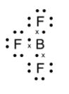
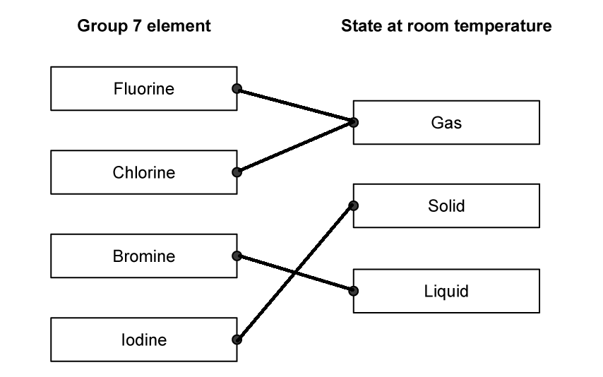
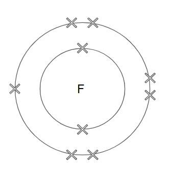

# Mark Schemes — Group 7 (halogens)
**6. Inorganic Chemistry: Part 2** · Edexcel IGCSE Chemistry (Modular) (4XCH1) — 24/Unit 2

## Q1 — easy — 1 marks · exam-questions

### 1() — 1 marks
**Correct answer: D** — iodine

**Final answer:** **The correct answer is D.**

- The correct answer is **D** because the melting points of the halogens increase as you go down the group
- At room temperature (20 °C), iodine's melting point is above room temperature so it is a solid at room temperature* *

## Q2 — easy — 1 marks · exam-questions

### 1() — 1 marks
**Correct answer: C** — Physical state at room temperature: gasColour: pale yellow

**Final answer:** **The correct answer is C.**

- The correct answer is **C **because both chlorine and fluorine have boiling points lower than room temperature
- The colours of the halogens change as you descend the group - they become darker

  - Chlorine is a pale green gas at room temperature
  - Fluorine is a pale yellow gas at room temperature

## Q3 — easy — 7 marks · exam-questions

### 3((a)) — 1 marks
The halogen that has the lightest colour is:

- Fluorine; **[1 mark] **

**[Total: 1 mark] **

- *You should know the physical properties of the halogens *

  - *In terms of appearance, the colour becomes darker down the group*

### 3((b)) — 1 marks
The halogen that is a solid at room temperature is:

- Iodine **OR** Astatine; **[1 mark] **

**[Total: 1 mark] **

- *The melting point of the halogens increases down the group:*

  - *F and Cl are gases at room temperature*
  - *Br is a liquid*
  - *I and At are both solids*

### 3((c)) — 3 marks
i) The balanced equation is:

- Cl2 + **2**Br– → 2Cl– + **2**Br; **[1 mark] **

ii) This reaction is described as the oxidation of bromide ions because:

- (They are) losing electrons **OR **The oxidation number (of bromine) increases **OR **The oxidation number (of bromine) changes from −1 to 0; **[1 mark] **

iii) An equation to show how bromine atoms form bromine molecules is:

- 2Br → Br2 **OR** Br + Br → Br2; **[1 mark] **

**[Total: 3 marks] **

- *The process of oxidation is the loss of electrons and the process of reduction is the gain of electrons *
- *You can remember this as OILRIG (oxidation is loss of electrons, reduction is gain) *
- *The question asks you to balance the equation for the production of bromine atoms, don't be tempted to change the symbol to Br**2** as you may think this seems correct*
- *Dotted lines have been added to help you with the balancing *

### 3((d)) — 2 marks
A dot cross diagram for BF3 is:

A diagram that shows:

- All three bonding pairs correct; **[1 mark] **
- All non-bonding pairs;** [1 mark] **

**[Total: 2 marks] **

- *In the question, you are told to use crosses (×) to represent the outer electrons of boron and dots (•) to represent the outer electrons of fluorine*
- *Take care to not get the two muddled up!*
- *Boron is an exception to the normal rules of covalent bonding; boron does not have to have a full outer shell of 8 electrons to be stable and is stable with 6 electrons*

## Q4 — easy — 10 marks · exam-questions

### 16((a)) — 1 marks
**Correct answer: A** — fluorine

**The correct answer is A **.

The reactivity of the halogens decreases down Group 7

### 2() — 4 marks
The correct state for each Group 7 element is:

- Fluorine matched to gas; **[1 mark]**
- Chlorine matched to gas; **[1 mark]**
- Bromine matched to liquid; **[1 mark]**
- Iodine matched to solid; **[1 mark]**

**[Total: 4 marks]**

- *Ensure you only draw one line from each element*

  - *You will not get the mark if you draw more than one line to two different states, even if one is the correct state*
- *You should know the states at room temperature and the colour of these Group 7 elements*

### 16((b)) — 2 marks
i) The state of astatine at room temperature:

- Solid;** [1 mark] **

ii) The boiling point of astatine is:

- Any value in range 273 – 333 (°C); **[1 mark] **

**[Total: 2 marks] **

- *You have been given the properties of the other halogens though not for astatine*

  - *Astatine is at the bottom of the group *
- *Use the trends shown in the table to predict the properties *

  - *Down the group the boiling point increases, therefore at room temperature it will be a solid like iodine *
  - *Use the differences in the boiling points to help you work out an acceptable value*

### 16((c)) — 3 marks
i) The white solid is

- Sodium chloride; **[1 mark] **

ii) The** **balanced symbol equation for this reaction.

2Na + Cl2 → 2NaCl

- Correct formula of NaCl; **[1 mark] **
- Correct balancing;** [1 mark] **

**[Total: 3 marks]**

- *When a halogen reacts with a Group 1 metal like sodium, it becomes a metal halide*

  - *Therefore, the name of the compound formed is sodium chloride*
- *To balance the equation you must not change the formula of any of the reactants*

  - *Sodium is Na, chlorine exists as Cl**2** and sodium chloride is NaCl Na + Cl**2** → NaCl*
  - *Balance the chlorine atoms Na + Cl**2** → 2NaCl*
  - *Balance sodium atoms  2Na + Cl**2** → 2NaCl*

## Q5 — easy — 11 marks · exam-questions

### 1() — 1 marks
The state of bromine at 50 oC is:

- Liquid;** [1 mark]**

**[Total: 1 mark]**

- *50 **o**C is higher than its melting point but lower than its boiling point, so bromine would have melted at 50** o**C but not boiled*

### 2() — 1 marks
The element that would be a gas at room temperature is:

- Chlorine; **[1 mark]**

**[Total: 1 mark]**

- *Room temperature (around 20 **o**C) is higher than the boiling point of chlorine therefore it will be a gas at room temperature*

### 3() — 2 marks
The two correct statements are:

- They have seven electrons in their outer shell; **[1 mark]**
- They are non-metals that exist as molecules of two atoms; **[1 mark]**

**[Total: 2 marks]**

- *Elements in the same group have the same number of outer electrons, so all Group 7 elements have 7 electrons in their outer shell*
- *They are non-metals as they do not form positive ions*
- *They exist as diatomic molecules; the formula of chlorine is Cl**2**, bromine is Br**2**, etc.*
- *When Group 7 elements react with metals, an ionic compound is formed between a metal and non-metal*
- *The reactivity of Group 7 elements decreases down the group; fluorine is the most reactive Group 7 element*

### 4() — 2 marks
The diagram of fluorine should contain:

- Inner shell: 2 electrons; **[1 mark]**
- Outer shell: 7 electrons; **[1 mark]**

**[Total: 2 marks]**

- *The atomic number shows how many protons there are in an atom*
- *In a neutral atom, the number of electrons = number of protons*
- *Fluorine has an atomic number of 9, therefore it has 9 electrons*
- *The first shell can hold 2 electrons leaving 7 electrons in the second shell, which can hold up to 8 electrons*
- *You do not need to show the electrons in pairs*

### 5() — 2 marks
Fluorine, chlorine and bromine undergo similar reactions with because:

- They all have 7 electrons / same number of electrons;** [1 mark]**
- In their outer shell; **[1 mark]**

**[Total: 2 marks]**

- *Remember**: It is the number of electrons in the outer shell that determines chemical properties*

### 6() — 2 marks
The missing words are:

- Potassium bromide; **[1 mark]**
- Iodine; **[1 mark]**

**[Total: 2 marks]**

- *The correct equation is: bromine  +  potassium iodide → potassium bromide +  iodine*
- *The products can be written in either order*

### 7() — 1 marks
Bromine doesn't react with potassium chloride solution because:

- Bromine is less reactive (than chlorine);** [1 mark]**

**[Total: 1 mark]**

- *A more reactive halogen can displace a less reactive halogen from an aqueous solution of its salt*
- *Bromine is unable to displace chlorine from potassium chloride as bromine is less reactive*
- *Careful:** Bromide is a halide ion, bromine is a molecule - you would not be awarded the mark for using the term bromide*

## Q6 — medium — 13 marks · exam-questions

### 7((a)) — 3 marks
i) The element that is a liquid at room temperature is:

- **B** / bromine; **[1 mark]**

ii) The element that has the palest colour is:

- **C** / chlorine; **[1 mark]**

iii) The element that is the least reactive is:

- **A** / astatine; **[1 mark]**

**[Total: 3 marks]**

- *You need to know the colour and physical state at room temperature of the Group 7 elements:*

  - *Astatine is a black solid*
  - *Bromine is a brown liquid*
  - *Chlorine is a pale green gas*
  - *Iodine is a dark grey solid*
- *The reactivity of the Group 7 elements decreases as you go down the group*

  - *Of the 4 Group 7 elements given in the question, chlorine is the most reactive, followed by bromine, iodine and astatine is the least reactive*

### 7((b)) — 4 marks
i) The missing results are:

|   | **sodium chloride** | **sodium  bromide** | **sodium  iodide** |
|---|---|---|---|
| ** chlorine solution** | not done | solution turns orange | **(colourless solution turns)** **brown**; **[1 mark]** |
| ** bromine solution** | solution stays orange | not done | solution turns brown |
| ** iodine solution** | **(solution stays) brown / no change / no reaction**; **[1 mark]** | solution stays brown | not done |

ii) The teacher does not add bromine solution to sodium bromide solution because:

- Bromine would not react with (sodium) bromide / bromine cannot displace itself / cannot react with itself **OR **Both solutions contain bromine / the same element / the same halogen **OR **No reaction would take place; **[1 mark] **

iii) The chemical equation for the reaction of bromine with sodium iodide is:

- Br2 + 2NaI → 2NaBr + I2 **OR **Br2 + 2I– → 2Br– + I2; **[1 mark] **

**[Total: 4 marks]**

- *A halogen displacement reaction occurs when a more reactive halogen displaces a less reactive halogen from an aqueous solution of its halide*

  - *Chlorine will displace bromine and iodine so a colour change is seen when chlorine solution is added to sodium bromide and sodium iodide*
  - *Bromine will displace iodine so a colour change is seen when bromine solution is added to sodium iodide*
- *The colour change is due to the halogen that has been displaced:*

  - *When bromine is displaced, the solution turns orange*
  - *When iodine is displaced, the solution turns brown*

### 7((c)) — 6 marks
The chemical tests that the technician could use to identify the compound in the solution are:

**Test for cation:**

- Add sodium hydroxide / ammonia (solution); **[1 mark]**
- If blue precipitate forms solution contains copper(II) ion(s) / contains Cu2+ / is a copper compound;** [1 mark]**
- If green precipitate forms solution contains iron(II) ion(s) / contains Fe2+ / is an iron compound; **[1 mark] ***If no reagent or incorrect reagent but correct results, award 1 mark*

**Alternative test 2 for cation:**

- Flame test **OR **description of flame test; **[1 mark]**
- If blue-green (flame) solution contains copper(II) ion(s) / contains Cu2+ / is a copper compound; **[1 mark]** *No third mark available for this test*

**Alternative test 3 for cation:**

- Addition of suitable metal above Cu in reactivity series;** [1 mark]**
- Brown / pink / pink-brown solid forms; **[1 mark]** *No third mark available for this test*

**Test for anion:**

- Add silver nitrate (solution);** [1 mark]**
- If white precipitate forms solution contains chloride ion(s) / contains Cl- / is a chloride; **[1 mark]**
- If cream precipitate forms solution contains bromide ion(s) / contains Br- / is a bromide; **[1 mark] ***If no reagent or incorrect reagent but correct results, award 1 mark*

**Alternative test 2 for anion:**

- Add chlorine water (to solution); **[1 mark]**
- If turns orange / yellow / brown solution contains bromide ion(s) / contains Br- / is a bromide; **[1 mark]** *No third mark available for this test*

**[Total: 6 marks]**

- *Make sure you learn the colours of the precipitates produced on the addition of sodium hydroxide solution to help you identify the ions present*

  - *Ammonia solution can be used to test for cations in a similar way to using aqueous sodium hydroxide, but you do not need to know this test for this specification*
- *The colour of the precipitate produced on the addition of silver nitrate depends on the halide ion present*

  - *The colour gets darker as you go down the group*

## Q7 — medium — 1 marks · exam-questions

### 1() — 1 marks
**Correct answer: D** — Formula: At2State at room temperature: solid

**Final answer:** **The correct answer is D.**

- The correct answer is **D** because going down Group 7 the melting and boiling point of the halogens increases
- The intermolecular forces, therefore, get stronger and need more energy to break
- Fluorine and chlorine are both gases; bromine is a liquid; iodine and astatine are solids
- Group 7 elements exist as molecules and are diatomic, meaning they go around in pairs

## Q8 — medium — 1 marks · exam-questions

### 1() — 1 marks
**Correct answer: C** — Chlorine displaces bromine from potassium bromide

**Final answer:** **The correct answer is C.**

- The correct answer is **C **because a halogen displacement reaction occurs when a more reactive **halogen **displaces a less reactive **halogen** from an aqueous solution of its halide

  - Chlorine is above bromine in Group 7 so it is more reactive
  - Chlorine will displace bromine from an aqueous solution of the metal halide:

Cl2 + 2KBr → 2KCl + Br2

chlorine + potassium bromide →  potassium chloride + bromine

- A is incorrect as chlorine is more reactive than bromine
- B is incorrect as potassium chloride is colourless, it is bromine that is responsible for the orange colour
- D is incorrect as bromide ions lose electrons when they react with chlorine

## Q9 — medium — 1 marks · exam-questions

### 1() — 1 marks
**Correct answer: C** — Option C

**Final answer:** **The correct answer is C.**

- The correct answer is **C** because bromine is lower than chlorine in Group 7 so it is less reactive

  - Bromine is unable to displace chlorine from an aqueous solution of potassium chloride
  - No reaction occurs and the solution stays orange
- Bromine is above iodine in Group 7 so it is** **more reactive

  - Bromine will displace iodine from an aqueous solution of potassium iodide
  - The solution turns brown as iodine is formed

Br2 + 2KI → 2KBr + I2

bromine + potassium iodide **→**  potassium bromide + iodine

## Q10 — medium — 9 marks · exam-questions

### 2((a)) — 2 marks
The completed table of halogens:

- Correct missing properties;

| Halogen | Physical state at room temperature | Colour |
|---|---|---|
| chlorine | gas | pale green |
| bromine | **liquid**;** [1 mark]** | red-brown |
| iodine | solid | **dark(grey)**; **[1 mark]** |

**[Total: 2 marks]**

- *The colour of solid iodine can be hard to describe so any combination of grey and black or just black would score the point*

### 2((b)) — 3 marks
Calculate the relative atomic mass of this sample of chlorine:

- (35 × 77.78) + (37 × 22.22) **OR **3544.44;** [1 mark]**
- $\frac{3544.44}{100}$ **OR **35.4444; **[1 mark] **
- 35.4; **[1 mark]**

**[Total: 3 marks]**

- *All three marks are gained from 35.4 with no workings*
- *There are two approaches to solving relative atomic mass calculations*
- *You can do it in two steps like the above answer shows, or you can do it in one step and multiply the mass numbers by the abundances expressed as a decimal*

  - *(35 × 0.7778) + (3 × 0.2222)*
  - *You would get two marks for showing this working step*
- *Be careful not to skip the workings - although you can score full marks for just the answer, if you make an error you will get nothing*
- *An answer with too many decimal places or significant figures, e.g. 35.4444 / 35.444 / 35.44 and no workings will lose a mark*

### 2((c)) — 4 marks
How he can use these two solutions to compare the reactivity of chlorine with the reactivity of bromine:

- Add the chlorine (solution) to potassium bromide (solution); **[1 mark]**
- The (potassium bromide) solution turns orange; **[1 mark]**
- The bromine is displaced by the chlorine; **[1 mark]**
- So chlorine is more reactive (than bromine); **[1 mark]**

**[Total: 4 marks]**

- *The order of adding the solutions makes no difference or you can just say mix the solutions to get the first mark*
- *The colours can vary a lot depending on the concentration of the bromine in solution, so any combination of yellow/ orange/ brown would be accepted*
- *You don't need to use the word displaced, as long as you correctly identify that bromine is formed or produced*
- *You must not use 'bromide' when you mean 'bromine' as that would lose a mark*

## Q11 — medium — 1 marks · exam-questions

### 1() — 1 marks
**Correct answer: C** — chlorine atoms lose electrons more easily

**Final answer:** **The correct answer is C.**

- The correct answer is **C **because bromine is a larger atom than chlorine as it has more electron shells
- Its outer shell electrons are further from the nucleus than in chlorine
- Therefore, bromine has a weaker attraction between the nucleus and the outer electrons

## Q12 — medium — 8 marks · exam-questions

### 1() — 1 marks
**Correct answer: B** — 17

**Final answer:** **The correct answer is ****B**

- An atom is electronically neutral, i.e. number of protons = number of electrons
- The atomic (proton) number of chlorine is 17
- So, a chlorine atom has 17 electrons

**A** is incorrect as 7 is the number of outer electrons, but not the total number of electrons. This is an easy mistake to make about Group 7 elements.

**C **is incorrect as 18 is the number of neutrons.

**D** is incorrect as 35 is the mass number.

### 2() — 1 marks
**Correct answer: C** — 1-

**Final answer:** **The correct answer is C **

- All Group 7 elements have 7 outer electrons

  - To complete their outer shell, they need to gain one electron
- An electron has a single negative charge

  - So, gaining 1 electron means that fluoride ions have a 1- charge

**A **is incorrect as a 2+ positive charge means that 2 electrons have been lost

**B **is incorrect as a 1+ positive charge means that 1 electron has been lost

**D **is incorrect as a 2- negative charge means that 2 electrons have been gained

### 3() — 1 marks
**Correct answer: B** — brown liquid

**Final answer:** **The correct answer is ****B**

- At room temperature, bromine is one of the 2 liquids on the Periodic Table
- The colour of bromine is classically described as orange-brown

**A** is incorrect as this is the appearance of bromine vapour above room temperature. The liquid vapourises easily, but the element is a liquid at room temperature

**C** is incorrect as this is the appearance of iodine

**D** is incorrect as this is the appearance of iodine vapour, which is above room temperature

### 4() — 5 marks
i) The completed table is

|   | Chlorine | Bromine | Iodine |
|---|---|---|---|
| sodium chloride |   |   |   |
| sodium bromide | **Final answer:** **✓** |   |   |
| sodium iodide | **Final answer:** **✓** | **Final answer:** **✓** |   |

**[2 marks]**

> **[mark-scheme]**
> i) When completing the table:
> 
> 1 mark for three correct ticks
> 
> 1 mark for two correct ticks

> **[mark-scheme]**
> ii) The order of reactivity of the three halogens:
> 
> - Chlorine can displace both sodium bromide and sodium iodide, meaning it reacts with bromide and iodide ions **[1 mark]**
> - Bromine can displace sodium iodide but not sodium chloride, meaning it reacts with iodide ions but not with chloride or bromide ions **[1 mark]**
> - Reactivity decreases down the group: chlorine is the most reactive, followed by bromine, and iodine is the least reactive **[1 mark]**

> **[exam-tip]**
> Make sure you use the terminology correctly when talking about the halogens and the halide ions. For example, if you write bromine instead of bromide, you will lose a mark.
> 
> Examiner reports show that the most common mistake in this topic is confusing the names of the halogen elements (chlorine, bromine, iodine) with the halide ions (chloride, bromide, iodide).
> 
> Remember, it is the more reactive element that displaces the less reactive halogen from its halide solution.
> 
> For example, you must say "chlorine displaces bromide", not "chlorine displaces bromine".Using the incorrect term will lose you a mark.

## Q13 — medium — 13 marks · exam-questions

### 1() — 6 marks
i) The table of information about the elements:

| Element | Colour | State |
|---|---|---|
| chlorine | **Final answer:** **yellow-green** | **Final answer:** **gas** |
| bromine | **Final answer:** **red-brown** | **Final answer:** **liquid** |
| iodine | **Final answer:** **grey-black** | **Final answer:** **solid** |

**[3 marks]**

> **[mark-scheme]**
> i)
> 
> 1 mark for identifying chlorine: yellow-green **AND** gas
> 
> 1 mark for identifying bromine: red-brown **AND** liquid
> 
> 1 mark for identifying iodine: grey-black **AND** solid

> **[mark-scheme]**
> ii) The melting and boiling points:
> 
> - Increase down the group / with increasing (relative) molecular mass **[1 mark]**
> - (Because,) the molecules get bigger / larger (going down the group)
> **OR**
> (Because,) the molecules have more electrons (going down the group) **[1 mark]**
> - This leads to stronger intermolecular forces of attraction **[1 mark]**

> **[exam-tip]**
> The melting / boiling points of Group 7 is a standard 3-mark explanation of the trend. Examiner reports show that to get full marks, you must include all three logical steps:
> 
> 1. State the trend (melting/boiling point increases).
> 2. Explain the change in the molecules (they get bigger / have more electrons).
> 3. Link this to the **intermolecular forces** (they get stronger, so more energy is needed to overcome them).
> 
> A very common mistake is to talk about breaking covalent bonds. Remember, when a simple molecular substance like iodine boils, you are overcoming the **weak forces between the molecules**, not the strong covalent bonds inside them.

### 2() — 2 marks
> **[mark-scheme]**
> The colour and state of astatine at room temperature are:
> 
> - Colour: Black/dark **[1 mark]**
> - State: Solid **[1 mark]**

> **[exam-tip]**
> Trends in physical and chemical properties enable us to predict the properties of unknown elements in the same group.
> 
> The colour of the Group 7 element becomes darker as you go down the group, so we can predict astatine would be a dark or black colour.
> 
> The melting point and boiling point increase down the group, so it would be higher than iodine, which is a solid. Therefore, astatine should be a solid at room temperature.

### 3() — 2 marks
> **[mark-scheme]**
> A chemical test for chlorine:
> 
> - Place damp litmus paper / damp universal indicator paper in the gas**[1 mark]**
> - The paper is bleached / turns white / is decolourised **[1 mark]**
> 
> If litmus paper is used, it may first turn red (as chlorine is acidic in water) before being bleached. Full marks can be awarded for this more detailed answer.

> **[exam-tip]**
> Examiner reports show that students often lose marks by omitting key details.
> 
> - The paper must be **damp**. This is because chlorine gas must dissolve in water to act as a bleach.
> - The key observation is **bleaching** (the paper turns white). While blue litmus paper might briefly turn red first (because chlorine forms an acidic solution), the final and most important result is that it is bleached.

### 4() — 3 marks
> **[mark-scheme]**
> The test for bromide ions:
> 
> - Acidify with dilute nitric acid **[1 mark]**
> - Add silver nitrate solution **[1 mark]**
> - If bromide ions are present, a cream precipitate will form **[1 mark]**

> **[exam-tip]**
> You must get the steps for this test in the correct order to get full marks.
> 
> 1. **Acidify first**
> 
>   - You must add dilute nitric acid first to react with and remove any other ions that might form a precipitate (like carbonate ions), which would give a false positive result.
> 2. **Use the correct acid**
> 
>   - It must be **nitric acid**.
>   - If you used hydrochloric acid or sulfuric acid, you would be adding chloride or sulfate ions, which would interfere with the test.
> 3. **Know your colours**
> 
>   - You need to learn the colours of the silver halide precipitates:
>   
>     - Silver **chloride** = **White** precipitate
>     - Silver **bromide** = **Cream** precipitate
>     - Silver **iodide** = **Yellow** precipitate

## Q14 — hard — 12 marks · exam-questions

### 8((a)) — 2 marks
The completed table:

| **Halogen** | **Physical state at room temperature** | **Colour** |
|---|---|---|
| fluorine | gas | yellow |
| chlorine | gas | pale green |
| bromine | liquid | red-brown |
| iodine | solid | grey |
| astatine | **solid**; **[1 mark]** | **dark grey / black**; **[1 mark]** |

**[Total: 2 marks]**

- *You are expected to know the appearance of the halogens and be able to use the trends to predict the properties of other halogens*
- *The melting and boiling points of the halogens increase as you go down the group which causes the difference in their physical state at room temperature*
- *The halogens get progressively darker as you go down the group*

### 8((b)) — 4 marks
i) The relative atomic mass of this sample of bromine is:

`fraction numerator open parentheses 51 cross times 79 close parentheses plus open parentheses 49 cross times 81 close parentheses over denominator 100 end fraction`

- All masses multiplied by the percentage (top line of the calculation) **OR** 7998; **[1 mark]**
- Divided by 100; **[1 mark]**
- 80.0; **[1 mark]**

ii) A reason why both isotopes of bromine have the same chemical properties is:

- They have the same electron configuration / same number of electrons;** [1 mark]**

**[Total: 4 marks]**

- *For part (i), 80.0 without working scores 3 marks*
- *Calculating the relative atomic mass of an element is just calculating the mean average using the information given to you*
- *Care with rounding - it is a common mistake for students to round down i.e. to 79.9*

### 8((c)) — 6 marks
i) These results show the order of reactivity of bromine, chlorine and iodine by:

- The order of reactivity is chlorine (most), bromine and iodine (least);** [1 mark]**
- Chlorine (is most reactive because it) displaces bromine and iodine / oxidises bromide and iodide (ions) / reacts with  sodium bromide and sodium iodide; **[1 mark]**
- Bromine (is less reactive than chlorine since it) only displaces iodine / only oxidises iodide (ions) / only reacts with sodium iodide; **[1 mark]**

ii) The student does not need to add bromine solution to sodium bromide solution because:

- Bromine cannot displace itself / bromine does not react with sodium bromide / there would be no reaction; **[1 mark]**

iii) The reaction between bromine and sodium iodide is a redox reaction because:

- Bromine is reduced **AND **Iodide (ions) / I- are oxidised; **[1 mark]**
- Bromine gains electrons **AND **Iodide (ions) / I- loses electrons;** [1 mark]**

**OR**

- Bromine gains electrons so it is reduced; **[1 mark]**
- Iodide (ions) / I- loses electrons so are oxidised; **[1 mark]**

**[Total: 6 marks]**

- *When explaining how the results show the order of reactivity, be careful with the use of the endings -ine and -ide as you will be deducted a mark for each incorrect use*
- *Redox reactions can be explained in terms of the loss and gain of oxygen or electrons*
- *In this case, oxygen is not present, so the explanation must be in terms of electrons*

  - *Remember**: **OIL RIG** - **O**xidation **I**s **L**oss, **R**eduction **I**s **G**ain of electrons *

## Q15 — hard — 9 marks · exam-questions

### 3((a)) — 1 marks
The order of reactivity of the halogens is:

- (Most) Z2 Y2 (Least) X2;** ****[1 mark]**

**[Total: 1 mark]**

- *The most reactive halogen will react with the halides of the other two, so Z**2** will react with NaX and NaY*
- *The least reactive halogen will not react with the halides of the other two, so X**2** will not react with NaY or NaZ*

### 3((b)) — 1 marks
The halogen Y2 is:

- Bromine / bromine water / bromine solution / Br / Br2;** [1 mark]**

**[Total: 1 mark]**

- *Bromide is not an allowed answer*
- *Y**2** is neither the most nor least reactive, which hints at Br**2** when the halogens used in labs tend to be Cl**2**, Br**2** and I**2*
- *The colour of the bromine solution is orange, which is given in the question*
- *Bromine is also used to test for alkenes as the bromine reacts with the alkene in an addition reaction, resulting in a colourless product, so this test being mentioned also gives evidence for bromine*

### 3((c)) — 4 marks
i) The completed table should contain the following information:

- (Fluorine) gas / vapour;** [1 mark]**
- (Chlorine) range between -150°C to 10°C inclusive; **[1 mark]**
- (Astatine) dark grey / black; **[1 mark]**

ii) The halogens have similar chemical properties as:

- **C** / the halogens have the same number of outer shell electrons;** [1 mark]**

**[Total: 4 marks]**

- *For part (i), blue-black is not an accepted answer for the colour of astatine*
- *You need to be able to recall the basic physical properties and colours of the halogens*

  - *You do not need to remember melting and boiling points but you are expected to know the trend, so chlorine should have a boiling point spaced out between those of fluorine and bromine*
- *The only correct answer is **C** because the halogens are in group 7 and have similar reactions because they have the same number of electrons in their outer shells.*

  - *A** is not correct because the fact halogens are non-metals does not make them react in a similar way.*
  - *B** is not correct because the fact halogens are molecules does not make them react in a similar way.*
  - *D** is not correct because elements in the same period have different numbers of outer shell electrons and react differently.*

### 3((d)) — 3 marks
i) The experiment should occur in a fume cupboard as:

- Chlorine is toxic / poisonous;** [1 mark]**

ii) The equation for the reaction is:

- FeCl3;** [1 mark]**
- 2Fe + 3Cl2 →2FeCl3; **[1 mark]**

**[Total: 3 marks]**

- *Chlorine has to be treated with caution as it is toxic/poisonous; this means it can kill you in sufficient quantities when inhaled*

  - *You will not gain the mark for saying harmful/dangerous / irritant as these are not sufficient terms *
- *The ions are given in the question, so you should be able to work out that the formula for iron(II) chloride is FeCl**3** if you do not already know it*
- *Equations all need to be balanced, so double-check when you have done so that the same number of each type of atom is present on both sides*

## Q16 — hard — 9 marks · exam-questions

### 2((a)) — 3 marks
i) At room temperature, fluorine is:

- (Pale/light) yellow;** [1 mark] **

ii) The correct choice is:

- B / 1; **[1 mark] **

iii) The formula of a molecule of astatine is:

- At2; **[1 mark] **

**[Total: 3 marks] **

- *You should be able to predict the properties of the halogens as you should know that they get darker in appearance down the group*

  - *Their boiling points also increase down the group*
- *The halogens also are all diatomic molecules, meaning they all contain 2 atoms bonded together, hence F**2**, Br**2**, etc*

### 2((b)) — 5 marks
i) The species acts as an oxidising agent in this reaction.

- Oxidising agent is chlorine / Cl2; **[1 mark] **
- Because chlorine / Cl2 gains electron(s) / is reduced; **[1 mark] **

ii) The decrease in reactivity from chlorine to bromine is due to :

Any** three** of the following points:

- Bromine and chlorine react by gaining electron / forming 1- or negative ion; **[1 mark] **
- Bromine atom larger (than chlorine atom); **[1 mark] **
- Bromine (atom) has smaller / weaker attraction (from nucleus) for (outer shell) electrons (than chlorine); **[1 mark] **
- So (bromine has) less tendency to gain electron / form negative ion (so less reactive than chlorine); **[1 mark]**

**[Total: 5 marks]  **

- **Remember**: The oxidising agent will itself be reduced

  - If the species has received electrons or the oxidation state has decreased, then it is the oxidising agent
- For part (ii), you could also say

  - Bromine has a larger atomic radius
  - Bromine outer (electron) shell is further from nucleus
  - Bromine atom has more (electron) shells (than chlorine)

### 2((c)) — 1 marks
**Correct answer: D** — K+ and Cl–

**Final answer:** **The correct answer is D.**

- The correct answer is **D** / K+ and Cl– because both have electronic configuration of 2.8.8

  - A potassium atom has 19 electrons so when it loses an electron to form K+, it has 18 electrons which gives it the electronic configuration of 2.8.8
  - A chlorine atom has 17 electrons so when it gains an electron to form Cl-, it has 18 electrons which gives it the electronic configuration of 2.8.8
- **A** is not correct because Li+ does not have electronic configuration of 2.8.8 (its electronic configuration is 2)
- **B** is not correct because F– does not have electronic configuration of 2.8.8 (its electronic configuration is 2.8)
- **C** is not correct because neither Li+ nor F– have electronic configuration of 2.8.8

## Q17 — hard — 10 marks · exam-questions

### 1() — 2 marks
The state of chlorine at -100 oC **and **at 0 oC is:

- -100 oC: liquid; **[1 mark]**
- 0 oC: gas; **[1 mark]**

**[Total: 2 marks]**

- *If the temperature is lower than the melting point, the element will be a solid*
- *If the temperature is between the melting point and boiling point then it will have melted but not boiled, i.e. it is a liquid*
- *If the temperature is higher than the boiling point, the element will be a gas*

### 2() — 3 marks
The boiling point increases down Group 7 because:

- The size of the molecules increases **OR** The relative formula / molecular mass increases; **[1 mark]**
- The intermolecular force increases;** [1 mark]**
- More energy is needed to overcome the intermolecular forces;** [1 mark]**

**[Total: 3 marks]**

- *Careful**: When referring to the melting/boiling point of covalent molecules, there are no covalent bonds broken*
- *The molecules are moving further apart from each other but the molecules themselves remain intact*
- *You would not gain the last mark if you made any references to breaking bonds*

### 3() — 2 marks
The halogens all react similarly with hydrogen because:

- The reactivity with hydrogen depends on gaining/sharing electrons; **[1 mark]**
- They all have the same number / 7 electrons in their <u>outer</u> shell; **[1 mark]**

**[Total: 2 marks]**

- *It is not sufficient to say they all have the same number / 7 electrons as this is incorrect - you **must** specify that there have the same number of electrons in the outer shell to gain the mark*

### 4() — 3 marks
The difference in rate of reaction is:

- Hydrogen with chlorine will have a quicker rate of reaction (than hydrogen with iodine); **[1 mark]**

The explanation for the difference is:

- Chlorine has fewer shells than iodine / less shielding; **[1 mark]**
- So chlorine gains electrons more easily / electrons are more easily attracted towards the nucleus; **[1 mark]**

**[Total: 3 marks]**

- *Use the mark scheme to help you structure your answer*
- *3 marks are available so 1 mark will be to predict the difference in the rate of reaction and 2 marks to explain why*
- *This requires you to apply your knowledge about why Group 7 elements become less reactive as you go down the group*

## Q18 — hard — 13 marks · exam-questions

### 1() — 3 marks
i) The balanced symbol equation for this reaction is:

Cl2 + 2KI → 2KCl + I2

- Correct reactants and products; **[1 mark]**
- Correct balancing;** [1 mark]**

ii) When this reaction occurs, you would see:

- (Liquid changes from colourless to ) yellow / orange / brown / red;** [1 mark]**

**[Total: 3 marks]**

- *You are expected to know the formulae for chlorine and potassium iodide and know the products formed from this displacement reaction*
- *Potassium iodide is colourless, when you add chlorine, the solution will turn brown due to the formation of iodine in the solution*
- *If potassium bromide had been used, the solution would have turned yellow-orange as bromine is formed*

### 2() — 4 marks
To explain what is being oxidised and what is being reduced:

- Iodine is oxidised **AND **as it / iodide ion loses an electron; **[1 mark]**
- 2I– → I2 + 2e–   ;** [1 mark]**
- Chlorine is reduced **AND **as it gains electrons; **[1 mark]**
- Cl2 + 2e– → 2Cl–  ; **[1 mark]**

**[Total: 4 marks]**

- *Remember**: **OIL RIG**: **O**xidation **I**s **L**oss, **R**eduction **I**s **G**ain of electrons*
- *You need to show, using half equations, what is gaining electrons and what is losing electrons*
- *Two iodide ions each lose one electron so are oxidised to form an iodine molecule*
- *Chlorine forms two chloride ions by gaining two electrons so is reduced *
- *You may not be used to using half equations in this context as you may have used them only when looking at the reactions that occur at each electrode in electrolysis, but the principle behind constructing them is exactly the same*

### 3() — 3 marks
Chlorine is more reactive than iodine because:

- When they / chlorine and iodine react, they gain an electron / form a 1- ion / negative ion;** [1 mark]**
- An electron is more strongly attracted to a chlorine atom than to an iodine atom **OR** Chlorine has a greater tendency to gain an electron / form a 1- ion / negative ion; **[1 mark]**
- Because a chlorine atom is smaller  **OR** Outer electrons in a chlorine atom are closer to the nucleus **OR** More shielding between the nucleus of an iodine atom and outer electrons; **[1 mark]**

**[Total: 3 marks]**

- *The reasons for the relative reactivity of the halogens are frequently examined, so this is an explanation well worth learning*
- *Remember**: Reactivity of the halogen is a measure of how easily it will gain an electron to complete its outer shell*
- *You need to show a clear understanding of why the electron is more easily gained by chlorine*

### 4() — 3 marks
The balanced symbol equation for this reaction, including state symbols is:

2K (s) + Cl2 (g) → 2KCl (s)

- Correct formulae; **[1 mark]**
- Correct balancing; **[1 mark]**
- Correct state symbols;** [1 mark]**

**[Total: 3 marks]**

- *You should know the formulae for the reactants and products in this equation, and it is a straightforward equation to balance*
- *Remember to include state symbols, as prompted in the question*
- *You are told that potassium chloride is a solid - often students overlook the information given in the question, leading them to give an incorrect state symbol, so make sure you read the question carefully*
- *You should know that chlorine is a gas and that potassium is a solid - think about the reactions of Group 1 metals!*
