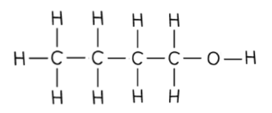
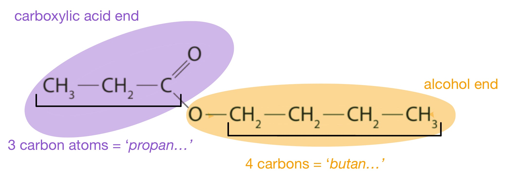
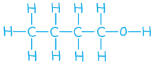
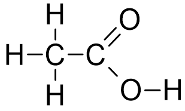
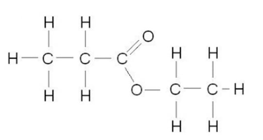
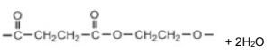
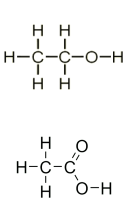
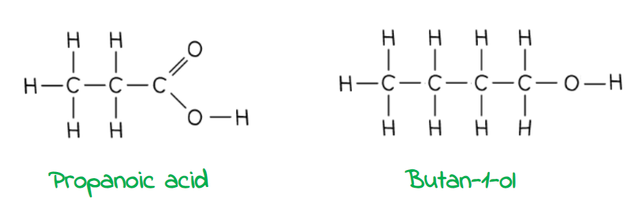
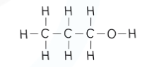

# Mark Schemes — Alcohols
**8 Organic chemistry: Part 2** · Edexcel IGCSE Chemistry (Modular) (4XCH1) — 24/Unit 2

## Q1 — easy — 1 marks · exam-questions

### 1() — 1 marks
**Correct answer: B** — The other reagent is sulfuric acid

**Final answer:** **The correct answer is B.**

- Alcohols will undergo oxidation when heated with an oxidising agent.
- Acidified potassium dichromate(VI) is an oxidising agent (represented in equations by [O]); potassium dichromate(VI) is acidified using dilute sulfuric acid:

CH3CH2OH + [O]  →  CH3COOH + H2O

- **A** is incorrect as the colour change is from orange to green
- **C** is incorrect as the product is ethanoic acid
- **D** is incorrect as it is an example of an oxidation reaction

## Q2 — easy — 1 marks · exam-questions

### 1() — 1 marks
**Correct answer: B** — The hydration of ethene has a 100% atom economy

**Final answer:** **The correct answer is B**

- The hydration of ethene has only one product, ethanol, so it has a 100% atom economy

ethene + steam → ethanol

- **A** is incorrect as fermentation produces ethanol and carbon dioxide. Since the question is about the manufacture of ethanol, which is the desired product, then we cannot say the process has 100% atom economy
- **C** is incorrect as the ethanol produced by fermentation is very impure as it contains a lot of water
- **D** is incorrect as alkenes are reactive and will undergo some reactions at room temperature. However, the hydration of ethene requires steam and a catalyst, so does not occur at room temperature

## Q3 — easy — 1 marks · exam-questions

### 1() — 1 marks
**Correct answer: C** — The presence of oxygen

**Final answer:** **The correct answer is C**

- Fermentation is an anaerobic process

  - Oxygen is not required for ethanol to be produced by fermentation
  - If oxygen is present, further oxidation of the ethanol would occur forming ethanoic acid (a carboxylic acid)

## Q4 — easy — 6 marks · exam-questions

### 1() — 1 marks
**Correct answer: C** — –OH

**Final answer:** **The correct answer is C**

- Methanol and ethanol are both alcohols
- The functional group of alcohols is –OH

  - **A** is incorrect as this is the functional group of alkenes
  - **B** is incorrect as this is the functional group of carboxylic acids
  - **D** is incorrect as this shows a carbon-carbon single bond

### 2() — 1 marks
**Correct answer: D** — they have the same physical properties

**Final answer:** **The correct answer is D**

- Options **A**, **B** and **C** are all features of a homologous series
- **D** is not a feature of a homologous series as they do not have the **same **physical properties, but they do share **similar **physical properties
- You need to know these features that are characteristic of homologous series and you could be asked to list some of these features in an exam

### 3() — 2 marks
The correct sentences are:

- Ethanol can be **oxidised **to form ethanoic acid; **[1 mark]**
- The functional group of ethanoic acid is **–COOH**; **[1 mark]**

**[Total: 2 marks]**

- *Alcohols undergo oxidation to produce carboxylic acids*
- *You need to know about three different ways in which ethanol can be oxidised to form ethanoic acid:*

  - *By burning in excess oxygen*
  - *Reacting with the oxygen in air - this is known as microbial oxidation *
  - *Heating with acidified potassium(VI) dichromate solution*
- *Alcohols will oxidise when left standing in the air due to the oxygen present*
- *Wine that has been left open for a few days will have a vinegary taste as the ethanol in the wine oxidises to ethanoic acid, which is the main component of vinegar *

### 4() — 2 marks
The structure of butanol, showing all of the bonds in the structure, is:

- –OH correctly drawn; **[1 mark]**
- Rest of the structure correct;** [1 mark]**

**[Total: 2 marks]**

- *The stem of the name, but-, tells you that there are 4 carbon atoms in one molecule of butanol*
- *As it is an alcohol, it will have the –OH functional group*
- *You must draw a single bond between O and H - this is often overlooked by students so take care to draw **all **of the bonds*

## Q5 — easy — 6 marks · exam-questions

### 1() — 1 marks
The name of the third member of this series is:

- Propanol; **[1 mark]**

**[Total: 1 mark]**

- *You need to know the names and structures of the first four members of the alcohol homologous series*
- *Remember**: The prefix tells you how many carbon atoms there are in the chain: prop- means 3*

  - *The suffix -ol is used for alcohols, giving the name, propanol*
- *You would be awarded the mark for the names propan-1-ol and propan-2-ol where the numbers show which carbon atom the -OH group is attached to*

### 2() — 2 marks
The relative formula mass of hexanol, C6H13OH is:

- (6 x 12) + (14 x 1) + (1 x 16);** [1 mark]**
- = 102; **[1 mark]**

**[Total: 2 marks]**

- *To calculate the relative formula mass of a substance, you have to add up the relative atomic masses of all the atoms present in the formula*
- *The formula of pentanol shows that one molecule contains 6 carbon atoms, 14 hydrogen atoms and 1 oxygen atom*
- *Multiply the number of each atom by its relative atomic mass and add together*
- *Make sure you show your working *

### 3() — 2 marks
The two correct statements are:

| Alkenes are formed when alcohols are oxidised |   |
|---|---|
| Ethanol oxidises to form ethanoic acid | ✔; **[1 mark]** |
| Alcohols can be oxidised by heating with potassium dichromate(VI) in dilute sulfuric acid | ✔;** [1 mark]** |
| Alcohols are oxidised by fermenting at 30 °C with the absence of oxygen |   |
| When ethanol oxidises in air, carbon dioxide is produced |   |

**[Total: 2 marks]**

- *Alcohol can be oxidised by complete combustion, in air by microbial oxidation or by heating with potassium dichromate(VI)*

  - *When oxidised by complete combustion, water and carbon dioxide are formed*
  - *When oxidised in air or by potassium dichromate(VI), a carboxylic acid and water are formed*
  - *Ethanol will oxidise to produce ethanoic acid*
- *Alkenes are not formed when alcohols are oxidised*

  - *The hydration of alkenes is used to manufacture alcohols, e.g. ethene reacts with steam to form ethanol*
- *Alcohols are also produced (and not oxidised) by the fermentation process*

### 4() — 1 marks
**Correct answer: C** — C5H11OH

**Final answer:** **The correct answer is C**

- You are not expected to know the formula of the fifth member of the homologous series but you can work it out from the information given
- Look for patterns:

  - The number of carbon atoms increases by 1 each time, so the fifth alcohol will have 5 carbon atoms
  - The number of hydrogen atoms shown next to the carbon atoms increases by 2 each time, so the fifth alcohol will have 11 hydrogen atoms as this is 2 more than the fourth alcohol
  - The OH group remains unchanged
- **A** is incorrect as it has 10 hydrogen atoms shown next to the carbon atom instead of 11
- **B** is incorrect as it has the -COOH functional group so is a carboxylic acid, not an alcohol
- **D** is incorrect as it has 13 hydrogen atoms shown next to the carbon atom instead of 11

## Q6 — medium — 12 marks · exam-questions

### 9((a)) — 6 marks
i) Yeast is added because:

- To provide an enzyme / zymase; **[1 mark] **
- To increase the rate of the reaction;** [1 mark] **

ii) Another organic compound may also be formed if fermentation is carried out in the presence of air because:

An explanation that links the following two points:

- Oxygen (from the air) reacts with ethanol; **[1 mark] **
- To form ethanoic acid;** [1 mark] **

iii) 30 °C is considered to be an optimum temperature for this reaction because:

An explanation that links the following two points:

- Reaction is too slow at lower temperatures; **[1 mark] **
- Zymase / the enzyme is denatured at higher temperatures;**[1 mark]**

**[Total: 6 marks] **

- *Yeast is an enzyme or in other words a biological catalyst, so therefore it is specific when it comes to speeding up the rate of fermentation of glucose*
- *However, in too higher temperatures or extreme pH's the enzyme will denatured so it will not be able to work properly*

### 9((b)) — 4 marks
i) The chemical equation for this reaction is:

- C2H4 + H2O → C2H5OH; **[1 mark] **

ii) The type of reaction that occurs is:

- Addition; **[1 mark] **
 *Accept hydration *

iii) **Two** conditions necessary are:

Any **two **from the following:

- Phosphoric acid catalyst; **[1 mark] **
- 300 °C;**[1 mark] **
- 60–70 atm; **[1 mark] **

**[Total: 4 marks] **

- *You should know the two methods for the manufacture of ethanol, including the reaction conditions required for each*

### 9((c)) — 2 marks
The compounds are:

- Carboxylic acid: propanoic acid; **[1 mark] **
- Alcohol: butanol-1-ol / butanol;**[1 mark] **

**[Total: 2 marks] **

- *In order to work out what compounds make up the ester it is best to label each end*

- *The carboxylic acid end contains three carbon atoms so the original compound must be propanoic acid*

  - *The carboxylic acid end contains the C=O bond*
- *The alcohol end contains four carbon atoms so the original compound must be butanol*

  - *The alcohol end contains the C-O bond*

## Q7 — medium — 1 marks · exam-questions

### 1() — 1 marks
**Correct answer: B** — C4H10OH

**Final answer:** **The correct answer is B**

- Butanol has 4 carbon atoms, 10 (not 11) hydrogen atoms and one oxygen atom 

## Q8 — medium — 9 marks · exam-questions

### 3((a)) — 2 marks
Two variables the student should control to make sure her results are valid:

- The volume of the liquid (alcohol) should be kept the same; **[1 mark]**
- The temperature of the water should be kept the same;** [1 mark]**

**[Total: 2 marks]**

- *Try to avoid using ambiguous words like 'amount' when you really mean the volume, although you would probably still get the mark for it in an exam*
- *Amount to a chemist usually refers to moles of substance which does not make any sense here*
- *You could also get credit for mentioning the temperature of the surrounds which could also affect the rate of evaporation*
- *The volume or mass of the water would not score any marks as they won't affect the evaporation of the alcohol*

### 3((b)) — 1 marks
Why it is not safe to heat the evaporating basin directly with a Bunsen flame:

- Alcohols are very flammable or easily catch fire; **[1 mark]**

**[Total: 1 mark]**

### 3((c)) — 6 marks
i)  The mean (average) time for butanol to evaporate:

- $\frac{64+63+60}{3}$;** [1 mark]**
- 62 / 62.3  ;** [1 mark]**

ii)  How the results show which alcohol evaporates most easily:

- Methanol is the alcohol which evaporates most easily;** [1 mark]**
- It takes the shortest time to evaporate; ** [1 mark]**

iii)  The relationship between the number of carbon atoms in the molecule and how easily the alcohol evaporates:

- As the number of carbon atoms increases; ** [1 mark]**
- The less easily the alcohol evaporates;** [1 mark]**

**[Total: 6 marks]**

- *As with lots of these numerical calculations you will get full marks if you get the answer right even without workings, but marks are possible if the final answer is wrong*
- *The result for Student C is anomalous, that is, it doesn't fit the trend, so it should be ignored in calculating the mean*
- *However, if you did use it you could still get credit for the answer which will be 69 / 69.25 / 69.3 but you will only score 1 mark*
- *You can use the word volatile in part iii) by talking about the less volatile alcohol has the most carbon atoms, but since the question asks about evaporation ease, you won't get credit if your answer just refers to time taken.*

## Q9 — medium — 1 marks · exam-questions

### 1() — 1 marks
**Correct answer: A** — Production of ethanol from the fermentation of glucose

**Final answer:** **The correct answer is A**

- Ethanol is being produced in this reaction, it is not being oxidised

## Q10 — medium — 14 marks · exam-questions

### 6((a)) — 4 marks
i)  The substance that is added to the sugar solution that causes glucose to ferment:

- Yeast; **[1 mark]**

ii)   The temperature which is the most suitable for fermentation:

- C; **[1 mark]**

iii)   Why fermentation is done in the absence of air:

- Oxygen in the air would react with ethanol; **[1 mark]**
- To form ethanoic acid / to form carboxylic acid; **[1 mark]**

**OR**

- The fermentation/reaction/respiration needs to be anaerobic;  **[1 mark]**
- Ethanol would not be formed / CO2 and H2O would form;  **[1 mark]**

**[Total: 4 marks]**

- *In Part ii)*

  - *C (30 °C) is correct as it is the most suitable temperature for fermentation*
  - *A is incorrect as at 0°C the enzymes would not be active so not the most suitable temperature for fermentation*
  - *B is incorrect as at 10°C the enzymes would not be very active so not the most suitable temperature for fermentation*
  - *D is incorrect as at 80°C the enzymes would be denatured so not the most suitable temperature for fermentation*
- *You can state vinegar instead of ethanoic acid in part iii) as they are the same thing*
- *Oxygen reacting with ethanol in the air can also be described as the ethanol undergoing oxidation*

### 6((b)) — 3 marks
i)  What is meant by the term **fuel:**

- A substance that releases thermal energy/heat (energy) when burned/combusted;  **[1 mark]**

ii)   A chemical equation for the complete combustion of ethanol in air:

C2H5OH + 3O2  →  2CO2 + 3H2O

- All formulae correct;  **[1 mark]**
- Correctly balanced equation; **[1 mark]**

**[Total: 3 marks]**

> *You need to mention that fuels are burned to release energy, since this is the required definition for the exam. However, not all fuels are burned- you may have come across **fuel **cells where the energy is release as electrical energy without combustion*

### 6((c)) — 2 marks
The conditions of temperature and pressure used in this process:

- Temperature: 300 oC; **[1 mark]**
- Pressure: 60-70 atm; **[1 mark]**

**[Total: 2 marks]**

- *Examiners would accept a range of values in these type of questions, so for example:*

  - *Temperature: anything in the range 250-350 **o**C would be credited*
- *Although you wouldn't lose the mark without the unit, as long as the temperature was in the range, it is best to include it*
- *There are other units of pressure and temperature than could be used, for example kelvin for temperature, but you would have to include the unit in order to score the mark, so in this case it would be 573 K*

### 6((d)) — 5 marks
i)   The colour change that occurs in the potassium  dichromate(VI) during this reaction.

- Orange to green;** [1 mark]**

ii) The displayed formula of ethanoic acid.

- Correct drawing; **[2 mark]**

iii) Complete the equation for the reaction of ethanoic acid with sodium.

CH3COOH (aq) + Na (s) → CH3COONa (aq) + ½H2 (g)

- Both products correct; **[1 mark]**
- Balancing of the equation; **[1 mark]**

**[Total: 5 marks]**

- *In a displayed formula you need to show all the bonds*

  - *For example if you did not show the O-H bond you would lose one mark*
- *The equation can show multiples instead of the the half:*

> *2CH**3**COOH (aq) + 2Na (s) → 2CH**3**COONa (aq) + H**2 **(g)*

## Q11 — medium — 15 marks · exam-questions

### 4((a)) — 1 marks
The structural formula of the alcohol that contains one carbon atom is:

- CH3OH; **[1 mark] **

**[Total: 1 mark] **

- *You should know the names, formulas and structures for the first the alcohols with 1 to 4 carbons in the chain*

  - *1 carbon = methanol, CH**3**OH*
  - *2 carbons = ethanol, CH**3**CH**2**OH*
  - *3 carbons = propanol, CH**3**CH**2**CH**2**OH*
  - *4 carbons = butanol, CH**3**CH**2**CH**2**CH**2**OH*

### 4((b)) — 5 marks
i) The process that converts glucose into ethanol is:

- Fermentation; **[1 mark] **

ii) This process is carried out in the absence of air and at a temperature below 40 °C because:

Explanation including **four** from:

- Fermentation / reaction / respiration needs to be anaerobic; **[1 mark] **
- Because in air / aerobic conditions ethanol not produced;**[1 mark] **
- Because in air / aerobic conditions CO2 and H2O are produced; **[1 mark] **
- (If temperature above 40 °C / too high) enzymes (in yeast) become denatured / lose their structure; **[1 mark] **
- Causing fermentation / reaction to slow down / stop; **[1 mark] **

**[Total: 5 marks] **

- *You need to know both fermentation and hydration of ethene in the production of ethanol *
- *You could also be asked for the organic product that would be produced if oxygen was present; this would be ethanoic acid as ethanol will undergo oxidation *

  - *Alcohols can be oxidised to form carboxylic acids*

### 4((c)) — 4 marks
i) The missing information is:

;** [1 mark] **

- C3H6O2; **[1 mark] **
- Butanoic acid; **[1 mark] **

ii) The homologous series that contains these compounds is:

- Carboxylic (acids); **[1 mark] **

**[Total: 4 marks] **

- *Carboxylic acids can be identified by the C=O and C-OH at the end of the molecule*
- *The general formula of a carboxylic acid is C**n**H**2n+1**COOH which can be shortened to just RCOOH*
- *The naming of a carboxylic acid follows the pattern alkan + oic acid*
- *Just like alcohols, you need to know the first four *

  - *methanoic acid*
  - *ethanoic acid*
  - *propanoic acid*
  - *butanoic acid*

### 4((d)) — 5 marks
i) The purpose of the acid is:

- (Acid acts as) a catalyst / to speed up reaction;** [1 mark] **

ii) The displayed formula of the ester that forms when propanoic acid reacts with ethanol is:

- Ester linkage;** [1 mark] **
- Rest of molecule fully correct; **[1 mark] **

iii) An example of a property and use of esters:

- Property: distinctive / sweet / fruity smell; **[1 mark] **
- Use: in perfumes / flavourings;** [1 mark] **

**[Total: 5 marks]**

- *You can also be asked to name and draw esters, make sure you spend time practising this as they can be tricky*
- *The alcohol forms the first part of the name and the acid forms the second part of the name*
- *For example, propanol and ethanoic acid will react to form propyl ethanoate *

## Q12 — medium — 7 marks · exam-questions

### 4((a)) — 2 marks
The completed table is:

| **Alcohol** | **Structural formula** | **Relative formula mass** |
|---|---|---|
| Methanol | CH3OH | 32 |
| Ethanol | C2H5OH | 46;** [1 mark] ** |
| Butanol; **[1 mark] ** | C4H9OH | 74 |

**[Total: 2 marks] **

- *Careful: **The table jumps from ethanol to butanol, propanol with 3 carbon atoms is not included*
- *To calculate the relative formula mass of ethanol*

  - *(2 x C) + (6 x H) + (1 x O) *
  - *(2 x 12) + (6 x 1) + (1 x 16) = 46*

### 4((b)) — 2 marks
i) The other reagent is:

- Sulfuric acid; **[1 mark] **

ii) The colour change that occurs is:

- Orange to green;** [1 mark] **

**[Total: 2 marks] **

- *Sulfuric acid acts as a catalyst for the oxidation of ethanol *
- *The reagents are sometimes described as acidified potassium dichromate solution *

### 4((c)) — 3 marks
i) The ester that is formed when ethanol reacts with ethanoic acid is:

- Ethyl ethanoate;** [1 mark] **

ii) The completed equation is:

CH3OH + **CH****3****COOH** → **CH****3****COOCH****3** + H2O

- Missing reactant: CH3COOH; ** [1 mark] **
- Missing product: CH3COOCH3; ** [1 mark] **

**[Total: 3 marks] **

- *An ester is formed when a carboxylic acid and alcohol reaction in the presence of concentrated sulfuric acid*
- *Esters can be identified by the -COOC- group in their formula *

## Q13 — medium — 14 marks · exam-questions

### 1() — 4 marks
> **[mark-scheme]**
> i) Two methods used to produce ethanol are:
> 
> - Fermentation of glucose **[1 mark]**
> - Hydration of ethene **[1 mark]**
> 
> ii) An equation for each method:
> 
> - Fermentation: C6H12O6 → 2C2H5OH + 2CO2 **[1 mark]**
> - Hydration: C2H4 + H2O → C2H5OH **[1 mark]**

> **[exam-tip]**
> These two methods of producing ethanol are explicitly named in the specification, so you need to learn them, including their balanced chemical equations.
> 
> Notice that the hydration of ethene is a reversible reaction, so using the ⇌ symbol is good practice, but you will not lose a mark for using a normal forward arrow →.

### 2() — 7 marks
i) The completed table is:

|   | Method 1 | Method 2 |
|---|---|---|
| Name of method | **Final answer:** **fermentation**  **[1]** | **Final answer:** **hydration**  **[1]** |
| Temperature | **Final answer:** **room temp/25****o ****C**  **[1]** | 300 oC |
| Catalyst | yes | yes |
| Rate of reaction | slow | fast |

> **[mark-scheme]**
> ii) The catalyst and advantage for each method are:
> 
> Catalyst:
> 
> - Fermentation: yeast / enzyme / zymase **[1 mark]**
> - Hydration: phosphoric acid / H3PO4 **[1 mark]**
> 
> Advantage of fermentation:
> 
> - Works at low temperature/ requires less energy 
> **OR**
> Uses a natural / renewable resource **[1 mark]**
> 
> Advantage of hydration:
> 
> Any **one **from:
> 
> - Faster reaction
> - Works at all temperatures
> - Produces a pure product
> - Has a high (100%) atom economy
> 
> **[1 mark]**

> **[exam-tip]**
> When asked for an 'advantage', you need to explain *why* a particular condition is beneficial. Think about the real-world implications of the reaction conditions.
> 
> For example, consider the **source of the reactants** or the **energy requirements**.
> 
> - Is one reactant from a renewable source like plants, while the other is from a finite resource like crude oil?
> - Does one method require a lot of energy to maintain high temperatures and pressures, making it more expensive?
> 
> Thinking about factors like cost, sustainability, and rate of production will help you identify valid advantages for each method.

### 3() — 3 marks
> **[mark-scheme]**
> Anaerobic means:
> 
> - Without air/oxygen **[1 mark]**
> 
> Anaerobic conditions are necessary because:
> 
> - They prevent the ethanol from oxidising / reacting with oxygen **[1 mark]**
> - To form ethanoic acid /acetic acid / vinegar **[1 mark]**

> **[exam-tip]**
> The term anaerobic is also used in biology. But, in a chemistry context, you must explain the chemical reason why oxygen needs to be excluded.
> 
> It's not enough to say "so ethanol can be produced". You must explain the unwanted side-reaction (oxidation to ethanoic acid) that would happen if oxygen were present.

## Q14 — hard — 11 marks · exam-questions

### 6((a)) — 3 marks
i) The temperature and pressure used in this manufacturing process are:

- 300 (oC); **[1 mark] **
accept any temperature or range 250 to 350 inclusive. 
accept any correct alternative unit and quantity
- 60 to 70 (atm); **[1 mark] ** *Accept any pressure or range 60 to 70 inclusive* *Accept any correct alternative unit and quantity*

ii) The displayed formula of ethanol is:

- Correct displayed formula; **[1 mark] ** 
*All bonds including bond between O and H must be shown.*

**[Total: 3 marks]**

- *These are standard conditions that you must learn *
- *Be careful with the displayed formula- a common mistake is to not show the bond between the O and H atoms and simply write -OH but you will not achieve the mark if you do this*

### 6((b)) — 3 marks
i) The chemical equation for this reaction is;

C2H5OH + 3O2 → 2CO2 + 3H2O

- A formulae correct;** [1 mark]**
- Balancing of correct formuale; **[1 mark] **
*allow C**2**H**6**O for ethanol* 
*accept multiples and fractions* *ignore state symbols even if incorrect* *M2 dep on M1*

ii) Carbon monoxide is poisonous to humans because:

- Prevents blood from carrying oxygen / reduces the capacity of blood to carry oxygen;** [1 mark]**

**[Total: 3 marks]**

- *The first question is asking for an equation for complete combustion*
- *Although you are told all of the reactants and products, this may not always be the case so make sure you know that if there is a plentiful supply of oxygen carbon dioxide is made, and if there isn't carbon monoxide is made *

### 6((c)) — 1 marks
The name of the ester formed is:

- Ethyl ethanoate;** ****[1 mark]*** *
*Allow ethyl acetate*

**[Total: 1 mark]**

- *When naming esters, the first part of the name is derived from the alcohol used and the second part from the carboxylic acid*

  - *Ethanol = ethyl*
  - *Ethanoic = ethanoate*
- *This is a basic example as the number of carbon atoms in each reactant is the same*
- *Other examples might use alcohols and carboxylic acids with different carbon chain lengths *

  - *For example: Propanol and methanoic acid  *
  
    - *Propanol = propyl*
    - *Methanoic acid = methanoate *
    - *So the ester is propyl methanoate*

### 4() — 4 marks
i) The name of this type of polymerisation is:

- Condensation;** [1 mark]**

ii) The product is:

- Correct ester link; **[1 mark]**
- Rest of polymer structure correct with extension bonds; **[1 mark]**
- 2H2O; **[1 mark]**

**[Total: 4 marks]**

- *Condensation polymers are formed when two different monomers are linked together with the removal of a small molecule, usually water*
- *For every ester linkage formed in condensation polymerisation, one molecule of water is formed from the combination of a -H and an -OH group*

  - *As shown in the diagram, two ester linkages are present and so two water molecules must be produced*
- *You are asked for the repeat unit so there **must** be extension bonds*

## Q15 — hard — 14 marks · exam-questions

### 5((a)) — 2 marks
Two characteristics of a homologous series are:

Any **two** from:

- Same general formula; **[1 mark] **
- Each member differs from the next by CH2; **[1 mark] **
- Same functional group;**[1 mark] **
- Similar chemical properties / reactions; **[1 mark] **
- Trend / steady increase in physical properties; **[1 mark] **

**[Total: 2 marks] **

- *The characteristics of a homologous series are the same for alkanes, alkenes, alcohols and carboxylic acids, so you can apply the same marking points to the different families *
- *Make sure you state 'trend' in physical properties*

  - *As the relative molecular mass increases, so does the boiling point*
- *You can also gain the marks for stating:*

  - *Same chemical properties / reactions*
  - *A named physical properties e.g. trend in boiling points*

### 5((b)) — 5 marks
i) The formula of the other reagent is:

- H2SO4; **[1 mark] **

ii) The colour change is:

- From orange;** [1 mark] **
- To green; **[1 mark] **

iii) The structures are:

- Correct structure for ethanol;** [1 mark] **
- Correct structure for ethanoic acid;** [1 mark] **

**[Total: 5 marks]**

- *The change in colour is a common question when you are asked about the oxidation of ethanol*
- *Make sure you get the colours the correct way around - the reaction mixture ends up green  *
- *When drawing displayed formulas, you must show all the bonds*
- *A common mistake is drawing OH instead of O-H for the alcohol group *

### 5((c)) — 7 marks
i) The advantages and disadvantages of these two methods are:

A discussion which refers to any **six** of the following points:

**Advantages of fermentation / disadvantages of hydration:**

- Sugar cane can be re-grown / is renewable; **[1 mark] **
- Crude oil is finite/cannot be replaced/is non-renewable; **[1 mark] **
- Fermentation uses lower temperatures so energy costs are lower/ hydration uses higher temperatures, so energy costs are higher; **[1 mark]**
- Fermentation uses lower pressure so energy costs are lower/ hydration uses higher pressure, so energy costs are higher;** [1 mark] **
- Yeast is a natural substance and not harmful / phosphoric acid is corrosive; **[1 mark] **

**Advantages of hydration / disadvantages of fermentation:**

- Hydration is a faster process / fermentation is a slower process; **[1 mark] **
- Hydration gives pure ethanol / fermentation gives impure ethanol; **[1 mark] **
- Growing sugar cane takes up land which could be used for growing food / rearing livestock; **[1 mark] **
- Hydration is a continuous process / fermentation is a batch process; **[1 mark] **

ii) The completed equation is:

- C6H12O6 → 2C2H5OH + 2CO2; [1 mark]

**[Total: 7 marks] **

- *Answering extended response questions should be done in sections, you can use a table and bullet points if it helps*
- *Here you can split it up into the following*

  - *Advantages of fermentation / disadvantages of hydration*
  - *Advantages of hydration / disadvantages of fermentation*
- *This means that each process can be compared*
- *Make your points succinct and clear - you do not need to write an essay*

## Q16 — hard — 14 marks · exam-questions

### 7((a)) — 6 marks
i) The equation for the fermentation of glucose is:

- (C6H12O6  → 2C2H5OH + 2)**CO****2**; **[1 mark]**

ii) It is necessary for fermentation to be done in the absence of air because:

- (Otherwise) ethanoic acid will form; [1 mark] 
*Allow (otherwise) ethanol will be oxidised or react with oxygen* 
*Allow fermentation / reaction / respiration needs to be anaerobic* 
*Allow (otherwise) ethanol would not be formed / CO**2** and H**2**O would be formed*

iii) The temperature should not be higher than 40 °C because:

- (Reaction is catalysed by) enzymes (in yeast); **[1 mark]**
- Which will denature (above 40°C); **[1 mark]**

iv) To show that the percentage yield is 15%:

- maximum mass of ethanol = 8 x 46 = 368 (g); **[1 mark]**
- `fraction numerator 55.2 over denominator 368 end fraction cross times 100 space open parentheses equals 15 percent sign close parentheses`; **[1 mark]**

**[Total: 6 marks]**

- *The equation used to calculate percentage yield is *$\frac{\mathrm{actual} \mathrm{yield}}{\mathrm{theoretical} \mathrm{yield}}\times100$
- *You have been provided with the actual mass of ethanol, 55.2 g, so you have to determine the theoretical mass produced and show that the yield is 15%*
- *Four moles of glucose are used, the molar ratio of glucose to ethanol is 1:2, so 8 moles of ethanol will be produced *
- *To calculate the maximum (theoretical) mass that would be produced, use the equation number of moles x molar mass so 8 x 46 = 386 g*

### 7((b)) — 4 marks
i) Two features of a reaction in dynamic equilibrium are:

- Rate of the forwards reaction = the rate of the backwards reaction;** [1 mark]**
- The concentrations of reactants and products remain constant; ** [1 mark]**

ii) The forward reaction is:

- Exothermic;  **[1 mark]**
- (Because) an increase in temperature shifts the (position of) equilibrium in the endothermic direction (so backwards reaction is endothermic); ** [1 mark]**

**[Total: 4 marks]**

- *According to Le Chatelier's principle, whenever a change is made to a system, the system will shift the position of the equilibrium in order to oppose the change *
- *So when temperature increases, the system opposes the change and decreases the temperature *
- *To do this, it will favour the endothermic reaction which is the reverse reaction, shifting the equilibrium to the left and reducing the yield of ethanol*

### 7((c)) — 4 marks
i) The displayed formula of carboxylic acid A and alcohol B is:

- Correct displayed formula of propanoic acid; **[1 mark]**
- Correct displayed formula of butan-1-ol; **[1 mark]**

ii) A different chemical test for a carboxylic acid is:

Alternative 1

- Add a named carbonate or hydrogencarbonate;**[1 mark]**
- Effervescence / bubbles / fizzing; **[1 mark]**

Alternative 2

- Add a suitable named metal e.g. magnesium, aluminium, zinc, iron;**[1 mark]**
- Effervescence / bubbles / fizzing; **[1 mark]**

Alternative  3

- Add a named alcohol (and some concentrated sulfuric acid and warm); **[1 mark]**
- Sweet smell (of an ester);**[1 mark]**

**[Total: 4 marks]**

- *When a carbonate or hydrogencarbonate is added to a carboxylic acid, carbon dioxide gas will be given off which will appear as effervescence*
- *When a metal is added to a carboxylic acid, hydrogen gas is given off which will appear as effervescence*
- *Esters are formed, as seen in the first part of the question when alcohols and carboxylic acids react, which are sweet smelling*
- *When looking at the displayed formulae of an ester, the first part of the structure originates from the carboxylic acid and the second originates from the alcohol*
- *Count the number of carbon atoms in each separate chain to work out which carboxylic acid and alcohol has been used *

  - *There are **three** carbon atoms in the first carbon chain so** prop**anoic acid was used*
  - *There are** four** carbon atoms in the second carbon chain so **but**an-1-ol was used *

## Q17 — hard — 13 marks · exam-questions

### 10((a)) — 4 marks
i) Two steps that need to be taken to turn the solution of the carbohydrate in the flask into a solution of ethanol are:

- Add yeast; **[1 mark] **
- Warm; **[1 mark] **

ii) The apparatus can be altered to produce a more concentrated solution of ethanol

- Add fractional distillation column / fractionating column; **[1 mark] **
- In neck of flask / between flask and condenser; **[1 mark] **

**[Total: 4 marks] **

- *For part i) you can also gain the marks for *

  - *Zymase / enzymes*
  - *A sensible method of warming e.g. water bath, but not boiling as this will denature the enzymes present *
  - *‘Heat’ but only if the temperature specified is within the range 20-45 °C*
- *A fractional distillation column will increase the concentration*
- *Ethanol has a boiling point of 78 °C and water of 100 °C*
- *The mixture is heated until it reaches 78 °C, at which point the ethanol boils and distills out of the mixture and condenses into the beaker*

### 10((b)) — 3 marks
To calculate the mass of carbon dioxide:

Method 1

- Moles of carbohydrate = $\frac{135}{180}$ = 0.75 mol; **[1 mark] **
- Moles of carbon dioxide = 0.75 x 2 = 1.5 mol;**[1 mark] **
- Mass = 1.5 x 44 = 66 (g); **[1 mark]**

Method 2

- 180 g carbohydrate → 2 x 44 g (= 88 g) carbon dioxide; **[1 mark] **
- 135 g carbohydrate → $\frac{135}{180}$ x 2 x 44 g carbon dioxide; **[1 mark] **
- = 66 (g); **[1 mark] **

**[Total: 3 marks] **

- *The two methods shown above are both accepted so use whichever method works for you*
- *Method 1 uses the equations: moles = *`fraction numerator mass space open parentheses straight g close parentheses over denominator relative space formula space mass end fraction`* and mass = moles x relative formula mass*

  - *With method 1, don't forget to take into account  the ratio of C**6**H**12**O**6** to CO**2*
- *Method 2 uses reacting masses which involves using the relative formula masses *

| > * * | > *C**6**H**12**O**6* | > *→* | > *2C**2**H**5**OH * | > *2CO**2* |
|---|---|---|---|---|
| > *Write down mass given* | > *135 * | > * * | > *?* | > * * |
| > *Write in **M**r* | > *180* | > * * | > *44 x 2 = 88 (due to ratio)* | > * * |
| > *Divide by 180* | > *1* | > * * | > *0.48* | > * * |
| > *Multiply by 135* | > *= 135 g* | > * * | > *= 66 g* | > * * |

- *66 (g) as the final answer with or without working scores 3 marks*

### 10((c)) — 2 marks
The total number of atoms in 10.0 g of sucrose, C12H22O11 is:

- Moles of sucrose in 10.0 g = `mass over M subscript straight r space equals space fraction numerator 10.0 over denominator 342 end fraction space open parentheses equals space 0.029 close parentheses`;** [1 mark]**
- Number of atoms = moles x number of atoms in 1 molecule x Avogardo constant = 0.029 x 45 x 6.02 x 1023 
**OR** 
7.92 x 1023; **[1 mark]**

**[Total: 2 marks]**

- *Ensure your answer makes sense - the number of atoms in 10 g will be very large, so if you don't get an answer which is very big or you get a number with a negative power of 10, you have gone wrong somewhere!*
- *Careful**: The question asks you for the number of **atoms**, not molecules, so you need to work out how many molecules there are in 10 g by multiplying the number of moles by the Avogadro constant*
- *You then need to calculate how many atoms there are in each molecule (12 + 22 + 11 = 45) and multiply by this*

### 6() — 4 marks
i) The concentration of methanol at equilibrium does not change because:

- The rate at which methanol is formed by the forward reaction; **[1 mark]**
- Equals the rate it is reacting in the backward / reverse reaction;  **[1 mark]**

ii) The temperature and pressure which would give a high yield of methanol are:

- Low / lower / decreased temperature; **[1 mark]**
- High / higher / increased pressure;  **[1 mark]**

**[Total: 4 marks]**

- *For part i), you would gain a mark if you stated that the rate of the forward reaction equals the rate of backwards reaction*
- *Whilst you have not studied the conditions for this reaction, you can apply Le Chatelier's principle to predict what conditions would increase the yield of methanol*

  - *High pressures will favour the side with the fewest number of moles which is the product side of this reaction, therefore high pressures will increase the yield of methanol*
  - *A decrease in temperature will favour the forward reaction as it is exothermic, therefore lower temperatures will increase the yield of methanol*
- *You do not need to give an explanation, however, if you do, it must be correct otherwise you will not gain the mark*

## Q18 — hard — 8 marks · exam-questions

### 1() — 1 marks
The displayed formulae of propanol is:

- Correct displayed formula; **[1 mark]**

**[Total: 1 mark]**

- *The displayed formula shows how the atoms are arranged in space*
- *You would be given the mark if you didn't draw the bond between the O and H atom, although you technically should do!*

### 2() — 1 marks
The molecular formula of the alcohol that has the relative molecular mass of 102 is:

- C6H13OH; **[1 mark]**

**[Total: 1 mark]**

- *There are a number of different ways to approach this question:*

  - *Trial and error:*
  
    - *Choose any alcohol using the general equation to give its formula, e.g. C**4**H**9**OH and work out is **M**r*
    - *If it is too low, choose an alcohol that contains more carbons atoms and repeat*
    - *If it is too high, choose an alcohol that contains fewer carbon atoms and repeat*
    - *Carry on like this until the alcohol that you choose has a **M**r** of 102*
  - *A more logical approach:*
  
    - *You should be aware that each consecutive member of a homologous series, such as the alcohols, differs in formula by CH**2**, which has a **M**r** of 12 + (2 x 1) = 14*
    - *The first alcohol of the series, methanol, CH**3**OH has a **M**r** of 12 + (3 x 1) + 16 + 1 = 32*
    - *So the 2nd alcohol will have a **M**r** of 32 + 14 = 46*
    - *The 3rd alcohol will have a **M**r** of 32 + (2 x 14) = 60*
    - *And so on, until you get to the 6th alcohol which will have an **M**r** of 32 + (5 x 14) = 102*
  - *A more mathematical approach - if this does not make sense, do not worry, you can ignore it and use the other methods:*
  
    - *You can use an equation to solve this*
    - *We can write an expression for the **M**r** of any alcohol, using n to represent the number of carbons atoms and using the general equation for alcohols:*
    
      - *M**r** = 12 x n + ((2n + 2) x 1) + (1 x 16) + (1 x 1)*
    - *Which simplifies to *
    
      - *M**r** = 14n + 18*
    - *The **M**r** of our alcohol is 102 so:*
    
      - *102 = 14n + 18*
      - *n = 84/14 = 6*
    - *So the number of carbons is 6*
- *Do not get caught up with this question - it is only worth one mark, so in an exam situation if you were spending too long on it, you would be best to leave it and come back to it if you have time at the end of the exam*

### 3() — 3 marks
The balanced symbol equation for the complete combustion of butanol is:

C4H9OH   +  **6**O2   →   **4**CO2   +  **5**H2O

- Correct formulae of all reactants and products; **[1 mark]**
- Correct balancing LHS;** [1 mark]**
- Correct balancing RHS; **[1 mark]**

**[Total: 3 marks]**

- *You should be able to use the general formula for alcohols given in part (a) to work out the chemical formula of butanol as C**4**H**9**OH, you would gain credit if you used C**4**H**10**O in place of C**4**H**9**OH*
- *Complete combustion indicates there is a plentiful supply of oxygen so carbon dioxide and water are produced *
- *Remember: **When balancing combustion equations: *

  - *Balance the carbon atoms first *
  
    - *C**4**H**9**OH  +  O**2**   →   **4**CO**2**   +  H**2**O*
  - *Then balance the hydrogen atoms*
  
    - *C**3**H**7**OH   +  O**2**   →   **4**CO**2**   +  **5**H**2**O*
  - *Calculate the total number of oxygen atoms on the right-hand side and balance these last *
  
    - *C**3**H**7**OH   +  **6**O**2**   →   **4**CO**2**   +  **5**H**2**O*

### 4() — 3 marks
The conditions needed to convert ethene to ethanol are:

- Steam; **[1 mark]**

Any **two** from:

- High temperature / temperature of approximately 300 to 330 oC; **[1 mark]**
- High pressure / pressure of 60 to 70 atm; **[1 mark]**
- (Concentrated phosphoric) <u>acid</u> catalyst;** [1 mark]**

**[Total: 3 marks]**

- *Ethanol is produced from ethene via an addition reaction*

  - *The steam, H**2**O, adds across the double bond -H on one carbon atom and -OH on another*
- *This method of producing ethanol uses non-renewable raw materials, as the ethene for the reaction is produced by cracking the hydrocarbons in crude oil*
