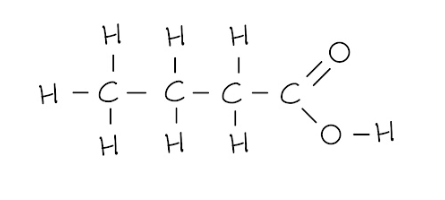
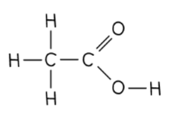
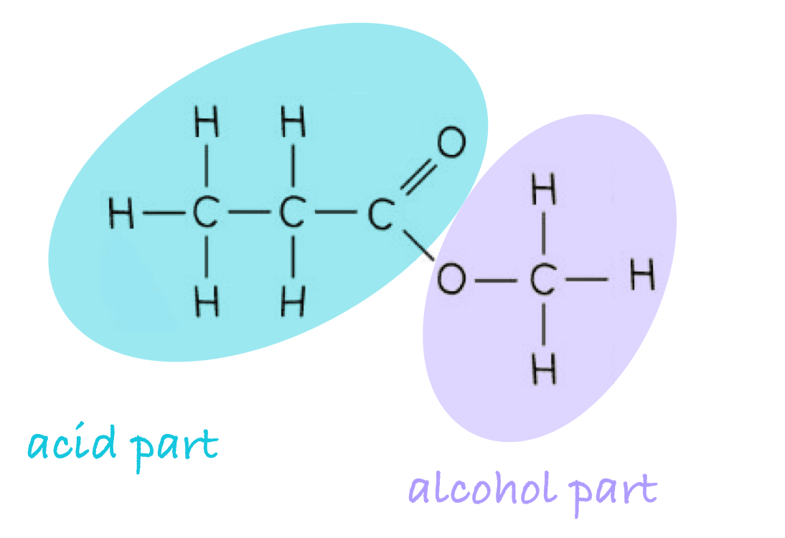
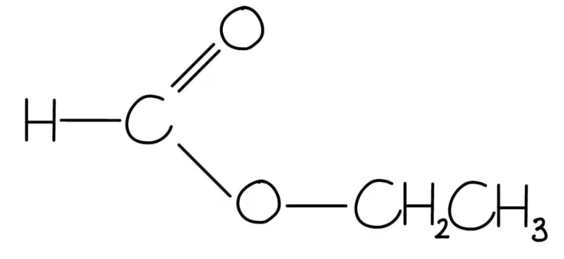
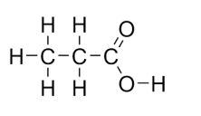
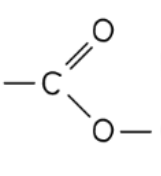
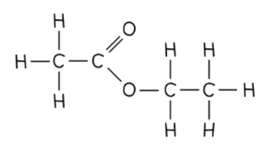
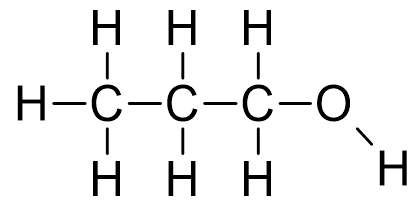
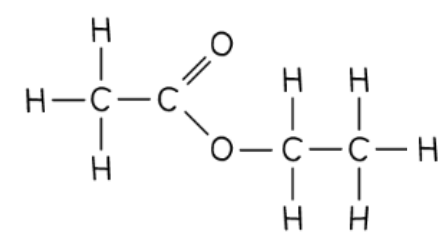

# Mark Schemes — Carboxylic acids
**8 Organic chemistry: Part 2** · Edexcel IGCSE Chemistry (Modular) (4XCH1) — 24/Unit 2

## Q1 — easy — 1 marks · exam-questions

### 1() — 1 marks
**Correct answer: D** — 

**Final answer:** **The correct answer is D**

- Carboxylic acids contain the functional group -COOH
- **A **is incorrect as this is the functional group of alkenes
- **B **is incorrect as this is the functional group of esters
- **C **is incorrect as this is the functional group of alcohols

## Q2 — easy — 1 marks · exam-questions

### 1() — 1 marks
**Final answer:** **The correct answer is A**

- **Formula 1** shows the actual number of atoms in a molecule of carboxylic acid; this is the molecular formula
- **Formula 2 **shows sufficient information to make the structure but the covalent bonds are missing; this is the structural formula
- **Formula 3** shows the spatial arrangement of all the atoms and bonds in a molecule; this is the displayed formula
- **B** is incorrect as formula 1 does not show sufficient information to make the structure
- **C **&** D** are incorrect as none of the formulae show the empirical formula

  - The empirical formula is the simplest possible ratio of the atoms in a molecule.
  - For example, ethanoic acid (C2H4O2) has the empirical formula CH2O

## Q3 — easy — 1 marks · exam-questions

### 1() — 1 marks
**Correct answer: C** — The type of acid

**Final answer:** **The correct answer is C**

- The experiment is to investigate how the time to collect 20 cm3 of hydrogen gas varies with different carboxylic acid solutions
- Therefore, the type of acid is the independent variable and should not be controlled
- While the mass of magnesium, volume and concentration of acid are control variables

## Q4 — easy — 5 marks · exam-questions

### 1() — 1 marks
**Correct answer: B** — propanoic acid

**Final answer:** **The correct answer is B**

- **Remember: **The prefix of the name indicates the number of carbon atoms present in an organic compound

  - 1= meth
  - 2= eth
  - 3= prop
  - 4= but
- Carboxylic acid **B** has 3 carbon atoms so it is propanoic acid

### 2() — 1 marks
**Correct answer: A** — vinegar

**Final answer:** **The correct answer is A**

- Ethanoic acid is used in vinegar
- This is the only use of a carboxylic acid you need to learn for the specification

### 3() — 2 marks
The two other products formed are:

- Water; **[1 mark]**
- Carbon dioxide;  **[1 mark]**

**[Total: 2 marks]**

- *Carboxylic acids react in the same way as any other type of acid:*

  - *metal carbonate + acid → salt + water + carbon dioxide*

### 4() — 1 marks
**Correct answer: B** — test: burning splint   result: squeaky pop sound

**Final answer:** **The correct answer is B**

- Make sure you learn this as it is easy to get them the wrong way around
- The test for oxygen is a glowing splint which will relight
- Carbon dioxide will extinguish a flame but this is outside of the specification

## Q5 — easy — 4 marks · exam-questions

### 1() — 1 marks
The structure of butanoic acid is:

- Correct structure; **[1 mark]**

**[Total: 1 mark]**

- *The question specifically says to include all bonds, so make sure you don't forget the one between the oxygen and hydrogen atom in the -OH group or you will not score the mark *
- *Remember: **The prefix of the carboxylic name indicates how many carbon atoms are present*

  - *meth = 1*
  - *eth = 2*
  - *prop = 3*
  - *but = 4*
  - *There are four carbon atoms within butanoic acid, including the one present in the -COOH group*

### 2() — 1 marks
Butanoic acid is an saturated compound because:

- It contains only single carbon-carbon bonds; **[1 mark]**

**[Total: 1 mark]**

- *S**aturated compounds have** S**ingle bonds only *
- *Don't be tempted to think butanoic acid is unsaturated because it has a double carbon oxygen bond*
- *Unsaturated compounds contain at least one double carbon-carbon bond*

### 3() — 1 marks
**Correct answer: B** — neutralisation

**Final answer:** **The correct answer is B**

- Carboxylic acids are involved in neutralisation reactions with metal carbonates and metals
- They are called neutralisation as in both cases, water is formed

### 4() — 1 marks
The word equation for this reaction is:

sodium +   butanoic acid   →    sodium butanoate +  hydrogen

- Sodium **AND** hydrogen; **[1 mark]**

**[Total: 1 mark]**

- *The general equation for the reaction between a metal and acid is:*

  - *metal + acid   salt + hydrogen *
  - *The first part of the salt name comes from the metal being reacted with the acid *

## Q6 — medium — 1 marks · exam-questions

### 1() — 1 marks
**Correct answer: D** — When it reacts with magnesium carbonate, fizzing is observed

**Final answer:** **The correct answer is D**

- When butanoic acid reacts with magnesium carbonate, a salt (magnesium butanoate), carbon dioxide and water are formed

  - Butanoic acid + magnesium carbonate → magnesium butanoate + carbon dioxide + water

- Carbon dioxide is a gas so fizzing is observed
- **A** is incorrect as when reacted with sodium hydroxide, a salt and water are formed
- **B** is incorrect as carbon dioxide would also be produced
- **C** is incorrect as hydrogen gas would be produced, not oxygen gas

## Q7 — medium — 8 marks · exam-questions

### 4((a)) — 3 marks
The completed boxes are:

| structural formula | CH3COOH |
|---|---|
| name | **ethanoic acid**;** [1 mark]** |
| **empirical formula**;** [1 mark]** | CH2O |
| displayed formula |   ; **[1 mark]** |

**[Total: 3 marks]**

- *The straight chain has 2 carbon atoms, so the prefix of the name is eth-*
- *The -COOH functional group tells you that it is a carboxylic acid so will have the suffix - oic acid*
- *Ethanoic acid used to be known as acetic acid, so this is also an acceptable answer*
- *Make sure you show all of the bonds when drawing the displayed formula, students sometimes forget to draw the bond between the O and H but if you do this, you will not gain the mark*

### 4((b)) — 3 marks
**Correct answer: B** — orange to green

The names of the two reagents used in this oxidation reaction are:

- Potassium dichromate(VI) / K2Cr2O7;** [1 mark]**
- Sulfuric acid / H2SO4; **[1 mark]**

ii) **The correct answer is B**

- Ethanol can be oxidised to ethanoic acid by aerobic oxidation where bacteria in the air use atmospheric oxygen from air to oxidise ethanol and by the use of an oxidising agent, such as potassium dichromate(VI)
- You do not need to give VI in the name to be awarded this first mark, and sodium dichromate is also an accepted answer as the chromate ions are what are required for the reaction

### 4((c)) — 2 marks
**Correct answer: C** — methyl propanoate

i) It is better to heat the mixture using a water bath rather than directly with a Bunsen burner flame because:

- Alcohols are flammable / might catch fire / might ignite 
**OR** 
Esters / mixture are flammable / might catch fire / might ignite 
**OR** 
Alcohol / ester / carboxylic acid might evaporate; **[1 mark]**

ii)  **The correct answer is C**

- The first response in part (i) is the expected response, as you should know that alcohols are flammable and apply this knowledge to why a Bunsen burner is not suitable
- Esters are formed from the reaction of a carboxylic acid with an alcohol
- The first part of the name of an ester comes from the alcohol used
- The second part of the name comes from the carboxylic acid

- The ester in part (ii) has 1 carbon in the alcohol part, so methanol was used
- The acid part has three carbon atoms, so propanoic acid was used
- The first part of the name of the ester indicates the length of the carbon chain in the alcohol, and it ends with the letters ‘- yl’

  - In this case, it is methyl
- The second part of the name indicates the length of the carbon chain in the carboxylic acid, and it ends with the letters ‘- oate’

  - In this case, it is propanoate

## Q8 — medium — 1 marks · exam-questions

### 1() — 1 marks
**Correct answer: C** — C2H4O

**Final answer:** **The correct answer is C**

- The molecular formula of butanoic acid is C4H8O2
- The empirical formula is the simplest whole number ratio of the atoms of each element present in one molecule
- For butanoic acid, the empirical formula is C2H4O
- **A** is incorrect as this is a structural type formula of butanoic acid
- **B** is incorrect as this is the molecular formula of butanoic acid
- **D** is incorrect as the number of oxygen atoms has not been halved

## Q9 — medium — 12 marks · exam-questions

### 8() — 2 marks
**Two **general characteristics of a homologous series are:

Any **two** from:

- (Same) general (molecular) formula; **[1 mark]**
- Same functional group; **[1 mark]**
- Consecutive members differ by –CH2; **[1 mark]**
- Common methods of preparation; **[1 mark]**
- Physical properties vary in a predictable way; **[1 mark]**
- Similar / same chemical properties; **[1 mark]**

**[Total: 2 marks]**

- *Remember: **Chemicals in a homologous series have the same general formula but are slightly different in terms of how they are produced, their actual structure and their chemical properties *

### 8() — 5 marks
i) The completed equation is:

**2**HCOOH + CaCO3 → Ca(HCOO)2 + **CO****2** + **H****2****O**

- Correct species; **[1 mark]**
- Correct balancing; **[1 mark]**

ii) The completed word equation is:

zinc + methanoic acid → **zinc methanoate** +** hydrogen**

- Zinc methanoate; **[1 mark]**
- Hydrogen; **[1 mark]**

iii) Methanoic acid does not react with an aluminium kettle because:

- (Aluminium is) protected by <u>oxide</u> layer;** [1 mark]**

**[Total: 5 marks]**

- *Carboxylic acids will undergo typical acidic reactions, so the general equations for acids will apply*

  - *metal carbonate + acid → salt + carbon dioxide + water*
  - *metal + acid → salt + hydrogen*
- *Carboxylic acids form salts which end in '-anoate'*
- *Aluminium will not react despite it being high in the reactivity series because it reacts readily with oxygen, forming a protective layer of aluminium oxide which is very thin *
- *This layer prevents reaction with water and dilute acids, so aluminium can behave as if it is unreactive*

### 3() — 2 marks
The displayed formula for the ester formed when methanoic acid reacts with ethanol is:

- Ester functional group;** [1 mark]**
- Rest of the structure correct; **[1 mark]**

**[Total: 2 marks]**

- *When methanoic acid reacts with ethanol, ethyl methanoate will form *
- *The first part of the ester name, ethyl, comes from the alcohol and the second part of the name, methanoate, comes from the carboxylic acid *
- *The functional group for an ester is -COO- which appears in the middle of the compound*
- *The carbon chain from the alcohol is joined to the oxygen atom of the -COO- group *
- *The carbon chain from the carboxylic acid includes the carbon atom in the functional group *

### 8() — 3 marks
The name, molecular formula and empirical formula of the fourth acid in this series are:

- Name: butanoic acid; **[1 mark]**
- Molecular formula: CH3CH2CH2CH2COOH / C4H8O2 / C3H7COOH / C4H7OOH;** [1 mark]**
- Empirical formula: C2H4O; **[1 mark]**

**[Total: 3 marks]**

- *The molecular formula is the formula that shows the number and type of each atom in a molecule*
- *The empirical formula is the simplest whole number ratio of the atoms of each element present in one molecule or formula unit of the compound*
- *If the number of all of the atoms in the molecular formula are all divisible by the same whole number, then you can simplify the molecular formula:*

  - *In C**4**H**8**O**2**, all the numbers can be divided by 2 to give the empirical formula of C**2**H**4**O*
- *If you have given the incorrect molecular formula but have deduced the correct empirical formula from it, you can score mark 3 *

## Q10 — medium — 9 marks · exam-questions

### 1() — 1 marks
**Correct answer: D** — It reacts with magnesium to form magnesium ethanoate

**Final answer:** **The correct answer is D**

- Ethanoic acid behaves like other acids and will react with a metal to form a salt and hydrogen
- A is incorrect as it will react with propanol to form propyl ethanoate

  - The first part of the ester name comes from the alcohol and the second part from the carboxylic acid
- B is incorrect as the molecular formula is C2H4O2
- C is incorrect as the general formula for carboxylic acids is CnH2n+1COOH
- To discount B and C, some students find it helpful to draw the displayed formula of the compound

### 2() — 3 marks
**Correct answer: C** — $\frac{4}{60}\times100$

i) The completed equation is:

C2H5OH + O2 → CH3COOH + H2O

- Left hand side; [1 mark]
- Right hand side; [1 mark]

ii) **The correct answer is C**

**[Total: 3 marks] **

- You are expected to know the formula for ethanol
- You are told in the question that the second product is water
- For part ii)

  - C is the only correct answer as there are 4 hydrogen atoms in a molecule of ethanoic acid, with a combined mass of 4 x 1 = 4
  - This should be divided by the total mass of ethanoic acid, which is 60
  - A is incorrect because there are four atoms of hydrogen in ethanoic acid
  - B is incorrect because there are four atoms of hydrogen in ethanoic acid
  - D is incorrect because the fraction is inverted and there are four atoms of hydrogen in ethanoic acid

### 3() — 3 marks
i) The structure of propanoic acid, showing all covalent bonds is:

- Correct carboxylic acid group; **[1 mark]**
- Correct ethyl group;** [1 mark]**

ii) A balanced symbol equation for the reaction between propanoic acid and sodium hydroxide is:

- C2H5COOH   +   NaOH    →     C3H5NaO2    +   H2O; **[1 mark]**

**[Total: 3 marks]**

- *You must be able to draw the displayed formula for the first four carboxylic acids in the homologous series *
- *Make sure all covalent bonds are shown, don't forget the one between the O and H atom of the OH group or you will not score mark 1 *
- *For part ii) you are given the information you need for the carboxylic acid and salt*
- *You are expected to know the formula for sodium hydroxide and water *
- *No further balancing is required once the equation has been written*

### 4() — 2 marks
A test that could be done to show that propanoic acid is acidic is:

Any pair from:

- (Add) universal indicator; **[1 mark]**
- Turns red / yellow / orange; **[1 mark]**

**OR**

- (Add) phenolphthalein; **[1 mark]**
- Turns colourless; **[1 mark]**

**OR**

- Add methyl orange;** [1 mark]**
- Turns red; **[1 mark]**

**OR**

- Add litmus;** [1 mark]**
- Turns red;** [1 mark]**

**OR**

- Use a pH probe; **[1 mark]**
- pH will be below 7; **[1 mark]**

**[Total: 2 marks]**

- *Carboxylic acids are weak acids so will have a pH below 7 *

## Q11 — medium — 9 marks · exam-questions

### 1() — 5 marks
i) To determine the molecular formula of the acid:

- Calculate the empirical mass:

empirical formula mass = (12 x 2) + (1 x 4) + 16

empirical formula mass = 44 **[1 mark]**

- Determine the multiple of the empirical mass:

multiple = $\frac{\mathrm{empirical} \mathrm{formula} \mathrm{mass}}{\mathrm{relative} \mathrm{formula} \mathrm{mass}}$

multiple= $\frac{88}{44}$= 2

- Deduce the molecular formula:

molecular formula = 2 x empirical formula

molecular formula = 2 x C2H4O

molecular formula = **C****4****H****8****O****2** **[1 mark]**

ii) The displayed formula of the carboxylic acid is:

**[1 mark]**

iii) The name of the acid is:

- Butanoic acid **[1 mark]**

iv) The ring to identify the functional group is:

**[1 mark]**

> **[exam-tip]**
> A **displayed formula** must show every single bond. If you write the alcohol group as -OH, instead of -O-H, it will cost you the mark.
> 
> The acids are all named according to the stem **alkanoic acid**. You need to learn the formulas of methanoic, ethanoic, propanoic, and butanoic acid.
> 
> The functional group for a carboxylic acid is the -COOH group. Make sure your circle includes the C=O double bond, the C-O single bond, and the O-H bond, but not the rest of the carbon chain.

### 2() — 4 marks
> **[mark-scheme]**
> i) When a small piece of magnesium ribbon is added to the carboxylic acid:
> 
> - The magnesium would dissolve / disappear
> **OR**
> The magnesium would get smaller **[1 mark]**
> - Bubbles are produced 
> **OR**
> Fizzing / effervescence is seen** [1 mark]**
> 
> ii) To identify the gaseous product:
> 
> - Place a lighted / burning splint into the gas** [1 mark]**
> - The gas will burn with a 'squeaky pop' 
> **OR** The gas makes a popping sound **[1 mark]**

> **[exam-tip]**
> Examiners will look for descriptions of what can be directly seen happening to the metal and the solution.
> 
> For example:
> 
> 1. "Hydrogen gas is produced"
> 
>   - This is an inference, not an observation.
>   - The observation is **bubbles of gas** are produced.
> 2. "The magnesium reacts"
> 
>   - You can't physically see the reaction, only signs of the chemical reaction.
>   - So, the observation would be that the magnesium is getting smaller / disappearing / dissolving.
> 
> Examiner reports consistently show that students lose marks by not describing the full test for a gas.
> 
> For example:
> 
> - "The squeaky pop test tests for hydrogen"
> 
>   - This does not describe how to do the test.
>   - It does not truly describe the positive outcome, it assumes that hydrogen creates the squeaky pop.
> - So, you must state both the method and the result:
> 
>   - **Method**
>   
>     - Use a **lighted** splint.
>     - A common mistake is to say "glowing splint", which is the test for oxygen.
>   - **Result**
>   
>     - You hear a **'squeaky pop'**.

## Q12 — hard — 8 marks · exam-questions

### 3((a)) — 3 marks
i) Two other variables the student should control in his investigation are:

Any **two **from:

- Volume of acid; **[1 mark]**
- Temperature;** [1 mark]**
- Mass / moles of magnesium; **[1 mark]**
- Surface area / size of pieces of magnesium; **[1 mark]**

ii) A reason why it is important to connect the gas syringe quickly is:

- So as little gas as possible / no gas escapes;** [1 mark]**

**[Total: 3 marks]**

- *In this investigation:*

  - *The independent variable is the type of carboxylic acid*
  - *The dependent variable is the time taken to produce 10 cm**3** of gas*
  - *All other variables are control variables and need to be controlled in order for it to be a fair test and produce valid results*
- *Careful: **The concentration of the acid is a control variable but not an answer for this question as you are told that the carboxylic acids are of the same concentration*

### 3((b)) — 3 marks
i) The mean (average) time for propanoic acid to produce 10 cm3 of hydrogen gas is:

- (69 + 70 + 71) ÷ 3;** [1 mark]**
- 70 (s); **[1 mark]**

ii) The relationship between the number of carbon atoms in the molecule and the time taken to produce 10 cm3 of hydrogen gas is:

- As the (number of) carbons increases, the time (to produce 10 cm3 of hydrogen) increases;** [1 mark]** 
*The reverse argument is accepted*

**[Total: 3 marks]**

- *When calculating the mean result, you must identify and exclude any anomalies from your calculation*

  - *In this case, the result for experiment 2 is anomalous as it does not fit the pattern of the other results, so this should not be included when calculating the mean*
- *Careful: **Some students will incorrectly put 162.7 as the answer *

  - *This comes from how they use the calculator, i.e. they type 69 + 70 + 71 ÷ 3*
  - *They should type (69 + 70 + 71) ÷ 3*
  - *They should also recognise that 162.7 is an impossible answer as it is not a value between the highest and lowest numbers used in the calculation*

### 3((c)) — 2 marks
The displayed formula of the ester produced when ethanoic acid reacts with ethanol is:

- Ester linkage as a displayed structure;** [1 mark]** 
- Rest of molecule correct as a fully displayed structure;** [1 mark]** 

**[Total: 2 marks]**

- *An ester is made from an alcohol and carboxylic acid*
- *The ester made from ethanol and ethanoic acid is ethyl ethanoate*
- *Both the alcohol and the carboxylic acid have 2 carbon atoms in their chain, so the corresponding ester will have 2 carbon atoms on either side of the ester linkage (including the carbon atom within the -COO- functional group)*

## Q13 — hard — 5 marks · exam-questions

### 1() — 1 marks
Compound **C **is:

- Ethyl ethanoate;** [1 mark]**

**[Total: 1 mark]**

- Ethyl ethanoate is an ester
- Esters have a -COO functional group and are formed from an alcohol reacting with a carboxylic acid
- Ethanol and ethanoic acid react to produce the ester, ethyl ethanoate and water:

  - CH3COOH + C2H5OH → CH3COOC2H5 + H2O
  - The first part of the ester name comes from the alcohol
  - The second part of the ester name comes from the carboxylic acid

- For exam purposes, you only need to know the name and recognise the structure of this particular ester

### 2() — 2 marks
The two products formed when compound **E** reacts with sodium are:

- Sodium ethanoate; **[1 mark]**
- Hydrogen; **[1 mark]**

**[Total: 2 marks]**

- *Compound **E** is ethanoic acid, a carboxylic acid*
- *Carboxylic acids behave the same way other acids do, so will react with a metal as follows:*

  - *Metal + acid → salt + hydrogen*

- *For this specific example, the following reaction happens:*

  - *Sodium + ethanoic acid → sodium ethanoate + hydrogen*

### 3() — 1 marks
The compound that reacts with compound **A **to produce compound **C** is:

- Compound **E **/ ethanoic acid; **[1 mark]**

**[Total: 1 mark]**

- *Compound **C** is the ester, ethyl ethanoate *
- *Ethyl ethanoate is formed by the reaction between ethanol (compound **A)** and ethanoic acid (compound **E) *
- *This reaction is called esterification and requires an acid catalyst, usually concentrated H**2**SO**4** *

### 4() — 1 marks
The compound which dissolves in water to form a neutral solution is:

- Compound **A**; **[1 mark]**

**[Total: 1 mark]**

- *Compound A is the alcohol, ethanol*
- *You would score the mark for stating this as your answer*
- *Ethanol is soluble in water due to the presence of the -OH group*
- *It dissolves to give a neutral solution, as do methanol, propanol and butanol however the solubility of alcohols decreases as the chain length increases*

## Q14 — hard — 9 marks · exam-questions

### 1() — 1 marks
**Correct answer: B** — C2H4O2

**Final answer:** **The correct answer is B**

- When an alcohol is oxidised using potassium dichromate (VII), a carboxylic acid is formed
- When ethanol is oxidised, ethanoic acid is formed

  - The structural formula for ethanoic acid is CH3COOH
  - The molecular formula for ethanoic acid is C2H4O2
- **A** is incorrect as this is the formula of propanoic acid
- **C** is incorrect as this is the formula for the ester, methyl methanoate
- **D** is incorrect as this is the molecular formula for ethanol

### 2() — 2 marks
The name and structural formula of **B **are:

- Name: Ethyl propanoate; **[1 mark]**
- Structural formula: CH3CH2COOCH2CH3 / C2H5COOC2H5; **[1 mark]**

**[Total: 2 marks]**

- *During esterification, the OH from the carboxylic acid is removed, leaving CH**3**CH**2**CO*
- *In the alcohol, the H in the OH group is removed, leaving CH**3**CH**2**O*
- *The OH and H form water*
- *The O in CH**3**CH**2**O joins the C of the C=O in CH**3**CH**2**CO*
- *The -COO- group is formed, which is the functional group of esters*
- *To name the ester:*

  - *The first part of the name indicates the length of the carbon chain in the alcohol, and it ends with the letters ‘- yl’*
  - *The second part of the name indicates the length of the carbon chain in the carboxylic acid, and it ends with the letters ‘- oate’*
  
    - *So, the ester formed from** eth**anol and **propan**oic acid is called **eth**yl **propan**oate*

### 3() — 3 marks
The balanced symbol equation for the reaction between propanoic acid and sodium carbonate is:

2CH3CH2COOH + Na2CO3 → 2CH3CH2COONa + H2O + CO2

- Correct reactants;** [1 mark]**
- Correct products; **[1 mark]**
- Correct balancing; **[1 mark]**

**[Total: 3 marks]**

- *Remember: **Acids (including carboxylic acids) react with metal carbonates to form a salt, water and carbon dioxide*
- *You should be able to deduce the formula of sodium carbonate:*

  - *Sodium has a 1+ charge and the carbonate ion, CO**3**2–**, has a 2- charge*
  - *For the charge on the compound to be neutral overall, 2 sodium ions are needed for every 1 carbonate ion*
  - *This gives the formula Na**2**CO**3*
- *In the reaction, the acid loses the H from the –COOH group, leaving the ethanoate ion, CH**3**CH**2**COO**–**, which has a 1- charge*

  - *Sodium has a 1+ charge, which means that 1 sodium is needed for every 1 ethanoate ion*
  - *This gives the formula CH**3**CH**2**COONa*

### 4() — 3 marks
The volume, in cm3, of hydrogen gas produced in this reaction is:

- Moles of CH3CH2COOH = 1.0 x $\frac{50}{1000}$ = 0.05 (mol);** [1 mark]**
- Moles of hydrogen produced = $\frac{0.05}{2}$ = 0.025 (mol); **[1 mark]**
- Volume of hydrogen gas produced = 0.025 x 24 000 = 600 (cm3); **[1 mark]**

**[Total: 3 marks]**

- *You need to use the equation: moles = concentration x volume (dm**3**) to find the moles of propanoic acid*

  - *Remember**: Convert to dm**3** by diving cm**3** by 1000*
- *The balanced symbol equation shows that 2 moles of propanoic acid produce 1 mole of hydrogen gas*

  - *So, 0.05 moles of propanoic acid will produce 0.05 ÷ 2 = 0.025 moles of hydrogen*
- *To find the volume of hydrogen gas, you should use the equation: volume (cm**3**) = 24 000 x moles*

## Q15 — hard — 19 marks · exam-questions

### 3() — 5 marks
i) The name and structural formula of the fourth member of this series are:

- Butanoic acid; **[1 mark]**
- CH3CH2CH2COOH / C3H7COOH; **[1 mark]**

ii) Three other characteristics of a homologous series are:

Any **three** from:

- (Same) general formula; **[1 mark]**
- (Consecutive members) differ by CH2; **[1 mark]**
- Same functional group; **[1 mark]**
- They have common methods of preparation;**[1 mark]**
- Physical properties vary in predictable manner / show trends / gradually change **OR** Example of a physical property variation i.e. melting point / boiling point / volatility; **[1 mark]**

**[Total: 5 marks]**

- *Butanoic acid is the IUPAC name for the acid but it is also sometimes referred to as butyric acid, which you would be awarded a mark for*
- *There are a number of different features in common across members of the same homologous series, try to recall a range of physical and chemical ones so that you can answer whatever style of question is given to you*

### 3() — 3 marks
i) The structural formula of the alcohol which can be oxidised to propanoic acid is:

- Displayed formula of propan-1-ol, all bonds shown separately; **[1 mark]**

ii) A reagent, other than oxygen, which can oxidise alcohols to carboxylic acid:

- Acidified; **[1 mark]**
- Potassium dichromate(VI) / potassium dichromate / K2Cr2O7 
**OR **
Potassium manganate(VII) / potassium permanganate / KMnO4; **[1 mark]**

**[Total: 3 marks]**

- *Propanoic acid has to be formed from a primary alcohol, and the oxidation of alcohols does not involve chain lengthening, so the alcohol has to be propan-1-ol*
- *Strong oxidising agents such as manganate or dichromate ions can be used for this reaction, but both have to be acidified in order to work. The more common reagent is potassium dichromate(VI)*

### 3() — 4 marks
The completed equations are:

i)

- Zinc + propanoic acid → **zinc propanoate** (+ hydrogen); **[1 mark]**

ii)

- Calcium oxide + propanoic acid → **calcium propanoate** **+ wate**r;** [1 mark]**

iii)

- LiOH + CH3CH2COOH → **CH****3****CH****2****COOLi** + **H****2****O**; **[1 mark]**

iii)

- **1**CaCO3 + **2**C2H5COOH → **(C****2****H****5****COO)****2****Ca** + **CO****2**** **+ **H****2****O**; **[1 mark]**

**[Total: 4 marks]**

- *The reactions between organic acids and bases follow the same pattern as the reactions of inorganic acids do*
- *To name the salt, the metal comes first and then the 'surname' from the organic acid, with an ending of -ate added*

  - *Propanoic acid forms propanoate salts*
- *In part iv), when acids react with metal carbonates, a salt, carbon dioxide and water are formed*
- *Calcium has a 2+ charge and the propanoate, ion, C**2**H**4**COO**–**, has a 1– charge*

  - *Therefore, calcium propanoate needs two propanoate ions for every calcium ion*
- *When balancing, you can either show the 1 in front of the CaCO**3** or leave this blank*

### 3() — 7 marks
i) The rate in experiment **C** is slower than the rate in experiment **A** as:

- Concentration (of acid in **C**) is less / halved or concentration of **A** is more / doubled; **[1 mark]**
- Less frequent collisions in **C** / more frequent collisions in **A** (than in **C**);** [1 mark]**

ii) The rate in experiment **B** is faster than the rate in experiment **A **as:

- Higher temperature in **B** particles / molecules / atoms move faster/ have more energy / more have Ea **OR** Particles / molecules / atoms in **A** move slower / have less energy / less have Ea; **[1 mark]**
- More frequent collisions in reaction **B** / less frequent collisions in **A** (than in** B**); **[1 mark]**

iii) The rate in experiment **D** is faster than the rate in experiment **A** as:

- It (**D**) has strong (acid) and **A** has weak acid / (**D**) stronger / (**D**) ionises more / (**D**) dissociates more **OR** **A** is weaker / **A** ionises less / **A** dissociates less; **[1 mark]**
- It (**D**) has a higher concentration of hydrogen ions / **A** has a lower concentration of hydrogen ions; **[1 mark]**
- More frequent collisions (in **D**) or fewer collisions in **A**; **[1 mark]**

**[Total: 7 marks]**

- *The frequency of the collisions is key to rate; more frequent collisions that arise as a result of increased concentration, surface area, temperature or pressure will all increase the rate*
- *Temperature also increases the energy of the particles and therefore the number of collisions that has enough energy to successfully react*
- *Stronger acids have greater concentrations of H**+** available, and therefore this acts in the same way as increasing the concentration of any other reactant*

## Q16 — hard — 13 marks · exam-questions

### 5() — 3 marks
The correct equations are:

Mg + **2**CH3COOH →** (CH****3****COO)****2****Mg** + **H****2**

- Correct formula of magnesium ethanoate; **[1 mark]**
- Rest of the equation correct **AND **Correct balancing;** [1 mark]**

Sodium hydroxide + ethanoic acid → **sodium ethanoate **+ **water**

- Sodium ethanoate **AND **Water; **[1 mark]**

**[Total: 3 marks]**

- *Ethanoic acid will react with metals and alkalis according to the general equations of acids:*

  - *Metal + acid → salt + hydrogen*
  - *Acid + alkali → salt + water*
- *The ethanoate ion, CH**3**COO**–** has a 1– charge and Mg has a 2+ charge*

  - *So, 2 ethanoate ions are needed for every 1 magnesium ion*
- *Ethanoic acid produces ethanoates, which is given in the question*

  - *So, the name of the salt it produces will take the first part of its name from the metal in the alkali, sodium, and the second part of its name is ethanoate*

### 5() — 2 marks
The name of the ester and its structural formula showing all bonds are:

- Ethyl ethanoate; **[1 mark]**

- Correct displayed formula with all bonds showing; **[1 mark]**

**[Total: 2 marks]**

- *When naming esters, the first part of the name indicates the length of the carbon chain in the alcohol, and it ends with the letters ‘- yl’*
- *The second part of the name indicates the length of the carbon chain in the carboxylic acid, and it ends with the letters ‘- oate’*

  - *In this case, the ester formed from** eth**anol and **ethan**oic acid is called **eth**yl **ethan**oate*
- *Ensure you show all of the bonds in the displayed formula*

### 5() — 6 marks
i) You know that the acid contained only carbon, hydrogen and oxygen because:

- Their masses add up to 5.8 g; **[1 mark]**

ii) The empirical formula of maleic acid is calculated by:

Calculations:

Number of moles of carbon atoms = 0.2    Number of moles of hydrogen atoms = 0.2    Number of moles of oxygen atoms = 0.2

- All three moles calculations correct; **[2 marks]**
- Two moles calculations correct; **[1 mark]**

Empirical formula:

- CHO; **[1 mark]**

iii) To determine the molecular formula of maleic acid:

- Mass of CHO = 29 **AND **$\frac{116}{29}$ = 4; **[1 mark]**
- So, the molecular formula is C4H4O4; **[1 mark]**

**[Total: 6 marks]**

- *To calculate the empirical formula:*

| > * * | > *C* | > *H* | > *O* |
|---|---|---|---|
| > *Calculate the number of moles of each element (mass/**M**r**)* | $\frac{2.4}{12}=0.2$ | $\frac{0.2}{1}=0.2$ | $\frac{3.2}{16}=0.2$ |
| > *Divide by the smallest number to find the smallest ratio* | > * *$\frac{0.2}{0.2}$* = 1* | > $\frac{0.2}{0.2}$* = 1 * | > $\frac{0.2}{0.2}$* = 1 * |

- *The empirical formula is therefore CHO*
- *The **M**r** of the empirical formula is 12 + 1 + 16 = 29*
- *The** M**r** of the compound is 116 ÷29 = 4 *

  - *This means that there are 4 CHO fragments in the overall compound *
  - *Therefore, the molecular formula of maleic acid must contain 4 times the number of atoms than appears in the empirical formula*

### 5() — 2 marks
The structural formula of maleic acid is:

HOOCCH=CHCOOH / CH2=C(COOH)2

- Double bond present; **[1 mark]**
- Correct number of C, H and O atoms **AND **The rest of the structural formula correct;** [1 mark]**

**[Total: 2 marks]**

- *As maleic acid is dibasic, it must contain 2 -COOH groups so that it can donate 2 moles of H**+** ions for every 1 mole of acid*
- *The **M**r ** of the two  -COOH groups is 2 x (12 + (2 x 16) + 1) = 90*
- *This leaves 116 - 90 = 26*
- *This value must come from C and H atoms*
- *This must be from 2 C atoms and 2 H atoms: (2 x 12) + (2 x 1) = 26*
- *This means that maleic acid must contain a double bond*

  - *Otherwise there would be 2 more hydrogen atoms present*
