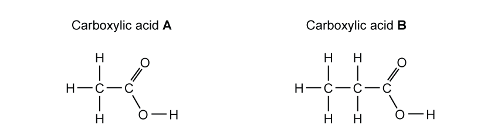
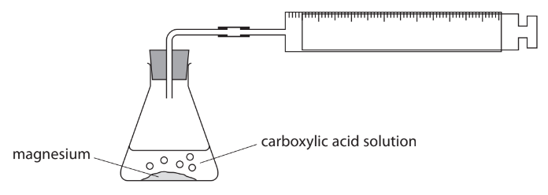

# Exam Questions — Carboxylic acids
**8 Organic chemistry: Part 2** · Edexcel IGCSE Chemistry (Modular) (4XCH1) — 24/Unit 2
> Source: [https://www.savemyexams.com/igcse/chemistry/edexcel/modular/24/unit-2/topic-questions/organic-chemistry/carboxylic-acids/exam-questions/](https://www.savemyexams.com/igcse/chemistry/edexcel/modular/24/unit-2/topic-questions/organic-chemistry/carboxylic-acids/exam-questions/) · 16 questions · total 106 marks

## Q1 — easy — 1 marks · exam-questions

### 1() — 1 mark — multiple_choice
#### Separate: Chemistry Only

Ethanoic acid is a member of the homologous series of carboxylic acids.

Which is the functional group of carboxylic acids?
- **A.** 
- **B.** 
- **C.** 
- **D.** 

## Q2 — easy — 1 marks · exam-questions

### 1() — 1 mark — command: what — structured
#### Separate: Chemistry Only

The formula for ethanoic acid can be written in different ways:

What are the correct names for the different ways to represent formulae?

|   |   | ** ** | **Formula 1** | **Formula 2** | **Formula 3** |
|---|---|---|---|---|---|
|   | ☐ | **A** | molecular formula | structural formula | displayed formula |
|   | ☐ | **B** | structural formula | molecular formula | displayed formula |
|   | ☐ | **C** | molecular formula | empirical formula | structural formula |
|   | ☐ | **D** | empirical formula | structural formula | molecular formula |

## Q3 — easy — 1 marks · exam-questions

### 1() — 1 mark — multiple_choice
#### Separate: Chemistry Only

Solutions of carboxylic acids react with magnesium to form a salt and hydrogen gas.

Using the apparatus and method below, a student investigates how the time to collect 20 cm3 of hydrogen gas varies with different carboxylic acid solutions.

**Method:**

- pour the carboxylic acid solution into a conical flask
- add some magnesium into the carboxylic acid solution
- immediately connect the gas syringe and start a timer
- record the time taken to collect 20 cm3 of hydrogen gas
- repeat for different carboxylic acid solutions

Which of the following is **not **a variable that should be controlled?
- **A.** The mass of magnesium
- **B.** The volume of acid
- **C.** The type of acid
- **D.** The concentration of acid

## Q4 — easy — 5 marks · exam-questions

### 1() — 1 mark — multiple_choice
#### Separate: Chemistry Only

The structures of two carboxylic acids are shown below.

What is the name of carboxylic acid **B**?
- **A.** butanoic acid
- **B.** propanoic acid
- **C.** ethanoic acid
- **D.** methanoic acid

### 2() — 1 mark — multiple_choice
#### Separate: Chemistry Only

Give one use of carboxylic acid **A**.
- **A.** vinegar
- **B.** fuel
- **C.** smelling salts
- **D.** polymer

### 3() — 2 marks — command: name — structured
#### Separate: Chemistry Only

Both carboxylic acids **A** and **B **can react with metal carbonates to produce a salt and **two** other products.  Name the two other products formed.

### 4() — 1 mark — multiple_choice
Carboxylic Acids A and B will also react with metals to form hydrogen gas.  Which row in the table correctly shows the test and result for this gas?
- **A.** test: glowing splint   result: relights
- **B.** test: burning splint   result: squeaky pop sound
- **C.** test: glowing splint   result: squeaky pop sound
- **D.** test: burning splint   result: flame extinguished

## Q5 — easy — 4 marks · exam-questions

### 1() — 1 mark — command: complete — structured
#### Separate: Chemistry Only

Butanoic acid belongs to the homologous series carboxylic acids.

Complete the structure of butanoic showing all bonds.

### 2() — 1 mark — command: explain — structured
Explain why butanoic acid is a saturated compound.

### 3() — 1 mark — multiple_choice
#### Separate: Chemistry Only

Butanoic acid can react with magnesium carbonate to form a salt, carbon dioxide and water.  What type of reaction is this?
- **A.** thermal decomposition
- **B.** neutralisation
- **C.** combustion
- **D.** endothermic

### 4() — 1 mark — command: complete — structured
#### Separate: Chemistry Only

Butanoic acid can also react with a metal.

Complete the word equation for this reaction.

__________  +   butanoic acid   →    sodium butanoate +  ____________

## Q6 — medium — 1 marks · exam-questions

### 1() — 1 mark — multiple_choice
#### Separate: Chemistry Only

Butanoic acid behaves like other acids.

Which is the correct statement about the reactions of butanoic acid?
- **A.** It reacts with sodium hydroxide in a neutralisation reaction to form a salt and hydrogen gas
- **B.** In a reaction with calcium carbonate, a salt and water are formed
- **C.** It reacts with calcium to form a salt and oxygen gas
- **D.** When it reacts with magnesium carbonate, fizzing is observed

## Q7 — medium — 8 marks · exam-questions

### 4((a)) — 3 marks — command: complete — structured — from paper 2022 · Ja2CR
#### Separate: Chemistry Only

This question is about alcohols, carboxylic acids and their reactions.

The boxes give some information about a carboxylic acid. Complete the boxes by giving the missing information.

| structural formula | CH3COOH |
|---|---|
| name |   |
|   | CH2O |
| displayed formula |   |

### 4((b)) — 3 marks — multiple_choice — from paper 2022 · Ja2CR
#### Separate: Chemistry Only

Ethanol can be oxidised to produce a carboxylic acid.

i) Give the names of the two reagents used in this oxidation reaction.

(2)

1. .............................................................. 
2. ..............................................................

ii) Which of these colour changes occurs during the reaction?

(1)
- **A.** green to orange
- **B.** orange to green
- **C.** red to yellow
- **D.** yellow to red

### 4((c)) — 2 marks — multiple_choice — from paper 2022 · Ja2CR
#### Separate: Chemistry Only

Alcohols and carboxylic acids can be heated together to form esters.

i) State why it is better to heat the mixture using a water bath rather than directly with a Bunsen burner flame.

(1)

ii) An ester has the structural formula CH3CH2COOCH3 Which of these is the name of this ester?

(1)
- **A.** ethyl methanoate
- **B.** methyl ethanoate
- **C.** methyl propanoate
- **D.** propyl methanoate

## Q8 — medium — 1 marks · exam-questions

### 1() — 1 mark — multiple_choice
What is the empirical formula of butanoic acid?
- **A.** C3H7COOH
- **B.** C4H8O2
- **C.** C2H4O
- **D.** C2H4O2

## Q9 — medium — 12 marks · exam-questions

### 8() — 2 marks — command: give — structured — from paper 2010 · Ju31
Methanoic acid is the first member of the homologous series of carboxylic acids.

Give** **two general characteristics of a homologous series.

### 8() — 5 marks — command: multiple — structured — from paper 2010 · Ju31
#### Separate: Chemistry Only

In some areas when water is boiled, the inside of kettles become coated with a layer of calcium carbonate. This can be removed by adding methanoic acid.

i) Complete the equation.

............ HCOOH + CaCO3 → Ca(HCOO)2 + ................. + .................

(2)

ii) Methanoic acid reacts with most metals above hydrogen in the reactivity series. Complete the word equation.

zinc + methanoic acid → ............................................ + ............................................

(2)

iii) Aluminium is also above hydrogen in the reactivity series. Why does methanoic acid not react with an aluminium kettle?

(1)

### 3() — 2 marks — command: draw — structured
#### Separate: Chemistry Only

Draw the displayed formula for the ester formed when methanoic acid reacts with ethanol.

### 8() — 3 marks — command: give — structured — from paper 2010 · Ju31
#### Separate: Chemistry Only

Give the name, molecular formula and empirical formula of the fourth acid in this series.

name ...........................................................................................................................

(1)

molecular formula .......................................................................................................

(1)

empirical formula ........................................................................................................

(1)

## Q10 — medium — 9 marks · exam-questions

### 1() — 1 mark — multiple_choice
#### Separate: Chemistry Only

Ethanoic acid is a carboxylic acid used in vinegar.

Which of these statements is true about ethanoic acid?
- **A.** It reacts with propanol to form ethyl propanoate
- **B.** Its molecular formula is C2H5O2
- **C.** It follows the general formula CnH2nCOOH
- **D.** It reacts with magnesium to form magnesium ethanoate

### 2() — 3 marks — multiple_choice
#### Separate: Chemistry only

When a bottle of wine is left open, ethanoic acid and water can form as a result of ethanol reacting with the oxygen in the air.

i) Complete the equation for this reaction.

......................  +   O2. →    CH3COOH   + ........................

(2)

ii) Which calculation shows the percentage by mass of hydrogen in ethanoic acid?

(*A*r of hydrogen, H = 1, *M*r of ethanoic acid, CH3COOH = 60)

(1)
- **A.** $\frac{1}{60}\times100$
- **B.** $\frac{3}{60}\times100$
- **C.** $\frac{4}{60}\times100$
- **D.** $\frac{60}{1}\times100$

### 3() — 3 marks — command: multiple — structured
#### Separate: Chemistry Only

Propanoic acid, C2H5COOH,  belongs to the same homologous series as ethanoic acid.

It can react with sodium hydroxide to form sodium propanoate, C3H5NaO2 and water.

i) Draw the structure of a molecule of propanoic acid, showing all covalent bonds.

(2)

ii) Write a balanced symbol equation for the reaction between propanoic acid and sodium hydroxide.

(1)

### 4() — 2 marks — command: describe — structured
Describe a chemical test that could be done to show that propanoic acid is acidic.

## Q11 — medium — 9 marks · exam-questions

### 1() — 5 marks — command: multiple — structured
This question is about carboxylic acids and esters.

A carboxylic acid has the empirical formula C2H4O.

The relative formula mass of the acid is *M**r *= 88.

i) Determine the molecular formula of the acid.

[2]

ii) Draw the displayed formula of the carboxylic acid.

[1]

iii) Name the acid.

[1]

iii) Draw a ring around the functional group.

[1]

### 2() — 4 marks — command: describe — structured
i) Describe what you would see when a small piece of magnesium ribbon is added to a solution of the carboxylic acid.

[2]

ii) Describe how you would identify any gaseous products.

[2]

## Q12 — hard — 8 marks · exam-questions

### 3((a)) — 3 marks — command: multiple — structured — from paper 2021 · Ja2C
This question is about carboxylic acids. Solutions of carboxylic acids react with magnesium metal to form hydrogen gas. A student uses this apparatus to investigate the time taken to produce 10 cm3 of hydrogen gas from different carboxylic acids.

This is the student’s method.

- pour some carboxylic acid solution into a conical flask
- add some magnesium powder
- quickly connect the gas syringe and start a timer
- record the time taken to collect 10 cm3 of hydrogen gas

The student repeats the method with three other carboxylic acids.

i) All the carboxylic acids are of the same concentration. Give two other variables the student should control in his investigation.

(2)

ii) Give a reason why it is important to connect the gas syringe quickly.

(1)

### 3((b)) — 3 marks — command: multiple — structured — from paper 2021 · Ja2C
The table shows the student’s results.

| ** ** | ** ** | **Time taken to produce 10 cm****3**** of hydrogen in s** |   |   |   |   |
|---|---|---|---|---|---|---|
| **Carboxylic** **acid** | **Formula of** **carboxylic acid** | **Experiment** **1** | **Experiment** **2** | **Experiment** **3** | **Experiment** **4** | **Mean** **time** |
| Methanoic acid | HCOOH | 48 | 50 | 47 | 49 | 49 |
| Ethanoic acid | CH3COOH | 61 | 63 | 60 | 61 | 61 |
| Propanoic acid | CH3CH2COOH | 69 | 93 | 70 | 71 |   |
| Butanoic acid | CH3CH2CH2COOH | 83 | 85 | 82 | 81 | 83 |

i) Calculate the mean (average) time for propanoic acid to produce 10 cm3 of hydrogen gas.

(2)

mean time = ............................................................................. s

ii) Deduce the relationship between the number of carbon atoms in the molecule and the time taken to produce 10 cm3 of hydrogen gas.

(1)

### 3((c)) — 2 marks — command: give — structured — from paper 2021 · Ja2C
#### Separate: Chemistry Only

An ester is formed by adding ethanoic acid to ethanol in the presence of sulfuric acid. Give the displayed formula of the ester produced when ethanoic acid reacts with ethanol.

## Q13 — hard — 5 marks · exam-questions

### 1() — 1 mark — command: name — structured
#### Separate: Chemistry Only

This question is about the reactions of organic compounds **A - E** shown in **Figure 1. **

**Figure 1 **

** **

Name compound **C. **

### 2() — 2 marks — command: name — structured
#### Separate: Chemistry Only

Name the two products formed when **E** reacts with sodium.

### 3() — 1 mark — command: which — structured
#### Separate: Chemistry Only

Which compound reacts with compound **A** to produce compound **C**?

### 4() — 1 mark — command: which — structured
#### Separate: Chemistry Only

Which compound dissolves in water to produce a neutral solution?

## Q14 — hard — 9 marks · exam-questions

### 1() — 1 mark — multiple_choice
#### Separate: Chemistry Only

Alcohol **A** has the structural formula, CH3CH2OH.

Which product is formed when alcohol **A** is oxidised using acidified potassium dichromate (VII)?
- **A.** CH3CH2COOH
- **B.** C2H4O2
- **C.** HCOOCH3
- **D.** C2H6O

### 2() — 2 marks — command: give — structured
#### Separate: Chemistry Only

When alcohol **A** reacts with propanoic acid, an ester, **B** is formed.

CH3CH2OH + CH3CH2COOH → **B** + H2O

Give the name and structural formula of **B**.

| Name | ............................................................................ |
|---|---|
| Structural formula | ............................................................................ |

### 3() — 3 marks — command: write — structured
#### Separate: Chemistry Only

Propanoic acid reacts with sodium carbonate.

Write the balanced symbol equation for the reaction.

### 4() — 3 marks — command: calculate — structured
#### Separate: Chemistry Only

Propanoic acid also reacts with magnesium

2CH3CH2COOH (aq) + Mg (s) → (CH3CH2COO)2Mg (aq)  + H2 (g)

An excess of magnesium was added to 50 cm3 of 1.0 mol / dm3 and the hydrogen gas produced was collected in a gas syringe.

Calculate the volume, in cm3, of hydrogen gas produced in this reaction.

Volume of hydrogen gas collected .................................................... cm3

## Q15 — hard — 19 marks · exam-questions

### 3() — 5 marks — command: multiple — structured — from paper 2015 · Oc23
#### Separate: Chemistry Only

Propanoic acid is a carboxylic acid. Its formula is CH3–CH2–COOH.

i) Propanoic acid is the third member of the homologous series of carboxylic acids.

Give the name and structural formula of the fourth member of this series.

Name ..............................................................

Formula ..............................................................

(2)

ii) Members of a homologous series have very similar chemical properties.

State **three **other characteristics of a homologous series.

(3)

### 3() — 3 marks — command: multiple — structured — from paper 2015 · Oc32
#### Separate: Chemistry Only

Carboxylic acids can be made by the oxidation of alcohols.

i) Draw the structural formula of the alcohol which can be oxidised to propanoic acid. Show all atoms and bonds.

(1)

ii) Name a reagent, other than oxygen, which can oxidise alcohols to carboxylic acids.

(2)

### 3() — 4 marks — command: multiple — structured — from paper 2015 · Oc32
#### Separate: Chemistry Only

Complete the following equations for some of the reactions of propanoic acid.

i) Zinc + propanoic acid → .................. .................. + hydrogen

(1)

ii) Calcium oxide + propanoic acid → .................. + ..................

(1)

iii) LiOH + CH3CH2COOH →  .................. + ..................

(1)

iv) ......CaCO3 + ......C2H5COOH →  .................. + .................. +  ..................

(1)

### 3() — 7 marks — command: explain — structured — from paper 2015 · Oc32
A piece of magnesium was added to 100 cm3 of an aqueous acid. The time taken for the metal to react completely was measured.

This experiment was repeated using different aqueous acids. The same volume of acid was used in each experiment and the pieces of magnesium used were identical.

In one experiment the reaction was carried out at a different temperature.

| **experiment** | **acid** | **concentration in mol/dm****3** | **temperature / °C** | **time / seconds** |
|---|---|---|---|---|
| **A** | propanoic | 1.0 | 20 | 300 |
| **B** | propanoic | 1.0 | 30 | 180 |
| **C** | propanoic | 0.5 | 20 | 480 |
| **D** | hydrochloric | 1.0 | 20 | 60 |

Explain the following in terms of collision rate between reacting particles.

i) Why is the rate in experiment **C** slower than the rate in experiment **A**?

(2)

ii) Why is the rate in experiment **B** faster than the rate in experiment **A**?

(2)

iii) Why is the rate in experiment **D** faster than the rate in experiment **A**?

(3)

## Q16 — hard — 13 marks · exam-questions

### 5() — 3 marks — command: complete — structured — from paper 2010 · O33
#### Separate: Chemistry Only

Carboxylic acids contain the group

Ethanoic acid is a typical carboxylic acid. It forms ethanoates.

Complete the following equations.

Mg + ......CH3COOH → ............................... + ...............................

(2)

sodium hydroxide + ethanoic acid → ........................  ........................ + ........................

(1)

### 5() — 2 marks — command: draw — structured — from paper 2010 · O33
#### Separate: Chemistry Only

Ethanoic acid reacts with ethanol to form an ester. Give the name of the ester and draw its displayed formula. Show all of the bonds.

### 5() — 6 marks — command: multiple — structured — from paper 2010 · O33
Maleic acid is an unsaturated acid. 5.8 g of this acid contained 2.4 g of carbon, 0.2 g of hydrogen and 3.2 g of oxygen.

i) How do you know that the acid contained only carbon, hydrogen and oxygen?

(1)

ii) Calculate the empirical formula of maleic acid.   Number of moles of carbon atoms = ................................

Number of moles of hydrogen atoms = ................................

Number of moles of oxygen atoms = ................................

The empirical formula is ......................................................................................

(3)

iii) The mass of one mole of maleic acid is 116 g. What is its molecular formula?

(2)

### 5() — 2 marks — command: deduce — structured — from paper 2010 · O33
#### Separate: Chemistry Only

Maleic acid is dibasic. One mole of acid produces two moles of H+. Deduce its structural formula.
