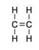
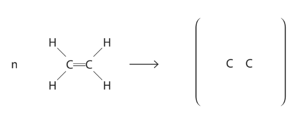
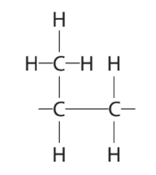
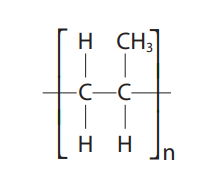
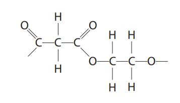
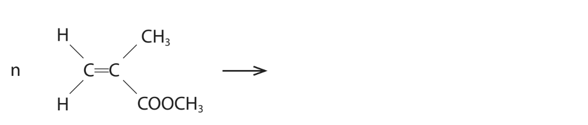
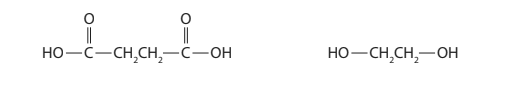
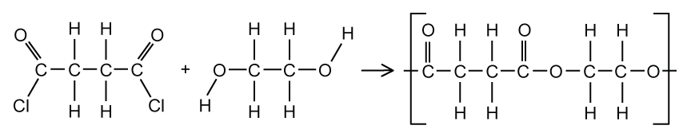
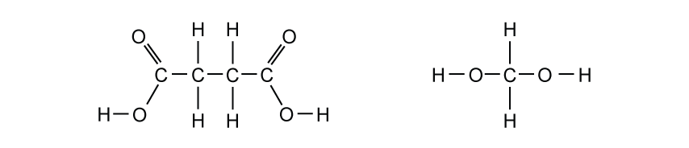
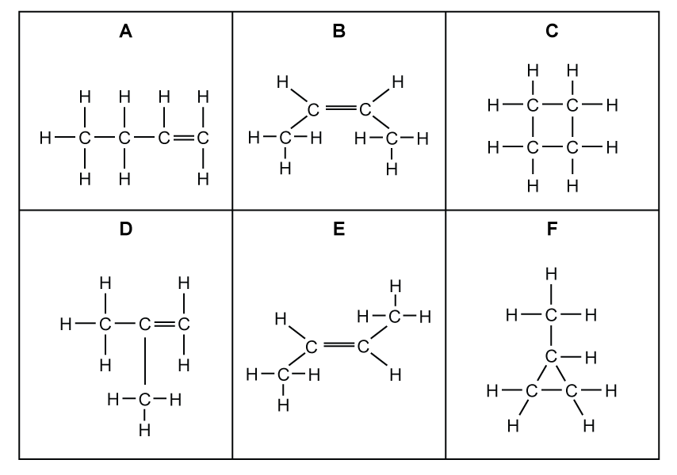

# Exam Questions — Synthetic polymers
**8 Organic chemistry: Part 2** · Edexcel IGCSE Chemistry (Modular) (4XCH1) — 24/Unit 2
> Source: [https://www.savemyexams.com/igcse/chemistry/edexcel/modular/24/unit-2/topic-questions/organic-chemistry/synthetic-polymers/exam-questions/](https://www.savemyexams.com/igcse/chemistry/edexcel/modular/24/unit-2/topic-questions/organic-chemistry/synthetic-polymers/exam-questions/) · 15 questions · total 99 marks

## Q1 — easy — 1 marks · exam-questions

### 1() — 1 mark — multiple_choice
Why do addition polymers not biodegrade easily?
- **A.** They are inert
- **B.** They contain ionic bonding
- **C.** They are unsaturated molecules
- **D.** They have high density

## Q2 — easy — 1 marks · exam-questions

### 1() — 1 mark — multiple_choice
Which of the following statements about polymers is **NOT **correct?
- **A.** Polymers can be recycled but it is a difficult and expensive process
- **B.** Addition polymers are unsaturated as they are made by combining molecules which contain a carbon double bond
- **C.** Poly(ethene) is formed by the addition polymerisation of ethene monomers
- **D.** Incinerating polymers contributes to climate change

## Q3 — easy — 1 marks · exam-questions

### 1() — 1 mark — multiple_choice
The structure of a polymer is shown below.

What is the correct monomer?

- **A.** 
- **B.** 
- **C.** 
- **D.** 

## Q4 — easy — 1 marks · exam-questions

### 1() — 1 mark — multiple_choice
Which statement is the correct description of a polymer?
- **A.** The atoms within a monomer
- **B.** A large saturated hydrocarbon
- **C.** A large molecule made from many small molecules
- **D.** A large unsaturated molecule

## Q5 — easy — 8 marks · exam-questions

### 1() — 1 mark — command: why — structured
This question is about ethene, the structure of which is shown below**. **

Why is this molecule described as **unsaturated?**

### 2() — 3 marks — command: complete — structured
Ethene can undergo a polymerisation reaction.

Complete the sentences using the words in the box.

| \| high \| poly(ethene) \| polymers \| poly(ethane) \| \|---\|---\|---\|---\|  \| ten \| monomers \| a few \| many \| \|---\|---\|---\|---\| |
|---|

During polymerisation, ____________________ ethene molecules join together to form the large molecule, __________________.

These large molecules are called ___________________

### 3() — 2 marks — command: complete — structured
Complete the repeat unit of the polymer formed by ethene.

### 4() — 1 mark — command: tick — structured
#### Separate: Chemistry Only

Poly(ethene) is an addition polymer. Polyesters are a different type of polymer that form from two monomers and produce water.

Tick (**✓**) one box to show what type of polymer polyesters form.

| Condensation |   |
|---|---|
| Addition |   |
| Substitution |   |

### 5() — 1 mark — command: give — structured
#### Separate: Chemistry Only

Biopolyesters are a specific type of polyester that are synthesised from sugar and plant oils.

Give an advantage of using biopolyesters instead of synthetic polyesters.

## Q6 — medium — 1 marks · exam-questions

### 1() — 1 mark — multiple_choice
The following molecule can undergo addition polymerisation.

What is the correct repeat unit?

- **A.** 
- **B.** 
- **C.** 
- **D.** 

## Q7 — medium — 13 marks · exam-questions

### 6((a)) — 3 marks — command: show — structured — from paper 2019 · Ju1CR
Poly(chloroethene) is a polymer.

It is made from its monomer, chloroethene.

Chloroethene has the percentage composition by mass

C = 38.4%      H = 4.8%      Cl = 56.8%

Show, by calculation, that the empirical formula of chloroethene is C2H3Cl

### 5((b)) — 5 marks — command: multiple — structured — from paper 2019 · Ju1CR
The molecular formula of chloroethene is also C2H3Cl

Chloroethene can be prepared by a two‐stage process.

In stage 1, ethene reacts with chlorine in the presence of an iron(III) chloride catalyst to form dichloromethane.

The reaction is exothermic.

C2H4 + Cl2 → C2H4Cl2

i) Give the formula of iron(III) chloride.

(1)

ii) State the purpose of using a catalyst.

(1)

iii) State the meaning of the term **exothermic**.

(1)

iv) What type of reaction occurs in stage 1 between ethene and chlorine?

|   | ☐ | **A** | addition |
|---|---|---|---|
|   | ☐ | **B** | displacement |
|   | ☐ | **C** | neutralisation |
|   | ☐ | **D** | substitution |

(1)

v) In stage 2, dichloroethane decomposes into chloroethene and hydrogen chloride. Give a chemical equation for this reaction.

(1)

### 6((c)) — 5 marks — command: draw — structured — from paper 2019 · Ju1CR
i) Draw the displayed formula of

- chloroethene
- the repeat unit of poly(chloroethene)

| chloroethene | repeat unit of poly(chloroethene) |
|---|---|

(3)

ii) Draw a dot‐and‐cross diagram to represent a molecule of chloroethene. Show only the outer electrons of each atom.

(2)

## Q8 — medium — 13 marks · exam-questions

### 9((a)) — 4 marks — command: multiple — structured — from paper 2020 · Ja1CR
This question is about alkenes and polymers.

Ethene (C2H4) can be represented by different types of formula.

i) Complete the table by giving the missing information.

(2)

| **Molecular formula ** | C2H4 |
|---|---|
| **Empirical formula** |   |
| **General formula** |   |

ii) Ethene is a member of the homologous series of alkenes. All members of the same homologous series have the same general formula. Give two other characteristics of a homologous series.

(2)

1. ............................................................................ 
2. ............................................................................

### 9((b)) — 8 marks — command: multiple — structured — from paper 2020 · Ja1CR
Ethene is used to make poly(ethene).

i) State the type of polymerisation used to form poly(ethene).

(1)

ii) Complete the equation for the polymerisation of ethene.

(2)

iii) Poly(ethene) is used to make plastic bags. Corn starch from plants can also be used to make polymers for plastic bags. The table gives some information about poly(ethene) and polymers made from corn starch.

|   | **Polymers** | **Polymers from corn starch** |
|---|---|---|
| **Cost per tonne** | £1500 | £3700 |
| **Relative strength** | 100 | 50 |
| **Time to decompose** | estimated 450 years | 3-6 months |

Use the information in the table and your knowledge to discuss the advantages and disadvantages of using poly(ethene) to make plastic bags.

(5)

### 9((c)) — 1 mark — command: draw — structured — from paper 2020 · Ja1CR
The diagram shows the repeat unit of another polymer.

Draw the displayed formula of the monomer used to make this polymer.

## Q9 — medium — 1 marks · exam-questions

### 1() — 1 mark — multiple_choice
#### Separate: Chemistry Only

Polyesters can be made by condensation polymerisation. Ethanediol can react with butanedioic acid (a carboxylic acid containing two -COOH groups) to make a polymer.

Which of the following is a correct repeat unit for this polymer?
- **A.** 
- **B.** 
- **C.** 
- **D.** 

## Q10 — medium — 8 marks · exam-questions

### 5((b)) — 2 marks — command: draw — structured — from paper 2018 · Ju2H
Poly(propene) is an example of a polymer.

The structure of a poly(propene) molecule is shown in below.

This polymer is made from a monomer. Draw the structure of the monomer molecule showing all covalent bonds.

### 5((c)) — 2 marks — command: suggest — structured — from paper 2018 · Ju2H
A layer of poly(chloroethene) (PVC) is used to surround the copper in electrical cables.

Suggest why poly(chloroethene) is a suitable material for this purpose.

### 5((d)) — 1 mark — multiple_choice — from paper 2018 · Ju2H
#### Separate: Chemistry Only

Some polymers are polyesters. What type of reaction takes place when polyesters are formed?
- **A.** addition
- **B.** condensation
- **C.** neutralisation
- **D.** precipitation

### 5((e)) — 3 marks — command: multiple — structured — from paper 2018 · Ju2H
#### Separate: Chemistry Only

The repeating unit in a polyester molecule is shown below.

i) This polymer is made from two different monomers. Draw a molecule of each monomer showing all covalent bonds.

(2)

ii) Give the name or formula of the small molecule formed when the monomer molecules react to form an ester link.

(1)

## Q11 — hard — 15 marks · exam-questions

### 8((a)) — 4 marks — command: multiple — structured — from paper 2021 · Ja1CR
i) Organic compounds can exist as isomers.

Explain what is meant by the term isomers.

(2)

ii) Organic compound Q reacts with bromine, without the presence of ultraviolet radiation, to form the compound C4H8Br2.

Draw the displayed formulae of two isomers of Q.

|   |   |
|---|---|

(2)

### 8((b)) — 5 marks — command: multiple — structured — from paper 2021 · Ja1CR
An acrylic polymer can be formed from molecules with this structure.

i) A student describes the molecule as an unsaturated hydrocarbon.

Explain whether this is a correct description.

(2)

ii) Name the type of polymerisation that occurs in the formation of the polymer.

(1)

iii) Complete the equation for the polymerisation reaction.

(2)

### 8((c)) — 6 marks — command: multiple — structured — from paper 2021 · Ja1CR
Octane is a compound in petrol.

The equation for the complete combustion of octane is

C8H18 + 12.5O2 → 8CO2 + 9H2O

i) The fuel tank of a car contains 50.0 dm3 of octane.

Calculate the mass, in kg, of carbon dioxide formed if all the octane in the fuel

tank undergoes complete combustion.

[mass of 1 dm3 of octane = 700 g]

mass = ................................................kg

(5)

ii) State an environmental problem caused by carbon dioxide.

(1)

## Q12 — hard — 6 marks · exam-questions

### 8((a)) — 2 marks — command: name — structured — from paper 2017 · Specimen2C
Polymers can be classified as addition polymers or condensation polymers.

An addition polymer can be formed from the monomer CH2=CHCl

i) Name this monomer.

(1)

ii) Name the addition polymer formed from this monomer.

(1)

### 8((b)) — 1 mark — command: draw — structured — from paper 2017 · Specimen2C
The diagram shows the repeat unit of a different addition polymer.

Draw the displayed formula of the monomer used to make this polymer.

### 8((c)) — 3 marks — command: multiple — structured — from paper 2017 · Specimen2C
#### Separate: Chemistry Only

Polyesters are condensation polymers.

The structures of two monomers that are used to make a polyester are:

i) Draw the structure of the repeat unit of the polyester formed from these two monomers.

(2)

ii) Identify the small molecule formed when these two monomers form the polyester.

(1)

## Q13 — hard — 11 marks · exam-questions

### 1() — 3 marks — command: compare — structured
Ethene can be used as a starting point in the manufacture of poly(chloroethene).

Stage 1 involves the formation of 1,2-dichloroethane and can happen by two different methods.

- Both methods form 1,2-dichloroethane
- Method 1 involves the reaction of chlorine with ethene.
- Method 2 reacts ethene with hydrogen chloride and oxygen and forms a second product.

Use chemical equations to compare the two methods.

### 2() — 4 marks — command: multiple — structured
Stage 2 in the manufacture of poly(chloroethene) from ethene involves the thermal decomposition of 1,2-dichloroethane. Stage 3 involves the polymerisation of the stage 2 product to form poly(chloroethene).

i) Draw the displayed formula of the organic product of stage 2.

(2)

ii) Describe the organic product of stage 2.

(2)

### 3() — 1 mark — command: state — structured
Stage 3 involves the formation of poly(chloroethene).

State the type of polymerisation that occurs in stage 3.

### 4() — 3 marks — command: discuss — structured
Two ways of disposing of polymers such as poly(chloroethene) are:

- burying them in landfill sites
- burning them to release heat energy

Discuss the environmental problems caused by these two methods of disposal.

## Q14 — hard — 7 marks · exam-questions

### 1() — 2 marks — command: explain — structured
#### Separate: Chemistry Only

Polymerisation is the reaction of monomer molecules to form polymer chains.

The diagram shows the formation of a polyester.

Explain why this is classed as a condensation reaction.

### 2() — 2 marks — command: give — structured
#### Separate: Chemistry Only

Condensation polymers are commonly formed by the esterification reaction of a diol monomer and a dicarboxylic acid monomer.

The repeat unit of a polyester is

Give the displayed formula of each of the two monomers needed to form this polyester.

### 3() — 2 marks — command: give — structured
#### Separate: Chemistry Only

The structures of two organic compounds that react together to form a polymer are shown.

Give the repeat unit of the polymer formed.

### 4() — 1 mark — command: state — structured
#### Separate: Chemistry Only

State one advantage of biopolyesters.

## Q15 — hard — 12 marks · exam-questions

### 1() — 5 marks — command: multiple — structured
The homologous series of alkenes can be converted into polymers.

i) Draw the displayed formulae of the first two members of the homologous series of alkenes.

(2)

ii) Use your answer to part (ii) to explain why these compounds are in the same homologous series.

(3)

### 2() — 3 marks — command: explain — structured
#### Separate: Chemistry Only

The diagram shows a range of organic compounds with the general formula C4H8.

Identify the compounds that cannot form polymers. Explain your answer.

### 3() — 2 marks — command: complete — structured
Compound **D** can be polymerised to form the polymer poly(2-methylpropene).

Complete the equation for this polymerisation reaction.

### 4() — 2 marks — command: multiple — structured
The diagram shows the repeat unit of the polymer formed by compound **E**.

i) Give the empirical formula of the polymer.

(1)

ii) Identify another compound from part (b) that can form this polymer.

(1)
