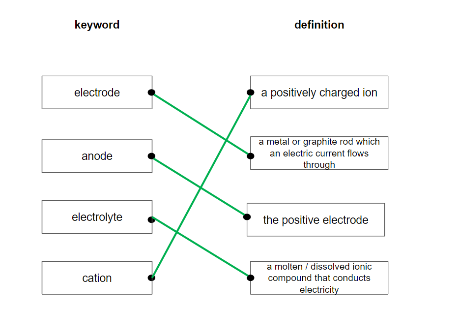
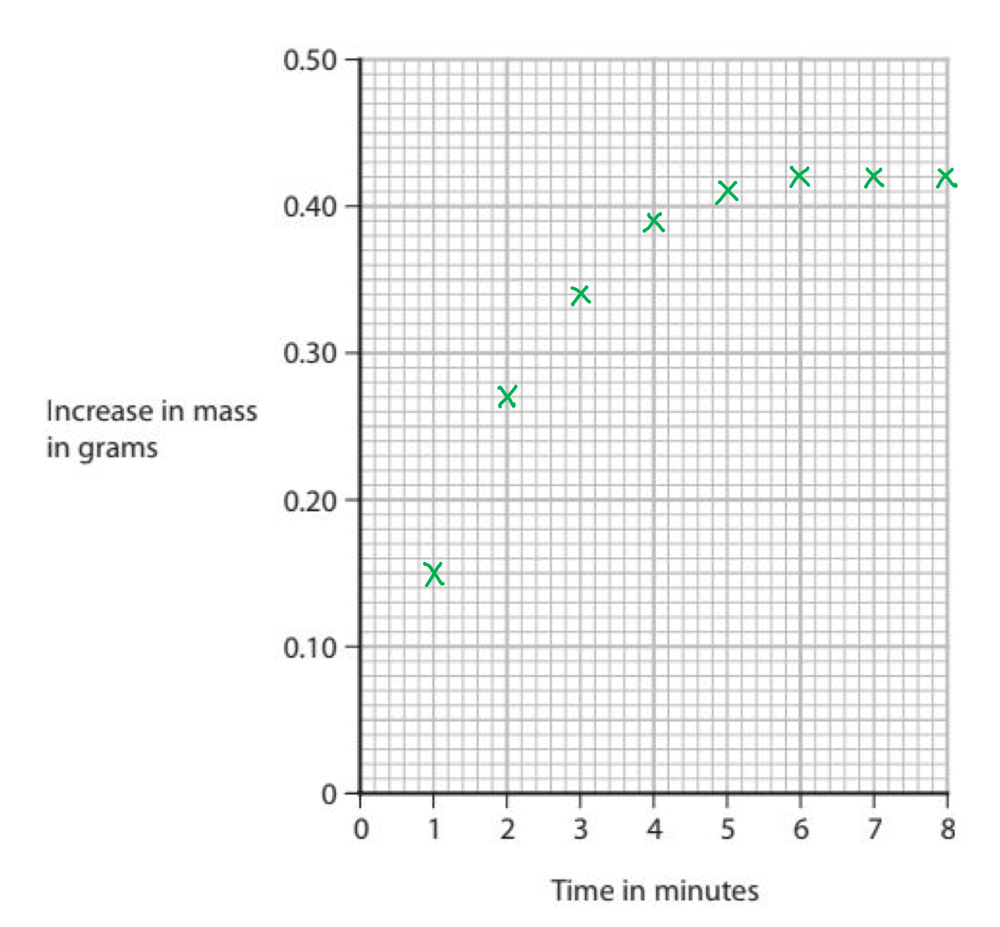
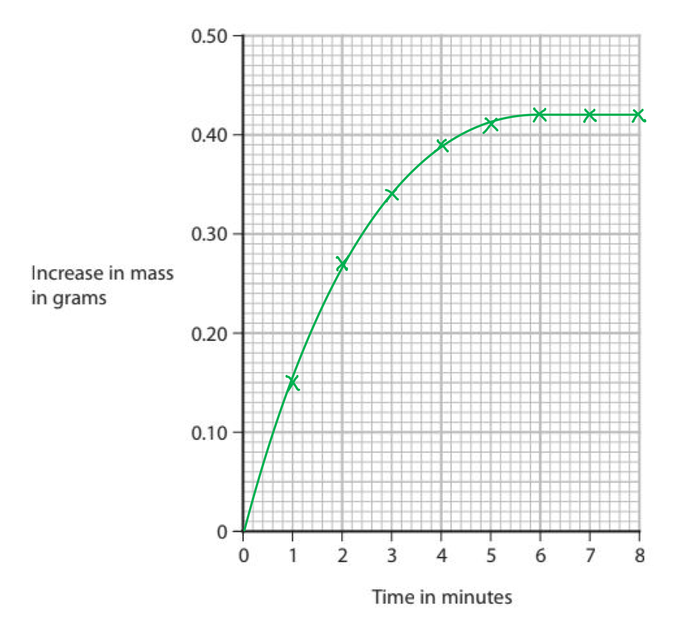
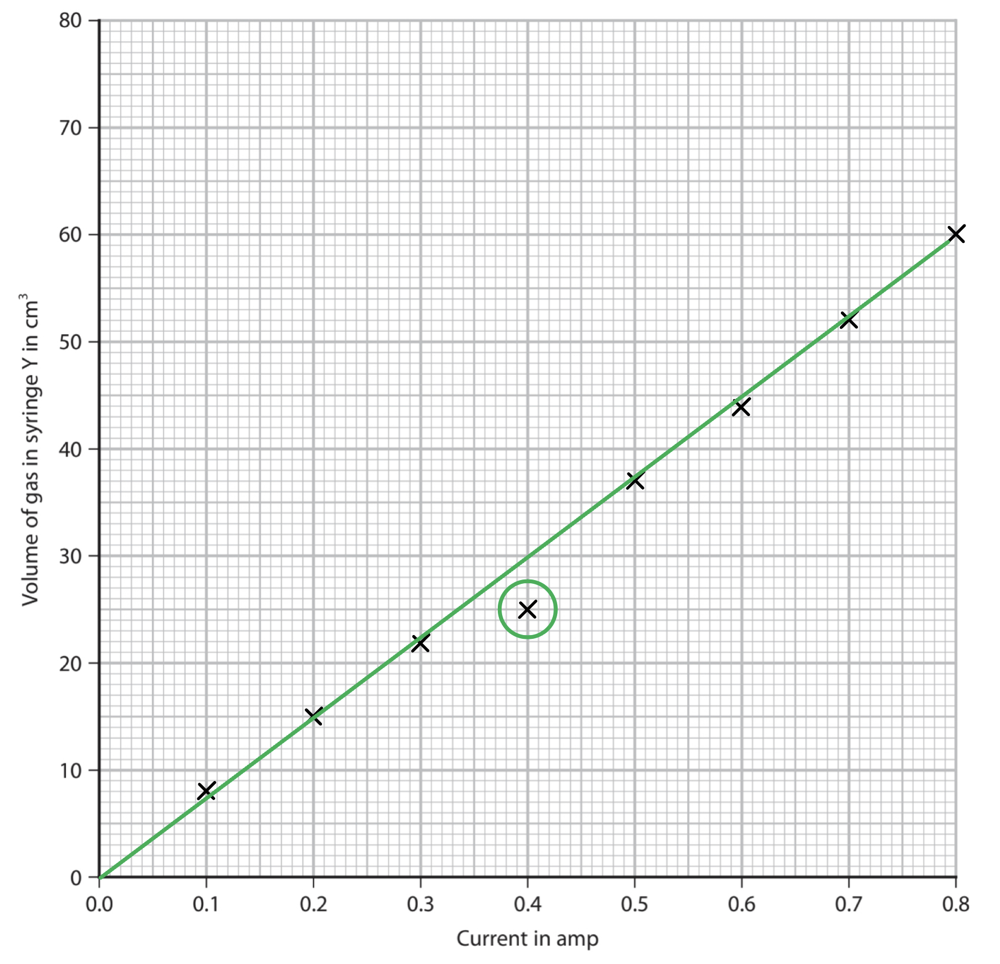

# Mark Schemes — Electrolysis
**5. Principles of Chemistry: Part 2** · Edexcel IGCSE Chemistry (Modular) (4XCH1) — 24/Unit 2

## Q1 — easy — 1 marks · exam-questions

### 1() — 1 marks
**Correct answer: B** — Negative electrode: copperPositive electrode: oxygen

**Final answer:** **The correct answer is B.**

- The substances are formed at the negative electrode (cathode) and the positive electrode (anode) are:  Negative electrode: copper and positive electrode: oxygen.
- As well as Cu2+ ions and SO42–ions, H+ ions and OH– ions are present in the aqueous solution due to the presence of water
- H+ ions and Cu2+ ions are attracted to the **negative** electrode (cathode) but only one will gain electrons

  - As copper is lower than hydrogen in the reactivity series, Cu2+ ions will gain electrons to form copper
- OH– ions and SO42– ions are attracted to the **positive** electrode (anode)

  -  OH– ions lose electrons more readily than SO42– ions and oxygen gas is produced

## Q2 — easy — 1 marks · exam-questions

### 1() — 1 marks
**Correct answer: A** — The lamp would stop working soon after the heat was removed

**Final answer:** **The correct answer is A.**

- The correct answer statement is: The lamp would stop working soon after the heat was removed.
- When the heat is removed, lead(II) chloride would cool and form a solid

  - Lead(II) chloride cannot conduct electricity in the solid state as the ions are in fixed positions within the lattice and are unable to move
  - The lamp would no longer remain on if the ions are unable to move
- B is incorrect as a silvery liquid will form at the negative electrode as lead ions are positive so will be attracted to the negative electrode, forming lead
- C is incorrect as chlorine is produced at the positive electrode
- D is incorrect as lead is produced at the negative electrode

  - Hydrogen gas would be given off if it was an aqueous solution of lead(II) chloride

## Q3 — easy — 1 marks · exam-questions

### 1() — 1 marks
**Correct answer: A** — Solid zinc chloride has been used

**Final answer:** **The correct answer is A.**

- The correct reason for the electrolysis not working is: Solid zinc chloride has been used.
- Solid zinc chloride will not conduct electricity because the ions cannot move freely and carry a charge
- The solid zinc chloride either needs to be molten or in solution to enable the ions to move

## Q4 — easy — 10 marks · exam-questions

### 5((a)) — 1 marks
The meaning of this hazard symbol is:

- Flammable / inflammable; **[1 mark]**

**[Total: 1 mark]**

### 5((b)) — 1 marks
The elements combined in barium sulfide are:

- Barium / Ba **AND** Sulfur / S; **[1 mark]**

**[Total: 1 mark]**

- *The first word in the compound tells you the metal element present*
- *The second word tells you the non-metal element present, and the ending -ide means that it is only this non-metal element that is present*
- *Careful**: You must use the name of the element, sulfur, as opposed to sulfide or sulfate*
- *You would not be awarded the mark if you included any other elements*
- *Oxygen is NOT present, if it were, then the ending would become -ate, i.e. barium sulfate*

### 5((c)) — 2 marks
One safety precaution that should be taken when using barium chloride is:

An explanation linking one of the following pairs of points

- Wear gloves; **[1 mark]**
- So it does not contact your skin / to protect your skin;** [1 mark]**

**OR**

- Wear goggles; **[1 mark]**
- So it does not contact the eyes / to protect the eyes; **[1 mark]**

**OR**

- Use in fume cupboard / mask;** [1 mark]**
- So you do not inhale it; **[1 mark]**

**[Total: 2 marks]**

- *Toxic substances can cause death or damage to health, even in small quantities *
- *The damage can be caused when inhaled, swallowed or absorbed through the skin*
- *When using toxic substances, the risk of contact via these methods needs to be reduced*
- *You can only be awarded the second mark if you correctly identified the first marking point*
- *Just stating wear protective / safety clothing would not gain a mark as it is not sufficiently detailed *

### 5((d)) — 2 marks
i) The total mass reading on the balance after the reaction is:

- 25.7 (g);** [1 mark]**

ii) The name of the white precipitate formed by the reaction of barium chloride solution with dilute sulfuric acid is:

- Barium sulfate; **[1 mark]**

**[Total: 2 marks]**

- *In any chemical reaction, the mass of the reactants will equal the mass of the products*
- *If a gas is produced, the mass of the reaction mixture will decreases as the reaction progresses as the gas is given off*
- *In this reaction, no gas is given off so the mass will remain the same*
- *When barium chloride solution reacts with dilute sulfuric acid, insoluble barium sulfate is produced and is a white precipitate:*

  - *Ba**2+ **(aq) + SO**4**2- **(aq) → BaSO**4 **(s)*

### 5((e)) — 4 marks
i) Sodium chloride solution, rather than solid sodium chloride, must be used in this experiment:

- So that the ions / anions / cations can move; **[1 mark]**

ii) The ions that would be attracted to the anode are:

- OH- **AND **Cl- <u>only</u> circled; **[1 mark]**

iii) A student could modify the apparatus to carry out the electrolysis of molten lead bromide by:

An explanation linking one of the following pairs of points:

- Use a crucible / metal container (instead of a beaker); **[1 mark]**
- Which will not break / melt (when heated strongly); **[1 mark]**

**OR**

- Add a Bunsen burner (under the container); **[1 mark]**
- Because heat is needed to melt the lead bromide / to make the lead bromide a liquid;** [1 mark]**

**[Total: 4 marks]**

- *In part (i) you must be specific that it is the ions that can move, you would not be awarded the mark if you used terms such as particles*
- *Remember that it is not electrons that carry charge in an ionic compound, so you should not refer to electrons being able to move *
- *The anode is positively charged, so oppositely charged ions (negatively charged) will be attracted toward it*
- *Solid ionic compounds will not conduct electricity as their ions are not free to move, therefore solid lead bromide needs to be heated so that it become molten and the ions are free to move*
- *Heating using a Bunsen burner or blow torch are acceptable methods for heating, but using a water bath would not be given credit as the temperature would not be sufficient to melt the lead bromide*

## Q5 — easy — 10 marks · exam-questions

### 1() — 4 marks
The correct pairs are:

- Electrode matched with a metal or graphite rod which an electric current flows through; **[1 mark]**
- Anode matched with the positive electrode of an electrolysis cell; **[1 mark]**
- Electrolyte matched with a molten or dissolved ionic compound that conducts electricity;** [1 mark]**
- Cation matched with a positively charged ion; **[1 mark]**

**[Total: 4 marks]**

- *Electrolysis teaching uses many mnemonics*

  - *OIL-RIG: Oxidation is loss, reduction is gain (of electrons)*
  - *PANIC: Positive anode, negative is cathode*
  - *PANCAKE: Positive anode, negative cathode, always know electrons*
- *Regardless of which (if any) you have been taught, make sure that you know the anode is positive and the cathode is negative*
- *This then allows you to work out anion and cation*

  - *Careful: **These don't match with the electrodes*
  - *The anion is negative, which is why it is attracted to the positive anode*
  - *The cation is positive, which is why it is attracted to the negative electrode*

### 2() — 3 marks
The completed sentences are:

- Ionic compounds cannot conduct electricity when they are <u>solid</u>; **[1 mark]**
- This is because they have <u>no free ions</u> that can move and carry charge; **[1 mark]**
- To conduct electricity, an ionic compound must be <u>liquid</u> or dissolved in solution;** [1 mark]**

**[Total: 3 marks]**

- *Careful:** Electrolysis focuses on electrons a lot but it is the movement of ions that causes the flow of electricity*
- *This means that the ions must be able to move (mobile) so that they can carry charge*
- *To do this, the ionic compound must be molten (melted into liquid) or aqueous (dissolved in solution)*

### 3() — 2 marks
The correct statements are:

| Positive ions move towards the negative electrode | ✔ |
|---|---|
| Negative ions move towards the cathode |   |
| Negative ions remain in solution |   |
| Positive ions move towards the anode |   |
| Negative ions move towards the anode | ✔ |

- Each correct statement;** [1 mark]**

**[Total: 2 marks]**

- *Some key points to remember are:*

  - *Opposites attract*
  - *The positive electrode is called the anode*
  - *The negative electrode is called the cathode *
- *Positive ions will be attracted to the negative electrode (cathode) and vice versa*

### 4() — 1 marks
The two products formed when molten lead bromide undergoes electrolysis are:

- Lead **AND** Bromine; **[1 mark]**

**[Total: 1 mark]**

- *When the ionic compound is molten, only two ions are present- those you can see in the name of the compound*

  - *Lead bromide consists of lead ions, Pb**2+ **and bromide ions, Br**– *
  - *Lead ions are positively charged so will move to the cathode and form the metal lead*
  - *Bromide ions are negatively charged so will move the anode and form brom**ine** **gas*
  - *If you write bromide is formed as opposed to bromine, you will not score the mark *

## Q6 — medium — 11 marks · exam-questions

### 3((a)) — 2 marks
Copper is a good conductor of electricity because:

- Electrons are delocalised; **[1 mark]**
- (Electrons) can move / can flow / are mobile;** [1 mark]**

**[Total: 2 marks]**

- *You should know this explanation, make sure you are specific about the fact it is electrons that are moving, as for ionic compounds it would be ions are moving*

### 3((b)) — 5 marks
i) Observed at each electrode is:

- Negative electrode = brown / pink / pink-brown solid formed;** [1 mark] ***accept brown / pink coating / deposit on the electrode* *allow red-brown* *reject orange* *reject precipitate*
- Positive electrode = bubbles / fizzing / effervescence; **[1 mark] ***allow 1 mark if both observations correct but at incorrect electrodes* *ignore gas produced / evolved / released* *ignore name of gas*

ii) This is a reduction reaction because:

- Copper **ion(s**) / Cu2+ gains electrons; **[1 mark]**

iii) The copper(II) sulfate solution becomes paler blue during the electrolysis because:

- The (blue) colour is caused by copper ions / Cu2+; **[1 mark]**
- Copper ions / Cu2+ are being discharged / removed from the solution; **[1 mark]**

**[Total: 5 marks]**

- *Copper sulfate solution contains the following ions: H**+**, OH**-**, Cu**2+** and SO**4**2- *
- *The H**+** and OH**- **are from the water *
- *Copper ions are preferentially discharged at the negative electrode over the hydrogen ions because copper is less reactive *

  - *Here, the copper ions gain electrons to form copper metal hence the brown / pink solid formed *
  - *In part ii) the equation shows you that electrons are added to the copper ions*
  - *Remember: OIL RIG- **O**xidation Is **L**oss of electrons, **R**eduction **I**s **G**ain of electrons*
  - *Be careful- you **must **specify that the copper **ions** gain electrons, simply saying copper gains electrons will not get you the mark*
- *Hydroxide ions are preferentially discharged at the positive electrode over the sulfate ions*
- *The hydrogen and sulfate ions remain in solution *

### 3((c)) — 4 marks
To show by calculation that the formula of hydrated copper(II) sulfate is CuSO4.5H2O:

- Calculate the mass of water removed; **[1 mark]**
- Calculate the amount, in moles, of CuSO4; ** [1 mark]**
- Calculate the amount, in moles, of water;  **[1 mark]**
- Divide amount of H2O by amount of CuSO4; ** [1 mark]** *Accept any other valid method*

**[Total: 4 marks]**

- *An example calculation would be:*

  - *Mass of water removed; 12.5 – 8.0 = 4.5 g*
  - *Moles of CuSO**4** = 8.0 ÷ 159.5 = 0.05(0) (mol)*
  - *Moles of H**2**O = 4.5 ÷ 18 = 0.25 (mol)*
  - * 0.25 ÷ 0.05(0) (= 5)*
- *The moles of copper sulfate and water would be found by using* $\frac{\mathrm{mass}}{\mathrm{molar} \mathrm{mass}}$

## Q7 — medium — 1 marks · exam-questions

### 1() — 1 marks
**Correct answer: B** — 2Cl- → Cl2 + 2e-

**Final answer:** **The correct answer is B.**

- The ionic half-equation that represents the formation of chlorine gas at the positive electrode is:  2Cl- → Cl2 + 2e-
- Negative chloride ions are attracted to the positive electrode
- Two chloride ions each lose an electron at the electrode forming a chlorine molecule
- A is incorrect as only a single atom of chlorine is formed.

## Q8 — medium — 1 marks · exam-questions

### 1() — 1 marks
**Correct answer: D** — Lead ions are reduced

**Final answer:** **The correct answer is D.**

- Lead bromide consists of positively charged lead ions, and negatively charged bromide ions, not atoms
- The lead ions are attracted to the negative electrode where they gain electrons
- The gain of electrons is reduction

The correct statement is:

- (D)Lead ions are reduced; **[1 mark]**

**[Total: 1 mark]**

- *Lead bromide consists of positively charged lead ions, and negatively charged bromide ions, not atoms*
- *The lead ions are attracted to the negative electrode where they gain electrons*
- *The gain of electrons is reduction*

## Q9 — medium — 12 marks · exam-questions

### 6((a)) — 4 marks
i) The plotted student’s results are:

- All points plotted ± half a square; **[1 mark] **

ii) The curve of best fit is:

- Correct curved line of best fit; **[1 mark]**

iii) The shape of the graph:

- The curve shows increasing mass (of negative electrode) because (more) copper deposits / forms; **[1 mark]**
- The line becomes horizontal because there are no more copper(II) ions left in the solution / all the copper has been deposited / formed / there is no copper sulfate solution left; **[1 mark]**

**[Total: 4 marks]**

- *The most common mistake when drawing graphs is to use the scale incorrectly*
- *Make sure that you find what the intervals on both axes are:*

  - *In this case, on the x-axis, each smaller square represents 0.2 minutes, however, you are only plotting points every minute, so make sure your points line up with the numbers on the x-axis*
  - *On the y-axis, each square represents 0.01 g*
- *When drawing a line of best fit:*

  - *Ignore any anomalous points, if any*
  - *Try to get as many points on the line as possible, and, for those that don't fit on the line, an equal number of points above and below the line*
  - *For a curved line, make it as smooth as you can - it can help to turn the paper upside down!*
- *Whenever you are collecting results of the amount of reactant used or product formed, a horizontal line always indicates that at least one of the reactants has been used up and the reaction has gone to completion (unless the reaction is an equilibrium, in which case the horizontal line shows that equilibrium has been reached)*

### 6((b)) — 4 marks
i) The student should collect a sample of pure oxygen at the positive electrode by:

Any **two** from:

- Fill a test tube / measuring cylinder with copper sulfate solution / water; **[1 mark]**
- Place the tube over the positive electrode; **[1 mark] **
- Collect gas / oxygen by displacement of solution/water; **[1 mark] **

ii) The ionic half-equation for the formation of oxygen is:

2H2O → O2 + 4H+ + 4e(-)   **OR   **4OH- → O2 + 2H2O + 4e(-)

- All formulae correct; **[1 mark]**
- Correct balancing of correct formulae; **[1 mark]**

**[Total: 4 marks]**

- *A test tube or measuring cylinder are both suitable for collecting gas in this case *
- *If you wanted to measure the volume of gas as it was collected you would need to use the measuring cylinder*
- *An inverted burette could also be used*
- *The half equations are tricky for the formation of oxygen and either of these equations would gain the marks - learn one of these*

### 6((c)) — 4 marks
i) Why metals can be stretched to form wires:

- Layers / sheets / rows (of atoms or ions); **[1 mark]**
- Can slide over one another; **[1 mark]**

ii) How metals conduct electricity:

- Delocalised electrons; **[1 mark]**
- Are free to move (throughout the structure);** [1 mark]**

**[Total: 4 marks]**

- *In part (i) you would only gain the second mark if you scored the first mark*
- *In part (ii) you would not gain the mark if you used terms such as 'sea of electrons' or 'free electrons'*
- *You would only gain the second mark if you had mentioned electrons*
- *Be careful with terminology, do not make reference to ions moving when explaining why metals conduct electricity - remember the positive ions are fixed in position and it is the delocalised electrons that carry the charge as they can more throughout the structure *

## Q10 — medium — 1 marks · exam-questions

### 1() — 1 marks
**Correct answer: C** — 2,4,4

**Final answer:** **The correct answer is C.**

- These coefficients balance the number of each species on both sides of the equation and ensure the charges are balanced overall

2H2O    →    O2   +   4H+  +  4e-

The numbers which will correctly balance the half equation are:

- (C) 2,4,4;** [1 mark]**

**[Total: 1 mark]**

- *These coefficients balance the number of each species on both sides of the equation and ensure the charges are balanced overall*

> *2H**2**O    →    O**2**   +   4H**+**  +  4e**-*

## Q11 — medium — 7 marks · exam-questions

### 4((a)) — 2 marks
Metals are malleable because:

- Layers of atoms / positive ions; **[1 mark]**
- Slide over each other; **[1 mark] ***Mark 2 is dependent on mark 1*

**[Total: 2 marks]**

- *Malleability refers to being able to hammer the metal into shape*
- *In a metal, all the atoms are of the same element and so therefore the same size, allowing them to form layers*
- *This is different to an alloy whereby the atoms are different sizes, causing the layers to become distorted and making it a harder substance*
- *You will not be awarded the mark for just stating that there are layers - you must refer to the type of particle as well although it does not matter whether you specify atoms or ions*

### 4((b)) — 5 marks
i) Solid lead(II) bromide does not conduct electricity because:

- Ions cannot move;** [1 mark]**

ii) The ionic half-equation for the oxidation of bromide ions is:

- 2Br– → ** Br****2**** + 2e****-****;**** ****[1 mark]**

iii) Lead metal forms at the negative electrode because:

- Lead ions (are positive and) are attracted to the negative electrode / Pb2+ (ions) are attracted to the negative electrode;** [1 mark]**
- Lead ions gain electrons / Pb2+ (ions) gain electrons (to form lead); **[1 mark]**

iv) When the teacher stops heating the mixture and allows it to solidify, it remains alight because:

- Metal / lead connects the electrodes / completes the circuit OWTTE;** [1 mark]**

**[Total: 5 marks]**

- *Remember**: Electrolysis is carried out on ionic compounds, therefore to conduct electricity the ions, not electrons must be able to move- this is a common error to make on this question*
- *Lead ions are positively charged so are attracted to the cathode (negative electrode)*
- *Bromide ions are negatively charged so are attracted to the anode (positive electrode)*
- *Both ions will lose or gain electrons in order to form atoms again *
- *In the case of bromide ions, they lose electrons (oxidation) to form bromine gas *

  - *When you are completing half equations, make sure the number of atoms / ions, as well as the charges balance on both sides of the equation*
- *In the case of lead ions, they will gain electrons (reduction) to form the element lead*

  - *Pb**2+** + 2e**-** → Pb*

## Q12 — hard — 14 marks · exam-questions

### 5((a)) — 4 marks
i) Aluminium is malleable because:

- (It has) layers / rows (of atoms / ions); **[1 mark]**
- That can slide over one another;** [1 mark] ***The second mark is dependent on the mention of layers / rows*

ii) Aluminium conducts electricity because:

- (It has) delocalised electrons;** [1 mark]**
- That can move / can flow / are free to move (throughout the structure); **[1 mark]** *The second mark is dependent on the mention of electrons*

**[Total: 4 marks]**

- *When referring to the conductivity of metals, you must include **electrons** in your explanation*
- *Also, you need to explain that it is the electrons being able to move that cause them to conduct electricity; just stating that charge or current can flow will not gain you the marks*

### 5((b)) — 1 marks
A reason why heating a mixture of aluminium oxide and carbon does not produce aluminium is:

- Aluminium is more reactive than carbon **OR **Aluminium is higher in the reactivity series than carbon;** [1 mark] ***The reverse arguments are accepted*

**[Total: 1 mark]**

- *As aluminium is more reactive than carbon, carbon is unable to displace aluminium from its compound*

### 5((c)) — 5 marks
i) Aluminium metal forms at the negative electrode because:

- Aluminium ions / Al3+ are attracted to the negative electrode / cathode (because they are positively charged); **[1 mark]**
- Where they gain electrons (forming aluminium); **[1 mark]**

ii) An ionic half-equation for the formation of oxygen gas at the positive electrode is:

- 2O2- → O2 + 4e- **OR** 2O2- - 4e- → O2;** [1 mark]**

iii) Carbon dioxide gas is also produced at the positive electrode because:

- The electrodes are made of carbon; **[1 mark]**
- Which reacts with / burns in oxygen; **[1 mark]**

**[Total: 5 marks]**

- *In the electrolysis of molten compounds, the positively charged metal ions are attracted to the negative electrode, where they are reduced as they gain electrons*
- *In part (iii), you need to apply your knowledge of  the composition of graphite (it is an allotrope of carbon) and you know that oxygen is produced at the positive electrode so as oxygen is produced, it reacts with the carbon of the electrode, producing carbon dioxide gas*

### 5((d)) — 4 marks
i) The equation shows that iron(III) oxide is reduced as:

- Iron oxide loses oxygen; **[1 mark]**

ii) The energy level diagram for the reaction between aluminium and iron(III) oxide:

- Products / right-hand line below reactants / left-hand line; **[1 mark]**
- Correct name / formula of both reactants; **[1 mark]**
- Correct name / formula of both products; **[1 mark]**

**[Total: 4 marks]**

- *Oxidation is the gain of oxygen and reduction is the loss of oxygen*

  - *The equation shows that iron(III) oxide loses oxygen to form Fe and so is reduced*
  - *Aluminium gains oxygen to form Al**2**O**3** so is oxidised*
- *When drawing energy profile diagrams, it is important to label the reactants and products*
- *In this question, if you had simply stated 'reactants' on the left and 'products' on the right, you would have only scored 1 mark out of the last 2 marking points*
- *You are told that the reaction is exothermic, so energy is released during the reaction and the energy level of the products will be lower than the reactants*

  - *If you drew an endothermic reaction (i.e. the products at a higher energy level than the reactants), you could have still scored the last 2 marking points*

## Q13 — hard — 13 marks · exam-questions

### 6((a)) — 3 marks
i) The test for hydrogen gas is:

- (Squeaky) pop with lighted splint;** [1 mark] **

ii) The test for chlorine gas is:

- (Damp) litmus paper/ universal indicator; **[1 mark] **
- Bleached; **[1 mark] **

**[Total: 3 marks] **

- *You should know the tests for the following gases:*

  - *Oxygen*
  - *Hydrogen*
  - *Chlorine*
  - *Ammonia *
  - *Carbon dioxide*
- *For the chlorine test you can also gain the marks for*

  - *Turns white / decolourised*
  - *(Damp) blue litmus turns red and is bleached *

### 6((b)) — 4 marks
i) The reaction is an oxidation reaction because:

- Chloride ions / Cl− lose electrons / electrons are lost; **[1 mark] **

ii) The ionic half-equation for the formation of hydrogen at the negative electrode:

- 2H+ + 2e(−) → H2;** [1 mark] **

iii) It is safer to do this electrolysis in a fume cupboard:

- Chlorine is toxic / poisonous; **[1 mark]**

iv) The volume of chlorine collected during this electrolysis is less than the volume of hydrogen collected:

- (Some) chlorine dissolves (in the solution); **[1 mark] **

**[Total: 4 marks] **

- *The mark scheme is very specific when it comes to redox reactions*
- *You must state the specific name of the species being oxidised (or what you are being asked for) *

  - *Chloride ions are being oxidised, you will not gain the mark for chlorine*
- *You can also explain oxidation and reduction in terms of oxidation state - in this case it is acceptable to talk about chlorine *

  - *Oxidation state of chlorine increases / changes from -1 to 0*

### 6((c)) — 6 marks
i) Ionic compounds must be molten for electrolysis because:

An explanation that links **two** of the following points:

- In solid sodium chloride the ions are not free to move / are in fixed positions; **[1 mark] **
- In molten sodium chloride the ions are mobile; **[1 mark]**
- Ions / charged particles need to move for current (to flow) / to conduct electricity; **[1 mark] **

ii) To calculate the maximum volume, in dm3, of chlorine gas at rtp that can be obtained from 23.4 tonnes of molten sodium chloride

- Calculate the amount, in moles, of NaCl; **[1 mark] **
- Determine the amount, in moles, of Cl2; **[1 mark]**
- Calculate the volume of Cl2; **[1 mark] **
- Give the final answer in standard form; **[1 mark] **

*Example calculation*

- Mols of NaCl = $\frac{23400000}{58.5}$ =  400 000 mols

- Ratio 2:1 so mols of Cl2 = $\frac{400000}{2}$ = 200 000 mols  - Volume of Cl2 = 200 000 x 24 = 4 800 000 (dm3)

- Volume of Cl2 = 4.8 x 106 (dm3)

**[Total: 6 marks] **

- *The calculation could catch students out because:*

  - *Tonnes of sodium chloride are given, not grams:*
  
    - *So 23.4 x 100 000 = 23 400 000 g*
  - *The answer must be given in standard form:*
  
    - *4 800 000 should be 4.8 x 10**6** as the decimal place will move 6 places over the right*

## Q14 — hard — 13 marks · exam-questions

### 3((a)) — 4 marks
Metals conduct electricity but covalent compounds do not conduct electricity

Explanation including the following points:

- (Metals) contain delocalised electrons; **[1 mark] **
- (Which) move / flow / are mobile / are free to move (through the metal structure); **[1 mark] **

And **two** points from:

- (Covalent compounds) contain neutral molecules / molecules with no overall charge; **[1 mark] **
- Electrons held (tightly) in covalent bonds; **[1 mark] **
- (So) no electrons free to move (so do not conduct);** [1 mark] **

**[Total: 4 marks] **

- *You must state that electrons in a metal are delocalised to gain the first mark *
- *Covalent compounds do not contain ions or delocalised electrons are also acceptable marking points as you are referring to charged particles*

### 3((b)) — 1 marks
The type of particle responsible for allowing hydrochloric acid to conduct electricity is:

- Ion(s);** [1 mark] **

**[Total: 1 mark] **

- *When acids are in solution they dissociate into ions*

  - *HCl (aq) → H**+** (aq) + Cl**-** (aq) *
- *The ions are free to move and therefore carry a charge*
- *This also applies to ionic compounds that are soluble*

### 3((c)) — 6 marks
i) Plotted results:

- All points plotted correctly (within half a small square); **[1 mark] **

ii) The anomalous result is:

- Point at (0.4, 25) circled; **[1 mark] **

iii) Line of best fit:

- Straight line of best fit through origin drawn with ruler;** [1 mark] **

iv) The anomalous result is caused by:

- The volume / reading is less than expected;** [1 mark] **
- Because the current was less than 0.4 A / some gas escaped / there was a leak;** [1 mark] **

v) The relationship between current and volume is:

- The greater the current the greater the volume (of gas);** [1 mark] **

**[Total: 6 marks] **

- *When plotting your graphs use x's as these will show up better and will not be covered by the line of best fit *
- *You can also state that the relationship is*

  - *Directly proportional*
  - *Positive correlation*

### 3((d)) — 2 marks
i) The volume of chlorine collected in syringe X should be the same as the volume of hydrogen collected in syringe Y because:

- (Transfer of two / same number of electrons produces) one mole of chlorine / Cl2 and one mole of hydrogen / H2; **[1 mark] **

ii) The volume of chlorine collected in syringe X is always less than the volume of hydrogen collected because:

- Chlorine dissolves / soluble in acid / solution;** [1 mark] **

**[Total: 2 marks] **

- *Many gases are soluble, which means that they will dissolve into the solution *

  - *In this case, chlorine has dissolved into the acid*
  - *Think of sulfur dioxide which dissolves into rain water to make acid rain*
- *You are not expected to know all the soluble gases, however, if the volume of gas is lower than expected then it has either*

  - *Escaped from the reaction vessel (in this case it is not the answer as the question states 'is always lower' **OR*
  - *Is soluble*

## Q15 — hard — 12 marks · exam-questions

### 6((a)) — 3 marks
Next, the teacher should:

- Filter;** [1 mark]**
- Wash the precipitate / solid / lead(II) bromide / residue (with distilled water); **[1 mark]**
- Dry with filter paper / in a (warm) oven; **[1 mark]**

**[Total: 3 marks]**

- *You can give other suitable methods for drying the sample but they mustn't involve direct heating, for example, with a Bunsen burner*
- *Lead(II) bromide is an insoluble salt, if your answer had treated it as a soluble salt, i.e. evaporation and crystallisation, then you can only be awarded the final mark for a suitable method of drying*

### 6((b)) — 2 marks
The lamp does not light when the lead(II) bromide is solid because:

- Solid lead(II) bromide does not conduct electricity / only conducts when molten **OR** When lead(II) bromide is solid no electricity / current flow(s) through the circuit / lamp; **[1 mark]**
- Because ions/charged particles cannot move/are in fixed positions/are not mobile; **[1 mark]**

**[Total: 2 marks]**

- *Be careful with terminology, lead(II) bromide is an ionic compound, therefore the charged particles that allow it to conduct electricity when molten are ions*
- *Any reference to electrons for the second point will not gain any marks, nor will referring to atoms not being able to move in a solid*

### 6((c)) — 5 marks
i) The observation that would be made at the positive electrode is:

- Brown vapour / gas / fumes (of bromine);** [1 mark]**

ii) Bromide ions in the molten lead(II) bromide become bromine molecules at the positive electrode because:

- Bromide ions are negatively charged / Br – / anions; **[1 mark]**
- (So bromide ions) are attracted to the positive electrode / anode;** [1 mark]**
- At the positive electrode) bromide ions lose / give up electron(s) (to form bromine atoms) **OR** Bromide ions are oxidised; **[1 mark]**
- (Bromine atoms) join in pairs to form bromine molecules / Br2;** [1 mark]**

**[Total: 5 marks]**

- *You can use an equation for some of these marking points:*

  - *To show that bromide ions lose electrons: Br**–** → Br + e**–*
  - *To show bromine forming from two bromine atoms: Br + Br → Br**2*
  - *To show the half equation at the positive electrode: 2Br**– **→  Br**2** + 2e**–*
- *This final equation is actually enough to get the first, third and final marking point*

### 6((d)) — 2 marks
An ionic half-equation for the reaction that occurs at the negative electrode, including state symbols in your equation is:

Pb2+ (l) + 2e(-) →  Pb (s)

- Formula and balancing correct; **[1 mark]**
- Both state symbols correct; **[1 mark]**

**[Total: 2 marks]**

- *You will be given credit if you had identified Pb as liquid, i.e. Pb (l) as lead may be in molten form, depending on the temperature used to heat the lead(II) bromide*
- *Lead(II) ions are positive and have a 2+ charge, which is shown by the Roman numeral in its name*
- *They will be attracted to the negative electrode where they gain 2 electrons to form a lead atom*

## Q16 — hard — 13 marks · exam-questions

### 1() — 4 marks
The structure and bonding in sodium chloride is:

- (Sodium chloride has a) lattice / giant structure ; **[1 mark]**
- It contains ions **OR** Ionic bonding;** [1 mark]**
- Na+ **AND **C*l*-; **[1 mark]**
- There is an electrostatic attraction (between the ions); **[1 mark]**

**[Total: 4 marks]**

- *You must not get confused between the types of bonding - any reference to covalent bonding for example, will result in a maximum of three marks being awarded *
- *You must ensure you write the charges on the ions, it is not enough to state that they have opposite charges for a 4 mark question*
- *Describing the structure and bonding is a very common question and it helps if you use the same format of answer and apply it to whichever structure they have given you:*

  - *Is the substance a giant structure/lattice or a simple molecular structure?*
  - *What type of bond/force is there? E.g covalent, electrostatic force of attraction*
  - *What is the bond/force between? E.g atoms, ions, ions and delocalised electrons... *
  - *Can you be more specific? For example, if it is diamond, refer to the **carbon** atoms not just atoms*

### 2() — 4 marks
During the electrolysis of molten sodium chloride:

- Sodium <u>ions</u> / Na+ are attracted to the cathode / negative electrode **AND **Chloride <u>ions</u> / Cl– are attracted to the anode / positive electrode;** [1 mark]**
- Sodium ions / Na+ gain one electron  **AND **Sodium ions / Na+ are reduced;** [1 mark]**
- Chloride ions / Cl– lose one electron  **AND **Chloride ions / Cl– are oxidised;** [1 mark]**
- Na+ + e– → Na **AND **2Cl– → Cl2 + 2e–;** [1 mark]**

**[Total: 4 marks]**

- *Careful: **The incorrect use of ion can cost you a mark and is very common in electrolysis questions*

  - *Sodium **ions** are one of the reactants, not sodium*
  - *Chlor**ide ions** are one of the reactants, not chlor**ine*
- *Ensure that you also use the terms anode/cathode correctly and if you are not sure, you will get away with putting positive and negative electrode*
- *As you are being asked for equations, then it is good practice to describe them and say whether the equation shows reduction or oxidation*

### 3() — 2 marks
The different products from the electrolysis of aqueous sodium chloride are:

- Hydrogen is produced instead of sodium **AND** (Because,) sodium is more reactive than hydrogen;** [1 mark]**
- Sodium hydroxide is produced **AND **From the sodium ion / Na+ and the hydroxide ion / OH–; **[1 mark]**

**[Total: 2 marks]**

- *Careful: **You often mentally assign the marks of an explain question; one for some form of statement and one for the related reason*
- *Explain answers can have one mark for the statement and reason*
- *The electrolysis of molten sodium chloride makes sodium and chlorine*
- *The electrolysis of aqueous sodium chloride solution makes hydrogen, chlorine and sodium hydroxide*

  - *This means that there are **two **changes in the products - hydrogen and sodium hydroxide*

### 4() — 3 marks
The assumption is incorrect because:

- Electrolysis of seawater produces chlorine which is toxic; **[1 mark] ***Electrolysis of seawater does not produce oxygen is not sufficient for the mark*

Oxygen can be produced by the electrolysis of seawater by:

- Removing the salt / purifying the seawater;** [1 mark]**
- Electrolysis of pure water produces hydrogen and oxygen; **[1 mark]**

**[Total: 3 marks]**

- *This question is asking you about:*

  - *The hazardous product of seawater electrolysis which is toxic chlorine*
  - *How seawater can be made into water for electrolysis*
  - *The products of the electrolysis of water*
