# Exam Questions — Electrolysis
**5. Principles of Chemistry: Part 2** · Edexcel IGCSE Chemistry (Modular) (4XCH1) — 24/Unit 2
> Source: [https://www.savemyexams.com/igcse/chemistry/edexcel/modular/24/unit-2/topic-questions/principles-of-chemistry/electrolysis/exam-questions/](https://www.savemyexams.com/igcse/chemistry/edexcel/modular/24/unit-2/topic-questions/principles-of-chemistry/electrolysis/exam-questions/) · 16 questions · total 121 marks

## Q1 — easy — 1 marks · exam-questions

### 1() — 1 mark — multiple_choice
#### Separate: Chemistry Only

A student uses the apparatus to electrolyse an aqueous solution of copper(II) sulfate.

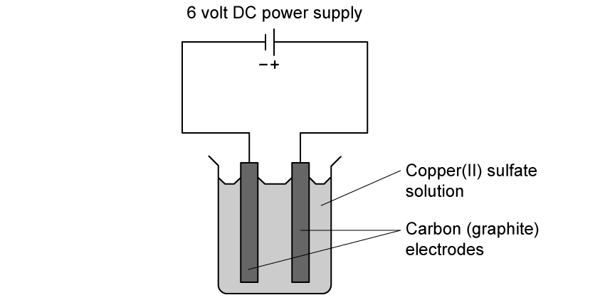

Which substances are formed at the negative electrode (cathode) and the positive electrode (anode)?
- **A.** Negative electrode: hydrogen  Positive electrode: sulfur
- **B.** Negative electrode: copperPositive electrode: oxygen
- **C.** Negative electrode: sulfur  Positive electrode: hydrogen
- **D.** Negative electrode: oxygen  Positive electrode: copper

## Q2 — easy — 1 marks · exam-questions

### 1() — 1 mark — multiple_choice
#### Separate: Chemistry Only

A pure sample of molten lead(II) chloride was electrolysed.

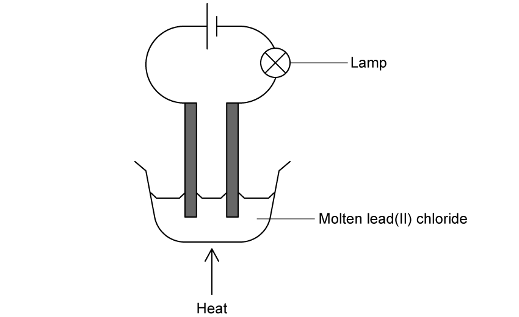

Which is the correct statement about this electrolysis?
- **A.** The lamp would stop working soon after the heat was removed
- **B.** A silvery liquid would be seen at the positive electrode
- **C.** Chlorine is formed at the negative electrode
- **D.** Hydrogen gas is formed at the negative electrode

## Q3 — easy — 1 marks · exam-questions

### 1() — 1 mark — multiple_choice
#### Separate: Chemistry Only

A student was investigating the electrolysis of zinc chloride.

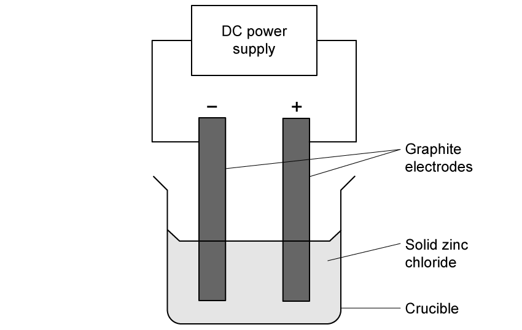

What is the correct reason for electrolysis not working?
- **A.** Solid zinc chloride has been used
- **B.** The electrodes don't conduct electricity
- **C.** The power supply is not connected properly
- **D.** The crucible is too small to allow ions to flow

## Q4 — easy — 10 marks · exam-questions

### 5((a)) — 1 mark — command: state — structured — from paper 2018 · Ju1F
#### Separate: Chemistry Only

Two compounds of barium are barium sulfide and barium chloride.

The hazard symbol shown in Figure 5 is on bottles containing barium metal.

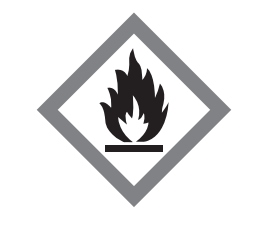

**Figure 5**

State the meaning of this hazard symbol.

### 5((b)) — 1 mark — command: give — structured — from paper 2018 · Ju1F
#### Separate: Chemistry Only

Give the names of the elements combined in barium sulfide.

### 5((c)) — 2 marks — command: explain — structured — from paper 2018 · Ju1F
#### Separate: Chemistry Only

Barium chloride is toxic. Explain one safety precaution that should be taken when using barium chloride.

### 5((d)) — 2 marks — command: multiple — structured — from paper 2018 · Ju1F
#### Separate: Chemistry Only

i)A beaker of barium chloride solution and a beaker of dilute sulfuric acid were placed on a balance, as shown in Figure 6.

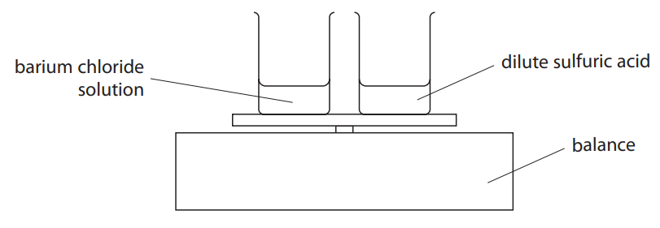

**Figure 6**

The total mass reading on the balance was 25.7 g. The dilute sulfuric acid was poured into the barium chloride solution and the beaker replaced on the balance, as shown in Figure 7.

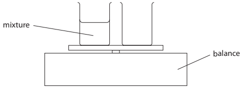

**Figure 7**

The mixture formed contained a white precipitate. State the total mass reading on the balance after the reaction.

(1)

ii) Give the name of the white precipitate formed by the reaction of barium chloride solution with dilute sulfuric acid.

(1)

### 5((e)) — 4 marks — command: multiple — structured — from paper 2018 · Ju1F
#### Separate: Chemistry Only

Solid sodium chloride is dissolved in water.

The sodium chloride solution is electrolysed in the apparatus shown in Figure 8.

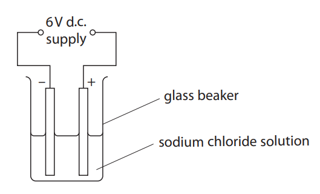

**Figure 8**

i) State why sodium chloride solution, rather than solid sodium chloride, must be used in this experiment.

(1)

ii) The formulae of the ions present in the sodium chloride solution are

$\mathrm{Na}^{+}$                $\mathrm{CI}^{-}$                 $H^{+}$                    $\mathrm{OH}^{-}$

Circle the ions that would be attracted to the anode.

(1)

iii) Molten lead bromide can be electrolysed to form molten lead and bromine gas.

Explain how a student could modify the apparatus shown in Figure 8 to carry out this electrolysis.

(2)

## Q5 — easy — 10 marks · exam-questions

### 1() — 4 marks — command: draw — structured
#### Separate: Chemistry Only

This question is about electrolysis.

Draw **one** line from the electrolysis keyword to the correct definition.

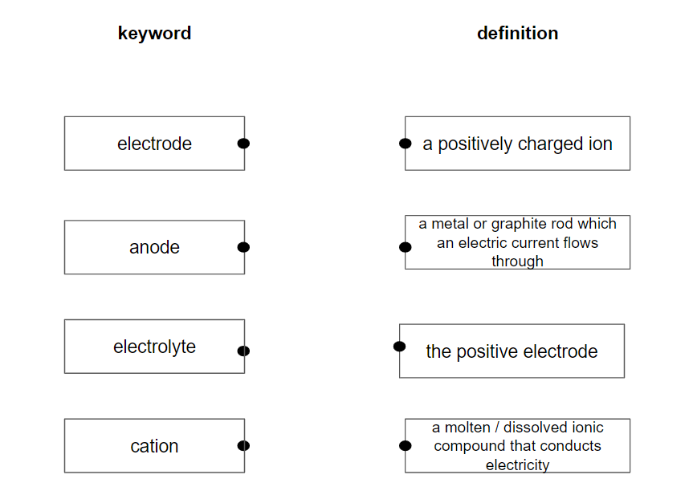

### 2() — 3 marks — command: complete — structured
#### Separate: Chemistry Only

Ionic compounds are capable of being electrolysed under certain conditions.

Use words from the box to complete the sentences.

| \| aqueous \| liquid \| solid \| \|---\|---\|---\|  \| no free electrons \| no free ions \| \|---\|---\| |
|---|

Ionic compounds cannot conduct electricity when they are _________________ .

This is because they have __________________ that can move and carry charge.

To conduct electricity, an ionic compound must be __________________ or dissolved in solution.

### 3() — 2 marks — command: tick — structured
#### Separate: Chemistry Only

Place ticks in boxes by the **two **statements that are correct.

| Positive ions move towards the negative electrode |   |
|---|---|
| Negative ions move towards the cathode |   |
| Negative ions remain in solution |   |
| Positive ions move towards the anode |   |
| Negative ions move towards the anode |   |

### 4() — 1 mark — command: name — structured
#### Separate: Chemistry Only

Name the **two** products formed when molten lead bromide undergoes electrolysis.

## Q6 — medium — 11 marks · exam-questions

### 3((a)) — 2 marks — command: explain — structured — from paper 2020 · Ja202C
#### Separate: Chemistry Only

This question is about copper and its compounds.

Copper is a metal used for electrical wiring. Explain why copper is a good conductor of electricity.

### 3((b)) — 5 marks — command: multiple — structured — from paper 2020 · Ja202C
#### Separate: Chemistry Only

This apparatus is used to investigate the electrolysis of copper(II) sulfate solution with graphite electrodes.

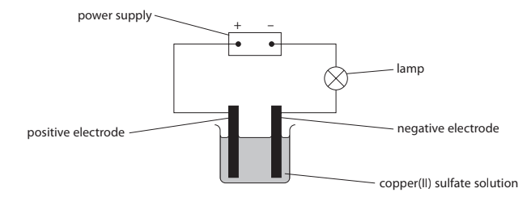

Copper forms at the negative electrode and oxygen forms at the positive electrode.

i) State what would be observed at each electrode.

negative electrode .................................................................................................................. positive electrode ....................................................................................................................

(2)

ii) The ionic half‐equation for the reaction at the negative electrode is

Cu2+ + 2e– → Cu

State why this is a reduction reaction.

(1)

iii) Explain why the copper(II) sulfate solution becomes paler blue during the electrolysis.

(2)

### 3((c)) — 4 marks — command: show — structured — from paper 2020 · Ja202C
#### Separate: Chemistry Only

When hydrated copper(II) sulfate crystals are heated, anhydrous copper(II) sulfate forms. A mass of 12.5g of hydrated copper(II) sulfate crystals is heated in a crucible until all the water of crystallisation is removed. A mass of 8.0g of anhydrous copper(II) sulfate forms. Show by calculation that the formula of hydrated copper(II) sulfate is CuSO4.5H2O [*M**r* of CuSO4 = 159.5 *M**r* of H2O = 18]

## Q7 — medium — 1 marks · exam-questions

### 1() — 1 mark — multiple_choice
#### Separate: Chemistry Only

Hydrogen gas and chlorine gas can be prepared in a laboratory by electrolysis of a concentrated solution of sodium chloride.

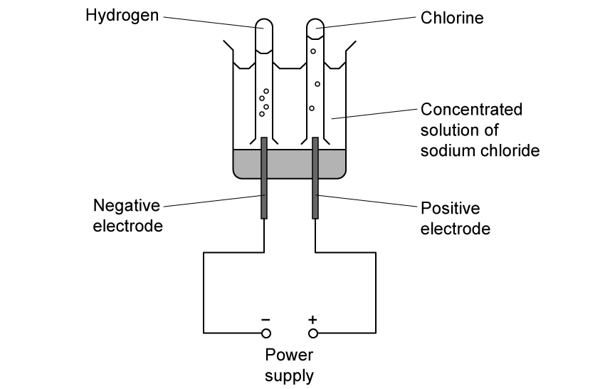

Which is the ionic half-equation that represents the formation of chlorine gas at the positive electrode?
- **A.** Cl- → Cl + e-
- **B.** 2Cl- → Cl2 + 2e-
- **C.** Cl2 + 2e- →  2Cl-
- **D.** 2Cl- + 2e- → Cl2

## Q8 — medium — 1 marks · exam-questions

### 1() — 1 mark — multiple_choice
#### Separate: Chemistry Only

Electrolysis can be used to separate molten lead bromide.

Which statement is true for what happens at the negative electrode?

| ☐ | **A** | Lead atoms are oxidised |
|---|---|---|
| ☐ | **B** | Lead atoms are reduced |
| ☐ | **C** | Lead ions are oxidised |
| ☐ | **D** | Lead ions are reduced |
- **A.** Lead atoms are oxidized
- **B.** Lead atoms are reduced
- **C.** Lead ions are oxidized
- **D.** Lead ions are reduced

## Q9 — medium — 12 marks · exam-questions

### 6((a)) — 4 marks — command: multiple — structured — from paper 2022 · Jan2C
#### Separate: Chemistry Only

This question is about the electrolysis of copper(II) sulfate solution.

The diagram shows the apparatus used for the electrolysis.

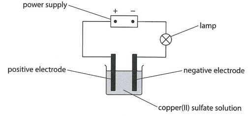

A student records the total increase in mass of the negative electrode every minute for 8 minutes.

The table shows the results.

| **Time in minutes** | **Total increase in mass of the negative electrode in grams** |
|---|---|
| 0 | 0.00 |
| 1 | 0.15 |
| 2 | 0.27 |
| 3 | 0.34 |
| 4 | 0.39 |
| 5 | 0.41 |
| 6 | 0.42 |
| 7 | 0.42 |
| 8 | 0.42 |

i) Plot the student’s results.

(1)

ii) Draw a curve of best fit.

(1)

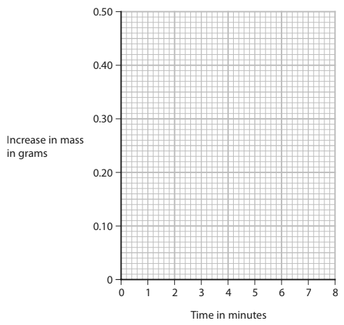

iii) Explain the shape of the graph.

(2)

### 6((b)) — 4 marks — command: multiple — structured — from paper 2022 · Jan2C
#### Separate: Chemistry Only

The product at the positive electrode is oxygen gas.

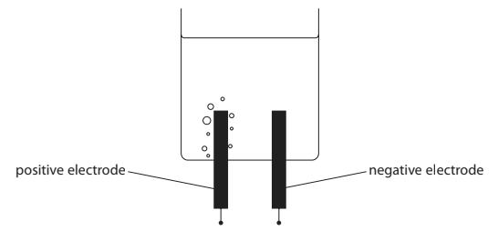

i) The student repeats the electrolysis using different apparatus.

Describe how the student should collect a sample of pure oxygen at the positive electrode.

(2)

ii) Give an ionic half-equation for the formation of oxygen.

(2)

### 6((c)) — 4 marks — command: multiple — structured — from paper 2022 · Jan2C
#### Separate: Chemistry Only

The wire used to connect the power supply to the electrodes is made of copper metal.

The diagram shows the arrangement of the ions in a metal.

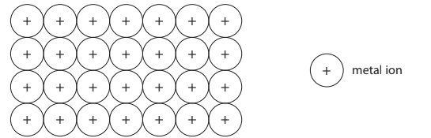

i) Metals that are malleable can also be stretched to form long, thin wires.

Suggest why metals can be stretched to form wires.

(2)

ii) Explain why metals conduct electricity.

(2)

## Q10 — medium — 1 marks · exam-questions

### 1() — 1 mark — multiple_choice
#### Separate: Chemistry Only

When copper(II) sulfate undergoes electrolysis, it produces oxygen gas at the positive electrode.

The unbalanced half equation below represents the reaction that occurs at the positive electrode.

Which numbers will correctly balance the half equation?

___ H2O    →    O2   +   ___ H+  +  ___ e-

| ☐ | **A** | 2,2,2 |
|---|---|---|
| ☐ | **B** | 2,4,2 |
| ☐ | **C** | 2,4,4 |
| ☐ | **D** | 4,4,2 |
- **A.** 2,2,2
- **B.** 2,4,2
- **C.** 2,4,4
- **D.** 4,4,2

## Q11 — medium — 7 marks · exam-questions

### 4((a)) — 2 marks — command: explain — structured — from paper 2020 · Ja2CR
#### Separate: Chemistry Only

This question is about the metal, lead.

Explain why metals, such as lead, are malleable.

### 4((b)) — 5 marks — command: multiple — structured — from paper 2020 · Ja2CR
#### Separate: Chemistry Only

A teacher uses this apparatus in a fume cupboard to demonstrate the electrolysis of lead(II) bromide.

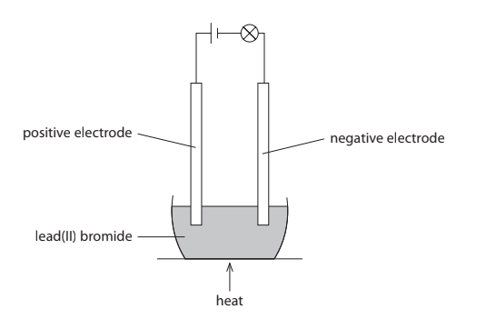

The lead(II) bromide is heated until it melts. When the lead(II) bromide melts, the lamp lights. One of the products of this electrolysis is lead.

i) State why solid lead(II) bromide does not conduct electricity.

(1)

ii) Bromine is formed by the oxidation of bromide ions at the positive electrode. Complete the ionic half-equation for the oxidation of bromide ions.

2Br– → ............................................... + ...............................................

(1)

iii) Explain why lead metal forms at the negative electrode.

(2)

iv) The teacher stops heating the mixture and allows it to solidify. Suggest why the lamp stays alight.

(1)

## Q12 — hard — 14 marks · exam-questions

### 5((a)) — 4 marks — command: explain — structured — from paper 2021 · Ja2C
#### Separate: Chemistry Only

This question is about the metal aluminium.

Aluminium is malleable and conducts electricity. The diagram shows the arrangement of the ions in aluminium metal.

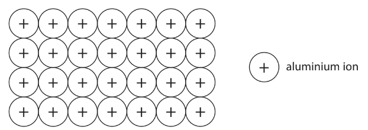

i) Explain why aluminium is malleable.

(2)

ii) Explain why aluminium conducts electricity.

(2)

### 5((b)) — 1 mark — command: give — structured — from paper 2021 · Ja2C
Aluminium cannot be extracted by heating a mixture of carbon and aluminium oxide. Give a reason why heating a mixture of aluminium oxide and carbon does not produce aluminium.

### 5((c)) — 5 marks — command: multiple — structured — from paper 2021 · Ja2C
#### Separate: Chemistry Only

Aluminium is extracted industrially by the electrolysis of molten aluminium oxide Al2O3 at a temperature of about 950 °C. Aluminium metal forms at the negative electrode and oxygen gas forms at the positive electrode. The positive and negative electrodes are made of graphite. The diagram shows the apparatus used.

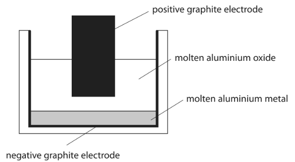

i) Explain how aluminium metal forms at the negative electrode.

(2)

ii) Write an ionic half-equation for the formation of oxygen gas at the positive electrode.

(1)

.............................................................. → ..............................................................

iii) Suggest why carbon dioxide gas is also produced at the positive electrode.

(2)

### 5((d)) — 4 marks — command: multiple — structured — from paper 2021 · Ja2C
#### Separate: Chemistry Only

Aluminium reacts with iron(III) oxide. The reaction is exothermic. The equation for the reaction is

2Al + Fe2O3 → Al2O3 + 2Fe

i) State how the equation shows that iron(III) oxide is reduced.

(1)

ii) Draw an energy level diagram for the reaction between aluminium and iron(III) oxide.

(3)

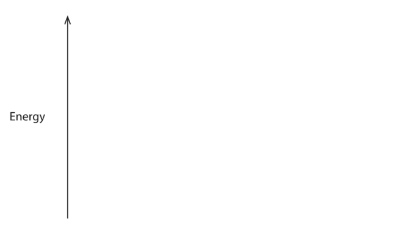

## Q13 — hard — 13 marks · exam-questions

### 6((a)) — 3 marks — command: give — structured — from paper 2021 · Jun2C
The diagram shows how hydrogen gas and chlorine gas can be prepared in the laboratory by electrolysis of a concentrated solution of sodium chloride.

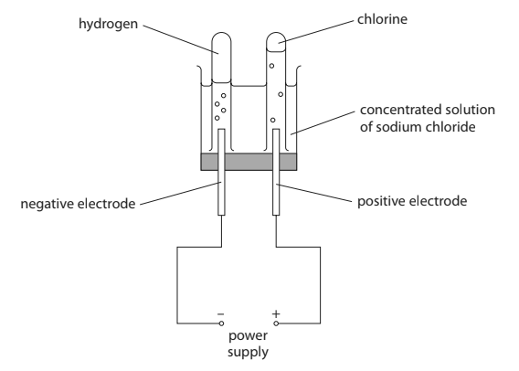

i) Give a test for hydrogen gas.

(1)

ii) Give a test for chlorine gas.

(2)

### 6((b)) — 4 marks — command: multiple — structured — from paper 2021 · Jun2C
#### Separate: Chemistry Only

The ionic half-equation for the formation of chlorine at the positive electrode is

2Cl− → Cl2 + 2e−

i) State why this reaction is an oxidation reaction.

(1)

ii) Give the ionic half-equation for the formation of hydrogen at the negative electrode.

(1)

iii) State why it is safer to do this electrolysis in a fume cupboard.

(1)

iv) Suggest why the volume of chlorine collected during this electrolysis is less than the volume of hydrogen collected.

(1)

### 6((c)) — 6 marks — command: multiple — structured — from paper 2021 · Jun2C
#### Separate: Chemistry Only

In the chemical industry, chlorine can be produced by the electrolysis of molten sodium chloride. The overall equation for this reaction is

2NaCl (l) → 2Na (l) + Cl2 (g)

i) Explain why sodium chloride needs to be molten rather than solid for electrolysis to occur.

(2)

ii) Calculate the maximum volume, in dm3, of chlorine gas at rtp that can be obtained from 23.4 tonnes of molten sodium chloride. [1 tonne = 106 g] [*M**r* of NaCl = 58.5]

[molar volume of chlorine at rtp = 24 dm3]

Give your answer in standard form.

(4)

volume = ........................................... dm3

## Q14 — hard — 13 marks · exam-questions

### 3((a)) — 4 marks — command: explain — structured — from paper 2021 · Jan2CR
#### Separate: Chemistry Only

Explain why metals conduct electricity but covalent compounds do not conduct electricity.

### 3((b)) — 1 mark — command: name — structured — from paper 2021 · Jan2CR
Hydrogen chloride, HCl, is a covalent substance. When hydrogen chloride is added to water, a solution of dilute hydrochloric acid is formed. This solution does conduct electricity. Name the type of particle in the solution of the dilute hydrochloric acid that allows it to conduct electricity.

### 3((c)) — 6 marks — command: multiple — structured — from paper 2021 · Jan2CR
#### Separate: Chemistry Only

The teacher uses this apparatus to investigate the electrolysis of a solution of dilute hydrochloric acid. The ammeter measures the current.

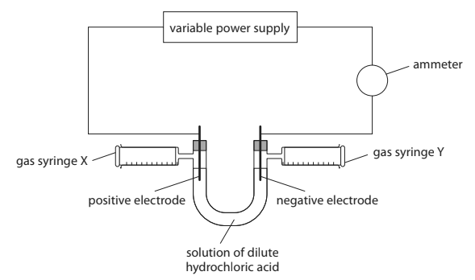

The teacher wants to find out if there is a relationship between current and volume of gas collected at each electrode.

She adjusts the power supply until the current is 0.1 amp.

After 5 minutes she records the volume of gas collected in syringe X and syringe Y.

The teacher repeats the experiment several times, using a different current each time.

The table gives the teacher’s results for syringe Y.

| **Current in amp** | 0.1 | 0.2 | 0.3 | 0.4 | 0.5 | 0.6 | 0.7 | 0.8 |
|---|---|---|---|---|---|---|---|---|
| **Volume of gas in cm****3** | 8 | 15 | 22 | 25 | 37 | 44 | 52 | 60 |

i) Plot the results for syringe Y.

(1)

ii) Draw a circle around the anomalous result.

(1)

iii) Draw a line of best fit.

(1)

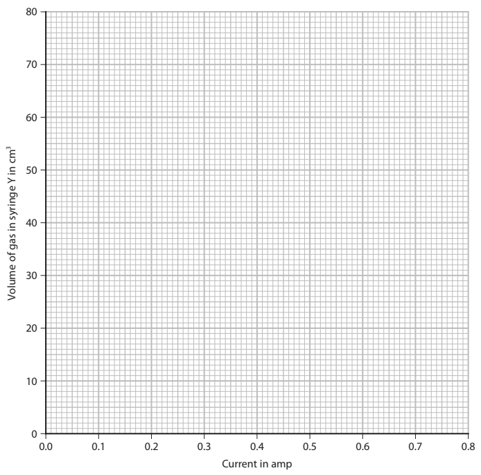

iv) Explain a possible cause of the anomalous result, other than misreading the apparatus.

(2)

v) Deduce the relationship between current and volume of gas collected in syringe Y.

(1)

### 3((d)) — 2 marks — command: suggest — structured — from paper 2021 · Nov1CR
#### Separate: Chemistry Only

The ionic half-equation for the reaction that produces the gas in syringe X is

2Cl–→ Cl2 + 2e–

The ionic half-equation for the reaction that produces the gas in syringe Y is

2H+ + 2e– → H2

i) Suggest how these ionic half-equations show that the volume of chlorine collected in syringe X should be the same as the volume of hydrogen collected in syringe Y.

(1)

ii) Suggest why the volume of chlorine collected in syringe X is always less than the volume of hydrogen collected in syringe Y.

(1)

## Q15 — hard — 12 marks · exam-questions

### 6((a)) — 3 marks — command: describe — structured — from paper 2022 · Ja2CR
#### Separate: Chemistry Only

A teacher prepares the insoluble salt lead(II) bromide (PbBr2) by mixing solutions of lead(II) nitrate and sodium bromide.

Describe what the teacher should do next to obtain a pure, dry sample of lead(II) bromide.

### 6((b)) — 2 marks — command: explain — structured — from paper 2022 · Ja2CR
#### Separate: Chemistry Only

The teacher then sets up a circuit in a fume cupboard using the pure, dry sample of lead(II) bromide.

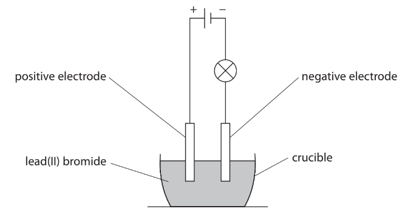

Explain why the lamp does not light when the lead(II) bromide is solid.

### 6((c)) — 5 marks — command: multiple — structured — from paper 2022 · Ja2CR
#### Separate: Chemistry Only

The teacher heats the lead(II) bromide. When the lead(II) bromide is molten, the lamp lights and bromine forms at the positive electrode.

i) State what observation would be made at the positive electrode.

(1)

ii) Explain how bromide ions in the molten lead(II) bromide become bromine molecules at the positive electrode.

(4)

### 6((d)) — 2 marks — command: write — structured — from paper 2022 · Ja2CR
#### Separate: Chemistry Only

Write an ionic half-equation for the reaction that occurs at the negative electrode. Include state symbols in your equation.

## Q16 — hard — 13 marks · exam-questions

### 1() — 4 marks — command: describe — structured
This question is about sodium chloride.

Describe the structure and bonding in sodium chloride.

### 2() — 4 marks — command: describe — structured
#### Separate: Chemistry Only

Describe, in terms of electrons and with the help of suitable equations, what happens during the electrolysis of molten sodium chloride.

### 3() — 2 marks — command: explain — structured
The products of electrolysis of molten sodium chloride are different to those of aqueous sodium chloride.

Explain the different products from the electrolysis of aqueous sodium chloride.

### 4() — 3 marks — command: explain — structured
#### Separate: Chemistry Only

Nuclear submarines can stay underwater for months without needing to come to the surface.

Oxygen for the crew to breathe is produced using a piece of equipment called an automated electrolytic oxygen generator.

Many people assume that seawater is electrolysed to produce the oxygen, this assumption is incorrect.

Explain why the assumption is not only incorrect but potentially hazardous and how the oxygen can be produced by electrolysis.
