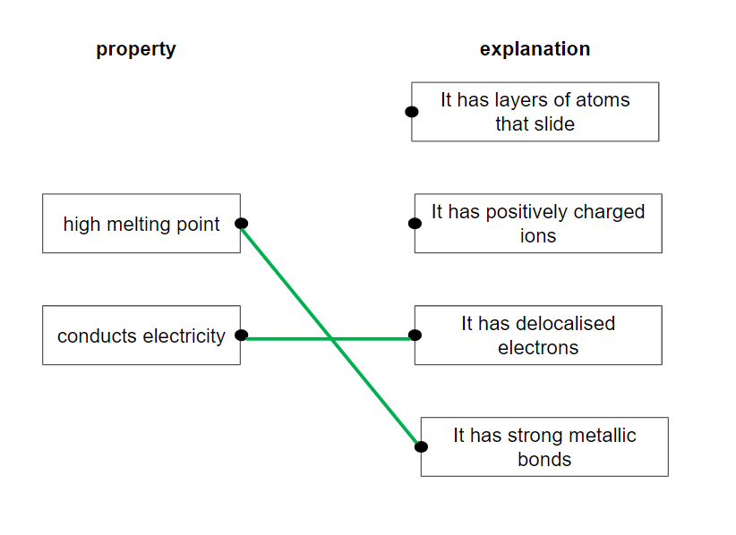
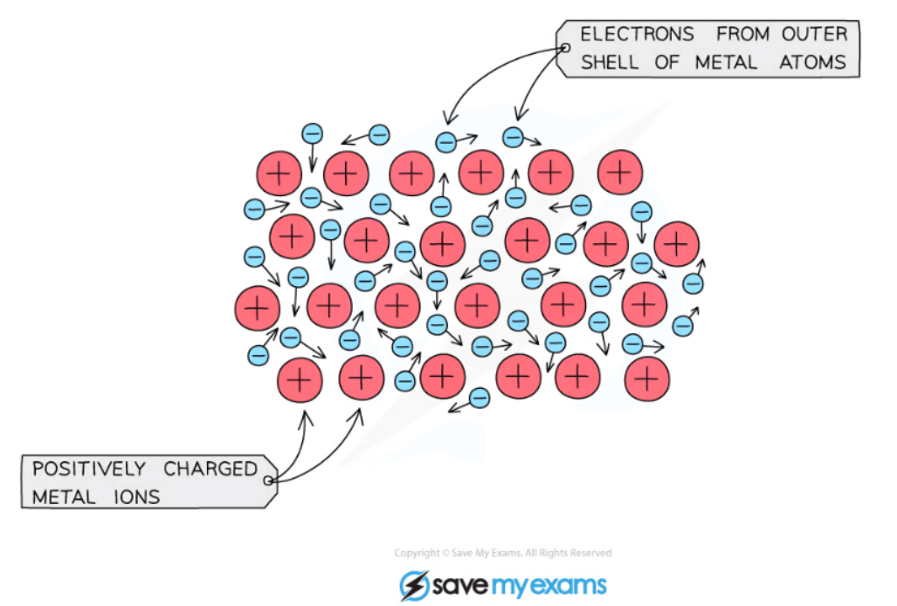
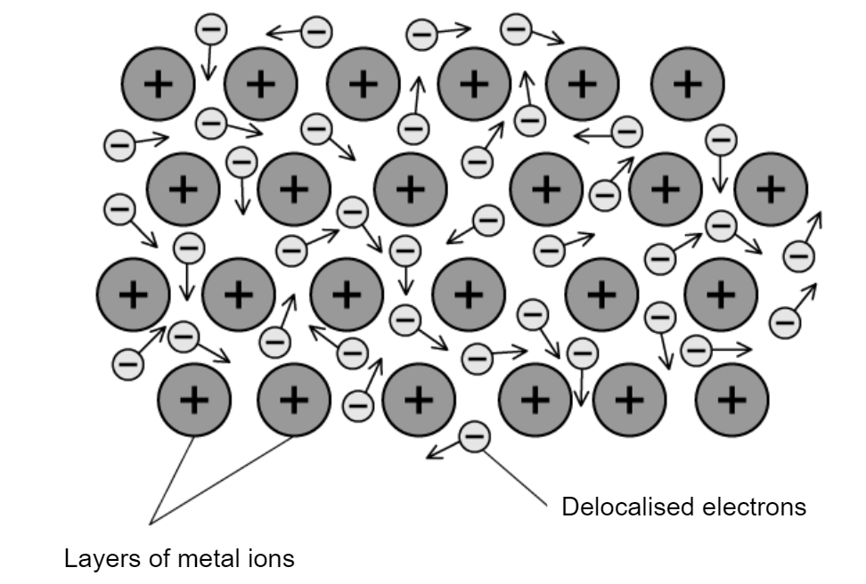
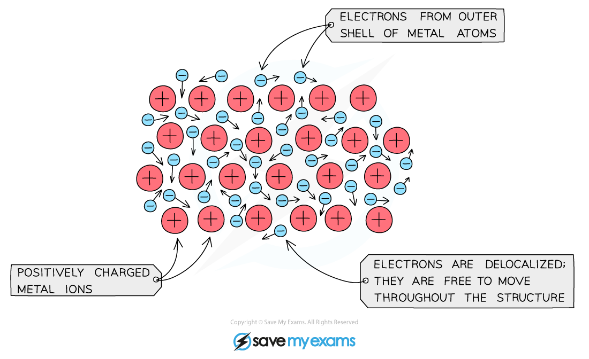
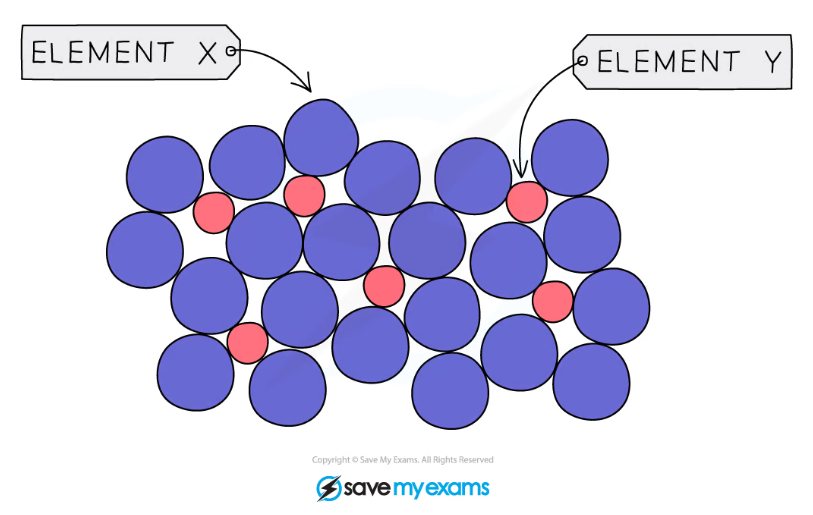

# Mark Schemes — Metallic bonding
**5. Principles of Chemistry: Part 2** · Edexcel IGCSE Chemistry (Modular) (4XCH1) — 24/Unit 2

## Q1 — easy — 1 marks · exam-questions

### 1() — 1 marks
**Correct answer: C** — X:positively charged metal ionsY:delocalised electrons

**Final answer:** **The correct answer is C.**

- The correct answer is **C** because:

  - Within the metal lattice, the atoms lose their outer electrons and become positively charged metal ions
  - The outer electrons no longer belong to any metal atom and are said to be delocalised
  - They move freely between the positive metal ions like a sea of electrons

## Q2 — easy — 1 marks · exam-questions

### 1() — 1 marks
**Correct answer: C** — High melting point

**Final answer:** **The correct answer is C.**

- The correct answer is **C** because a lot of heat energy is required to break the many strong metallic bonds that exist in a giant metallic structure
- This means they have high melting points

## Q3 — easy — 8 marks · exam-questions

### 1() — 2 marks
Metals can be easily shaped because:

- The atoms are in layers;** [1 mark]**
- The atoms can slide over each other: **[1 mark]**

**[Total: 2 marks]**

### 2() — 2 marks
The correct explanation for each property is:

- Each correct property and explanation;** [1 mark]**

**[Total: 2 marks]**

- *You must only have **one** line from each box on the left - if there is more than one, this negates the mark*
- *The strong metallic bonds are between the positive metal ions and the delocalised electrons*
- *Lots of energy is needed to overcome this attraction hence the high melting point *
- *One common mistake is identifying whether electrons or ions are moving and carrying a charge*

  - *Ions are only moving if the substance has ionic bonding and is molten or in solution*
  - *In all other cases, the electrons are moving and carrying the charge*

### 3() — 1 marks
An alloy is:

- (an alloy is) a mixture of elements, one of which is a metal *allow (an alloy is) a mixture of (two or more) metals* *alloy (an alloy is) a mixture of a metal and another metal*
**OR**
(an alloy is) a mixture of a metal and another element;** [1 mark]** *allow combination for mixture*
*reject compound or references to chemical bonding/combining of metals*

**[Total: 1 mark]**

### 4() — 2 marks
The completed sentence is:

The atoms in an alloy are different **sizes,** so the layers are unable to **slide** over each other when pressure is applied.

- Sizes; **[1 mark]**
- Slide; **[1 mark]**

**[Total: 2 marks]**

- *You will be aware of many alloys such as steel, brass, and bronze, all of which are harder than the individual elements they are made from*

### 5() — 1 marks
An alloy is not a compound because:

- The atoms are not chemically bonded together; **[1 mark]**

**[Total: 1 mark]**

## Q4 — easy — 5 marks · exam-questions

### 1() — 2 marks
Two properties typical of these metals are:

Any **two **from:

- Conduct electricity;** [1 mark]**
- Conduct heat; **[1 mark]**
- Shiny;** [1 mark]**
- High melting / boiling points; **[1 mark]**
- Malleable; **[1 mark]**
- Ductile;** [1 mark]**

**[Total: 2 marks]**

### 2() — 1 marks
**Correct answer: C** — cations in a sea of delocalised electrons

**Final answer:** **The correct answer is C.**

- This lattice consists of cations in a sea of delocalized electrons.
- Metals consist of positively charged ions surrounded by a sea of delocalised electrons
- You should know that cations are positively charged ions, and anions are negatively charged ions

### 3() — 1 marks
A high temperature has to be used because:

- (Metals have) high melting points; **[1 mark]**

**[Total: 1 mark]**

- *A high temperature is needed to overcome the strong electrostatic attraction between the positively charged ions and delocalised electrons*

### 4() — 1 marks
**Correct answer: B** — to prevent the metal reacting with oxygen

**Final answer:** **The correct answer is B.**

- An atmosphere of argon is used to prevent the metal reacting with oxygen.
- Argon is an inert / unreactive element because it has a full outer shell of electrons
- If air was used, the oxygen from it would react with the metals to form metal oxides

## Q5 — easy — 5 marks · exam-questions

### 1() — 1 marks
**Correct answer: D** — Option D

**Final answer:** **The correct answer is D.**

- The number of protons, neutrons and electrons found in an atom of aluminium is **D**.
- Looking at the Periodic Table

  - Aluminium has an atomic number of 13
  
    - The atomic number is the number of protons = 13
    - The number of protons is equal to the number of electrons = 13
  - Aluminium has a mass number of 27
  
    - The mass number take away the atomic number is the number of neutrons
    - 27 - 13 = 14

### 2() — 2 marks
Two physical properties of aluminium are:

Any **two **from:

- Conducts electricity; **[1 mark]**
- Conducts thermal energy / heat;** [1 mark]**
- Ductile;**  [1 mark]**
- High melting point / high boiling point;  **[1 mark]**
- Malleable; ** [1 mark]**
- Shiny; ** [1 mark]**
- Strong; ** [1 mark]**
*accept low density*

**[Total: 2 marks]**

- *Don't get confused between ductile and malleable *

  - *A metal being malleable means it can be hammered / bent into shape*
  - *A metal being ductile means it can be drawn into wires*

### 3() — 1 marks
**Correct answer: D** — Mixture

**Final answer:** **The correct answer is D.**

- An alloy is a Mixture.
- An alloy is defined as a mixture of metals whereby the metals are not chemically bonded together

### 4() — 1 marks
The percentage of substances other than aluminium found in bauxite is:

- (100 - 17) = 83%; **[1 mark]**

**[Total: 1 mark]**

- *This question is a mathematical question*
- *If 17% of bauxite is aluminium, the remainder must be made of substances other than aluminium*

## Q6 — medium — 1 marks · exam-questions

### 1() — 1 marks
**Correct answer: A** — Substance W

**Final answer:** **The correct answer is A.**

- The correct answer is **A** because metals have high melting and boiling points due to the presence of strong electrostatic forces acting between the positively charged metal ions and the delocalised electrons

  - These forces act in all directions and a lot of energy is required to overcome them
  - Metals can conduct electricity in either the solid or liquid state as they have delocalised electrons that can move and carry charge
- **B** is incorrect as substance X cannot conduct electricity when solid.

  - This is an ionic compound as ionic compounds are unable to conduct when solid as the ions are unable to move
- **C** & **D** are incorrect as substances Y & Z are unable to conduct electricity when solid or liquid.

  - Metals can conduct electricity when solid or liquid as the delocalised electrons can move

## Q7 — medium — 1 marks · exam-questions

### 1() — 1 marks
**Correct answer: C** — Copper is malleable as the layers of ions can slide over each other

**Final answer:** **The correct answer is C.**

- The statement which explains a physical property of copper is: Copper is malleable as the layers of ions can slide over each other.
- **C **is the correct answer because being malleable allows a metal to be hammered into shape

  - This is because when force is applied, the layers of positive copper ions are able to slide over each other
- **A** is incorrect as copper ions are fixed in position and do not carry charge through the structure. The delocalised electrons are free to move and carry charge through the structure
- **B** is incorrect as the high melting point is due to the strength of the metallic bonds which are a result of the attraction between the positive metal ions and the negatively charged delocalised electrons
- **D **is incorrect as when the layers of positive ions slide over each other, metallic bonding is not disrupted.

  - This is because the electrons do not belong to any particular atom so the delocalised electrons move with them.
  - The metallic bonds do not break

## Q8 — medium — 10 marks · exam-questions

### 1() — 4 marks
The structure and bonding in zinc can be described as follows:

- (Zinc has a) lattice structure;** ****[1 mark]**
- There are positive (metal) ions / atoms; **[1 mark]**
- (Surrounded by a sea of) delocalised / free electrons; **[1 mark] **
- Electrostatic attraction between them; **[1 mark] **

**[Total: 4 marks]**

- *A diagram can be useful to help your response and can gain the first 2 marks as long as it is labelled:* 

### 2() — 2 marks
Zinc conducts electricity because:

- The delocalised electrons / free electrons / sea of free electrons can move through the structure; **[1 mark] **
- And carry a charge;** [1 mark] **

**[Total: 2 marks]**

- *For a substance to conduct electricity there must be a flow of charge*
- *Remember**: Graphite and metals conduct because **electrons** move, ionic substances conduct (when molten and in solution) because** ions **move*

### 3() — 2 marks
Their conductivity is reduced because:

- A metal oxide compound is formed;** [1 mark] **
- Which does not contain ions or electrons (to carry the charge) 
**OR**
** **There are fewer / no electrons that are free to move (and carry the charge;)** ****[1 mark]**** **

**[Total: 2 marks]**

- *The more free electrons there are, the higher the conductivity of the metal*

### 4() — 2 marks
Metals can be bent into shape because:

- Metal structure consists of layers (of particles / atoms / ions); **[1 mark]**
- They / particles / atoms / ions / layers) are able to / can slide (without breaking); **[1 mark]**

**[Total: 2 marks]**

- *Careful:** A common mistake is to discuss intermolecular forces for this question *
- *Metallic structures and alloys do not contain intermolecular forces *
- *Any reference to these even with the correct answer above will mean you may lose the second mark *

## Q9 — medium — 12 marks · exam-questions

### 1() — 2 marks
i) The electronic configuration for a potassium atom is:

- 2.8.8.1; **[1 mark]**

ii) The formula for a potassium ion is:

- K+; **[1 mark]**

**[Total: 2 marks]**

- *Potassium has 19 electrons*

  - *The first shell can hold a maximum of 2*
  - *The second shell can hold a maximum of 8 *
  - *The third shell can hold a maximum of 8 *
  - *That leaves 1 remaining in the fourth shell *
- *To form an ion, potassium loses its outer shell electron *
- *The ion has one more proton than electrons, so a 1+ charge overall *

### 2() — 3 marks
i) One other physical property of potassium is:

Any **two** from:

- Low density;** [1 mark]**
- Low melting point;** [1 mark]**
- (Good) conductor (heat or electricity); **[1 mark]**
- Shiny (when freshly cut); **[1 mark]**
- Malleable; **[1 mark]**
- Ductile; **[1 mark]**

ii) One chemical property of sodium is:

Any **one** from:

- Very reactive; **[1 mark]**
- Reacts with water (not steam); **[1 mark]**
- Forms salts with halogens; **[1 mark]**
- React vigorously with acids;** [1 mark]**
- Forms an alkaline or basic oxide;** [1 mark]**
- Has one valency or outer shell electron so does not form ionic compounds on its own;** [1 mark]**

**[Total: 3 marks]**

- *It is common to get confused as to which properties fall into which categories*
- *A chemical property is related to the way that a substance reacts*
- *A physical property is one which can be observed without changing the substance *

### 3() — 4 marks
To compare the structure and bonding of potassium with potassium chloride:

Similarities

- Both contain positive metal ions; **[1 mark]**
- Both have a giant lattice structure;** [1 mark]**

Plus, any** two** differences from:

Potassium

- Metallic bonding;** [1 mark]**
- Has a sea of delocalised electrons; **[1 mark]**
- There is an electrostatic attraction between metal ions and (delocalised) electrons; **[1 mark]**

Potassium chloride

- Ionic bonding; **[1 mark]**
- Has negative anions / non-metal ions; **[1 mark] **
- There is an electrostatic attraction between oppositely charged ions;** [1 mark]**

**[Total: 4 marks]**

- *A 'compare' question is asking you to give the similarities and differences between the substances*
- *For a four-mark question, you can assume there are two similarities and two differences*
- *Examiners will sometimes make this question:*

  - *More challenging*
  
    - *This would be done by combining the differences between potassium and potassium choride to achieve each mark, for example:*
    - *Potassium has metallic bonding but potassium chloride has ionic bonding*
    - *Potassium has a sea of delocalised electrons but potassium chloride has negative anions*
  - *Worth more marks*
  
    - *Increasing the number of marks to 6, means that you would get 2 marks for the similarities, 2 marks for comments about potassium and 2 marks for comments about potassium chloride*

### 4() — 3 marks
The conditions in which potassium oxide can conduct electricity are:

- When aqueous / in solution; **[1 mark]**
- When molten / melted / as a liquid; **[1 mark]**
- (Because) the ions can move and carry a charge; **[1 mark]**

**[Total: 3 marks]**

- *For a substance to conduct electricity, there must be a flow of charge*
- *When potassium oxide is solid, the ions are in fixed positions*

  - *This means that the ions are unable to move*
- *Melting the compound or dissolving it in water allows the ions to move*

## Q10 — medium — 12 marks · exam-questions

### 3((a)) — 5 marks
i) The structure and bonding in a metallic element is:

- Positive ions / cations; **[1 mark]**
- Electrons; **[1 mark]**
- Attraction between positive (ions) and negative (electrons); **[1 mark] **

ii) Metallic elements such as gallium are good conductors of electricity because:

- There are delocalised electrons; **[1 mark] **
- Which are mobile / can move; **[1 mark] **

**[Total: 5 marks] **

- *The first 2 marks in part (i) can be gained from the diagram*
- *The principles of structure and bonding in any metallic element are the same, regardless of the metal*

  - *Therefore the response to this question will be a standard response*
  - *It does not matter which metal you are asked about *

### 2() — 3 marks
The completed table should include:

| **particle** | **number of protons** | **number of electrons** | **number of neutrons** |
|---|---|---|---|
| `Ga presubscript 31 presuperscript 71` | 31 | 31 | 40 |
| `Ga presubscript 31 presuperscript 71 superscript 3 plus end superscript` | 31 | 28 | 40 |
| `Ga presubscript 31 presuperscript 69` | 31 | 31 | 38 |

- Each correct row; **[1 mark]**

**[Total: 3 marks]**

- *The number of protons is given by the atomic number and is the same for any atom of the same element*

  - *The number of electrons is the same as the number of protons in a neutral atom*
  - *For the Ga**3+** ion remember that this charge means 3 fewer electrons*
- *The number of neutrons = mass number – atomic number*

  - *So, the two isotopes of gallium-71 will have the same number of neutrons*
  
    - *71 - 31 = 40*

### 3((b)) — 2 marks
The formulae are:

- Gallium(III) chloride: GaCl3; **[1 mark] **
- Gallium(III) sulfate: Ga2(SO4)3; **[1 mark]**

**[Total: 2 marks] **

- *You can use the 'swap and drop' method to determine the formula of gallium(III) chloride and gallium(III) sulfate *

  - *The roman numeral number in brackets tells us that gallium has a charge 3+ *
  - *Chloride ions have a charge of 1-*
  - *Sulfate ions have a charge of 2-*
- *The swap and drop method for gallium(III) chloride is:*

  - *Ga**3+ **and Cl**- **(swap and drop charges)*
  - *Ga**–**Cl**3+ **(remove charges)*
  - *GaCl**3 *
- *The swap and drop method for gallium(III) sulfate is:*

  - *Ga**3+ **and SO**4**2- **(swap and drop charges)*
  - *Ga**2–**(SO**4**)**3+ **(remove charges)*
  - *Ga**2**(SO**4**)**3 *
- *Remember to add brackets for polyatomic ions*

  - *Ga**2**(SO**4**)**3 **is different from Ga**2**SO**43*

### 3((d)) — 2 marks
**Two** reasons why alloys of gallium are more useful than the metallic element:

Any **two** of the following:

- (Do not) corrode; **[1 mark]**
- Stronger;** [1 mark]**
- Harder; **[1 mark]**
- (Improved) appearance; **[1 mark] **

**[Total: 2 marks] **

- *Alloys contain atoms of different sizes, which distorts the normally regular arrangements of atoms in metals*
- *This makes it more difficult for the layers to slide over each other, so alloys are usually much harder than the pure metal*

## Q11 — hard — 1 marks · exam-questions

### 1() — 1 marks
**Correct answer: B** — Electrostatic attraction between positively charged particles and delocalised electrons

**Final answer:** **The correct answer is B.**

- **B** is the correct answer because:

  - Metal atoms lose their outer electrons and become positively charged
  - The outer electrons no longer belong to any metal atom and are said to be delocalised
  - They move freely between the positive metal ions
  - Metallic bonds are strong and are a result of the attraction between the positive metal ions and the negatively charged delocalised electrons

## Q12 — hard — 7 marks · exam-questions

### 4((a)) — 1 marks
**Correct answer: C** — electrostatic attraction between positively charged particles and delocalised electrons

**Final answer:** **The correct answer is C.**

- The statement which correctly describes metallic bonding is electrostatic attraction between positively charged particles and delocalised electrons.
- A is incorrect since it describes ionic bonding not metallic bonding
- B is incorrect since it describes covalent bonding not metallic bonding
- D is incorrect since it describes interatomic or intermolecular forces not metallic bonding

### 4((b)) — 2 marks
Two properties, other than malleability, that make aluminium suitable for saucepans used for cooking food:

Any **two** from:

- Good conductor of heat / thermal energy; **[1 mark]**
* Ignore "good conductor" alone (must specify heat/thermal)*
- Does not react with food / affect flavour of food; **[1 mark]**
*Ignore "non-toxic";*
- Resistant to corrosion;** [1 mark]**
*Allow does not corrode / does not rust*
*Ignore "unreactive" or "inert" (unless linked specifically to food/acid)*
- High melting point; **[1 mark]**
*Implies it won't melt on the stove*
- Low density / lightweight / strong;** [1 mark]**
*Allow"lightweight"*
*Ignore "light"*

**[Total: 2 marks]**

- *You could also have that aluminium does not rust or corrode*
- *You would not get credit for answers referring to the low density of aluminium (not relevant to a cooking pot) or that it can be recycled (not a property)*

### 4((c)) — 4 marks
i)  What is meant by the term alloy:

- A mixture of (two or more) elements, one of which is a metal; **[1 mark]**

ii)  Why magnalium is harder than aluminium:

- The regular arrangement of atoms is distorted / disrupted; **[1 mark]**
- As magnesium atoms are larger than aluminium atoms;** [1 mark]**
- Therefore it is more difficult for the layers to slide over one another;** [1 mark]**

**[Total: 4 marks]**

- *For the definition of an alloy you can use a mixture of metals, but any references to it being a compound or having chemical bonding would not score*
- *A good word to use in talking about metal structure is lattices*
- *You can get credit for the second mark as long as you identify that they are different sizes*
- *References to the strength of metallic bonds would not count as it misses the point about layers of atoms being unable to easily slide over each other, which is critical*

## Q13 — hard — 11 marks · exam-questions

### 1() — 5 marks
The structure and bonding in copper can be described as follows:

- Electrons are delocalised;** ****[1 mark]**
- (So) metals form positive ions; **[1 mark]**
- Positive ions and electrons attract each other (which holds the structure together);** [1 mark] **
- There are no bonds between adjacent atoms / ions;** [1 mark]**
- So the atoms / ions can slide over each other; **[1 mark]**

**[Total: 5 marks]**

- *The first mark will be awarded for any reference to the fact that the electrons in a metal do not belong to specific atoms*
- *Some students find describing the structure of a metal tricky so a diagram can be useful to help your response and can gain the first 2 marks:*  *Remember: **Malleable means it can be hammered into shape without breaking*
- *Drawing the diagram first will help you answer this as you can clearly see that the atoms would be able to slide over each other if pressure was applied *

### 2() — 4 marks
Electrical conductivity increases across period 3 because:

- There are delocalised / free electrons in the structure; **[1 mark] **
- These can carry a charge / current;** [1 mark] **
- (Moving across period 3) The atoms have more free electrons;** [1 mark]**
- Because there are more electrons in the outer shell; **[1 mark] **

**[Total: 4 marks]**

- *A common error to make here is to not reference the fact there are more electrons **because** there are more in the outer shell *
- *Sodium is in Group 1, magnesium is in Group 2 and aluminium Group 3, so there is one more delocalised electron per atom in each case meaning more charge can be carried *

### 3() — 1 marks
The charge on the oxide ion is:

- 2- **AND** (Because) it / oxygen has gained two electrons; **[1 mark]**

**[Total: 1 mark]**

- *This is a hard question so you do not score 1 mark for simply identifying the charge on the ion, you must give the correct explanation as well*
- *Oxygen is a non metal so will gain electrons from the copper atom *
- *Oxygen had 6 protons, and 6 electrons so the charges balanced each other out*
- *Gaining two more electrons means there are two additional negative charges *

### 4() — 1 marks
A half equation for the reaction that copper undergoes is:

- Cu   →     Cu2+    +   2e(-); **[1 mark]**

**[Total: 1 mark]**

- *Copper atoms lose two electrons to form copper ions with a 2+ charge *
- *The half equation therefore shows oxidation as:*

  - *OIL RIG= **O**xidation** I**s **L**oss (of electrons) **R**eduction **I**s **G**ain (of electrons)*
- *You would also score the mark for writing:  Cu  -  2e**-**  →     Cu**2+**   *
- *Although the number of atoms / ions does not need changing in this case to make the equation balanced, this is often forgotten by students*
- *You also need to make sure the charges are balanced *
- *The half equation for the reduction (gain of electrons) of oxygen would be:*

  - *O**2 ** +  4e**-**  →    2O**2-*
  - *Again, the atoms / ions and the charges need to be balanced*

## Q14 — hard — 9 marks · exam-questions

### 1() — 4 marks
Iron has a high melting point because:

- It has a giant structure;** [1 mark]**
- (There are) strong forces of attraction; **[1 mark]**
- Between positive metal ions and delocalised electrons; **[1 mark]**
- Which needs lots of energy to break; **[1 mark]**

**[Total: 4 marks]**

- *The structure of a metal is:*

- *The metallic bond is a very strong attraction between the positive metal ion and negative electrons *
- *This is a very strong attraction which would require large amounts of energy to overcome*

### 2() — 3 marks
Stainless steel is harder than pure iron because:

- Atoms / ions / particles in alloy are different (sizes); **[1 mark]**
- The layers are distorted; **[1 mark]**
- (So) the layers/atoms/particles do not slide over each other; **[1 mark] **

**[Total: 3 marks]**

> *An alloy is a mixture of metals and can be represented as:*

- *Pure metals consist of the same atoms which are therefore the same size allowing layers to form*
- *These layers can easily slide over each other when pressure is applied *
- *A lot of metals are turned into alloys because the alloy is harder and therefore more useful in many materials*

### 3() — 1 marks
Properties of stainless steel that make them useful as hip replacement joints are:

Any **one** from:

- Resistant to corrosion;** [1 mark]**
- High tensile strength;** [1 mark]**
- It's durable;** [1 mark]**

**[Total: 1 mark]**

- *The command word 'suggest' indicates you might not have studied this specifically but that you should apply your understanding of alloys to this context *

### 4() — 1 marks
Nickel and chromium are both good thermal conductors because:

- Delocalised electrons are free to move (and carry thermal energy);** [1 mark]**

**[Total: 1 mark]**

- *As a metal is heated, the positive ions gain kinetic energy and vibrate more*
- *The delocalised electrons transfer the kinetic energy to cooler parts of the metal by colliding with ions as they move*

## Q15 — hard — 12 marks · exam-questions

### 1() — 2 marks
The ions are held together in lithium and lithium chloride by:

- (Electrostatic) attraction / electrostatic forces between positive metal / lithium ions / Li+ and (the sea of) delocalised electrons ; **[1 mark]**
- Electrostatic attraction / electrostatic forces between oppositely charged ions / Li+  and Cl- 
**OR** 
Electrostatic attraction / electrostatic forces between positive & negative ions; **[1 mark]**

**[Total: 2 marks]**

- *Correctly drawn diagrams would also score the marks as long as they are labelled*
- *The idea of attraction between ions with opposite charges must be clear*

### 2() — 2 marks
Explaining what can be deduced from the information in Table 4.1:

- The melting and boiling points of lithium chloride are higher than lithium** OR** The melting and boiling points of lithium are lower than lithium chloride** OR **The melting and boiling points of an ionic substance are higher than a metal **OR** **The melting and boiling points of a metal are lower than an ionic substance;**** [1 mark]**
- **(Because) **Ionic bonds (in lithium chloride) are stronger than metallic bonds (in lithium) 
**OR** 
Ionic bonds (or bonding) require more energy to break than metallic bonds 
**OR** 
Electrostatic attraction between oppositely charged ions (in lithium chloride) is stronger than electrostatic attraction between positive ions and delocalised electrons (in lithium metal);** ****[1 mark]**

**[Total: 2 marks]**

- *Ionic bonds are stronger than metallic bonds and you are expected to know this for the exam*
- *In this question you have been asked to use the table, so you **must** use the table in your answer*
- *The more marks a question is worth, the more you will have to use the data and explain your answer in detail*

### 3() — 5 marks
State and explain whether Student A, Student B, or neither student is correct:

- Both Student **A** and Student **B** are incorrect (neither student is correct) 
**OR**
 Student B is incorrect and Student A is partly correct;** [1 mark]**
- Lithium will conduct electricity (at all times);** [1 mark]**
- Lithium has delocalised electrons which can flow through the (metal) structure and carry the charge / carrying the current;** [1 mark]**
- Lithium chloride will conduct electricity when molten / dissolved in solution, but will not conduct electricity when solid;** [1 mark]**
- When solid the (negative) ions are fixed in position and cannot move 
**AND**
 When molten / dissolved in solution the (negative) ions are mobile and can move, carrying the charge / carrying current ; **[1 mark]**

**[Total: 5 marks]**

- *For a substance to conduct electricity, there must be a flow of negative charge *

  - *I.e., a flow of electrons or a flow of negative ions*

- *A metal has delocalised electrons which can flow at all times; this is why metals conduct electricity*
- *Ionic solids will only conduct electricity when **molten**/**dissolved** in solution*

  - *When solid, the ions are fixed in their position and cannot move, so the negative ions cannot flow *
  - *No movement of negative ions, means no electrical conductivity*
  - *When molten/dissolved in solution the ions have been ‘pulled apart’ from their solid structure, and they are mobile (they can freely move around)*
  - *Because the ions are now able to flow, electricity can also flow*

### 4() — 3 marks
Explain, in terms of electrons, how CaF2 is formed from its atoms:

- One calcium atom loses two electrons; **[1 mark]**
- Two fluorine atoms  each gain one electron; **[1 mark]**
- Forming one calcium ion / one Ca2+ and two fluoride ions / two F-;** [1 mark]**

**[Total: 3 marks]**

- This question is worth 3 marks, so it is reasonable to deduce that you will score one mark for describing the loss / gain of electrons for each atom and the third for describing the ions produced
- Calcium is in Group 2 so will lose two electrons to gain a full outer shell and form a positively charged ion
- The formula tells you that there are two fluoride ions present, each of which will gain one electron to form a negatively charged ion
