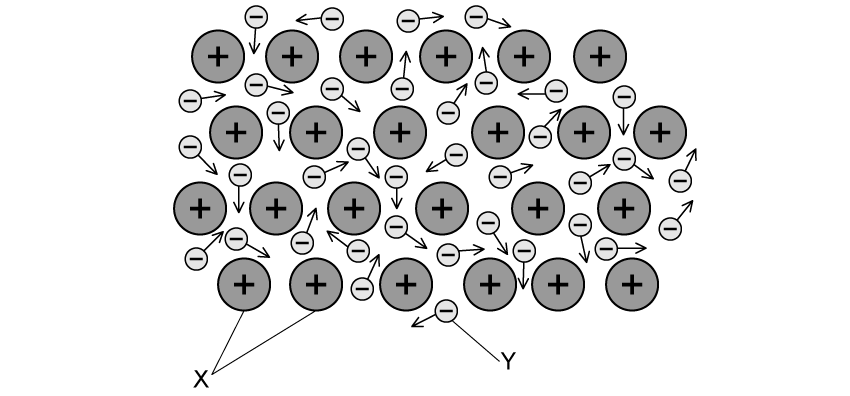

# Exam Questions — Metallic bonding
**5. Principles of Chemistry: Part 2** · Edexcel IGCSE Chemistry (Modular) (4XCH1) — 24/Unit 2
> Source: [https://www.savemyexams.com/igcse/chemistry/edexcel/modular/24/unit-2/topic-questions/principles-of-chemistry/metallic-bonding/exam-questions/](https://www.savemyexams.com/igcse/chemistry/edexcel/modular/24/unit-2/topic-questions/principles-of-chemistry/metallic-bonding/exam-questions/) · 15 questions · total 96 marks

## Q1 — easy — 1 marks · exam-questions

### 1() — 1 mark — multiple_choice
#### Separate: Chemistry Only

A metallic lattice structure is shown in the diagram.

What are the missing labels, **X** & **Y**?
- **A.** X:positively charged metal ionsY:negatively charged ions
- **B.** X:positively charged protonsY:negatively charged non-metal ions
- **C.** X:positively charged metal ionsY:delocalised electrons
- **D.** X:positively charged protonsY:negatively charged electrons

## Q2 — easy — 1 marks · exam-questions

### 1() — 1 mark — multiple_choice
#### Separate: Chemistry Only

Metals exists in giant metallic structures which have many strong metallic bonds.

Which of these properties of metals can be explained by this feature of their structure?
- **A.** Good conductors of electricity
- **B.** Malleable and ductile
- **C.** High melting point
- **D.** High density

## Q3 — easy — 8 marks · exam-questions

### 1() — 2 marks — command: tick — structured
#### Separate: Chemistry Only

This question is about magnesium.

Magnesium can be shaped easily.  Place ticks in boxes by the two statements which explain why metals can be shaped.

| The atoms are all joined by ionic bonds. |   |
|---|---|
| The atoms can slide over each other. |   |
| The atoms are small. |   |
| The atoms are in layers. |   |
| The atoms are different sizes |   |

### 2() — 2 marks — command: draw — structured
#### Separate: Chemistry Only

The boxes give two properties of metallic compounds and possible explanations for these properties.

Draw one straight line from each property to the correct explanation.

### 3() — 1 mark — command: what — structured
#### Separate: Chemistry Only

What is meant by an alloy?

### 4() — 2 marks — command: complete — structured
#### Separate: Chemistry Only

Magnesium can be mixed with other elements to form an alloy to make it harder.  The structure of an alloy is shown.

Complete the sentence to explain why an alloy is harder than a pure metal:

The atoms in an alloy are different ____________________ so the layers are unable to ____________________ over each other when pressure is applied.

### 5() — 1 mark — command: why — structured
Why is it incorrect to describe an alloy as a compound?

## Q4 — easy — 5 marks · exam-questions

### 1() — 2 marks — command: give — structured
Welding involves joining two pieces of metal together.

Copper and iron are two metals that this can occur with.

Give two properties typical of these metals.

### 2() — 1 mark — multiple_choice
#### Separate: Chemistry Only

Metals have a lattice structure?  What does this lattice consist of?
- **A.** anions and cations
- **B.** anions
- **C.** cations in a sea of delocalised electrons
- **D.** molecules in a sea of electrons

### 3() — 1 mark — command: why — structured
#### Separate: Chemistry Only

To join two pieces of metal by welding, they must be melted together.  State why a high temperature has to be used.

### 4() — 1 mark — multiple_choice
An atmosphere of argon is used when the pieces of metal are welded together.  Why is an atmosphere of argon used?
- **A.** to speed up the process of welding
- **B.** to prevent the metal reacting with oxygen
- **C.** to increase the melting point of the materials
- **D.** to save energy

## Q5 — easy — 5 marks · exam-questions

### 1() — 1 mark — multiple_choice
Aluminium is an element found in Group 3 of the Periodic Table.

Use your Periodic Table to deduce the number of protons, neutrons and electrons found in an atom of aluminium.

|   | ** ** | **protons** | **neutrons** | **electrons** |
|---|---|---|---|---|
| ☐ | **A** | 13 | 27 | 13 |
| ☐ | **B** | 13 | 27 | 14 |
| ☐ | **C** | 27 | 14 | 14 |
| ☐ | **D** | 13 | 14 | 13 |
- **A.** Option A
- **B.** Option B
- **C.** Option C
- **D.** Option D

### 2() — 2 marks — command: give — structured
#### Separate: Chemistry Only

Give two physical properties of aluminium.

### 3() — 1 mark — multiple_choice
#### Separate: Chemistry Only

Duralumin is an alloy of aluminium and copper.  What type of substance is an alloy?
- **A.** Atom
- **B.** Element
- **C.** Compound
- **D.** Mixture

### 4() — 1 mark — command: calculate — structured
Aluminium is extracted from bauxite, a mixture containing aluminium oxide.

One sample of bauxite contains 17% aluminium.  Calculate the percentage of substances other than aluminium found in bauxite.

## Q6 — medium — 1 marks · exam-questions

### 1() — 1 mark — multiple_choice
#### Separate: Chemistry Only

The table below shows the properties of four substances, **W**,** X**, **Y** and **Z**.

| **Substance** | **Melting point** | **Boiling point ** | **Conducts electricity when** |
|---|---|---|---|

|   | **/ ****o ****C** | **/ ****o ****C** | **solid ** | **liquid** |
|---|---|---|---|---|
| **W** | 3410 | 5930 | yes | yes |
| **X** | 801 | 1413 | no | yes |
| **Y** | 3550 | 4830 | no | no |
| **Z** | -91 | 98 | no | no |

Use the information in the table to identify the substance that is a metal.
- **A.** Substance W
- **B.** Substance X
- **C.** Substance Y
- **D.** Substance Z

## Q7 — medium — 1 marks · exam-questions

### 1() — 1 mark — multiple_choice
#### Separate: Chemistry Only

The diagram shows the arrangement of ions in copper metal.

Which statement explains a physical property of copper?
- **A.** Copper can conduct electricity as its ions are able to carry charge around its structure
- **B.** Copper has a high melting point as the metal ions are strongly attracted to each other
- **C.** Copper is malleable as the layers of ions can slide over each other
- **D.** Copper is malleable as the metallic bonds between the layers of ions break easily

## Q8 — medium — 10 marks · exam-questions

### 1() — 4 marks — command: describe — structured
#### Separate: Chemistry Only

Zinc is a typical metal.

Describe the structure and bonding in zinc.

### 2() — 2 marks — command: explain — structured
#### Separate: Chemistry Only

Explain how zinc is able to conduct electricity.

### 3() — 2 marks — command: suggest — structured
#### Separate: Chemistry Only

The surface of some metals, such as iron and copper, corrode when exposed to the air which reduces their electrical conductivity.

Suggest why their conductivity is reduced.

### 4() — 2 marks — command: explain — structured
#### Separate: Chemistry Only

Magnesium ribbon is used in many school laboratories for carrying out reactions involving metals and acids. It can be cut and folded easily.

Explain why metals can be bent and shaped.

## Q9 — medium — 12 marks · exam-questions

### 1() — 2 marks — command: state — structured
This question is about potassium.

Potassium is located in Group 1 of the Periodic Table.

i) State the electronic configuration for a potassium atom.

(1)

ii) State the formula of a potassium ion.

(1)

### 2() — 3 marks — command: give — structured
One physical property of potassium is that it is soft.

i) Give two other physical properties of potassium.

(2)

ii) Give one chemical property of potassium.

(1)

### 3() — 4 marks — command: compare — structured
#### Separate: Chemistry Only

Potassium can react with chlorine to form potassium chloride.  Compare the structure and bonding of potassium with potassium chloride.

### 4() — 3 marks — command: explain — structured
#### Separate: Chemistry Only

Explain the conditions in which potassium oxide can conduct electricity.

## Q10 — medium — 12 marks · exam-questions

### 3((a)) — 5 marks — command: multiple — structured — from paper 2016 · Ju42
#### Separate: Chemistry Only

Gallium is a metallic element in Group 3. It has similar properties to aluminium.

i) Describe the structure and bonding in a metallic element. You should include a labelled diagram in your answer.

(3)

ii) Explain why metallic elements such as gallium are good conductors of electricity.

(2)

### 2() — 3 marks — command: complete — structured
Gallium exists as two stable isotopes, gallium-69 and gallium-71.

Complete the following table to show the number of protons, electrons and neutrons in each particle.

| **particle** | **number of protons** | **number of electrons** | **number of neutrons** |
|---|---|---|---|
| `begin mathsize 16px style Ga presubscript 31 presuperscript 71 end style` |   |   |   |
| `Ga presubscript 31 presuperscript 71 superscript 3 plus end superscript` |   |   |   |
| `begin mathsize 16px style Ga presubscript 31 presuperscript 69 end style` |   |   |   |

### 3((b)) — 2 marks — command: give — structured — from paper 2016 · Ju42
Give the formulae of

Gallium(III) chloride ......................................

Gallium(III) sulfate ........................................

### 3((d)) — 2 marks — command: suggest — structured — from paper 2016 · Ju42
#### Separate: Chemistry Only

Alloys of gallium and other elements are often more useful than the metallic element itself.

Suggest **two** reasons why alloys of gallium are more useful than the metallic element.

## Q11 — hard — 1 marks · exam-questions

### 1() — 1 mark — multiple_choice
#### Separate: Chemistry Only

Which statement describes metallic bonding?
- **A.** Electrostatic attraction between atoms
- **B.** Electrostatic attraction between positively charged particles and delocalised electrons
- **C.** Electrostatic attraction between oppositely charged ions
- **D.** Electrostatic attraction between the nuclei of two atoms and a shared pair of electrons

## Q12 — hard — 7 marks · exam-questions

### 4((a)) — 1 mark — multiple_choice — from paper 2019 · Ju2C
#### Separate: Chemistry Only

This question is about metals.

Which statement describes metallic bonding?
- **A.** electrostatic attraction between oppositely charged ions
- **B.** electrostatic attraction between the nuclei of two atoms and a pair of electrons shared between them
- **C.** electrostatic attraction between positively charged particles and delocalised electrons
- **D.** electrostatic attraction between atoms

### 4((b)) — 2 marks — command: state — structured — from paper 2019 · Ju2C
#### Separate: Chemistry Only

Aluminium is malleable and can be easily shaped to make saucepans used for cooking food.

State two other properties of aluminium that make it suitable for saucepans used for cooking food.

1.......................................................................

2.......................................................................

### 4((c)) — 4 marks — command: multiple — structured — from paper 2019 · Ju2C
#### Separate: Chemistry Only

Magnalium is an alloy of aluminium and magnesium.

i) State what is meant by the term alloy.

(1)

ii) Explain why magnalium is harder than aluminium.

(3)

## Q13 — hard — 11 marks · exam-questions

### 1() — 5 marks — command: explain — structured
#### Separate: Chemistry Only

Copper is a typical metal.

Explain how the particles in copper are held together and why the metal is malleable.

You may use a diagram in your answer.

### 2() — 4 marks — command: explain — structured
#### Separate: Chemistry Only

Metals are good conductors of electricity.

Electrical conductivity increases across Period 3, from sodium to aluminium.

Explain why.

### 3() — 1 mark — command: explain — structured
Copper can react with oxygen to form copper (II) oxide. Explain the charge on the oxide ion.

### 4() — 1 mark — command: write — structured
Write a half equation for the process that copper undergoes when it reacts with oxygen.

## Q14 — hard — 9 marks · exam-questions

### 1() — 4 marks — command: explain — structured
#### Separate: Chemistry Only

Stainless steel is an alloy of iron, chromium and nickel.

Iron is a typical metal.

Explain why it has a high melting point.

### 2() — 3 marks — command: explain — structured
#### Separate: Chemistry Only

Explain why stainless steel is harder than the iron it is made from.

### 3() — 1 mark — command: suggest — structured
#### Separate: Chemistry Only

Early hip replacement joints were made from stainless steel.  Apart from being harder, suggest one other property of stainless steel that made them useful as hip replacement joints.

### 4() — 1 mark — command: explain — structured
#### Separate: Chemistry Only

Explain why nickel and chromium are both good thermal conductors.

## Q15 — hard — 12 marks · exam-questions

### 1() — 2 marks — command: state — structured
#### Separate: Chemistry Only

Both lithium and lithium chloride contain ions of lithium. However, the structure bonding and properties of these substances are very different.

State how the ions are held together in solid lithium and in solid lithium chloride.

### 2() — 2 marks — command: deduce — structured
#### Separate: Chemistry Only

Table 4.1 below shows the melting and boiling points of lithium and lithium chloride.

**Table 4.1**

|   | **Melting point (****o****C)** | **Boiling point  (****o****C)** |
|---|---|---|
| **Lithium** | 180.5 | 1342 |
| **Lithium chloride** | 605.0 | 1382 |

Explain what can be deduced from the information in Table 4.1.

### 3() — 5 marks — command: explain — structured
#### Separate: Chemistry Only

Two students, **A** and **B**, are comparing the properties of lithium and lithium chloride. Student **A** states that both lithium and lithium chloride will conduct electricity, but Student **B **states that **only** lithium will conduct electricity.  State whether Student **A**, Student **B**, or neither student is correct. Explain your answer.

### 4() — 3 marks — command: explain — structured
Student **A** and **B** then went on to discuss the bonding in another substance, CaF2. Explain, in terms of electrons, how CaF2 is formed from its atoms.
