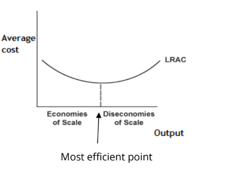

# Mark Schemes — Business Costs, Revenues & Profit
**Business Economics** · Edexcel IGCSE Economics (4EC1)

## Q1 — easy — 1 marks · exam-questions

### 3((b)) — 1 marks
**Correct answer: A** — Quantity sold×price

**Final answer:** **The correct answer is A**

Total revenue is the money a firm receives from its sales, so it is found by multiplying the number of units sold by the price charged for each one

**B** is incorrect as profit is what remains after costs have been taken away from revenue, so subtracting price from profit cannot produce revenue

**C** is incorrect as dividing profit by price does not measure the money received from sales

**D** is incorrect as quantity must be multiplied by price, not divided by it, to find the total amount customers have paid

## Q2 — easy — 8 marks · exam-questions

### 4((a)) — 2 marks
Fuel cost = 65 × \$0.25 = \$16.25 **[1 mark]**

\$90 + \$20 + \$16.25

**= \$126.25** **[1 mark]**

> **[mark-scheme]**
> Award 1 mark for showing the correct calculation, \$90 + \$20 + (65 × \$0.25), or \$90 + \$20 + \$16.25
> 
> Award 1 mark for the correct total costs of \$126.25
> 
> Award 2 marks if total costs are correctly calculated as \$126.25, even if no calculations are shown
> 
> Award 1 mark if total costs are given as 126.25 without the \$ sign
> 
> Do not award marks for the formula

> **[exam-tip]**
> - Sort the costs before you add them. Vehicle hire and insurance are given per day, so they are used once, but fuel is given per kilometre and must be multiplied by the 65 km travelled
> - Always write the \$ sign in the final answer. Examiner reports repeatedly record candidates who calculated correctly but lost a mark for leaving the currency symbol off
> - Show your working, as the question advises, because correct working still earns a mark if the final figure is wrong

### 4((b)) — 6 marks
Internal economies of scale are the falling average costs a firm enjoys as its own scale of operation increases.** [K]** MAS Supermarkets is the largest supermarket chain in Cyprus and owns many shops across the country,** [Ap]** so it buys groceries in far larger quantities than a single shop could, and suppliers offer a lower price per unit on large orders, giving it purchasing economies that reduce the average cost of every item it sells.** [An]** Its size also brings marketing economies, because one advertising campaign promotes every shop in the chain rather than just one,** [Ap]** so the cost of advertising is spread across a much greater sales volume and the average cost per sale falls again. These lower average costs allow MAS Supermarkets to charge the low prices it says it focuses on while still making a profit,** [An]** which attracts more customers, raises sales further and lets the firm open more shops, so it benefits from economies of scale on an even larger scale in future.** [An]**

**[6 marks]**

> **[mark-scheme]**
> This is a ‘levelled response’ question
> 
> - **[Ap]** = application to the data given  (3 marks)
> - **[An]** = analysis / chain of reasoning (3 marks)
> 
> Although there are no separate **[K] marks**, both application and analysis must be built on **clear and accurate economic knowledge and understanding**
> 
> Therefore, each KAA paragraph should follow:
> 
> - Valid knowledge point → Application → Analysis
> - Each valid point made in the answer does not equal a mark, the response is judged holistically against the level descriptors
> 
> **Mark allocation**
> 
> Answers are placed into one of three levels.  **A level 3 answer (5-6 marks)**, will specifically:
> 
> - Demonstrate clear knowledge and understanding by developing relevant points and include appropriate application of economic terms, concepts, theories and calculations
> - Information presented will demonstrate excellent selectivity and organisation. Interpretation of economic information will be excellent, with a thorough analysis of issues
> 
> **Alternative content**
> 
> The answer above is just one example of how to respond to this question. Additional information which could be used in the answer includes:
> 
> - Managerial economies, with specialist managers overseeing buying, logistics or staffing across the whole chain
> - Financial economies, since a firm of this size can borrow more cheaply than a small independent shop
> - Technical economies, such as a single distribution centre serving every shop in Cyprus
> - Any other relevant and valid analysis is acceptable

> **[exam-tip]**
> - Name the specific economies of scale you are using, purchasing and marketing here, rather than writing that costs fall because the firm is large
> - The question asks about benefits to MAS Supermarkets, so finish each chain at the firm, lower prices for customers only count if you link them back to the firm's own success
> - No counter-argument and no conclusion is required, analyse is always one-sided

## Q3 — easy — 1 marks · exam-questions

### 3((b)) — 1 marks
**Correct answer: C** — multiplied by the price

**Final answer:** **The correct answer is C**

Total revenue is the money a firm receives from its sales, so the quantity of goods sold is multiplied by the price charged for each one

**A** is incorrect as adding quantity to price combines two different units and produces a figure with no economic meaning

**B** is incorrect as subtracting quantity from price does not measure the money received from sales

**D** is incorrect as dividing quantity by price would give a smaller figure the higher the price, whereas revenue rises with price when the quantity sold is unchanged

## Q4 — easy — 8 marks · exam-questions

### 4((a)) — 2 marks
Electricity is the only variable cost here, because it is charged per hour of production and so changes with output. The purchase price of the machine and the insurance stay the same however much is produced, so both are fixed

\$0.45 × 19 **[1 mark]**

**= \$8.55** **[1 mark]**

> **[mark-scheme]**
> Award 1 mark for showing correct calculation
> 
> Award 1 mark for the correct total variable costs
> 
> Award 2 marks if total variable costs are correctly calculated as \$8.55, even if no calculations are shown
> 
> Award 1 mark if total variable costs are calculated as 8.55 without the currency symbol, even if no calculations are shown
> 
> Do not award marks for the formula

> **[exam-tip]**
> - Decide which costs are variable before you calculate anything. A variable cost changes with output, so the hourly electricity charge counts but the one-off machine price and the insurance do not
> - Include the currency symbol. Examiner reports record candidates losing the second mark on cost calculations by giving a bare number

### 4((b)) — 6 marks
External economies of scale occur when average costs fall across a whole industry as that industry grows, rather than because one individual firm has expanded.** [K]** The Indian rail project is upgrading infrastructure and adding a new line between Hyderabad and Karnataka, with more freight trains able to carry raw materials such as cement, iron ore and steel.** [Ap]** Better rail links mean construction firms across India can move heavy materials more cheaply and more reliably than by road, so their transport costs per unit of output fall.** [An]** Because the improvement is available to every firm in the industry rather than to one company alone, all construction firms benefit, which is exactly what makes these economies external.** [An]** Cheaper and more accessible materials also allow firms to build more without their costs rising in proportion, so average costs fall as output rises.** [An]**

**[6 marks]**

> **[mark-scheme]**
> This is a 'levelled response' question
> 
> - **[Ap]** = application to the data given  (3 marks)
> - **[An]** = analysis / chain of reasoning (3 marks)
> 
> Although there are no separate **[K] marks**, both application and analysis must be built on **clear and accurate economic knowledge and understanding**
> 
> Therefore, each KAA paragraph should follow:
> 
> - Valid knowledge point → Application → Analysis
> - Each valid point made in the answer does not equal a mark, the response is judged holistically against the level descriptors
> 
> **Mark allocation**
> 
> Answers are placed into one of three levels.  **A level 3 answer (5-6 marks)**, will specifically:
> 
> - Demonstrate clear knowledge and understanding by developing relevant points and include appropriate application of economic terms, concepts, theories and calculations
> - Information presented will demonstrate excellent selectivity and organisation. Interpretation of economic information will be excellent, with a thorough analysis of issues
> 
> **Alternative content**
> 
> The answer above is just one example of how to respond to this question. Additional information which could be used in the answer includes:
> 
> - Construction firms across India, not only those along the new route between Hyderabad and Karnataka, may benefit from infrastructure developments leading to external economies of scale
> - External economies of scale occur when long run average costs decrease as the whole industry grows
> - They can arise from improved access to suppliers and to skilled labour for many firms in the same industry
> - Modernising the rail network and adding the new line will allow raw materials such as iron ore and steel to be transported more easily across the country
> - Construction firms in India may therefore benefit from cheaper transport costs
> - Their overall costs are likely to fall at the same time as production can increase, because raw materials and other goods are more accessible
> - Any other relevant and valid analysis is acceptable

> **[exam-tip]**
> - No counter-argument and no conclusion is required - analyse is always one-sided
> - The word that matters is 'external'. Say clearly that the benefit reaches every firm in the industry, not just one, or the answer reads as internal economies of scale
> - Name the materials and the route from the extract. The application marks depend on it

## Q5 — easy — 4 marks · exam-questions

### 2((c)) — 2 marks
Raw materials and labour are the variable costs, because the firm uses more materials as it makes more souvenirs and the labour is paid according to output. Rent and advertising stay the same whatever is produced, so they are fixed

€3 000 + €18 000 **[1 mark]**

**= €21 000** **[1 mark]**

> **[mark-scheme]**
> Award 1 mark for showing the correct calculation
> 
> Award 1 mark for the correct total variable costs
> 
> Award 2 marks if total variable costs are correctly calculated as €21 000, even if no calculations are shown
> 
> Award 1 mark if total variable costs are calculated as 21 000 without the currency symbol, even if no calculations are shown
> 
> Do not award marks for a formula

> **[exam-tip]**
> - Decide which costs are variable before you add anything up. The clue for labour is in the table itself, which states that it is paid according to output
> - Include the currency symbol. Examiner reports record candidates losing the second mark on cost calculations by giving a bare number

### 2((d)) — 2 marks
Total revenue is the amount of money a firm gains** [1]** from the sale of all of its products** [1]**

**[2 marks]**

> **[mark-scheme]**
> Award up to 2 marks for a correct definition: 1 mark for reference to the money gained and 1 mark for reference to the sale of all products
> 
> No marks are available for an example in place of a definition
> 
> Accept any other appropriate response

> **[exam-tip]**
> - 'What is meant by' questions carry two marks and need two parts to the definition. Examiner reports state plainly that no marks are awarded for examples
> - The word 'total' is doing work here. Revenue from one sale is not total revenue, so make clear you mean everything sold

## Q6 — easy — 11 marks · exam-questions

### 2((d)) — 2 marks
\$750 × 1,820 = \$1 365 000 total variable costs

\$57 000 + \$1 365 000 **[1 mark]**

**= \$1 422 000** **[1 mark]**

> **[mark-scheme]**
> Award 1 mark for showing correct calculation
> 
> Award 1 mark for the correct total costs
> 
> Award 2 marks if total costs per month are correctly calculated as \$1 422 000, even if no calculations are shown
> 
> Award 1 mark for 1 422 000 without the currency symbol, even if no calculations are shown
> 
> Do not award marks for a formula

> **[exam-tip]**
> - Total cost is total fixed cost plus total variable cost. The variable cost given is per unit, so multiply it by the 1,820 units before adding the fixed costs
> - Work out the variable cost as a separate step and write it down. It makes the arithmetic easier to check and protects a mark if you slip later
> - Include the currency symbol. Examiner reports record candidates losing the second mark on cost calculations by giving a bare number

### 2((g)) — 9 marks
Economies of scale occur when a firm's average costs fall as it expands.** [K]** Merging CK Hutch with Indosat would create a single, much larger telecommunications business serving Indosat's more than 60 million customers in Indonesia, Southeast Asia's most populated country.** [Ap]** A firm that size can buy network equipment in bulk at a lower price per unit, and it needs only one research and development department rather than two, so the cost of developing new services is spread across far more customers.** [An]** Advertising can also be combined into a single campaign instead of two separate ones, cutting marketing cost per subscriber and lowering average costs across the merged business.** [An]**

However, economies of scale are not guaranteed.** [Ev]** Expansion can push a firm beyond its minimum efficient scale and into diseconomies of scale, where average costs begin rising again.** [An]** Combining two firms based in Hong Kong and Jakarta creates communication problems and more bureaucracy, and the gap between senior management and staff widens so that control over the business weakens.** [An]** With Indosat's customer base still growing, the merged firm may keep expanding past the point where it can be managed efficiently, so the cost savings could be eroded.** [An]**

**[9 marks]**

> **[mark-scheme]**
> This is a 'levelled response' question
> 
> - **[Ap]** = application to the data given  (3 marks)
> - **[An]** = analysis / chain of reasoning (3 marks)
> - **[Ev]** = evaluation (3 marks)
> 
> Although there are no separate **[K] marks**, both application and analysis must be built on **clear and accurate economic knowledge and understanding**
> 
> Therefore, each KAA paragraph should follow:
> 
> - Valid knowledge point → Application → Analysis
> - Each valid point made in the answer does not equal a mark, the response is judged holistically against the level descriptors
> 
> **Mark allocation**
> 
> A 9 mark (Level 3) answer will include examples which demonstrate:
> 
> - **Application [Ap]**: clear knowledge and understanding by developing relevant points. Appropriate application of economic terms, concepts, theories and calculations
> - **Analysis [An]**: information presented will demonstrate excellent selectivity and organisation. Interpretation of economic information will be excellent, with a thorough analysis of issues
> - **Evaluation [Ev]**: offers more than one viewpoint. The argument is well balanced and coherent, leading to an evaluation that demonstrates full understanding and awareness
> 
> **Alternative content**
> 
> The answer above is just one example of how to respond to this question. Additional information which could be used in the answer includes:
> 
> - Economies of scale occur when average costs decrease as a firm expands
> - A merger between CK Hutch and Indosat would create a new, larger telecommunications firm
> - Larger firms can usually operate at a lower unit cost through bulk purchasing, combined marketing and shared technology
> - The new firm is likely to attract more customers and need more equipment, which could be bought at a lower price per unit
> - Advertising for both firms could be combined, reducing advertising costs
> - Both firms would have research and development departments, and a merger would allow these to combine and cut costs
> - Economies of scale are therefore likely to be enjoyed if the firms merge
> - However, economies of scale do not always occur or give the expected results
> - Expansion could push the merged firm beyond the minimum efficient scale, leading to diseconomies of scale, where average costs increase as the firm expands
> - Communication problems may occur because of the increased number of employees
> - There may be more bureaucracy due to the increased size of the firm
> - A larger gap between management and employees could lead to reduced control
> - As Indosat's customer base of more than 60 million is still growing, this could result in further diseconomies of scale
> - Any other relevant and valid analysis is acceptable

> **[exam-tip]**
> - 'Assess' requires a balanced, two-sided argument which is applied. Examiner reports state that no judgement or conclusion is required, but both sides should be developed, thorough and in context
> - Diseconomies of scale is the natural counter-argument here, so name it and explain the mechanism rather than simply saying the merger might not work
> - Use the figures and the geography. The 60 million customers and the distance between Hong Kong and Jakarta are what make both sides of this argument concrete

## Q7 — easy — 2 marks · exam-questions

### 1((b)) — 1 marks
**Correct answer: A** — \$5300

**Final answer:** **The correct answer is A**

Profit is total revenue minus total costs. Total revenue is 300 × \$20 = \$6,000, so profit is \$6,000 − \$700 = \$5,300

**B** is incorrect as \$6,000 is total revenue, found by multiplying the quantity sold by the price, with the firm's costs not yet deducted

**C** is incorrect as \$13,700 comes from multiplying the total costs by the price and then subtracting the quantity, which has no economic meaning

**D** is incorrect as \$14,000 is the total costs multiplied by the price, rather than revenue less costs

### 1((d)) — 1 marks
**A local supply of skilled labour****[1 mark]**

> **[mark-scheme]**
> Award 1 mark for a correct type
> 
> Accept any other appropriate response, e.g. improved infrastructure, better access to suppliers, or a concentration of similar businesses in the area
> 
> The benefit must come from the growth of the industry or the area rather than from the growth of the individual firm, which would be an internal economy of scale

## Q8 — easy — 2 marks · exam-questions

### 2((d)) — 2 marks
(\$6 200 + \$3 550) ÷ 3,000 **[1 mark]**

**= \$3.25** **[1 mark]**

> **[mark-scheme]**
> Award 1 mark for showing correct calculation
> 
> Award 1 mark for the correct average cost per unit (AC)
> 
> Award 2 marks if average cost per unit is correctly calculated as \$3.25, even if no calculations are shown
> 
> Award 1 mark for 3.25 without the currency symbol, even if no calculations are shown
> 
> Do not award marks for a formula

> **[exam-tip]**
> - Average cost is total cost divided by quantity, so add the fixed and variable costs together first. Dividing only one of them by 3,000 is the most common error here
> - Include the currency symbol. Examiner reports record candidates losing the second mark on cost calculations by giving a bare number

## Q9 — easy — 2 marks · exam-questions

### 1((c)) — 2 marks
Economies of scale are falling average costs** [1]** that result from a firm expanding its output** [1]**

**[2 marks]**

> **[mark-scheme]**
> Award 1 mark for reference to falling average costs and 1 mark for reference to expansion of the firm
> 
> No marks are available for an example in place of a definition
> 
> Accept any other appropriate response

> **[exam-tip]**
> - The word 'average' is essential. Total costs usually rise as a firm expands, so writing only that costs fall describes something different and risks the mark
> - 'What is meant by' questions carry two marks and need two parts to the definition, so link the falling average costs to the firm growing

## Q10 — easy — 2 marks · exam-questions

### 2((d)) — 2 marks
Rent and advertising are the fixed costs, because the firm pays them whatever quantity of clothing it makes. Raw materials and labour both change with output, since the labour is paid in direct proportion to output, so they are variable

20 250 + 5 125 **[1 mark]**

**= 25 375 Tk** **[1 mark]**

> **[mark-scheme]**
> Award 1 mark for showing correct calculation
> 
> Award 1 mark for the correct total fixed costs
> 
> Award 2 marks if total fixed costs are correctly calculated as 25 375 Tk, even if no calculations are shown
> 
> Award 1 mark if total fixed costs are calculated as 25 375 without the currency, even if no calculations are shown
> 
> Do not award marks for a formula

> **[exam-tip]**
> - Read the question carefully. This table also appears in questions asking for total VARIABLE costs, so check which of the two you are being asked for before you start adding
> - A fixed cost does not change with output. Advertising is fixed even though a firm could choose to spend more, because the spending does not rise automatically as more is produced
> - Include the currency. Examiner reports record candidates losing the second mark on cost calculations by giving a bare number

## Q11 — easy — 2 marks · exam-questions

### 4((a)) — 2 marks
\$22 950 − \$20 250 = \$2 700

\$2 700 ÷ \$20 250 × 100 **[1 mark]**

**= 13.33%** **[1 mark]**

> **[mark-scheme]**
> Award 1 mark for showing correct calculation, either as the change in profit divided by the 2020 figure and multiplied by 100, or by working the same calculation in one step
> 
> Award 1 mark for the correct percentage change
> 
> Award 2 marks if the percentage change is correctly calculated as 13.33%, even if no calculations are shown
> 
> Award 1 mark if the percentage change is calculated as 13.33 without the percentage sign, even if no calculations are shown
> 
> Do not award marks for a formula

> **[exam-tip]**
> - Divide by the ORIGINAL figure, which is the 2020 profit. Dividing by the 2022 figure instead is the most common error on percentage change questions
> - The 2021 figure is not needed. The question asks for the change between 2020 and 2022, so ignore the middle row
> - Give the answer to two decimal places as instructed, and include the percentage sign

## Q12 — easy — 1 marks · exam-questions

### 1((b)) — 1 marks
**Correct answer: D** — \$3200000

**Final answer:** **The correct answer is D**

Total revenue is price multiplied by quantity sold, so \$160 × 20,000 = \$3 200 000. The average cost is not used at all

**A** is incorrect as \$19 200 is the price multiplied by the average cost, which multiplies two per-unit figures together and gives a meaningless result

**B** is incorrect as \$20 160 adds the quantity to the price rather than multiplying them

**C** is incorrect as \$2 400 000 is the quantity multiplied by the average cost, which gives the firm's total cost rather than its total revenue

## Q13 — easy — 3 marks · exam-questions

### 2((b)) — 1 marks
**Correct answer: B** — External economies of scale

**Final answer:** **The correct answer is B**

External economies of scale are falling average costs that come from the growth of the whole industry rather than of one firm, so every firm in that industry benefits

**A** is incorrect as internal economies of scale are where an individual firm benefits from falling average costs because it has expanded itself

**C** is incorrect as diseconomies of scale result in higher average costs, not lower ones

**D** is incorrect as technical economies of scale are a type of internal economies of scale, so they benefit one firm rather than the whole industry

### 2((d)) — 2 marks
\$525 × 1350 = \$708 750 total variable costs

\$75 000 + \$708 750 **[1 mark]**

**= \$783 750** **[1 mark]**

> **[mark-scheme]**
> Award 1 mark for showing correct calculation
> 
> Award 1 mark for the correct total costs
> 
> Award 2 marks if total costs per month are correctly calculated as \$783 750, even if no calculations are shown
> 
> Award 1 mark for 783 750 without the currency symbol, with or without calculations shown
> 
> Do not award marks for a formula

> **[exam-tip]**
> - Total cost is total fixed cost plus total variable cost. The variable cost given is per unit, so multiply it by the 1350 units before adding the fixed costs
> - Work out the variable cost as a separate step and write it down. It makes the arithmetic easier to check and protects a mark if you slip later
> - Include the currency symbol. Examiner reports record candidates losing the second mark on cost calculations by giving a bare number

## Q14 — easy — 7 marks · exam-questions

### 1((b)) — 1 marks
**Correct answer: D** — Total revenue

**Final answer:** **The correct answer is D**

Total revenue is price multiplied by quantity sold, so 40 units × \$10 = \$400

**A** is incorrect as the price is \$10 per unit, which is what each customer pays for one good rather than the total taken

**B** is incorrect as total costs cannot be worked out here, because only the variable cost of \$4 per unit is given and no fixed costs are shown

**C** is incorrect as profit is total revenue minus total costs, so it would be less than \$400 rather than equal to it

### 1((i)) — 6 marks
Profit is total revenue minus total costs, and economics assumes firms aim to maximise it.** [K]** Unilever plans to cut its non-recyclable plastic packaging from 700,000 tonnes to 600,000 tonnes by 2025 and to replace what remains with recyclable plastic, which the data states is more expensive.** [Ap]** Paying a higher price for each of those 600,000 tonnes raises Unilever's costs directly, so if the prices it charges consumers stay the same the gap between revenue and costs narrows and profit falls.** [An]** Reducing overall usage by 100,000 tonnes also takes time and money, because the firm has to redesign packaging and find workable alternatives.** [An]** Unilever may additionally need to source new suppliers able to provide recyclable material on that scale, adding further cost, so the plan means the firm will not be maximising profit.** [An]**

**[6 marks]**

> **[mark-scheme]**
> This is a 'levelled response' question
> 
> - **[Ap]** = application to the data given  (3 marks)
> - **[An]** = analysis / chain of reasoning (3 marks)
> 
> Although there are no separate **[K] marks**, both application and analysis must be built on **clear and accurate economic knowledge and understanding**
> 
> Therefore, each KAA paragraph should follow:
> 
> - Valid knowledge point → Application → Analysis
> - Each valid point made in the answer does not equal a mark, the response is judged holistically against the level descriptors
> 
> **Mark allocation**
> 
> Answers are placed into one of three levels.  **A level 3 answer (5-6 marks)**, will specifically:
> 
> - Demonstrate clear knowledge and understanding by developing relevant points and include appropriate application of economic terms, concepts, theories and calculations
> - Information presented will demonstrate excellent selectivity and organisation. Interpretation of economic information will be excellent, with a thorough analysis of issues
> 
> **Alternative content**
> 
> The answer above is just one example of how to respond to this question. Additional information which could be used in the answer includes:
> 
> - It is an economic assumption that businesses aim to maximise profits
> - It may take time to find suitable ways of reducing the overall amount of plastic used by 100,000 tonnes, which is likely to result in higher costs
> - By replacing non-recyclable packaging, Unilever is likely to incur higher costs as it uses the more expensive recyclable plastic
> - Unilever may need to source alternative suppliers to replace the remaining 600,000 tonnes of plastic packaging
> - This means that Unilever will not maximise profits
> - Any other relevant and valid analysis is acceptable

> **[exam-tip]**
> - No counter-argument and no conclusion is required - analyse is always one-sided, so do not switch to arguing that profits might rise
> - Use both figures. The 100,000 tonne reduction and the 600,000 tonnes of more expensive replacement are separate cost pressures and each supports its own chain
> - Start from the profit equation. Saying costs rise is knowledge; showing what that does to the gap between revenue and costs is analysis

## Q15 — easy — 2 marks · exam-questions

### 2((d)) — 2 marks
Raw materials and labour are the variable costs, because more material is used as more clothing is made and the table states that the labour payment depends on output. Rent and insurance are paid whatever the firm produces, so both are fixed

\$12 000 + \$115 000 **[1 mark]**

**= \$127 000** **[1 mark]**

> **[mark-scheme]**
> Award 1 mark for showing correct calculation
> 
> Award 1 mark for the correct total variable costs
> 
> Award 2 marks if total variable costs are correctly calculated as \$127 000, even if no calculations are shown
> 
> Award 1 mark if the answer given is 127 000 without the currency symbol, with or without calculations shown
> 
> Do not award marks for a formula

> **[exam-tip]**
> - Sort the costs before you add. The table tells you which is which: the labour line says payment depends on output, which makes it variable
> - Insurance is fixed even though it is not rent. A cost is fixed when it does not change as output changes, whatever the cost is for
> - Include the currency symbol. Examiner reports record candidates losing the second mark on cost calculations by giving a bare number

## Q16 — easy — 3 marks · exam-questions

### 2((b)) — 1 marks
**Correct answer: C** — <u>               Total cost              </u>
Quantity produced

**Final answer:** **The correct answer is C**

Average cost is total cost divided by the quantity produced, which gives the cost of making one unit

**A** is incorrect as dividing only the total fixed cost by quantity leaves out variable costs, so it gives average fixed cost rather than average cost

**B** is incorrect as revenue is money coming in rather than a cost, so this formula measures average revenue per unit

**D** is incorrect as dividing only the total variable cost by quantity leaves out fixed costs, so it gives average variable cost rather than average cost

### 2((d)) — 2 marks
\$17 + \$35 = \$52 total cost per pair

\$89 − \$52 **[1 mark]**

**= \$37 profit per pair** **[1 mark]**

> **[mark-scheme]**
> Award 1 mark for showing correct calculation
> 
> Award 1 mark for the correct profit
> 
> Award 2 marks if profit is correctly calculated as \$37, even if no calculations are shown
> 
> Award 1 mark if the answer given is 37 without the currency symbol, with or without calculations shown
> 
> Do not award marks for a formula

> **[exam-tip]**
> - Add both costs together before subtracting. Taking only the raw materials or only the labour off the selling price is the most common error here
> - The question says profit or loss, so say which it is. The selling price exceeds the costs, so this is a profit
> - Include the currency symbol. Examiner reports record candidates losing the second mark on these calculations by giving a bare number

## Q17 — easy — 8 marks · exam-questions

### 1((f)) — 2 marks
\$250 × 750 = \$187 500 total variable costs

\$50 000 + \$187 500 **[1 mark]**

**= \$237 500** **[1 mark]**

> **[mark-scheme]**
> Award 1 mark for showing correct calculation
> 
> Award 1 mark for the correct total costs
> 
> Award 2 marks if total costs per month are correctly calculated as \$237 500, even if no calculations are shown
> 
> Award 1 mark if the answer given is 237 500 without the currency symbol, with or without calculations shown
> 
> Do not award marks for a formula

> **[exam-tip]**
> - Total cost is total fixed cost plus total variable cost. The variable cost given is per unit, so multiply it by the 750 units before adding the fixed costs
> - Work out the variable cost as a separate step and write it down. It makes the arithmetic easier to check and protects a mark if you slip later
> - Include the currency symbol. Examiner reports record candidates losing the second mark on cost calculations by giving a bare number

### 1((i)) — 6 marks
Technical economies of scale occur when a larger firm can make better use of machinery than a smaller one, so its average costs fall as it expands.** [K]** Before it grew, Cutting Edge had to turn work away because it owned no saw powerful enough to cut through larger trees, and buying one could not be justified for the small number of such jobs it received.** [Ap]** Once the firm expanded it attracted enough of that work for a bigger saw to be used regularly rather than standing idle.** [An]** The cost of the saw could then be spread across many more gardening jobs, so the amount it added to the cost of each job fell sharply.** [An]** Cutting Edge therefore operated at a lower average cost than before, and could also accept the larger jobs it had previously been forced to refuse.** [An]**

**[6 marks]**

> **[mark-scheme]**
> This is a 'levelled response' question
> 
> - **[Ap]** = application to the data given  (3 marks)
> - **[An]** = analysis / chain of reasoning (3 marks)
> 
> Although there are no separate **[K] marks**, both application and analysis must be built on **clear and accurate economic knowledge and understanding**
> 
> Therefore, each KAA paragraph should follow:
> 
> - Valid knowledge point → Application → Analysis
> - Each valid point made in the answer does not equal a mark, the response is judged holistically against the level descriptors
> 
> **Mark allocation**
> 
> Answers are placed into one of three levels.  **A level 3 answer (5-6 marks)**, will specifically:
> 
> - Demonstrate clear knowledge and understanding by developing relevant points and include appropriate application of economic terms, concepts, theories and calculations
> - Information presented will demonstrate excellent selectivity and organisation. Interpretation of economic information will be excellent, with a thorough analysis of issues
> 
> **Alternative content**
> 
> The answer above is just one example of how to respond to this question. Additional information which could be used in the answer includes:
> 
> - Economies of scale result in falling average costs due to expansion
> - Technical economies of scale occur when larger firms can make better use of machinery than smaller ones
> - As Cutting Edge attracted more customers it received more work that required a powerful saw
> - It was therefore cost-effective to purchase the equipment, because the resource could be used far more than when the firm was only asked to cut through a small number of trees
> - The price of the powerful saw can be spread between more gardening jobs
> - Any other relevant and valid analysis is acceptable

> **[exam-tip]**
> - No counter-argument and no conclusion is required - analyse is always one-sided
> - The key idea is spreading a fixed cost. The saw costs the same whether it is used once or a hundred times, so more jobs means a lower cost per job
> - Use the detail that the firm turned work away before expanding. It is the strongest piece of evidence in the extract and explains why the saw was not worth buying earlier

## Q18 — easy — 2 marks · exam-questions

### 4((a)) — 2 marks
\$87 100 − \$80 750 = \$6 350

\$6 350 ÷ \$80 750 × 100 **[1 mark]**

**= 7.86%** **[1 mark]**

> **[mark-scheme]**
> Award 1 mark for showing correct calculation, either as the change in profit divided by the 2017 figure and multiplied by 100, or by working the same calculation in one step
> 
> Award 1 mark for the correct percentage change
> 
> Award 2 marks if the percentage change is accurately calculated as 7.86%, even if no calculations are shown
> 
> Award 1 mark if the answer given is 7.86 without the percentage sign, with or without calculations shown
> 
> Do not award marks for a formula

> **[exam-tip]**
> - Divide by the ORIGINAL figure, which is the 2017 profit. Dividing by the 2019 figure instead is the most common error on percentage change questions
> - The 2018 figure is not needed. The question asks for the change between 2017 and 2019, so ignore the middle row
> - Give the answer to two decimal places as instructed, and include the percentage sign

## Q19 — easy — 1 marks · exam-questions

### 1((b)) — 1 marks
**Correct answer: D** — \$750 000

**Final answer:** **The correct answer is D**

Total cost is fixed cost plus variable cost, so fixed cost is total cost minus variable cost. Variable costs are \$100 × 5,000 = \$500 000, so fixed costs are \$1 250 000 − \$500 000 = \$750 000

**A** is incorrect as \$1 750 000 adds the variable costs to the total costs instead of subtracting them

**B** is incorrect as \$1 250 100 adds the \$100 per unit figure once to the total costs, rather than multiplying it by the 5,000 units produced

**C** is incorrect as \$1 249 900 subtracts the \$100 per unit figure once from the total costs, again ignoring the quantity produced

## Q20 — easy — 1 marks · exam-questions

### 2((c)) — 1 marks
**Profit = total revenue − total costs****[1 mark]**

> **[mark-scheme]**
> **One mark** for the correct formula, given either in words or as an equation
> 
> Both elements must be present for the mark

> **[exam-tip]**
> - Include the word 'total' on both sides. The examiner report for this question records candidates losing the mark by writing 'revenue minus costs', because the full formula uses total revenue and total costs
> - There is only one mark available for 'state' questions and examiners do not expect you to write a lot, so give the formula and stop

## Q21 — easy — 1 marks · exam-questions

### 3((a)) — 1 marks
**Correct answer: B** — Skilled labour

**Final answer:** **The correct answer is B**

As an industry grows in an area, a pool of workers already trained in its skills builds up. Any firm in that industry can hire from it and spend less on training, so average costs fall because the industry has grown rather than because one firm has

**A** is incorrect as bulk buying is an internal economy of scale, since it comes from one firm placing larger orders and negotiating a discount for itself

**C** is incorrect as bureaucracy is a diseconomy of scale, because extra layers of administration push average costs up rather than down

**D** is incorrect as managerial economies are internal, arising when a single firm grows large enough to employ specialist managers

## Q22 — easy — 2 marks · exam-questions

### 4((a)) — 2 marks
€3 600 ÷ €40 **[1 mark]**

**= 90 cakes** **[1 mark]**

> **[mark-scheme]**
> Award 1 mark for showing correct calculation
> 
> Award 1 mark for the correct quantity
> 
> Award 2 marks if the quantity is accurately calculated as 90 cakes or units, even if no calculations are shown
> 
> Award 1 mark if the quantity is calculated as 90 with or without workings
> 
> Do not award marks for the formula

> **[exam-tip]**
> - This question runs the revenue formula backwards. Total revenue is price multiplied by quantity, so to find quantity you divide the revenue by the price
> - The answer is a number of cakes, not an amount of money, so do not put a euro sign in front of it. Write the unit instead

## Q23 — easy — 1 marks · exam-questions

### 1((b)) — 1 marks
**Correct answer: B** — \$4 500 profit

**Final answer:** **The correct answer is B**

Total revenue is price multiplied by quantity, so 100 × \$50 = \$5 000. Profit is total revenue minus total costs, so \$5 000 − \$500 = \$4 500 profit

**A** is incorrect as \$45 000 is ten times too large. Total revenue here is \$5 000, not \$50 000

**C** is incorrect as the firm cannot be making a loss, since total revenue of \$5 000 is far greater than total costs of \$500

**D** is incorrect as it subtracts the total costs from the \$50 price of a single item rather than from total revenue, which wrongly turns a healthy profit into a loss

## Q24 — easy — 1 marks · exam-questions

### 3((b)) — 1 marks
**Correct answer: D** — <u>Total costs</u>
Output

**Final answer:** **The correct answer is D**

Average cost is total costs divided by output, which gives the cost of producing one unit

**A** is incorrect as dividing total revenue by total costs compares money coming in with money going out. It produces a ratio rather than a cost per unit

**B** is incorrect as dividing total revenue by price gives the quantity of units sold, not a cost at all

**C** is incorrect as it is upside down and uses only fixed costs. Dividing output by costs gives units per pound spent rather than cost per unit

## Q25 — easy — 2 marks · exam-questions

### 2((d)) — 2 marks
Raw materials and labour are the variable costs, because more material is used as more souvenirs are made and the table states the labour is paid according to output. Rent and advertising are paid whatever the firm produces, so both are fixed

2 000 + 15 000 **[1 mark]**

**= 17 000 QR** **[1 mark]**

> **[mark-scheme]**
> Award 1 mark for identifying the variable costs
> 
> Award 1 mark for calculating the correct total variable costs
> 
> Award 2 marks if total variable costs are correctly calculated as 17 000 QR, even if no calculations are shown
> 
> Award 1 mark if total variable costs are calculated as 17 000 without the currency, even if no calculations are shown
> 
> Do not award marks for a formula

> **[exam-tip]**
> - The first mark is for identifying the variable costs, so show which two lines of the table you are using before you add them
> - Advertising is fixed here. A firm chooses how much to spend on it, but the spending does not rise automatically as more souvenirs are produced
> - Include the currency. Examiner reports record candidates losing the second mark on cost calculations by giving a bare number

## Q26 — easy — 2 marks · exam-questions

### 1((c)) — 2 marks
Total revenue is the amount of money a firm receives** [1]** from selling all of its output** [1]**

**[2 marks]**

> **[mark-scheme]**
> Award 1 mark for reference to the money a firm receives and 1 mark for reference to selling its output
> 
> The formula route is equally creditable: 1 mark for reference to the price of each unit and 1 mark for reference to the number of units sold
> 
> No marks are available for an example in place of a definition
> 
> Accept any other appropriate response

> **[exam-tip]**
> - Either route works: describe it as the money received from selling output, or give it as price multiplied by quantity sold. Both carry two parts, which is what the two marks are for
> - The word 'total' matters. Revenue from a single sale is not total revenue, so make clear you mean everything the firm sold

## Q27 — easy — 3 marks · exam-questions

### 2((a)) — 1 marks
**Correct answer: D** — Most efficient

**Final answer:** **The correct answer is D**

X marks the lowest point of the average cost curve, where the cost of producing each unit is as low as it can be. That output is the most efficient level for the firm to produce at

**A** is incorrect as internal economies of scale describe the downward-sloping section of the curve to the left of X, not the point itself

**B** is incorrect as external economies of scale would shift the whole curve downwards, so they are not a single point on it

**C** is incorrect as the vertical axis measures average cost per unit rather than total costs, which would keep rising as output increases

### 2((c)) — 2 marks
Rent and advertising are the fixed costs, because the firm pays them whatever quantity of rugs and carpets it makes. Raw materials and labour both change with output, since the labour is paid in direct proportion to output, so they are variable

40 250 + 10 125 **[1 mark]**

**= 50 375 Rs** **[1 mark]**

> **[mark-scheme]**
> Award 1 mark for identifying the fixed costs
> 
> Award 1 mark for calculating the correct total fixed costs
> 
> Award 2 marks if total fixed costs are correctly calculated as 50 375 Rs, even if no calculations are shown
> 
> Award 1 mark if total fixed costs are calculated as 50 375 without the currency, even if no calculations are shown
> 
> Do not award marks for a formula

> **[exam-tip]**
> - Read the question carefully. Tables like this one also appear in questions asking for total VARIABLE costs, so check which you are being asked for before you start adding
> - The first mark is for identifying the fixed costs, so show which two lines you are using
> - Include the currency. Examiner reports record candidates losing the second mark on cost calculations by giving a bare number

## Q28 — easy — 3 marks · exam-questions

### 1((b)) — 1 marks
**Correct answer: A** — \$190 000

**Final answer:** **The correct answer is A**

Total cost is total fixed cost plus total variable cost. Variable costs are \$150 × 1,000 = \$150 000, so total costs are \$40 000 + \$150 000 = \$190 000

**B** is incorrect as \$150 000 is the variable cost alone and leaves out the \$40 000 of fixed costs

**C** is incorrect as \$41 150 adds the three figures together without multiplying the per-unit cost by the 1,000 units produced

**D** is incorrect as \$40 150 adds the \$150 per-unit cost to the fixed costs only once, again ignoring the quantity produced

### 1((f)) — 2 marks
\$7 340 + \$4 760 = \$12 100 total costs

\$12 100 ÷ 2,000 **[1 mark]**

**= \$6.05** **[1 mark]**

> **[mark-scheme]**
> Award 1 mark for showing correct calculation
> 
> Award 1 mark for the correct average cost per unit (AC)
> 
> Award 2 marks if average cost per unit is accurately calculated as \$6.05, even if no calculations are shown
> 
> Award 1 mark if the calculation is shown and the answer given as 6.05 without the dollar sign
> 
> Do not award marks for the formula

> **[exam-tip]**
> - Average cost is total cost divided by quantity, so add the fixed and variable costs together first. Dividing only one of them by 2,000 is the most common error here
> - Include the currency symbol. The mark scheme explicitly caps an answer of 6.05 without the dollar sign at one mark

## Q29 — easy — 1 marks · exam-questions

### 3((b)) — 1 marks
**Correct answer: B** — An increase in bureaucracy

**Final answer:** **The correct answer is B**

A diseconomy of scale is anything that pushes average costs UP as a firm grows too large. Extra layers of bureaucracy slow decisions and add administrative staff who do not produce anything, so the cost of each unit rises

**A** is incorrect as higher productivity means more output from the same resources, which lowers average costs rather than raising them

**C** is incorrect as cheaper research and development reduces a firm's costs, so it is an economy of scale rather than a diseconomy

**D** is incorrect as less government regulation reduces the cost of complying with rules, which again lowers costs

## Q30 — easy — 1 marks · exam-questions

### 1((b)) — 1 marks
**Correct answer: C** — \$60 000

**Final answer:** **The correct answer is C**

Total cost is fixed cost plus variable cost, so variable cost is total cost minus fixed cost: \$150 000 − \$90 000 = \$60 000. The 1,000 units figure is not needed for this calculation

**A** is incorrect as \$60 is the variable cost per unit, found by dividing the \$60 000 by the 1,000 units. The question asks for the total, not the amount per unit

**B** is incorrect as \$90 is the fixed cost per unit, and it uses the fixed costs rather than the variable ones

**D** is incorrect as \$240 000 adds the fixed costs to the total costs instead of subtracting them, which double counts the fixed costs

## Q31 — easy — 2 marks · exam-questions

### 3((c)) — 2 marks
\$0.85 × 95,000 **[1 mark]**

**= \$80 750** **[1 mark]**

> **[mark-scheme]**
> Award 1 mark for showing correct calculation
> 
> Award 1 mark for the correct total revenue (TR)
> 
> Award 2 marks if total revenue is correctly calculated as \$80 750, even if no calculations are shown
> 
> Do not award marks for the formula

> **[exam-tip]**
> - Only the two new figures are needed. Total revenue is the new price multiplied by the new quantity, so the original \$75 000 does not enter the calculation
> - The original figures are still worth reading, because \$75 000 divided by 100,000 newspapers tells you the old price was \$0.75. Comparing the two revenues shows that a price rise here increased revenue, which means demand is price inelastic
> - Include the currency symbol. Examiner reports record candidates losing the second mark on revenue calculations by giving a bare number

## Q32 — medium — 3 marks · exam-questions

### 3((c)) — 3 marks

**[3 marks]**

> **[mark-scheme]**
> Award 1 mark for economies of scale labelled
> 
> Award 1 mark for diseconomies of scale labelled
> 
> Award 1 mark for the point at which the firm is most efficient labelled

> **[exam-tip]**
> - The three marks map onto three parts of the curve: the falling section is economies of scale, the rising section is diseconomies of scale, and the lowest point is where the firm is most efficient
> - The curve is already drawn for you, so this question is about labelling rather than drawing. Make each label point clearly at the section or point it describes
> - The most efficient point is the minimum of the curve, where average cost is lowest. It is a single point, not a range, so mark it precisely

## Q33 — medium — 6 marks · exam-questions

### 4((b)) — 6 marks
Internal economies of scale are falling average costs that a firm gains from operating on a larger scale, and they include marketing, technical, purchasing and financial economies.** [K]** By joining Sky Team, Vietnam Airlines can operate as though it were a much larger airline, because the 19 members share operating facilities and cooperate when setting routes.** [Ap]** Marketing economies come first: the group's advertising campaigns promote all members together, so Vietnam Airlines became well known to passengers far more cheaply than if it had paid for that reach alone.** [An]** Technical economies follow from sharing facilities with airlines such as KLM and China Airlines, letting a small carrier use equipment and systems it could never justify buying by itself.** [An]** More passengers then fill each flight, so the fixed cost of flying an aircraft is spread across more seats and the cost per passenger falls.** [An]**

**[6 marks]**

> **[mark-scheme]**
> This is a 'levelled response' question
> 
> - **[Ap]** = application to the data given  (3 marks)
> - **[An]** = analysis / chain of reasoning (3 marks)
> 
> Although there are no separate **[K] marks**, both application and analysis must be built on **clear and accurate economic knowledge and understanding**
> 
> Therefore, each KAA paragraph should follow:
> 
> - Valid knowledge point → Application → Analysis
> - Each valid point made in the answer does not equal a mark, the response is judged holistically against the level descriptors
> 
> **Mark allocation**
> 
> Answers are placed into one of three levels.  **A level 3 answer (5-6 marks)**, will specifically:
> 
> - Demonstrate clear knowledge and understanding by developing relevant points and include appropriate application of economic terms, concepts, theories and calculations
> - Information presented will demonstrate excellent selectivity and organisation. Interpretation of economic information will be excellent, with a thorough analysis of issues
> 
> **Alternative content**
> 
> The answer above is just one example of how to respond to this question. Additional information which could be used in the answer includes:
> 
> - Economies of scale occur when average costs fall as a firm expands
> - Internal economies of scale can be purchasing, marketing, technical, financial, managerial or risk bearing
> - By joining Sky Team, Vietnam Airlines is able to operate as if it were a larger airline, because the 19 airlines can share some of the costs
> - Vietnam Airlines could share marketing costs such as advertising with other members of the group, reducing its average costs
> - It may be able to offer more routes or make improvements to planes through cooperation with member airlines such as KLM or China Airlines, benefiting from technical economies of scale
> - Vietnam Airlines may then attract more passengers, so average costs fall as each flight is more likely to be full
> - The airline may be able to expand and benefit further from other economies of scale
> - Any other relevant and valid analysis is acceptable

> **[exam-tip]**
> - No counter-argument and no conclusion is required - analyse is always one-sided
> - Name the specific types of internal economy you are using, such as marketing or technical. Listing all six earns nothing, but developing two in context earns a great deal
> - Use the detail from the extract, particularly the group's advertising campaigns and the shared operating facilities. The application marks depend on it

## Q34 — medium — 3 marks · exam-questions

### 1((h)) — 3 marks
One barrier to entry a new firm might face is the economies of scale already enjoyed by the established firms** [1]**, because large producers such as Sony, Universal Music Group and Warner spread their costs over a very high output and so have much lower average costs** [1]**, meaning a new music firm entering on a small scale would have higher average costs and could not match their prices** [1]**

**[3 marks]**

> **[mark-scheme]**
> Award 1 mark for identifying a barrier to entry
> 
> Award 1 mark for developing the response
> 
> Award 1 mark for the response being in context
> 
> **Alternative content**
> 
> The answer above is just one example of how to respond to this question. Additional information which could be used in the answer includes:
> 
> - The high cost of buying the rights to popular artists and to existing back catalogues
> - Strong brand loyalty among consumers to the five firms that already dominate the industry
> - High start-up costs such as recording studios, equipment and distribution networks
> - Difficulty getting access to streaming platforms and retailers that already have agreements with the established firms
> 
> Accept any other appropriate response

> **[exam-tip]**
> - Only one barrier is asked for, so develop a single barrier fully instead of listing several undeveloped ones
> - One of the three marks is for context, so name the music industry or one of the five firms given in the stem, a general answer about 'big firms' will not earn it

## Q35 — medium — 6 marks · exam-questions

### 4((b)) — 6 marks
Diseconomies of scale occur when a firm grows so large that its long-run average costs begin to rise.** [K]** Ben's employer has grown considerably over the last two years and now has many more employees,** [Ap]** which makes communication between workers and managers slower and more difficult, so even straight-forward decisions take a long time to be made and each task takes longer to complete.** [An]** The firm has also responded to its growth with an increasing number of checklists about how to carry out tasks, which is a sign of growing bureaucracy,** [Ap]** and because Ben finds these time-consuming, more labour hours are now needed to produce the same output, so the average cost of each unit of output rises.** [An]** Workers like Ben also feel their ideas are no longer listened to, so motivation falls and experienced staff consider leaving the firm,** [Ap]** which lowers productivity and forces the employer to spend on recruiting and training replacements, pushing average costs up further and confirming that the firm is experiencing diseconomies of scale.** [An]**

**[6 marks]**

> **[mark-scheme]**
> This is a ‘levelled response’ question
> 
> - **[Ap]** = application to the data given  (3 marks)
> - **[An]** = analysis / chain of reasoning (3 marks)
> 
> Although there are no separate **[K] marks**, both application and analysis must be built on **clear and accurate economic knowledge and understanding**
> 
> Therefore, each KAA paragraph should follow:
> 
> - Valid knowledge point → Application → Analysis
> - Each valid point made in the answer does not equal a mark, the response is judged holistically against the level descriptors
> 
> **Mark allocation**
> 
> Answers are placed into one of three levels.  **A level 3 answer (5-6 marks)**, will specifically:
> 
> - Demonstrate clear knowledge and understanding by developing relevant points and include appropriate application of economic terms, concepts, theories and calculations
> - Information presented will demonstrate excellent selectivity and organisation. Interpretation of economic information will be excellent, with a thorough analysis of issues
> 
> **Alternative content**
> 
> The answer above is just one example of how to respond to this question. Additional information which could be used in the answer includes:
> 
> - A response could instead develop the loss of control that comes with size, with senior managers too distant from workers at the bottom of the organisation to supervise them effectively
> - Ben is frustrated enough to be thinking about leaving, and the loss of an experienced employee of five years imposes a direct cost on the firm
> - Any other relevant and valid analysis is acceptable

> **[exam-tip]**
> - Every point must finish at rising average costs, an answer that stops at 'the firm is inefficient' or 'the workers are unhappy' has not reached diseconomies of scale
> - One thoroughly developed chain of reasoning can reach full marks, you do not need several separate points
> - No counter-argument and no conclusion is required, analyse is always one-sided

## Q36 — hard — 12 marks · exam-questions

### 4((c)) — 12 marks
Economies of scale are the falling long-run average costs a firm enjoys as it expands.** [K]** The number of X users increased to a new high of 530 million by 2023,** [Ap]** so the platform's costs, including the significant spending on research and development for the new technology, are now spread across far more users, lowering the average cost of serving each one. Bringing messaging, payments, ridesharing and food delivery onto a single platform means fewer separate systems are needed, which is a technical economy of scale.** [An]** X also gained its extra users through publicity about the change of name rather than by paying high advertising costs, and a firm bought for \$44bn should be able to borrow more cheaply than a small rival, so marketing and financial economies are likely to reduce average costs further.** [An]**

However, a firm can grow so large that it begins to experience diseconomies of scale, with average costs rising rather than falling.** [Ev]** X has already cut thousands of jobs, including managerial roles,** [Ap]** so the managers who remain must oversee a much wider range of functions, which risks communication problems and a loss of control as all these services are integrated onto one platform. Remaining workers who fear for their own jobs may also work less productively, raising the labour cost of each unit of output.** [An]** The 65% fall in advertising revenue is a further problem, because it reduces the funds available to develop the advanced technology, and if the 'everything app' is delayed or never delivered, X carries the research and development costs without ever reaching the scale at which average costs fall.** [An]**

Overall, whether X benefits from economies of scale depends on whether its user numbers are sustained long enough to spread the very large cost of developing the new technology.** [Ev]** If the 530 million users stay and the everything app works, the technical, marketing and financial economies available across a user base that size are substantial and average costs should fall; but if the loss of advertising revenue and of experienced managers prevents the technology from being delivered, the diseconomies created by running so many functions at once are likely to dominate, at least in the short run.** [Ev]**

**[12 marks]**

> **[mark-scheme]**
> This is a ‘levelled response’ question
> 
> - **[Ap]** = application to the data given  (4 marks)
> - **[An]** = analysis / chain of reasoning (4 marks)
> - **[Ev]** = evaluation (4 marks)
> 
> Although there are no separate **[K] marks**, both application and analysis must be built on **clear and accurate economic knowledge and understanding**
> 
> Therefore, each KAA paragraph should follow:
> 
> - Valid knowledge point → Application → Analysis
> - Each valid point made in the answer does not equal a mark, the response is judged holistically against the level descriptors
> 
> A concluding paragraph is essential to scoring evaluation marks
> 
> **Mark allocation**
> 
> A 12 mark (Level 3) answer will include answers which:
> 
> - **Application [Ap]** — Demonstrates specific and accurate knowledge and understanding by developing relevant points. Appropriate application of economic terms, concepts, theories and calculations
> - **Analysis [An]** — Information presented will demonstrate excellent selectivity and organisation. Chain of reasoning will be coherent and logical. Interpretation of economic information will be excellent with a thorough analysis of issues
> - **Evaluation [Ev]** — Offers more than one viewpoint. The argument is well balanced and coherent, leading to an evaluation that demonstrates full understanding and awareness. A supported judgement or conclusion is present
> 
> **Alternative content**
> 
> The answer above is just one example of how to respond to this question. Additional information which could be used in the answer includes:
> 
> - Managerial economies could be developed instead, with specialist managers overseeing separate functions of the platform and bringing expertise that lowers long-run average costs
> - Purchasing economies are possible on the components and research needed for the advanced technology, given the quantity required
> - On the other side, at 530 million users the platform may already have reached its most efficient scale and its lowest long-run average cost
> - The job losses could instead raise productivity, if remaining workers work harder to keep their jobs, which would lower average costs
> - Users who dislike the changes, including the renaming, may simply move to a competitor
> - Credit any valid alternative evaluation

> **[exam-tip]**
> - Name the type of economy of scale you are using (technical, marketing, financial, managerial) rather than writing that costs fall because the firm is bigger
> - Make the conclusion specific, say what the outcome depends on, not just that there are advantages and disadvantages
> - This question carries the most marks on the paper, so make sure it gets a proportionate share of your time

## Q37 — hard — 12 marks · exam-questions

### 4((c)) — 12 marks
Economies of scale are the falling long-run average costs a firm enjoys as it expands.** [K]** Combining Instagram, WhatsApp and Facebook Messenger would bring more than 2.6 billion users onto a single system,** [Ap]** and because Zuckerberg says less software will be needed once the system is in place, the cost of developing and maintaining that software would be spread across a far larger number of users, lowering the average cost of serving each one. This is a technical economy of scale.** [An]** Managerial economies are also likely, because specialist managers could oversee the whole messaging service instead of three separate teams running three stand-alone apps, and the three services could be advertised together, spreading marketing costs across all of them rather than paying for each app separately.** [An]**

However, a firm that grows too large often experiences diseconomies of scale, where long-run average costs rise instead of falling.** [Ev]** The original founders of both Instagram and WhatsApp have already left because of the increased control from Facebook, and some employees are unhappy and do not understand the planned changes,** [Ap]** which points to communication problems and a loss of control across such a large organisation. Demotivated workers are less productive and those who leave have to be replaced, so the labour cost of each unit of output rises.** [An]** Integrating three systems that were built separately is also technically difficult, and if it goes wrong, consumers may move to a competitor's app, leaving Facebook carrying the costs of the combined system with fewer users to spread them over.** [An]**

Overall, whether combining the three services leads to economies of scale depends on how well the integration is managed and how long it takes to complete.** [Ev]** If Facebook can merge the systems without losing more key staff, the technical, managerial and marketing economies available across 2.6 billion users are very large and average costs should fall in the long run, particularly as Zuckerberg expects consumers to be less likely to use competitors' apps; but if the departure of the founders and the confusion among employees continue, the diseconomies of scale created by managing such a large organisation could outweigh them and the benefits may not appear for several years.** [Ev]**

**[12 marks]**

> **[mark-scheme]**
> This is a ‘levelled response’ question
> 
> - **[Ap]** = application to the data given  (4 marks)
> - **[An]** = analysis / chain of reasoning (4 marks)
> - **[Ev]** = evaluation (4 marks)
> 
> Although there are no separate **[K] marks**, both application and analysis must be built on **clear and accurate economic knowledge and understanding**
> 
> Therefore, each KAA paragraph should follow:
> 
> - Valid knowledge point → Application → Analysis
> - Each valid point made in the answer does not equal a mark, the response is judged holistically against the level descriptors
> 
> A concluding paragraph is essential to scoring evaluation marks
> 
> **Mark allocation**
> 
> A 12 mark (Level 3) answer will include answers which:
> 
> - **Application [Ap]** — Demonstrates specific and accurate knowledge and understanding by developing relevant points. Appropriate application of economic terms, concepts, theories and calculations
> - **Analysis [An]** — Information presented will demonstrate excellent selectivity and organisation. Chain of reasoning will be coherent and logical. Interpretation of economic information will be excellent with a thorough analysis of issues
> - **Evaluation [Ev]** — Offers more than one viewpoint. The argument is well balanced and coherent, leading to an evaluation that demonstrates full understanding and awareness. A supported judgement or conclusion is present
> 
> **Alternative content**
> 
> The answer above is just one example of how to respond to this question. Additional information which could be used in the answer includes:
> 
> - Financial economies could be developed instead, since a group of apps this large can borrow more cheaply than a small firm
> - On the other side, with more than 2.6 billion users the apps may already have reached their most efficient scale and their lowest long-run average cost
> - Implementing the technology will take time, so any economies of scale may not appear for several years
> - Credit any valid alternative evaluation

> **[exam-tip]**
> - Use the detail in the extract (the 2.6 billion users, less software being needed, the founders leaving) as a generic answer about mergers will not reach level 3
> - Diseconomies of scale are the natural counter-argument here, but they must be linked to rising average costs, not left as unhappy staff
> - Make the conclusion specific, say what the outcome depends on, not just that there are advantages and disadvantages

## Q38 — hard — 9 marks · exam-questions

### 3((e)) — 9 marks
Internal economies of scale are the falling average costs a firm enjoys as its own scale of operation increases.** [K]** Istanbul's new airport will be able to handle around 200 million passengers a year, double the number using the world's current busiest airport,** [Ap]** so it will buy items such as seating, fuel and catering supplies in enormous quantities and can negotiate a lower price per unit, giving it purchasing economies. The \$11.7bn spent on construction and on technical equipment is also spread across six runways and four terminals rather than one or two,** [An]** so the cost of handling each passenger is lower than it would be at a smaller airport. Its size brings risk-bearing economies too, because if there is a problem with one runway aircraft can be moved to the other five, and financial economies, since a project of this scale should be able to borrow more cheaply than a small regional airport.** [An]**

However, a firm that grows beyond its most efficient scale can suffer diseconomies of scale, where average costs rise rather than fall.** [Ev]** An airport covering 29.5 square miles, larger than the island of Manhattan, with four terminals and six runways is very difficult to co-ordinate,** [Ap]** and communication between managers and staff spread across such a large site is likely to be slow, which risks delays, mistakes and a loss of control, all of which add to costs.** [An]** There is also no guarantee that 200 million passengers will actually use the airport each year; if it operates well below its capacity, the \$11.7bn of construction costs is spread over far fewer passengers, so the average cost per passenger would be high rather than low.** [An]**

**[9 marks]**

> **[mark-scheme]**
> This is a ‘levelled response’ question
> 
> - **[Ap]** = application to the data given  (3 marks)
> - **[An]** = analysis / chain of reasoning (3 marks)
> - **[Ev]** = evaluation (3 marks)
> 
> Although there are no separate **[K] marks**, both application and analysis must be built on **clear and accurate economic knowledge and understanding**
> 
> Therefore, each KAA paragraph should follow:
> 
> - Valid knowledge point → Application → Analysis
> - Each valid point made in the answer does not equal a mark, the response is judged holistically against the level descriptors
> 
> **Mark allocation**
> 
> A 9 mark (Level 3) answer will include examples which demonstrate:
> 
> - **Application [Ap]** — clear knowledge and understanding by developing relevant points. Appropriate application of economic terms, concepts, theories and calculations
> - **Analysis [An]** — Information presented will demonstrate excellent selectivity and organisation. Interpretation of economic information will be excellent, with a thorough analysis of issues
> - **Evaluation [Ev]** — Offers more than one viewpoint. The argument is well balanced and coherent, leading to an evaluation that demonstrates full understanding and awareness
> 
> **Alternative content**
> 
> The answer above is just one example of how to respond to this question. Additional information which could be used in the answer includes:
> 
> - Marketing economies could be developed instead, with the cafes and shops inside the airport sharing the cost of advertising the world's largest airport
> - On the other side, working on such a large scale could mean less care is taken installing technical equipment, so the work has to be repeated at additional cost
> - The airport may have been built in stages, so furniture and equipment may not have been bought in quantities large enough for purchasing economies to occur
> - Any other relevant and valid analysis is acceptable

> **[exam-tip]**
> - 'Assess' requires two sides built to matching depth, an unbalanced answer is the commonest reason marks are lost here even when both sides are present
> - Name the specific internal economies (purchasing, technical, risk-bearing, financial) rather than writing that costs fall because the airport is big
> - The question asks about internal economies of scale, so keep the answer to the airport's own scale of operation and use its own figures
> - No conclusion is required
