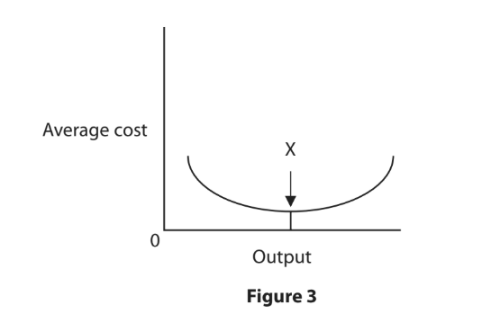
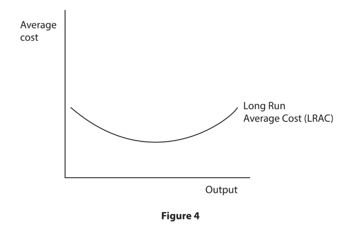

# Exam Questions — Business Costs, Revenues & Profit
**Business Economics** · Edexcel IGCSE Economics (4EC1)
> Source: [https://www.savemyexams.com/igcse/economics/edexcel/17/topic-questions/business-economics/business-costs-revenues-and-profit/exam-questions/](https://www.savemyexams.com/igcse/economics/edexcel/17/topic-questions/business-economics/business-costs-revenues-and-profit/exam-questions/) · 38 questions · total 141 marks

## Q1 — easy — 1 marks · exam-questions

### 3((b)) — 1 mark — multiple_choice — from paper June 2024 · Paper 1
Which **one** of the following is the formula to calculate total revenue?
- **A.** Quantity sold×price
- **B.** Profit – price
- **C.** Profit ÷ price
- **D.** Quantity sold ÷ price

## Q2 — easy — 8 marks · exam-questions

### 4((a)) — 2 marks — command: calculate — structured — from paper June 2024 · Paper 1
Figure 3 shows the daily costs of hiring a vehicle to transport goods to a customer.

| Vehicle hire cost (\$ per day) | Fuel cost (\$ per km) | Distance travelled (km) | Cost of insurance (\$ per day) |
|---|---|---|---|
| 90 | 0.25 | 65 | 20 |

**Figure 3**

Calculate the **daily total costs** of transporting the goods to the customer. You are advised to show your working.

### 4((b)) — 6 marks — command: analyse — structured — from paper June 2024 · Paper 1
MAS Supermarkets is the largest supermarket chain in Cyprus. It owns many shops across the country, selling a wide range of groceries. The firm states that its focus is on selling quality products, offering good service and low prices.

With reference to the data above and your knowledge of economics, analyse how internal economies of scale may lead to benefits for MAS Supermarkets.

## Q3 — easy — 1 marks · exam-questions

### 3((b)) — 1 mark — multiple_choice — from paper June 2024 · Paper 1R
Total revenue can be defined as the quantity of goods sold
- **A.** added to the price
- **B.** subtracted from the price
- **C.** multiplied by the price
- **D.** divided by the price

## Q4 — easy — 8 marks · exam-questions

### 4((a)) — 2 marks — command: calculate — structured — from paper June 2024 · Paper 1
Figure 3 shows the costs to a firm of running a machine to produce an order of goods.

| Purchase price of machine (\$) | Electricity (\$ per hour) | Production time (hours) | Insurance (\$) |
|---|---|---|---|
| 1 036 | 0.45 | 19 | 17 |

**Figure 3**

Calculate the** total variable costs** of this order for the firm. You are advised to show your working.

### 4((b)) — 6 marks — command: analyse — structured — from paper June 2024 · Paper 1R
A project to update the infrastructure and develop new routes along Indian railways has been in progress for a number of years. One part of the plan is to expand the rail network between Hyderabad and Karnataka.

The expanded railway network will provide more services for passengers, along with more freight trains. This will mean more raw materials, including cement, iron ore and steel can be transported.

With reference to the data above and your knowledge of economics, analyse the impact of external economies of scale on construction firms in India.

## Q5 — easy — 4 marks · exam-questions

### 2((c)) — 2 marks — command: calculate — structured — from paper Nov 2024 · Paper 1
Figure 3 shows some of the production costs in the month of September for a firm manufacturing rugby souvenirs in France, in preparation for the 2025 Six Nations tournament.

| Production costs | Euro (€) |
|---|---|
| Rent | 7000 |
| Raw materials | 3000 |
| Advertising | 1300 |
| Labour (paid according to output) | 18000 |

**Figure 3**

Calculate the** total variable costs** for the firm in the month of September. You are advised to show your working.

### 2((d)) — 2 marks — command: what — structured — from paper Nov 2024 · Paper 1
What is meant by the term total revenue?

## Q6 — easy — 11 marks · exam-questions

### 2((d)) — 2 marks — command: calculate — structured — from paper Jan 2023 · Paper 1
A firm has total fixed costs of \$57000 per month and variable costs of \$750 per unit. It produces 1,820 units per month.

Calculate the **total costs per month** for the firm. You are advised to show your working.

### 2((g)) — 9 marks — command: assess — structured — from paper Jan 2023 · Paper 1
Hong Kong telecommunications firm, CK Hutch, is planning to merge with Indosat which is based in Jakarta, Indonesia. Indosat provides services for mobile phones and broadband. It is a growing business, with a value of \$2.2bn and more than 60 million customers. Indonesia is Southeast Asia’s most populated country.

(Source adapted from: [Link](https://www.zdnet.com/article/ck-hutchison-and-ooredoo-indonesian-merger-to-create-indosat-ooredoo-hutchison/))

With reference to the data above and your knowledge of economics, assess the extent to which a merger between CK Hutch and Indosat is likely to lead to economies of scale.

## Q7 — easy — 2 marks · exam-questions

### 1((b)) — 1 mark — multiple_choice — from paper Jan 2023 · Paper 1R
A firm has total costs of \$700. It sells 300 items at a price of \$20 each. What is the **profit** for the firm?
- **A.** \$5300
- **B.** \$6000
- **C.** \$13700
- **D.** \$14000

### 1((d)) — 1 mark — command: state — structured — from paper Jan 2023 · Paper 1R
State **one** type of an external economy of scale.

## Q8 — easy — 2 marks · exam-questions

### 2((d)) — 2 marks — command: calculate — structured — from paper Jan 2023 · Paper 1R
Figure 4 shows the monthly costs per unit when a firm makes 3,000 units.

| Quantity | Total fixed costs | Total variable costs |
|---|---|---|
| 3,000 | \$6200 | \$3550 |

**Figure 4 **

Calculate the** average cost per unit (AC)** for the firm when it makes 3,000 units. You are advised to show your working.

## Q9 — easy — 2 marks · exam-questions

### 1((c)) — 2 marks — command: what — structured — from paper Jan 2023 · Paper 2
What is meant by the term economies of scale?

## Q10 — easy — 2 marks · exam-questions

### 2((d)) — 2 marks — command: calculate — structured — from paper Jan 2023 · Paper 1
Figure 3 shows some of the production costs in March for a firm manufacturing clothing in Bangladesh.

| Production costs | Bangladeshi Taka (Tk) |
|---|---|
| Rent | 20 250 |
| Raw materials | 10 050 |
| Advertising | 5 125 |
| Labour (paid in direct proportion to output) | 105 000 |

**Figure 3**

Calculate the** total fixed costs** for the firm in March. You are advised to show your working.

## Q11 — easy — 2 marks · exam-questions

### 4((a)) — 2 marks — command: calculate — structured — from paper Nov 2023 · Paper 1
Figure 5 shows profit for a firm between 2020 and 2022.

| Year | Profit (\$) |
|---|---|
| 2020 | 20 250 |
| 2021 | 21 000 |
| 2022 | 22 950 |

**Figure 5 **

Calculate, to two decimal places, the** percentage change in profit** for the firm between 2020 and 2022. You are advised to show your working.

## Q12 — easy — 1 marks · exam-questions

### 1((b)) — 1 mark — multiple_choice — from paper June 2022 · Paper 1
A firm charges a price of \$160 per item and has average costs of \$120 per item. It sells 20000 items.

What is the total revenue for the firm?
- **A.** \$19200
- **B.** \$20160
- **C.** \$2400000
- **D.** \$3200000

## Q13 — easy — 3 marks · exam-questions

### 2((b)) — 1 mark — multiple_choice — from paper June 2022 · Paper 1
Which **one** of the following is a situation when firms in a growing industry all benefit from lower average costs?
- **A.** Internal economies of scale
- **B.** External economies of scale
- **C.** Diseconomies of scale
- **D.** Technical economies of scale

### 2((d)) — 2 marks — command: calculate — structured — from paper June 2022 · Paper 1
A firm has total fixed costs of \$75000 per month and variable costs of \$525 per unit. It produces 1350 units per month.

Calculate the** total costs per month** for the firm. You are advised to show your working.

## Q14 — easy — 7 marks · exam-questions

### 1((b)) — 1 mark — multiple_choice — from paper June  · Paper 1R
A firm sells 40 units of a good. Variable costs are \$4 per unit. Customers pay \$10 per unit.

Which **one** of the following equals \$400?
- **A.** Price
- **B.** Total costs
- **C.** Profit
- **D.** Total revenue

### 1((i)) — 6 marks — command: analyse — structured — from paper June 2022 · Paper 1R
Unilever is a multinational corporation that sells consumer goods. It currently uses 700,000 tonnes o f non-recyclable plastic packaging each year. By 2025, it plans to reduce overall usage by 100,000 tonnes and replace the remaining 600,000 tonnes with more expensive plastic, which can be recycled.

(Source adapted from: [Link](https://www.npr.org/2019/10/07/767983664/unilever-vows-to- reduce-plastic-packaging-use-by-2025?t=1573738349481))

With reference to the data above and your knowledge of economics, analyse how the profits of Unilever may be affected.

## Q15 — easy — 2 marks · exam-questions

### 2((d)) — 2 marks — command: calculate — structured — from paper June 2022 · Paper 1R
Figure 2 shows some of the monthly production costs for a firm which manufactures clothing.

| Production costs | US\$ |
|---|---|
| Rent | 25000 |
| Raw materials | 12000 |
| Insurance | 5500 |
| Labour (payment depends on output) | 115000 |

**Figure 2**

Calculate the** total variable costs **for the firm each month. You are advised to show your working.

## Q16 — easy — 3 marks · exam-questions

### 2((b)) — 1 mark — multiple_choice — from paper June 2021 · Paper 1
Which **one** of the following is the formula for calculating average cost?
- **A.** <u>      Total fixed cost      </u>
Quantity produced
- **B.** <u>        Total revenue          </u>
Quantity produced
- **C.** <u>               Total cost              </u>
Quantity produced
- **D.** <u>   Total variable cost   </u>
Quantity produced

### 2((d)) — 2 marks — command: calculate — structured — from paper June  · Paper 1
Figure 2 shows selected financial data of a firm selling shoes.

|   | Cost/Revenue per pair of shoes (\$) |
|---|---|
| Selling price | 89 |
| Raw materials | 17 |
| Labour | 35 |

**Figure 2**

Calculate the** profit or loss** for the firm for each pair of shoes. You are advised to show your working.

## Q17 — easy — 8 marks · exam-questions

### 1((f)) — 2 marks — command: calculate — structured — from paper Nov 2021 · Paper 1
A firm has total fixed costs of \$50000 per month and variable costs of \$250 per unit. It produces 750 units per month.

Calculate the** total costs per month** for the firm. You are advised to show your working.

### 1((i)) — 6 marks — command: analyse — structured — from paper Nov 2021 · Paper 1
Cutting Edge is a gardening firm that started trading three years ago. It often turned down work because it did not have a saw powerful enough to cut through larger trees. Once the firm expanded, Cutting Edge was able to justify buying a bigger saw.

With reference to the data above and your knowledge of economics, analyse how Cutting Edge benefitted from technical economies of scale.

## Q18 — easy — 2 marks · exam-questions

### 4((a)) — 2 marks — command: calculate — structured — from paper Nov 2021 · Paper 1
Figure 4 shows profit for a firm between 2017 and 2019.

| Year | Profit (\$) |
|---|---|
| 2017 | 80750 |
| 2018 | 83550 |
| 2019 | 87100 |

**Figure 4**

Calculate, to two decimal places, the **percentage change in profit **between 2017 and 2019, for the firm. You are advised to show your working.

## Q19 — easy — 1 marks · exam-questions

### 1((b)) — 1 mark — multiple_choice — from paper Nov 2020 · Paper 1
A firm has total costs of \$1 250 000 per month and variable costs of \$100 per unit.

If it produces 5,000 units, calculate the total fixed costs per month for the firm.
- **A.** \$1 750 000
- **B.** \$1 250 100
- **C.** \$1 249 900
- **D.** \$750 000

## Q20 — easy — 1 marks · exam-questions

### 2((c)) — 1 mark — command: state — structured — from paper Jan 2020 · Paper 1
State the formula for profit.

## Q21 — easy — 1 marks · exam-questions

### 3((a)) — 1 mark — multiple_choice — from paper Jan 2020 · Paper 1
Which **one** of the following is an example of an external economy of scale?
- **A.** Bulk buying
- **B.** Skilled labour
- **C.** Bureaucracy
- **D.** Managerial

## Q22 — easy — 2 marks · exam-questions

### 4((a)) — 2 marks — command: calculate — structured — from paper Jan 2020 · Paper 1
Veronique owns a shop that makes cakes for special occasions. The cakes sell for an average price of €40 each.

Calculate the quantity of cakes sold by Veronique’s shop when total revenue is €3 600. You are advised to show your working.

## Q23 — easy — 1 marks · exam-questions

### 1((b)) — 1 mark — multiple_choice — from paper Jan 2020 · Paper 1R
A firm has total costs of \$500 and sells each item at a price of \$50. It sells 100 items. What is the **profit or loss** for the firm?
- **A.** \$45 000 profit
- **B.** \$4 500 profit
- **C.** \$20 000 loss
- **D.** \$450 loss

## Q24 — easy — 1 marks · exam-questions

### 3((b)) — 1 mark — multiple_choice — from paper Jan 2020 · Paper 1R
Average costs can be calculated by which one of the following equations?
- **A.** <u>Total revenue</u>
Total costs
- **B.** <u>Total revenue</u>
Price
- **C.** <u>Output</u>
Total fixed costs
- **D.** <u>Total costs</u>
Output

## Q25 — easy — 2 marks · exam-questions

### 2((d)) — 2 marks — command: calculate — structured — from paper Nov 2020 · Paper 1
Figure 4 shows some of the production costs in the month of May for a firm manufacturing football souvenirs in Qatar, in preparation for the 2022 World Cup.

| Production costs ) | Qatari Riyal (QR |
|---|---|
| Rent | 5000 |
| Raw materials | 2000 |
| Advertising | 500 |
| Labour (paid according to output) | 15000 |

**Figure 4 **

Calculate the **total variable costs** for the firm in the month of May. You are advised to show your working.

## Q26 — easy — 2 marks · exam-questions

### 1((c)) — 2 marks — command: what — structured — from paper Nov 2020 · Paper 1R
What is meant by the term total revenue?

## Q27 — easy — 3 marks · exam-questions

### 2((a)) — 1 mark — multiple_choice — from paper Nov 2020 · Paper 1R
Which **one** of the following is the correct label to replace ‘X’ on the diagram below?

- **A.** Internal economies of scale
- **B.** External economies of scale
- **C.** Total costs
- **D.** Most efficient

### 2((c)) — 2 marks — command: calculate — structured — from paper Nov 2020 · Paper 1R
Figure 4 shows some of the production costs in November for a firm manufacturing rugs and carpets in Pakistan.

| Production costs | Pakistani Rupee (Rs) |
|---|---|
| Rent | 40250 |
| Raw materials | 20050 |
| Advertising | 10125 |
| Labour (paid in direct proportion to output) | 210000 |

**Figure 4**

Calculate the **total fixed costs** for the firm in November. You are advised to show  your working.

## Q28 — easy — 3 marks · exam-questions

### 1((b)) — 1 mark — multiple_choice — from paper June 2019 · Paper 1
A firm has total fixed costs of \$40 000 per month and variable costs of \$150 per unit. If it produces 1,000 units, what are the total costs per month for the firm?
- **A.** \$190 000
- **B.** \$150 000
- **C.** \$41 150
- **D.** \$40 150

### 1((f)) — 2 marks — command: calculate — structured — from paper June 2019 · Paper 1
Figure 1 shows the costs of production per month for a firm making 2,000 units.

| Quantity | Total fixed costs | Total variable costs |
|---|---|---|
| 2,000 | \$7 340 | \$4 760 |

**Figure 1**

Calculate the average cost per unit for the firm when it makes 2,000 units. You are advised to show your working.

## Q29 — easy — 1 marks · exam-questions

### 3((b)) — 1 mark — multiple_choice — from paper June 2019 · Paper 1
Which** one** of the following is a diseconomy of scale?
- **A.** An increase in productivity
- **B.** An increase in bureaucracy
- **C.** A decrease in the cost of research and development
- **D.** A decrease in government regulation

## Q30 — easy — 1 marks · exam-questions

### 1((b)) — 1 mark — multiple_choice — from paper June 2019 · Paper 1R
A firm has monthly total costs of \$150 000 and monthly fixed costs of \$90 000. If it produces 1,000 units, what are the monthly total variable costs for the firm?
- **A.** \$60
- **B.** \$90
- **C.** \$60 000
- **D.** \$240 000

## Q31 — easy — 2 marks · exam-questions

### 3((c)) — 2 marks — command: calculate — structured — from paper June 2019 · Paper 1R
The total revenue of a printing firm is \$75 000 per month when it sells 100,000 newspapers. The price of a newspaper increases to \$0.85 and demand falls to 95,000 newspapers per month.

Calculate the new total revenue. You are advised to show your working.

## Q32 — medium — 3 marks · exam-questions

### 3((c)) — 3 marks — command: draw — structured — from paper Nov 2023 · Paper 1
On the diagram below, draw and label economies of scale, diseconomies of scale and the point at which the firm is most efficient.

## Q33 — medium — 6 marks · exam-questions

### 4((b)) — 6 marks — command: analyse — structured — from paper Jan 2020 · Paper 1R
Sky Team is a group of 19 airlines, including Delta Airlines, KLM, Air France and China Airlines that share operating facilities and cooperate when setting flight routes. This allows more choice for passengers. Vietnam Airlines is a small airline that became a member of Sky Team in 2010. It was the first Southeast Asian airline to join Sky Team and has become more well-known to air passengers as a result of the group’s advertising campaigns.

With reference to the data above and your knowledge of economics, analyse how a smaller airline may benefit from internal economies of scale by joining a group such as Sky Team.

## Q34 — medium — 3 marks · exam-questions

### 1((h)) — 3 marks — command: explain — structured — from paper Nov 2020 · Paper 1
The music entertainment industry is dominated by a few main firms. These are BMG, EMI Group, Sony, Universal Music Group and Warner.

Explain **one** possible barrier to entry a new firm might face when trying to enter this industry.

## Q35 — medium — 6 marks · exam-questions

### 4((b)) — 6 marks — command: analyse — structured — from paper Nov 2020 · Paper 1R
Five years ago Ben Hogan began working for a large firm based in London. He was originally happy with his role but is now thinking about leaving. He is frustrated with how long it takes for even straight-forward decisions to be made.

The firm has grown considerably in the last two years and there are many more employees as a result. There is an increasing number of checklists about how to carry out tasks. Ben finds this time‐consuming and feels his ideas are no longer listened to.

With reference to the data above and your knowledge of economics, analyse why Ben’s employer might be experiencing diseconomies of scale.

## Q36 — hard — 12 marks · exam-questions

### 4((c)) — 12 marks — command: evaluate — structured — from paper Nov 2024 · Paper 1
Twitter, one of the most popular social media platforms, was bought for \$44bn by entrepreneur Elon Musk in 2022.

The aims of Elon Musk include the creation of an ‘everything app’ – a platform that includes messaging, payments, ridesharing, food delivery and more. To support this, Elon Musk introduced major changes to Twitter, including renaming it ‘X’.

The number of X users increased to a new high of 530 million by 2023, following an increase in publicity about the change of name. This meant X did not need to pay high advertising costs to promote the platform.

Advanced technology will be introduced by X to enable users to operate multiple functions on the new platform. This research and development is likely to lead to a significant cost for the firm.

The platform has experienced a decrease of 65% in advertising revenue. Thousands of workers have already lost their jobs, including those in managerial roles.

With reference to the data above and your knowledge of economics, evaluate whether X is likely to benefit from economies of scale.

## Q37 — hard — 12 marks · exam-questions

### 4((c)) — 12 marks — command: evaluate — structured — from paper June 2022 · Paper 1R
Instagram, WhatsApp and Facebook Messenger are social network messaging services, taken over and owned by Facebook. Between them, they have more than 2.6 billion users. Although they currently operate as stand-alone apps, Facebook’s chief executive, Mark Zuckerberg, has now taken greater control of all three. He has plans to combine the services, allowing messages to be sent between the different apps.

Both Instagram and WhatsApp have grown considerably since the takeover but their original founders have left due to the increased control from Facebook. Some employees are unhappy and do not understand the planned changes to the services. However, Zuckerberg thinks there will be long-term benefits including reduced costs. He says that less software will be needed once the system is in place and consumers will be less likely to use competitors’ apps.

(Source adapted from: [Link](https://www.nytimes.com/2019/01/25/technology/facebook-instagram-whatsapp-messenger.html))

With reference to the data above and your knowledge of economics, evaluate whether Zuckerberg’s decision to combine all three services is likely to lead to economies of scale.

## Q38 — hard — 9 marks · exam-questions

### 3((e)) — 9 marks — command: assess — structured — from paper Nov 2020 · Paper 1
Istanbul’s new airport will be huge in size and capacity when construction is finished. It will have the ability to handle around 200 million passengers annually. This is double the number of the world’s current busiest airport in Atlanta, USA. The airport will cost \$11.7bn to build. It will have four terminals, six runways and cover an area of 29.5 square miles, making it larger than the island of Manhattan in New York.

(Source adapted from: [https://matadornetwork.com/read/istanbul-new-airport-biggest-world/](https://matadornetwork.com/read/istanbul-new-airport-biggest-world/))

With reference to the data above and your knowledge of economics, assess whether Istanbul’s new airport is likely to benefit from internal economies of scale.
