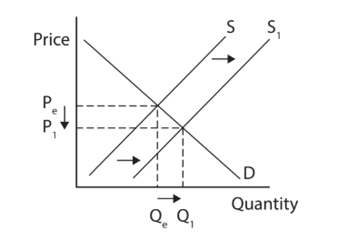
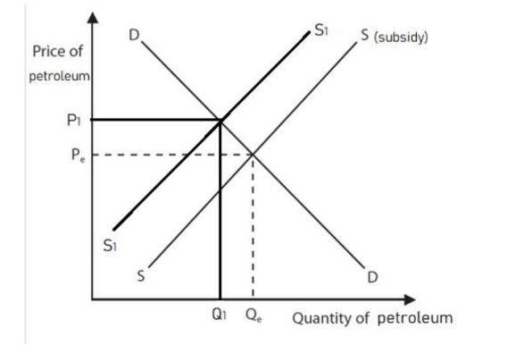
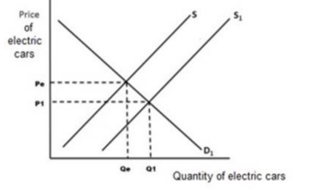
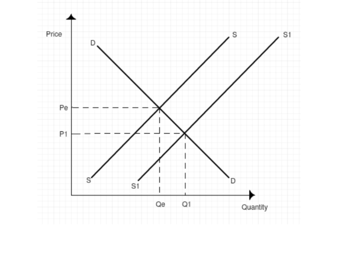
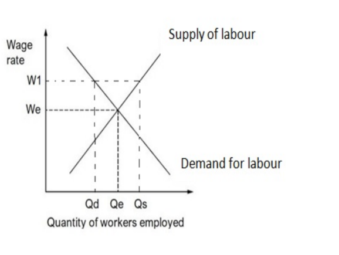
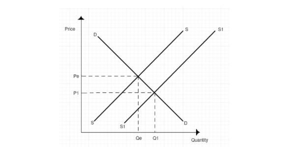
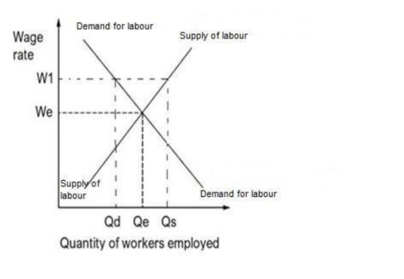
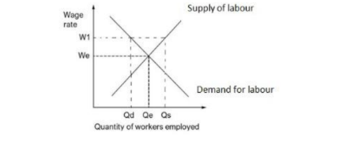
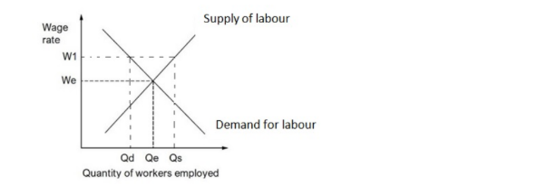

# Mark Schemes — Government Intervention
**Business Economics** · Edexcel IGCSE Economics (4EC1)

## Q1 — easy — 1 marks · exam-questions

### 1((b)) — 1 marks
**Correct answer: C** — €211.40

**Final answer:** **The correct answer is C**

The minimum wage is the lowest hourly rate an employer may legally pay, so the lowest weekly wage is €6.04 × 35 = €211.40

**A** is incorrect as €6.04 is the pay for only one hour of labour

**B** is incorrect as €205.36 is less than the minimum wage for a 35-hour week

**D** is incorrect as €422.80 is twice the minimum, so it is not the lowest amount that can be earned

## Q2 — easy — 1 marks · exam-questions

### 1((b)) — 1 marks
**Correct answer: C** — Increased subsidy

**Final answer:** **The correct answer is C**

A subsidy is a payment from the government to a producer, so an increased subsidy reduces the amount the firm has to pay itself and its total costs fall

**A** is incorrect as a fine is a payment the firm must make, so it would not lower total costs

**B** is incorrect as regulation is more likely to increase total costs, since the firm must spend money on complying with it

**D** is incorrect as increased taxation would raise the firm's total costs rather than reduce them

## Q3 — easy — 2 marks · exam-questions

### 2((d)) — 2 marks
Fines are financial penalties imposed on individuals or businesses** [1]** who break the law or disobey regulations** [1]**

**[2 marks]**

> **[mark-scheme]**
> Award up to 2 marks for a correct definition, 1 mark for reference to a financial penalty and 1 mark for reference to breaking the law or disobeying regulations
> 
> Accept any other correct and appropriate wording

## Q4 — easy — 1 marks · exam-questions

### 1() — 1 marks
**Correct answer: A** — 

**Final answer:** **The correct answer is A**

A subsidy lowers the cost of producing each car, so manufacturers are willing to supply more at every price. Supply shifts to the right from S to S1, the equilibrium price falls from Pe to P1 and the equilibrium quantity rises from Qe to Q1

**B** is incorrect as it shows a change caused by a movement in price rather than a shift in supply

**C** is incorrect as it shows a decrease in supply, which is what a tax rather than a subsidy would cause

**D** is incorrect as it shows a movement along the supply curve, not the shift that a subsidy produces

## Q5 — easy — 2 marks · exam-questions

### 2((e)) — 2 marks
One disadvantage is the opportunity cost of the money spent** [1]**, because government spending on a subsidy is money that can no longer be spent on schools, hospitals or other projects that might have brought greater benefit** [1]**

**[2 marks]**

> **[mark-scheme]**
> Award 1 mark for reference to a valid disadvantage and 1 mark for development of that disadvantage
> 
> Accept any other appropriate response, e.g. firms may become dependent on the subsidy (1) so they have less incentive to control their own costs and become inefficient (1), or the cost to the government may be higher than expected (1) if demand for the subsidised good turns out to be greater than forecast (1)

> **[exam-tip]**
> - The question asks for a disadvantage to the **government**, so an answer about firms or consumers losing out will not be credited
> - Give one disadvantage and then develop it, a list of disadvantages cannot earn the second mark

## Q6 — easy — 1 marks · exam-questions

### 3((b)) — 1 marks
**Correct answer: C** — To close the income gap between the rich and the poor

**Final answer:** **The correct answer is C**

A minimum wage raises the pay of the lowest-paid workers, which reduces the difference between their incomes and those of higher earners

**A** is incorrect as higher wages mean fewer people rely on state support, so the benefits a government pays would fall rather than rise

**B** is incorrect as higher wages are more likely to increase the motivation of workers, not reduce it

**D** is incorrect as a minimum wage raises producers' labour costs and so reduces their profits

## Q7 — easy — 11 marks · exam-questions

### 2((d)) — 2 marks
Pollution permits give firms the legal right** [1]** to discharge a certain amount of polluting material** [1]**

**[2 marks]**

> **[mark-scheme]**
> Award 1 mark for reference to a legal right and 1 mark for reference to limiting the amount of pollution
> 
> Accept any other correct and appropriate wording

### 2((g)) — 9 marks
A fine is a financial penalty imposed on a firm that breaks environmental law, and it works by making pollution costly enough to deter it.** [K]** Thames Water was fined £2.3m in 2021 after being found guilty of polluting a stream and killing more than 1,000 fish,** [Ap]** so the external cost the firm imposed on the environment is turned into a private cost that it has to pay, which is the polluter pays principle at work.** [An]** The fine reduces the firm's profit and gives it a financial incentive to invest in preventing future pollution, the money raised can be used to clear up the damage, and the publicity surrounding the case harms the firm's reputation, which may make investors less willing to fund it.** [An]**

However, a fine only deters pollution if it is large enough to matter to the firm.** [Ev]** Thames Water made an operating profit of £513.4m in 2020, so a £2.3m fine amounts to less than half of one per cent of a single year's profit,** [Ap]** and the £24.4m paid across nine separate cases of water pollution since 2017 has clearly not stopped the pollution from happening again.** [An]** Where the cost of preventing pollution is greater than the fine the firm expects to pay, a profit-maximising firm will simply pay the fine and continue as before. The system is also slow, as it took over five years to bring the 2016 incident to court, which weakens the deterrent effect further.** [An]**

**[9 marks]**

> **[mark-scheme]**
> This is a ‘levelled response’ question
> 
> - **[Ap]** = application to the data given  (3 marks)
> - **[An]** = analysis / chain of reasoning (3 marks)
> - **[Ev]** = evaluation (3 marks)
> 
> Although there are no separate **[K] marks**, both application and analysis must be built on **clear and accurate economic knowledge and understanding**
> 
> Therefore, each KAA paragraph should follow:
> 
> - Valid knowledge point → Application → Analysis
> - Each valid point made in the answer does not equal a mark, the response is judged holistically against the level descriptors
> 
> **Mark allocation**
> 
> A 9 mark (Level 3) answer will include examples which demonstrate:
> 
> - **Application [Ap]** — clear knowledge and understanding by developing relevant points. Appropriate application of economic terms, concepts, theories and calculations
> - **Analysis [An]** — Information presented will demonstrate excellent selectivity and organisation. Interpretation of economic information will be excellent, with a thorough analysis of issues
> - **Evaluation [Ev]** — Offers more than one viewpoint. The argument is well balanced and coherent, leading to an evaluation that demonstrates full understanding and awareness
> 
> **Alternative content**
> 
> The answer above is just one example of how to respond to this question. Additional information which could be used in the answer includes:
> 
> - Fines raise revenue that a government can spend on repairing the environmental damage caused
> - Damage to a firm's public image may reduce investment in it, adding to the deterrent
> - On the other side, alternatives such as regulation, pollution permits or a tax on emissions may protect the environment more reliably than fines imposed after the event
> - Any other relevant and valid analysis is acceptable

> **[exam-tip]**
> - Compare the fine with the profit, £2.3m against an operating profit of £513.4m is the single strongest piece of evidence in this question
> - Keep the answer on how effective fines are, not on how bad pollution is
> - No conclusion is required at 9 marks, but both sides must be developed to matching depth

## Q8 — easy — 1 marks · exam-questions

### 3((b)) — 1 marks
**Correct answer: D** — decrease quantity of labour demanded and increase the wage rate

**Final answer:** **The correct answer is D**

A minimum wage set above the equilibrium raises the wage employers must pay, and because labour now costs more, firms demand a smaller quantity of it

**A** is incorrect as employers demand less labour, not more, and the wage rate is higher than the equilibrium rather than lower

**B** is incorrect as employers are less likely to demand labour once its price has been forced up

**C** is incorrect as the wage rate will be higher than the equilibrium, since that is what setting a minimum above it means

## Q9 — easy — 1 marks · exam-questions

### 2((e)) — 1 marks
**A takeover is when one firm buys another firm and gains control of it****[1 mark]**

> **[mark-scheme]**
> Award 1 mark for a correct definition
> 
> Accept any other correct and appropriate wording, e.g. obtaining control of a firm by buying more than 50% of its shares

## Q10 — easy — 1 marks · exam-questions

### 2((e)) — 1 marks
**A minimum wage is the lowest amount an employer may legally pay an employee****[1 mark]**

> **[mark-scheme]**
> Award 1 mark for a correct definition
> 
> Accept any other correct and appropriate wording

## Q11 — easy — 1 marks · exam-questions

### 3((a)) — 1 marks
**Correct answer: B** — government intervention

**Final answer:** **The correct answer is B**

A pollution permit is issued by a government to limit the amount a firm may pollute, so it is a way of intervening in the market to correct market failure

**A** is incorrect as a pollution permit is not a resource used to produce goods and services, which is what a factor of production is

**C** is incorrect as an economy of scale is a fall in average costs caused by a firm expanding, which a permit does not provide

**D** is incorrect as an economic assumption is something taken to be true without definite proof, not a policy tool

## Q12 — easy — 2 marks · exam-questions

### 2((c)) — 1 marks
**To correct market failure****[1 mark]**

> **[mark-scheme]**
> Award 1 mark for a suitable reason
> 
> Accept any other appropriate response, e.g. a lack of competition in a market, a lack of information available to consumers, the existence of externalities, or the under-provision of public and merit goods

### 2((e)) — 1 marks
**A fine is a financial penalty imposed on a firm or individual that breaks the law****[1 mark]**

> **[mark-scheme]**
> Award 1 mark for a correct definition
> 
> Accept any other correct and appropriate wording

## Q13 — easy — 2 marks · exam-questions

### 4((a)) — 2 marks
€5.87 × 175 **[1 mark]**

**= €1,027.25** **[1 mark]**

> **[mark-scheme]**
> Award 1 mark for showing the correct calculation
> 
> Award 1 mark for the correct monthly gross income
> 
> Award 2 marks if the monthly gross income is accurately calculated as €1,027.25, even if no calculations are shown
> 
> Award 1 mark if the monthly gross income is given as 1,027.25 with no currency symbol

> **[exam-tip]**
> - Always include the currency symbol. Examiner reports repeatedly record candidates who calculated correctly but lost a mark because the € sign was missing from the final answer
> - The question advises you to show your working, and doing so earns a mark even if the final figure is wrong
> - Gross income means pay before any deductions, so there is nothing to subtract here

## Q14 — easy — 1 marks · exam-questions

### 2((a)) — 1 marks
**Correct answer: C** — 

**Final answer:** **The correct answer is C**

A subsidy lowers producers' costs, so removing it raises them. Supply falls, the supply curve shifts to the left, the equilibrium price rises and the equilibrium quantity falls

**A** is incorrect as it shows a shift in demand, but a subsidy paid to farmers affects the supply of agricultural products, not consumers' demand for them

**B** is incorrect as it also shows a shift in demand rather than a shift in supply

**D** is incorrect as it shows supply increasing, which is what introducing a subsidy would do rather than removing one

## Q15 — easy — 2 marks · exam-questions

### 2((e)) — 2 marks
One policy is taxation** [1]**, which raises the price of a demerit good such as cigarettes so that consumers buy less of it and the external costs the government is trying to reduce fall** [1]**

**[2 marks]**

> **[mark-scheme]**
> Award 1 mark for reference to a valid policy and 1 mark for development of that policy
> 
> Accept any other appropriate response, e.g. regulation (1) which sets legal limits on how much a firm may pollute (1), fines (1) which make polluting expensive enough to deter firms from doing it (1), or pollution permits (1) which cap the total amount of pollution allowed in a market (1)

> **[exam-tip]**
> - Name one policy and then say how it reduces the externality, a list of policies cannot earn the second mark
> - There are no marks for defining a negative externality, go straight to the policy

## Q16 — medium — 3 marks · exam-questions

### 1((f)) — 3 marks

**[3 marks]**

> **[mark-scheme]**
> Award 1 mark for a leftward shift of the supply curve, labelled
> 
> Award 1 mark for a higher equilibrium price, labelled
> 
> Award 1 mark for a lower equilibrium quantity, labelled

> **[exam-tip]**
> - A subsidy lowers producers' costs, so **removing** it raises them and supply shifts to the **left**. Read the stem carefully, the same diagram with the shift the other way is the answer to the opposite question
> - Move only the supply curve. Shifting demand as well shows that you have not understood the scenario and examiner reports note that candidates who shift both curves score nothing
> - All three marks depend on labelling, so name the new supply curve and mark the new price and quantity on the axes

## Q17 — medium — 3 marks · exam-questions

### 2((f)) — 3 marks
One reason is to increase competition in the taxi market** [1]**, because legislation that makes it easier for new firms to enter lowers the barriers protecting the taxi firms already operating in Italy** [1]**, so those firms lose the power to charge high fares and the public gains both a wider choice of taxi and lower prices** [1]**

**[3 marks]**

> **[mark-scheme]**
> Award 1 mark for identifying a relevant reason
> 
> Award 1 mark for developing the reason
> 
> Award 1 mark for the response being in context
> 
> **Alternative content**
> 
> The answer above is just one example of a response to this question. Other reasons could include:
> 
> - More taxis available means it is easier and quicker for the public to find and hire one
> - Greater competition encourages firms to improve the quality of their service
> - More taxi firms create employment and generate tax revenue for the government
> 
> Accept any other appropriate response

> **[exam-tip]**
> - The chain must end with a benefit to the public or to the market, an answer that stops at 'more firms can enter' has not explained why the government wanted that
> - The context mark comes from the stem, so refer to Italy and to taxis rather than writing about markets in general

## Q18 — medium — 6 marks · exam-questions

### 3((d)) — 6 marks
The supply of labour is the number of workers willing and able to work at a given wage rate, and it responds to the reward on offer.** [K]** In Barbados the national minimum wage rose from \$6.25 to \$8.50 per hour in 2021, an increase of \$2.25 or 36%,** [Ap]** so the lowest-paid work now pays substantially more than it did before. Because the reward for working has risen, people who previously judged that low-paid work was not worth the effort, or not worth giving up time spent at home or in education, now find that it is,** [An]** so more of them offer themselves for employment and the quantity of labour supplied rises, shown by an extension along the labour supply curve up to the new wage of \$8.50 on the diagram. A 36% rise is large enough to change living standards for workers who previously struggled to meet their basic needs,** [Ap]** so the incentive to enter the labour market is strong and the increase in the quantity of labour supplied is likely to be significant.** [An]**

**[6 marks]**

> **[mark-scheme]**
> This is a ‘levelled response’ question
> 
> - **[Ap]** = application to the data given  (3 marks)
> - **[An]** = analysis / chain of reasoning (3 marks)
> 
> Although there are no separate **[K] marks**, both application and analysis must be built on **clear and accurate economic knowledge and understanding**
> 
> Therefore, each KAA paragraph should follow:
> 
> - Valid knowledge point → Application → Analysis
> - Each valid point made in the answer does not equal a mark, the response is judged holistically against the level descriptors
> 
> **Mark allocation**
> 
> Answers are placed into one of three levels.  **A level 3 answer (5-6 marks)**, will specifically:
> 
> - Demonstrate clear knowledge and understanding by developing relevant points and include appropriate application of economic terms, concepts, theories and calculations
> - Information presented will demonstrate excellent selectivity and organisation. Interpretation of economic information will be excellent, with a thorough analysis of issues
> 
> **Alternative content**
> 
> The answer above is just one example of how to respond to this question. Additional information which could be used in the answer includes:
> 
> - Workers already in employment may be willing to work longer hours at the higher wage, which also raises the quantity of labour supplied
> - The higher wage may attract people from outside the labour force, such as those previously relying on benefits or working informally
> - Any other relevant and valid analysis is acceptable

> **[exam-tip]**
> - Read the question carefully, it asks about the **supply** of labour, marks are not available here for what happens to the demand for labour
> - Use the figures, quoting the rise from \$6.25 to \$8.50 and working out that this is a 36% increase is what shows the size of the incentive
> - No counter-argument and no conclusion is required, analyse is always one-sided

## Q19 — medium — 3 marks · exam-questions

### 1((g)) — 3 marks
One reason is that fines deter firms from breaking the law** [1]**, because a penalty as large as \$1m reduces a construction company's profit significantly** [1]**, so firms in Singapore have a strong financial incentive to provide the safety equipment and training that prevents workers being injured or killed** [1]**

**[3 marks]**

> **[mark-scheme]**
> Award 1 mark for identifying a relevant reason
> 
> Award 1 mark for developing the reason
> 
> Award 1 mark for the response being in context
> 
> **Alternative content**
> 
> The answer above is just one example of a response to this question. Other reasons could include:
> 
> - Fines raise revenue for the government, which can be used to compensate those harmed when a law is broken
> - Fines apply the polluter pays or wrongdoer pays principle, making the firm bear the cost of the harm it causes
> - The publicity around a large fine damages a firm's reputation, adding to the deterrent
> 
> Accept any other appropriate response

> **[exam-tip]**
> - There are no marks for defining a fine on an 'explain' question, the marks are for a reason, its development and the context
> - The context mark comes from the stem, so refer to the \$1m fine or to the construction company's failure to provide safety equipment

## Q20 — medium — 3 marks · exam-questions

### 1((g)) — 3 marks

**[3 marks]**

> **[mark-scheme]**
> Award 1 mark for a rightward shift of the supply curve, labelled
> 
> Award 1 mark for a lower equilibrium price, labelled
> 
> Award 1 mark for a higher equilibrium quantity, labelled

> **[exam-tip]**
> - A subsidy lowers the cost of producing each electric car, so producers supply more at every price and the supply curve shifts to the **right**
> - Move only the supply curve. A subsidy paid to producers does not shift demand, and examiner reports note that candidates who shift both curves score nothing
> - All three marks depend on labelling, so name the new supply curve and mark the new price and quantity on the axes

## Q21 — medium — 3 marks · exam-questions

### 1((f)) — 3 marks

**[3 marks]**

> **[mark-scheme]**
> Award 1 mark for a rightward shift of supply, labelled
> 
> Award 1 mark for a lower equilibrium price, labelled
> 
> Award 1 mark for a higher equilibrium quantity, labelled

> **[exam-tip]**
> - A subsidy lowers the cost of producing renewable energy, so firms supply more at every price and the supply curve shifts to the **right**
> - Move only the supply curve. A subsidy paid to producers does not shift demand, and examiner reports note that candidates who shift both curves score nothing
> - All three marks depend on labelling, so name the new supply curve and mark the new equilibrium price and quantity on the axes

## Q22 — medium — 6 marks · exam-questions

### 4((b)) — 6 marks
A takeover involves one firm buying control of another and is a form of external growth, which reduces the number of firms competing in a market.** [K]** Vodafone agreed to pay \$21.8bn for Liberty Global's German operations,** [Ap]** so the combined business would be far larger than either firm was alone and, as the German broadband providers argued, too dominant in the cable TV market. Where one firm dominates a market it becomes a price-maker,** [An]** so German consumers of cable TV could face higher prices and a poorer service with no realistic alternative supplier to switch to, which is why a government may want to control or block such a deal. Competition also drives investment,** [Ap]** and the business group argued that the takeover would delay work on building a nationwide fibre-optic network, so allowing it could leave consumers with a slower service for longer,** [An]** whereas keeping Liberty Global independent leaves a rival able to challenge Vodafone and force it to improve what it offers.** [An]**

**[6 marks]**

> **[mark-scheme]**
> This is a ‘levelled response’ question
> 
> - **[Ap]** = application to the data given  (3 marks)
> - **[An]** = analysis / chain of reasoning (3 marks)
> 
> Although there are no separate **[K] marks**, both application and analysis must be built on **clear and accurate economic knowledge and understanding**
> 
> Therefore, each KAA paragraph should follow:
> 
> - Valid knowledge point → Application → Analysis
> - Each valid point made in the answer does not equal a mark, the response is judged holistically against the level descriptors
> 
> **Mark allocation**
> 
> Answers are placed into one of three levels.  **A level 3 answer (5-6 marks)**, will specifically:
> 
> - Demonstrate clear knowledge and understanding by developing relevant points and include appropriate application of economic terms, concepts, theories and calculations
> - Information presented will demonstrate excellent selectivity and organisation. Interpretation of economic information will be excellent, with a thorough analysis of issues
> 
> **Alternative content**
> 
> The answer above is just one example of how to respond to this question. Additional information which could be used in the answer includes:
> 
> - A takeover can raise barriers to entry, making it harder still for new firms to challenge the dominant one
> - Governments also control takeovers to protect employment, since merged firms often cut duplicated jobs
> - Any other relevant and valid analysis is acceptable

> **[exam-tip]**
> - Keep the answer on why the **government** would intervene, the harm to consumers is the reason, so every chain should finish there
> - Use the extract, the \$21.8bn price, the cable TV market and the fibre-optic network are the three details that make the answer applied
> - No counter-argument and no conclusion is required, analyse is always one-sided

## Q23 — medium — 3 marks · exam-questions

### 2((e)) — 3 marks
One advantage is that parking fines raise revenue** [1]**, because over 350,000 fines of £30 generated an additional £10.4m for Manchester's local government in a single year** [1]**, which can then be spent on improving local public services such as roads and public transport** [1]**

**[3 marks]**

> **[mark-scheme]**
> Award 1 mark for identifying a relevant advantage of using a fine
> 
> Award 1 mark for developing the advantage
> 
> Award 1 mark for the response being in context
> 
> **Alternative content**
> 
> The answer above is just one example of a response to this question. Other advantages could include:
> 
> - Fines deter motorists from parking illegally, since a £30 penalty reduces their income
> - Fewer illegally parked cars means less congestion and safer streets in Manchester
> - The deterrent may persuade some motorists to use public transport instead of driving
> 
> Accept any other appropriate response

> **[exam-tip]**
> - The question asks for an advantage to the local government, so an answer about what motorists gain will not be credited
> - The context mark comes from the figures, so use the £30 fine, the 350,000 motorists or the £10.4m raised

## Q24 — medium — 3 marks · exam-questions

### 2((g)) — 3 marks
One reason is that the threat of a fine encourages drivers to keep within the 30 miles per hour limit** [1]**, because paying a fine reduces a driver's income and so makes speeding costly** [1]**, which means fewer accidents in urban areas and a fall in the external costs that speeding imposes on pedestrians and other road users** [1]**

**[3 marks]**

> **[mark-scheme]**
> Award 1 mark for identifying a relevant reason
> 
> Award 1 mark for developing the reason
> 
> Award 1 mark for the response being in context
> 
> **Alternative content**
> 
> The answer above is just one example of a response to this question. Other reasons could include:
> 
> - Fines make the driver bear the cost of the harm they impose on others, applying the polluter pays principle
> - Slower urban traffic produces less noise and air pollution, reducing further negative externalities
> - The revenue raised can be spent on road safety measures such as crossings and speed cameras
> 
> Accept any other appropriate response

> **[exam-tip]**
> - The chain must finish at the negative externality, an answer that stops at 'drivers slow down' has not explained the economics
> - The context mark comes from the stem, so refer to the 30 miles per hour urban speed limit in the UK

## Q25 — medium — 6 marks · exam-questions

### 3((d)) — 6 marks
A minimum wage sets the lowest wage that can legally be paid, and governments raise it to protect the incomes of the lowest-paid workers.** [K]** In Turkey the national monthly minimum wage rose from 2,020 TRY in 2018 to 2,558 TRY in 2019, an increase of 538 TRY,** [Ap]** which is a substantial addition to the monthly income of anyone earning at that level. Because prices generally rise each year, a minimum wage left unchanged would buy less and less,** [An]** so raising it annually stops the real income of the lowest paid from falling and allows workers who previously struggled to afford basic needs to maintain their standard of living. Higher earnings also reduce what the Turkish Government itself has to spend supporting low-paid workers,** [Ap]** since the responsibility for providing an adequate income is shifted onto employers,** [An]** and workers with more income to spend raise demand for goods and services across the Turkish economy.** [An]**

**[6 marks]**

> **[mark-scheme]**
> This is a ‘levelled response’ question
> 
> - **[Ap]** = application to the data given  (3 marks)
> - **[An]** = analysis / chain of reasoning (3 marks)
> 
> Although there are no separate **[K] marks**, both application and analysis must be built on **clear and accurate economic knowledge and understanding**
> 
> Therefore, each KAA paragraph should follow:
> 
> - Valid knowledge point → Application → Analysis
> - Each valid point made in the answer does not equal a mark, the response is judged holistically against the level descriptors
> 
> **Mark allocation**
> 
> Answers are placed into one of three levels.  **A level 3 answer (5-6 marks)**, will specifically:
> 
> - Demonstrate clear knowledge and understanding by developing relevant points and include appropriate application of economic terms, concepts, theories and calculations
> - Information presented will demonstrate excellent selectivity and organisation. Interpretation of economic information will be excellent, with a thorough analysis of issues
> 
> **Alternative content**
> 
> The answer above is just one example of how to respond to this question. Additional information which could be used in the answer includes:
> 
> - Raising the minimum wage narrows the gap between the highest and lowest paid, reducing income inequality
> - A higher wage may improve motivation and productivity, which helps employers absorb the extra cost
> - Any other relevant and valid analysis is acceptable

> **[exam-tip]**
> - Use the two figures given and work out the size of the rise, 538 TRY, quoting the numbers is what earns the application marks
> - The question asks why the government wants to do this, so every chain should end with a benefit the government is seeking
> - No counter-argument and no conclusion is required, analyse is always one-sided

## Q26 — medium — 6 marks · exam-questions

### 3((d)) — 6 marks
Collusion is where firms in an oligopoly cooperate with their competitors instead of competing against them, usually by fixing prices or dividing the market between themselves.** [K]** The US pharmaceutical firms under investigation are alleged to have divided sales between themselves so that each received higher profits,** [Ap]** which makes a group of separate firms behave like a single monopoly. Once firms agree not to undercut one another, consumers can no longer shop around for a lower price,** [An]** so they pay far more than a competitive market would charge: one tablet sold for \$4.70 when the price should have been \$0.13, more than thirty-five times as much. Because medication is a necessity rather than a luxury, demand for it is price inelastic and patients have little choice but to pay,** [Ap]** so the higher price transfers income directly from consumers to the colluding firms, and the high profits they earn make it harder for new firms to enter the market and compete the price back down,** [An]** leaving consumers with less choice of supplier as well as higher prices.** [An]**

**[6 marks]**

> **[mark-scheme]**
> This is a ‘levelled response’ question
> 
> - **[Ap]** = application to the data given  (3 marks)
> - **[An]** = analysis / chain of reasoning (3 marks)
> 
> Although there are no separate **[K] marks**, both application and analysis must be built on **clear and accurate economic knowledge and understanding**
> 
> Therefore, each KAA paragraph should follow:
> 
> - Valid knowledge point → Application → Analysis
> - Each valid point made in the answer does not equal a mark, the response is judged holistically against the level descriptors
> 
> **Mark allocation**
> 
> Answers are placed into one of three levels.  **A level 3 answer (5-6 marks)**, will specifically:
> 
> - Demonstrate clear knowledge and understanding by developing relevant points and include appropriate application of economic terms, concepts, theories and calculations
> - Information presented will demonstrate excellent selectivity and organisation. Interpretation of economic information will be excellent, with a thorough analysis of issues
> 
> **Alternative content**
> 
> The answer above is just one example of how to respond to this question. Additional information which could be used in the answer includes:
> 
> - Collusion is an anti-competitive practice, so it can be treated as a form of market failure that a government may act against
> - Dividing sales between firms means consumers in some areas may have only one supplier available to them
> - Any other relevant and valid analysis is acceptable

> **[exam-tip]**
> - The two prices are the strongest evidence in the extract, comparing \$4.70 with \$0.13 shows the scale of the harm far better than saying 'prices are higher'
> - Keep every chain on the consumer, this question is not about the effect of collusion on the firms
> - No counter-argument and no conclusion is required, analyse is always one-sided

## Q27 — medium — 3 marks · exam-questions

### 3((c)) — 3 marks

**[3 marks]**

> **[mark-scheme]**
> Award 1 mark for drawing the minimum wage W1 above the equilibrium wage rate, labelled
> 
> Award 1 mark for the new quantity of labour demanded, labelled
> 
> Award 1 mark for the new quantity of labour supplied, labelled

> **[exam-tip]**
> - Neither curve moves here. A minimum wage is a horizontal line drawn above We, and the new quantities are read off the existing demand and supply curves at that wage
> - At W1 the quantity supplied (Qs) is greater than the quantity demanded (Qd), and the gap between them is the excess supply of labour, or unemployment
> - Label Qd and Qs separately, they are two different points, and a single label cannot earn both marks

## Q28 — medium — 6 marks · exam-questions

### 4((b)) — 6 marks
Collusion reduces competition, because firms that cooperate with one another are no longer trying to win each other's customers.** [K]** The CMA points out that buying electrical equipment online allows consumers to search a wide range of deals from many different sellers,** [Ap]** and it is exactly that ability to compare prices that collusion removes. If online sellers agree to fix the price of laptops and games consoles, searching several websites no longer finds a cheaper deal,** [An]** so consumers pay more than genuine competition would have forced sellers to charge. The higher profits the colluding sellers earn also make the market harder for new sellers to break into,** [An]** so competition becomes less likely in future and the higher prices persist. Sellers may also collude by restricting the quantity of electrical items they make available,** [Ap]** which pressures consumers into hasty purchasing decisions at inflated prices rather than waiting for a better offer.** [An]**

**[6 marks]**

> **[mark-scheme]**
> This is a ‘levelled response’ question
> 
> - **[Ap]** = application to the data given  (3 marks)
> - **[An]** = analysis / chain of reasoning (3 marks)
> 
> Although there are no separate **[K] marks**, both application and analysis must be built on **clear and accurate economic knowledge and understanding**
> 
> Therefore, each KAA paragraph should follow:
> 
> - Valid knowledge point → Application → Analysis
> - Each valid point made in the answer does not equal a mark, the response is judged holistically against the level descriptors
> 
> **Mark allocation**
> 
> Answers are placed into one of three levels.  **A level 3 answer (5-6 marks)**, will specifically:
> 
> - Demonstrate clear knowledge and understanding by developing relevant points and include appropriate application of economic terms, concepts, theories and calculations
> - Information presented will demonstrate excellent selectivity and organisation. Interpretation of economic information will be excellent, with a thorough analysis of issues
> 
> **Alternative content**
> 
> The answer above is just one example of how to respond to this question. Additional information which could be used in the answer includes:
> 
> - Colluding firms act like a monopoly, so consumers lose the benefits competition normally brings, including innovation and better service
> - Collusion is illegal in the UK and carries serious penalties, which is why the CMA issues warnings of this kind
> - Any other relevant and valid analysis is acceptable

> **[exam-tip]**
> - Apply the theory to online buying specifically, the whole point of the extract is that searching many sellers is supposed to protect consumers and collusion takes that away
> - Name the products, laptops and games consoles, rather than writing about 'goods'
> - No counter-argument and no conclusion is required, analyse is always one-sided

## Q29 — medium — 3 marks · exam-questions

### 1((f)) — 3 marks

**[3 marks]**

> **[mark-scheme]**
> Award 1 mark for a rightward shift of the supply curve, labelled
> 
> Award 1 mark for a lower equilibrium price, labelled
> 
> Award 1 mark for a higher equilibrium quantity, labelled

> **[exam-tip]**
> - A subsidy lowers the effective cost of supplying each car, so the supply curve shifts to the **right**, giving a lower equilibrium price and a higher equilibrium quantity
> - Move only one curve. Examiner reports note that candidates who shift both supply and demand score nothing on this type of question
> - All three marks depend on labelling, so name the new curve and mark the new price and quantity on the axes

## Q30 — medium — 3 marks · exam-questions

### 1((h)) — 3 marks
One reason is to protect the interests of consumers** [1]**, because without a legal maximum, firms lending money in New Zealand are free to charge very high rates of interest** [1]**, so borrowers can end up owing far more than they are able to repay, and capping the rate limits the financial harm they suffer** [1]**

**[3 marks]**

> **[mark-scheme]**
> Award 1 mark for identifying a reason
> 
> Award 1 mark for developing the response
> 
> Award 1 mark for the response being in context
> 
> **Alternative content**
> 
> The answer above is just one example of a response to this question. Other reasons could include:
> 
> - Correcting the information failure that leads borrowers to underestimate the true cost of a loan
> - Reducing the government's own spending on supporting households that fall into unmanageable debt
> - Limiting the market power of lenders where borrowers have few alternative sources of credit
> 
> Accept any other appropriate response

> **[exam-tip]**
> - There are no marks for defining an interest rate here, the marks are for a reason, its development and the context
> - The context mark comes from the stem, so refer to New Zealand, to lenders or to the cap on the interest rate charged on loans

## Q31 — medium — 3 marks · exam-questions

### 3((c)) — 3 marks

**[3 marks]**

> **[mark-scheme]**
> Award 1 mark for drawing the new wage rate W1 above the equilibrium, labelled
> 
> Award 1 mark for the new quantity of labour demanded, labelled
> 
> Award 1 mark for the new quantity of labour supplied, labelled

> **[exam-tip]**
> - Neither curve moves here. A minimum wage is a horizontal line drawn above We, and the two new quantities are read off the existing demand and supply curves at that wage
> - At W1 the quantity supplied (Qs) exceeds the quantity demanded (Qd), and the gap between them is the excess supply of labour, or unemployment
> - Label Qd and Qs separately, they are two different points and one label cannot earn both marks

## Q32 — hard — 9 marks · exam-questions

### 2((g)) — 9 marks
The minimum wage is the lowest amount a firm is legally allowed to pay its employees.** [K]** In the Netherlands it rose by 10.15% in January 2023 to €1,934.40 per month,** [Ap]** so employees earning it have significantly more disposable income each month and should be able to afford a better standard of living. Better-paid workers are often more motivated and more productive,** [An]** so firms may get more output from each worker, which offsets part of the higher wage cost, and because low-paid workers spend most of what they earn, the extra income is spent in the Dutch economy and raises the revenue of firms selling there.** [An]**

However, the increase comes at a time when the economy is still weak following the global health crisis.** [Ev]** If firms cannot afford the higher wage bill in these conditions, they will employ fewer people or cut hours,** [Ap]** so unemployment rises and the workers who lose their jobs end up worse off rather than better off, while the fall in their spending reduces revenue for firms across the economy.** [An]** Employees may gain less than the headline figure suggests in any case, because inflation reached 17% during 2022 while the minimum wage rose by only 10.15%,** [Ap]** so in real terms the purchasing power of the minimum wage has fallen rather than risen.** [An]**

**[9 marks]**

> **[mark-scheme]**
> This is a ‘levelled response’ question
> 
> - **[Ap]** = application to the data given  (3 marks)
> - **[An]** = analysis / chain of reasoning (3 marks)
> - **[Ev]** = evaluation (3 marks)
> 
> Although there are no separate **[K] marks**, both application and analysis must be built on **clear and accurate economic knowledge and understanding**
> 
> Therefore, each KAA paragraph should follow:
> 
> - Valid knowledge point → Application → Analysis
> - Each valid point made in the answer does not equal a mark, the response is judged holistically against the level descriptors
> 
> **Mark allocation**
> 
> A 9 mark (Level 3) answer will include examples which demonstrate:
> 
> - **Application [Ap]** — clear knowledge and understanding by developing relevant points. Appropriate application of economic terms, concepts, theories and calculations
> - **Analysis [An]** — Information presented will demonstrate excellent selectivity and organisation. Interpretation of economic information will be excellent, with a thorough analysis of issues
> - **Evaluation [Ev]** — Offers more than one viewpoint. The argument is well balanced and coherent, leading to an evaluation that demonstrates full understanding and awareness
> 
> **Alternative content**
> 
> The answer above is just one example of how to respond to this question. Additional information which could be used in the answer includes:
> 
> - Higher incomes generate more tax revenue for the Dutch government
> - Higher productivity may allow firms to offset the wage increase entirely, so employment need not fall
> - On the other side, firms may respond by raising prices, which adds to the inflation the wage rise was meant to protect workers from
> - Any other relevant and valid analysis is acceptable

A diagram may be used to show a wage set above the market equilibrium:

> **[exam-tip]**
> - The question names both employees **and** firms, so cover the benefits to each, an answer about workers alone cannot be balanced
> - Compare the 10.15% wage rise with the 17% inflation rate, that contrast is the strongest evaluation point available here
> - No conclusion is required at 9 marks, but both sides must be developed to matching depth

## Q33 — hard — 9 marks · exam-questions

### 3((e)) — 9 marks
Pollution permits give firms the legal right to release a set amount of polluting material, and the total number issued caps the pollution allowed in a market.** [K]** In Colorado, 119 large industrial polluters including 35 power stations produce 46 million tonnes of air pollution a year, 36% of the state's total,** [Ap]** so a permit scheme aimed at those firms would target the pollution where most of it is created. Because a firm that pollutes less can sell its spare permits to another firm,** [An]** cutting emissions becomes a source of revenue rather than simply a cost, so power stations have a financial incentive to invest in cleaner technology, which ten years of government encouragement to switch to clean energy has so far failed to produce.** [An]**

However, permits are difficult to set at the right level.** [Ev]** If the US Government issues too many, firms carry on much as before and pollution barely falls; if it issues too few, power stations may argue they cannot generate enough electricity to meet demand,** [Ap]** which matters in a state where more than half the electricity is still produced by burning coal.** [An]** Enforcement is a further problem, because firms have an incentive to understate the pollution they produce and monitoring 119 large polluters is expensive, so the scheme can be undermined by cheating. Fines or direct regulation would act on polluters more immediately, and a combination of measures is likely to protect the environment better than permits used on their own.** [An]**

**[9 marks]**

> **[mark-scheme]**
> This is a ‘levelled response’ question
> 
> - **[Ap]** = application to the data given  (3 marks)
> - **[An]** = analysis / chain of reasoning (3 marks)
> - **[Ev]** = evaluation (3 marks)
> 
> Although there are no separate **[K] marks**, both application and analysis must be built on **clear and accurate economic knowledge and understanding**
> 
> Therefore, each KAA paragraph should follow:
> 
> - Valid knowledge point → Application → Analysis
> - Each valid point made in the answer does not equal a mark, the response is judged holistically against the level descriptors
> 
> **Mark allocation**
> 
> A 9 mark (Level 3) answer will include examples which demonstrate:
> 
> - **Application [Ap]** — clear knowledge and understanding by developing relevant points. Appropriate application of economic terms, concepts, theories and calculations
> - **Analysis [An]** — Information presented will demonstrate excellent selectivity and organisation. Interpretation of economic information will be excellent, with a thorough analysis of issues
> - **Evaluation [Ev]** — Offers more than one viewpoint. The argument is well balanced and coherent, leading to an evaluation that demonstrates full understanding and awareness
> 
> **Alternative content**
> 
> The answer above is just one example of how to respond to this question. Additional information which could be used in the answer includes:
> 
> - Permits are a market-based solution, using the incentives of the market rather than instructing firms what to do
> - The government can reduce the number of permits over time, gradually tightening the cap on total pollution
> - On the other side, firms may pass the cost of buying permits on to consumers through higher electricity prices
> - Any other relevant and valid analysis is acceptable

> **[exam-tip]**
> - Explain how permits work, especially the trading of spare permits, a vague answer that treats them as just another limit on pollution will not reach level 3
> - Use Colorado's figures, 46 million tonnes from 119 polluters and 36% of the state's total show exactly where a permit scheme would bite
> - No conclusion is required at 9 marks, but both sides must be developed to matching depth

## Q34 — hard — 12 marks · exam-questions

### 4((c)) — 12 marks
The minimum wage is the lowest amount a firm is legally allowed to pay its employees.** [K]** In Spain the monthly minimum wage rose from €735.90 to €900.00 in 2019, an increase of around 22% and the largest in over 40 years,** [Ap]** so the incomes of the lowest-paid workers rose sharply and their standard of living should improve, which is what the Prime Minister meant in saying that a rich country should not have poor workers.** [An]** Because low-paid workers spend most of what they earn, that extra income is spent in the Spanish economy, raising the revenue of firms and generating more tax for the government, while better pay may also raise motivation and productivity so that firms recover part of the additional wage cost.** [An]**

However, a wage set above the market equilibrium reduces the number of workers firms wish to employ.** [Ev]** If Spanish firms cannot absorb a 22% rise in the cost of their lowest-paid staff, they will cut jobs or hours,** [Ap]** so unemployment rises and the workers who lose their jobs are far worse off than before, while the fall in their spending reduces revenue and tax receipts across the economy.** [An]** The size of the rise matters here: over the previous nine years the minimum wage moved only from €633.30 to €735.90, about 16% in total,** [Ap]** so Spanish firms have never had to absorb an increase of this scale in a single year.** [An]**

Overall, whether the increase benefits Spain depends on whether firms can meet the higher wage costs without cutting employment.** [Ev]** Where demand for a firm's products is price inelastic so the cost can be passed on, or where productivity rises enough to offset it, higher incomes, more spending and more tax revenue leave the economy better off; but where firms are already operating on thin margins, the gains to workers who keep their jobs are offset by the losses of those who do not. The timing also matters, since the cost is hardest to absorb in the short run and may become easier in the long run once the extra spending has worked through the Spanish economy.** [Ev]**

**[12 marks]**

> **[mark-scheme]**
> This is a ‘levelled response’ question
> 
> - **[Ap]** = application to the data given  (4 marks)
> - **[An]** = analysis / chain of reasoning (4 marks)
> - **[Ev]** = evaluation (4 marks)
> 
> Although there are no separate **[K] marks**, both application and analysis must be built on **clear and accurate economic knowledge and understanding**
> 
> Therefore, each KAA paragraph should follow:
> 
> - Valid knowledge point → Application → Analysis
> - Each valid point made in the answer does not equal a mark, the response is judged holistically against the level descriptors
> 
> A concluding paragraph is essential to scoring evaluation marks
> 
> **Mark allocation**
> 
> A 12 mark (Level 3) answer will include answers which:
> 
> - **Application [Ap]** — Demonstrates specific and accurate knowledge and understanding by developing relevant points. Appropriate application of economic terms, concepts, theories and calculations
> - **Analysis [An]** — Information presented will demonstrate excellent selectivity and organisation. Chain of reasoning will be coherent and logical. Interpretation of economic information will be excellent with a thorough analysis of issues
> - **Evaluation [Ev]** — Offers more than one viewpoint. The argument is well balanced and coherent, leading to an evaluation that demonstrates full understanding and awareness. A supported judgement or conclusion is present
> 
> **Alternative content**
> 
> The answer above is just one example of how to respond to this question. Additional information which could be used in the answer includes:
> 
> - Higher wages raise income tax and social contributions, giving the government more revenue to spend
> - The outcome may depend on how many workers are actually paid the minimum wage and on how large the increase is relative to firms' total costs
> - On the other side, firms may raise prices instead of cutting jobs, which passes the cost to consumers
> - Credit any valid alternative evaluation

A diagram may be used to show a minimum wage set above the equilibrium and the resulting excess supply of labour:

> **[exam-tip]**
> - Use the bar chart, contrasting the 22% rise in 2019 with the 16% rise spread over the previous nine years is the sharpest piece of evaluation in this question
> - The question asks about the **economy**, so go beyond workers and firms to spending, unemployment and tax revenue
> - Make the conclusion specific, say what the outcome depends on, not just that there are advantages and disadvantages

## Q35 — hard — 9 marks · exam-questions

### 3((e)) — 9 marks
Regulation means using laws to ban or restrict activity that damages the environment, backed by penalties for those who break them.** [K]** In Western Australia single-use plastic bags were banned in July 2018, and from 2019 any shop providing them may be prosecuted and fined up to AUS\$5,000,** [Ap]** a penalty far larger than any profit a retailer could make from handing out plastic bags. Faced with that risk most retailers will simply stop supplying them,** [An]** so fewer plastic bags enter circulation and fewer end up in litter, which is a direct reduction in the environmental damage the government is targeting. The Environment Minister also says the ban is well supported by the community,** [Ap]** and a regulation the public agrees with is easier to enforce because most people comply willingly.** [An]**

However, a regulation is only as effective as its enforcement.** [Ev]** The ban had been in place since July 2018 but fines were not enforced,** [Ap]** so for a year it changed very little, and the new system relies on shoppers reporting retailers that break the rules rather than on inspection by officials,** [An]** which means breaches go unnoticed wherever customers do not complain. A ban also does nothing about the demand behind the problem, since shoppers may switch to thicker reusable plastic bags that carry their own environmental cost, and alternatives such as a charge on each bag would reduce use while raising revenue that could be spent clearing up existing litter.** [An]**

**[9 marks]**

> **[mark-scheme]**
> This is a ‘levelled response’ question
> 
> - **[Ap]** = application to the data given  (3 marks)
> - **[An]** = analysis / chain of reasoning (3 marks)
> - **[Ev]** = evaluation (3 marks)
> 
> Although there are no separate **[K] marks**, both application and analysis must be built on **clear and accurate economic knowledge and understanding**
> 
> Therefore, each KAA paragraph should follow:
> 
> - Valid knowledge point → Application → Analysis
> - Each valid point made in the answer does not equal a mark, the response is judged holistically against the level descriptors
> 
> **Mark allocation**
> 
> A 9 mark (Level 3) answer will include examples which demonstrate:
> 
> - **Application [Ap]** — clear knowledge and understanding by developing relevant points. Appropriate application of economic terms, concepts, theories and calculations
> - **Analysis [An]** — Information presented will demonstrate excellent selectivity and organisation. Interpretation of economic information will be excellent, with a thorough analysis of issues
> - **Evaluation [Ev]** — Offers more than one viewpoint. The argument is well balanced and coherent, leading to an evaluation that demonstrates full understanding and awareness
> 
> **Alternative content**
> 
> The answer above is just one example of how to respond to this question. Additional information which could be used in the answer includes:
> 
> - Most consumers and retailers want to follow the rules, so a popular regulation can work with little enforcement
> - Effective policing of the ban is essential if it is to change behaviour, and that policing has a cost to the government
> - Banning a product does not necessarily reduce demand for what it was used for, so consumption may simply shift elsewhere
> - Any other relevant and valid analysis is acceptable

> **[exam-tip]**
> - The strongest evaluation point is in the extract itself, the ban existed for a year without fines being enforced, which shows that a law and its enforcement are two different things
> - Keep the answer on how effective regulation is, not on how harmful plastic bags are
> - No conclusion is required at 9 marks, but both sides must be developed to matching depth

## Q36 — hard — 12 marks · exam-questions

### 4((c)) — 12 marks
A subsidy is a payment made by a government to reduce the cost of producing or consuming a good.** [K]** Estonia raised its public transport subsidy by €9m to €101m in 2019, with bus services alone rising from €34.8m to €43.3m,** [Ap]** which allows fares to be held down, and cheaper buses persuade people to travel by bus instead of by car. The Minister reports that passenger numbers grew by 33% in a single month,** [An]** so a large number of car journeys are being replaced by bus journeys, and because a full bus produces far less pollution per passenger than the cars it replaces, the external costs of road transport fall. Fewer cars on the road also means less congestion, and the subsidy makes travel easier for less well-off residents,** [An]** so the policy serves an equity aim alongside the environmental one.

However, the money has to come from somewhere.** [Ev]** Spending €101m on public transport carries an opportunity cost, because that revenue could have funded healthcare, education or other environmental measures in Estonia,** [Ap]** and the government must raise taxes or borrow to pay for it.** [An]** Part of the increase is also hard to justify on environmental grounds, since the subsidy for air services to Saaremaa and Hiiumaa more than doubled from €2.6m to €5.53m and air travel is among the most polluting ways to move people, so that element may increase environmental damage rather than reduce it.** [An]** Regulation or fines would place far less financial burden on the government and could raise revenue to repair the damage transport causes.

Overall, whether subsidising public transport is a good way for Estonia to protect its environment depends on how many car journeys the subsidy actually replaces.** [Ev]** The 33% rise in bus passengers suggests it works where the alternative to the bus is a car, so the subsidy buys a genuine fall in emissions and helps low-income residents at the same time; but where the money goes to air services, or where the new passengers would otherwise have walked or cycled, the environmental gain is small and the opportunity cost of €101m becomes much harder to defend.** [Ev]**

**[12 marks]**

> **[mark-scheme]**
> This is a ‘levelled response’ question
> 
> - **[Ap]** = application to the data given  (4 marks)
> - **[An]** = analysis / chain of reasoning (4 marks)
> - **[Ev]** = evaluation (4 marks)
> 
> Although there are no separate **[K] marks**, both application and analysis must be built on **clear and accurate economic knowledge and understanding**
> 
> Therefore, each KAA paragraph should follow:
> 
> - Valid knowledge point → Application → Analysis
> - Each valid point made in the answer does not equal a mark, the response is judged holistically against the level descriptors
> 
> A concluding paragraph is essential to scoring evaluation marks
> 
> **Mark allocation**
> 
> A 12 mark (Level 3) answer will include answers which:
> 
> - **Application [Ap]** — Demonstrates specific and accurate knowledge and understanding by developing relevant points. Appropriate application of economic terms, concepts, theories and calculations
> - **Analysis [An]** — Information presented will demonstrate excellent selectivity and organisation. Chain of reasoning will be coherent and logical. Interpretation of economic information will be excellent with a thorough analysis of issues
> - **Evaluation [Ev]** — Offers more than one viewpoint. The argument is well balanced and coherent, leading to an evaluation that demonstrates full understanding and awareness. A supported judgement or conclusion is present
> 
> **Alternative content**
> 
> The answer above is just one example of how to respond to this question. Additional information which could be used in the answer includes:
> 
> - Public transport is a merit good whose positive externalities mean the free market would under-provide it, which is a further justification for subsidy
> - Regulation, fines or a tax on car use are alternative policies with a smaller financial burden on the government
> - Revenue raised from fines could be used to repair the environmental damage transport causes
> - The overall advantage depends on how much of Estonia's environmental damage comes from transport in the first place
> - Credit any valid alternative evaluation

> **[exam-tip]**
> - The doubled air services subsidy is the sharpest evaluation point available, a policy sold as environmental that includes more support for flying is open to obvious criticism
> - Use the figures, €101m in total, €34.8m to €43.3m for buses and the 33% rise in passengers, rather than writing generally about subsidies
> - Make the conclusion specific, say what the outcome depends on, not just that there are advantages and disadvantages
