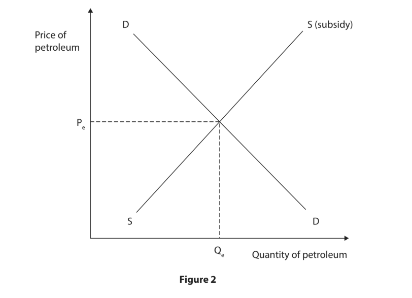
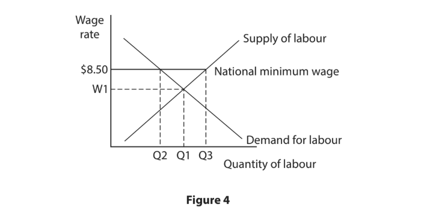
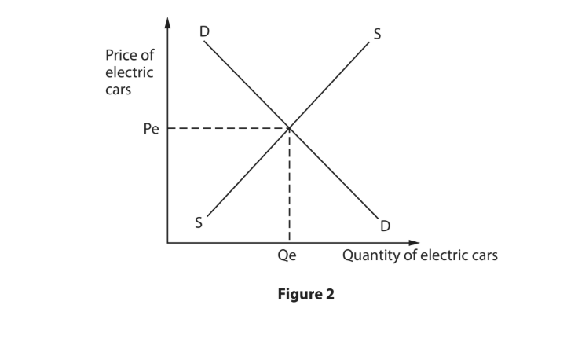
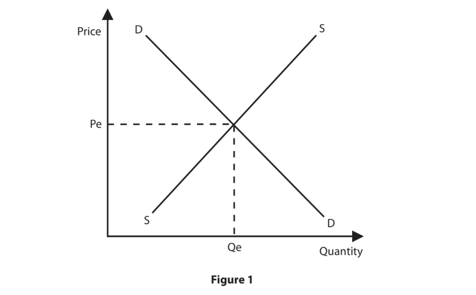
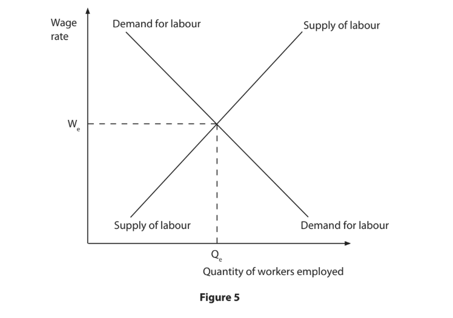
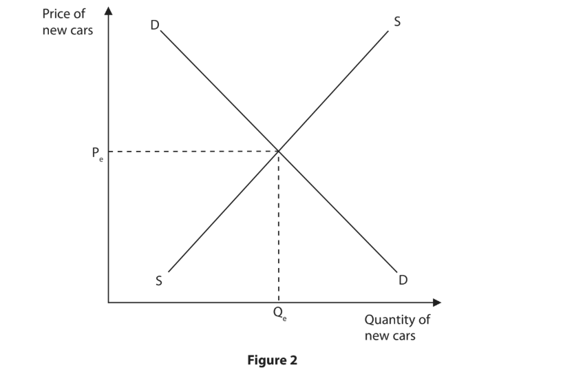
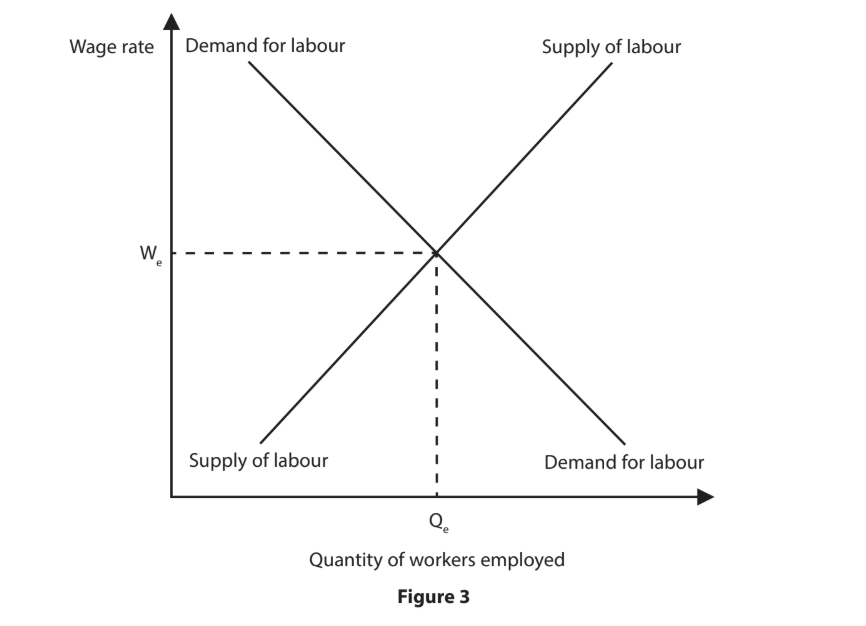
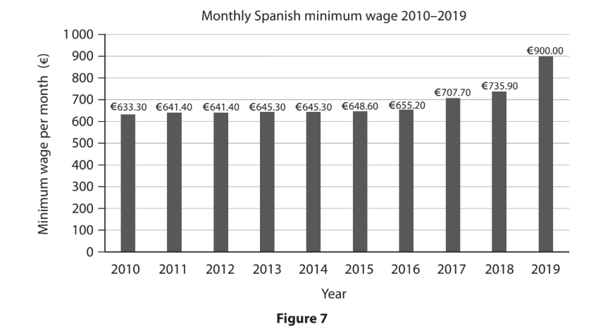

# Exam Questions — Government Intervention
**Business Economics** · Edexcel IGCSE Economics (4EC1)
> Source: [https://www.savemyexams.com/igcse/economics/edexcel/17/topic-questions/business-economics/government-intervention/exam-questions/](https://www.savemyexams.com/igcse/economics/edexcel/17/topic-questions/business-economics/government-intervention/exam-questions/) · 36 questions · total 144 marks

## Q1 — easy — 1 marks · exam-questions

### 1((b)) — 1 mark — multiple_choice — from paper June 2024 · Paper 1
A country has a minimum wage of €6.04 per hour. If a worker provides 35 hours of labour in a week, the lowest weekly wage the worker can earn is
- **A.** €6.04
- **B.** €205.36
- **C.** €211.40
- **D.** €422.80

## Q2 — easy — 1 marks · exam-questions

### 1((b)) — 1 mark — multiple_choice — from paper June 2024 · Paper 1R
As a result of government policy, a firm had a decrease in its total costs of \$200 each month. Which **one **of the following is the most likely type of government policy to produce this decrease in costs?
- **A.** Fine
- **B.** Regulation
- **C.** Increased subsidy
- **D.** Increased taxation

## Q3 — easy — 2 marks · exam-questions

### 2((d)) — 2 marks — command: what — structured — from paper June 2024 · Paper 2
What is meant by the term fines?

## Q4 — easy — 1 marks · exam-questions

### 1() — 1 mark — multiple_choice — from paper Nov 2024 · Paper 1
Which **one **of the following diagrams shows the likely effect on the market for cars after an increase in subsidies to car manufacturers?
- **A.** 
- **B.** 
- **C.** 
- **D.** 

## Q5 — easy — 2 marks · exam-questions

### 2((e)) — 2 marks — command: describe — structured — from paper Jan 2023 · Paper 1
Describe **one **disadvantage for a government of using subsidies.

## Q6 — easy — 1 marks · exam-questions

### 3((b)) — 1 mark — multiple_choice — from paper Jan 2023 · Paper 1R
Which of the foll**one **owing is a reason why a government would introduce a minimum wage?
- **A.** To increase the benefits paid by a government
- **B.** To reduce the motivation of workers
- **C.** To close the income gap between the rich and the poor
- **D.** To ensure producers increase their profits

## Q7 — easy — 11 marks · exam-questions

### 2((d)) — 2 marks — command: what — structured — from paper Jan 2023 · Paper 2R
What is meant by the term pollution permits?

### 2((g)) — 9 marks — command: assess — structured — from paper Jan 2023 · Paper 2R
In 2021, Thames Water was fined £2.3m after being found guilty of polluting a stream in 2016. The pollution killed more than 1,000 fish.

The total amount in fines paid by Thames Water since 2017 was £24.4m for 9 separate cases of water pollution. In 2020, Thames Water made an operating profit of £513.4m.

(Source: [https://www.gov.uk/government/news/thames-water-fined-23-million-for-](https://www.gov.uk/government/news/thames-water-fined-23-million-for-)foreseeable-pollution)

With reference to the data above and your knowledge of economics, assess the effectiveness of using fines to protect the environment in a country such as the UK.

## Q8 — easy — 1 marks · exam-questions

### 3((b)) — 1 mark — multiple_choice — from paper Nov 2023 · Paper 1
The introduction of a minimum wage above the equilibrium wage in a labour market is most likely to
- **A.** increase quantity of labour demanded and decrease the wage rate
- **B.** increase quantity of labour demanded and increase the wage rate
- **C.** decrease quantity of labour demanded and decrease the wage rate
- **D.** decrease quantity of labour demanded and increase the wage rate

## Q9 — easy — 1 marks · exam-questions

### 2((e)) — 1 mark — command: define — structured — from paper June 2022 · Paper 1
Define the term takeover.

## Q10 — easy — 1 marks · exam-questions

### 2((e)) — 1 mark — command: define — structured — from paper June 2022 · Paper 1R
Define the term minimum wage.

## Q11 — easy — 1 marks · exam-questions

### 3((a)) — 1 mark — multiple_choice — from paper June 2022 · Paper 1R
A pollution permit is a type of
- **A.** factor of production
- **B.** government intervention
- **C.** economy of scale
- **D.** economic assumption

## Q12 — easy — 2 marks · exam-questions

### 2((c)) — 1 mark — command: state — structured — from paper June 2021 · Paper 1
State **one **reason why governments intervene in the economy.

### 2((e)) — 1 mark — command: define — structured — from paper June 2021 · Paper 1
Governments can use fines to deal with externalities.

Define the term fine.

## Q13 — easy — 2 marks · exam-questions

### 4((a)) — 2 marks — command: calculate — structured — from paper Jan 2020 · Paper 1R
In January 2018, the minimum wage in Andorra increased to €5.87 per hour.

Calculate the** monthly gross income** of a worker in Andorra, employed for 175 hours per month and paid at the minimum wage. You are advised to show your working.

## Q14 — easy — 1 marks · exam-questions

### 2((a)) — 1 mark — multiple_choice — from paper Jan 2020 · Paper 2R
In 2018, the European Union (EU) trade bloc started to reduce agricultural subsidies to farmers within the EU.

Which **one **of the following diagrams shows the market for agricultural products following the removal of the subsidy?
- **A.** 
- **B.** 
- **C.** 
- **D.** 

## Q15 — easy — 2 marks · exam-questions

### 2((e)) — 2 marks — command: describe — structured — from paper Nov  2020 · Paper 1R
Describe **one **government policy to deal with negative externalities.

## Q16 — medium — 3 marks · exam-questions

### 1((f)) — 3 marks — command: draw — structured — from paper June 2024 · Paper 2R
In March 2023, the Government of Ghana announced it was removing fuel subsidies on petroleum.

Using the diagram below, draw the effects of the removal of the fuel subsidy on the equilibrium price and quantity of petroleum in Ghana. Label the new curve, the new equilibrium price and the new equilibrium quantity.

## Q17 — medium — 3 marks · exam-questions

### 2((f)) — 3 marks — command: explain — structured — from paper Nov 2024 · Paper 1
In 2023, the Italian Government introduced legislation to increase the number of taxis available to the public.

Explain **one **reason why the Italian Government may have introduced legislation that makes it easier for new taxi firms to enter the market.

## Q18 — medium — 6 marks · exam-questions

### 3((d)) — 6 marks — command: analyse — structured — from paper Nov 2024 · Paper 1

In 2021, the national minimum wage in Barbados was increased from \$6.25 per hour to \$8.50 per hour.

With reference to the data above and your knowledge of economics, analyse the likely impact of an increase in the national minimum wage on the supply of labour in Barbados.

## Q19 — medium — 3 marks · exam-questions

### 1((g)) — 3 marks — command: explain — structured — from paper Nov 2024 · Paper 2
In Singapore, the government fined a construction company \$1m for breaking safety laws that led to the death of a worker. The company had failed to provide adequate safety equipment and training for its workers.

Explain **one **reason why governments use fines.

## Q20 — medium — 3 marks · exam-questions

### 1((g)) — 3 marks — command: draw — structured — from paper Nov 2023 · Paper 1
Figure 2 shows the market for electric cars.

Using the diagram below, draw the likely effects on the market for electric cars following the introduction of a subsidy on electric cars. Label the new curve, the new equilibrium price and the new equilibrium quantity.

## Q21 — medium — 3 marks · exam-questions

### 1((f)) — 3 marks — command: draw — structured — from paper June 2022 · Paper 2R
In 2020, the UK Government introduced subsidies for firms that provide renewable energy.

Using the diagram below, draw the effects of the introduction of a subsidy on the equilibrium price and quantity of renewable energy. Label the new curve, the new equilibrium price and new equilibrium quantity.

## Q22 — medium — 6 marks · exam-questions

### 4((b)) — 6 marks — command: analyse — structured — from paper Jan 2020 · Paper 1
**German broadband group urges the Vodafone-Liberty deal to be stopped**

A business group representing German broadband providers asked regulators to stop the takeover by Vodafone of Liberty Global’s German operations, saying the new firm would be too dominant. In 2018, Vodafone agreed to pay \$21.8bn for Liberty Global. Arguments against the takeover included that it would delay the work on building a nationwide fibre-optic network and damage competition in the cable TV market.

(Source adapted from: [https://uk.reuters.com/article/uk-liberty-global-m-a-vodafone/german-broadband-](https://uk.reuters.com/article/uk-liberty-global-m-a-vodafone/german-broadband-)group-urges-eu-to-block-vodafone-liberty-deal-idUKKCN1NC0Z2)

With reference to the data above and your knowledge of economics, analyse why governments may want to control takeovers.

## Q23 — medium — 3 marks · exam-questions

### 2((e)) — 3 marks — command: explain — structured — from paper Jan 2020 · Paper 2
In Manchester, UK, over 350,000 motorists have been issued with parking fines of £30. This gave the local government of Manchester additional revenue of £10.4m in one year.

Explain **one **advantage for a local government, such as Manchester, of issuing parking fines.

## Q24 — medium — 3 marks · exam-questions

### 2((g)) — 3 marks — command: explain — structured — from paper Nov 2020 · Paper 1
In the UK, the speed limit for drivers in urban areas is 30 miles per hour (48 kilometres per hour).

Explain **one **reason why the UK Government may use fines to reduce the negative externalities caused by drivers speeding in urban areas.

## Q25 — medium — 6 marks · exam-questions

### 3((d)) — 6 marks — command: analyse — structured — from paper Nov 2020 · Paper 1
Each year the Turkish Government raises the national monthly minimum wage. It increased from 2 020 Turkish Lira (TRY) in 2018 to 2 558 Turkish Lira (TRY) in 2019.

With reference to the data above and your knowledge of economics, analyse why the Turkish Government might want to increase the minimum wage every year.

## Q26 — medium — 6 marks · exam-questions

### 3((d)) — 6 marks — command: analyse — structured — from paper Nov 2020 · Paper 1R
An investigation has taken place in the US to determine whether a number of pharmaceutical firms used collusion to divide sales between themselves so each firm received higher profits. One example of the price fixing meant a tablet sold for \$4.70 when the price should have been \$0.13. The firms have rejected the accusations,  saying there is a lack of evidence to prove anti-competitive behaviour.

(Source adapted from: [https://www.washingtonpost.com/business/economy/investigation-of-](https://www.washingtonpost.com/business/economy/investigation-of-)generic-cartel-expands-to-300-drugs/2018/12/09/fb900e80-f708-11e8-863c-9e2f864d47e7_story.html?noredirect=on&utm_term=.3c2a12983985)

With reference to the data above and your knowledge of economics, analyse the possible disadvantages faced by consumers from collusion between firms.

## Q27 — medium — 3 marks · exam-questions

### 3((c)) — 3 marks — command: draw — structured — from paper June 2019 · Paper 1
Using the diagram below, draw the effects of a minimum wage (W1) being set above the equilibrium wage (We). Label the new quantity of labour demanded and the new quantity of labour supplied.

## Q28 — medium — 6 marks · exam-questions

### 4((b)) — 6 marks — command: analyse — structured — from paper June 2019 · Paper 1
**Competition and Markets Authority warns online sellers about collusion**

The Competition and Markets Authority (CMA) is a UK government department that aims to increase competition. It has reminded online sellers of electrical equipment that collusion is illegal and can result in serious penalties. The CMA stated that buying electrical equipment online, such as laptops and games consoles, means consumers can search a wide range of deals from many different sellers. However, it also stated that collusion is a threat.

(Source: adapted from © Crown Copyright)

With reference to the data above and your knowledge of economics, analyse why collusion may be a disadvantage for online consumers buying electrical equipment.

## Q29 — medium — 3 marks · exam-questions

### 1((f)) — 3 marks — command: draw — structured — from paper June 2021 · Paper 2
In 2019, Hungary introduced a subsidy on new cars for families with three or more children.

Using the diagram below, draw the likely effects of the introduction of a subsidy on the equilibrium price and quantity of new cars for families with three or more children. Label the new curve, the new equilibrium price and the new equilibrium quantity.

## Q30 — medium — 3 marks · exam-questions

### 1((h)) — 3 marks — command: explain — structured — from paper Nov 2021 · Paper 1
The New Zealand Government is to introduce new legislation to limit the interest rate firms can charge on loans made to customers. The maximum interest rate firms can charge will

Explain **one** reason why the New Zealand Government may be introducing this legislation.

## Q31 — medium — 3 marks · exam-questions

### 3((c)) — 3 marks — command: draw — structured — from paper Nov 2021 · Paper 1
Using the diagram below, draw the effects of a minimum wage (W1 ) that has been set above the equilibrium wage (We ). Label the new quantity of labour demanded and the new quantity of labour supplied.

## Q32 — hard — 9 marks · exam-questions

### 2((g)) — 9 marks — command: assess — structured — from paper June 2024 · Paper 1R
In January 2023, the minimum wage in the Netherlands was increased by 10.15% to €1934.40 per month. The decision was partly due to inflation increasing to 17% during 2022.

However, the decision has been criticised because the economy is still weak following the global health crisis.

With reference to the data above and your knowledge of economics, assess the likely benefits of increasing the minimum wage for employees and firms in the Netherlands.

## Q33 — hard — 9 marks · exam-questions

### 3((e)) — 9 marks — command: assess — structured — from paper June 2022 · Paper 2
More than 125 million tonnes of poisonous gases pollute the US state of Colorado’s air every year. US Government records show that 46 million tonnes, or 36% of the total air pollution, comes from 119 large industrial polluters. These include 35 power stations. More than half the electricity in Colorado is still generated from burning coal despite 10 years of government efforts to encourage producers to switch to clean energy.

With reference to the data above and your knowledge of economics, assess the  effectiveness of pollution permits in protecting the environment for a country such as the US.

## Q34 — hard — 12 marks · exam-questions

### 4((c)) — 12 marks — command: evaluate — structured — from paper June 2019 · Paper 1
**Monthly Spanish minimum wage increases**

In 2019, the monthly minimum wage in Spain increased by the largest percentage in over 40 years. It rose by around 22% compared to only a 4% rise the previous year. It was part of an annual review with a focus on ‘making Spain great again’. The Spanish Prime Minister said that, ‘A rich country should not have poor workers’.

With reference to the data above and your knowledge of economics, evaluate whether an increase in the minimum wage would benefit an economy such as Spain.

## Q35 — hard — 9 marks · exam-questions

### 3((e)) — 9 marks — command: assess — structured — from paper Jan 2020 · Paper 2R
In Western Australia, single-use plastic bags were banned in July 2018 but fines were not enforced. However, from 2019, under new regulations, any shops providing customers with the banned plastic bags may face prosecution, with fines of up to AUS\$5 000. The government is relying on shoppers to report retailers that break the rules.

The Environment Minister Stephen Dawson said the ban is well supported by the community. He said “Taking plastic bags out of litter is a significant step towards protecting our environment”.

With reference to the data above and your knowledge of economics, assess the likely effectiveness of regulation to protect the environment in a country such as Australia.

## Q36 — hard — 12 marks · exam-questions

### 4((c)) — 12 marks — command: evaluate — structured — from paper Nov 2020 · Paper 2
In 2019, the Estonian Government increased the subsidy for public transport by €9m to €101m. The subsidy for bus services grew from €34.8m to €43.3m in 2019.

Minister of Economic Affairs and Infrastructure Kadri Simson said, “Greater support for public transport services will ensure better mobility as well as reduce cars on the road and reduce pollution of the environment. The subsidies also make movement easier for less well-off residents. Due to subsidised bus services, the number of passengers grew by 33% in one month.”

The minister described local air services as one of the priorities for the Estonian Government in regional development. Air services to the major Western Estonian islands of Saaremaa and Hiiumaa have been given €5.53m, more than double the €2.6m subsidy they received last year.

(Source adapted from: [https://news.err.ee/863306/](https://news.err.ee/863306/)public-transport-subsidy-to-increase-to-101-million-next-year)

With reference to the data above and your knowledge of economics, evaluate the advantages of using subsidies for public transport to protect the environment for a country such as Estonia.
