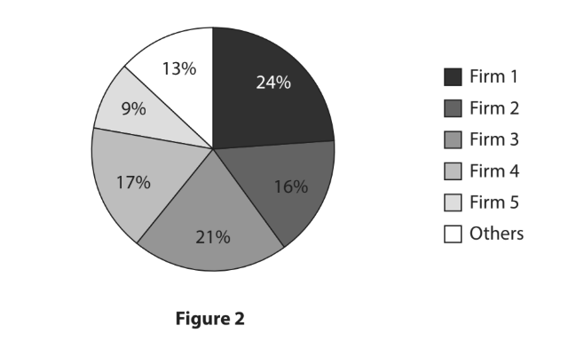
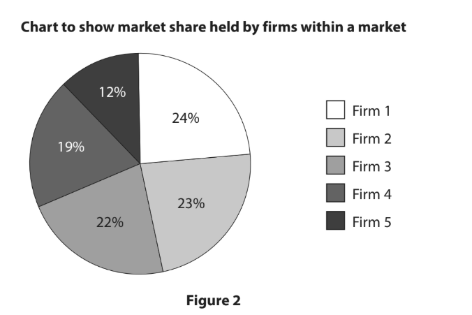
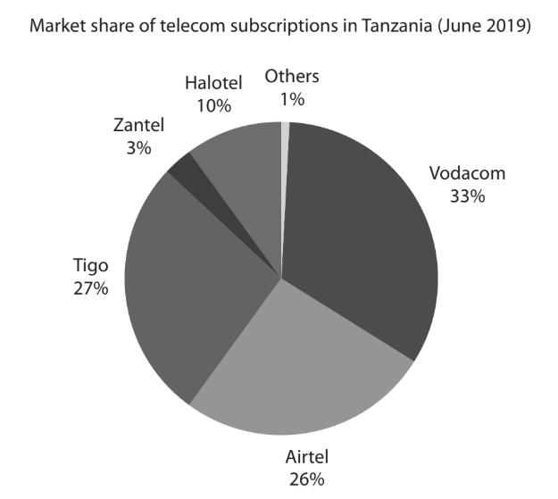
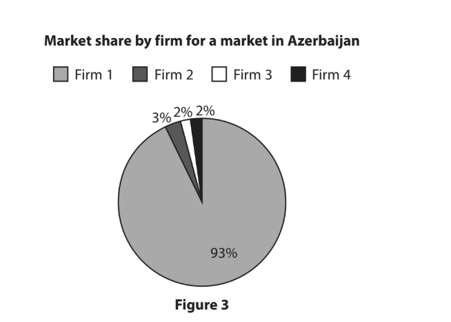
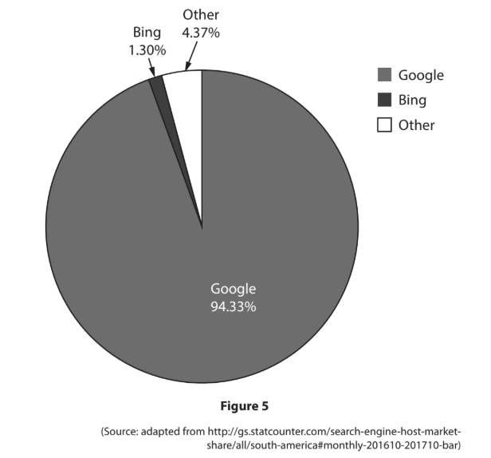
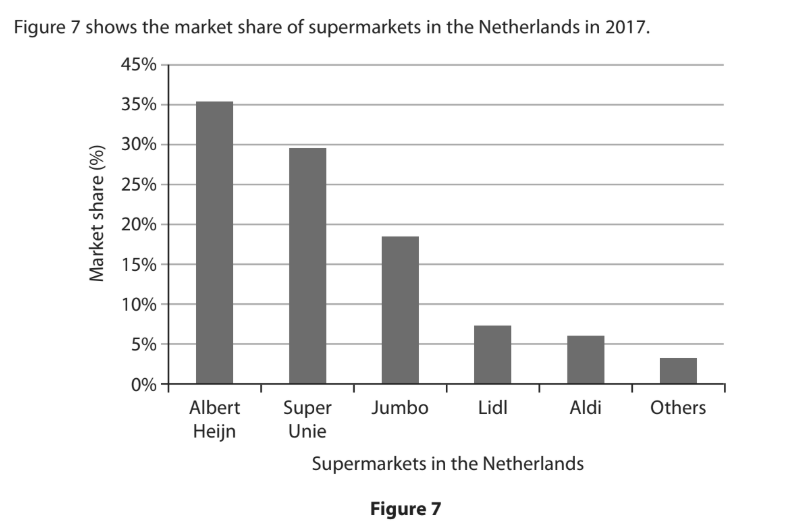

# Exam Questions — Market Structures
**Business Economics** · Edexcel IGCSE Economics (4EC1)
> Source: [https://www.savemyexams.com/igcse/economics/edexcel/17/topic-questions/business-economics/market-structures/exam-questions/](https://www.savemyexams.com/igcse/economics/edexcel/17/topic-questions/business-economics/market-structures/exam-questions/) · 32 questions · total 174 marks

## Q1 — easy — 3 marks · exam-questions

### 2((b)) — 1 mark — multiple_choice — from paper June 2024 · Paper 1
Which** one **of the following is a feature of a monopoly?
- **A.** Consumers have a choice of firms
- **B.** There are many firms competing in the market
- **C.** The firm is a price‐maker
- **D.** There are low barriers to entry

### 2((e)) — 2 marks — command: describe — structured — from paper June 2024 · Paper 1
Describe **one** feature of an oligopoly.

## Q2 — easy — 6 marks · exam-questions

### 2((b)) — 1 mark — multiple_choice — from paper June 2024 · Paper 1R
Which **one** of the following is a feature of an oligopoly?
- **A.** There is only one firm in the market
- **B.** Firms always act independently
- **C.** Different products are sold
- **D.** No barriers to entry are present

### 2((e)) — 2 marks — command: describe — structured — from paper June 2024 · Paper 1R
Describe **one** reason why innovation may be more likely to occur in a monopoly.

### 2((f)) — 3 marks — command: explain — structured — from paper June 2024 · Paper 1R
Sajad owns a shop selling smartphones in Karachi, Pakistan. The shop has been successful for several years and there is an opportunity for Sajad to open an additional shop on the other side of the city.

Explain **one** reason why Sajad may decide to expand his business.

## Q3 — easy — 1 marks · exam-questions

### 1((e)) — 1 mark — command: define — structured — from paper Nov 2024 · Paper 1
Define the term takeover.

## Q4 — easy — 3 marks · exam-questions

### 2((a)) — 1 mark — multiple_choice — from paper Nov 2024 · Paper 1
Market share by sales of rms in a market in Kuwait

Which **one** of the following options is the most suitable term for the type of market shown in Figure 2?
- **A.** Monopoly
- **B.** Oligopoly
- **C.** Public sector
- **D.** Labour

### 2((e)) — 2 marks — command: describe — structured — from paper Nov 2024 · Paper 1
Describe **one** feature of a monopoly.

## Q5 — easy — 6 marks · exam-questions

### 2((a)) — 1 mark — multiple_choice — from paper Jan 2023 · Paper 1

Which **one** of the following options is the type of market shown in Figure 2?
- **A.** Labour
- **B.** Public
- **C.** Monopoly
- **D.** Oligopoly

### 2((c)) — 2 marks — command: what — structured — from paper Jan 2023 · Paper 1
What is meant by the term barriers to entry?

### 2((f)) — 3 marks — command: explain — structured — from paper Jan 2023 · Paper 1
Heather runs a successful restaurant in a small town in Portugal. When her friend asked whether she was going to expand by opening another restaurant, Heather said she was not.

Explain **one** reason why Heather may have decided to keep her business small.

## Q6 — easy — 1 marks · exam-questions

### 1((e)) — 1 mark — command: define — structured — from paper Jan 2023 · Paper 1R
Define the term unique product.

## Q7 — easy — 5 marks · exam-questions

### 2((e)) — 2 marks — command: describe — structured — from paper Jan 2023 · Paper 1R
Describe** one** way that high start-up costs can be a barrier to entry.

### 2((f)) — 3 marks — command: explain — structured — from paper Jan 2023 · Paper 1R
UK supermarkets operate in an oligopoly where the market is dominated by several large firms.

Explain **one** disadvantage of this type of market structure for UK consumers.

## Q8 — easy — 1 marks · exam-questions

### 3((a)) — 1 mark — multiple_choice — from paper Jan 2023 · Paper 1R
Which** one **of the following is the definition of a merger?
- **A.** The joining together of two firms
- **B.** The transfer of ownership from the government
- **C.** The takeover of one firm by another firm
- **D.** The creation of a competitive market

## Q9 — easy — 1 marks · exam-questions

### 1((d)) — 1 mark — command: state — structured — from paper Nov 2023 · Paper 1
State **one** main feature of an oligopoly.

## Q10 — easy — 1 marks · exam-questions

### 3((a)) — 1 mark — multiple_choice — from paper Nov 2023 · Paper 1
Which **one **of the following is a reason why a firm may decide to stay small?
- **A.** To increase bureaucracy
- **B.** To sell a niche product
- **C.** To spread business risk
- **D.** To take over competitors

## Q11 — easy — 1 marks · exam-questions

### 1((e)) — 1 mark — command: define — structured — from paper June 2022 · Paper 1
Define the term niche market.

## Q12 — easy — 1 marks · exam-questions

### 2((c)) — 1 mark — command: state — structured — from paper June 2022 · Paper 1
State **one** disadvantage to firms of increased competition.

## Q13 — easy — 10 marks · exam-questions

### 2((b)) — 1 mark — multiple_choice — from paper June 2022 · Paper 1R
A small firm manufactures jewellery to the exact requirements of its customers.

This is an example of which **one** of the following markets?
- **A.** Monopoly
- **B.** Labour
- **C.** Niche
- **D.** Financial

### 2((h)) — 9 marks — command: assess — structured — from paper June 2022 · Paper 1R

**Figure 4**

(Source adapted from: [https://www.tanzaniainvest.com/telecoms/tanzania-add-50000-](https://www.tanzaniainvest.com/telecoms/tanzania-add-50000-)mobile-subcriptions-in-6-months)

In November 2019, two Tanzanian telecoms firms, Zantel and Tigo, merged. Smart Telecoms, a small firm with a declining market share, stopped trading. A spokesperson said that Smart Telecoms could no longer compete with the increasing dominance of larger firms in the market.

With reference to the data above and your knowledge of economics, assess whether the oligopoly in the Tanzanian telecoms market is likely to benefit consumers.

## Q14 — easy — 7 marks · exam-questions

### 1((e)) — 1 mark — command: define — structured — from paper June 2021 · Paper 1
Define the term monopoly.

### 1((i)) — 6 marks — command: analyse — structured — from paper June 2021 · Paper 1
Bupa is an international firm that provides healthcare products to 32 million customers in 190 countries. The initial purpose of the firm was to provide health insurance. It has grown by offering a wider range of services. These include retirement homes for the elderly, eye care, hospital treatment, dental work and travel insurance.

With reference to the data above and your knowledge of economics, analyse why Bupa may have decided to operate in a wider range of markets.

## Q15 — easy — 5 marks · exam-questions

### 2((c)) — 1 mark — command: state — structured — from paper Nov 2021 · Paper 1
State **one **reason why firms stay small.

### 2((e)) — 1 mark — command: define — structured — from paper Nov 2021 · Paper 1
Define the term price-maker.

### 2((g)) — 3 marks — command: explain — structured — from paper Nov 2021 · Paper 1
Abi owns a small cafe. It is often very busy and customers may have to wait for a table. Abi is considering whether to move to a larger premises. A larger property has become available but it would cost almost double the current rent.

Explain **one** factor that could affect whether Abi is able to expand her business.

## Q16 — easy — 11 marks · exam-questions

### 2((f)) — 2 marks — command: describe — structured — from paper Jan 2020 · Paper 1
The Irish Artisan Charcoal Company (IACC) is the only firm producing charcoal in Ireland. Damaged trees which would otherwise have been left to rot are used to produce top quality charcoal.

(Source adapted from: [https://www.limerickleader.ie/video/home/348948/watch-irish-artisan-charcoal-](https://www.limerickleader.ie/video/home/348948/watch-irish-artisan-charcoal-)company-in-limerick-blazing-a-trail-with-unique-product.html)

Describe the type of market structure in which the Irish Artisan Charcoal Company operates.

### 2((h)) — 9 marks — command: assess — structured — from paper Jan 2020 · Paper 1
Wonderful Wax is a small, UK-based firm that produces candles. The candles are environmentally friendly because they are handmade with soy wax and pure essential oils. This is instead of harmful paraffin wax which produces toxins when burned.Elissa Newham set up the business because she wanted to help the environment. She was surprised when a larger firm made contact, offering its facilities to increase production if Elissa was prepared to share the profits.

With reference to the data above and your knowledge of economics, assess whether Wonderful Wax would have more benefits from remaining a small firm rather than becoming a large firm.

## Q17 — easy — 1 marks · exam-questions

### 3((b)) — 1 mark — multiple_choice — from paper Jan 2020 · Paper 1
Which **one** of the following is a main feature of an oligopoly?
- **A.** Rising fixed costs
- **B.** No barriers to entry
- **C.** Large firms dominate the market
- **D.** Specialises in the public sector

## Q18 — easy — 1 marks · exam-questions

### 2((a)) — 1 mark — multiple_choice — from paper Nov 2020 · Paper 1

Which** one** of the following options is the most suitable term for the type of market shown in Figure 3?
- **A.** Cartel
- **B.** Oligopoly
- **C.** Monopoly
- **D.** Competitive

## Q19 — easy — 1 marks · exam-questions

### 3((a)) — 1 mark — multiple_choice — from paper Nov 2020 · Paper 1R
Which **one** of the following can be described as an advantage to a small firm?
- **A.** Access to many sources of finance
- **B.** Flexibility
- **C.** Market domination
- **D.** Risk spreading

## Q20 — easy — 2 marks · exam-questions

### 2((f)) — 2 marks — command: describe — structured — from paper June 2019 · Paper 1
**Beating the congestion in Dhaka**

Nearly 17 million people live in Dhaka, the capital of Bangladesh. The majority of people live in the city centre and traffic congestion is a problem. However, there are many auto rickshaws (a small, three-wheeled vehicle, driven by a motorcycle engine) competing in the city centre to take passengers to their destinations. Fares tend to be cheaper in the city centre than they are outside the city centre and are usually agreed between passengers and drivers.

Dhaka has a large number of auto rickshaws competing for fares.

Apart from price, describe **one** advantage for passengers of this competition.

## Q21 — easy — 10 marks · exam-questions

### 1((a)) — 1 mark — multiple_choice — from paper June 2019 · Paper 1R
Which o**ne** of the following is a feature of an oligopoly?
- **A.** Large firms dominate
- **B.** Unique product
- **C.** One firm dominates
- **D.** No barriers to entry

### 1((h)) — 3 marks — command: explain — structured — from paper June 2019 · Paper 1R
Robert is the only business specialising in handmade door signs in the local area.

Explain** one **disadvantage for customers of Robert being the only local firm specialising in handmade door signs.

### 1((i)) — 6 marks — command: analyse — structured — from paper June 2019 · Paper 1R
Despite his success, Robert has decided to keep his business small and not expand.

With reference to the data in **‘Small but successful’ **and your knowledge of economics, analyse why Robert might have decided not to expand his business.

## Q22 — medium — 6 marks · exam-questions

### 1((i)) — 6 marks — command: analyse — structured — from paper June 2024 · Paper 1
Anastasia runs a martial arts club in District 16 of Budapest, Hungary. She offers classes to children and to adults. There are six classes a week. Following a successful few years, Anastasia is considering growing the business by opening a second club in another district of Budapest.

With reference to the data above and your knowledge of economics, analyse **two** possible factors influencing Anastasia’s decision to open a second club.

## Q23 — medium — 3 marks · exam-questions

### 2((g)) — 3 marks — command: explain — structured — from paper June 2021 · Paper 1
Microsoft has a patent on a number of its technological designs.

Explain **one** reason why Microsoft might have patents on its designs.

## Q24 — medium — 6 marks · exam-questions

### 4((b)) — 6 marks — command: analyse — structured — from paper Nov 2021 · Paper 1
Trekking is a very popular activity for tourists in Nepal. In the main tourist town of Pokhara, there are a few large firms that offer guides, porters and resources. Some smaller firms specialise in taking customers on less popular routes, whereas others offer guides who speak different languages. It is difficult for new competitors to set up in Pokhara, as expensive permits are required.

With reference to the data above and your knowledge of economics, analyse why the market for trekking in Pokhara could be described as an oligopoly.

## Q25 — medium — 6 marks · exam-questions

### 1((i)) — 6 marks — command: analyse — structured — from paper Jan 2020 · Paper 1R
In the UAE, 87% of Dubai’s shopping malls are owned by just five firms. The retail sector is predicted to reach \$71bn in sales by 2021 and employ 25% of Dubai’s workforce. Each shopping mall offers something different to customers, for example an indoor ski slope or an indoor aquarium. Dubai’s retailers benefit from its tourism sector, as the city ranks as one of the busiest shopping destinations in the world.

(Source adapted from: [https://wwd.com/business-news/technology/savant-data-systems-](https://wwd.com/business-news/technology/savant-data-systems-)dubai-retail-report-10956883/)

With reference to the data above and your knowledge of economics, analyse why the shopping malls in Dubai are considered to be an oligopoly.

## Q26 — medium — 6 marks · exam-questions

### 1((i)) — 6 marks — command: analyse — structured — from paper June 2019 · Paper 1
Introduced in 1935, Inca Kola is a yellow-gold coloured, fizzy, soft drink that is popular all over Peru. By 1995, Inca Kola had grown to become a strong  competitor of Coca-Cola. Inca Kola had a 32.9% market share compared to Coca-Cola’s 32.0% in Peru. By 2014, Coca-Cola owned 48.5% of Inca Kola shares.

(Source: adapted from Peru’s ‘improbable’ Inca Kola wins out over Coke by Andres Schipani © Financial Times September 2014)

With reference to the data above and your knowledge of economics, analyse the possible reasons for Coca-Cola purchasing shares in Inca Kola.

## Q27 — medium — 18 marks · exam-questions

### 4((b)) — 6 marks — command: analyse — structured — from paper June 2019 · Paper 1R
NBC Universal pays \$7.75bn for Olympics through to 2032 The International Olympic Committee (IOC) announced it had agreed a \$7.75bn deal with the USA television network, NBC Universal. This will extend its broadcasting rights to the Olympic Games up until 2032. The deal gives NBC Universal total control over all media platforms in the USA, including television, internet and mobile. A spokesman for NBC Universal said they were confident they would get back the high cost through advertising.

(Source: adapted from [https://eu.usatoday.com/story/sports/olympics/2014/05/07/](https://eu.usatoday.com/story/sports/olympics/2014/05/07/)nbc-olympics-broadcast-rights-2032/8805989/

With reference to the data above and your knowledge of economics, analyse the benefits to NBC Universal of agreeing this deal with the IOC.

### 4((c)) — 12 marks — command: evaluate — structured — from paper June 2019 · Paper 1R
Figure 5 shows the market share in South America of search engine providers, between October 2016 and October 2017.

With reference to the data above and your knowledge of economics, evaluate the extent to which firms can benefit from advertising on Google.

## Q28 — medium — 3 marks · exam-questions

### 1((h)) — 3 marks — command: explain — structured — from paper Nov 2020 · Paper 1R
Virgin Atlantic took over a part of budget airline Flybe in the spring of 2019 to form Connect Airways.

Explain** one** possible advantage for customers of Connect Airways from the takeover.

## Q29 — hard — 12 marks · exam-questions

### 4((c)) — 12 marks — command: evaluate — structured — from paper Jan 2023 · Paper 1
Dahab is a seaside town in Egypt. It is a popular destination for visitors from around the world as well as other parts of Egypt. Some visitors return many times in order to enjoy the relaxing atmosphere, beach-side restaurants and water sports.

There are a large number of restaurants competing for customers. Some specialise in certain types of food. Others offer discounts for regular visits or provide live entertainment.

With reference to the data above and your knowledge of economics, evaluate the likely impact of competition on restaurant customers in Dahab.

## Q30 — hard — 12 marks · exam-questions

### 4((c)) — 12 marks — command: evaluate — structured — from paper Jan 2023 · Paper 1R
NT Massage is a small but successful, family-run business in a residential part of Hong Kong. It offers traditional foot and head massages to local residents, many of whom have been customers for many years.

A younger member of the family, Mei, would like to expand the business. She wants to open a chain of shops offering foot and head massages in busier areas of Hong Kong. She would like her new employees to be fully trained, to advertise in hotels and to focus more attention on attracting custom from the 7.5 million population of Hong Kong.

Even though there would be competition from many other similar businesses, additional custom from tourists and business people would enable NT Massage to charge higher prices in the new shops.

With reference to the data above and your knowledge of economics, evaluate whether the family should expand the business rather than keeping it small.

## Q31 — hard — 12 marks · exam-questions

### 4((c)) — 12 marks — command: evaluate — structured — from paper June 2022 · Paper 1
The English city of Kingston upon Hull has an independent telecoms network known as Kingston Communications (KCOM). It is the only provider serving the city and its surrounding towns and villages. People living there do not have many broadband options. The network remained independent when most others joined together to become British Telecom (BT) and it has remained as a separate company to this day.

As well as broadband, KCOM also offers home phone and mobile deals which are available at a discounted price when purchased together. It will soon offer high-quality television packages. Its broadband is fast, with fibre optic packages which can reach impressive speeds of up to 250Mb. However, these are not available everywhere in the region and KCOM’s packages are more expensive than those in the rest of the country. This is especially true as they have low download limits.

(Source adapted from: [https://www.broadbandchoices.co.uk/guides/broadband/hull-](https://www.broadbandchoices.co.uk/guides/broadband/hull-)broadband)

With reference to the data above and your knowledge of economics, evaluate whether a monopoly such as KCOM is always bad for the consumer.

## Q32 — hard — 12 marks · exam-questions

### 4((c)) — 12 marks — command: evaluate — structured — from paper June 2019 · Paper 1

With reference to the data above and your knowledge of economics, evaluate how firms might be influenced by competing in an oligopoly, such as supermarkets in the Netherlands.
