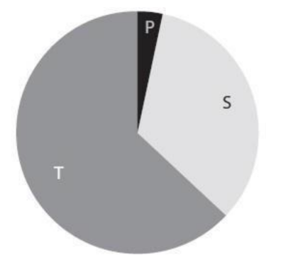
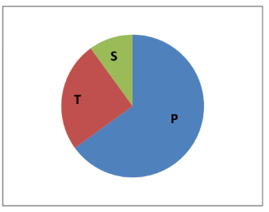
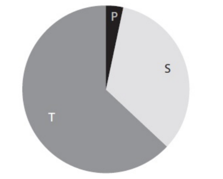

# Mark Schemes — Production & Productivity
**Business Economics** · Edexcel IGCSE Economics (4EC1)

## Q1 — easy — 1 marks · exam-questions

### 3((a)) — 1 marks
**Correct answer: A** — Farmer

**Final answer:** **The correct answer is A**

Primary sector work extracts natural resources from the earth or grows them, and farming does exactly that by producing crops and livestock from the land

**B** is incorrect as a mechanic works on vehicles that have already been made, which places the job in the secondary sector rather than the primary sector

**C** is incorrect as a shop assistant sells finished goods to consumers, which is a service and therefore tertiary sector work

**D** is incorrect as a teacher provides a service, which places the job in the tertiary sector

## Q2 — easy — 1 marks · exam-questions

### 1((a)) — 1 marks
**Correct answer: B** — A secondary sector firm

**Final answer:** **The correct answer is B**

Secondary sector firms turn raw materials into finished goods, which is what a car manufacturer does when it assembles steel, glass and components into a vehicle

**A** is incorrect as primary sector firms extract natural resources, through activities such as farming, fishing or mining

**C** is incorrect as tertiary sector firms provide services rather than making physical goods

**D** is incorrect as the service sector is another name for the tertiary sector, so this option says the same thing as option C and cannot describe a car manufacturer either

## Q3 — easy — 4 marks · exam-questions

### 1((b)) — 1 marks
**Correct answer: B** — 50 units

**Final answer:** **The correct answer is B**

Labour productivity is output per worker, so divide the total output by the number of workers: 27,000 ÷ 540 = 50 units per worker each month

**A** is incorrect as 0.02 is 540 ÷ 27,000, which divides the workers by the output instead of the other way round

**C** is incorrect as 27,540 is 540 + 27,000, and adding the two figures does not measure output per worker

**D** is incorrect as 14,580,000 is 540 × 27,000, which multiplies instead of divides

### 1((c)) — 2 marks
The division of labour is when a firm breaks up the production process** [1]** so that each employee performs only one task** [1]**

**[2 marks]**

> **[mark-scheme]**
> Award 1 mark for reference to breaking up the production process and 1 mark for reference to employees being allocated only one task
> 
> No marks are available for an example in place of a definition
> 
> Accept any other appropriate response

> **[exam-tip]**
> - 'What is meant by' questions carry two marks and need two parts to the definition. Examiner reports state plainly that no marks are awarded for examples
> - The two parts here are the splitting up of production and the specialisation of each worker on one task. Giving only one of them caps you at one mark

### 1((d)) — 1 marks
**Labour****[1 mark]**

> **[mark-scheme]**
> **One mark** for one correct factor. Any one from:
> 
> - Land
> - Labour
> - Capital
> - Enterprise

> **[exam-tip]**
> - There is only one mark available for 'state' questions and examiners do not expect you to write a lot, so name the factor and stop
> - Only one factor is required, and stating two will not earn additional marks

## Q4 — easy — 1 marks · exam-questions

### 1((a)) — 1 marks
**Correct answer: A** — Land

**Final answer:** **The correct answer is A**

In economics land means all natural resources, not just ground. Water, minerals, forests and fish stocks are all classed as land because they occur naturally rather than being made by people

**B** is incorrect as labour is the human effort, physical and mental, that goes into production

**C** is incorrect as capital is a man-made resource used to produce other goods, such as machinery, tools or factory buildings

**D** is incorrect as enterprise is the risk-taking and organising of the other three factors carried out by an entrepreneur

## Q5 — easy — 3 marks · exam-questions

### 2((a)) — 1 marks
**Correct answer: C** — 250 units

**Final answer:** **The correct answer is C**

Labour productivity is output per worker, so divide the total output by the number of workers: 33,750 ÷ 135 = 250 units per worker each month

**A** is incorrect as the number is right but the unit is wrong. Labour productivity measures units of output per worker, not an amount of money

**B** is incorrect as it multiplies the two figures instead of dividing them, and gives the answer as currency rather than units

**D** is incorrect as 4,556,250 is 135 × 33,750, which multiplies instead of divides

### 2((e)) — 2 marks
An entrepreneur takes the risk of setting up and running a business** [1]**, and it is that risk-taking that economists classify as the factor of production called enterprise** [1]**

**[2 marks]**

> **[mark-scheme]**
> Award 1 mark for reference to the reason and 1 mark for development of the reason
> 
> Accept any other appropriate response, e.g. an entrepreneur manages and combines the other factors of production in order to make goods or services

> **[exam-tip]**
> - Give one reason and then develop it. Examiner reports state that only one mark is available for the reason on a 'describe' question and the second is for developing it
> - There are no marks for definitions on 'describe' questions, so do not open by listing the four factors of production

## Q6 — easy — 4 marks · exam-questions

### 1((a)) — 1 marks
**Correct answer: C** — Enterprise

**Final answer:** **The correct answer is C**

Enterprise is one of the four factors of production. It is the risk-taking and organising carried out by an entrepreneur who brings land, labour and capital together to produce goods and services

**A** is incorrect as taxation is a compulsory payment to the government, not a resource that firms use to produce anything

**B** is incorrect as a gym workout is a service being consumed by someone, rather than an input used to produce output

**D** is incorrect as a restaurant meal is a finished good consumed by diners, so it is the result of production rather than a factor used in it

### 1((h)) — 3 marks
One disadvantage is that the work becomes boring and repetitive** [1]**, because a warehouse employee who only seals boxes does the same task all day for every order the firm sends out** [1]**, so they are likely to lose motivation and may make more mistakes or leave the firm altogether** [1]**

**[3 marks]**

> **[mark-scheme]**
> Award 1 mark for identifying a disadvantage
> 
> Award 1 mark for putting the response in context
> 
> Award 1 mark for developing the response
> 
> **Alternative content**
> 
> The answer above is just one example of a response to this question. Other disadvantages for the warehouse employees include:
> 
> - Their skills narrow, because they only ever practise one task and become less employable elsewhere
> - Doing one repetitive movement all day can cause physical strain or injury
> - They may feel little connection to the finished product, which lowers job satisfaction
> - If that one task is automated, their job is more easily replaced
> 
> Accept any other appropriate response

> **[exam-tip]**
> - The examiner report for this question records candidates losing marks by defining 'division of labour' instead of explaining a disadvantage. Only one mark is for the disadvantage itself, the other two are for context and for a cause or consequence
> - The disadvantage must be for the warehouse employee, as the question states, although the development may relate to the employee or to the firm

## Q7 — easy — 1 marks · exam-questions

### 3((b)) — 1 marks
**Correct answer: B** — Farmer

**Final answer:** **The correct answer is B**

Primary sector occupations extract natural resources from the earth or grow them, and a farmer does exactly that by producing crops and livestock from the land

**A** is incorrect as a teacher provides a service, which places the occupation in the tertiary sector

**C** is incorrect as an electrician installs and repairs wiring in buildings that already exist, so the work involves no extraction of raw materials

**D** is incorrect as an actor provides entertainment, which is a service and therefore tertiary sector work

## Q8 — easy — 5 marks · exam-questions

### 1((a)) — 1 marks
**Correct answer: A** — Division of labour

**Final answer:** **The correct answer is A**

The division of labour is where a firm splits production into smaller tasks so that each worker specialises in one of them

**B** is incorrect as innovation is creating products from new ideas, not splitting up how they are made

**C** is incorrect as labour intensive means using more labour than capital during production, which describes the mix of factors rather than how tasks are divided

**D** is incorrect as productivity relates to the rate of production from a given set of resources, not to how the work is broken up

### 1((e)) — 1 marks
**Production is the process of converting resources into goods or services****[1 mark]**

> **[mark-scheme]**
> Award 1 mark for a correct definition
> 
> No marks are available for an example in place of a definition
> 
> Accept any other appropriate response

> **[exam-tip]**
> - Do not use examples for 'define' questions. Examiner reports state repeatedly that examiners are only looking for a definition of the term
> - Do not confuse production with productivity. Production is the making of goods and services; productivity is how much output comes from the resources used

### 1((h)) — 3 marks
One reason is that China has become more developed** [1]**, so as incomes there have risen people demand more services such as education and healthcare** [1]**, which draws workers into the tertiary sector and explains the 13.1% rise in tertiary employment while secondary sector employment has stayed broadly flat** [1]**

**[3 marks]**

> **[mark-scheme]**
> Award 1 mark for identifying a reason
> 
> Award 1 mark for developing the response
> 
> Award 1 mark for the response being in context
> 
> **Alternative content**
> 
> The answer above is just one example of a response to this question. Other reasons that could be used include:
> 
> - Manufacturing has become more capital intensive, so secondary output can rise without more workers
> - Some manufacturing has moved to countries with lower labour costs
> - Rising incomes mean consumers spend a larger share on services such as tourism, finance and retail
> - An ageing population increases demand for healthcare and social care
> 
> Accept any other appropriate response

> **[exam-tip]**
> - One of the three marks is for context, so use China and the 13.1% figure rather than writing about sector shifts in general
> - There are no marks for definitions on 'explain' questions, so do not open by defining the tertiary sector

## Q9 — easy — 1 marks · exam-questions

### 3((b)) — 1 marks
**Correct answer: A** — Increase in the use of fertiliser

**Final answer:** **The correct answer is A**

Productivity of land means the output obtained from a given area. Fertiliser adds nutrients to the soil so that crops grow better, raising the yield from the same land

**B** is incorrect as reducing irrigation means crops receive less water, so yield per hectare falls and the productivity of the land decreases

**C** is incorrect as advertising affects how much of a product people want to buy, not how much output a given area of land can produce

**D** is incorrect as reducing drainage leaves land waterlogged, which damages crops and again decreases the productivity of the land

## Q10 — easy — 1 marks · exam-questions

### 1((d)) — 1 marks
**Coal****[1 mark]**

> **[mark-scheme]**
> **One mark** for a correct example. Any one from:
> 
> - Coal
> - Oil
> - Forest
> - Rainwater
> - Fish stocks
> - Minerals
> 
> Accept any other appropriate response

> **[exam-tip]**
> - This part asks for an example, so name one. That is the opposite of the 'define' parts elsewhere on the paper, where examples earn nothing
> - Land in economics means all natural resources, not just ground, so anything occurring naturally counts

## Q11 — easy — 3 marks · exam-questions

### 1((c)) — 2 marks
Productivity is the amount of output produced** [1]** in relation to the resources used to produce it** [1]**

**[2 marks]**

> **[mark-scheme]**
> Award 1 mark for reference to the amount of output and 1 mark for reference to the input or resources used
> 
> No marks are available for an example in place of a definition
> 
> Accept any other appropriate response

> **[exam-tip]**
> - 'What is meant by' questions carry two marks and need two parts to the definition. Examiner reports state plainly that no marks are awarded for examples
> - Both halves are needed: output on its own is production, not productivity. It is the relationship between output and the resources used that earns the second mark

### 1((e)) — 1 marks
**A producer is a person, company or country that supplies goods and services****[1 mark]**

> **[mark-scheme]**
> Award 1 mark for a correct definition
> 
> No marks are available for an example in place of a definition
> 
> Accept any other appropriate response

> **[exam-tip]**
> - Do not use examples for 'define' questions. Examiner reports state repeatedly that examiners are only looking for a definition of the term, so naming a company will not earn the mark
> - A producer supplies goods and services; a consumer buys them for their own use. Make sure your definition could not describe both

## Q12 — easy — 2 marks · exam-questions

### 2((f)) — 2 marks
A computer can be used to help make goods and provide services** [1]**, which makes it a man-made resource used in production and therefore an example of capital** [1]**

**[2 marks]**

> **[mark-scheme]**
> Award 1 mark for reference to the reason and 1 mark for development of the reason
> 
> Accept any other appropriate response, e.g. reference to a computer being used to design products, control machinery or process orders, all of which contribute to producing output

> **[exam-tip]**
> - Give one reason and then develop it. Examiner reports state that only one mark is available for the reason on a 'describe' question and the second is for developing it
> - Name the factor. A computer counts because it is capital, so saying the word 'capital' is what secures the development mark

## Q13 — easy — 2 marks · exam-questions

### 2((b)) — 1 marks
**Correct answer: B** — A factor of production

**Final answer:** **The correct answer is B**

Land is one of the four factors of production, alongside labour, capital and enterprise. It covers all the natural resources used to produce goods and services

**A** is incorrect as a diseconomy of scale is a rise in average cost that happens when a firm grows too large to manage efficiently

**C** is incorrect as a variable cost is a cost that changes with the level of output, such as raw materials, rather than a resource used in production

**D** is incorrect as market failure is where the price mechanism allocates resources inefficiently, which describes a problem in a market rather than an input into production

### 2((e)) — 1 marks
**Finance is the money a firm uses to fund its activities****[1 mark]**

> **[mark-scheme]**
> Award 1 mark for reference to money used by a business
> 
> No marks are available for an example in place of a definition
> 
> Accept any other appropriate response

> **[exam-tip]**
> - Be precise. The examiner report for this question records candidates being too vague by writing simply 'money', so make clear it is money used to fund a firm's activities
> - There is only 1 mark here, so it is either right or wrong and there is no need to go into further detail

## Q14 — easy — 1 marks · exam-questions

### 1((d)) — 1 marks
**Teacher****[1 mark]**

> **[mark-scheme]**
> **One mark** for a correct example. Any one from:
> 
> - Teacher
> - Retailer
> - Banker
> - Nurse
> - Hairdresser
> 
> Accept any other appropriate response

> **[exam-tip]**
> - The tertiary sector provides services, so any job that serves people rather than extracting raw materials or making goods will do
> - There is only one mark available for 'state' questions and examiners do not expect you to write a lot, so name the job and stop

## Q15 — easy — 1 marks · exam-questions

### 1((a)) — 1 marks
**Correct answer: B** — Secondary

**Final answer:** **The correct answer is B**

Secondary sector production turns raw materials into finished goods, which is exactly what car production does when steel, glass and components are assembled into a vehicle

**A** is incorrect as the primary sector extracts raw materials, such as mining the iron ore that is later made into steel, rather than assembling them into products

**C** is incorrect as the tertiary sector provides services, such as selling or servicing the finished car

**D** is incorrect as 'mixed' describes a type of economy, one with both a public and a private sector, rather than a sector of production

## Q16 — easy — 2 marks · exam-questions

### 1((a)) — 1 marks
**Correct answer: A** — Land

**Final answer:** **The correct answer is A**

Land is one of the four factors of production, alongside labour, capital and enterprise. It covers all the natural resources used to make goods and services

**B** is incorrect as profit is the reward earned by enterprise, so it is a return from production rather than a resource put into it

**C** is incorrect as wages are the reward paid to labour, so again this is a payment for using a factor rather than the factor itself

**D** is incorrect as manufacturing is a type of production carried out in the secondary sector, not one of the four factors

### 1((e)) — 1 marks
**The tertiary sector is the part of the economy that provides services****[1 mark]**

> **[mark-scheme]**
> Award 1 mark for reference to the provision of services in the economy
> 
> No marks are available for an example in place of a definition
> 
> Accept any other appropriate response

> **[exam-tip]**
> - Do not use examples for 'define' questions. Examiner reports state repeatedly that examiners are only looking for a definition of the term, so naming a teacher or a bank will not earn the mark
> - The word that does the work here is 'services'. A definition that only says 'the third sector of the economy' does not show what the sector actually does

## Q17 — easy — 1 marks · exam-questions

### 2((d)) — 1 marks
**Innovation is an idea which leads to a new product or a new production process****[1 mark]**

> **[mark-scheme]**
> Award 1 mark for reference to an invention or new idea leading to a new product or process
> 
> No marks are available for an example in place of a definition
> 
> Accept any other appropriate response

> **[exam-tip]**
> - Do not use examples for 'define' questions. Examiner reports state repeatedly that examiners are only looking for a definition of the term, so naming a product will not earn the mark
> - Innovation is about turning an idea into something usable, either a new product or a better way of making one. Saying only 'a new idea' stops short of what the term means

## Q18 — medium — 6 marks · exam-questions

### 3((d)) — 6 marks
Division of labour involves breaking the production process into smaller tasks so that each worker specialises in one of them.** [K]** At the Mwanza factory the bottling process is split into filling bottles, sealing them with caps and adding labels, with over 1,000 workers each concentrating on one stage.** [Ap]** Repeating a single task makes workers faster and more skilled at it, so output per worker rises and the plant is able to bottle more than a million drinks every day.** [An]** Because the site covers 65,000m², specialisation also stops workers moving between different jobs across the factory, which removes wasted time from the process.** [An]** Higher productivity spreads Coca-Cola's fixed costs over far more bottles, so the average cost of producing each Fanta or Sprite falls and the firm can compete more effectively across East Africa.** [An]**

**[6 marks]**

> **[mark-scheme]**
> This is a 'levelled response' question
> 
> - **[Ap]** = application to the data given  (3 marks)
> - **[An]** = analysis / chain of reasoning (3 marks)
> 
> Although there are no separate **[K] marks**, both application and analysis must be built on **clear and accurate economic knowledge and understanding**
> 
> Therefore, each KAA paragraph should follow:
> 
> - Valid knowledge point → Application → Analysis
> - Each valid point made in the answer does not equal a mark, the response is judged holistically against the level descriptors
> 
> **Mark allocation**
> 
> Answers are placed into one of three levels.  **A level 3 answer (5-6 marks)**, will specifically:
> 
> - Demonstrate clear knowledge and understanding by developing relevant points and include appropriate application of economic terms, concepts, theories and calculations
> - Information presented will demonstrate excellent selectivity and organisation. Interpretation of economic information will be excellent, with a thorough analysis of issues
> 
> **Alternative content**
> 
> The answer above is just one example of how to respond to this question. Additional information which could be used in the answer includes:
> 
> - Division of labour involves breaking down the production process into smaller tasks
> - Each worker specialises in only one task, such as filling bottles, sealing with caps or adding labels
> - By specialising, efficiency improves because workers carry out these tasks more quickly, allowing more than one million drinks to be bottled each day
> - This leads to an increase in productivity and lower average costs of producing drinks such as Fanta and Sprite
> - The 1,000 workers do not need to waste time moving across the 65,000m² site between tasks, creating further efficiencies and again lowering average production costs
> - Any other relevant and valid analysis is acceptable

> **[exam-tip]**
> - No counter-argument and no conclusion is required - analyse is always one-sided, so do not bring in the drawbacks of division of labour here
> - The question asks about advantages for Coca-Cola, so follow the chain through to the firm's costs rather than stopping at 'workers get faster'
> - Use the specific tasks named in the extract and the figures given. The application marks depend on it

## Q19 — medium — 6 marks · exam-questions

### 1((i)) — 6 marks
The four factors of production are land, labour, capital and enterprise, and producing chocolate needs all of them.** [K]** Land provides the natural resources, since the cocoa pods grow on trees and the sugar added later is also grown.** [Ap]** Labour is needed because the pods are picked from the trees mostly by hand in order to protect the trees, and workers are involved again in removing the beans and running the later stages.** [An]** Capital is the man-made equipment used in the process, such as the ovens in which the beans are roasted and the machines that can remove beans from the pods.** [An]** Enterprise combines the other three, because someone has to take the risk of organising the growers, the workers and the machinery so that raw cocoa becomes finished chocolate that reaches the consumer.** [An]**

**[6 marks]**

> **[mark-scheme]**
> This is a 'levelled response' question
> 
> - **[Ap]** = application to the data given  (3 marks)
> - **[An]** = analysis / chain of reasoning (3 marks)
> 
> Although there are no separate **[K] marks**, both application and analysis must be built on **clear and accurate economic knowledge and understanding**
> 
> Therefore, each KAA paragraph should follow:
> 
> - Valid knowledge point → Application → Analysis
> - Each valid point made in the answer does not equal a mark, the response is judged holistically against the level descriptors
> 
> **Mark allocation**
> 
> Answers are placed into one of three levels.  **A level 3 answer (5-6 marks)**, will specifically:
> 
> - Demonstrate clear knowledge and understanding by developing relevant points and include appropriate application of economic terms, concepts, theories and calculations
> - Information presented will demonstrate excellent selectivity and organisation. Interpretation of economic information will be excellent, with a thorough analysis of issues
> 
> **Alternative content**
> 
> The answer above is just one example of how to respond to this question. Additional information which could be used in the answer includes:
> 
> - Cocoa pods and sugar are natural resources, which are examples of land being needed to produce chocolate
> - The cocoa pods are picked by hand, which means labour is needed
> - The ovens in which the cocoa beans are roasted are examples of capital, because they are man-made
> - Enterprise combines the other factors of production to make sure production from cocoa to chocolate takes place effectively and the finished product reaches the consumer
> - All four factors of production may therefore be used to produce chocolate, as without any one of them the process would not be completed as efficiently
> - Any other relevant and valid analysis is acceptable

> **[exam-tip]**
> - The question says all four factors, so cover all four. Missing one out caps your marks however well the others are developed
> - Tie each factor to something in the extract: the pods and sugar for land, the hand picking for labour, the ovens for capital. That is where the application marks come from
> - Enterprise is the one students forget to explain. It is the risk-taking and organising that brings the other three together

## Q20 — medium — 3 marks · exam-questions

### 3((c)) — 3 marks

**[3 marks]**

> **[mark-scheme]**
> Award 1 mark for the tertiary sector (T) being the biggest
> 
> Award 1 mark for the secondary sector (S) being the second biggest
> 
> Award 1 mark for the primary sector (P) being the smallest

> **[exam-tip]**
> - The marks are for the relative sizes of the three sectors, not for exact percentages, so you do not need to know Japan's actual figures. Get the order right and label each segment P, S and T
> - As a country develops, employment shifts out of primary and into services, so in a developed economy the tertiary sector is always the largest and primary the smallest
> - Be very clear when drawing your lines, because an ambiguous diagram is likely to score no marks at all

## Q21 — medium — 3 marks · exam-questions

### 3((c)) — 3 marks

**[3 marks]**

> **[mark-scheme]**
> Award 1 mark for the primary sector (P) being the biggest
> 
> Award 1 mark for the primary sector (P) being greater than 50%
> 
> Award 1 mark for the remaining smaller portion being divided between the tertiary (T) and secondary (S) sectors

> **[exam-tip]**
> - The second mark needs the primary sector to take up more than half the chart, not merely to be the largest slice. Draw it clearly past the halfway line
> - In a developing economy most people work in agriculture and other primary industries, which is the reverse of the pattern in a developed country where the tertiary sector dominates
> - Label all three segments P, S and T. Be very clear when drawing your lines, because an ambiguous diagram is likely to score no marks at all

## Q22 — medium — 6 marks · exam-questions

### 1((i)) — 6 marks
The four factors of production are land, labour, capital and enterprise, and producing coffee needs all of them.** [K]** Land provides the natural resource, since the beans grow as fruit on coffee plants that depend on soil and climate to ripen.** [Ap]** Labour is essential because machines cannot identify which beans are ready to harvest, so people must pick them by hand at the right moment.** [An]** Capital does most of the remaining work, as machinery sorts the beans and transforms them from their natural state into whole beans, ground coffee or instant product, which is faster and cheaper than doing it by hand.** [An]** Enterprise ties the other three together, because someone must take the risk of organising the land, the pickers and the machinery so that harvested fruit reaches consumers as a finished product.** [An]**

**[6 marks]**

> **[mark-scheme]**
> This is a 'levelled response' question
> 
> - **[Ap]** = application to the data given  (3 marks)
> - **[An]** = analysis / chain of reasoning (3 marks)
> 
> Although there are no separate **[K] marks**, both application and analysis must be built on **clear and accurate economic knowledge and understanding**
> 
> Therefore, each KAA paragraph should follow:
> 
> - Valid knowledge point → Application → Analysis
> - Each valid point made in the answer does not equal a mark, the response is judged holistically against the level descriptors
> 
> **Mark allocation**
> 
> Answers are placed into one of three levels.  **A level 3 answer (5-6 marks)**, will specifically:
> 
> - Demonstrate clear knowledge and understanding by developing relevant points and include appropriate application of economic terms, concepts, theories and calculations
> - Information presented will demonstrate excellent selectivity and organisation. Interpretation of economic information will be excellent, with a thorough analysis of issues
> 
> **Alternative content**
> 
> The answer above is just one example of how to respond to this question. Additional information which could be used in the answer includes:
> 
> - The four factors of production are land, labour, capital and enterprise
> - Beans are harvested from coffee plants, which means land is needed to produce coffee
> - The coffee beans are picked by hand because labour is needed to judge when the fruit is ready to harvest
> - Sorting the beans and transforming them from their natural state into beans, ground coffee or instant products is done by machinery, which is capital, most likely because this is more productive or more cost effective than using labour
> - Enterprise combines the other factors of production to make sure the bean reaches the consumer as a finished product
> - All four factors may therefore be used to produce coffee, as without any one of them the process would not be completed as efficiently
> - Any other relevant and valid analysis is acceptable

> **[exam-tip]**
> - The question says all four factors, so cover all four. Missing one out caps your marks however well the others are developed
> - The detail that machines cannot identify ripe beans is the best piece of evidence in the extract, because it explains exactly why labour is still needed alongside capital
> - Enterprise is the one students forget to explain. It is the risk-taking and organising that brings the other three together

## Q23 — medium — 3 marks · exam-questions

### 2((f)) — 3 marks
One way is that irrigation would help the crops to grow** [1]**, because supplying water to Scottish farmland through the dry summer of 2018 kept crops alive when rainfall was short** [1]**, so farmers harvested more output from the same land and workforce, which raises their productivity** [1]**

**[3 marks]**

> **[mark-scheme]**
> Award 1 mark for identifying a relevant way
> 
> Award 1 mark for developing the way
> 
> Award 1 mark for the response being in context
> 
> **Alternative content**
> 
> The answer above is just one example of a response to this question. Other ways that could be used include:
> 
> - Fewer crops are lost to drought, so a larger share of what is planted reaches harvest
> - Yields per hectare rise, so the same land produces more
> - Land that was previously too dry to farm can be brought into use
> - More reliable output allows farmers to plan and invest with more confidence
> 
> Accept any other appropriate response

> **[exam-tip]**
> - One of the three marks is for context, so refer to Scottish farmers and the summer of 2018 rather than writing about irrigation in general
> - Productivity means output per unit of input, so finish the chain by saying the farmers got more from the same resources. Saying only that crops grew better stops short of the mark

## Q24 — medium — 3 marks · exam-questions

### 2((c)) — 3 marks

**[3 marks]**

> **[mark-scheme]**
> Award 1 mark for the tertiary sector (T) being the biggest
> 
> Award 1 mark for the secondary sector (S) being the second biggest
> 
> Award 1 mark for the primary sector (P) being the smallest

> **[exam-tip]**
> - The marks are for the relative sizes of the three sectors, not for exact percentages, so you do not need to know France's actual figures. Get the order right and label each segment P, S and T
> - As a country develops, employment shifts out of primary and into services, so in a developed economy the tertiary sector is always the largest and primary the smallest
> - Be very clear when drawing your lines, because an ambiguous diagram is likely to score no marks at all

## Q25 — hard — 12 marks · exam-questions

### 4((c)) — 12 marks
Productivity is the amount of output produced from a given quantity of resources.** [K]** Egyptian wheat farmers are constrained by how little land is available for agriculture, so the government's reclamation programme matters directly: it turns previously unusable areas such as drained wetlands into land on which wheat can be grown.** [Ap]** More usable land, combined with official guidance on fertiliser and irrigation, means each farmer can raise output without needing more workers, which is precisely what higher productivity means.** [An]** Because the government also raised the price it pays for wheat in 2023, farmers have both the means and a financial incentive to expand, and the extra income can be reinvested in irrigation to raise productivity further still.** [An]**

However, several things could blunt the effect.** [Ev]** The data states that many farmers know only traditional methods and have neither the skills nor the finance to change, so guidance alone will not help those who cannot afford the equipment it recommends.** [An]** Reclamation and irrigation also take time to work, so the gains may arrive long after the costs are incurred, and farmers used to established methods may simply be unwilling to adopt them.** [An]** Fertilisers can harm wildlife, the environment and people, so their use may require legal controls that limit how far the programme can go.** [An]**

Overall, the programmes are likely to raise farming productivity in Egypt, but slowly and unevenly.** [Ev]** Reclamation is the strongest of the measures because it relieves the shortage of land that constrains output in the first place, and the higher wheat price gives farmers a reason to use it. But the benefit will fall mainly on farmers who already have the finance and the willingness to change, so how far national productivity rises depends less on the programmes themselves than on whether the government also helps traditional farmers afford the switch.** [Ev]**

**[12 marks]**

> **[mark-scheme]**
> This is a 'levelled response' question
> 
> - **[Ap]** = application to the data given  (4 marks)
> - **[An]** = analysis / chain of reasoning (4 marks)
> - **[Ev]** = evaluation (4 marks)
> 
> Although there are no separate **[K] marks**, both application and analysis must be built on **clear and accurate economic knowledge and understanding**
> 
> Therefore, each KAA paragraph should follow:
> 
> - Valid knowledge point → Application → Analysis
> - Each valid point made in the answer does not equal a mark, the response is judged holistically against the level descriptors
> 
> A concluding paragraph is essential to scoring evaluation marks
> 
> **Mark allocation**
> 
> A 12 mark (Level 3) answer will include answers which:
> 
> - **Application [Ap]**: demonstrates specific and accurate knowledge and understanding by developing relevant points. Appropriate application of economic terms, concepts, theories and calculations
> - **Analysis [An]**: information presented will demonstrate excellent selectivity and organisation. Chain of reasoning will be coherent and logical. Interpretation of economic information will be excellent with a thorough analysis of issues
> - **Evaluation [Ev]**: offers more than one viewpoint. The argument is well balanced and coherent, leading to an evaluation that demonstrates full understanding and awareness. A supported judgement or conclusion is present
> 
> **Alternative content**
> 
> The answer above is just one example of how to respond to this question. Additional information which could be used in the answer includes:
> 
> - Productivity is the amount of output that can be produced with a given amount of resources
> - Government programmes affecting land as a resource include drainage, irrigation, use of fertiliser and reclamation
> - Reclamation makes it possible to create new land where crops can grow, from previously infertile areas such as riverbeds and drained wetlands
> - Farmers therefore have access to more productive land on which to grow crops such as wheat
> - Output can be increased, so productivity for farmers in Egypt improves
> - Improved productivity may allow farmers to invest further in measures such as irrigation, redirecting water from natural sources to land that needs it
> - However, for such programmes to work farmers need access to areas such as former riverbeds as well as drainage equipment, which may be too expensive for many
> - It may take time for reclamation and irrigation to become effective, making the equipment hard to afford even with the raised wheat price
> - Not all farmers will favour the programmes, especially where methods have traditionally been different in their region
> - Some may be averse to guidance on irrigation and may take time to adjust to the new methods
> - As some fertilisers can harm wildlife, the environment and people, introducing such programmes may not be straightforward and may require legal controls
> - The effect of land resource programmes on productivity may therefore be reduced
> - Any other relevant and valid analysis is acceptable

> **[exam-tip]**
> - This is the only question on the paper that requires a supported judgement, so leave time for a real conclusion rather than restating both sides
> - The phrase 'the extent to which' is the hinge. Say how much difference the programmes make and what that depends on, rather than simply whether they help
> - The strongest counter-argument is in the data: farmers who lack the skills or the finance cannot act on guidance, however good it is

## Q26 — hard — 9 marks · exam-questions

### 3((e)) — 9 marks
The quality of labour means the education, skills and experience that workers bring to their jobs, and it is a key determinant of how productive an economy is.** [K]** Better educated workers develop the skills to carry out tasks more efficiently, so they produce more goods and services in the same amount of time.** [Ap]** That raises output per worker and lowers a firm's costs of production, which can increase profits both through the cost saving and through the extra revenue from having more to sell.** [An]** Migration adds to this, because people arriving in a country bring whatever knowledge and skills they already possess, raising both the quantity and the quality of labour available without the country having to train them first.** [An]**

However, quality of labour is not the whole story.** [Ev]** Education takes years to complete before it reaches the workplace, so its effect on productivity appears only later and is difficult to measure.** [An]** Skilled workers may also emigrate, taking their ability to raise a firm's efficiency with them, and a large inflow of skilled labour can push wages down, which may demotivate existing workers rather than encourage them.** [An]** Productivity also depends on the capital and technology available, so a well-educated workforce using outdated equipment may still produce relatively little.** [An]**

**[9 marks]**

> **[mark-scheme]**
> This is a 'levelled response' question
> 
> - **[Ap]** = application to the data given  (3 marks)
> - **[An]** = analysis / chain of reasoning (3 marks)
> - **[Ev]** = evaluation (3 marks)
> 
> Although there are no separate **[K] marks**, both application and analysis must be built on **clear and accurate economic knowledge and understanding**
> 
> Therefore, each KAA paragraph should follow:
> 
> - Valid knowledge point → Application → Analysis
> - Each valid point made in the answer does not equal a mark, the response is judged holistically against the level descriptors
> 
> **Mark allocation**
> 
> A 9 mark (Level 3) answer will include examples which demonstrate:
> 
> - **Application [Ap]**: clear knowledge and understanding by developing relevant points. Appropriate application of economic terms, concepts, theories and calculations
> - **Analysis [An]**: information presented will demonstrate excellent selectivity and organisation. Interpretation of economic information will be excellent, with a thorough analysis of issues
> - **Evaluation [Ev]**: offers more than one viewpoint. The argument is well balanced and coherent, leading to an evaluation that demonstrates full understanding and awareness
> 
> **Alternative content**
> 
> The answer above is just one example of how to respond to this question. Additional information which could be used in the answer includes:
> 
> - Quality of labour may increase as a result of education, because workers develop skills that make them more efficient at the tasks needed to produce goods and services
> - Workers are then likely to produce more in a shorter period of time, lowering costs of production for firms
> - The increase in productivity means a firm may enjoy higher profits through lower costs, as well as higher revenue if more products are available to sell
> - An increase in immigration may raise both the quantity and the quality of labour supplied
> - This may increase competition between workers to provide the most efficient labour, and some workers may seek more education to become more productive
> - However, education takes time to complete before it can be used in the workplace
> - Education may therefore only affect productivity at a later date, making its impact difficult to measure
> - Skilled workers may emigrate, taking their ability to increase efficiency with them
> - Immigration that increases the supply of skilled labour may reduce wages, potentially demotivating workers and discouraging productivity
> - Productivity may therefore not always rise because of labour quality, at least not in the short run
> - It may depend on the country and its existing productivity levels, or on technological advances in capital or land use
> - Any other relevant and valid analysis is acceptable

> **[exam-tip]**
> - 'Assess' requires a balanced, two-sided argument which is applied. Examiner reports state that there is no requirement for a judgement or a conclusion, but both sides should be developed, thorough and in context
> - The extract gives you two routes into labour quality, education and migration. Using both makes the answer stronger than developing only one
> - The best counter-argument is that labour quality is only one input. Workers still need capital and technology to be productive with

## Q27 — hard — 9 marks · exam-questions

### 2((g)) — 9 marks
Division of labour involves breaking production into smaller tasks so that each worker specialises in one of them.** [K]** At Foxconn's Shenzhen factory the 270,000 workers each handle a specific stage, from fitting the phone screen to assembling components, checking the phone works and packaging it ready to ship.** [Ap]** Repeating a single task makes workers faster and more accurate at it, so output per worker rises and iPhones are assembled more quickly than if each worker built a whole phone.** [An]** Workers also stop losing time moving between different jobs, and the higher productivity spreads Foxconn's costs across far more phones, cutting the average cost of producing each one.** [An]**

However, the same specialisation creates real risks.** [Ev]** Checking that a phone works is highly repetitive, so workers may become bored and poorly motivated, and demotivated workers make mistakes that force stages of production to be repeated, which cuts productivity and raises costs.** [An]** Breaking production into so many stages also makes the line fragile: if a broken screen is found the phone cannot move on to packaging, so one failure halts everything downstream.** [An]** Specialisation makes absence costly too, since with tasks divided this finely few other workers have the specific skill to cover.** [An]**

**[9 marks]**

> **[mark-scheme]**
> This is a 'levelled response' question
> 
> - **[Ap]** = application to the data given  (3 marks)
> - **[An]** = analysis / chain of reasoning (3 marks)
> - **[Ev]** = evaluation (3 marks)
> 
> Although there are no separate **[K] marks**, both application and analysis must be built on **clear and accurate economic knowledge and understanding**
> 
> Therefore, each KAA paragraph should follow:
> 
> - Valid knowledge point → Application → Analysis
> - Each valid point made in the answer does not equal a mark, the response is judged holistically against the level descriptors
> 
> **Mark allocation**
> 
> A 9 mark (Level 3) answer will include examples which demonstrate:
> 
> - **Application [Ap]**: clear knowledge and understanding by developing relevant points. Appropriate application of economic terms, concepts, theories and calculations
> - **Analysis [An]**: information presented will demonstrate excellent selectivity and organisation. Interpretation of economic information will be excellent, with a thorough analysis of issues
> - **Evaluation [Ev]**: offers more than one viewpoint. The argument is well balanced and coherent, leading to an evaluation that demonstrates full understanding and awareness
> 
> **Alternative content**
> 
> The answer above is just one example of how to respond to this question. Additional information which could be used in the answer includes:
> 
> - Division of labour involves breaking down the production process into smaller tasks
> - Each worker specialises in only one task, such as handling the phone screen, checking the phone works or packaging it ready to ship
> - By specialising, efficiency improves because workers carry out tasks more quickly and with more accuracy
> - This leads to an increase in productivity and lower costs of production for Foxconn Technology
> - Workers do not waste time moving between tasks, creating further efficiencies and again lowering production costs
> - However, tasks such as checking the iPhone works are repetitive and could be very boring, so workers may become poorly motivated
> - Mistakes may then be made, requiring part of the production process to be repeated and reducing productivity
> - This could increase the cost of production and reduce the profit made by Foxconn Technology
> - Problems occur if one part of the process fails, since a phone with a broken screen cannot progress to packing and shipping
> - This is more likely given the number of separate tasks production is divided into across 270,000 workers
> - Specialisation may cause problems if a worker is absent and no one else has the specialist skill to replace them
> - Any other relevant and valid analysis is acceptable

> **[exam-tip]**
> - 'Assess' requires a balanced, two-sided argument which is applied. Examiner reports state that there is no requirement for a judgement or a conclusion, but both sides should be developed, thorough and in context
> - The question asks about benefits for Foxconn, so follow each point through to the firm's costs or output rather than stopping at how the workers feel
> - The scale of the workforce is the strongest piece of data for the counter-argument, because dividing production across 270,000 workers is what makes the line vulnerable to a single failure

## Q28 — hard — 12 marks · exam-questions

### 4((c)) — 12 marks
Division of labour means splitting production into stages so that each worker specialises in one task, while productivity is the output produced from a given quantity of resources in a period of time.** [K]** Raphael's process has clearly separate stages: mixing the ingredients, heating them, adding eggs once the mixture has cooled, and shaping the dough into 15cm lengths.** [Ap]** Assigning each of his 23 employees to one stage stops them switching between jobs, and repetition makes them faster and more skilled at their own task, so output per worker rises.** [An]** That matters commercially, because the factory supplies busy restaurants and street vendors across Madrid and needs the volume to meet their demand.** [An]**

However, division of labour carries costs and may not be the best option available.** [Ev]** Combining cooled mixture with egg over and over is monotonous, so employees may lose concentration and make mistakes, which lowers productivity rather than raising it and could delay deliveries to restaurants that cannot serve churros without his pastry.** [An]** Training employees to use better pastry-making equipment, or investing in more advanced baking facilities, might raise output per worker further than simply reorganising the same 23 people.** [An]**

Overall, division of labour is a sensible first step for Raphael but is unlikely to be the best single way to raise productivity on its own.** [Ev]** The pastry stages are distinct and repetitive enough to suit specialisation, so it should deliver a quick gain at almost no cost, which suits a family firm of this size. But the ceiling is low, because the same people would still be doing the same work by hand. The larger gain would come from investing in equipment, with division of labour used alongside it and job rotation to limit the monotony.** [Ev]**

**[12 marks]**

> **[mark-scheme]**
> This is a 'levelled response' question
> 
> - **[Ap]** = application to the data given  (4 marks)
> - **[An]** = analysis / chain of reasoning (4 marks)
> - **[Ev]** = evaluation (4 marks)
> 
> Although there are no separate **[K] marks**, both application and analysis must be built on **clear and accurate economic knowledge and understanding**
> 
> Therefore, each KAA paragraph should follow:
> 
> - Valid knowledge point → Application → Analysis
> - Each valid point made in the answer does not equal a mark, the response is judged holistically against the level descriptors
> 
> A concluding paragraph is essential to scoring evaluation marks
> 
> **Mark allocation**
> 
> A 12 mark (Level 3) answer will include answers which:
> 
> - **Application [Ap]**: demonstrates specific and accurate knowledge and understanding by developing relevant points. Appropriate application of economic terms, concepts, theories and calculations
> - **Analysis [An]**: information presented will demonstrate excellent selectivity and organisation. Chain of reasoning will be coherent and logical. Interpretation of economic information will be excellent with a thorough analysis of issues
> - **Evaluation [Ev]**: offers more than one viewpoint. The argument is well balanced and coherent, leading to an evaluation that demonstrates full understanding and awareness. A supported judgement or conclusion is present
> 
> **Alternative content**
> 
> The answer above is just one example of how to respond to this question. Additional information which could be used in the answer includes:
> 
> - Division of labour means dividing the production process into different stages where each worker specialises in one task
> - Productivity is the amount of output that can be produced in a period of time with a given quantity of resources
> - Division of labour leads to less time being wasted, as workers do not have to switch between parts of production such as mixing ingredients and shaping the dough
> - Employees can become more productive as they develop skills in the task they perform and become more specialised
> - This may be particularly important for Raphael's factory to meet demand from the restaurants and street vendors in Madrid
> - It can be easier to integrate machinery into production once tasks are broken down into stages
> - However, employees may find doing the same task, such as combining the cooled mixture with egg, boring and monotonous
> - They could lose concentration and make mistakes, leading to a lower rate of productivity
> - A delay in supplying pastry to restaurants and street vendors could then cause a loss of business, especially as the restaurants are busy and cannot meet their own customers' demand without it
> - Improving the quality of labour by training employees to use pastry-making equipment could increase productivity more, as could investing in more advanced baking facilities
> - It depends whether the pastry-making tasks require much training, as they may be well suited to division of labour
> - Raphael could introduce rotation of tasks to reduce the monotony, or use division of labour alongside other measures such as advanced baking facilities
> - Any other relevant and valid analysis is acceptable

> **[exam-tip]**
> - The word 'best' is the hinge. A conclusion that only says division of labour helps has not answered the question, because you must weigh it against the alternatives
> - This is the only question on the paper that requires a supported judgement, so leave time for a real conclusion
> - Name the actual pastry stages from the extract. The application marks depend on using them rather than describing division of labour in general

## Q29 — hard — 9 marks · exam-questions

### 2((h)) — 9 marks
Division of labour is where the production process is split into small tasks so that each worker specialises in one of them.** [K]** In a fast food restaurant that means one employee fries the burgers, another chops the lettuce and tomatoes, and another peels and slices potatoes to make fries.** [Ap]** Each worker becomes quicker and more skilled at their own task and no longer has to move around the kitchen between jobs, so the kitchen produces more meals per hour and the cost per meal falls.** [An]** Customers are then served faster, which is exactly what a fast food restaurant depends on, so the firm serves more people and earns higher profits.** [An]**

However, a firm does not always benefit.** [Ev]** Frying burgers is straightforward and highly repetitive, so employees may become demotivated and leave, and replacing them costs the restaurant money in recruitment and training.** [An]** Splitting production into stages also means the kitchen runs only as fast as its slowest step: if the employee chopping lettuce falls behind, finished burgers cannot be assembled and customers wait anyway, which removes the very advantage the firm was seeking.** [An]**

**[9 marks]**

> **[mark-scheme]**
> This is a 'levelled response' question
> 
> - **[Ap]** = application to the data given  (3 marks)
> - **[An]** = analysis / chain of reasoning (3 marks)
> - **[Ev]** = evaluation (3 marks)
> 
> Although there are no separate **[K] marks**, both application and analysis must be built on **clear and accurate economic knowledge and understanding**
> 
> Therefore, each KAA paragraph should follow:
> 
> - Valid knowledge point → Application → Analysis
> - Each valid point made in the answer does not equal a mark, the response is judged holistically against the level descriptors
> 
> **Mark allocation**
> 
> A 9 mark (Level 3) answer will include examples which demonstrate:
> 
> - **Application [Ap]**: clear knowledge and understanding by developing relevant points. Appropriate application of economic terms, concepts, theories and calculations
> - **Analysis [An]**: information presented will demonstrate excellent selectivity and organisation. Interpretation of economic information will be excellent, with a thorough analysis of issues
> - **Evaluation [Ev]**: offers more than one viewpoint. The argument is well balanced and coherent, leading to an evaluation that demonstrates full understanding and awareness
> 
> **Alternative content**
> 
> The answer above is just one example of how to respond to this question. Additional information which could be used in the answer includes:
> 
> - Division of labour is where the production process is split into small tasks
> - Each worker can specialise on a single part of production, such as chopping lettuce for burgers or peeling potatoes for fries
> - Workers become more skilled at that task and no longer need to move around the kitchen as much
> - Employees are therefore much faster, increasing efficiency and reducing cost per unit for the firm
> - Employees may also enjoy their job more because they are better at it, making them more motivated and increasing productivity
> - Customers can then be served more quickly, in keeping with the concept of fast food, leading to higher profits
> - However, employees may find repeating the same task boring, especially something straightforward such as frying burgers
> - They may become demotivated instead, which could increase staff turnover
> - This could reduce productivity or raise costs for the restaurant if employees have to be replaced
> - Mistakes or slow production at one stage, such as chopping lettuce, may hold up a later stage, so customers still have to wait for their orders
> - Any other relevant and valid analysis is acceptable

> **[exam-tip]**
> - The word 'always' is the hinge. You need at least one situation where the firm does not benefit, so plan the counter-argument before you start writing
> - 'Assess' requires a balanced, two-sided argument which is applied. Examiner reports state that no judgement or conclusion is required, but both sides should be developed, thorough and in context
> - Use the specific kitchen tasks from the extract. Naming them is what earns the application marks

## Q30 — hard — 12 marks · exam-questions

### 4((c)) — 12 marks
Division of labour means dividing production into stages so that each worker specialises in one, and productivity measures the output obtained from a given quantity of resources.** [K]** At Wong's factory every worker currently does all three jobs: blending the ingredients into dough, kneading it with long wooden rolling pins and cutting the noodles to various sizes.** [Ap]** Splitting those stages between workers removes the time lost switching between tasks and lets each person build skill in a single operation, so output per worker rises.** [An]** With the factory already supplying 70% of the noodle-based food stalls in Jenjarum, higher output would let Wong meet that demand more reliably and take on more customers.** [An]**

However, specialisation has drawbacks that could undo the gain.** [Ev]** Cutting noodles to size all day is repetitive, so workers may lose concentration and cut inaccurately, and any fall in quality or delay would put at risk the stall business the factory depends on.** [An]** Kneading dough by hand with rolling pins is also physically demanding, so assigning one worker to do only that may be unsustainable, and buying mechanical mixers or cutters could raise output far more than rearranging the same manual work.** [An]**

Overall, division of labour is worth introducing but is unlikely to be the best way for Wong to raise productivity by itself.** [Ev]** It costs nothing to reorganise and the three stages are distinct enough to specialise in, so there is an immediate gain available. But because the work remains manual, the improvement is capped by what hands and rolling pins can achieve. Investment in noodle-making machinery would lift output much further, so the strongest option is to combine the two, using rotation between the three tasks to keep workers alert.** [Ev]**

**[12 marks]**

> **[mark-scheme]**
> This is a 'levelled response' question
> 
> - **[Ap]** = application to the data given  (4 marks)
> - **[An]** = analysis / chain of reasoning (4 marks)
> - **[Ev]** = evaluation (4 marks)
> 
> Although there are no separate **[K] marks**, both application and analysis must be built on **clear and accurate economic knowledge and understanding**
> 
> Therefore, each KAA paragraph should follow:
> 
> - Valid knowledge point → Application → Analysis
> - Each valid point made in the answer does not equal a mark, the response is judged holistically against the level descriptors
> 
> A concluding paragraph is essential to scoring evaluation marks
> 
> **Mark allocation**
> 
> A 12 mark (Level 3) answer will include answers which:
> 
> - **Application [Ap]**: demonstrates specific and accurate knowledge and understanding by developing relevant points. Appropriate application of economic terms, concepts, theories and calculations
> - **Analysis [An]**: information presented will demonstrate excellent selectivity and organisation. Chain of reasoning will be coherent and logical. Interpretation of economic information will be excellent with a thorough analysis of issues
> - **Evaluation [Ev]**: offers more than one viewpoint. The argument is well balanced and coherent, leading to an evaluation that demonstrates full understanding and awareness. A supported judgement or conclusion is present
> 
> **Alternative content**
> 
> The answer above is just one example of how to respond to this question. Additional information which could be used in the answer includes:
> 
> - Division of labour means dividing the production process into different stages where each worker specialises in one task
> - Productivity is the amount of output that can be produced in a period of time with a given quantity of resources
> - Division of labour leads to less time being wasted, as workers do not have to switch between parts of production such as mixing ingredients and kneading the dough
> - Employees can carry out each task more quickly than if they were constantly changing between roles
> - They may also become more productive as they develop skills in the task they perform and become more specialised
> - This may be particularly important for Wong's factory to meet the demand of the 70% of noodle-based food stalls in Jenjarum that it supplies
> - However, employees may find doing the same task, such as cutting noodles to various sizes, boring and monotonous
> - They could lose concentration and make mistakes, leading to a lower rate of productivity
> - A delay in supplying the noodle stalls in Jenjarum could then cause a loss of business for the factory
> - Improving the quality of labour by training employees to use noodle-making equipment could increase productivity more, as could investing in more advanced machinery
> - It depends whether the noodle-making tasks require much training, as they may be well suited to division of labour
> - Wong could introduce rotation of tasks to reduce the monotony, or use division of labour alongside other measures such as more advanced machinery
> - Any other relevant and valid analysis is acceptable

> **[exam-tip]**
> - The word 'best' is the hinge. A conclusion that only says division of labour helps has not answered the question, because you must weigh it against the alternatives
> - This is the only question on the paper that requires a supported judgement, so leave time for a real conclusion
> - Use the three named tasks and the 70% figure. The application marks depend on the detail of Wong's factory rather than on division of labour in general

## Q31 — hard — 12 marks · exam-questions

### 4((c)) — 12 marks
Productivity is the amount of output produced from a given quantity of resources, and technology is a form of capital that can raise it.** [K]** Restaurants are replacing waiters with computer tablets for taking orders, and using machines that serve espresso shots and make cappuccinos automatically.** [Ap]** A tablet takes orders without wages, breaks or shifts, so the same restaurant can serve more diners with fewer staff and its output per unit of resource rises.** [An]** With labour costs rising, as the data notes, substituting capital for labour also cuts the cost of each meal served, and those savings can be reinvested in further equipment to raise productivity again.** [An]**

However, the gain may not appear immediately.** [Ev]** Customers unfamiliar with tablets may take longer to order than they would with a waiter, and staff may be needed at first to help them, so the restaurant uses more resources rather than fewer.** [An]** Errors in ordering can send the wrong meal to the kitchen, and remaking it wastes both food and time.** [An]** The extract also notes that technology could change the dining experience, so restaurants that remove staff altogether risk losing customers who value being served by a person.** [An]**

Overall, an increase in the use of technology is likely to raise productivity in restaurants, but mainly in the long run rather than straight away.** [Ev]** In the short term the disruption of customers learning the system, and of staff supporting them while they do, may actually reduce it. Once diners are used to ordering on tablets and errors have been designed out, the same restaurant serves more people at a lower cost, so the effect turns clearly positive. How quickly that point arrives depends chiefly on how fast customers adapt.** [Ev]**

**[12 marks]**

> **[mark-scheme]**
> This is a 'levelled response' question
> 
> - **[Ap]** = application to the data given  (4 marks)
> - **[An]** = analysis / chain of reasoning (4 marks)
> - **[Ev]** = evaluation (4 marks)
> 
> Although there are no separate **[K] marks**, both application and analysis must be built on **clear and accurate economic knowledge and understanding**
> 
> Therefore, each KAA paragraph should follow:
> 
> - Valid knowledge point → Application → Analysis
> - Each valid point made in the answer does not equal a mark, the response is judged holistically against the level descriptors
> 
> A concluding paragraph is essential to scoring evaluation marks
> 
> **Mark allocation**
> 
> A 12 mark (Level 3) answer will include answers which:
> 
> - **Application [Ap]**: demonstrates specific and accurate knowledge and understanding by developing relevant points. Appropriate application of economic terms, concepts, theories and calculations
> - **Analysis [An]**: information presented will demonstrate excellent selectivity and organisation. Chain of reasoning will be coherent and logical. Interpretation of economic information will be excellent with a thorough analysis of issues
> - **Evaluation [Ev]**: offers more than one viewpoint. The argument is well balanced and coherent, leading to an evaluation that demonstrates full understanding and awareness. A supported judgement or conclusion is present
> 
> **Alternative content**
> 
> The answer above is just one example of how to respond to this question. Additional information which could be used in the answer includes:
> 
> - Productivity is the amount of output that can be produced with a given amount of resources
> - By using technology, a form of capital, such as tablets, restaurants can replace waiters in an attempt to be more efficient
> - Restaurants may take orders faster and at lower cost, because tablets are cheaper to run than labour
> - This may make restaurants more productive, as they can increase output and serve more diners
> - The increase in productivity may allow restaurants to invest in further capital and become more productive still in future
> - However, orders may take longer to place if customers are confused about how to use the tablets, reducing productivity
> - Labour may be needed initially to assist diners using the tablets, so the extra resources make the restaurant less productive in the short run
> - Errors in ordering could lead to the wrong meals being prepared, reducing productivity further if mistakes have to be corrected
> - It may therefore be less productive to increase the use of technology in the short run, while the restaurant introduces the equipment
> - This may depend on how quickly customers adapt to the changes
> - In the long run, once difficulties have been resolved, productivity in the restaurants may have increased
> - Any other relevant and valid analysis is acceptable

> **[exam-tip]**
> - The short run against the long run is the cleanest way to structure the judgement here, because the data supports a fall at first and a rise later
> - This is the only question on the paper that requires a supported judgement, so leave time for a real conclusion that says which way the effect goes and when
> - Use the specific technologies named in the extract, the ordering tablets and the automated coffee machines, rather than writing about technology in general

## Q32 — hard — 9 marks · exam-questions

### 3((e)) — 9 marks
Education and training raise human capital, meaning the skills and knowledge that workers bring to their jobs, and human capital is one of the main determinants of productivity.** [K]** Canada's labour productivity growth lagged behind other leading economies for decades before improving markedly since 2011, so that it is now the third most productive of sixteen.** [Ap]** Better trained workers carry out tasks more skilfully and make fewer errors, so output per worker rises and the country becomes more internationally competitive, which is what Canada had previously been losing.** [An]** Training can also raise job satisfaction and cut labour turnover, lifting productivity further because firms keep experienced staff rather than constantly replacing them.** [An]**

However, education and training may not be the best route.** [Ev]** Both are expensive, and a firm that pays to train workers may see them leave for another employer, so investing in technology can offer a more reliable return on the same money.** [An]** The benefits also take years to appear, which may help explain why Canada's improvement took so long to show up in the figures at all.** [An]** Much depends on the industry too: service industries gain most from highly skilled workers, whereas others raise output faster through automation than through training people.** [An]**

**[9 marks]**

> **[mark-scheme]**
> This is a 'levelled response' question
> 
> - **[Ap]** = application to the data given  (3 marks)
> - **[An]** = analysis / chain of reasoning (3 marks)
> - **[Ev]** = evaluation (3 marks)
> 
> Although there are no separate **[K] marks**, both application and analysis must be built on **clear and accurate economic knowledge and understanding**
> 
> Therefore, each KAA paragraph should follow:
> 
> - Valid knowledge point → Application → Analysis
> - Each valid point made in the answer does not equal a mark, the response is judged holistically against the level descriptors
> 
> **Mark allocation**
> 
> A 9 mark (Level 3) answer will include examples which demonstrate:
> 
> - **Application [Ap]**: clear knowledge and understanding by developing relevant points. Appropriate application of economic terms, concepts, theories and calculations
> - **Analysis [An]**: information presented will demonstrate excellent selectivity and organisation. Interpretation of economic information will be excellent, with a thorough analysis of issues
> - **Evaluation [Ev]**: offers more than one viewpoint. The argument is well balanced and coherent, leading to an evaluation that demonstrates full understanding and awareness
> 
> **Alternative content**
> 
> The answer above is just one example of how to respond to this question. Additional information which could be used in the answer includes:
> 
> - Skills can be gained through education in schools and colleges, leading to qualifications in technical areas relevant to business
> - Skills can also be gained through workplace training provided by employers
> - Through education and training workers become more skilled and may therefore be more productive, which can increase international competitiveness
> - Workers may be more motivated as a result of training, leading to greater job satisfaction, lower labour turnover and improved productivity
> - Improved human capital raises the quality of labour and can increase productivity, which could raise income per capita
> - However, the cost to a firm of staff training, or to the Canadian Government of providing education, may be too great compared with investing in technological advances
> - A firm may be reluctant to invest in human capital if it pays to train workers who then leave for alternative employment
> - Increasing technological development may be more financially viable
> - To be effective the training must be of a high enough standard to meet the requirements of the workplace
> - It takes a long time for the benefits of education to raise productivity, which could explain why Canada took time to become the third most productive of the leading economies
> - It depends on the nature of the industry, since some are better suited to highly skilled workers, such as service industries
> - Other industries suit increased automation and technological advances rather than investment in human capital
> - Any other relevant and valid analysis is acceptable

> **[exam-tip]**
> - The question asks about the extent to which education and training is the BEST way, so you must weigh it against at least one alternative such as investment in technology
> - 'Assess' requires a balanced, two-sided argument which is applied. Examiner reports state that no judgement or conclusion is required, but both sides should be developed, thorough and in context
> - The time lag is the most useful piece of evidence here, because Canada's long wait for improvement illustrates exactly why education is a slow route to higher productivity
