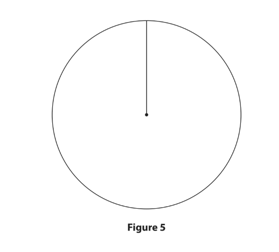
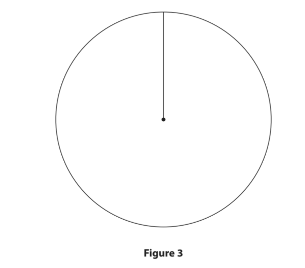
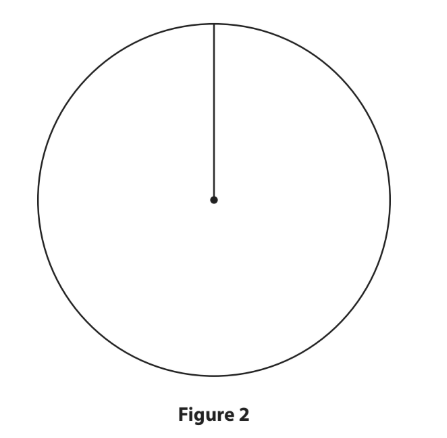

# Exam Questions — Production & Productivity
**Business Economics** · Edexcel IGCSE Economics (4EC1)
> Source: [https://www.savemyexams.com/igcse/economics/edexcel/17/topic-questions/business-economics/production-and-productivity/exam-questions/](https://www.savemyexams.com/igcse/economics/edexcel/17/topic-questions/business-economics/production-and-productivity/exam-questions/) · 32 questions · total 148 marks

## Q1 — easy — 1 marks · exam-questions

### 3((a)) — 1 mark — multiple_choice — from paper June 2024 · Paper 1R
Which** one** of the following is an example of a job in the primary sector of the economy?
- **A.** Farmer
- **B.** Mechanic
- **C.** Shop assistant
- **D.** Teacher

## Q2 — easy — 1 marks · exam-questions

### 1((a)) — 1 mark — multiple_choice — from paper Jan 2023 · Paper 1
What is the name given to a firm that manufactures cars?
- **A.** A primary sector firm
- **B.** A secondary sector firm
- **C.** A tertiary sector firm
- **D.** A service sector firm

## Q3 — easy — 4 marks · exam-questions

### 1((b)) — 1 mark — multiple_choice — from paper Jan 2023 · Paper 1
A firm that employs 540 workers has a total monthly output of 27,000 units.

What is the monthly labour productivity of the firm?
- **A.** 0.02 units
- **B.** 50 units
- **C.** 27,540 units
- **D.** 14,580,000 units

### 1((c)) — 2 marks — command: what — structured — from paper Jan 2023 · Paper 1
What is meant by the term division of labour?

### 1((d)) — 1 mark — command: state — structured — from paper Jan 2023 · Paper 1
State** one** factor of production.

## Q4 — easy — 1 marks · exam-questions

### 1((a)) — 1 mark — multiple_choice — from paper Jan 2023 · Paper 1R
Water is an example of which factor of production?
- **A.** Land
- **B.** Labour
- **C.** Capital
- **D.** Enterprise

## Q5 — easy — 3 marks · exam-questions

### 2((a)) — 1 mark — multiple_choice — from paper Nov 2023 · Paper 1
A firm employing 135 workers has a total output of 33,750 units each month.

What is the monthly labour productivity of the firm?
- **A.** \$250
- **B.** \$4 556 250
- **C.** 250 units
- **D.** 4,556,250 units

### 2((e)) — 2 marks — command: describe — structured — from paper Nov 2023 · Paper 1
Describe **one **reason why an entrepreneur is a factor of production.

## Q6 — easy — 4 marks · exam-questions

### 1((a)) — 1 mark — multiple_choice — from paper June 2022 · Paper 1
Which **one** of the following is a factor of production?
- **A.** Taxation
- **B.** Gym workout
- **C.** Enterprise
- **D.** Restaurant meal

### 1((h)) — 3 marks — command: explain — structured — from paper June 2022 · Paper 1
Warehouse employees at a small firm in Malta specialise in one task, such as sealing boxes, for orders that are sent to consumers.

Explain **one** disadvantage of the division of labour for the warehouse employees.

## Q7 — easy — 1 marks · exam-questions

### 3((b)) — 1 mark — multiple_choice — from paper June 2022 · Paper 1
Which** one **of the following is an example of an occupation in the primary sector?
- **A.** Teacher
- **B.** Farmer
- **C.** Electrician
- **D.** Actor

## Q8 — easy — 5 marks · exam-questions

### 1((a)) — 1 mark — multiple_choice — from paper June 2022 · Paper 1R
Which **one** of the following is defined as ‘breaking down the production process into smaller tasks’?
- **A.** Division of labour
- **B.** Innovation
- **C.** Labour intensive
- **D.** Productivity

### 1((e)) — 1 mark — command: define — structured — from paper June 2022 · Paper 1R
Define the term production.

### 1((h)) — 3 marks — command: explain — structured — from paper June 2022 · Paper 1R
Tertiary sector employment has increased by 13.1% in China during the last 10 years. However, there have been few changes in the level of  employment in the secondary sector.

Explain **one** possible reason for this trend.

## Q9 — easy — 1 marks · exam-questions

### 3((b)) — 1 mark — multiple_choice — from paper June 2022 · Paper 1R
Which **one** of the following is likely to lead to an increase in the productivity of land?
- **A.** Increase in the use of fertiliser
- **B.** Decrease in the use of irrigation
- **C.** Increase in the use of advertising
- **D.** Decrease in the use of drainage

## Q10 — easy — 1 marks · exam-questions

### 1((d)) — 1 mark — command: state — structured — from paper June 2021 · Paper 1
State **one** example of a factor of production that can be classified as land.

## Q11 — easy — 3 marks · exam-questions

### 1((c)) — 2 marks — command: what — structured — from paper Nov 2021 · Paper 1
What is meant by the term productivity?

### 1((e)) — 1 mark — command: define — structured — from paper Nov 2021 · Paper 1
Define the term producer.

## Q12 — easy — 2 marks · exam-questions

### 2((f)) — 2 marks — command: describe — structured — from paper Nov 2021 · Paper 1
Describe **one** reason why a computer can be a factor of production.

## Q13 — easy — 2 marks · exam-questions

### 2((b)) — 1 mark — multiple_choice — from paper Jan 2020 · Paper 1
Land can be described as which **one** of the following?
- **A.** A diseconomy of scale
- **B.** A factor of production
- **C.** A variable cost
- **D.** A market failure

### 2((e)) — 1 mark — command: define — structured — from paper Jan 2020 · Paper 1
Define the term finance.

## Q14 — easy — 1 marks · exam-questions

### 1((d)) — 1 mark — command: state — structured — from paper Jan 2020 · Paper 1R
State **one** example of an occupation in the tertiary sector of the economy.

## Q15 — easy — 1 marks · exam-questions

### 1((a)) — 1 mark — multiple_choice — from paper Nov 2020 · Paper 1R
Car production is most likely to take place in which sector of the economy?
- **A.** Primary
- **B.** Secondary
- **C.** Tertiary
- **D.** Mixed

## Q16 — easy — 2 marks · exam-questions

### 1((a)) — 1 mark — multiple_choice — from paper June 2019 · Paper 1
Which **one** of the following is a factor of production?
- **A.** Land
- **B.** Profit
- **C.** Wages
- **D.** Manufacturing

### 1((e)) — 1 mark — command: define — structured — from paper June 2019 · Paper 1
Define the term tertiary sector.

## Q17 — easy — 1 marks · exam-questions

### 2((d)) — 1 mark — command: define — structured — from paper June 2019 · Paper 1
Define the term innovation.

## Q18 — medium — 6 marks · exam-questions

### 3((d)) — 6 marks — command: analyse — structured — from paper June 2024 · Paper 1
More than one million drinks are bottled each day at the Coca‐Cola factory in Mwanza, Tanzania. Over 1,000 workers are involved in the process at its 65,000m2 site,

which includes filling bottles, sealing them with caps and adding labels. This enables consumers across East Africa to enjoy brands such as Coca‐Cola, Fanta and Sprite.

With reference to the data above and your knowledge of economics, analyse the possible advantages for Coca‐Cola of using division of labour at the factory.

## Q19 — medium — 6 marks · exam-questions

### 1((i)) — 6 marks — command: analyse — structured — from paper Nov 2024 · Paper 1
The main ingredient of chocolate is cocoa. Firstly, cocoa pods are picked from trees. This is mostly done by hand to protect the trees. Cocoa beans are removed from the pods by hand or by machine, before the beans are roasted in ovens. Other ingredients, such as sugar, are added during further stages in the production process.

With reference to the data above and your knowledge of economics, analyse how all four factors of production might be used to produce chocolate.

## Q20 — medium — 3 marks · exam-questions

### 3((c)) — 3 marks — command: draw — structured — from paper Jan 2023 · Paper 1R
On the blank pie chart below, draw and label the likely approximate size of employment in the primary (P), secondary (S) and tertiary (T) sectors for a developed country, such as Japan.

## Q21 — medium — 3 marks · exam-questions

### 3((c)) — 3 marks — command: draw — structured — from paper June 2021 · Paper 1
On the blank pie chart below, draw and label the appropriate sizes of the primary (P), secondary (S) and tertiary (T) sectors for a developing economy such as Haiti.

## Q22 — medium — 6 marks · exam-questions

### 1((i)) — 6 marks — command: analyse — structured — from paper Nov 2020 · Paper 1
Coffee is a popular drink in many countries around the world. Beans are picked by hand from coffee plants once the fruit is ready to harvest. It is then put through a process which includes sorting the type of bean and transforming it from its natural state. It can be sold as a bean, ground to make coffee or even as the instant product. Machines are used for most of the process but cannot identify which beans are ready to pick.

With reference to the data above and your knowledge of economics, analyse why all four factors of production might be used to produce coffee.

## Q23 — medium — 3 marks · exam-questions

### 2((f)) — 3 marks — command: explain — structured — from paper Nov 2020 · Paper 1R
Irrigation of Scottish farmland was increased during the summer of 2018.

Explain** one** way an increase in irrigation may have affected the productivity of Scottish farmers during the summer of 2018.

## Q24 — medium — 3 marks · exam-questions

### 2((c)) — 3 marks — command: draw — structured — from paper June 2019 · Paper 1R
France is a developed country.

On the blank pie chart below, draw and label the approximate sizes of the primary (P), secondary (S) and tertiary (T) sectors for a developed country such as France.

## Q25 — hard — 12 marks · exam-questions

### 4((c)) — 12 marks — command: evaluate — structured — from paper June 2024 · Paper 1R
In 2023, the Egyptian Government raised the price it paid for wheat to encourage farmers to increase production.

Wheat farmers face the difficulty of a limited amount of land available for agriculture. However, there are government programmes including land reclamation and guidance for farmers on both the use of fertiliser and irrigation systems.

As well as having a limited amount of land, many farmers are only familiar with traditional methods of farming and do not have the skills or the finance to change to new methods.

With reference to the data above and your knowledge of economics, evaluate the extent to which these government programmes may affect farming productivity in a country such as Egypt.

## Q26 — hard — 9 marks · exam-questions

### 3((e)) — 9 marks — command: assess — structured — from paper Nov 2024 · Paper 1
The education level of a worker is likely to have an effect on their ability in the workplace.

When a person migrates to another country, they bring with them whatever knowledge, skills and information they possess.

With reference to the data above and your knowledge of economics, assess the importance of the quality of labour on productivity in a country.

## Q27 — hard — 9 marks · exam-questions

### 2((g)) — 9 marks — command: assess — structured — from paper Jan 2023 · Paper 1R
Foxconn Technology produces the new Apple iPhone at its factory in Shenzhen, China. It employs 270,000 workers in its factory. Each worker carries out a specific task which ranges from handling the phone screen, assembling components, checking the phone works, to packaging the phone ready to ship to the customer.

(Source adapted from: [Link](https://www.patentlyapple.com/2021/10/foxconns-shenzhen-factory-to-hire-an-additional-100000-plant-workers-to-keep-iphone-13-production-on.html))

With reference to the data above and your knowledge of economics, assess the benefits for Foxconn Technology of using division of labour.

## Q28 — hard — 12 marks · exam-questions

### 4((c)) — 12 marks — command: evaluate — structured — from paper Nov 2023 · Paper 1
Churros are a popular Spanish snack made from fried pastry and covered in sugar and/or chocolate. Raphael operates a factory making the churros pastry, which is supplied to busy restaurants and street vendors all over Madrid, Spain. The factory has been owned by his family since 1980 and currently has 23 employees. The pastry-making process involves mixing all the ingredients together and then heating them. Once the mixture has cooled, eggs are added and the dough is then shaped into lengths of about 15 cm. Raphael is considering introducing division of labour into the production process in order to increase productivity.

With reference to the data above and your knowledge of economics, evaluate whether introducing division of labour is the best way for Raphael to increase productivity in his pastry-making factory.

## Q29 — hard — 9 marks · exam-questions

### 2((h)) — 9 marks — command: assess — structured — from paper June 2021 · Paper 1
Fast food restaurants around the world use division of labour during the production of food and drinks. Employees are given different tasks. Burgers are fried before being placed in a bread ‘bun’. Chopped lettuce and tomatoes are then added. Potatoes are also peeled and sliced in order to make fries.

With reference to the data above and your knowledge of economics, assess whether a firm, such as a fast food restaurant, always benefits from using division of labour.

## Q30 — hard — 12 marks · exam-questions

### 4((c)) — 12 marks — command: evaluate — structured — from paper Jan 2020 · Paper 1R
Wong Thien runs the family’s noodle-making factory, which has been operating in Jenjarum, Malaysia since 1950. The noodle-making process involves each worker blending ingredients to make dough, kneading the dough with long wooden rolling pins and cutting noodles to various sizes. Wong’s factory now supplies 70% of the noodle-based food stalls in the town. He is considering introducing division of labour in the production process in order to increase productivity.

With reference to the data above and your knowledge of economics, evaluate whether introducing division of labour is the best way for Wong to increase productivity in his noodle-making factory.

## Q31 — hard — 12 marks · exam-questions

### 4((c)) — 12 marks — command: evaluate — structured — from paper Nov 2020 · Paper 1
The rise of the restaurant robot There has been an increase in the number of restaurants using robots instead of waiters and even chefs. Waiters who take customer orders have been replaced with computer tablets for ordering. Technology is now available to automatically serve espresso shots and make cappuccinos. This is due to efficiencies, rising labour costs, consumers’ desire for convenience and their changing purchasing habits. This could change the dining experience as restaurants increase their use of technology.

(Source adapted from: [Link](https://www.forbes.com/sites/andrewrigie/2018/09/24/the-rise-of-the-restaurant-robot/#4f69b2593747))

With reference to the data above and your knowledge of economics, evaluate the possible effect of an increase in the use of technology on productivity in restaurants.

## Q32 — hard — 9 marks · exam-questions

### 3((e)) — 9 marks — command: assess — structured — from paper June 2019 · Paper 1
Productivity is a measure of how efficiently goods and services are produced and is the single most important determinant of a country’s per capita income. Canada’s labour productivity growth has been lower than that of other leading economies for many decades, reducing its international competitiveness. Since 2011 however, Canada’s labour productivity has greatly improved and it is now the 3rd most productive of the 16 leading economies.

(Source: adapted from [http://www.conferenceboard.ca/hcp/](http://www.conferenceboard.ca/hcp/))

With reference to the data above and your knowledge of economics, assess the extent to which an increase in education and training is the best way to increase productivity.
