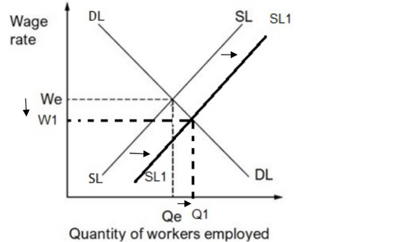
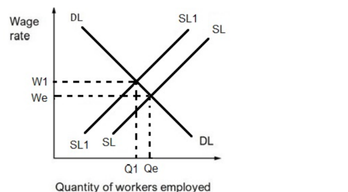
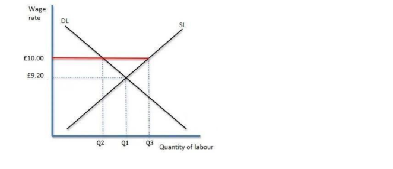
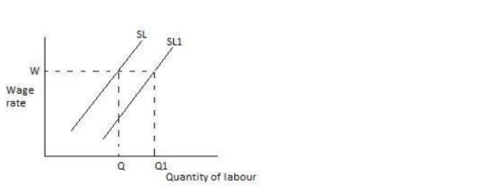

# Mark Schemes — The Labour Market
**Business Economics** · Edexcel IGCSE Economics (4EC1)

## Q1 — easy — 1 marks · exam-questions

### 3((a)) — 1 marks
**Correct answer: B** — The school‐leaving age

**Final answer:** **The correct answer is B**

Raising the school-leaving age keeps young people in education for longer, so they are not available for work and the supply of labour falls

**A** is incorrect as an increase in the retirement age would increase the supply of labour, because people stay in work for longer

**C** is incorrect as an increase in the population would mean more people were available to work

**D** is incorrect as the demand for the final product affects the demand for labour, not its supply

## Q2 — easy — 1 marks · exam-questions

### 1((d)) — 1 marks
**The retirement age****[1 mark]**

> **[mark-scheme]**
> Award 1 mark for a correct factor
> 
> Accept any other appropriate response, e.g. the size of the population, migration, the school-leaving age, the age distribution of the population, female participation, skills and qualifications, or the ability of workers to move between locations or between types of employment

> **[exam-tip]**
> - The examiner report for this paper notes that 'when only one factor is requested, stating two will not result in additional marks', so give one factor and stop there
> - Give a factor, not an explanation, one mark means a few words are enough

## Q3 — easy — 2 marks · exam-questions

### 2((c)) — 2 marks
A trade union is an organisation for employees** [1]** that aims to protect and represent the interests of its members** [1]**

**[2 marks]**

> **[mark-scheme]**
> Award 1 mark for reference to an organisation for employees and 1 mark for reference to protecting the interests of members
> 
> Accept any other correct and appropriate wording

## Q4 — easy — 1 marks · exam-questions

### 2((a)) — 1 marks
**Correct answer: C** — Increase in female participation

**Final answer:** **The correct answer is C**

An increase in female participation means more women are willing and able to work, so more workers are available at each wage rate and the supply of labour increases

**A** is incorrect as a decrease in the retirement age means people leave work earlier, reducing the supply of labour

**B** is incorrect as an increase in the school-leaving age keeps young people in education for longer, so fewer are available to work

**D** is incorrect as a decrease in population means fewer people are available to work, reducing the supply of labour

## Q5 — easy — 1 marks · exam-questions

### 2((b)) — 1 marks
**Correct answer: C** — employee rights

**Final answer:** **The correct answer is C**

A trade union is an organisation of employees that exists to protect the rights of its members, negotiating on their behalf over pay, hours and working conditions

**A** is incorrect as consumers are not members of a trade union, their interests are represented by other organisations

**B** is incorrect as protecting the environment is not the responsibility of a trade union

**D** is incorrect as trade unions are independent of the government and represent workers, not the state

## Q6 — easy — 1 marks · exam-questions

### 3((a)) — 1 marks
**Correct answer: A** — A higher retirement age

**Final answer:** **The correct answer is A**

A higher retirement age means workers stay in employment for longer before they are able to retire, so more people are available to work at each wage rate and the supply of labour increases

**B** is incorrect as a higher school-leaving age keeps young people in education for longer, so fewer of them are available to work

**C** is incorrect as a fall in population means there are fewer people available to work, reducing the supply of labour

**D** is incorrect as a fall in demand for the final product reduces the demand for labour, since the demand for labour is derived from the demand for what it produces

## Q7 — easy — 1 marks · exam-questions

### 2((b)) — 1 marks
**Correct answer: C** — Producer demand for labour to make goods

**Final answer:** **The correct answer is C**

Derived demand is demand for one thing that comes from the demand for something else, and firms only demand labour because consumers demand the goods that labour produces

**A** is incorrect as consumers demand clothes for their own sake, not because they want something else the clothes are used to produce

**B** is incorrect as tourists demand foreign holidays for the enjoyment of the holiday itself

**D** is incorrect as students demand computer games in order to play them, which is direct demand rather than derived demand

## Q8 — medium — 3 marks · exam-questions

### 2((f)) — 3 marks
One advantage is that firms are able to retain their skilled workers for longer** [1]**, because UK workers will not be able to draw a private pension until they are at least 57 from 2028 and so are likely to stay in employment for another two years** [1]**, which saves firms the cost of recruiting and training replacements for the experienced staff who would otherwise have retired at 55** [1]**

**[3 marks]**

> **[mark-scheme]**
> Award 1 mark for identifying a relevant advantage
> 
> Award 1 mark for developing the advantage
> 
> Award 1 mark for the advantage being in context
> 
> **Alternative content**
> 
> The answer above is just one example of a response to this question. Other advantages could include:
> 
> - The supply of labour increases as people work for longer, which can reduce the wage rate firms have to pay
> - Firms keep the experience and knowledge of older workers, who can train younger staff
> - A larger pool of available workers makes it easier to fill vacancies
> 
> Accept any other appropriate response

> **[exam-tip]**
> - The question asks for an advantage to **firms**, so the chain must end with a benefit the employer receives, not one the worker or the government receives
> - The context mark comes from the detail in the stem, so refer to the rise from 55 to 57 or to the 2028 change

## Q9 — medium — 3 marks · exam-questions

### 1((h)) — 3 marks
One effect is that the supply of labour would decrease** [1]**, because 16 and 17 year olds in England must now stay in education rather than take full-time work** [1]**, so only people aged 18 and over can contribute to the supply of labour and fewer workers are willing and able to work at each wage rate** [1]**

**[3 marks]**

> **[mark-scheme]**
> Award 1 mark for identifying an effect
> 
> Award 1 mark for developing the response
> 
> Award 1 mark for the response being in context
> 
> **Alternative content**
> 
> The answer above is just one example of a response to this question. Other effects could include:
> 
> - The quality of the labour supply rises in the longer term, as more young people leave education with qualifications and skills
> - The fall in supply may push the equilibrium wage rate up, since firms compete for a smaller pool of workers
> - Industries that rely on young, low-skilled workers are affected most, as their supply of labour falls furthest
> 
> Accept any other appropriate response

> **[exam-tip]**
> - The question asks about the supply of labour, so finish the chain there, an answer that stops at 'young people stay in school' has not reached the economics
> - The context mark comes from the stem, so refer to England and to the rise from 16 to 18

## Q10 — medium — 6 marks · exam-questions

### 3((d)) — 6 marks
The demand for labour depends partly on the availability of substitutes for workers, and machines are the main substitute.** [K]** Technology already performs jobs previously done for many years by humans, such as robots in factories and self-checkout machines,** [Ap]** so firms have a genuine alternative to hiring people, and if a machine can do the same work more cheaply or more efficiently, a firm trying to minimise its costs will switch from labour to capital.** [An]** This means the quantity of labour demanded at each wage rate falls, shifting the demand curve for labour to the left. Google's automated assistant shows the same process reaching services, as many telecom firms have already switched to calls made by automated assistants rather than by the humans who currently answer customer queries,** [Ap]** so demand for call centre workers in those firms falls. Because this substitution of capital for labour is likely to increase as technology advances,** [An]** the range of jobs that machines can perform keeps widening, so the demand for labour is likely to go on decreasing in the industries affected.** [An]**

**[6 marks]**

> **[mark-scheme]**
> This is a ‘levelled response’ question
> 
> - **[Ap]** = application to the data given  (3 marks)
> - **[An]** = analysis / chain of reasoning (3 marks)
> 
> Although there are no separate **[K] marks**, both application and analysis must be built on **clear and accurate economic knowledge and understanding**
> 
> Therefore, each KAA paragraph should follow:
> 
> - Valid knowledge point → Application → Analysis
> - Each valid point made in the answer does not equal a mark, the response is judged holistically against the level descriptors
> 
> **Mark allocation**
> 
> Answers are placed into one of three levels.  **A level 3 answer (5-6 marks)**, will specifically:
> 
> - Demonstrate clear knowledge and understanding by developing relevant points and include appropriate application of economic terms, concepts, theories and calculations
> - Information presented will demonstrate excellent selectivity and organisation. Interpretation of economic information will be excellent, with a thorough analysis of issues
> 
> **Alternative content**
> 
> The answer above is just one example of how to respond to this question. Additional information which could be used in the answer includes:
> 
> - The demand for labour is also affected by the wage rate, so a rise in wages makes switching to machines more attractive still
> - Demand for labour may rise in other occupations, such as the engineers needed to design, install and maintain the machines
> - Machines can raise productivity, which may increase output and eventually the demand for labour elsewhere in the firm
> - Any other relevant and valid analysis is acceptable

> **[exam-tip]**
> - Name the reason machines reduce demand for labour, they are a substitute, rather than simply saying that robots take jobs
> - Use both examples in the extract, the factory robots and self-checkouts show manufacturing and retail, and Google's automated assistant shows services
> - No counter-argument and no conclusion is required, analyse is always one-sided

## Q11 — medium — 6 marks · exam-questions

### 4((b)) — 6 marks
The supply of labour is the quantity of workers willing and able to work at a given wage rate, and it increases when workers become more occupationally mobile, meaning they are able to move between different types of employment.** [K]** Tony's income from selling paintings to small craft shops has fallen because many of those shops have closed,** [Ap]** so demand for his work has shrunk and he faces unemployment, while other occupations, such as teaching, are short of workers. The government scheme allows him to train as an art teacher while still receiving an income,** [Ap]** so the loss of earnings that normally makes retraining impossible no longer stops him, and he can move out of a declining industry and add himself to the supply of labour in an expanding one.** [An]** Where many workers are able to do the same, the supply of labour rises in the occupations that need workers, shortages in those industries are reduced and the wage rate employers must pay to attract staff falls,** [An]** so the economy makes fuller use of the labour it has instead of leaving workers unemployed in industries where demand has disappeared.** [An]**

**[6 marks]**

> **[mark-scheme]**
> This is a ‘levelled response’ question
> 
> - **[Ap]** = application to the data given  (3 marks)
> - **[An]** = analysis / chain of reasoning (3 marks)
> 
> Although there are no separate **[K] marks**, both application and analysis must be built on **clear and accurate economic knowledge and understanding**
> 
> Therefore, each KAA paragraph should follow:
> 
> - Valid knowledge point → Application → Analysis
> - Each valid point made in the answer does not equal a mark, the response is judged holistically against the level descriptors
> 
> **Mark allocation**
> 
> Answers are placed into one of three levels.  **A level 3 answer (5-6 marks)**, will specifically:
> 
> - Demonstrate clear knowledge and understanding by developing relevant points and include appropriate application of economic terms, concepts, theories and calculations
> - Information presented will demonstrate excellent selectivity and organisation. Interpretation of economic information will be excellent, with a thorough analysis of issues
> 
> **Alternative content**
> 
> The answer above is just one example of how to respond to this question. Additional information which could be used in the answer includes:
> 
> - Government training schemes are themselves a way of increasing the supply of labour, by making workers more occupationally mobile
> - Greater mobility reduces structural unemployment, since workers are no longer trapped in industries where demand has fallen
> - Any other relevant and valid analysis is acceptable

> **[exam-tip]**
> - Use the correct term, occupational mobility of labour, and apply it to Tony's move from artist to art teacher
> - Finish the chain at the supply of labour, an answer that only describes Tony's situation has not answered the question
> - No counter-argument and no conclusion is required, analyse is always one-sided

## Q12 — medium — 3 marks · exam-questions

### 3((c)) — 3 marks

**[3 marks]**

> **[mark-scheme]**
> Award 1 mark for rightward shift of labour supply, labelled
> 
> Award 1 mark for lower equilibrium wage rate, labelled
> 
> Award 1 mark for higher equilibrium quantity of workers employed, labelled

> **[exam-tip]**
> - An increase in the retirement age keeps people in work for longer, so more workers are available at every wage rate and the supply of labour shifts to the **right**
> - Move only the supply of labour curve. Shifting the demand curve as well shows that you have not understood the scenario and examiner reports note that candidates who shift both curves score nothing
> - All three marks depend on labelling, so name the new curve and mark the new wage rate and the new quantity of workers on the axes

## Q13 — medium — 6 marks · exam-questions

### 3((d)) — 6 marks
The supply of labour for a particular occupation depends on how many workers hold the skills and qualifications that occupation requires.** [K]** Canadian firms need specialists such as computer engineers and web designers, but high costs and long time commitments often stop Canadians from training,** [Ap]** so relatively few people acquire these qualifications and the supply of specialist labour stays low even where firms are willing to pay well.** [An]** At the same time the demand for such skills has been rising quickly, so demand has grown faster than supply and a shortage has developed, which is why firms have welcomed the Global Talent Stream and are willing to pay a processing fee for each foreign worker hired. Geographical immobility of labour makes the shortage worse, because Canada is the world's second largest country,** [Ap]** so a qualified engineer living in one region may be unable or unwilling to move thousands of kilometres to take a job in another,** [An]** meaning that even the specialists who do exist are not always available in the places where firms need them.** [An]**

**[6 marks]**

> **[mark-scheme]**
> This is a ‘levelled response’ question
> 
> - **[Ap]** = application to the data given  (3 marks)
> - **[An]** = analysis / chain of reasoning (3 marks)
> 
> Although there are no separate **[K] marks**, both application and analysis must be built on **clear and accurate economic knowledge and understanding**
> 
> Therefore, each KAA paragraph should follow:
> 
> - Valid knowledge point → Application → Analysis
> - Each valid point made in the answer does not equal a mark, the response is judged holistically against the level descriptors
> 
> **Mark allocation**
> 
> Answers are placed into one of three levels.  **A level 3 answer (5-6 marks)**, will specifically:
> 
> - Demonstrate clear knowledge and understanding by developing relevant points and include appropriate application of economic terms, concepts, theories and calculations
> - Information presented will demonstrate excellent selectivity and organisation. Interpretation of economic information will be excellent, with a thorough analysis of issues
> 
> **Alternative content**
> 
> The answer above is just one example of how to respond to this question. Additional information which could be used in the answer includes:
> 
> - Wages and rewards for computer engineers and web designers may be higher in other countries, encouraging skilled Canadians to work abroad
> - The demand for these specialist skills may simply have grown faster than any training system could supply them
> - Any other relevant and valid analysis is acceptable

> **[exam-tip]**
> - Name the economics behind each point, occupational immobility caused by the cost of training and geographical immobility caused by Canada's size, rather than just repeating the extract
> - One thoroughly developed chain of reasoning can reach full marks, you do not need several separate points
> - No counter-argument and no conclusion is required, analyse is always one-sided

## Q14 — medium — 3 marks · exam-questions

### 3((c)) — 3 marks

**[3 marks]**

> **[mark-scheme]**
> Award 1 mark for leftward shift of labour supply, labelled
> 
> Award 1 mark for higher equilibrium wage rate, labelled
> 
> Award 1 mark for lower equilibrium quantity of workers employed, labelled

> **[exam-tip]**
> - An increase in the school-leaving age keeps young people in education, so fewer workers are available at every wage rate and the supply of labour shifts to the **left**. This is the opposite of the retirement-age version of this question, so read the stem carefully before you draw
> - Move only the supply of labour curve. Shifting the demand curve as well shows that you have not understood the scenario and examiner reports note that candidates who shift both curves score nothing
> - All three marks depend on labelling, so name the new curve and mark the new wage rate and the new quantity of workers on the axes

## Q15 — hard — 9 marks · exam-questions

### 2((g)) — 9 marks
A trade union is an organisation of employees that negotiates with employers on their members' behalf, and raising wages is its main aim.** [K]** Verdi is Germany's second largest trade union and was negotiating for 2.5 million transport workers,** [Ap]** so it could credibly threaten to withdraw the labour that railways and airports depend on, and the strike action it organised caused major disruption. Because every day of disruption costs employers revenue,** [An]** they had a strong incentive to settle rather than hold out, and the workers received a 5.5% pay increase that individual employees negotiating alone would have been most unlikely to obtain, which shows the union was effective in raising wages.** [An]**

However, the union achieved far less than it set out to achieve.** [Ev]** Verdi had been arguing for a 10.5% increase but the deal delivered 5.5%,** [Ap]** barely half of what was demanded, so its bargaining power was clearly limited by what the employers were willing and able to pay. A union can only push wages as far as the employer can absorb the extra cost,** [An]** and transport firms facing a much larger wage bill must either raise fares, risking a fall in passenger numbers, or accept lower profits, which may lead them to employ fewer workers in future. Members may also question whether the fee they pay and the wages lost during the strike were worth a 5.5% rise, which could reduce support for the union in later negotiations.** [An]**

**[9 marks]**

> **[mark-scheme]**
> This is a ‘levelled response’ question
> 
> - **[Ap]** = application to the data given  (3 marks)
> - **[An]** = analysis / chain of reasoning (3 marks)
> - **[Ev]** = evaluation (3 marks)
> 
> Although there are no separate **[K] marks**, both application and analysis must be built on **clear and accurate economic knowledge and understanding**
> 
> Therefore, each KAA paragraph should follow:
> 
> - Valid knowledge point → Application → Analysis
> - Each valid point made in the answer does not equal a mark, the response is judged holistically against the level descriptors
> 
> **Mark allocation**
> 
> A 9 mark (Level 3) answer will include examples which demonstrate:
> 
> - **Application [Ap]** — clear knowledge and understanding by developing relevant points. Appropriate application of economic terms, concepts, theories and calculations
> - **Analysis [An]** — Information presented will demonstrate excellent selectivity and organisation. Interpretation of economic information will be excellent, with a thorough analysis of issues
> - **Evaluation [Ev]** — Offers more than one viewpoint. The argument is well balanced and coherent, leading to an evaluation that demonstrates full understanding and awareness
> 
> **Alternative content**
> 
> The answer above is just one example of how to respond to this question. Additional information which could be used in the answer includes:
> 
> - Other employers may now be more willing to negotiate with unions in order to avoid disruption or to gain the productivity benefits of better-paid staff
> - The effectiveness of a union depends on how many of its members actually support strike action
> - Whether firms can pass higher wage costs on to customers, for example through higher rail fares, affects how much they are prepared to concede
> - Any other relevant and valid analysis is acceptable

> **[exam-tip]**
> - The two percentages are the heart of this question, 10.5% demanded against 5.5% agreed is the evidence that the union was only partly effective
> - Build both sides to matching depth, an unbalanced answer is the commonest reason marks are lost here
> - No conclusion is required at 9 marks

## Q16 — hard — 9 marks · exam-questions

### 3((e)) — 9 marks
A trade union is an organisation that represents the employees in an industry, aiming to protect workers' rights and to raise their wages.** [K]** Usdaw negotiated an increase in the hourly wage rate at Morrisons from £9.20 to at least £10 for 110,000 workers, a rise of nearly 9%,** [Ap]** and it was able to do so because the majority of Morrisons' workers are union members, which gave it the power to disrupt the business if no agreement was reached. For the employees the impact is clearly positive, since each worker gains at least 80p for every hour worked,** [An]** and better pay may raise motivation and productivity, so Morrisons could recover part of the extra cost through more output per worker rather than through job losses.** [An]**

However, the agreement is a large increase in costs for Morrisons.** [Ev]** Paying an extra 80p an hour to 110,000 workers adds a great deal to the wage bill,** [Ap]** and because the wage is now above the rate the labour market would otherwise have settled at, the quantity of labour firms wish to employ falls while the quantity supplied rises, so Morrisons may respond by employing fewer workers or cutting hours, which would harm some of the very employees Usdaw represents.** [An]** As a leading UK supermarket it may instead pass part of the higher cost on to shoppers as higher prices, which protects jobs but only works if demand for its groceries is price inelastic, since otherwise customers will simply switch to a cheaper rival.** [An]**

**[9 marks]**

> **[mark-scheme]**
> This is a ‘levelled response’ question
> 
> - **[Ap]** = application to the data given  (3 marks)
> - **[An]** = analysis / chain of reasoning (3 marks)
> - **[Ev]** = evaluation (3 marks)
> 
> Although there are no separate **[K] marks**, both application and analysis must be built on **clear and accurate economic knowledge and understanding**
> 
> Therefore, each KAA paragraph should follow:
> 
> - Valid knowledge point → Application → Analysis
> - Each valid point made in the answer does not equal a mark, the response is judged holistically against the level descriptors
> 
> **Mark allocation**
> 
> A 9 mark (Level 3) answer will include examples which demonstrate:
> 
> - **Application [Ap]** — clear knowledge and understanding by developing relevant points. Appropriate application of economic terms, concepts, theories and calculations
> - **Analysis [An]** — Information presented will demonstrate excellent selectivity and organisation. Interpretation of economic information will be excellent, with a thorough analysis of issues
> - **Evaluation [Ev]** — Offers more than one viewpoint. The argument is well balanced and coherent, leading to an evaluation that demonstrates full understanding and awareness
> 
> **Alternative content**
> 
> The answer above is just one example of how to respond to this question. Additional information which could be used in the answer includes:
> 
> - Trade unions also provide legal assistance, improve working conditions and press governments to legislate in favour of employees
> - The wage rise may improve recruitment and retention, lowering Morrisons' costs of hiring and training staff
> - Being first in the retail industry to pay at least £10 an hour may bring Morrisons favourable publicity and attract better applicants
> - Any other relevant and valid analysis is acceptable

A diagram may be used to support the analysis of a wage set above the market equilibrium:

> **[exam-tip]**
> - The question names both Morrisons and its employees, so cover the impact on each, an answer that only discusses the workers cannot be balanced
> - Use the figures, the rise from £9.20 to £10 across 110,000 workers is what turns a generic answer about trade unions into an applied one
> - No conclusion is required at 9 marks, but both sides must be developed to matching depth

## Q17 — hard — 9 marks · exam-questions

### 3((e)) — 9 marks
Migration occurs when a person moves to live and work in a foreign country, and inward migration increases the supply of labour, shifting the labour supply curve to the right.** [K]** More than 80% of Dubai's population of over 2.5 million people are immigrant workers,** [Ap]** so the emirate has a far larger workforce than its own citizens could provide and firms are able to fill vacancies that would otherwise stay empty. Because the supply of labour is so much greater, the equilibrium wage rate is lower than it would be without migration,** [An]** so construction, cleaning and care services can be provided at a cost employers can afford, which supports the building programme and the service industries Dubai depends on.** [An]**

However, the benefit is narrower than the 80% figure suggests.** [Ev]** Many of the immigrants work specifically in construction, cleaning or care services,** [Ap]** so other sectors of Dubai's economy may see little increase in their supply of labour, and migrant workers may not have the skills needed to fill shortages in professional or technical occupations.** [An]** The increase may also prove temporary, because migrants often return to their home countries after a short period, so Dubai's labour supply depends on continuing inflows rather than on a settled workforce; raising the retirement age, encouraging female participation or training its own citizens could deliver a more lasting increase in the supply of labour.** [An]**

**[9 marks]**

> **[mark-scheme]**
> This is a ‘levelled response’ question
> 
> - **[Ap]** = application to the data given  (3 marks)
> - **[An]** = analysis / chain of reasoning (3 marks)
> - **[Ev]** = evaluation (3 marks)
> 
> Although there are no separate **[K] marks**, both application and analysis must be built on **clear and accurate economic knowledge and understanding**
> 
> Therefore, each KAA paragraph should follow:
> 
> - Valid knowledge point → Application → Analysis
> - Each valid point made in the answer does not equal a mark, the response is judged holistically against the level descriptors
> 
> **Mark allocation**
> 
> A 9 mark (Level 3) answer will include examples which demonstrate:
> 
> - **Application [Ap]** — clear knowledge and understanding by developing relevant points. Appropriate application of economic terms, concepts, theories and calculations
> - **Analysis [An]** — Information presented will demonstrate excellent selectivity and organisation. Interpretation of economic information will be excellent, with a thorough analysis of issues
> - **Evaluation [Ev]** — Offers more than one viewpoint. The argument is well balanced and coherent, leading to an evaluation that demonstrates full understanding and awareness
> 
> **Alternative content**
> 
> The answer above is just one example of how to respond to this question. Additional information which could be used in the answer includes:
> 
> - Migrant workers fill jobs that local citizens may be unwilling to do, so shortages in construction and care work are avoided
> - On the other side, raising the retirement age, reducing the school-leaving age or increasing female participation may give a longer-term increase in labour supply
> - Those alternatives may also recruit workers into sectors other than construction, cleaning and care services
> - Any other relevant and valid analysis is acceptable

A diagram may be used to show the rightward shift in the supply of labour:

> **[exam-tip]**
> - The question asks about the benefits to Dubai, so keep the focus on the economy employing the workers rather than on the migrants themselves
> - Use the two figures given, over 2.5 million people and over 80% immigrant workers, to show the scale of the effect on labour supply
> - No conclusion is required at 9 marks, but both sides must be developed to matching depth

## Q18 — hard — 9 marks · exam-questions

### 2((h)) — 9 marks
The supply of labour is the number of people willing and able to work in an occupation, and one of the factors affecting it is how many people hold the necessary skills and qualifications.** [K]** In England the number of science, maths and modern language graduates has increased,** [Ap]** so more people now hold exactly the qualifications that shortage-subject teaching requires, and the government offers a bonus payment of £9,000 available only to graduates in these subjects. Because that bonus raises the reward for entering teaching relative to other careers,** [An]** more of these graduates are willing to train as teachers than would otherwise be the case, so the supply of teachers in those subjects increases.** [An]**

However, holding a qualification does not oblige anyone to use it in the classroom.** [Ev]** Many of those who do enter the profession leave within one or two years because of long working hours, bureaucracy and student behaviour,** [Ap]** so an increase in qualified people produces only a short-lived increase in the supply of teachers if working conditions drive them out again.** [An]** The same qualifications are valuable elsewhere, and those with science qualifications often find different types of employment quite easily, so graduates can choose better-paid or less demanding work instead; graduates in subjects outside the bonus scheme have no extra incentive to teach at all, so a rise in qualifications does not always increase the supply of teachers.** [An]**

**[9 marks]**

> **[mark-scheme]**
> This is a ‘levelled response’ question
> 
> - **[Ap]** = application to the data given  (3 marks)
> - **[An]** = analysis / chain of reasoning (3 marks)
> - **[Ev]** = evaluation (3 marks)
> 
> Although there are no separate **[K] marks**, both application and analysis must be built on **clear and accurate economic knowledge and understanding**
> 
> Therefore, each KAA paragraph should follow:
> 
> - Valid knowledge point → Application → Analysis
> - Each valid point made in the answer does not equal a mark, the response is judged holistically against the level descriptors
> 
> **Mark allocation**
> 
> A 9 mark (Level 3) answer will include examples which demonstrate:
> 
> - **Application [Ap]** — clear knowledge and understanding by developing relevant points. Appropriate application of economic terms, concepts, theories and calculations
> - **Analysis [An]** — Information presented will demonstrate excellent selectivity and organisation. Interpretation of economic information will be excellent, with a thorough analysis of issues
> - **Evaluation [Ev]** — Offers more than one viewpoint. The argument is well balanced and coherent, leading to an evaluation that demonstrates full understanding and awareness
> 
> **Alternative content**
> 
> The answer above is just one example of how to respond to this question. Additional information which could be used in the answer includes:
> 
> - Normally an increase in the number of people qualified to work in an industry does increase the supply of labour to it, so the general rule holds
> - The bonus acts like a higher wage, and a higher reward usually raises the quantity of labour supplied
> - On the other side, occupational mobility works both ways, the more transferable a qualification is, the easier it is for graduates to leave teaching
> - Any other relevant and valid analysis is acceptable

> **[exam-tip]**
> - The word 'always' is the key to this question, the strongest answers show when more qualifications does raise the supply of teachers and when it does not
> - Use the detail in the extract, the £9,000 bonus, the one or two years before leaving, and the ease with which science graduates find other work
> - No conclusion is required at 9 marks, but both sides must be developed to matching depth

## Q19 — hard — 9 marks · exam-questions

### 3((e)) — 9 marks
The demand for labour is the quantity of workers producers are willing and able to employ, and it falls when a cheaper substitute for labour becomes available.** [K]** In UK retailing the continuing development of technology has made it easier for consumers to buy online, and machines in warehouses now send out those orders in place of shop employees,** [Ap]** so firms can meet the same demand with fewer workers. Town centre shops have been closing in increasing numbers each year, with at least 10% standing empty for the last five years,** [An]** so far fewer shop assistants and cashiers are needed, and the demand for that kind of labour falls as employers substitute capital for it.** [An]**

However, machines do not remove the need for labour so much as change the kind of labour needed.** [Ev]** Workers are still required to design, build, programme and maintain the machines that pack and dispatch online orders,** [Ap]** and with online sales reaching more than 20% of total retail sales in 2019, more warehouse operatives, drivers and postal workers are needed to handle and deliver those orders.** [An]** So while demand for one type of labour falls, demand for another rises, and whether total demand for labour falls depends on how many new jobs the online sector creates compared with the shop jobs lost, and on whether displaced shop workers have the skills to move into them.** [An]**

**[9 marks]**

> **[mark-scheme]**
> This is a ‘levelled response’ question
> 
> - **[Ap]** = application to the data given  (3 marks)
> - **[An]** = analysis / chain of reasoning (3 marks)
> - **[Ev]** = evaluation (3 marks)
> 
> Although there are no separate **[K] marks**, both application and analysis must be built on **clear and accurate economic knowledge and understanding**
> 
> Therefore, each KAA paragraph should follow:
> 
> - Valid knowledge point → Application → Analysis
> - Each valid point made in the answer does not equal a mark, the response is judged holistically against the level descriptors
> 
> **Mark allocation**
> 
> A 9 mark (Level 3) answer will include examples which demonstrate:
> 
> - **Application [Ap]** — clear knowledge and understanding by developing relevant points. Appropriate application of economic terms, concepts, theories and calculations
> - **Analysis [An]** — Information presented will demonstrate excellent selectivity and organisation. Interpretation of economic information will be excellent, with a thorough analysis of issues
> - **Evaluation [Ev]** — Offers more than one viewpoint. The argument is well balanced and coherent, leading to an evaluation that demonstrates full understanding and awareness
> 
> **Alternative content**
> 
> The answer above is just one example of how to respond to this question. Additional information which could be used in the answer includes:
> 
> - The demand for labour is also affected by the demand for the product and by productivity, not only by the availability of substitutes
> - Certain types of labour fall, such as shop workers, while others rise, such as software developers, so the composition of demand changes
> - Machines may raise productivity so much that output and revenue rise, which can increase demand for labour elsewhere in the firm
> - Any other relevant and valid analysis is acceptable

> **[exam-tip]**
> - Name the mechanism, machines are a substitute for labour, rather than simply saying that technology destroys jobs
> - Use the figures, at least 10% of shops empty for five years and online sales above 20% of retail sales are the evidence for each side of the argument
> - No conclusion is required at 9 marks, but both sides must be developed to matching depth

## Q20 — hard — 9 marks · exam-questions

### 3((e)) — 9 marks
Raising the retirement age increases the supply of labour, because workers must stay in employment for longer before they can draw a pension.** [K]** Singapore's retirement age of 62 will rise to 63 in 2022 and to 65 by 2030,** [Ap]** so workers aged 62, 63 and 64 who would previously have retired remain in the workforce, adding directly to the number of people willing and able to work at each wage rate. Because life expectancy in Singapore is now over 84 years,** [An]** these older workers are likely to be healthy enough to keep working, so the change adds a substantial and predictable number of workers without the government having to spend anything, which makes it an effective way of increasing the supply of labour.** [An]**

However, it may not be the most effective method for the industries that matter most to Singapore.** [Ev]** Manufacturing contributes almost 25% of the country's GDP and many roles in that sector are physically demanding, better suited to younger workers,** [Ap]** so keeping people in work until 65 does not necessarily supply the kind of labour that sector actually needs.** [An]** Encouraging migration, raising female participation or investing in skills and qualifications could add more workers and better-matched ones, particularly for the growing financial services sector, where what is needed is specialist expertise rather than simply more years of work from the existing workforce.** [An]**

**[9 marks]**

> **[mark-scheme]**
> This is a ‘levelled response’ question
> 
> - **[Ap]** = application to the data given  (3 marks)
> - **[An]** = analysis / chain of reasoning (3 marks)
> - **[Ev]** = evaluation (3 marks)
> 
> Although there are no separate **[K] marks**, both application and analysis must be built on **clear and accurate economic knowledge and understanding**
> 
> Therefore, each KAA paragraph should follow:
> 
> - Valid knowledge point → Application → Analysis
> - Each valid point made in the answer does not equal a mark, the response is judged holistically against the level descriptors
> 
> **Mark allocation**
> 
> A 9 mark (Level 3) answer will include examples which demonstrate:
> 
> - **Application [Ap]** — clear knowledge and understanding by developing relevant points. Appropriate application of economic terms, concepts, theories and calculations
> - **Analysis [An]** — Information presented will demonstrate excellent selectivity and organisation. Interpretation of economic information will be excellent, with a thorough analysis of issues
> - **Evaluation [Ev]** — Offers more than one viewpoint. The argument is well balanced and coherent, leading to an evaluation that demonstrates full understanding and awareness
> 
> **Alternative content**
> 
> The answer above is just one example of how to respond to this question. Additional information which could be used in the answer includes:
> 
> - Longer life expectancy means the change affects a large number of workers, so the increase in labour supply is significant
> - Alternatives such as lowering the school-leaving age, migration or increasing female participation could be compared directly with the retirement age change
> - Raising skills and qualifications may increase the quality of labour supplied as well as the quantity, which matters most for financial services
> - Any other relevant and valid analysis is acceptable

> **[exam-tip]**
> - The question asks whether this is the **most** effective method, so a strong answer compares it with at least one alternative rather than only judging it on its own
> - Use Singapore's own detail, the ages 62 to 65, the life expectancy of over 84 and the 25% of GDP from manufacturing
> - No conclusion is required at 9 marks, but both sides must be developed to matching depth

## Q21 — hard — 9 marks · exam-questions

### 2((g)) — 9 marks
Seasonal workers are employed at the times of year when demand for labour is higher than usual, which in agriculture means the picking season.** [K]** New Zealand's kiwifruit industry was short of 1,200 workers at the start of the 2018 season with 70% of the crop still to be picked, and will need an additional 7,000 seasonal workers if it is to double in size and reach NZ\$4bn of revenue by 2027.** [Ap]** The government could use supply-side policies to close that gap, offering financial incentives to growers to train and hire the long-term unemployed in the area, or lowering income tax rates so that taking seasonal work pays better than relying on welfare benefits.** [An]** Either measure raises the number of people willing and able to pick kiwifruit, and training would also make those workers more productive, so more of the crop is harvested and the industry can achieve the growth it is forecasting.** [An]**

However, supply-side policies take a long time to become effective.** [Ev]** Training and recruiting workers takes months, whereas the industry needed 1,200 pickers immediately to save the 70% of the crop still on the vines,** [Ap]** so this approach cannot solve an urgent shortage.** [An]** Many workers may also prefer stable year-round employment to work lasting only a few weeks, so incentives may fail to attract them however generous they are, and every dollar spent has an opportunity cost for the New Zealand government. It could also be argued that the shortage is the industry's own responsibility and reflects poor wages or working conditions, in which case growers raising the wage they offer would be faster and cheaper than government intervention.** [An]**

**[9 marks]**

> **[mark-scheme]**
> This is a ‘levelled response’ question
> 
> - **[Ap]** = application to the data given  (3 marks)
> - **[An]** = analysis / chain of reasoning (3 marks)
> - **[Ev]** = evaluation (3 marks)
> 
> Although there are no separate **[K] marks**, both application and analysis must be built on **clear and accurate economic knowledge and understanding**
> 
> Therefore, each KAA paragraph should follow:
> 
> - Valid knowledge point → Application → Analysis
> - Each valid point made in the answer does not equal a mark, the response is judged holistically against the level descriptors
> 
> **Mark allocation**
> 
> A 9 mark (Level 3) answer will include examples which demonstrate:
> 
> - **Application [Ap]** — clear knowledge and understanding by developing relevant points. Appropriate application of economic terms, concepts, theories and calculations
> - **Analysis [An]** — Information presented will demonstrate excellent selectivity and organisation. Interpretation of economic information will be excellent, with a thorough analysis of issues
> - **Evaluation [Ev]** — Offers more than one viewpoint. The argument is well balanced and coherent, leading to an evaluation that demonstrates full understanding and awareness
> 
> **Alternative content**
> 
> The answer above is just one example of how to respond to this question. Additional information which could be used in the answer includes:
> 
> - Financial incentives could instead encourage growers to invest in capital-intensive picking methods, removing the need for some of the labour altogether
> - Seasonal employment is common in agriculture, tourism and construction, so a policy that works here could be applied more widely
> - On the other side, the cost of any incentive scheme could have been spent on other areas of the New Zealand economy
> - Any other relevant and valid analysis is acceptable

> **[exam-tip]**
> - The question asks about ways to reduce the shortage, so name specific policies rather than describing the shortage itself
> - Use the numbers, 1,200 workers needed immediately against 7,000 needed by 2027 is what shows that short-term and long-term solutions are different problems
> - No conclusion is required at 9 marks, but both sides must be developed to matching depth

## Q22 — hard — 9 marks · exam-questions

### 3((f)) — 9 marks
Trade unions represent workers collectively and use that combined bargaining power to press employers for higher wages and better working conditions.** [K]** SAFTU has nearly 700,000 members and is the second largest group of trade unions in South Africa,** [Ap]** so it negotiates on behalf of a very large number of workers and can threaten to withdraw their labour, which gives it genuine influence over employers. Where a union succeeds in raising the wage rate above the market equilibrium,** [An]** the workers who keep their jobs earn more, but firms facing higher labour costs demand fewer workers, so employment in the industry falls and some workers willing to work at the new wage cannot find a job.** [An]**

However, a union's ability to change the labour market is limited.** [Ev]** The influence of trade unions has declined globally in recent years, and although SAFTU is newly formed and may bring new ideas to the campaign for workers' rights, the data does not show whether 700,000 members is a large share of South Africa's workforce,** [Ap]** so its bargaining strength is uncertain and may in any case be restricted by legislation limiting strike action.** [An]** If higher wages raise productivity, firms may absorb the increase without cutting jobs, and if they can pass the extra cost on to customers through higher prices, employment need not fall at all, so the impact on wages and on the quantity of labour employed depends as much on how employers respond as on the strength of the union.** [An]**

**[9 marks]**

> **[mark-scheme]**
> This is a ‘levelled response’ question
> 
> - **[Ap]** = application to the data given  (3 marks)
> - **[An]** = analysis / chain of reasoning (3 marks)
> - **[Ev]** = evaluation (3 marks)
> 
> Although there are no separate **[K] marks**, both application and analysis must be built on **clear and accurate economic knowledge and understanding**
> 
> Therefore, each KAA paragraph should follow:
> 
> - Valid knowledge point → Application → Analysis
> - Each valid point made in the answer does not equal a mark, the response is judged holistically against the level descriptors
> 
> **Mark allocation**
> 
> A 9 mark (Level 3) answer will include examples which demonstrate:
> 
> - **Application [Ap]** — clear knowledge and understanding by developing relevant points. Appropriate application of economic terms, concepts, theories and calculations
> - **Analysis [An]** — Information presented will demonstrate excellent selectivity and organisation. Interpretation of economic information will be excellent, with a thorough analysis of issues
> - **Evaluation [Ev]** — Offers more than one viewpoint. The argument is well balanced and coherent, leading to an evaluation that demonstrates full understanding and awareness
> 
> **Alternative content**
> 
> The answer above is just one example of how to respond to this question. Additional information which could be used in the answer includes:
> 
> - A wage and quantity of labour diagram may be used to show a wage set above the market equilibrium and the resulting fall in employment
> - Unions also improve working conditions and press governments to legislate in workers' favour, so their impact is wider than wages alone
> - On the other side, the global decline in union influence and any legal restrictions on strike action limit what SAFTU can achieve
> - Any other relevant and valid analysis is acceptable

> **[exam-tip]**
> - A strong answer covers the effect on **both** the wage rate and the number of workers employed, an answer that only says wages rise is incomplete
> - Use the data, nearly 700,000 members and second largest federation show the union's potential power, while the global decline in union influence is the counter-evidence
> - No conclusion is required at 9 marks, but both sides must be developed to matching depth
